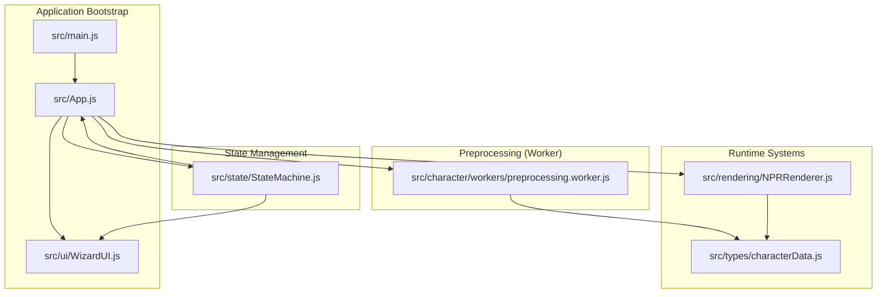
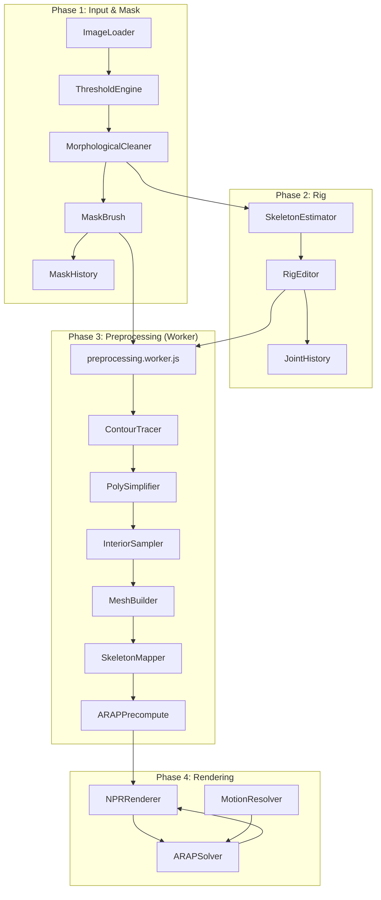
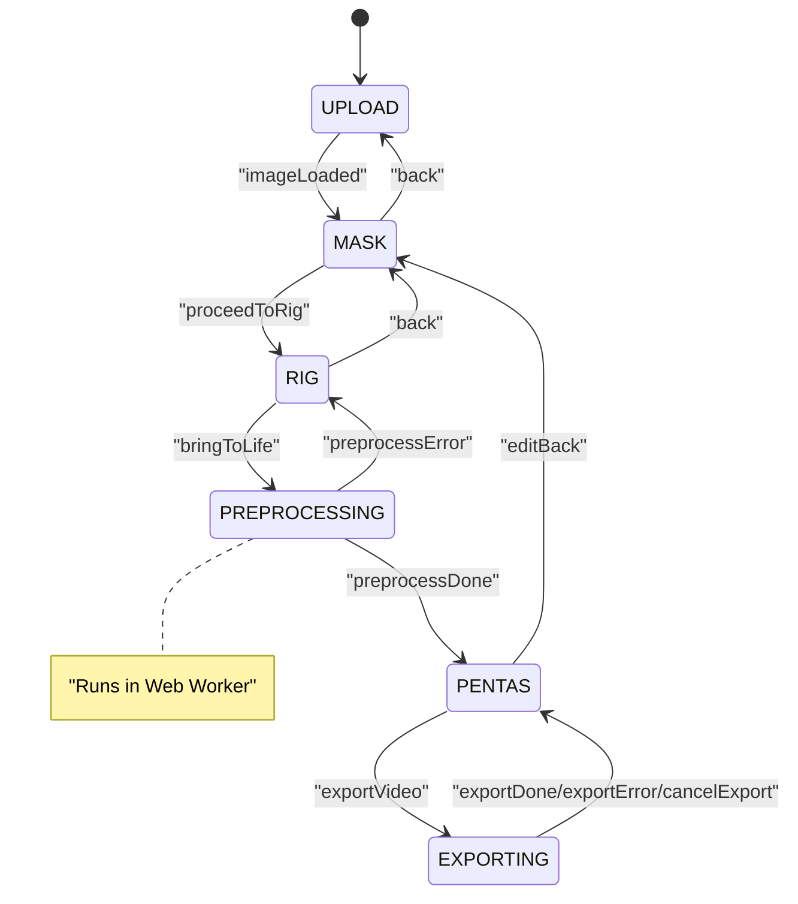
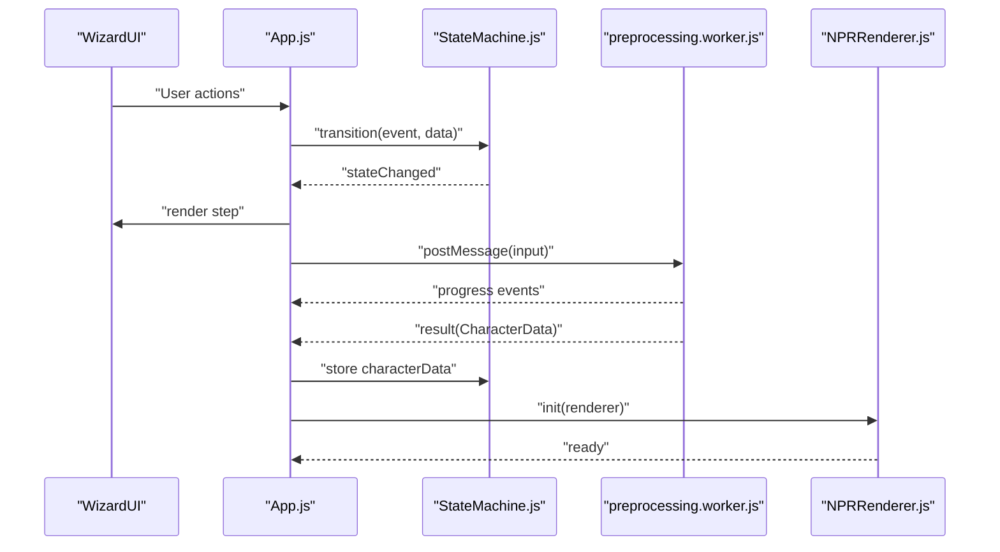
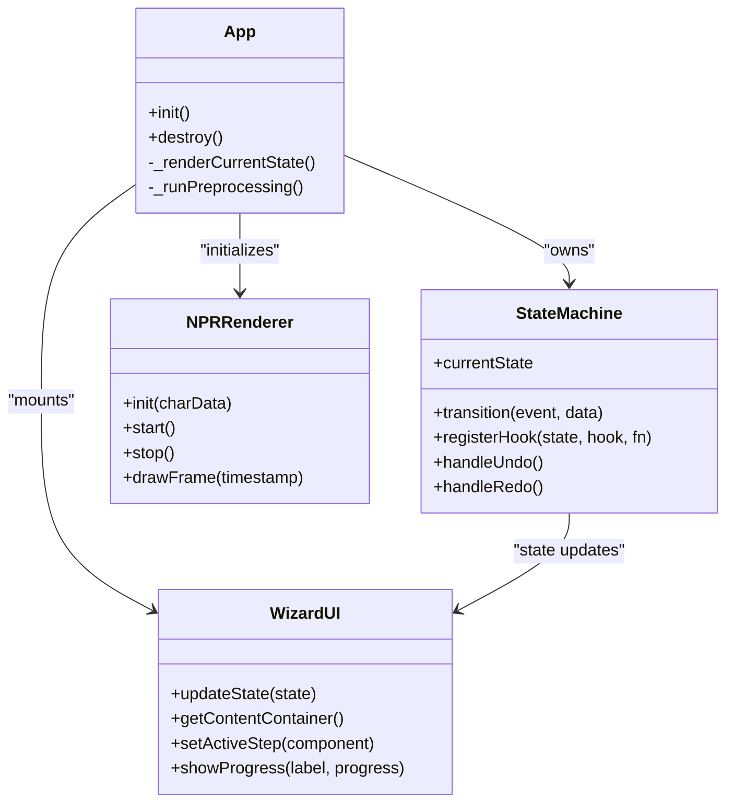
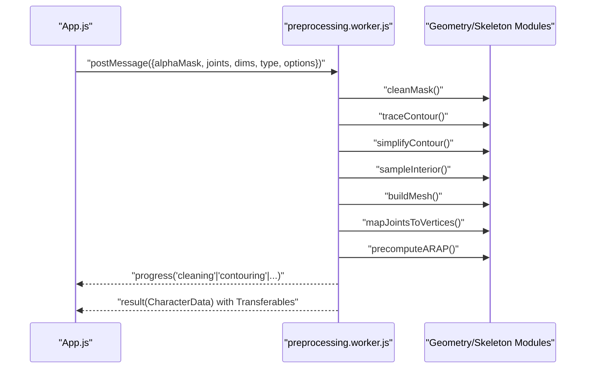
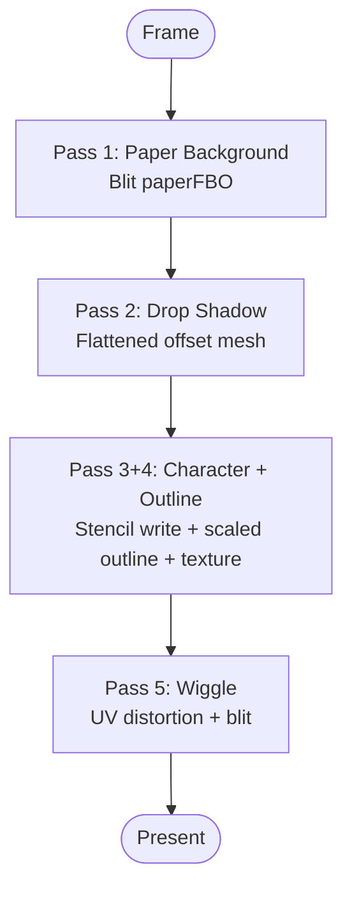
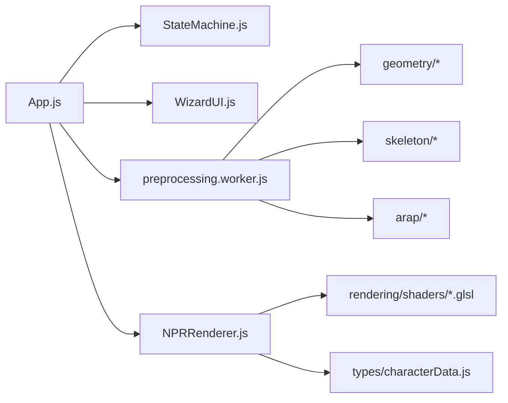

# Architecture Overview

<cite>
**Referenced Files in This Document**
- [architecture/README.md](file://architecture/README.md)
- [architecture/pipeline.md](file://architecture/pipeline.md)
- [architecture/dataflow.md](file://architecture/dataflow.md)
- [architecture/module_design.md](file://architecture/module_design.md)
- [architecture/statemachine.md](file://architecture/statemachine.md)
- [architecture/rendering_pipeline.md](file://architecture/rendering_pipeline.md)
- [architecture/shader_design.md](file://architecture/shader_design.md)
- [src/App.js](file://src/App.js)
- [src/state/StateMachine.js](file://src/state/StateMachine.js)
- [src/main.js](file://src/main.js)
- [src/character/workers/preprocessing.worker.js](file://src/character/workers/preprocessing.worker.js)
- [src/rendering/NPRRenderer.js](file://src/rendering/NPRRenderer.js)
- [src/ui/WizardUI.js](file://src/ui/WizardUI.js)
- [src/types/characterData.js](file://src/types/characterData.js)
- [package.json](file://package.json)
- [index.html](file://index.html)
- [vite.config.js](file://vite.config.js)
</cite>

## Table of Contents
1. [Introduction](#introduction)
2. [Project Structure](#project-structure)
3. [Core Components](#core-components)
4. [Architecture Overview](#architecture-overview)
5. [Detailed Component Analysis](#detailed-component-analysis)
6. [Dependency Analysis](#dependency-analysis)
7. [Performance Considerations](#performance-considerations)
8. [Troubleshooting Guide](#troubleshooting-guide)
9. [Conclusion](#conclusion)
10. [Appendices](#appendices)

## Introduction
This document presents the architectural design of PaperAlive, a browser-native system that converts raster images into animated, ARAP-deformable characters with a non-photorealistic (NPR) rendering pipeline. The system follows a five-phase workflow, a state machine-driven wizard, modular separation of concerns, and a worker-based preprocessing architecture. It emphasizes offline-first design, zero-allocation rendering, and a single-mesh paradigm for robust deformation.

## Project Structure
PaperAlive is organized around a clear separation of concerns:
- Core application bootstrap and orchestration live under src/, with App.js as the root component and StateMachine.js managing the wizard flow.
- Feature modules are grouped by domain: image processing, geometry computation, skeleton and rigging, ARAP preprocessing and solver, rendering, motion and interaction, IO/storage, and UI.
- Architecture documents in architecture/ describe the V2 design rationale, pipeline, dataflow, module responsibilities, state machine, rendering pipeline, and shader design.
- Build and test infrastructure are configured via Vite and Vitest.

**Diagram sources**
- [src/main.js:1-17](file://src/main.js#L1-L17)
- [src/App.js:1-505](file://src/App.js#L1-L505)
- [src/ui/WizardUI.js:1-185](file://src/ui/WizardUI.js#L1-L185)
- [src/state/StateMachine.js:1-477](file://src/state/StateMachine.js#L1-L477)
- [src/character/workers/preprocessing.worker.js:1-374](file://src/character/workers/preprocessing.worker.js#L1-L374)
- [src/rendering/NPRRenderer.js:1-880](file://src/rendering/NPRRenderer.js#L1-L880)
- [src/types/characterData.js:1-254](file://src/types/characterData.js#L1-L254)

**Section sources**
- [architecture/README.md:1-104](file://architecture/README.md#L1-L104)
- [architecture/module_design.md:1-976](file://architecture/module_design.md#L1-L976)
- [package.json:1-29](file://package.json#L1-L29)
- [index.html:1-15](file://index.html#L1-L15)
- [vite.config.js:1-29](file://vite.config.js#L1-L29)

## Core Components
- App.js: Root component that owns the StateMachine, mounts UI, mediates between UI events and core systems, and wires lifecycle hooks.
- StateMachine.js: Wizard state machine governing the five-phase workflow, guarded transitions, shared state, and UNDO/REDO routing.
- preprocessing.worker.js: One-shot preprocessing pipeline executed in a Web Worker, producing CharacterData with zero-allocation runtime characteristics.
- NPRRenderer.js: WebGL2-based NPR renderer implementing a five-pass pipeline with stencil-based outlines, paper baking, and wiggle post-process.
- WizardUI.js: Container for the four-step wizard UI, step indicators, and dynamic content mounting.
- characterData.js: Central runtime data structure and type definitions for CharacterData, geometry, ARAP data, and related structures.

**Section sources**
- [src/App.js:1-505](file://src/App.js#L1-L505)
- [src/state/StateMachine.js:1-477](file://src/state/StateMachine.js#L1-L477)
- [src/character/workers/preprocessing.worker.js:1-374](file://src/character/workers/preprocessing.worker.js#L1-L374)
- [src/rendering/NPRRenderer.js:1-880](file://src/rendering/NPRRenderer.js#L1-L880)
- [src/ui/WizardUI.js:1-185](file://src/ui/WizardUI.js#L1-L185)
- [src/types/characterData.js:1-254](file://src/types/characterData.js#L1-L254)

## Architecture Overview
PaperAlive’s architecture centers on a five-phase workflow orchestrated by a state machine and modularized by domain. The system avoids server dependencies and uses a single-mesh paradigm with ARAP deformation and a WebGL2 NPR renderer.

**Diagram sources**
- [architecture/pipeline.md:1-542](file://architecture/pipeline.md#L1-L542)
- [src/character/workers/preprocessing.worker.js:1-374](file://src/character/workers/preprocessing.worker.js#L1-L374)
- [src/rendering/NPRRenderer.js:1-880](file://src/rendering/NPRRenderer.js#L1-L880)

**Section sources**
- [architecture/pipeline.md:1-542](file://architecture/pipeline.md#L1-L542)
- [architecture/dataflow.md:1-598](file://architecture/dataflow.md#L1-L598)
- [architecture/module_design.md:1-976](file://architecture/module_design.md#L1-L976)

## Detailed Component Analysis

### State Machine Pattern Implementation
The state machine governs the wizard flow and enforces guarded transitions. It maintains shared state across phases and routes UNDO/REDO actions to active steps.

**Diagram sources**
- [architecture/statemachine.md:14-444](file://architecture/statemachine.md#L14-L444)
- [src/state/StateMachine.js:56-82](file://src/state/StateMachine.js#L56-L82)

**Section sources**
- [architecture/statemachine.md:1-444](file://architecture/statemachine.md#L1-L444)
- [src/state/StateMachine.js:1-477](file://src/state/StateMachine.js#L1-L477)

### Five-Phase Workflow and Component Relationships
- Phase 1: Input & Mask — Image decoding, thresholding, morphological cleaning, interactive masking, and undo/redo.
- Phase 2: Rig — Character type selection, skeleton estimation/heuristics, rig editing, and joint undo/redo.
- Phase 3: Preprocessing (Worker) — Contour tracing, simplification, interior sampling, mesh building, skeleton mapping, and ARAP precomputation.
- Phase 4: Rendering — Motion resolution, ARAP solver, and NPR rendering pipeline.
- Phase 5: Exporting — Optional video export with codec detection and manual frame capture.

**Diagram sources**
- [src/App.js:95-160](file://src/App.js#L95-L160)
- [src/state/StateMachine.js:289-355](file://src/state/StateMachine.js#L289-L355)
- [src/character/workers/preprocessing.worker.js:34-71](file://src/character/workers/preprocessing.worker.js#L34-L71)
- [src/rendering/NPRRenderer.js:195-234](file://src/rendering/NPRRenderer.js#L195-L234)

**Section sources**
- [architecture/pipeline.md:1-542](file://architecture/pipeline.md#L1-L542)
- [src/App.js:308-328](file://src/App.js#L308-L328)
- [src/character/workers/preprocessing.worker.js:86-192](file://src/character/workers/preprocessing.worker.js#L86-L192)

### Modular Design Principles and MVC-like Separation
- Model: CharacterData and typed arrays encapsulate geometry, ARAP data, and runtime state.
- View: WizardUI renders step-specific UI and updates based on state changes.
- Controller: App.js mediates between UI and state machine; StateMachine.js controls transitions and shared state.
- Domain modules: image, geometry, skeleton, arap, rendering, motion, io, history, ui, utils.

**Diagram sources**
- [src/App.js:35-505](file://src/App.js#L35-L505)
- [src/state/StateMachine.js:137-477](file://src/state/StateMachine.js#L137-L477)
- [src/ui/WizardUI.js:21-185](file://src/ui/WizardUI.js#L21-L185)
- [src/rendering/NPRRenderer.js:112-880](file://src/rendering/NPRRenderer.js#L112-L880)

**Section sources**
- [architecture/module_design.md:154-800](file://architecture/module_design.md#L154-L800)
- [src/App.js:158-505](file://src/App.js#L158-L505)
- [src/state/StateMachine.js:184-477](file://src/state/StateMachine.js#L184-L477)

### Worker-Based Preprocessing Architecture
The preprocessing pipeline runs entirely in a Web Worker to keep the main thread responsive. It serializes TypedArrays for zero-copy transfer and emits progress updates.

**Diagram sources**
- [src/App.js:308-328](file://src/App.js#L308-L328)
- [src/character/workers/preprocessing.worker.js:34-71](file://src/character/workers/preprocessing.worker.js#L34-L71)
- [src/character/workers/preprocessing.worker.js:86-192](file://src/character/workers/preprocessing.worker.js#L86-L192)

**Section sources**
- [architecture/dataflow.md:586-598](file://architecture/dataflow.md#L586-L598)
- [src/character/workers/preprocessing.worker.js:28-374](file://src/character/workers/preprocessing.worker.js#L28-L374)

### WebGL Rendering System
The NPR renderer composes five passes: paper background (FBO blit), drop shadow, character with stencil-based outline, and wiggle post-process. It supports context loss/recovery, auto-save, and configurable features.

**Diagram sources**
- [architecture/rendering_pipeline.md:1-542](file://architecture/rendering_pipeline.md#L1-L542)
- [src/rendering/NPRRenderer.js:463-486](file://src/rendering/NPRRenderer.js#L463-L486)
- [src/rendering/NPRRenderer.js:550-616](file://src/rendering/NPRRenderer.js#L550-L616)
- [src/rendering/NPRRenderer.js:627-663](file://src/rendering/NPRRenderer.js#L627-L663)

**Section sources**
- [architecture/shader_design.md:1-444](file://architecture/shader_design.md#L1-L444)
- [src/rendering/NPRRenderer.js:195-880](file://src/rendering/NPRRenderer.js#L195-L880)

## Dependency Analysis
- Technology stack: WebGL2, Vite, Delaunator, Vitest, jsdom for tests.
- External dependencies: Delaunator for triangulation; Vite for dev/build/test; jsdom for test environments.
- Internal dependencies: App.js depends on StateMachine.js, WizardUI.js, and rendering/storage modules; StateMachine.js coordinates UI and lifecycle hooks; preprocessing.worker.js depends on geometry and skeleton modules; NPRRenderer.js depends on shaders and MeshPuppet.

**Diagram sources**
- [architecture/module_design.md:14-97](file://architecture/module_design.md#L14-L97)
- [src/App.js:11-22](file://src/App.js#L11-L22)
- [src/character/workers/preprocessing.worker.js:18-26](file://src/character/workers/preprocessing.worker.js#L18-L26)
- [src/rendering/NPRRenderer.js:20-32](file://src/rendering/NPRRenderer.js#L20-L32)

**Section sources**
- [package.json:25-27](file://package.json#L25-L27)
- [vite.config.js:14-27](file://vite.config.js#L14-L27)

## Performance Considerations
- Zero-allocation render loop: No new Array/Float32Array/Object allocations occur inside requestAnimationFrame callbacks.
- Single-mesh paradigm: A single textured mesh eliminates gaps and reduces complexity.
- Vertex budget ≤ 400: Ensures 50–60 fps on typical hardware.
- Dual Cholesky factors: Separate factorizations for motion-clip and IK modes.
- Pre-baked paper texture: Reduces per-frame cost of procedural noise.
- Preserve drawing buffer disabled: Avoids unnecessary overhead.
- CSR cotangent weights: Eliminates Map-based lookups and garbage collection pauses.
- Normalized grid spacing: Adapts sampling to image size.

[No sources needed since this section provides general guidance]

## Troubleshooting Guide
- Fatal errors: Any state can emit a fatal error event to reset to the upload state.
- Undo/Redo: Handled in-place by active steps; availability depends on current state.
- Context loss: WebGL context loss triggers a stop of the render loop, overlay notification, and recreation of all WebGL objects upon restore.
- Export failures: Codec detection precedes MediaRecorder instantiation; errors revert to the previous state with user feedback.

**Section sources**
- [src/state/StateMachine.js:289-320](file://src/state/StateMachine.js#L289-L320)
- [src/state/StateMachine.js:389-445](file://src/state/StateMachine.js#L389-L445)
- [src/rendering/NPRRenderer.js:665-701](file://src/rendering/NPRRenderer.js#L665-L701)
- [src/rendering/NPRRenderer.js:761-793](file://src/rendering/NPRRenderer.js#L761-L793)

## Conclusion
PaperAlive’s architecture balances modularity, performance, and user experience. The five-phase workflow, state machine-driven wizard, worker-based preprocessing, and WebGL2 NPR renderer collectively deliver a robust, offline-first, browser-native animation pipeline. The design constraints and architectural patterns ensure predictable performance and maintainable code.

## Appendices
- System boundaries: Main thread (UI, state, rendering coordination), Web Worker (preprocessing), WebGL2 (GPU rendering), IndexedDB (image storage), localStorage (geometry).
- Data structures: CharacterData is the single source of truth, with typed arrays and CSR formats enabling zero-allocation runtime.

[No sources needed since this section summarizes without analyzing specific files]