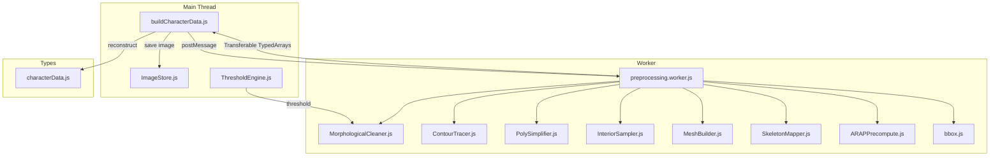
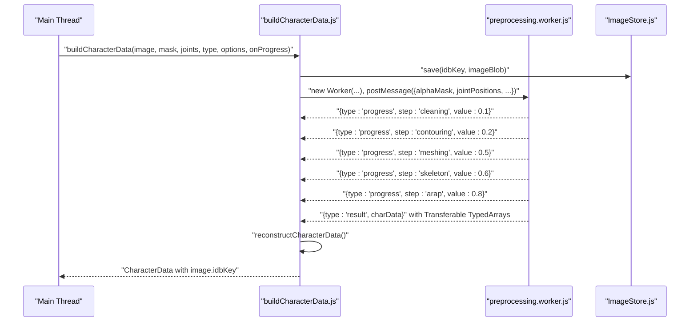
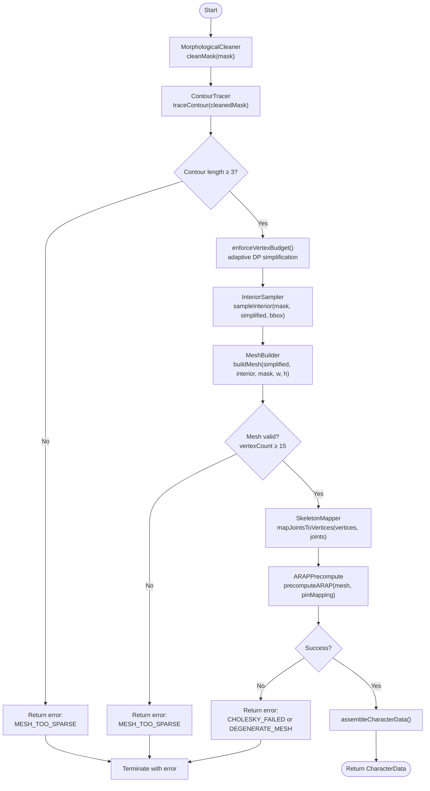
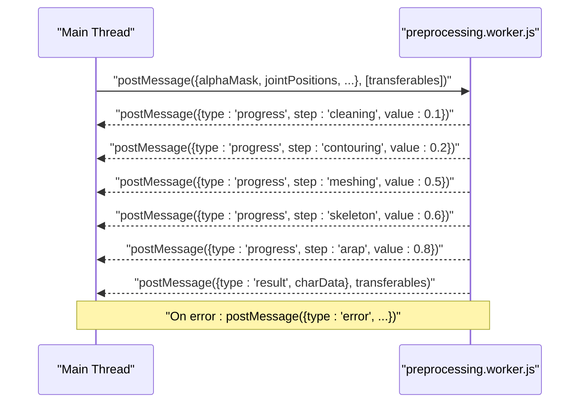
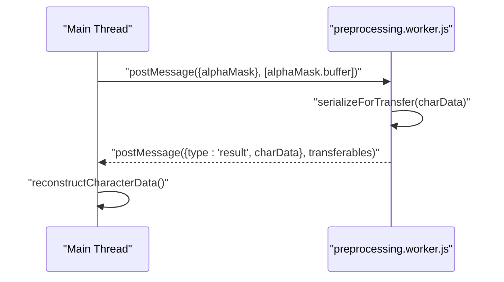
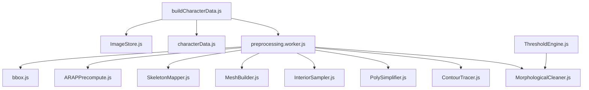

# Data Processing Pipeline

<cite>
**Referenced Files in This Document**
- [buildCharacterData.js](file://src/character/buildCharacterData.js)
- [preprocessing.worker.js](file://src/character/workers/preprocessing.worker.js)
- [MorphologicalCleaner.js](file://src/geometry/MorphologicalCleaner.js)
- [ContourTracer.js](file://src/geometry/ContourTracer.js)
- [PolySimplifier.js](file://src/geometry/PolySimplifier.js)
- [InteriorSampler.js](file://src/geometry/InteriorSampler.js)
- [MeshBuilder.js](file://src/geometry/MeshBuilder.js)
- [SkeletonMapper.js](file://src/skeleton/SkeletonMapper.js)
- [ARAPPrecompute.js](file://src/arap/ARAPPrecompute.js)
- [characterData.js](file://src/types/characterData.js)
- [bbox.js](file://src/utils/bbox.js)
- [ThresholdEngine.js](file://src/image/ThresholdEngine.js)
- [ImageStore.js](file://src/io/ImageStore.js)
- [pipeline.md](file://architecture/pipeline.md)
- [dataflow.md](file://architecture/dataflow.md)
</cite>

## Table of Contents
1. [Introduction](#introduction)
2. [Project Structure](#project-structure)
3. [Core Components](#core-components)
4. [Architecture Overview](#architecture-overview)
5. [Detailed Component Analysis](#detailed-component-analysis)
6. [Dependency Analysis](#dependency-analysis)
7. [Performance Considerations](#performance-considerations)
8. [Troubleshooting Guide](#troubleshooting-guide)
9. [Conclusion](#conclusion)
10. [Appendices](#appendices)

## Introduction
This document explains PaperAlive’s worker-based data processing pipeline that transforms raw images and user-provided joint positions into a runtime-ready CharacterData structure. The pipeline runs entirely in a Web Worker to keep the main thread responsive, and it integrates three major domains:
- Image processing: thresholding and morphological cleaning to produce a robust binary mask
- Geometry algorithms: contour tracing, simplification, interior sampling, and mesh building
- Skeleton estimation: mapping joints to mesh vertices and ARAP precomputation for animation

It covers worker communication patterns, message protocols, data serialization strategies, morphological cleaning, contour simplification, mesh optimization, fallback mechanisms, error handling, and practical examples for initialization, validation, and performance monitoring.

## Project Structure
The pipeline spans several modules grouped by responsibility:
- Character orchestration and worker lifecycle: buildCharacterData.js and preprocessing.worker.js
- Geometry: MorphologicalCleaner, ContourTracer, PolySimplifier, InteriorSampler, MeshBuilder
- Skeleton: SkeletonMapper
- ARAP: ARAPPrecompute
- Types and utilities: characterData.js, bbox.js, ThresholdEngine.js, ImageStore.js
- Architecture docs: pipeline.md, dataflow.md

**Diagram sources**
- [buildCharacterData.js:71-153](file://src/character/buildCharacterData.js#L71-L153)
- [preprocessing.worker.js:34-71](file://src/character/workers/preprocessing.worker.js#L34-L71)
- [MorphologicalCleaner.js:26-54](file://src/geometry/MorphologicalCleaner.js#L26-L54)
- [ContourTracer.js:31-54](file://src/geometry/ContourTracer.js#L31-L54)
- [PolySimplifier.js:21-49](file://src/geometry/PolySimplifier.js#L21-L49)
- [InteriorSampler.js:25-50](file://src/geometry/InteriorSampler.js#L25-L50)
- [MeshBuilder.js:35-137](file://src/geometry/MeshBuilder.js#L35-L137)
- [SkeletonMapper.js:27-83](file://src/skeleton/SkeletonMapper.js#L27-L83)
- [ARAPPrecompute.js:206-296](file://src/arap/ARAPPrecompute.js#L206-L296)
- [bbox.js:17-47](file://src/utils/bbox.js#L17-L47)
- [characterData.js:139-189](file://src/types/characterData.js#L139-L189)
- [ImageStore.js:79-124](file://src/io/ImageStore.js#L79-L124)
- [ThresholdEngine.js:23-36](file://src/image/ThresholdEngine.js#L23-L36)

**Section sources**
- [pipeline.md:8-233](file://architecture/pipeline.md#L8-L233)
- [dataflow.md:19-112](file://architecture/dataflow.md#L19-L112)

## Core Components
- buildCharacterData.js: Main-thread orchestrator that initializes the Worker, transfers the binary mask as a Transferable, stores the image Blob in IndexedDB, relays progress events, reconstructs typed arrays into CharacterData, and handles errors.
- preprocessing.worker.js: Worker entry point that runs the full pipeline, sends progress updates, serializes results for zero-copy transfer, and returns a fully assembled CharacterData object.
- Geometry modules: MorphologicalCleaner, ContourTracer, PolySimplifier, InteriorSampler, MeshBuilder
- SkeletonMapper: Maps joints to mesh vertices with uniqueness enforcement
- ARAPPrecompute: Computes cotangent weights, builds dual Laplacians, performs Cholesky factorization with fallbacks, and validates results
- Types: characterData.js defines the runtime CharacterData structure and related types
- Utilities: bbox.js provides mask bounding boxes; ThresholdEngine converts ImageData to BinaryMask; ImageStore persists images in IndexedDB

**Section sources**
- [buildCharacterData.js:71-153](file://src/character/buildCharacterData.js#L71-L153)
- [preprocessing.worker.js:86-192](file://src/character/workers/preprocessing.worker.js#L86-L192)
- [characterData.js:139-189](file://src/types/characterData.js#L139-L189)

## Architecture Overview
The pipeline is a one-shot preprocessing job executed in a Web Worker. It takes a BinaryMask and joint positions, produces a validated mesh, assigns joints to vertices, and precomputes ARAP data. The main thread remains responsive by delegating heavy computation to the Worker and using Transferable objects for efficient data movement.

**Diagram sources**
- [buildCharacterData.js:71-153](file://src/character/buildCharacterData.js#L71-L153)
- [preprocessing.worker.js:34-71](file://src/character/workers/preprocessing.worker.js#L34-L71)
- [ImageStore.js:79-124](file://src/io/ImageStore.js#L79-L124)

## Detailed Component Analysis

### Multi-Stage Preprocessing Workflow
The pipeline stages are orchestrated in preprocessing.worker.js and executed in order:
1. Morphological cleaning: closes small gaps, removes border-connected foreground, fills holes, and guards minimum foreground ratio
2. Contour tracing: finds the largest connected component and traces its outer boundary
3. Contour simplification: adaptive Douglas–Peucker to meet vertex budget
4. Interior sampling: normalized grid sampling within the mask
5. Mesh building: pre-filter, Delaunay triangulation, post-filter, adjacency, boundary flags, UV coordinates, centroid
6. Skeleton mapping: nearest-neighbor mapping with uniqueness enforced via BFS
7. ARAP precomputation: cotangent weights (CSR), dual Laplacians, dual Cholesky with fallbacks, NaN validation

**Diagram sources**
- [preprocessing.worker.js:86-192](file://src/character/workers/preprocessing.worker.js#L86-L192)
- [MorphologicalCleaner.js:26-54](file://src/geometry/MorphologicalCleaner.js#L26-L54)
- [ContourTracer.js:31-54](file://src/geometry/ContourTracer.js#L31-L54)
- [preprocessing.worker.js:207-224](file://src/character/workers/preprocessing.worker.js#L207-L224)
- [InteriorSampler.js:25-50](file://src/geometry/InteriorSampler.js#L25-L50)
- [MeshBuilder.js:35-137](file://src/geometry/MeshBuilder.js#L35-L137)
- [SkeletonMapper.js:27-83](file://src/skeleton/SkeletonMapper.js#L27-L83)
- [ARAPPrecompute.js:206-296](file://src/arap/ARAPPrecompute.js#L206-L296)

**Section sources**
- [preprocessing.worker.js:86-192](file://src/character/workers/preprocessing.worker.js#L86-L192)
- [MorphologicalCleaner.js:26-54](file://src/geometry/MorphologicalCleaner.js#L26-L54)
- [ContourTracer.js:31-54](file://src/geometry/ContourTracer.js#L31-L54)
- [preprocessing.worker.js:207-224](file://src/character/workers/preprocessing.worker.js#L207-L224)
- [MeshBuilder.js:35-137](file://src/geometry/MeshBuilder.js#L35-L137)
- [SkeletonMapper.js:27-83](file://src/skeleton/SkeletonMapper.js#L27-L83)
- [ARAPPrecompute.js:206-296](file://src/arap/ARAPPrecompute.js#L206-L296)

### Worker Communication Patterns and Message Protocol
- Main thread creates a Worker and posts initial payload: alphaMask (Transferable), jointPositions, image dimensions, and options
- Worker responds with progress events: { type: "progress", step, value }
- On success: Worker posts { type: "result", charData } with Transferable TypedArrays
- On error: Worker posts { type: "error", errorCode, message, affectedStep }
- Main thread reconstructs typed arrays and resolves/rejects the Promise accordingly

**Diagram sources**
- [buildCharacterData.js:138-152](file://src/character/buildCharacterData.js#L138-L152)
- [preprocessing.worker.js:34-71](file://src/character/workers/preprocessing.worker.js#L34-L71)

**Section sources**
- [buildCharacterData.js:138-152](file://src/character/buildCharacterData.js#L138-L152)
- [preprocessing.worker.js:34-71](file://src/character/workers/preprocessing.worker.js#L34-L71)

### Data Transformation Pipeline: From Raw Images to CharacterData
- ThresholdEngine converts ImageData to BinaryMask using alpha or luminance thresholding
- MorphologicalCleaner cleans the mask to remove noise and ensure a valid foreground region
- ContourTracer extracts the largest connected component’s outer boundary
- PolySimplifier reduces vertex count via adaptive Douglas–Peucker to meet budget
- InteriorSampler generates interior points using a normalized grid
- MeshBuilder triangulates points, filters invalid triangles, computes UVs, adjacency, and boundary flags
- SkeletonMapper assigns joints to vertices with uniqueness enforcement
- ARAPPrecompute builds cotangent weights (CSR), dual Laplacians, dual Cholesky factors, and workspace buffers
- assembleCharacterData packages all outputs into a CharacterData object

**Diagram sources**
- [ThresholdEngine.js:23-36](file://src/image/ThresholdEngine.js#L23-L36)
- [MorphologicalCleaner.js:26-54](file://src/geometry/MorphologicalCleaner.js#L26-L54)
- [ContourTracer.js:31-54](file://src/geometry/ContourTracer.js#L31-L54)
- [PolySimplifier.js:21-49](file://src/geometry/PolySimplifier.js#L21-L49)
- [InteriorSampler.js:25-50](file://src/geometry/InteriorSampler.js#L25-L50)
- [MeshBuilder.js:35-137](file://src/geometry/MeshBuilder.js#L35-L137)
- [SkeletonMapper.js:27-83](file://src/skeleton/SkeletonMapper.js#L27-L83)
- [ARAPPrecompute.js:206-296](file://src/arap/ARAPPrecompute.js#L206-L296)
- [preprocessing.worker.js:243-290](file://src/character/workers/preprocessing.worker.js#L243-L290)

**Section sources**
- [ThresholdEngine.js:23-36](file://src/image/ThresholdEngine.js#L23-L36)
- [MorphologicalCleaner.js:26-54](file://src/geometry/MorphologicalCleaner.js#L26-L54)
- [ContourTracer.js:31-54](file://src/geometry/ContourTracer.js#L31-L54)
- [PolySimplifier.js:21-49](file://src/geometry/PolySimplifier.js#L21-L49)
- [InteriorSampler.js:25-50](file://src/geometry/InteriorSampler.js#L25-L50)
- [MeshBuilder.js:35-137](file://src/geometry/MeshBuilder.js#L35-L137)
- [SkeletonMapper.js:27-83](file://src/skeleton/SkeletonMapper.js#L27-L83)
- [ARAPPrecompute.js:206-296](file://src/arap/ARAPPrecompute.js#L206-L296)
- [preprocessing.worker.js:243-290](file://src/character/workers/preprocessing.worker.js#L243-L290)

### Serialization and Transferable Strategy
- The main thread transfers alphaMask as a Transferable to avoid copying memory
- The worker serializes CharacterData by converting CholeskyFactor instances into plain objects and collecting all TypedArray buffers for transfer
- The main thread reconstructs CholeskyFactor instances from serialized objects and attaches the image Blob key

**Diagram sources**
- [buildCharacterData.js:138-152](file://src/character/buildCharacterData.js#L138-L152)
- [preprocessing.worker.js:318-357](file://src/character/workers/preprocessing.worker.js#L318-L357)
- [buildCharacterData.js:48-52](file://src/character/buildCharacterData.js#L48-L52)

**Section sources**
- [buildCharacterData.js:138-152](file://src/character/buildCharacterData.js#L138-L152)
- [preprocessing.worker.js:318-357](file://src/character/workers/preprocessing.worker.js#L318-L357)
- [buildCharacterData.js:48-52](file://src/character/buildCharacterData.js#L48-L52)

### Morphological Cleaning
- Closing (dilation followed by erosion) to fill small gaps
- Edge flood-fill to remove foreground touching borders
- Hole filling from the foreground centroid
- Foreground guard: if less than 3%, return error

**Section sources**
- [MorphologicalCleaner.js:26-54](file://src/geometry/MorphologicalCleaner.js#L26-L54)

### Contour Tracing and Simplification
- Largest connected component by pixel count
- Moore-neighbor tracing to produce a closed polygon
- Adaptive simplification via Douglas–Peucker with increasing epsilon until vertex budget is met

**Section sources**
- [ContourTracer.js:31-54](file://src/geometry/ContourTracer.js#L31-L54)
- [preprocessing.worker.js:207-224](file://src/character/workers/preprocessing.worker.js#L207-L224)
- [PolySimplifier.js:21-49](file://src/geometry/PolySimplifier.js#L21-L49)

### Mesh Building and Optimization
- Pre-filter removes points closer than 1.5 pixels (prioritizing boundary)
- Delaunay triangulation via Delaunator
- Post-filter removes triangles with area < 0.5 px² or centroids outside the mask
- Guard ensures at least 15 vertices remain
- Computes UV coordinates, adjacency, boundary flags, and centroid

**Section sources**
- [MeshBuilder.js:35-137](file://src/geometry/MeshBuilder.js#L35-L137)

### Skeleton Mapping
- Greedy nearest-neighbor assignment sorted by distance
- Uniqueness enforced via BFS from used vertices to find the next closest unused vertex
- Marks “too far” joints (> 20px) for user feedback

**Section sources**
- [SkeletonMapper.js:27-83](file://src/skeleton/SkeletonMapper.js#L27-L83)

### ARAP Precomputation and Fallbacks
- Cotangent weights computed per edge with clamping and mandatory upper/lower bounds
- Dual Laplacians built (all pinned and free), with regularization for the free mode
- Dual Cholesky factorization attempted with cotangent weights; falls back to uniform weights if needed
- NaN sentinel check validates results; returns structured errors on failure

**Section sources**
- [ARAPPrecompute.js:206-296](file://src/arap/ARAPPrecompute.js#L206-L296)

### Worker Initialization, Data Validation, and Performance Monitoring
- Worker initialization: create a module-type Worker using Vite’s worker URL resolution
- Data validation: early exits on insufficient contour length, mesh sparsity, or mask too small
- Performance monitoring: timestamps around the pipeline to compute preprocessing duration; progress events provide coarse-grained timing feedback

**Section sources**
- [buildCharacterData.js:71-77](file://src/character/buildCharacterData.js#L71-L77)
- [preprocessing.worker.js:87-178](file://src/character/workers/preprocessing.worker.js#L87-L178)

## Dependency Analysis
The pipeline exhibits strong cohesion within each stage and low coupling between modules. The worker boundary clearly separates main-thread concerns (image storage, progress relay, reconstruction) from heavy computation (geometry and ARAP).

**Diagram sources**
- [buildCharacterData.js:71-153](file://src/character/buildCharacterData.js#L71-L153)
- [preprocessing.worker.js:18-26](file://src/character/workers/preprocessing.worker.js#L18-L26)
- [characterData.js:139-189](file://src/types/characterData.js#L139-L189)
- [ImageStore.js:79-124](file://src/io/ImageStore.js#L79-L124)
- [ThresholdEngine.js:23-36](file://src/image/ThresholdEngine.js#L23-L36)

**Section sources**
- [buildCharacterData.js:71-153](file://src/character/buildCharacterData.js#L71-L153)
- [preprocessing.worker.js:18-26](file://src/character/workers/preprocessing.worker.js#L18-L26)

## Performance Considerations
- Zero-copy data transfer: alphaMask and all geometry/ARAP TypedArrays are transferred rather than cloned
- Vertex budget enforcement: iterative simplification prevents excessive vertex counts
- CSR format for cotangent weights and Laplacian improves cache locality and avoids Map lookups
- Pre-baked paper textures and stencil-based outline reduce per-frame GPU overhead
- Dual Cholesky enables strategy switching without recomputation

[No sources needed since this section provides general guidance]

## Troubleshooting Guide
Common error codes and their likely causes:
- MASK_TOO_SMALL: Foreground ratio below threshold after cleaning
- MESH_TOO_SPARSE: Fewer than 3 points after pre-filter or fewer than 15 vertices after filtering
- CHOLESKY_FAILED: Both cotangent and uniform weight Cholesky factorizations failed
- DEGENERATE_MESH: NaN detected in Cholesky factor values
- WORKER_CRASHED: Unhandled exception in the Worker

Error propagation:
- Each stage returns a structured result with an error code and affected step
- The worker forwards the first encountered error to the main thread
- The main thread rejects the Promise with an error carrying errorCode and affectedStep

**Section sources**
- [characterData.js:192-205](file://src/types/characterData.js#L192-L205)
- [MorphologicalCleaner.js:46-52](file://src/geometry/MorphologicalCleaner.js#L46-L52)
- [MeshBuilder.js:39-77](file://src/geometry/MeshBuilder.js#L39-L77)
- [ARAPPrecompute.js:243-267](file://src/arap/ARAPPrecompute.js#L243-L267)
- [preprocessing.worker.js:93-119](file://src/character/workers/preprocessing.worker.js#L93-L119)
- [buildCharacterData.js:111-119](file://src/character/buildCharacterData.js#L111-L119)

## Conclusion
PaperAlive’s preprocessing pipeline is a robust, worker-based system that cleanly separates concerns across image processing, geometry, skeleton mapping, and ARAP precomputation. It leverages Transferable objects for efficient data movement, enforces vertex budgets, and includes comprehensive fallbacks and error reporting. The result is a fully optimized CharacterData ready for real-time animation and rendering.

[No sources needed since this section summarizes without analyzing specific files]

## Appendices

### Worker Initialization Example
- Create a Worker using the module-type Worker constructor with the worker URL resolved by the bundler
- Ensure the worker script path matches the declared module path

**Section sources**
- [buildCharacterData.js:71-77](file://src/character/buildCharacterData.js#L71-L77)

### Data Validation Checklist
- Verify alphaMask Transferable integrity: after transfer, the main thread must not access the original buffer
- Confirm progress events arrive in order and reach completion
- Validate reconstructed CharacterData includes all required geometry and ARAP fields

**Section sources**
- [buildCharacterData.js:138-152](file://src/character/buildCharacterData.js#L138-L152)
- [preprocessing.worker.js:318-357](file://src/character/workers/preprocessing.worker.js#L318-L357)

### Performance Monitoring Tips
- Measure preprocessing duration using timestamps around the pipeline
- Track vertex count and triangle count in metadata for downstream decisions
- Monitor progress values to identify slow stages and tune parameters (e.g., vertexBudget, dpEpsilonMin)

**Section sources**
- [preprocessing.worker.js:87-178](file://src/character/workers/preprocessing.worker.js#L87-L178)
- [characterData.js:146-152](file://src/types/characterData.js#L146-L152)