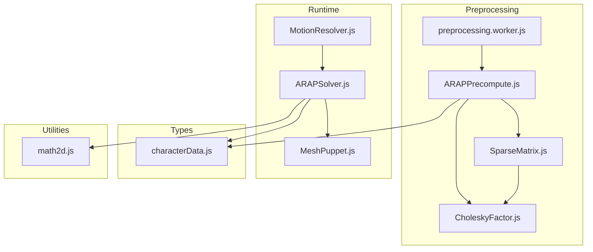
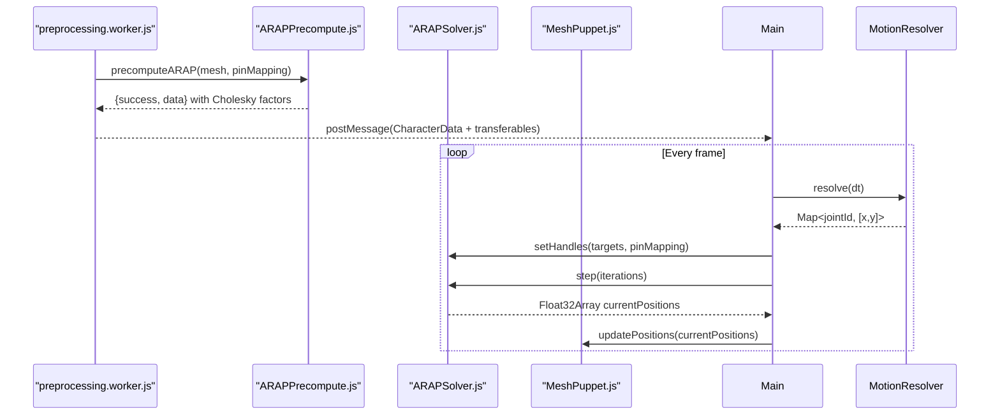
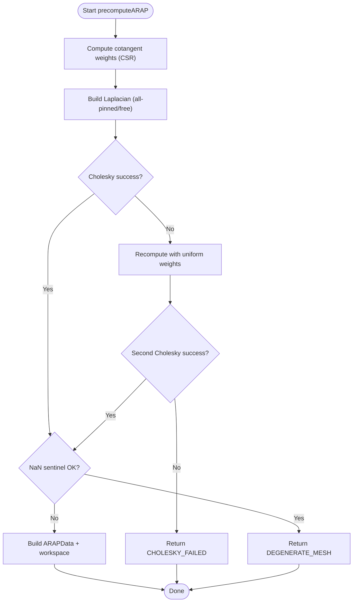
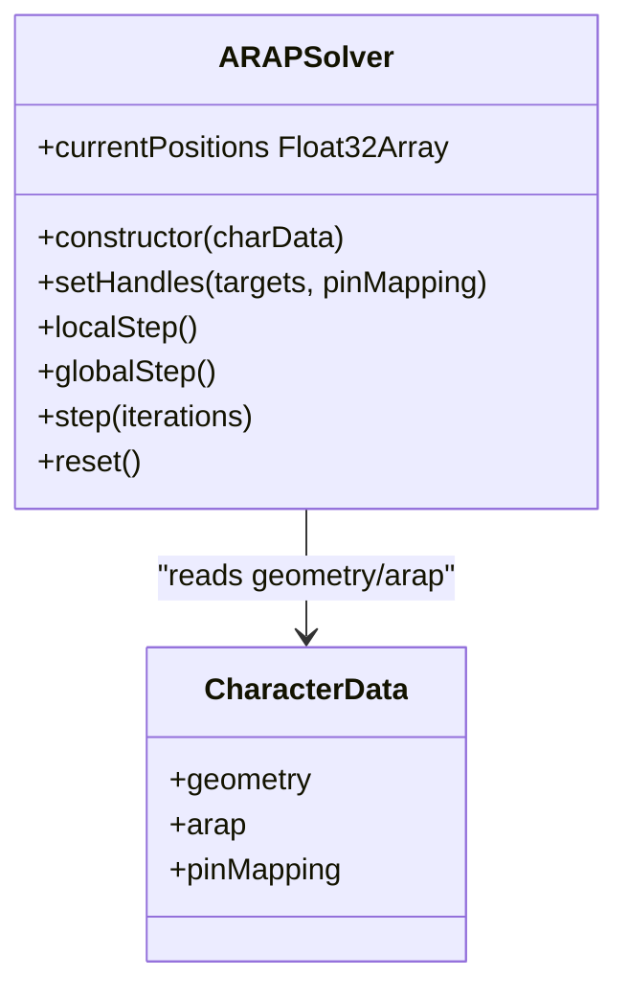
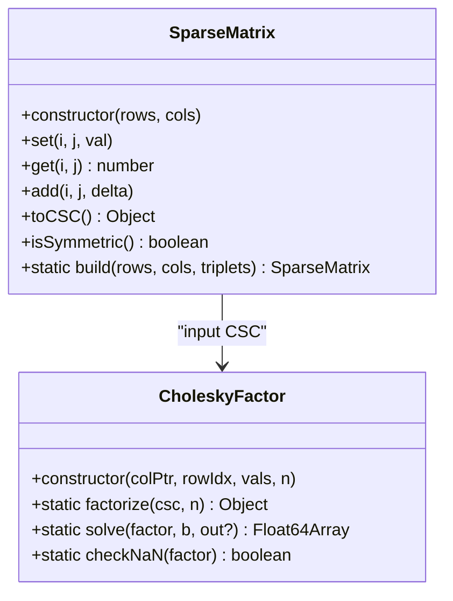
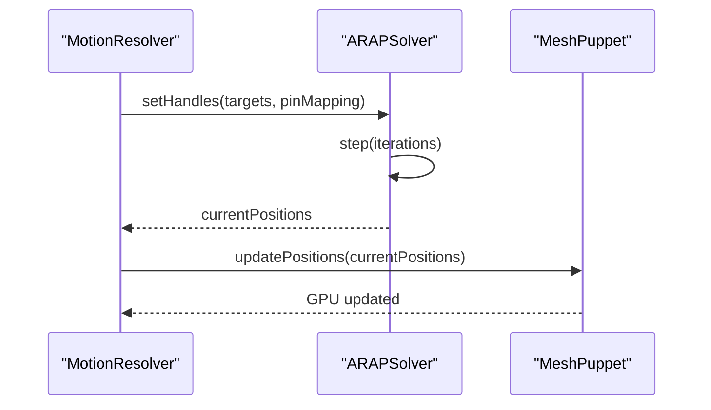
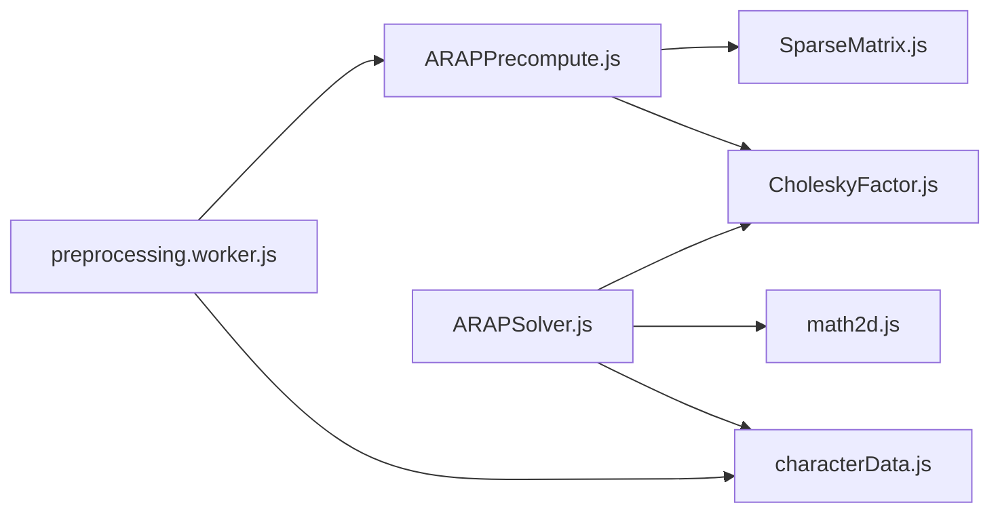

# Physics Simulation Architecture

<cite>
**Referenced Files in This Document**
- [ARAPPrecompute.js](file://src/arap/ARAPPrecompute.js)
- [ARAPSolver.js](file://src/arap/ARAPSolver.js)
- [SparseMatrix.js](file://src/arap/sparse/SparseMatrix.js)
- [CholeskyFactor.js](file://src/arap/sparse/CholeskyFactor.js)
- [arapTestFixture.js](file://src/arap/arapTestFixture.js)
- [characterData.js](file://src/types/characterData.js)
- [preprocessing.worker.js](file://src/character/workers/preprocessing.worker.js)
- [math2d.js](file://src/utils/math2d.js)
- [rendering_pipeline.md](file://architecture/rendering_pipeline.md)
- [MotionResolver.js](file://src/motion/MotionResolver.js)
- [MeshPuppet.js](file://src/rendering/MeshPuppet.js)
- [ARAPPrecompute.test.js](file://src/arap/ARAPPrecompute.test.js)
- [ARAPSolver.test.js](file://src/arap/ARAPSolver.test.js)
- [SparseMatrix.test.js](file://src/arap/sparse/SparseMatrix.test.js)
- [CholeskyFactor.test.js](file://src/arap/sparse/CholeskyFactor.test.js)
</cite>

## Table of Contents
1. [Introduction](#introduction)
2. [Project Structure](#project-structure)
3. [Core Components](#core-components)
4. [Architecture Overview](#architecture-overview)
5. [Detailed Component Analysis](#detailed-component-analysis)
6. [Dependency Analysis](#dependency-analysis)
7. [Performance Considerations](#performance-considerations)
8. [Troubleshooting Guide](#troubleshooting-guide)
9. [Conclusion](#conclusion)
10. [Appendices](#appendices)

## Introduction
This document explains PaperAlive’s ARAP (As-Rigid-As-Possible) physics simulation architecture. It covers the two-stage offline preprocessing (ARAPPrecompute.js) and real-time solver (ARAPSolver.js), the sparse linear algebra stack (SparseMatrix.js and CholeskyFactor.js), and how the simulation integrates with the rendering pipeline and skeleton/motion system. It also documents numerical stability fallbacks, performance optimizations, and practical tuning guidelines.

## Project Structure
The ARAP subsystem is organized around three pillars:
- Offline preprocessing: computes weights, Laplacian, and Cholesky factors once per character.
- Runtime solver: performs local/global steps each frame with minimal allocations.
- Sparse linear algebra: lightweight COO/CSC matrices and dense-like sparse Cholesky for small meshes.

**Diagram sources**
- [preprocessing.worker.js:86-192](file://src/character/workers/preprocessing.worker.js#L86-L192)
- [ARAPPrecompute.js:206-296](file://src/arap/ARAPPrecompute.js#L206-L296)
- [SparseMatrix.js:16-194](file://src/arap/sparse/SparseMatrix.js#L16-L194)
- [CholeskyFactor.js:18-246](file://src/arap/sparse/CholeskyFactor.js#L18-L246)
- [ARAPSolver.js:22-336](file://src/arap/ARAPSolver.js#L22-L336)
- [MotionResolver.js:21-231](file://src/motion/MotionResolver.js#L21-L231)
- [MeshPuppet.js:25-205](file://src/rendering/MeshPuppet.js#L25-L205)
- [characterData.js:139-188](file://src/types/characterData.js#L139-L188)
- [math2d.js:344-419](file://src/utils/math2d.js#L344-L419)

**Section sources**
- [preprocessing.worker.js:86-192](file://src/character/workers/preprocessing.worker.js#L86-L192)
- [ARAPPrecompute.js:206-296](file://src/arap/ARAPPrecompute.js#L206-L296)
- [ARAPSolver.js:22-336](file://src/arap/ARAPSolver.js#L22-L336)
- [characterData.js:139-188](file://src/types/characterData.js#L139-L188)

## Core Components
- ARAPPrecompute.js: Computes cotangent weights, builds symmetric Laplacian matrices (with and without pin constraints), and performs dual Cholesky factorization with robust fallbacks.
- ARAPSolver.js: Performs per-frame local SVD and global back-substitution steps, selects strategies based on joint targets, and updates positions with zero-allocation buffers.
- SparseMatrix.js: COO-format sparse matrix with CSC conversion and symmetry checks.
- CholeskyFactor.js: Dense-like sparse Cholesky decomposition and solves for small meshes (≤400 vertices).
- math2d.js: 2D SVD and utilities used by the solver.
- characterData.js: Central runtime data structure linking geometry, skeleton, pin mapping, and ARAP data.

**Section sources**
- [ARAPPrecompute.js:206-296](file://src/arap/ARAPPrecompute.js#L206-L296)
- [ARAPSolver.js:22-336](file://src/arap/ARAPSolver.js#L22-L336)
- [SparseMatrix.js:16-194](file://src/arap/sparse/SparseMatrix.js#L16-L194)
- [CholeskyFactor.js:18-246](file://src/arap/sparse/CholeskyFactor.js#L18-L246)
- [math2d.js:344-419](file://src/utils/math2d.js#L344-L419)
- [characterData.js:139-188](file://src/types/characterData.js#L139-L188)

## Architecture Overview
The ARAP pipeline is split across preprocessing and runtime:

- Preprocessing (Worker):
  - Mesh and pin mapping are produced by earlier stages.
  - ARAPPrecompute constructs cotangent weights, Laplacians, and Cholesky factors.
  - Results are serialized and transferred to the main thread with zero-copy TypedArrays.

- Runtime:
  - MotionResolver supplies per-frame joint targets (drag overrides, motion clips, or idle).
  - ARAPSolver sets handles, selects strategy (all-pinned vs free with penalty), runs local/global steps, and writes positions.
  - MeshPuppet uploads deformed positions to GPU via a pre-allocated interleaved buffer.

**Diagram sources**
- [preprocessing.worker.js:86-192](file://src/character/workers/preprocessing.worker.js#L86-L192)
- [ARAPPrecompute.js:206-296](file://src/arap/ARAPPrecompute.js#L206-L296)
- [MotionResolver.js:21-231](file://src/motion/MotionResolver.js#L21-L231)
- [ARAPSolver.js:82-325](file://src/arap/ARAPSolver.js#L82-L325)
- [MeshPuppet.js:149-162](file://src/rendering/MeshPuppet.js#L149-L162)

**Section sources**
- [rendering_pipeline.md:17-55](file://architecture/rendering_pipeline.md#L17-L55)
- [preprocessing.worker.js:34-71](file://src/character/workers/preprocessing.worker.js#L34-L71)

## Detailed Component Analysis

### ARAPPrecompute.js
- Cotangent weights (CSR): Computes per-edge weights using triangle cotangents with clamping and symmetry preservation. Outputs flat CSR arrays and neighbor lists.
- Laplacian construction:
  - All-pinned: identity rows for pinned vertices; off-diagonals zeroed appropriately.
  - Free: diagonal regularized by small ε to remove null space.
- Dual Cholesky with fallback:
  - Attempts cotangent-weight Cholesky; if failures, retries with uniform weights; NaN sentinel check; records weight mode on factors.
- Workspace and serialization:
  - Pre-allocates rotation and RHS buffers; serializable Cholesky factors.

**Diagram sources**
- [ARAPPrecompute.js:206-296](file://src/arap/ARAPPrecompute.js#L206-L296)

**Section sources**
- [ARAPPrecompute.js:34-107](file://src/arap/ARAPPrecompute.js#L34-L107)
- [ARAPPrecompute.js:121-188](file://src/arap/ARAPPrecompute.js#L121-L188)
- [ARAPPrecompute.js:206-296](file://src/arap/ARAPPrecompute.js#L206-L296)

### ARAPSolver.js
- Strategy selection:
  - All joints pinned: all-pinned Cholesky.
  - Subset of joints: free Cholesky plus penalty injection.
- Local step (SVD per-vertex):
  - Builds covariance matrix from edge differences and weights, computes 2×2 SVD, extracts rotation ensuring determinant +1.
- Global step (back-substitution):
  - Builds RHS from rotated edges, injects constraints (pinned or penalty), solves L·Lᵀ·x = b, writes back to current positions.
- Zero-allocation design:
  - Pre-allocated buffers for SVD workspace and solve outputs; no new arrays in hot path.

**Diagram sources**
- [ARAPSolver.js:22-336](file://src/arap/ARAPSolver.js#L22-L336)
- [characterData.js:139-188](file://src/types/characterData.js#L139-L188)

**Section sources**
- [ARAPSolver.js:22-59](file://src/arap/ARAPSolver.js#L22-L59)
- [ARAPSolver.js:82-122](file://src/arap/ARAPSolver.js#L82-L122)
- [ARAPSolver.js:136-200](file://src/arap/ARAPSolver.js#L136-L200)
- [ARAPSolver.js:212-309](file://src/arap/ARAPSolver.js#L212-L309)
- [ARAPSolver.js:319-336](file://src/arap/ARAPSolver.js#L319-L336)

### SparseMatrix.js and CholeskyFactor.js
- SparseMatrix (COO):
  - Stores triplets with deduplication; supports get/set/add; converts to CSC with sorted columns.
  - Provides symmetry checks for debugging and validation.
- CholeskyFactor:
  - Dense-like factorization for small sparse matrices (≤400×400).
  - Forward/backward substitution solve with in-place output support.
  - NaN sentinel checker for robustness.

**Diagram sources**
- [SparseMatrix.js:16-194](file://src/arap/sparse/SparseMatrix.js#L16-L194)
- [CholeskyFactor.js:18-246](file://src/arap/sparse/CholeskyFactor.js#L18-L246)

**Section sources**
- [SparseMatrix.js:16-194](file://src/arap/sparse/SparseMatrix.js#L16-L194)
- [CholeskyFactor.js:18-246](file://src/arap/sparse/CholeskyFactor.js#L18-L246)

### Integration with Rendering and Skeleton
- MotionResolver supplies joint targets each frame, determining solver strategy.
- ARAPSolver writes deformed positions into a pre-allocated Float32Array.
- MeshPuppet uploads positions via bufferSubData using a pre-allocated interleaved buffer, avoiding allocations.

**Diagram sources**
- [MotionResolver.js:21-231](file://src/motion/MotionResolver.js#L21-L231)
- [ARAPSolver.js:82-325](file://src/arap/ARAPSolver.js#L82-L325)
- [MeshPuppet.js:149-162](file://src/rendering/MeshPuppet.js#L149-L162)

**Section sources**
- [rendering_pipeline.md:17-55](file://architecture/rendering_pipeline.md#L17-L55)
- [MeshPuppet.js:149-162](file://src/rendering/MeshPuppet.js#L149-L162)

## Dependency Analysis
- ARAPPrecompute depends on SparseMatrix and CholeskyFactor to construct and factorize Laplacians.
- ARAPSolver depends on math2d SVD utilities and reads ARAPData from CharacterData.
- preprocessing.worker orchestrates the pipeline and serializes results for the main thread.

**Diagram sources**
- [ARAPPrecompute.js:16-17](file://src/arap/ARAPPrecompute.js#L16-L17)
- [ARAPSolver.js:14-15](file://src/arap/ARAPSolver.js#L14-L15)
- [preprocessing.worker.js:24-26](file://src/character/workers/preprocessing.worker.js#L24-L26)

**Section sources**
- [ARAPPrecompute.js:16-17](file://src/arap/ARAPPrecompute.js#L16-L17)
- [ARAPSolver.js:14-15](file://src/arap/ARAPSolver.js#L14-L15)
- [preprocessing.worker.js:24-26](file://src/character/workers/preprocessing.worker.js#L24-L26)

## Performance Considerations
- Vertex budget: ≤400 vertices to keep ARAP costs within budget (local step ~O(V·|N(v)|), global step ~O(V)).
- Zero-allocation runtime: pre-allocated buffers for rotations, RHS, and interleaved data; bufferSubData for GPU updates.
- Pre-baked assets: paper background texture baked to an off-screen framebuffer and blitted each frame.
- Stencil-based outline: replaces expensive scaled-hull approach and avoids depth conflicts.
- Context handling: preserveDrawingBuffer=false reduces per-frame overhead; stencil enabled for outline.

**Section sources**
- [rendering_pipeline.md:354-364](file://architecture/rendering_pipeline.md#L354-L364)
- [rendering_pipeline.md:327-344](file://architecture/rendering_pipeline.md#L327-L344)
- [rendering_pipeline.md:92-110](file://architecture/rendering_pipeline.md#L92-L110)

## Troubleshooting Guide
Common issues and diagnostics:
- Cholesky failures: fallback to uniform weights; if still failing, returns CHOLESKY_FAILED.
- Degenerate meshes: fallback triggers; NaN sentinel check ensures robustness.
- Strategy mismatch: verify setHandles receives sufficient joint targets for all-pinned mode.
- Memory leaks: ensure CharacterData is properly disposed and WebGL resources released.

Validation references:
- ARAPPrecompute tests cover weight symmetry, pin rows, factorization, and NaN detection.
- ARAPSolver tests cover strategy selection, local/global steps, and reset behavior.
- SparseMatrix and CholeskyFactor tests validate CSC conversion, symmetry, reconstruction, and NaN checks.

**Section sources**
- [ARAPPrecompute.test.js:16-87](file://src/arap/ARAPPrecompute.test.js#L16-L87)
- [ARAPPrecompute.test.js:89-166](file://src/arap/ARAPPrecompute.test.js#L89-L166)
- [ARAPPrecompute.test.js:168-265](file://src/arap/ARAPPrecompute.test.js#L168-L265)
- [ARAPPrecompute.test.js:267-344](file://src/arap/ARAPPrecompute.test.js#L267-L344)
- [ARAPSolver.test.js:33-100](file://src/arap/ARAPSolver.test.js#L33-L100)
- [ARAPSolver.test.js:102-185](file://src/arap/ARAPSolver.test.js#L102-L185)
- [ARAPSolver.test.js:187-261](file://src/arap/ARAPSolver.test.js#L187-L261)
- [SparseMatrix.test.js:9-51](file://src/arap/sparse/SparseMatrix.test.js#L9-L51)
- [SparseMatrix.test.js:53-146](file://src/arap/sparse/SparseMatrix.test.js#L53-L146)
- [CholeskyFactor.test.js:10-128](file://src/arap/sparse/CholeskyFactor.test.js#L10-L128)
- [CholeskyFactor.test.js:129-231](file://src/arap/sparse/CholeskyFactor.test.js#L129-L231)

## Conclusion
PaperAlive’s ARAP system separates heavy offline computations from a highly optimized runtime solver. The sparse linear algebra stack is tailored for small meshes, enabling interactive performance. Robust fallbacks and zero-allocation design ensure stability and responsiveness. Integration with the rendering pipeline leverages pre-allocated buffers and pre-baked assets for smooth 60 fps playback.

## Appendices

### Parameter Tuning Guidelines
- Cotangent clamping and regularization:
  - Cotangent weights are clamped and averaged per edge; ensure mesh quality remains non-degenerate.
  - Free Laplacian adds small diagonal ε to maintain positive definiteness.
- Iteration count:
  - Two iterations balance speed and convergence; increase cautiously for complex deformations.
- Constraint weight:
  - Penalty strength for IK drag is fixed; tune via external controls if exposed.
- Vertex budget:
  - Keep vertex count ≤400 to meet budget; adjust simplification parameters upstream.

**Section sources**
- [ARAPPrecompute.js:19-21](file://src/arap/ARAPPrecompute.js#L19-L21)
- [ARAPPrecompute.js:181-185](file://src/arap/ARAPPrecompute.js#L181-L185)
- [ARAPSolver.js:17](file://src/arap/ARAPSolver.js#L17)
- [ARAPSolver.js:319-325](file://src/arap/ARAPSolver.js#L319-L325)
- [rendering_pipeline.md:354-364](file://architecture/rendering_pipeline.md#L354-L364)

### Numerical Stability and Fallback Strategies
- Cotangent vs uniform weights:
  - Prefer cotangent weights; fall back to uniform when Cholesky fails.
- NaN detection:
  - Post-factorization NaN check prevents unstable simulations.
- Free-mode regularization:
  - Small diagonal ε stabilizes the free Laplacian.

**Section sources**
- [ARAPPrecompute.js:217-267](file://src/arap/ARAPPrecompute.js#L217-L267)
- [CholeskyFactor.js:237-245](file://src/arap/sparse/CholeskyFactor.js#L237-L245)

### Memory Optimization Techniques
- Pre-allocated buffers:
  - Solver workspace, RHS, and interleaved buffer avoid per-frame allocations.
- Transferable TypedArrays:
  - Worker serializes Cholesky factors and transfers buffers without copying.
- GPU buffer updates:
  - bufferSubData with pre-allocated interleaved buffer minimizes CPU/GPU traffic.

**Section sources**
- [ARAPPrecompute.js:269-296](file://src/arap/ARAPPrecompute.js#L269-L296)
- [preprocessing.worker.js:292-357](file://src/character/workers/preprocessing.worker.js#L292-L357)
- [MeshPuppet.js:149-162](file://src/rendering/MeshPuppet.js#L149-L162)