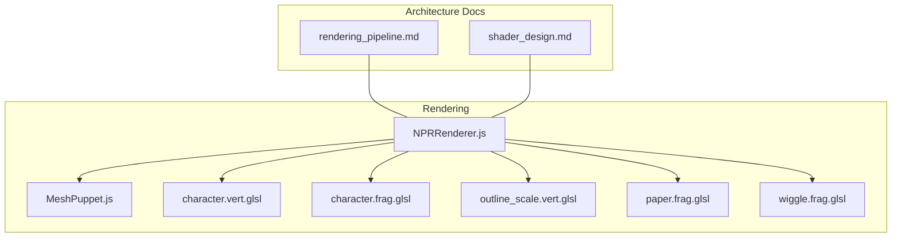
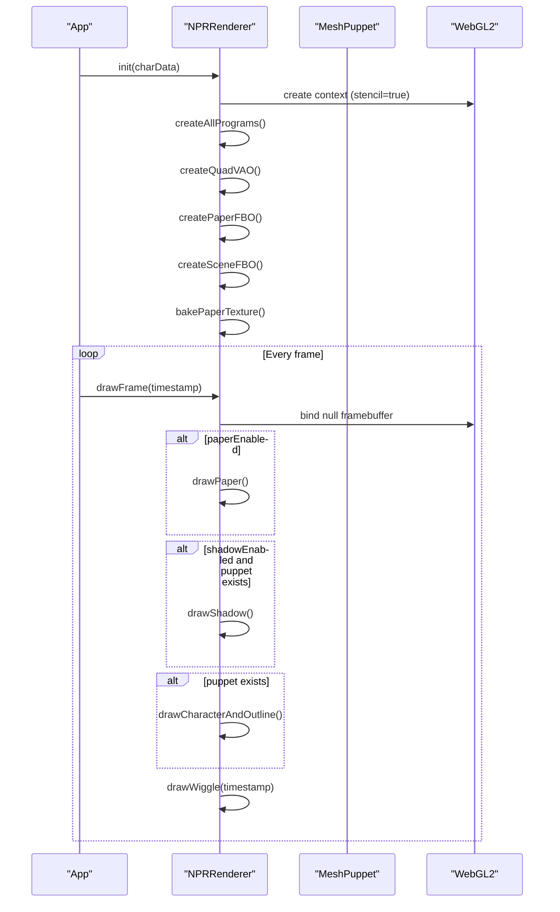
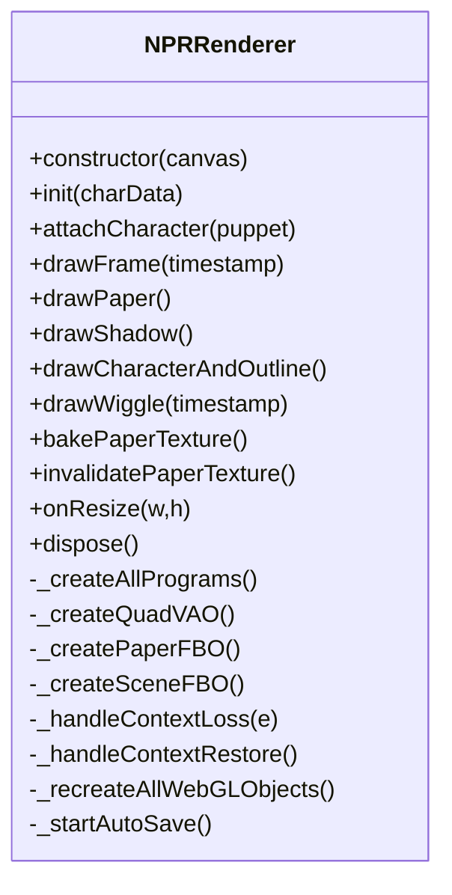
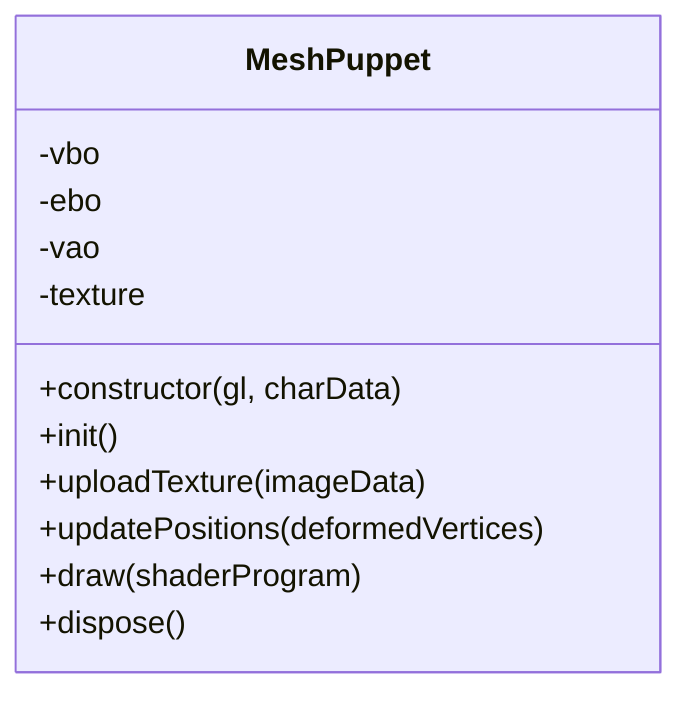
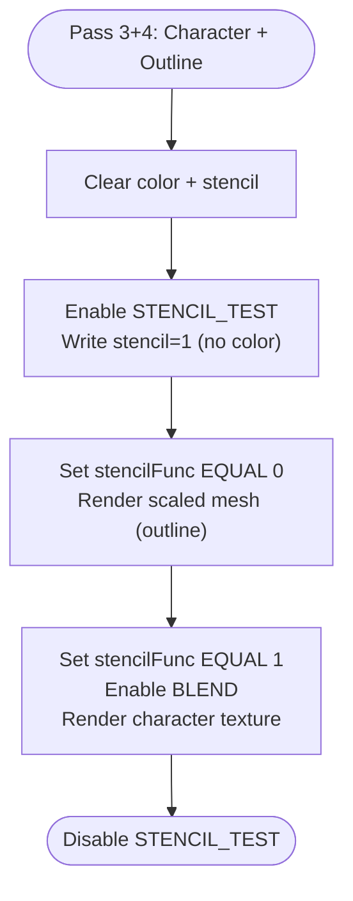
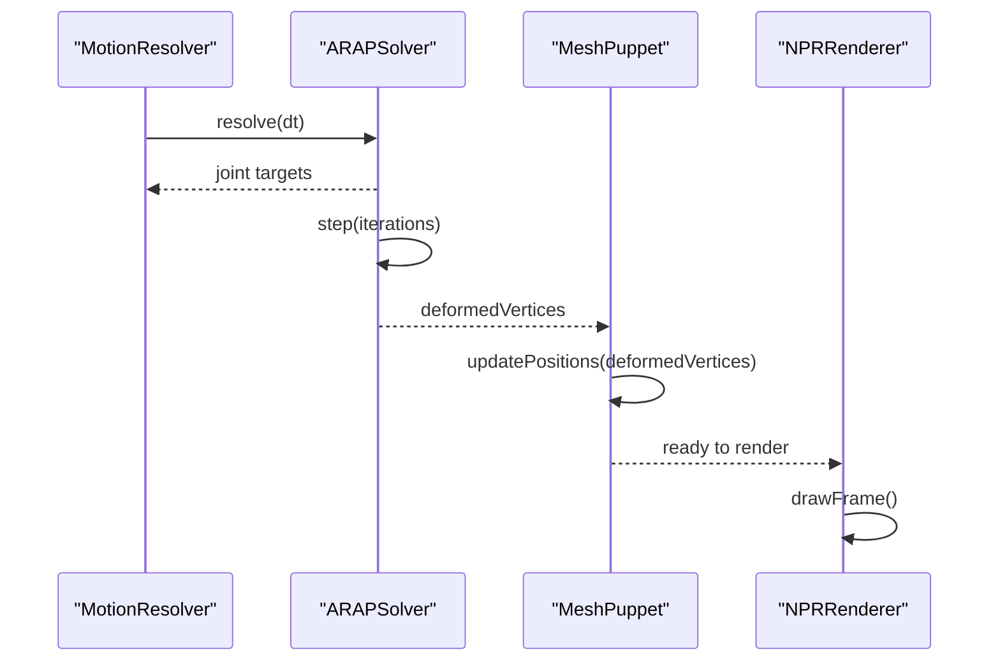
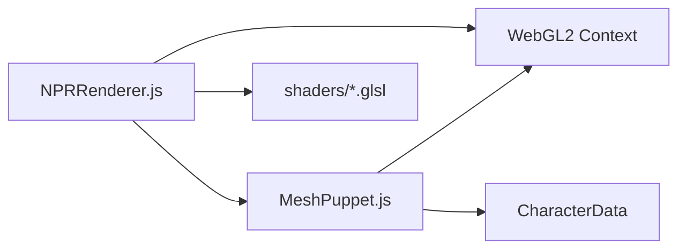

# Rendering Pipeline

<cite>
**Referenced Files in This Document**
- [NPRRenderer.js](file://src/rendering/NPRRenderer.js)
- [MeshPuppet.js](file://src/rendering/MeshPuppet.js)
- [rendering_pipeline.md](file://architecture/rendering_pipeline.md)
- [shader_design.md](file://architecture/shader_design.md)
- [character.vert.glsl](file://src/rendering/shaders/character.vert.glsl)
- [character.frag.glsl](file://src/rendering/shaders/character.frag.glsl)
- [outline_scale.vert.glsl](file://src/rendering/shaders/outline_scale.vert.glsl)
- [paper.frag.glsl](file://src/rendering/shaders/paper.frag.glsl)
- [wiggle.frag.glsl](file://src/rendering/shaders/wiggle.frag.glsl)
- [NPRRenderer.test.js](file://src/rendering/NPRRenderer.test.js)
</cite>

## Table of Contents
1. [Introduction](#introduction)
2. [Project Structure](#project-structure)
3. [Core Components](#core-components)
4. [Architecture Overview](#architecture-overview)
5. [Detailed Component Analysis](#detailed-component-analysis)
6. [Dependency Analysis](#dependency-analysis)
7. [Performance Considerations](#performance-considerations)
8. [Troubleshooting Guide](#troubleshooting-guide)
9. [Conclusion](#conclusion)

## Introduction
This document explains PaperAlive’s WebGL-based NPR (Non-Photorealistic Rendering) pipeline. The system renders a hand-drawn character on a procedurally generated paper background using a five-pass rendering architecture: paper background blit, drop shadow, stencil-based character and outline, and a post-process wiggle effect. It covers the NPRRenderer orchestrator, MeshPuppet vertex animation and deformation, the shader system, and the integration with the physics simulation for real-time character animation.

## Project Structure
The rendering system is organized around a small set of core modules:
- Renderer orchestrator: NPRRenderer.js
- Mesh renderer: MeshPuppet.js
- Shader sources: GLSL files under src/rendering/shaders
- Architecture docs: rendering_pipeline.md, shader_design.md
- Tests: NPRRenderer.test.js validates shader sources and rendering passes

**Diagram sources**
- [NPRRenderer.js:112-185](file://src/rendering/NPRRenderer.js#L112-L185)
- [MeshPuppet.js:25-54](file://src/rendering/MeshPuppet.js#L25-L54)
- [character.vert.glsl:1-17](file://src/rendering/shaders/character.vert.glsl#L1-L17)
- [character.frag.glsl:1-29](file://src/rendering/shaders/character.frag.glsl#L1-L29)
- [outline_scale.vert.glsl:1-20](file://src/rendering/shaders/outline_scale.vert.glsl#L1-L20)
- [paper.frag.glsl:1-55](file://src/rendering/shaders/paper.frag.glsl#L1-L55)
- [wiggle.frag.glsl:1-23](file://src/rendering/shaders/wiggle.frag.glsl#L1-L23)
- [rendering_pipeline.md:17-55](file://architecture/rendering_pipeline.md#L17-L55)
- [shader_design.md:15-49](file://architecture/shader_design.md#L15-L49)

**Section sources**
- [NPRRenderer.js:195-234](file://src/rendering/NPRRenderer.js#L195-L234)
- [rendering_pipeline.md:17-55](file://architecture/rendering_pipeline.md#L17-L55)

## Core Components
- NPRRenderer: WebGL2 context manager, shader compilation, FBO creation, five-pass render orchestration, context loss handling, and auto-save.
- MeshPuppet: Character mesh VBO/EBO/VAO lifecycle, texture upload, and zero-allocation position updates via a pre-allocated interleaved buffer.

Key responsibilities:
- Shader compilation helpers: compileShader and createProgram.
- Five passes: drawPaper, drawShadow, drawCharacterAndOutline (stencil-based), and drawWiggle.
- FBOs: paperFBO (pre-baked paper) and sceneFBO (with stencil) for off-screen rendering.
- Uniform management: per-pass uniforms bound before draw calls.
- Integration: receives deformed vertices from the ARAP solver and updates the mesh each frame.

**Section sources**
- [NPRRenderer.js:58-108](file://src/rendering/NPRRenderer.js#L58-L108)
- [NPRRenderer.js:240-263](file://src/rendering/NPRRenderer.js#L240-L263)
- [NPRRenderer.js:488-663](file://src/rendering/NPRRenderer.js#L488-L663)
- [MeshPuppet.js:68-108](file://src/rendering/MeshPuppet.js#L68-L108)
- [MeshPuppet.js:149-162](file://src/rendering/MeshPuppet.js#L149-L162)

## Architecture Overview
The five-pass pipeline:
1) Paper background: blit pre-baked paperFBO to screen.
2) Drop shadow: draw a flattened, offset character silhouette beneath the character.
3) Character + outline (stencil-based): write stencil for the character interior, then render an outline around the silhouette, then render the character texture inside the stencil.
4) Wiggle post-process: optionally apply UV distortion to the sceneFBO and blit to screen.

**Diagram sources**
- [NPRRenderer.js:195-234](file://src/rendering/NPRRenderer.js#L195-L234)
- [NPRRenderer.js:463-486](file://src/rendering/NPRRenderer.js#L463-L486)
- [NPRRenderer.js:496-508](file://src/rendering/NPRRenderer.js#L496-L508)
- [NPRRenderer.js:517-535](file://src/rendering/NPRRenderer.js#L517-L535)
- [NPRRenderer.js:550-616](file://src/rendering/NPRRenderer.js#L550-L616)
- [NPRRenderer.js:627-663](file://src/rendering/NPRRenderer.js#L627-L663)

**Section sources**
- [rendering_pipeline.md:147-323](file://architecture/rendering_pipeline.md#L147-L323)
- [shader_design.md:15-49](file://architecture/shader_design.md#L15-L49)

## Detailed Component Analysis

### NPRRenderer: Shader Program Management, Vertex Buffers, and Render Targets
- Shader compilation: compileShader compiles a single shader; createProgram links vertex and fragment shaders, detaching and deleting intermediate shader objects upon success.
- Programs: seven programs are compiled and cached (character, stencil, outline scale, paper, blit, shadow, wiggle).
- Fullscreen quad: VAO/VBO for blitting and post-processing passes.
- FBOs: paperFBO (color only) and sceneFBO (color + stencil renderbuffer).
- Paper baking: bakePaperTexture renders procedural paper to paperFBO; invalidatePaperTexture triggers rebake on settings change or resize.
- Render passes:
  - drawPaper: blits paperFBO texture to screen.
  - drawShadow: blends and draws the flattened shadow mesh.
  - drawCharacterAndOutline: stencil-based two-step outline and one-step character texture pass.
  - drawWiggle: optional UV distortion post-process.
- Context loss handling: registers canvas listeners, recreates all WebGL objects on restore, and restarts the render loop.
- Auto-save: periodic autosave of geometry to localStorage.

**Diagram sources**
- [NPRRenderer.js:112-185](file://src/rendering/NPRRenderer.js#L112-L185)
- [NPRRenderer.js:240-263](file://src/rendering/NPRRenderer.js#L240-L263)
- [NPRRenderer.js:269-349](file://src/rendering/NPRRenderer.js#L269-L349)
- [NPRRenderer.js:359-391](file://src/rendering/NPRRenderer.js#L359-L391)
- [NPRRenderer.js:496-663](file://src/rendering/NPRRenderer.js#L496-L663)
- [NPRRenderer.js:707-729](file://src/rendering/NPRRenderer.js#L707-L729)
- [NPRRenderer.js:768-793](file://src/rendering/NPRRenderer.js#L768-L793)

**Section sources**
- [NPRRenderer.js:58-108](file://src/rendering/NPRRenderer.js#L58-L108)
- [NPRRenderer.js:240-263](file://src/rendering/NPRRenderer.js#L240-L263)
- [NPRRenderer.js:269-349](file://src/rendering/NPRRenderer.js#L269-L349)
- [NPRRenderer.js:359-391](file://src/rendering/NPRRenderer.js#L359-L391)
- [NPRRenderer.js:496-663](file://src/rendering/NPRRenderer.js#L496-L663)
- [NPRRenderer.js:707-729](file://src/rendering/NPRRenderer.js#L707-L729)
- [NPRRenderer.js:768-793](file://src/rendering/NPRRenderer.js#L768-L793)

### MeshPuppet: Vertex Animation and Deformation
- Initializes VBO (DYNAMIC_DRAW) and EBO (STATIC_DRAW) with interleaved [x, y, u, v] layout.
- Uses a pre-allocated workspace buffer to avoid allocations each frame; updates positions via bufferSubData.
- Provides draw method to render with any compatible shader program.
- Uploads character texture once and manages its lifetime.

**Diagram sources**
- [MeshPuppet.js:25-54](file://src/rendering/MeshPuppet.js#L25-L54)
- [MeshPuppet.js:68-108](file://src/rendering/MeshPuppet.js#L68-L108)
- [MeshPuppet.js:116-137](file://src/rendering/MeshPuppet.js#L116-L137)
- [MeshPuppet.js:149-162](file://src/rendering/MeshPuppet.js#L149-L162)
- [MeshPuppet.js:170-176](file://src/rendering/MeshPuppet.js#L170-L176)

**Section sources**
- [MeshPuppet.js:68-108](file://src/rendering/MeshPuppet.js#L68-L108)
- [MeshPuppet.js:116-137](file://src/rendering/MeshPuppet.js#L116-L137)
- [MeshPuppet.js:149-162](file://src/rendering/MeshPuppet.js#L149-L162)

### Shader System: GLSL Programs, Uniforms, and Effects
- Programs and uniforms:
  - Paper baking: paper.frag.glsl with u_noiseScale, u_noiseStrength, u_paperColor.
  - Blit: blit.frag.glsl with u_source.
  - Shadow: shadow.vert.glsl/u_canvasSize, shadow.frag.glsl with u_shadowOpacity.
  - Character: character.vert.glsl/a_position/a_uv/u_canvasSize, character.frag.glsl with u_texture, u_brightness, u_saturation.
  - Outline scale: outline_scale.vert.glsl with u_canvasSize, u_meshCenter, u_outlineScale; outline.frag.glsl with u_outlineColor, u_outlineOpacity.
  - Wiggle: wiggle.frag.glsl with u_scene, u_time, u_amplitude, u_frequency, u_spatialFreq.
- Pass-specific logic:
  - Stencil-based outline: STEP B writes stencil; STEP C renders scaled mesh where stencil equals 0; STEP D renders texture where stencil equals 1.
  - Drop shadow: offset and scale Y to flatten the silhouette.
  - Wiggle: dual sine UV distortion applied to sceneFBO texture.

**Diagram sources**
- [NPRRenderer.js:550-616](file://src/rendering/NPRRenderer.js#L550-L616)
- [shader_design.md:210-318](file://architecture/shader_design.md#L210-L318)

**Section sources**
- [shader_design.md:53-166](file://architecture/shader_design.md#L53-L166)
- [shader_design.md:169-207](file://architecture/shader_design.md#L169-L207)
- [shader_design.md:210-318](file://architecture/shader_design.md#L210-L318)
- [shader_design.md:322-350](file://architecture/shader_design.md#L322-L350)

### Integration with Physics Simulation for Real-Time Animation
- The game loop integrates MotionResolver, ARAP solver, and MeshPuppet updates prior to rendering.
- ARAP produces deformedVertices each frame; MeshPuppet.updatePositions writes them into the pre-allocated interleaved buffer and uploads via bufferSubData.
- NPRRenderer.drawFrame executes the five passes after the mesh is updated.

**Diagram sources**
- [rendering_pipeline.md:17-55](file://architecture/rendering_pipeline.md#L17-L55)
- [MeshPuppet.js:149-162](file://src/rendering/MeshPuppet.js#L149-L162)
- [NPRRenderer.js:463-486](file://src/rendering/NPRRenderer.js#L463-L486)

**Section sources**
- [rendering_pipeline.md:17-55](file://architecture/rendering_pipeline.md#L17-L55)
- [MeshPuppet.js:149-162](file://src/rendering/MeshPuppet.js#L149-L162)

## Dependency Analysis
- NPRRenderer depends on:
  - MeshPuppet for mesh buffers and drawing.
  - Shader sources imported via raw loaders.
  - WebGL2 context and state (FBOs, VAOs, textures).
- MeshPuppet depends on:
  - CharacterData geometry and ARAP workspace buffers.
  - WebGL2 for buffer and texture management.

**Diagram sources**
- [NPRRenderer.js:20-32](file://src/rendering/NPRRenderer.js#L20-L32)
- [NPRRenderer.js:123-124](file://src/rendering/NPRRenderer.js#L123-L124)
- [MeshPuppet.js:27-35](file://src/rendering/MeshPuppet.js#L27-L35)

**Section sources**
- [NPRRenderer.js:20-32](file://src/rendering/NPRRenderer.js#L20-L32)
- [MeshPuppet.js:27-35](file://src/rendering/MeshPuppet.js#L27-L35)

## Performance Considerations
- Pre-baked paper: bake once, blit every frame to minimize per-frame computation.
- Stencil-based outline: replaces expensive scaled-hull approach; avoids self-intersections and reduces artifacts.
- Shared VAO and single EBO reduce binding overhead.
- Pre-allocated interleaved buffer and bufferSubData eliminate per-frame allocations.
- Conditional FBO: skip sceneFBO when wiggle is disabled.
- Context setup: preserveDrawingBuffer false and stencil true improve performance and enable stencil outline.
- Frame budget: total idle budget reduced from ~26–46 ms to ~6.2 ms with V2 optimizations.

**Section sources**
- [rendering_pipeline.md:327-367](file://architecture/rendering_pipeline.md#L327-L367)
- [rendering_pipeline.md:527-553](file://architecture/rendering_pipeline.md#L527-L553)
- [shader_design.md:15-49](file://architecture/shader_design.md#L15-L49)

## Troubleshooting Guide
- WebGL context lost: renderer listens for webglcontextlost and webglcontextrestored, stops the render loop, recreates all WebGL objects, and restarts.
- Shader compilation/link errors: compileShader and createProgram throw descriptive errors on failure.
- Auto-save: runs every 60 seconds; cleared on context loss to avoid duplication; disposed cleanly on renderer shutdown.
- Resize handling: updates viewport, resizes paper and scene textures, and rebakes paper.

**Section sources**
- [NPRRenderer.js:665-729](file://src/rendering/NPRRenderer.js#L665-L729)
- [NPRRenderer.js:804-825](file://src/rendering/NPRRenderer.js#L804-L825)
- [NPRRenderer.js:768-793](file://src/rendering/NPRRenderer.js#L768-L793)
- [NPRRenderer.test.js:400-457](file://src/rendering/NPRRenderer.test.js#L400-L457)

## Conclusion
PaperAlive’s rendering pipeline combines a robust NPRRenderer orchestrator with a lightweight MeshPuppet to deliver efficient, stylized character animation. The five-pass design leverages pre-baked assets, stencil-based outlines, and minimal per-frame work to maintain real-time performance. The shader system is modular and tuned for the paper aesthetic, while integration with the ARAP solver ensures responsive, physics-driven deformation.