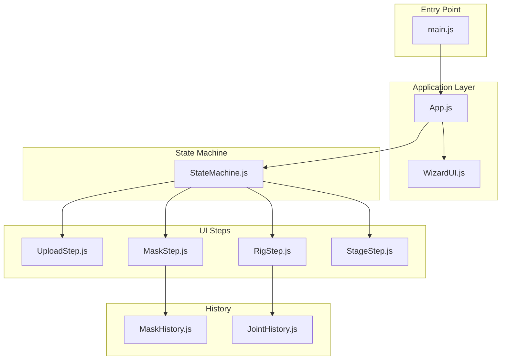
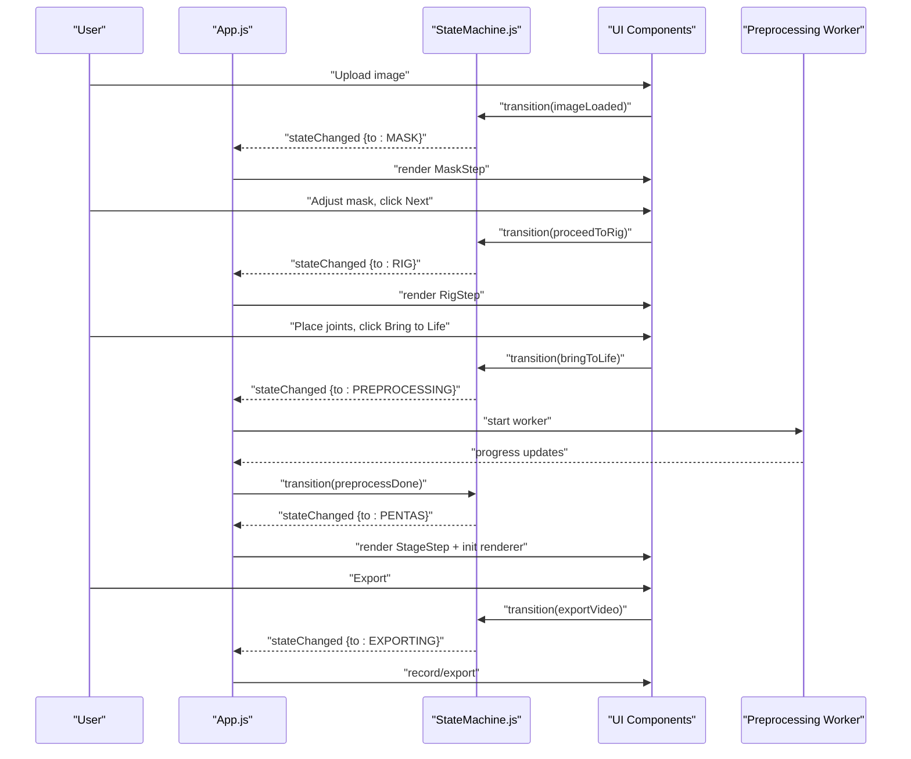
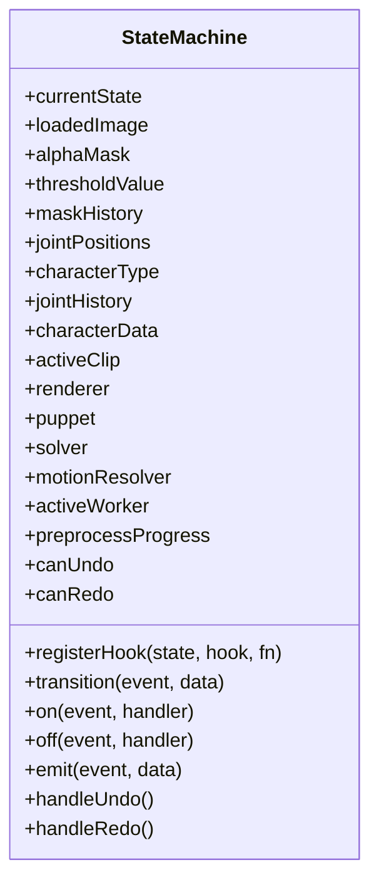
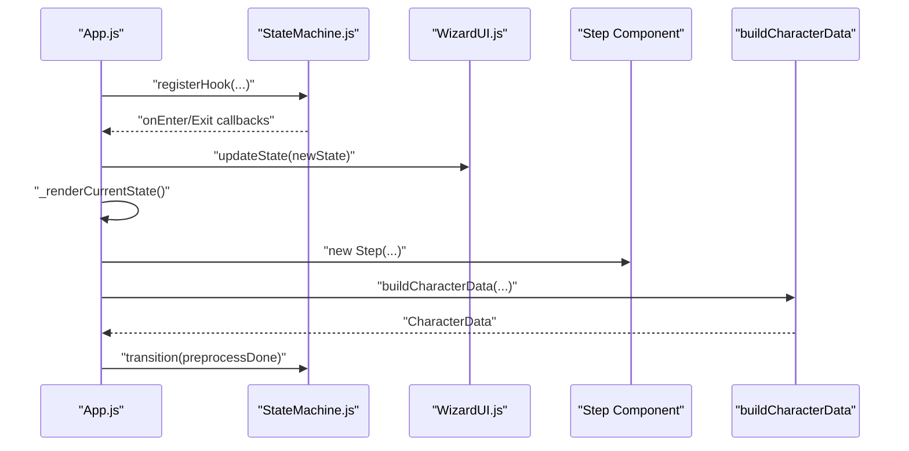
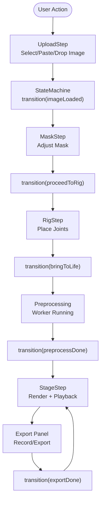
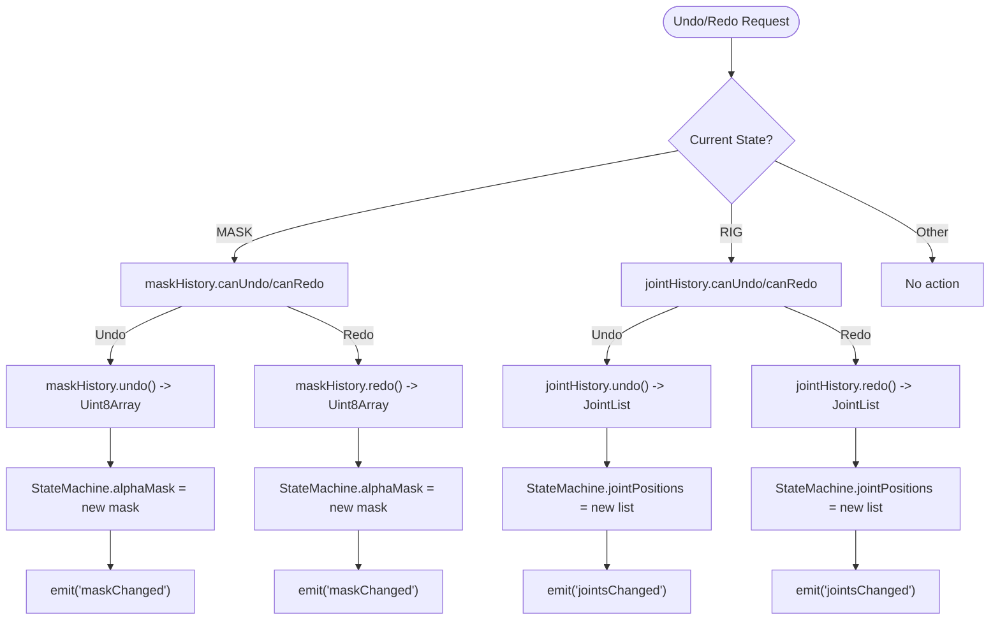
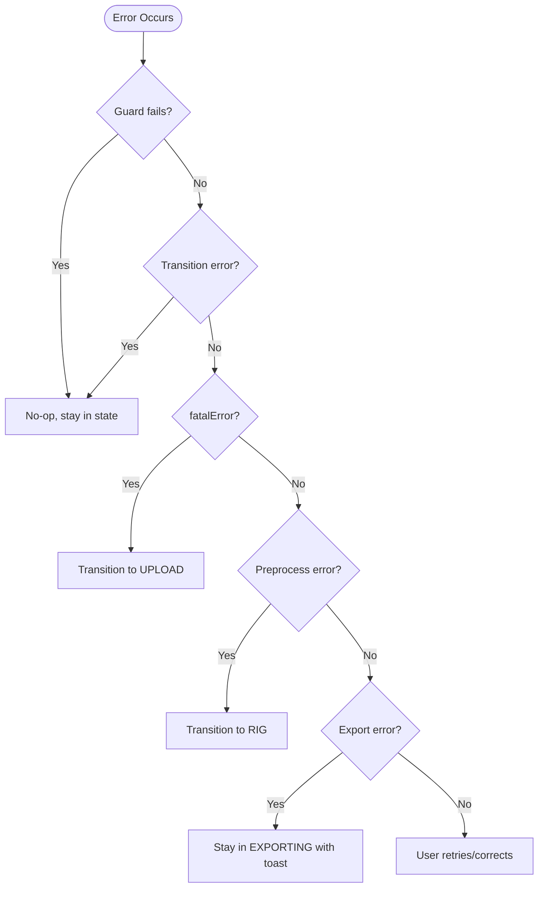
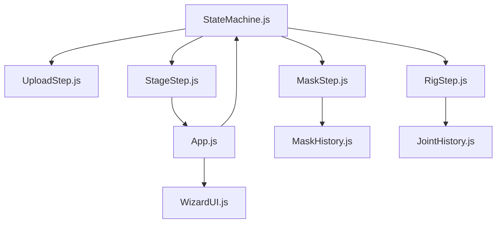

# State Management System

<cite>
**Referenced Files in This Document**
- [StateMachine.js](file://src/state/StateMachine.js)
- [App.js](file://src/App.js)
- [statemachine.md](file://architecture/statemachine.md)
- [EPIC-10-state-machine.md](file://implementation/epics/EPIC-10-state-machine.md)
- [TASK-116-126-epic10-state-machine.md](file://implementation/tasks/TASK-116-126-epic10-state-machine.md)
- [StateMachine.test.js](file://src/state/StateMachine.test.js)
- [WizardUI.js](file://src/ui/WizardUI.js)
- [UploadStep.js](file://src/ui/UploadStep.js)
- [MaskStep.js](file://src/ui/MaskStep.js)
- [RigStep.js](file://src/ui/RigStep.js)
- [StageStep.js](file://src/ui/StageStep.js)
- [MaskHistory.js](file://src/history/MaskHistory.js)
- [JointHistory.js](file://src/skeleton/JointHistory.js)
- [main.js](file://src/main.js)
</cite>

## Table of Contents
1. [Introduction](#introduction)
2. [Project Structure](#project-structure)
3. [Core Components](#core-components)
4. [Architecture Overview](#architecture-overview)
5. [Detailed Component Analysis](#detailed-component-analysis)
6. [Dependency Analysis](#dependency-analysis)
7. [Performance Considerations](#performance-considerations)
8. [Troubleshooting Guide](#troubleshooting-guide)
9. [Conclusion](#conclusion)

## Introduction
This document explains PaperAlive’s state management system centered on a state machine that orchestrates a four-phase workflow: Upload → Mask → Rig → Preprocessing → Stage → Exporting. The StateMachine.js module implements the state machine pattern with explicit state transitions, guard functions, lifecycle hooks, and event emission. It acts as the controller in an MVC-like separation: App.js is the model/controller, UI components are views, and the state machine coordinates data flow and component lifecycle. The system integrates with worker processes for preprocessing and with rendering systems for interactive stage playback and export.

## Project Structure
The state management system spans several modules:
- State machine core: StateMachine.js
- Application controller: App.js
- UI wizard and steps: WizardUI.js, UploadStep.js, MaskStep.js, RigStep.js, StageStep.js
- History utilities for undo/redo: MaskHistory.js, JointHistory.js
- Architecture and task documentation: statemachine.md, EPIC-10-state-machine.md, TASK-116-126-epic10-state-machine.md
- Tests: StateMachine.test.js
- Entry point: main.js

**Diagram sources**
- [main.js:1-17](file://src/main.js#L1-L17)
- [App.js:35-62](file://src/App.js#L35-L62)
- [WizardUI.js:21-42](file://src/ui/WizardUI.js#L21-L42)
- [StateMachine.js:137-206](file://src/state/StateMachine.js#L137-L206)
- [UploadStep.js:20-39](file://src/ui/UploadStep.js#L20-L39)
- [MaskStep.js:15-28](file://src/ui/MaskStep.js#L15-L28)
- [RigStep.js:15-30](file://src/ui/RigStep.js#L15-L30)
- [StageStep.js:31-40](file://src/ui/StageStep.js#L31-L40)
- [MaskHistory.js:25-42](file://src/history/MaskHistory.js#L25-L42)
- [JointHistory.js:14-27](file://src/skeleton/JointHistory.js#L14-L27)

**Section sources**
- [main.js:1-17](file://src/main.js#L1-L17)
- [App.js:35-62](file://src/App.js#L35-L62)
- [WizardUI.js:21-42](file://src/ui/WizardUI.js#L21-L42)
- [StateMachine.js:137-206](file://src/state/StateMachine.js#L137-L206)

## Core Components
- StateMachine.js: Implements AppState and AppEvent constants, transition table, guard functions, lifecycle hooks, event emitter, and undo/redo routing. It stores shared state (loadedImage, alphaMask, jointPositions, characterData, renderer references, etc.) and coordinates UI updates via event emission.
- App.js: The root controller that owns StateMachine, wires UI components, sets up lifecycle hooks, runs preprocessing, and manages keyboard shortcuts. It renders the current state’s step component and updates the wizard indicator.
- UI Components: WizardUI.js manages step navigation and content area; UploadStep.js, MaskStep.js, RigStep.js, and StageStep.js encapsulate step-specific UI and interactions.
- History Utilities: MaskHistory.js and JointHistory.js provide circular-buffer undo/redo for mask edits and joint placements respectively.

Key responsibilities:
- StateMachine: Define valid transitions, enforce guards, manage shared state, emit lifecycle events, route undo/redo.
- App.js: Bridge between state machine and UI; initialize rendering subsystems; handle keyboard shortcuts; coordinate worker-based preprocessing.
- UI: Render step content, collect user actions, and trigger state machine transitions.

**Section sources**
- [StateMachine.js:137-477](file://src/state/StateMachine.js#L137-L477)
- [App.js:35-505](file://src/App.js#L35-L505)
- [WizardUI.js:21-185](file://src/ui/WizardUI.js#L21-L185)
- [UploadStep.js:20-171](file://src/ui/UploadStep.js#L20-L171)
- [MaskStep.js:15-409](file://src/ui/MaskStep.js#L15-L409)
- [RigStep.js:15-358](file://src/ui/RigStep.js#L15-L358)
- [StageStep.js:31-428](file://src/ui/StageStep.js#L31-L428)
- [MaskHistory.js:25-121](file://src/history/MaskHistory.js#L25-L121)
- [JointHistory.js:14-110](file://src/skeleton/JointHistory.js#L14-L110)

## Architecture Overview
The state machine enforces a strict four-phase workflow with explicit guards and lifecycle hooks. App.js listens for state changes and renders the appropriate step component. During Preprocessing, App.js launches a background worker and displays progress. In Stage, App.js initializes rendering systems and motion resolvers.

**Diagram sources**
- [StateMachine.js:289-355](file://src/state/StateMachine.js#L289-L355)
- [App.js:95-109](file://src/App.js#L95-L109)
- [App.js:205-328](file://src/App.js#L205-L328)
- [StageStep.js:88-207](file://src/ui/StageStep.js#L88-L207)

## Detailed Component Analysis

### StateMachine.js: State Machine Core
- States and Events: AppState and AppEvent constants define the six states and events, including UNDO/REDO routing.
- Transition Table: TRANSITIONS encodes valid transitions per current state and event.
- Guards: GUARDS validate preconditions (e.g., minimum foreground pixels for mask, joint count and bbox containment for rig).
- Lifecycle Hooks: registerHook allows attaching onEnter/onExit handlers per state.
- Event Emitter: on/off/emit enable decoupled communication with App.js and UI components.
- Undo/Redo Routing: handleUndo/handleRedo delegate to active step histories; canUndo/canRedo expose availability.
- Shared State: Fields like loadedImage, alphaMask, jointPositions, characterData, renderer references, and worker references persist across transitions.

**Diagram sources**
- [StateMachine.js:137-477](file://src/state/StateMachine.js#L137-L477)

**Section sources**
- [StateMachine.js:20-48](file://src/state/StateMachine.js#L20-L48)
- [StateMachine.js:56-82](file://src/state/StateMachine.js#L56-L82)
- [StateMachine.js:108-127](file://src/state/StateMachine.js#L108-L127)
- [StateMachine.js:137-206](file://src/state/StateMachine.js#L137-L206)
- [StateMachine.js:289-355](file://src/state/StateMachine.js#L289-L355)
- [StateMachine.js:389-477](file://src/state/StateMachine.js#L389-L477)

### App.js: Application Controller and Integration
- Ownership: App.js owns StateMachine and orchestrates UI wiring.
- Event Listeners: Subscribes to stateChanged to update WizardUI and render current step.
- Lifecycle Hooks: Registers hooks for each state (e.g., reset on UPLOAD, preprocessing worker lifecycle, renderer initialization on PENTAS).
- Rendering: Renders step components and mounts/unmounts them based on current state.
- Preprocessing: Runs buildCharacterData asynchronously and triggers state transitions on completion or error.
- Keyboard Shortcuts: Global shortcuts for undo/redo and stage controls.

**Diagram sources**
- [App.js:95-160](file://src/App.js#L95-L160)
- [App.js:165-205](file://src/App.js#L165-L205)
- [App.js:308-328](file://src/App.js#L308-L328)

**Section sources**
- [App.js:35-505](file://src/App.js#L35-L505)

### UI Components: Wizard and Steps
- WizardUI.js: Manages step indicator and content area; mounts/unmounts step components and shows progress during preprocessing.
- UploadStep.js: Handles drag-and-drop, file selection, clipboard paste, and loads images; triggers imageLoaded transition.
- MaskStep.js: Provides threshold slider, brush tools, undo/redo, and navigation; maintains MaskHistory and emits maskChanged.
- RigStep.js: Offers character type selector, joint placement editor, undo/redo, and navigation; maintains JointHistory and emits jointsChanged.
- StageStep.js: Initializes renderer, puppet, solver, and motion resolver; handles playback, IK dragging, and export.

**Diagram sources**
- [UploadStep.js:133-155](file://src/ui/UploadStep.js#L133-L155)
- [MaskStep.js:326-333](file://src/ui/MaskStep.js#L326-L333)
- [RigStep.js:284-307](file://src/ui/RigStep.js#L284-L307)
- [StageStep.js:338-369](file://src/ui/StageStep.js#L338-L369)

**Section sources**
- [WizardUI.js:21-185](file://src/ui/WizardUI.js#L21-L185)
- [UploadStep.js:20-171](file://src/ui/UploadStep.js#L20-L171)
- [MaskStep.js:15-409](file://src/ui/MaskStep.js#L15-L409)
- [RigStep.js:15-358](file://src/ui/RigStep.js#L15-L358)
- [StageStep.js:31-428](file://src/ui/StageStep.js#L31-L428)

### Undo/Redo Implementation
- MaskHistory.js: Circular buffer storing deep copies of binary masks; supports undo/redo and capacity eviction.
- JointHistory.js: Circular buffer storing deep clones of joint position lists; supports undo/redo and capacity eviction.
- StateMachine.js: handleUndo/handleRedo route to active step histories; canUndo/canRedo reflect availability; emits maskChanged/jointsChanged to refresh UI previews.

**Diagram sources**
- [StateMachine.js:389-477](file://src/state/StateMachine.js#L389-L477)
- [MaskHistory.js:55-95](file://src/history/MaskHistory.js#L55-L95)
- [JointHistory.js:35-75](file://src/skeleton/JointHistory.js#L35-L75)

**Section sources**
- [StateMachine.js:389-477](file://src/state/StateMachine.js#L389-L477)
- [MaskHistory.js:25-121](file://src/history/MaskHistory.js#L25-L121)
- [JointHistory.js:14-110](file://src/skeleton/JointHistory.js#L14-L110)

### Error Handling and Recovery
- Guard Failures: Invalid transitions and guard failures are no-ops; state remains unchanged and no error is thrown.
- Fatal Error: Any state can emit fatalError to force a return to UPLOAD.
- Preprocessing Errors: On worker errors, transition to PREPROCESSING → RIG to allow correction.
- Export Errors: On export errors, remain in EXPORTING and surface actionable feedback; can cancel to PENTAS.

**Diagram sources**
- [StateMachine.js:290-320](file://src/state/StateMachine.js#L290-L320)
- [App.js:324-327](file://src/App.js#L324-L327)

**Section sources**
- [StateMachine.js:290-320](file://src/state/StateMachine.js#L290-L320)
- [App.js:324-327](file://src/App.js#L324-L327)

## Dependency Analysis
The state machine couples tightly with UI components and rendering systems while maintaining loose coupling through event emission and lifecycle hooks.

**Diagram sources**
- [StateMachine.js:137-477](file://src/state/StateMachine.js#L137-L477)
- [App.js:35-505](file://src/App.js#L35-L505)
- [WizardUI.js:21-185](file://src/ui/WizardUI.js#L21-L185)
- [UploadStep.js:20-171](file://src/ui/UploadStep.js#L20-L171)
- [MaskStep.js:15-409](file://src/ui/MaskStep.js#L15-L409)
- [RigStep.js:15-358](file://src/ui/RigStep.js#L15-L358)
- [StageStep.js:31-428](file://src/ui/StageStep.js#L31-L428)
- [MaskHistory.js:25-121](file://src/history/MaskHistory.js#L25-L121)
- [JointHistory.js:14-110](file://src/skeleton/JointHistory.js#L14-L110)

**Section sources**
- [StateMachine.js:137-477](file://src/state/StateMachine.js#L137-L477)
- [App.js:35-505](file://src/App.js#L35-L505)

## Performance Considerations
- Event Emission: Minimal overhead; listeners are stored in a Map and invoked synchronously.
- Guard Functions: Lightweight checks (array membership, bounding box computation) avoid heavy computations.
- History Buffers: Circular buffers cap memory usage; deep cloning occurs only on push, amortized over gestures.
- Rendering: App.js defers expensive WebGL initialization to PENTAS.onEnter; StageStep.js uses requestAnimationFrame and selective redraws.
- Preprocessing: Offloads work to a worker; App.js updates progress without blocking the UI.

## Troubleshooting Guide
Common issues and resolutions:
- State does not change after clicking Next: Verify guard conditions (e.g., mask has foreground pixels, joint count ≥ 3, joints within mask bbox).
- Undo/Redo not working: Ensure maskHistory or jointHistory is initialized in the respective state and that canUndo/canRedo flags are accurate.
- Preprocessing stuck: Confirm worker termination on PREPROCESSING.onExit and that preprocessDone/preprocessError transitions occur.
- Export fails: Check codec support and handle exportError gracefully; allow cancelExport to return to PENTAS.

**Section sources**
- [StateMachine.test.js:171-352](file://src/state/StateMachine.test.js#L171-L352)
- [StateMachine.test.js:467-593](file://src/state/StateMachine.test.js#L467-L593)
- [App.js:308-328](file://src/App.js#L308-L328)

## Conclusion
PaperAlive’s state management system cleanly separates concerns through a state machine acting as controller, with App.js orchestrating UI rendering and subsystem initialization. The explicit transition table, guard functions, and lifecycle hooks ensure predictable workflows across Upload, Mask, Rig, Preprocessing, Stage, and Exporting. Undo/redo capabilities are integrated at the active step level, and event emission enables loose coupling between components. This design supports robust error handling, clear data flow, and scalable extension for future features.