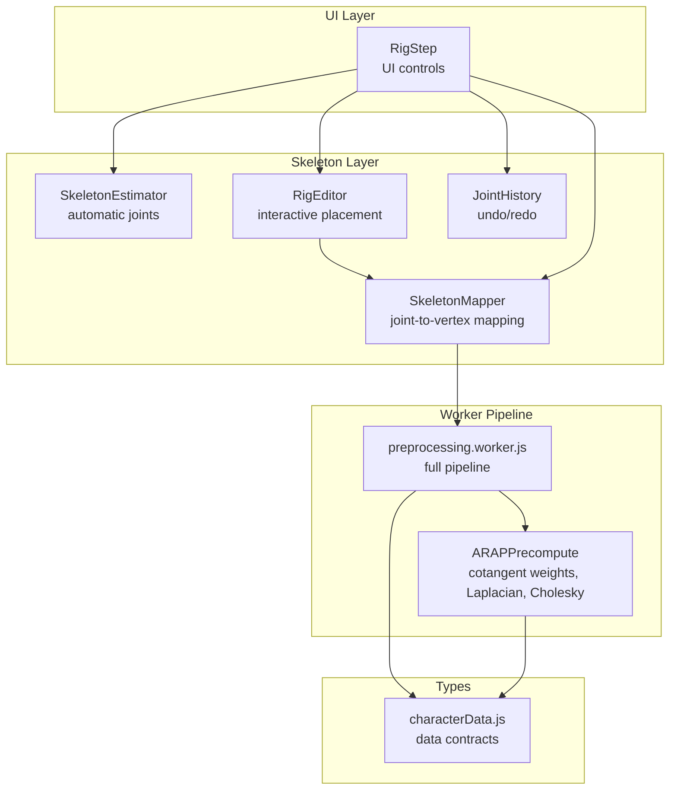
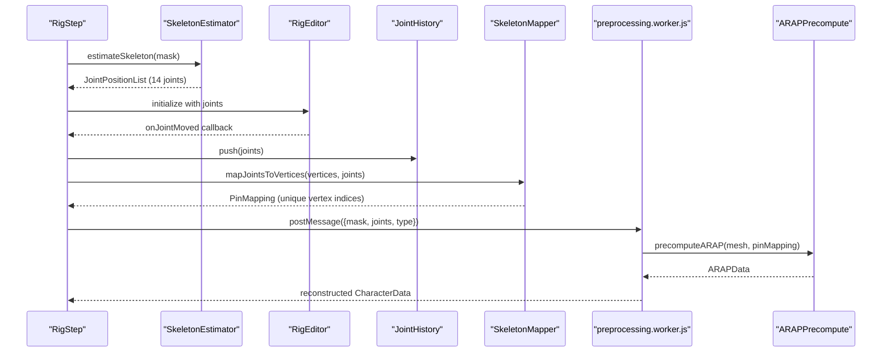
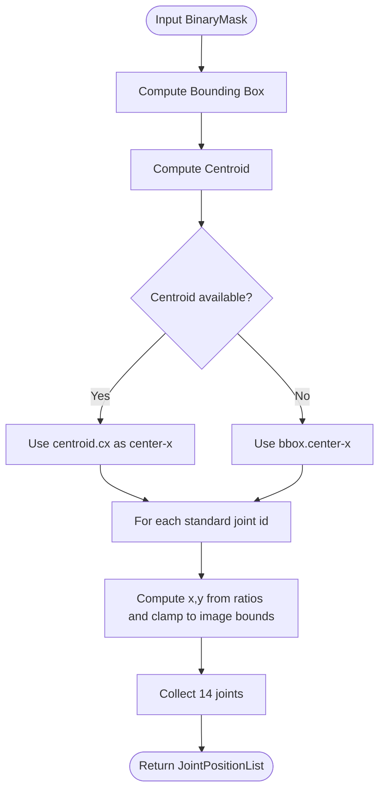
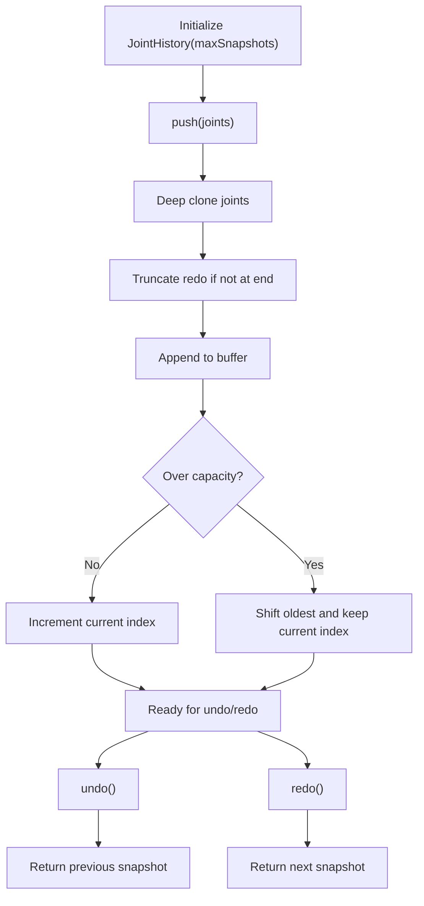
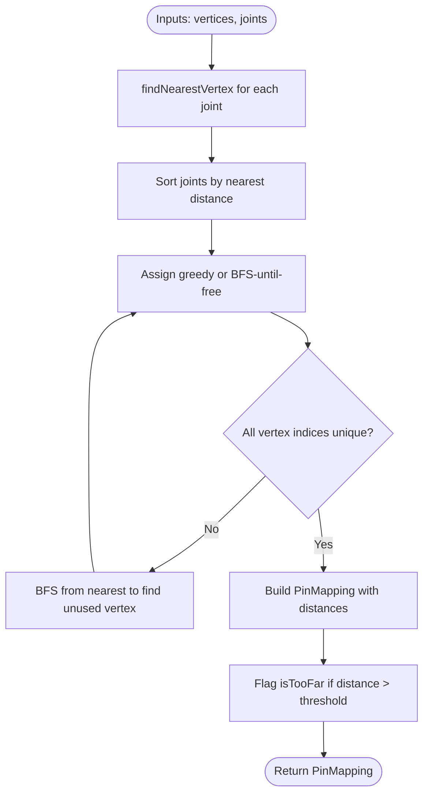
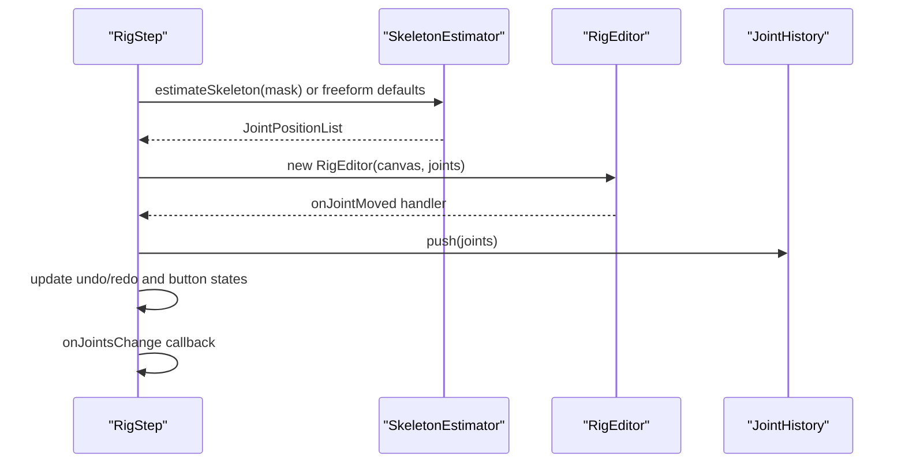
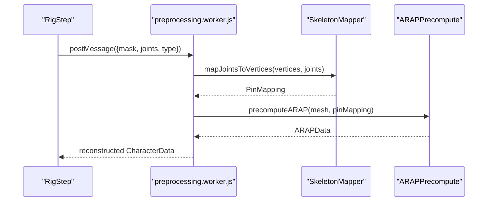
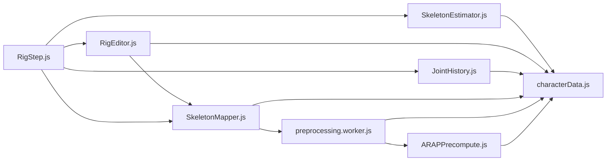

# Character Rigging System

<cite>
**Referenced Files in This Document**
- [SkeletonEstimator.js](file://src/skeleton/SkeletonEstimator.js)
- [RigEditor.js](file://src/skeleton/RigEditor.js)
- [JointHistory.js](file://src/skeleton/JointHistory.js)
- [SkeletonMapper.js](file://src/skeleton/SkeletonMapper.js)
- [RigStep.js](file://src/ui/RigStep.js)
- [characterData.js](file://src/types/characterData.js)
- [preprocessing.worker.js](file://src/character/workers/preprocessing.worker.js)
- [ARAPPrecompute.js](file://src/arap/ARAPPrecompute.js)
- [buildCharacterData.js](file://src/character/buildCharacterData.js)
- [characterdata.md](file://architecture/characterdata.md)
</cite>

## Table of Contents
1. [Introduction](#introduction)
2. [Project Structure](#project-structure)
3. [Core Components](#core-components)
4. [Architecture Overview](#architecture-overview)
5. [Detailed Component Analysis](#detailed-component-analysis)
6. [Dependency Analysis](#dependency-analysis)
7. [Performance Considerations](#performance-considerations)
8. [Troubleshooting Guide](#troubleshooting-guide)
9. [Conclusion](#conclusion)

## Introduction
This document explains PaperAlive’s Character Rigging System with emphasis on automatic skeleton estimation, joint management, and the integration pipeline leading to ARAP preprocessing. It covers:
- Automatic skeleton estimation for human-like silhouettes
- Manual joint correction and placement via an interactive editor
- Edit history tracking for undo/redo
- Relationship between skeleton structure and character type selection (humanoid vs freeform)
- Practical examples of skeleton refinement and joint hierarchy management
- Integration between skeleton data and ARAP preprocessing

## Project Structure
The rigging system spans several modules:
- Skeleton estimation and mapping
- Interactive rig editor and history
- UI step for character type selection and editing
- Worker-based preprocessing pipeline integrating mesh building and ARAP precomputation



**Diagram sources**
- [RigStep.js:15-358](file://src/ui/RigStep.js#L15-L358)
- [SkeletonEstimator.js:1-114](file://src/skeleton/SkeletonEstimator.js#L1-L114)
- [RigEditor.js:1-477](file://src/skeleton/RigEditor.js#L1-L477)
- [JointHistory.js:1-110](file://src/skeleton/JointHistory.js#L1-L110)
- [SkeletonMapper.js:1-211](file://src/skeleton/SkeletonMapper.js#L1-L211)
- [preprocessing.worker.js:1-374](file://src/character/workers/preprocessing.worker.js#L1-L374)
- [ARAPPrecompute.js:1-388](file://src/arap/ARAPPrecompute.js#L1-L388)
- [characterData.js:1-254](file://src/types/characterData.js#L1-L254)

**Section sources**
- [RigStep.js:15-358](file://src/ui/RigStep.js#L15-L358)
- [SkeletonEstimator.js:1-114](file://src/skeleton/SkeletonEstimator.js#L1-L114)
- [RigEditor.js:1-477](file://src/skeleton/RigEditor.js#L1-L477)
- [JointHistory.js:1-110](file://src/skeleton/JointHistory.js#L1-L110)
- [SkeletonMapper.js:1-211](file://src/skeleton/SkeletonMapper.js#L1-L211)
- [preprocessing.worker.js:1-374](file://src/character/workers/preprocessing.worker.js#L1-L374)
- [ARAPPrecompute.js:1-388](file://src/arap/ARAPPrecompute.js#L1-L388)
- [characterData.js:1-254](file://src/types/characterData.js#L1-L254)

## Core Components
- SkeletonEstimator: Computes 14-joint humanoid skeleton from a binary mask using bounding box and centroid heuristics.
- RigEditor: Interactive canvas-based editor for joint placement with drag-and-drop, hit testing, and freeform mode.
- JointHistory: Circular buffer storing snapshots of joint positions for undo/redo.
- SkeletonMapper: Maps joints to mesh vertices with uniqueness enforcement and distance warnings.
- RigStep: UI orchestration for character type selection, joint estimation, and history management.
- Worker pipeline: Full preprocessing chain including mesh building and ARAP precomputation.
- ARAPPrecompute: Cotangent weights, Laplacian construction, and Cholesky factorization with fallbacks.

**Section sources**
- [SkeletonEstimator.js:1-114](file://src/skeleton/SkeletonEstimator.js#L1-L114)
- [RigEditor.js:1-477](file://src/skeleton/RigEditor.js#L1-L477)
- [JointHistory.js:1-110](file://src/skeleton/JointHistory.js#L1-L110)
- [SkeletonMapper.js:1-211](file://src/skeleton/SkeletonMapper.js#L1-L211)
- [RigStep.js:15-358](file://src/ui/RigStep.js#L15-L358)
- [preprocessing.worker.js:1-374](file://src/character/workers/preprocessing.worker.js#L1-L374)
- [ARAPPrecompute.js:1-388](file://src/arap/ARAPPrecompute.js#L1-L388)

## Architecture Overview
The rigging system follows a clear separation of concerns:
- Estimation phase: automatic humanoid joints for typical silhouettes
- Editing phase: manual refinement with undo/redo
- Mapping phase: joint-to-vertex mapping with uniqueness enforcement
- Preprocessing phase: mesh building and ARAP precomputation in a worker



**Diagram sources**
- [RigStep.js:67-84](file://src/ui/RigStep.js#L67-L84)
- [SkeletonEstimator.js:89-113](file://src/skeleton/SkeletonEstimator.js#L89-L113)
- [RigEditor.js:311-366](file://src/skeleton/RigEditor.js#L311-L366)
- [JointHistory.js:35-53](file://src/skeleton/JointHistory.js#L35-L53)
- [SkeletonMapper.js:27-83](file://src/skeleton/SkeletonMapper.js#L27-L83)
- [preprocessing.worker.js:47-192](file://src/character/workers/preprocessing.worker.js#L47-L192)
- [ARAPPrecompute.js:206-296](file://src/arap/ARAPPrecompute.js#L206-L296)

## Detailed Component Analysis

### Automatic Skeleton Estimation (Humanoid Heuristic)
- Input: BinaryMask
- Output: JointPositionList (14 joints) aligned to a standard humanoid proportion scheme
- Methodology:
  - Compute bounding box and centroid of foreground pixels
  - Use centroid as the horizontal reference for robustness against asymmetry
  - Place joints along vertical and horizontal ratios relative to bbox dimensions
  - Clamp positions to image bounds



**Diagram sources**
- [SkeletonEstimator.js:89-113](file://src/skeleton/SkeletonEstimator.js#L89-L113)

**Section sources**
- [SkeletonEstimator.js:28-41](file://src/skeleton/SkeletonEstimator.js#L28-L41)
- [SkeletonEstimator.js:55-78](file://src/skeleton/SkeletonEstimator.js#L55-L78)
- [SkeletonEstimator.js:89-113](file://src/skeleton/SkeletonEstimator.js#L89-L113)

### RigEditor: Interactive Joint Placement and Correction
- Features:
  - Render bones and joints with color-coded states
  - Hit testing for joint selection
  - Drag-and-drop with pointer events
  - Mesh boundary reference for distance warnings
  - Freeform mode: add/remove joints (min 3, max 20)
- Rendering:
  - Draws bone connections using predefined humanoid bones or sequential freeform bones
  - Renders tooltips for “too far” joints
- Interaction:
  - Pointer down selects nearest joint within hit radius
  - Pointer move drags selected joint
  - Pointer up triggers onJointMoved callback
  - Context menu removes joints in freeform mode

```mermaid
classDiagram
class RigEditor {
+constructor(canvas, joints)
+getJointPositions() JointPositionList
+setJointPositions(joints) void
+setMeshBoundary(boundary) void
+setFreeformMode(enabled) void
+render() void
+destroy() void
-_drawBones(ctx) void
-_drawJoint(ctx, joint) void
-_getScaledPointerPos(e) {x,y}
-_handlePointerDown(e) void
-_handlePointerMove(e) void
-_handlePointerUp(e) void
-_handleContextMenu(e) void
-_addJoint(x,y) void
-_removeJoint(jointId) void
-_isHumanoid() boolean
-_buildFreeformBones() Array
-_computeIsTooFar(joint) boolean
+onJointMoved
+onJointsChanged
}
```

**Diagram sources**
- [RigEditor.js:85-477](file://src/skeleton/RigEditor.js#L85-L477)

**Section sources**
- [RigEditor.js:21-33](file://src/skeleton/RigEditor.js#L21-L33)
- [RigEditor.js:39-53](file://src/skeleton/RigEditor.js#L39-L53)
- [RigEditor.js:66-81](file://src/skeleton/RigEditor.js#L66-L81)
- [RigEditor.js:170-225](file://src/skeleton/RigEditor.js#L170-L225)
- [RigEditor.js:232-265](file://src/skeleton/RigEditor.js#L232-L265)
- [RigEditor.js:297-366](file://src/skeleton/RigEditor.js#L297-L366)
- [RigEditor.js:391-417](file://src/skeleton/RigEditor.js#L391-L417)
- [RigEditor.js:425-475](file://src/skeleton/RigEditor.js#L425-L475)

### JointHistory: Edit History and Undo/Redo
- Purpose: Maintain a circular buffer of joint position snapshots
- Behavior:
  - Push clones the current joint positions and clears redo history
  - Undo moves backward one step; Redo moves forward
  - Capacity is configurable (default 10)
  - Deep clone ensures snapshots remain immutable



**Diagram sources**
- [JointHistory.js:14-110](file://src/skeleton/JointHistory.js#L14-L110)

**Section sources**
- [JointHistory.js:18-53](file://src/skeleton/JointHistory.js#L18-L53)
- [JointHistory.js:60-75](file://src/skeleton/JointHistory.js#L60-L75)
- [JointHistory.js:106-108](file://src/skeleton/JointHistory.js#L106-L108)

### SkeletonMapper: Joint-to-Vertex Mapping with Uniqueness
- Input: Mesh vertices (Float32Array), JointPositionList
- Output: PinMapping with unique vertex indices and distance flags
- Algorithm:
  - Greedy nearest-neighbor assignment per joint
  - Enforce uniqueness using BFS from used vertices if collision occurs
  - Flag joints that are too far (> threshold) from mesh boundary



**Diagram sources**
- [SkeletonMapper.js:27-83](file://src/skeleton/SkeletonMapper.js#L27-L83)
- [SkeletonMapper.js:122-152](file://src/skeleton/SkeletonMapper.js#L122-L152)
- [SkeletonMapper.js:162-201](file://src/skeleton/SkeletonMapper.js#L162-L201)

**Section sources**
- [SkeletonMapper.js:27-83](file://src/skeleton/SkeletonMapper.js#L27-L83)
- [SkeletonMapper.js:122-152](file://src/skeleton/SkeletonMapper.js#L122-L152)
- [SkeletonMapper.js:162-201](file://src/skeleton/SkeletonMapper.js#L162-L201)

### RigStep: UI Orchestration for Character Type and Editing
- Responsibilities:
  - Estimate joints based on character type (humanoid or freeform)
  - Initialize RigEditor and wire callbacks
  - Manage JointHistory and update UI controls
  - Provide keyboard shortcuts (Ctrl+Z, Ctrl+Shift+Z/Ctrl+Y)
  - Trigger Bring to Life when sufficient joints exist



**Diagram sources**
- [RigStep.js:30-61](file://src/ui/RigStep.js#L30-L61)
- [RigStep.js:67-84](file://src/ui/RigStep.js#L67-L84)
- [RigStep.js:221-242](file://src/ui/RigStep.js#L221-L242)
- [RigStep.js:284-307](file://src/ui/RigStep.js#L284-L307)

**Section sources**
- [RigStep.js:30-61](file://src/ui/RigStep.js#L30-L61)
- [RigStep.js:67-84](file://src/ui/RigStep.js#L67-L84)
- [RigStep.js:221-242](file://src/ui/RigStep.js#L221-L242)
- [RigStep.js:284-307](file://src/ui/RigStep.js#L284-L307)
- [RigStep.js:329-341](file://src/ui/RigStep.js#L329-L341)

### Integration with ARAP Preprocessing
- The worker pipeline consumes:
  - Binary mask and joint positions
  - Character type (humanoid/freeform)
- Steps:
  - Morphological cleaning, contour tracing, simplification, interior sampling, mesh building
  - Skeleton mapping to vertices
  - ARAP precomputation (cotangent weights, Laplacian, Cholesky)
- The resulting CharacterData includes geometry, pinMapping, and ARAP precomputed data.



**Diagram sources**
- [preprocessing.worker.js:34-71](file://src/character/workers/preprocessing.worker.js#L34-L71)
- [preprocessing.worker.js:86-192](file://src/character/workers/preprocessing.worker.js#L86-L192)
- [SkeletonMapper.js:27-83](file://src/skeleton/SkeletonMapper.js#L27-L83)
- [ARAPPrecompute.js:206-296](file://src/arap/ARAPPrecompute.js#L206-L296)

**Section sources**
- [preprocessing.worker.js:86-192](file://src/character/workers/preprocessing.worker.js#L86-L192)
- [buildCharacterData.js:71-153](file://src/character/buildCharacterData.js#L71-L153)
- [ARAPPrecompute.js:206-296](file://src/arap/ARAPPrecompute.js#L206-L296)

## Dependency Analysis
- UI depends on SkeletonEstimator, RigEditor, and JointHistory
- RigEditor depends on SkeletonMapper for bone rendering and freeform bone construction
- Worker pipeline depends on SkeletonMapper and ARAPPrecompute
- All modules rely on shared type definitions in characterData.js



**Diagram sources**
- [RigStep.js:8-11](file://src/ui/RigStep.js#L8-L11)
- [RigEditor.js:1-17](file://src/skeleton/RigEditor.js#L1-L17)
- [JointHistory.js:1-9](file://src/skeleton/JointHistory.js#L1-L9)
- [SkeletonMapper.js:1-16](file://src/skeleton/SkeletonMapper.js#L1-L16)
- [preprocessing.worker.js:18-26](file://src/character/workers/preprocessing.worker.js#L18-L26)
- [ARAPPrecompute.js:16-18](file://src/arap/ARAPPrecompute.js#L16-L18)
- [characterData.js:1-9](file://src/types/characterData.js#L1-L9)

**Section sources**
- [RigStep.js:8-11](file://src/ui/RigStep.js#L8-L11)
- [RigEditor.js:1-17](file://src/skeleton/RigEditor.js#L1-L17)
- [JointHistory.js:1-9](file://src/skeleton/JointHistory.js#L1-L9)
- [SkeletonMapper.js:1-16](file://src/skeleton/SkeletonMapper.js#L1-L16)
- [preprocessing.worker.js:18-26](file://src/character/workers/preprocessing.worker.js#L18-L26)
- [ARAPPrecompute.js:16-18](file://src/arap/ARAPPrecompute.js#L16-L18)
- [characterData.js:1-9](file://src/types/characterData.js#L1-L9)

## Performance Considerations
- SkeletonEstimator: O(n) over mask pixels for bbox/centroid; O(1) for 14 joints placement
- RigEditor: Rendering cost proportional to joint count; hit testing O(joints)
- JointHistory: O(joints) deep clone per push; circular buffer amortized O(1)
- SkeletonMapper: Greedy nearest-neighbor O(joints*vertices); BFS worst-case O(vertices)
- ARAPPrecompute: Cotangent weights O(edges), Laplacian assembly O(vertices + edges), Cholesky factorization O(vertices^3) worst-case

[No sources needed since this section provides general guidance]

## Troubleshooting Guide
Common rigging challenges and remedies:
- Joints placed outside silhouette:
  - Use freeform mode to add/remove joints; ensure mesh boundary reference is set
  - Adjust joints closer than threshold to avoid “too far” warnings
- Inconsistent joint hierarchy:
  - For humanoid mode, ensure standard joint IDs are preserved
  - For freeform mode, maintain sequential bone order for natural deformation
- Undo/redo not working:
  - Verify JointHistory.push is called after each joint move
  - Confirm onJointMoved callback is wired to update UI and history
- ARAP preprocessing failures:
  - Check for degenerate meshes or insufficient vertex count
  - Review pin mapping uniqueness and distance thresholds

**Section sources**
- [RigEditor.js:463-475](file://src/skeleton/RigEditor.js#L463-L475)
- [JointHistory.js:35-53](file://src/skeleton/JointHistory.js#L35-L53)
- [SkeletonMapper.js:74-82](file://src/skeleton/SkeletonMapper.js#L74-L82)
- [preprocessing.worker.js:108-117](file://src/character/workers/preprocessing.worker.js#L108-L117)
- [ARAPPrecompute.js:243-251](file://src/arap/ARAPPrecompute.js#L243-L251)

## Conclusion
PaperAlive’s rigging system combines automatic heuristic estimation with interactive manual refinement, backed by robust history tracking and strict joint-to-vertex mapping. The seamless integration with ARAP preprocessing ensures efficient and stable animation-ready character data. By leveraging humanoid defaults for typical silhouettes and freeform flexibility for diverse shapes, the system supports natural movement across varied character designs.