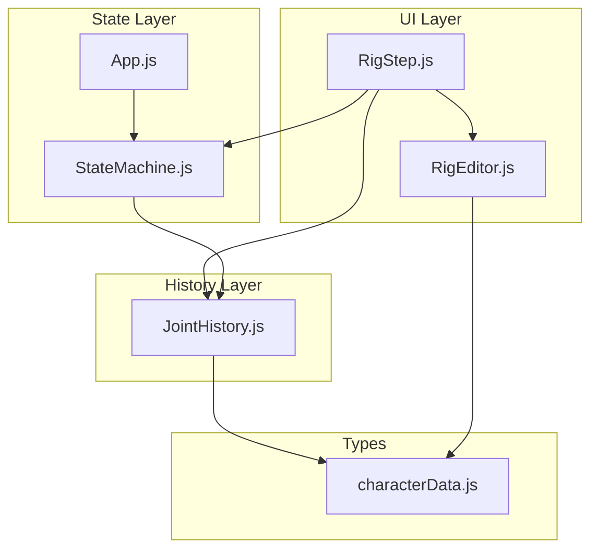
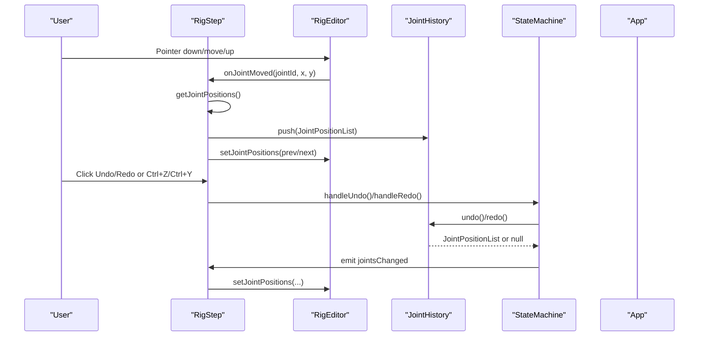
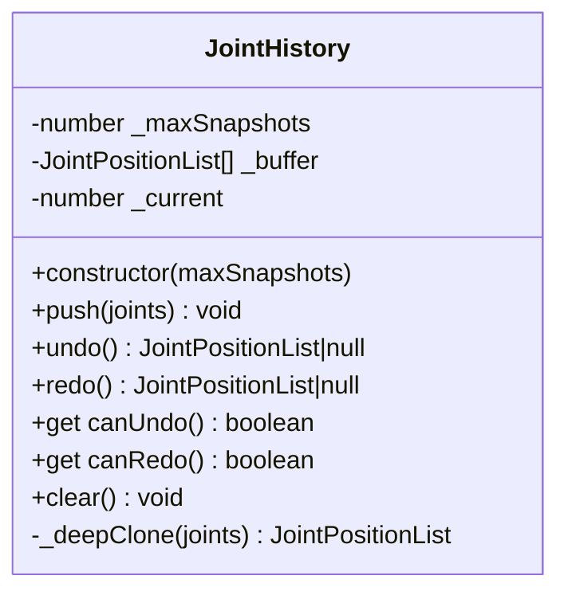
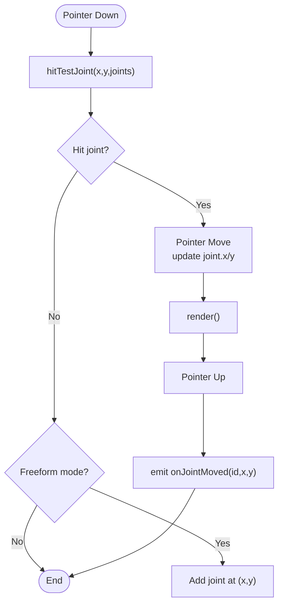
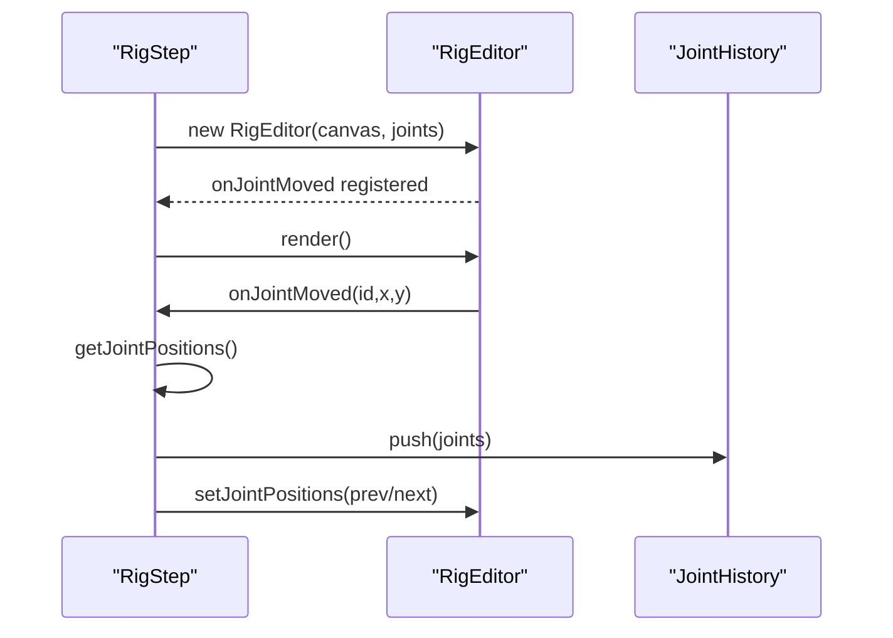
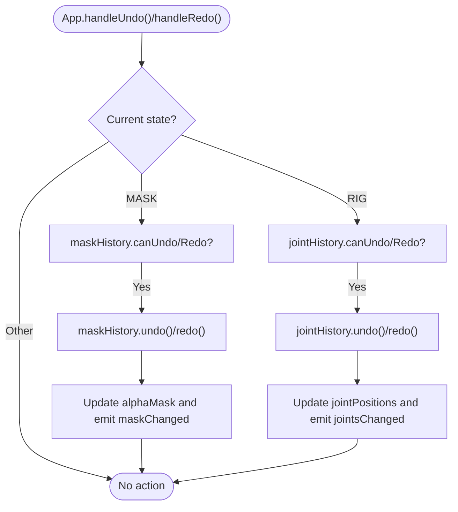
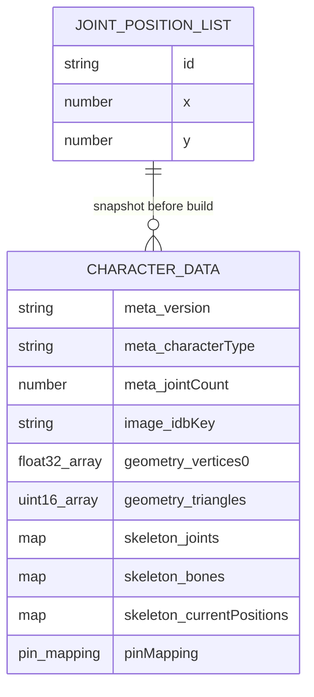
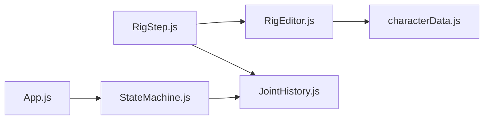

# Joint History

<cite>
**Referenced Files in This Document**
- [JointHistory.js](file://src/skeleton/JointHistory.js)
- [JointHistory.test.js](file://src/skeleton/JointHistory.test.js)
- [RigEditor.js](file://src/skeleton/RigEditor.js)
- [RigStep.js](file://src/ui/RigStep.js)
- [StateMachine.js](file://src/state/StateMachine.js)
- [App.js](file://src/App.js)
- [characterData.js](file://src/types/characterData.js)
- [module_design.md](file://architecture/module_design.md)
- [characterdata.md](file://architecture/characterdata.md)
</cite>

## Table of Contents
1. [Introduction](#introduction)
2. [Project Structure](#project-structure)
3. [Core Components](#core-components)
4. [Architecture Overview](#architecture-overview)
5. [Detailed Component Analysis](#detailed-component-analysis)
6. [Dependency Analysis](#dependency-analysis)
7. [Performance Considerations](#performance-considerations)
8. [Troubleshooting Guide](#troubleshooting-guide)
9. [Conclusion](#conclusion)

## Introduction
This document explains the Joint History component that powers undo/redo for skeleton joint edits in PaperAlive’s Rig step. It covers the circular buffer history architecture, state serialization, integration with the rig editor and state machine, and how joint modifications are recorded, stored, and restored during user interactions. It also documents practical usage patterns, batch operations, conflict resolution strategies, and the relationship to character data persistence.

## Project Structure
The Joint History feature spans several modules:
- History storage: JointHistory (circular buffer)
- UI integration: RigEditor (interactive canvas), RigStep (UI wiring)
- State orchestration: StateMachine (undo/redo routing)
- Data typing: JointPositionList and related types
- Architecture docs: module design and character data specs

**Diagram sources**
- [RigStep.js:1-358](file://src/ui/RigStep.js#L1-L358)
- [RigEditor.js:1-477](file://src/skeleton/RigEditor.js#L1-L477)
- [JointHistory.js:1-110](file://src/skeleton/JointHistory.js#L1-L110)
- [StateMachine.js:1-477](file://src/state/StateMachine.js#L1-L477)
- [App.js:1-505](file://src/App.js#L1-L505)
- [characterData.js:1-254](file://src/types/characterData.js#L1-L254)

**Section sources**
- [module_design.md:699-721](file://architecture/module_design.md#L699-L721)
- [characterData.js:61-66](file://src/types/characterData.js#L61-L66)

## Core Components
- JointHistory: Circular buffer storing deep-cloned JointPositionList snapshots with undo/redo navigation and capacity management.
- RigEditor: Interactive canvas for joint dragging and rendering; emits joint movement events.
- RigStep: UI component that wires RigEditor, manages JointHistory, and exposes undo/redo controls.
- StateMachine: Routes undo/redo events to the active step’s history and updates shared state.
- App: Global keyboard shortcuts and event routing to StateMachine.

**Section sources**
- [JointHistory.js:14-109](file://src/skeleton/JointHistory.js#L14-L109)
- [RigEditor.js:85-477](file://src/skeleton/RigEditor.js#L85-L477)
- [RigStep.js:15-358](file://src/ui/RigStep.js#L15-L358)
- [StateMachine.js:137-477](file://src/state/StateMachine.js#L137-L477)
- [App.js:415-478](file://src/App.js#L415-L478)

## Architecture Overview
Joint edits are captured during pointer drag events in the RigEditor. On each move, RigStep updates the current joint positions and pushes a deep clone of the JointPositionList into JointHistory. Undo/redo actions are exposed via UI buttons and keyboard shortcuts, routed through StateMachine to the active step’s history.

**Diagram sources**
- [RigStep.js:232-242](file://src/ui/RigStep.js#L232-L242)
- [RigStep.js:284-307](file://src/ui/RigStep.js#L284-L307)
- [RigEditor.js:355-365](file://src/skeleton/RigEditor.js#L355-L365)
- [StateMachine.js:389-445](file://src/state/StateMachine.js#L389-L445)
- [App.js:421-433](file://src/App.js#L421-L433)

## Detailed Component Analysis

### JointHistory: Circular Buffer for Joint Edits
- Purpose: Store deep-cloned snapshots of JointPositionList with undo/redo navigation and bounded capacity.
- Behavior:
  - push(): Deep clones incoming JointPositionList, truncates redo history if present, appends snapshot, evicts oldest if over capacity.
  - undo()/redo(): Move pointer and return a deep clone of the requested snapshot; return null when unavailable.
  - canUndo/canRedo: Derived from current pointer vs buffer bounds.
  - clear(): Resets buffer and pointer.
- Complexity:
  - push(): O(n) for cloning n joints; amortized O(1) for buffer operations.
  - undo()/redo(): O(1) pointer moves; O(n) for deep clone.
  - Memory: O(k·n) where k = maxSnapshots and n = average joints per snapshot.

**Diagram sources**
- [JointHistory.js:14-109](file://src/skeleton/JointHistory.js#L14-L109)

**Section sources**
- [JointHistory.js:14-109](file://src/skeleton/JointHistory.js#L14-L109)
- [JointHistory.test.js:9-105](file://src/skeleton/JointHistory.test.js#L9-L105)

### RigEditor: Interactive Joint Placement
- Renders skeleton bones and joint handles with color-coded states.
- Handles pointer events to detect, drag, and release joints.
- Emits onJointMoved with the moved joint’s id and new coordinates.
- Provides getJointPositions() and setJointPositions() for external synchronization.

**Diagram sources**
- [RigEditor.js:311-366](file://src/skeleton/RigEditor.js#L311-L366)
- [RigEditor.js:169-192](file://src/skeleton/RigEditor.js#L169-L192)

**Section sources**
- [RigEditor.js:85-477](file://src/skeleton/RigEditor.js#L85-L477)

### RigStep: UI Wiring and Undo/Redo Controls
- Initializes RigEditor with current joint positions.
- Subscribes to onJointMoved to push snapshots into JointHistory and update UI state.
- Provides Undo/Redo buttons and keyboard shortcuts (Ctrl+Z/Ctrl+Y).
- Switches character type and resets history accordingly.

**Diagram sources**
- [RigStep.js:221-242](file://src/ui/RigStep.js#L221-L242)
- [RigStep.js:232-239](file://src/ui/RigStep.js#L232-L239)
- [RigStep.js:284-307](file://src/ui/RigStep.js#L284-L307)

**Section sources**
- [RigStep.js:15-358](file://src/ui/RigStep.js#L15-L358)

### StateMachine: Undo/Redo Routing and Shared State
- Routes UNDO/REDO events to the active step’s history (MASK or RIG).
- Updates shared state (alphaMask or jointPositions) and emits events for UI to synchronize.
- Exposes canUndo/canRedo getters for UI enablement.

**Diagram sources**
- [StateMachine.js:389-445](file://src/state/StateMachine.js#L389-L445)
- [App.js:421-433](file://src/App.js#L421-L433)

**Section sources**
- [StateMachine.js:137-477](file://src/state/StateMachine.js#L137-L477)
- [App.js:415-478](file://src/App.js#L415-L478)

### Data Types and Serialization
- JointPositionList: Array of { id, x, y } used before CharacterData is built.
- JointPositionList snapshots are deep-cloned as plain objects for history storage.
- CharacterData (built later) stores skeleton hierarchy and pin mapping; joint history is separate from persisted CharacterData.

**Diagram sources**
- [characterData.js:61-66](file://src/types/characterData.js#L61-L66)
- [characterData.js:139-188](file://src/types/characterData.js#L139-L188)

**Section sources**
- [characterData.js:61-66](file://src/types/characterData.js#L61-L66)
- [characterData.js:139-188](file://src/types/characterData.js#L139-L188)
- [characterdata.md:352-387](file://architecture/characterdata.md#L352-L387)

## Dependency Analysis
- RigStep depends on RigEditor and JointHistory.
- RigEditor depends on JointPositionList types and emits joint movement events.
- StateMachine holds references to JointHistory and routes undo/redo.
- App wires keyboard shortcuts to StateMachine.

**Diagram sources**
- [RigStep.js:15-358](file://src/ui/RigStep.js#L15-L358)
- [RigEditor.js:85-477](file://src/skeleton/RigEditor.js#L85-L477)
- [JointHistory.js:14-109](file://src/skeleton/JointHistory.js#L14-L109)
- [StateMachine.js:137-477](file://src/state/StateMachine.js#L137-L477)
- [App.js:415-478](file://src/App.js#L415-L478)
- [characterData.js:61-66](file://src/types/characterData.js#L61-L66)

**Section sources**
- [module_design.md:699-721](file://architecture/module_design.md#L699-L721)

## Performance Considerations
- Snapshot cost: Each push performs a shallow clone of JointPositionList (O(n)). For typical skeletons (3–20 joints), this is negligible.
- Capacity tuning: Default maxSnapshots is small (e.g., 10) to keep memory low. Increase cautiously for long editing sessions.
- Circular buffer eviction: Oldest snapshot is removed when capacity is exceeded; pointer remains at the new last element.
- Deep clone reuse: Consider memoizing clones if the same snapshot is frequently accessed; however, current design favors simplicity and safety.
- Large history stacks: For very large skeletons or frequent edits, monitor memory usage. Consider reducing maxSnapshots or disabling history temporarily during heavy operations.
- UI responsiveness: Rendering occurs after each push; batching UI updates (e.g., debouncing render) can improve smoothness if needed.

[No sources needed since this section provides general guidance]

## Troubleshooting Guide
- Undo/Redo buttons disabled:
  - Verify canUndo/canRedo on the active step’s JointHistory.
  - Ensure a snapshot exists (initially false until first push).
- Undo returns null:
  - Occurs when no prior snapshot exists.
- Redo returns null:
  - Occurs when at the end of history or after pushing a new snapshot post-undo.
- History cleared unexpectedly:
  - Clear() resets buffer and pointer.
- Conflicts with multiple users:
  - JointHistory is per-instance; it does not coordinate across users. For collaborative scenarios, integrate a centralized history service and merge strategies (e.g., timestamps, conflict markers).
- Integration issues:
  - Confirm that onJointMoved is wired to push snapshots and that setJointPositions is called after undo/redo.

**Section sources**
- [JointHistory.js:81-91](file://src/skeleton/JointHistory.js#L81-L91)
- [JointHistory.js:96-99](file://src/skeleton/JointHistory.js#L96-L99)
- [JointHistory.test.js:75-94](file://src/skeleton/JointHistory.test.js#L75-L94)
- [RigStep.js:312-315](file://src/ui/RigStep.js#L312-L315)

## Practical Usage Patterns

### History Navigation
- Typical workflow:
  - Drag a joint → RigEditor emits onJointMoved → RigStep pushes snapshot → UI enables Undo.
  - Press Undo → StateMachine routes to JointHistory → UI restores previous positions.
  - Press Redo → StateMachine routes to JointHistory → UI restores next positions.

**Section sources**
- [RigStep.js:232-239](file://src/ui/RigStep.js#L232-L239)
- [RigStep.js:284-307](file://src/ui/RigStep.js#L284-L307)
- [StateMachine.js:389-445](file://src/state/StateMachine.js#L389-L445)

### Batch Operations
- Batch edits:
  - Perform multiple drags; each emits onJointMoved and pushes a snapshot.
  - Navigate through the series using Undo/Redo.
- Clearing history:
  - Call clear() to reset; useful before switching character types or starting fresh.

**Section sources**
- [RigEditor.js:355-365](file://src/skeleton/RigEditor.js#L355-L365)
- [JointHistory.js:96-99](file://src/skeleton/JointHistory.js#L96-L99)

### Conflict Resolution (Multiple Users)
- JointHistory is local to the current instance. For multi-user collaboration:
  - Track timestamps or user IDs alongside snapshots.
  - Merge snapshots by prioritizing recent edits or prompting user choice.
  - Consider a centralized history service with compare-and-swap semantics.

[No sources needed since this section provides general guidance]

### Relationship to Character Data Persistence
- JointHistory snapshots are transient and not persisted.
- CharacterData (built later) contains the final skeleton hierarchy and pin mapping; it is persisted via CharacterStorage.
- JointHistory supports iterative refinement before “Bring to Life,” after which CharacterData becomes the canonical representation.

**Section sources**
- [characterdata.md:352-387](file://architecture/characterdata.md#L352-L387)
- [module_design.md:752-776](file://architecture/module_design.md#L752-L776)

## Conclusion
JointHistory provides a lightweight, robust undo/redo mechanism tailored for interactive joint placement. Its circular buffer design balances usability and memory efficiency, while tight integration with RigEditor, RigStep, and StateMachine ensures consistent user experience across the workflow. For production-scale collaboration, augment JointHistory with centralized coordination and conflict resolution strategies.