# Rig Editor

<cite>
**Referenced Files in This Document**
- [RigEditor.js](file://src/skeleton/RigEditor.js)
- [RigEditor.test.js](file://src/skeleton/RigEditor.test.js)
- [RigStep.js](file://src/ui/RigStep.js)
- [SkeletonEstimator.js](file://src/skeleton/SkeletonEstimator.js)
- [JointHistory.js](file://src/skeleton/JointHistory.js)
- [SkeletonMapper.js](file://src/skeleton/SkeletonMapper.js)
- [characterData.js](file://src/types/characterData.js)
- [buildCharacterData.js](file://src/character/buildCharacterData.js)
- [ARAPPrecompute.js](file://src/arap/ARAPPrecompute.js)
- [IKDragHandler.js](file://src/motion/IKDragHandler.js)
- [characterdata.md](file://architecture/characterdata.md)
</cite>

## Table of Contents
1. [Introduction](#introduction)
2. [Project Structure](#project-structure)
3. [Core Components](#core-components)
4. [Architecture Overview](#architecture-overview)
5. [Detailed Component Analysis](#detailed-component-analysis)
6. [Dependency Analysis](#dependency-analysis)
7. [Performance Considerations](#performance-considerations)
8. [Troubleshooting Guide](#troubleshooting-guide)
9. [Conclusion](#conclusion)
10. [Appendices](#appendices)

## Introduction
This document explains the Rig Editor component that powers PaperAlive’s interactive joint management interface. It focuses on the manual correction workflow, user interaction patterns, selection and drag-and-drop mechanics, real-time preview updates, and how manual adjustments integrate with skeleton estimation results. It also documents joint hierarchy preservation, constraint enforcement, keyboard shortcuts, accessibility features, and the relationship between the rig editor state and downstream ARAP preprocessing requirements.

## Project Structure
The Rig Editor lives in the skeleton domain and is integrated into the UI wizard as Step 3. It collaborates with skeleton estimation, joint history, and the downstream ARAP pipeline.

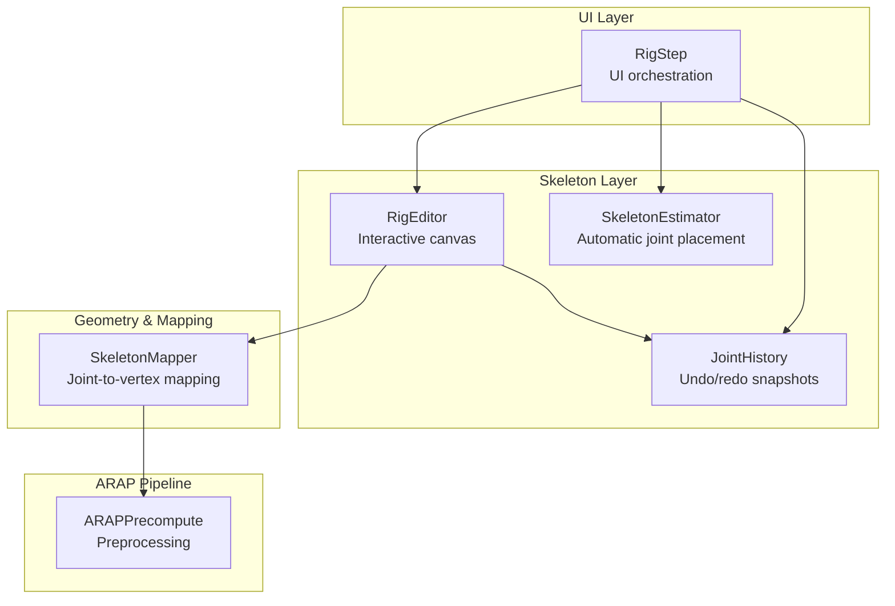

**Diagram sources**
- [RigStep.js:30-260](file://src/ui/RigStep.js#L30-L260)
- [RigEditor.js:85-192](file://src/skeleton/RigEditor.js#L85-L192)
- [SkeletonEstimator.js:89-113](file://src/skeleton/SkeletonEstimator.js#L89-L113)
- [JointHistory.js:14-109](file://src/skeleton/JointHistory.js#L14-L109)
- [SkeletonMapper.js:27-83](file://src/skeleton/SkeletonMapper.js#L27-L83)
- [ARAPPrecompute.js:206-296](file://src/arap/ARAPPrecompute.js#L206-L296)

**Section sources**
- [RigStep.js:30-260](file://src/ui/RigStep.js#L30-L260)
- [RigEditor.js:85-192](file://src/skeleton/RigEditor.js#L85-L192)
- [SkeletonEstimator.js:89-113](file://src/skeleton/SkeletonEstimator.js#L89-L113)
- [JointHistory.js:14-109](file://src/skeleton/JointHistory.js#L14-L109)
- [SkeletonMapper.js:27-83](file://src/skeleton/SkeletonMapper.js#L27-L83)
- [ARAPPrecompute.js:206-296](file://src/arap/ARAPPrecompute.js#L206-L296)

## Core Components
- RigEditor: Interactive 2D canvas for joint placement, drag-and-drop, hit testing, and rendering with warnings.
- RigStep: UI step orchestrating RigEditor, skeleton estimation, undo/redo, and navigation.
- SkeletonEstimator: Automatic humanoid joint placement from a binary mask.
- JointHistory: Circular buffer for undo/redo snapshots of joint positions.
- SkeletonMapper: Maps joints to mesh vertices with uniqueness enforcement and “too far” detection.
- ARAPPrecompute: Builds ARAP constraints from the mesh and pin mapping for downstream motion solving.

**Section sources**
- [RigEditor.js:85-192](file://src/skeleton/RigEditor.js#L85-L192)
- [RigStep.js:15-61](file://src/ui/RigStep.js#L15-L61)
- [SkeletonEstimator.js:89-113](file://src/skeleton/SkeletonEstimator.js#L89-L113)
- [JointHistory.js:14-109](file://src/skeleton/JointHistory.js#L14-L109)
- [SkeletonMapper.js:27-83](file://src/skeleton/SkeletonMapper.js#L27-L83)
- [ARAPPrecompute.js:206-296](file://src/arap/ARAPPrecompute.js#L206-L296)

## Architecture Overview
The rig editor state is a JointPositionList that can be overridden by manual edits. These edits propagate to downstream systems via the pin mapping used by ARAP preprocessing. The UI step wires RigEditor to JointHistory and exposes keyboard shortcuts and character type switching.

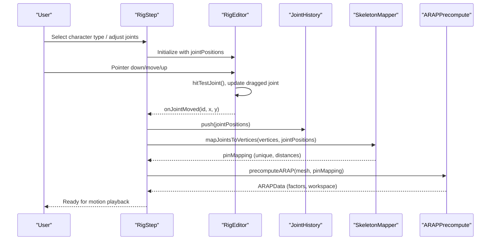

**Diagram sources**
- [RigStep.js:221-242](file://src/ui/RigStep.js#L221-L242)
- [RigEditor.js:311-366](file://src/skeleton/RigEditor.js#L311-L366)
- [JointHistory.js:35-53](file://src/skeleton/JointHistory.js#L35-L53)
- [SkeletonMapper.js:27-83](file://src/skeleton/SkeletonMapper.js#L27-L83)
- [ARAPPrecompute.js:206-296](file://src/arap/ARAPPrecompute.js#L206-L296)

## Detailed Component Analysis

### RigEditor: Interactive Joint Management
RigEditor renders joints and bones on a canvas, supports pointer-based selection and drag, and provides visual feedback including hover, drag, and “too far” warnings. It can operate in humanoid or freeform modes.

Key behaviors:
- Hit testing selects the closest joint within a radius.
- Drag updates the selected joint’s position in real time.
- Rendering draws bones using predefined humanoid hierarchy or sequential freeform bones.
- Distance warnings compare joint proximity to a mesh boundary.
- Freeform mode allows adding/removing joints with min/max constraints.

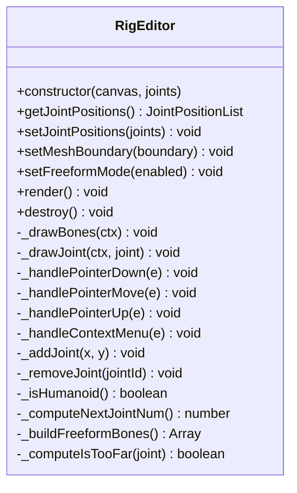

**Diagram sources**
- [RigEditor.js:85-192](file://src/skeleton/RigEditor.js#L85-L192)
- [RigEditor.js:311-366](file://src/skeleton/RigEditor.js#L311-L366)
- [RigEditor.js:391-417](file://src/skeleton/RigEditor.js#L391-L417)
- [RigEditor.js:425-475](file://src/skeleton/RigEditor.js#L425-L475)

**Section sources**
- [RigEditor.js:85-192](file://src/skeleton/RigEditor.js#L85-L192)
- [RigEditor.js:311-366](file://src/skeleton/RigEditor.js#L311-L366)
- [RigEditor.js:391-417](file://src/skeleton/RigEditor.js#L391-L417)
- [RigEditor.js:425-475](file://src/skeleton/RigEditor.js#L425-L475)
- [RigEditor.test.js:39-70](file://src/skeleton/RigEditor.test.js#L39-L70)
- [RigEditor.test.js:108-165](file://src/skeleton/RigEditor.test.js#L108-L165)
- [RigEditor.test.js:169-184](file://src/skeleton/RigEditor.test.js#L169-L184)
- [RigEditor.test.js:188-250](file://src/skeleton/RigEditor.test.js#L188-L250)

### RigStep: UI Orchestration and Workflow
RigStep initializes the UI, estimates initial joints (humanoid or freeform), wires RigEditor to JointHistory, and exposes keyboard shortcuts and navigation. It also switches character types and reinitializes the editor accordingly.

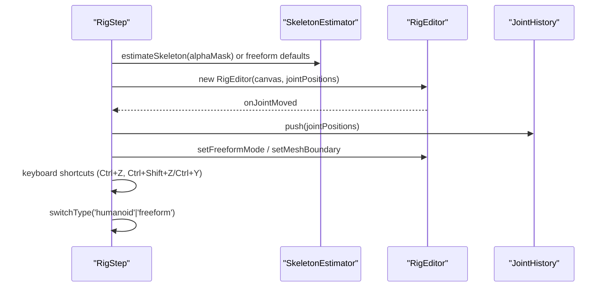

**Diagram sources**
- [RigStep.js:30-84](file://src/ui/RigStep.js#L30-L84)
- [RigStep.js:221-242](file://src/ui/RigStep.js#L221-L242)
- [RigStep.js:284-307](file://src/ui/RigStep.js#L284-L307)
- [RigStep.js:329-341](file://src/ui/RigStep.js#L329-L341)

**Section sources**
- [RigStep.js:30-84](file://src/ui/RigStep.js#L30-L84)
- [RigStep.js:221-242](file://src/ui/RigStep.js#L221-L242)
- [RigStep.js:284-307](file://src/ui/RigStep.js#L284-L307)
- [RigStep.js:329-341](file://src/ui/RigStep.js#L329-L341)

### SkeletonEstimator: Automatic Joint Placement
SkeletonEstimator computes a standard humanoid skeleton from a binary mask using bounding box and centroid heuristics. This provides the initial joint positions for the rig editor.

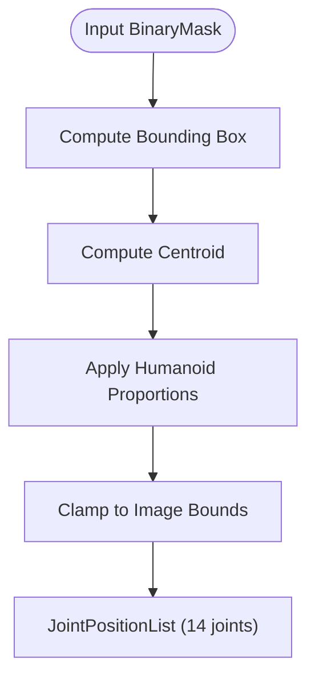

**Diagram sources**
- [SkeletonEstimator.js:89-113](file://src/skeleton/SkeletonEstimator.js#L89-L113)

**Section sources**
- [SkeletonEstimator.js:89-113](file://src/skeleton/SkeletonEstimator.js#L89-L113)

### JointHistory: Undo/Redo Snapshots
JointHistory maintains a circular buffer of joint position snapshots. Each edit pushes a new snapshot, enabling undo/redo with capacity limits.

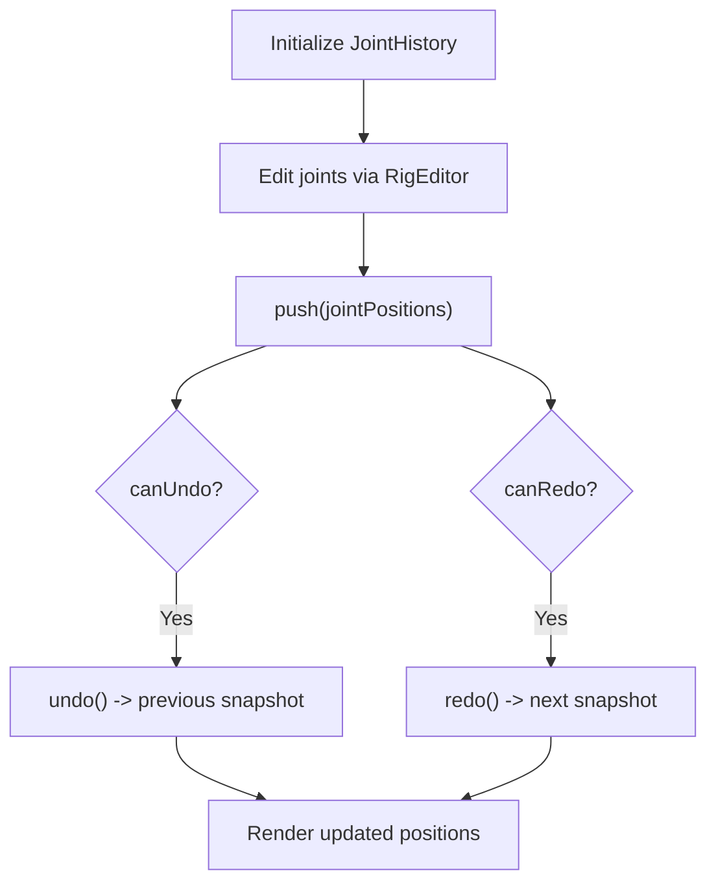

**Diagram sources**
- [JointHistory.js:35-91](file://src/skeleton/JointHistory.js#L35-L91)

**Section sources**
- [JointHistory.js:35-91](file://src/skeleton/JointHistory.js#L35-L91)

### SkeletonMapper: Joint-to-Vertex Mapping and Constraints
SkeletonMapper maps joints to mesh vertices with uniqueness enforcement and marks “too far” joints. This mapping becomes the pin mapping used by ARAP preprocessing.

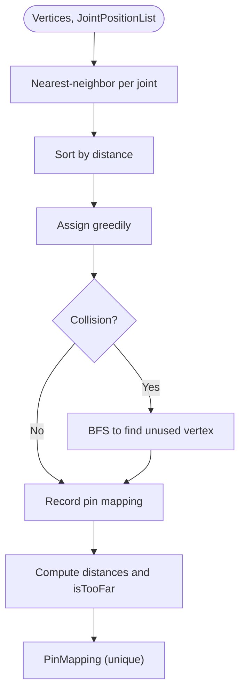

**Diagram sources**
- [SkeletonMapper.js:27-83](file://src/skeleton/SkeletonMapper.js#L27-L83)

**Section sources**
- [SkeletonMapper.js:27-83](file://src/skeleton/SkeletonMapper.js#L27-L83)

### ARAPPrecompute: Downstream Constraint Requirements
ARAPPrecompute builds cotangent weights, Laplacians, and Cholesky factors using the pin mapping. It supports fallback strategies and validates results to ensure downstream motion solvers can operate reliably.

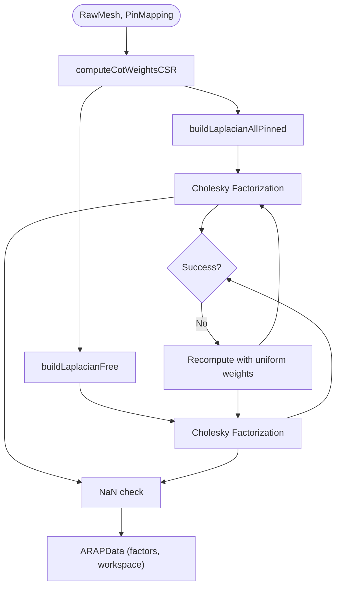

**Diagram sources**
- [ARAPPrecompute.js:206-296](file://src/arap/ARAPPrecompute.js#L206-L296)

**Section sources**
- [ARAPPrecompute.js:206-296](file://src/arap/ARAPPrecompute.js#L206-L296)

### Manual Joint Correction Workflow and User Interaction Patterns
- Selection: Pointer down triggers hit testing; the closest joint within a radius is selected.
- Drag-and-drop: While dragging, the joint position updates in real time; on release, the editor emits a move event.
- Real-time preview: Rendering updates immediately to reflect bone connections and joint labels.
- Freeform mode: Clicking empty space adds a joint; right-click on a joint removes it (context menu), respecting min/max counts.
- Distance warnings: Joints flagged as “too far” are highlighted and annotated.

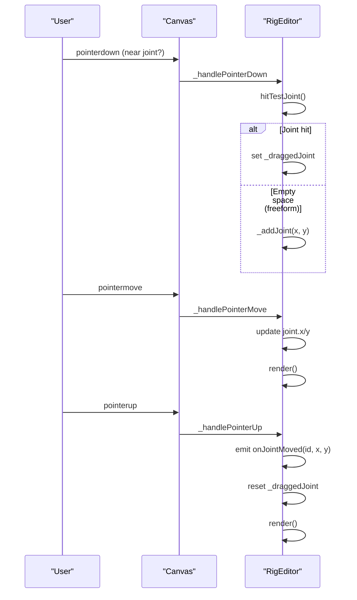

**Diagram sources**
- [RigEditor.js:311-366](file://src/skeleton/RigEditor.js#L311-L366)
- [RigEditor.js:391-417](file://src/skeleton/RigEditor.js#L391-L417)

**Section sources**
- [RigEditor.js:311-366](file://src/skeleton/RigEditor.js#L311-L366)
- [RigEditor.js:391-417](file://src/skeleton/RigEditor.js#L391-L417)
- [RigEditor.test.js:108-165](file://src/skeleton/RigEditor.test.js#L108-L165)

### Integration with Skeleton Estimation Results and Overrides
- Initial positions come from SkeletonEstimator (humanoid) or freeform defaults.
- Manual adjustments override automatic positions and are captured by JointHistory.
- The UI notifies downstream steps of joint changes and type switches.

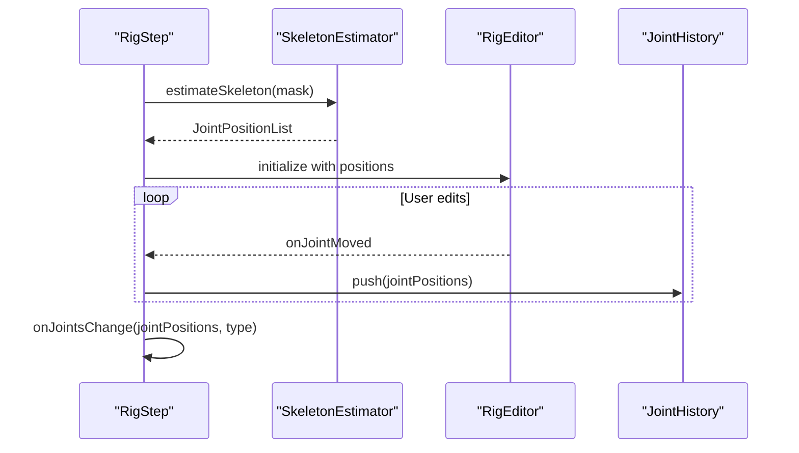

**Diagram sources**
- [RigStep.js:67-84](file://src/ui/RigStep.js#L67-L84)
- [RigStep.js:232-239](file://src/ui/RigStep.js#L232-L239)
- [SkeletonEstimator.js:89-113](file://src/skeleton/SkeletonEstimator.js#L89-L113)

**Section sources**
- [RigStep.js:67-84](file://src/ui/RigStep.js#L67-L84)
- [RigStep.js:232-239](file://src/ui/RigStep.js#L232-L239)
- [SkeletonEstimator.js:89-113](file://src/skeleton/SkeletonEstimator.js#L89-L113)

### Joint Hierarchy Preservation During Manual Edits
- Humanoid mode uses a predefined bone hierarchy; freeform mode connects joints sequentially.
- The editor does not modify the semantic hierarchy; it preserves the implicit parent-child relationships defined by the bone list.
- Downstream mapping and ARAP constraints rely on the pin mapping derived from the current joint positions.

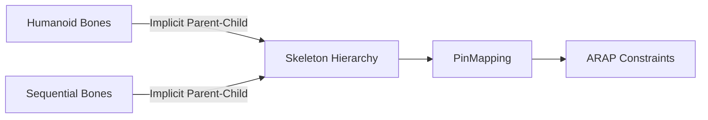

**Diagram sources**
- [RigEditor.js:39-53](file://src/skeleton/RigEditor.js#L39-L53)
- [RigEditor.js:450-456](file://src/skeleton/RigEditor.js#L450-L456)
- [characterdata.md:171-188](file://architecture/characterdata.md#L171-L188)

**Section sources**
- [RigEditor.js:39-53](file://src/skeleton/RigEditor.js#L39-L53)
- [RigEditor.js:450-456](file://src/skeleton/RigEditor.js#L450-L456)
- [characterdata.md:171-188](file://architecture/characterdata.md#L171-L188)

### Constraint Enforcement and “Too Far” Warnings
- Distance threshold: Joints more than a fixed distance from the mesh boundary are considered too far.
- Visual feedback: Highlighted joints with tooltips.
- Downstream impact: Too-far joints increase risk of over-constrained systems; SkeletonMapper flags them and may require adjustment.

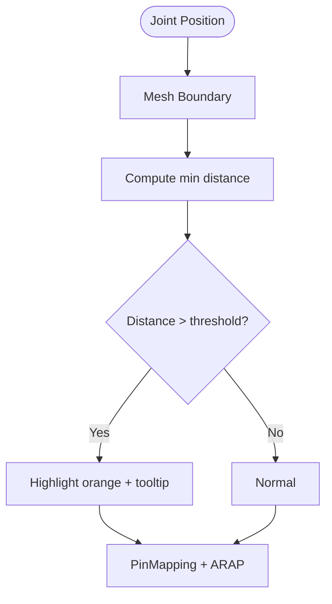

**Diagram sources**
- [RigEditor.js:463-475](file://src/skeleton/RigEditor.js#L463-L475)
- [SkeletonMapper.js:18](file://src/skeleton/SkeletonMapper.js#L18)
- [characterdata.md:230-232](file://architecture/characterdata.md#L230-L232)

**Section sources**
- [RigEditor.js:463-475](file://src/skeleton/RigEditor.js#L463-L475)
- [SkeletonMapper.js:18](file://src/skeleton/SkeletonMapper.js#L18)
- [characterdata.md:230-232](file://architecture/characterdata.md#L230-L232)

### Practical Examples of Common Rigging Corrections
- Shoulder alignment: Drag l_shoulder/r_shoulder to align with estimated upper arms; watch bone connections update in real time.
- Hip positioning: Adjust l_hip/r_hip to match pelvis; ensure distance from mesh boundary remains acceptable.
- Limb proportion adjustments: Fine-tune elbow/wrist or knee/ankle to avoid “too far” warnings; maintain freeform or humanoid bone continuity.

These corrections are applied iteratively, with immediate visual feedback and undo capability.

**Section sources**
- [RigEditor.js:311-366](file://src/skeleton/RigEditor.js#L311-L366)
- [RigEditor.js:463-475](file://src/skeleton/RigEditor.js#L463-L475)
- [RigEditor.test.js:108-165](file://src/skeleton/RigEditor.test.js#L108-L165)

### Keyboard Shortcuts and Accessibility
- Keyboard shortcuts:
  - Undo: Ctrl+Z
  - Redo: Ctrl+Shift+Z or Ctrl+Y
- Accessibility:
  - Canvas labeled appropriately for screen readers.
  - Buttons include aria-label attributes for undo/redo and “Bring to Life”.

**Section sources**
- [RigStep.js:329-341](file://src/ui/RigStep.js#L329-L341)
- [RigStep.js:162-174](file://src/ui/RigStep.js#L162-L174)
- [RigStep.js:115-126](file://src/ui/RigStep.js#L115-L126)

### Relationship Between Rig Editor State and ARAP Preprocessing
- Rig editor state: JointPositionList (pixel space).
- Downstream: SkeletonMapper produces PinMapping (joint-to-vertex mapping) with uniqueness and distance flags.
- ARAPPrecompute consumes PinMapping to construct constraints and factor matrices.
- The UI step coordinates these transitions and ensures readiness for motion playback.

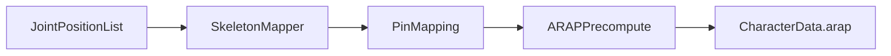

**Diagram sources**
- [RigStep.js:232-239](file://src/ui/RigStep.js#L232-L239)
- [SkeletonMapper.js:27-83](file://src/skeleton/SkeletonMapper.js#L27-L83)
- [ARAPPrecompute.js:206-296](file://src/arap/ARAPPrecompute.js#L206-L296)
- [buildCharacterData.js:71-153](file://src/character/buildCharacterData.js#L71-L153)

**Section sources**
- [RigStep.js:232-239](file://src/ui/RigStep.js#L232-L239)
- [SkeletonMapper.js:27-83](file://src/skeleton/SkeletonMapper.js#L27-L83)
- [ARAPPrecompute.js:206-296](file://src/arap/ARAPPrecompute.js#L206-L296)
- [buildCharacterData.js:71-153](file://src/character/buildCharacterData.js#L71-L153)

## Dependency Analysis
RigEditor depends on UI orchestration and history, while downstream systems depend on the pin mapping produced from current joint positions.

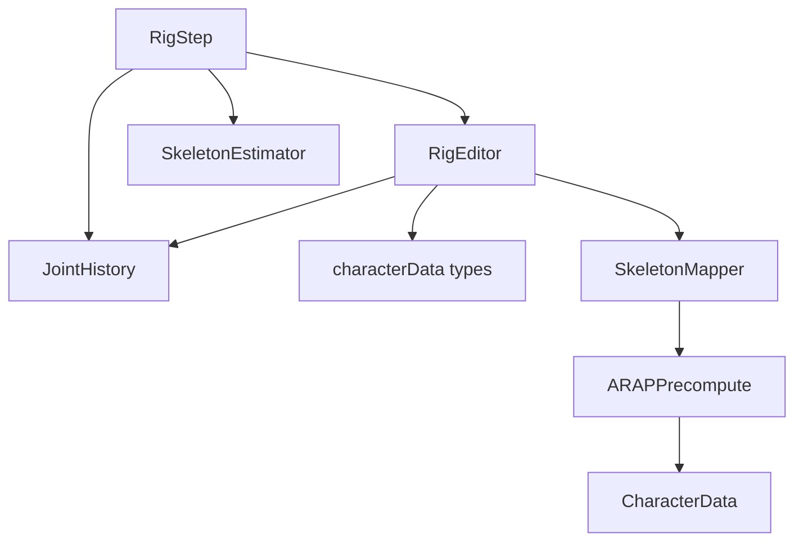

**Diagram sources**
- [RigEditor.js:85-192](file://src/skeleton/RigEditor.js#L85-L192)
- [RigStep.js:221-242](file://src/ui/RigStep.js#L221-L242)
- [SkeletonEstimator.js:89-113](file://src/skeleton/SkeletonEstimator.js#L89-L113)
- [JointHistory.js:35-53](file://src/skeleton/JointHistory.js#L35-L53)
- [SkeletonMapper.js:27-83](file://src/skeleton/SkeletonMapper.js#L27-L83)
- [ARAPPrecompute.js:206-296](file://src/arap/ARAPPrecompute.js#L206-L296)
- [characterData.js:65](file://src/types/characterData.js#L65)

**Section sources**
- [RigEditor.js:85-192](file://src/skeleton/RigEditor.js#L85-L192)
- [RigStep.js:221-242](file://src/ui/RigStep.js#L221-L242)
- [SkeletonEstimator.js:89-113](file://src/skeleton/SkeletonEstimator.js#L89-L113)
- [JointHistory.js:35-53](file://src/skeleton/JointHistory.js#L35-L53)
- [SkeletonMapper.js:27-83](file://src/skeleton/SkeletonMapper.js#L27-L83)
- [ARAPPrecompute.js:206-296](file://src/arap/ARAPPrecompute.js#L206-L296)
- [characterData.js:65](file://src/types/characterData.js#L65)

## Performance Considerations
- Rendering cost: Minimal per-frame updates; only redrawn on pointer move/up and when joints change.
- Hit testing: Linear scan over joints; acceptable for typical counts (3–20).
- Distance computation: Per-joint minimum distance to boundary; efficient with a simple loop.
- Downstream mapping: Greedy assignment with BFS fallback; complexity dominated by nearest-neighbor search and adjacency construction.

[No sources needed since this section provides general guidance]

## Troubleshooting Guide
- Joints not selectable:
  - Ensure pointer is within hit radius and close enough to a joint.
  - Verify freeform mode is disabled when expecting humanoid joints.
- Drag does not move:
  - Confirm pointer was initially over a joint; otherwise, no drag target is set.
- “Too far” warnings:
  - Move the joint closer to the mesh boundary; consider adjusting character type or mesh quality.
- Undo/redo not working:
  - Check that JointHistory has snapshots and that the UI wires onJointMoved to push snapshots.
- Bring to Life disabled:
  - Requires at least three joints; verify joint count updates after edits.

**Section sources**
- [RigEditor.js:311-366](file://src/skeleton/RigEditor.js#L311-L366)
- [RigEditor.js:463-475](file://src/skeleton/RigEditor.js#L463-L475)
- [RigStep.js:284-307](file://src/ui/RigStep.js#L284-L307)
- [RigStep.js:320-324](file://src/ui/RigStep.js#L320-L324)

## Conclusion
The Rig Editor provides an intuitive, responsive interface for manual skeleton correction, integrating seamlessly with automatic estimation, undo/redo, and downstream ARAP preprocessing. Its design balances usability with robustness, ensuring downstream systems receive well-formed constraints while offering clear feedback and accessibility.

[No sources needed since this section summarizes without analyzing specific files]

## Appendices

### Data Model: JointPositionList and PinMapping
- JointPositionList: Ordered list of joint positions used before full CharacterData is built.
- PinMapping: One entry per joint, mapping to a unique mesh vertex with distance and “too far” flags.

**Section sources**
- [characterData.js:65](file://src/types/characterData.js#L65)
- [characterData.js:79](file://src/types/characterData.js#L79)
- [characterdata.md:192-207](file://architecture/characterdata.md#L192-L207)

### IK Drag Handler Integration
While the rig editor manipulates joint positions directly, the IK drag handler provides a similar hit-testing mechanism for downstream motion editing. Both rely on spatial proximity to select targets.

**Section sources**
- [IKDragHandler.js:51-74](file://src/motion/IKDragHandler.js#L51-L74)
- [RigEditor.js:66](file://src/skeleton/RigEditor.js#L66)