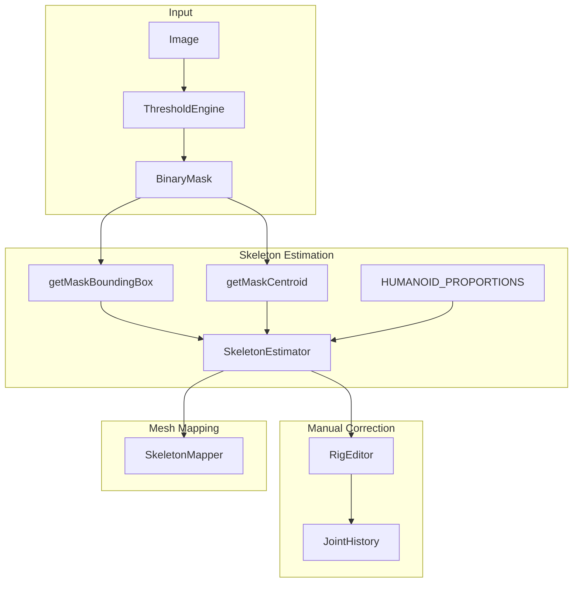
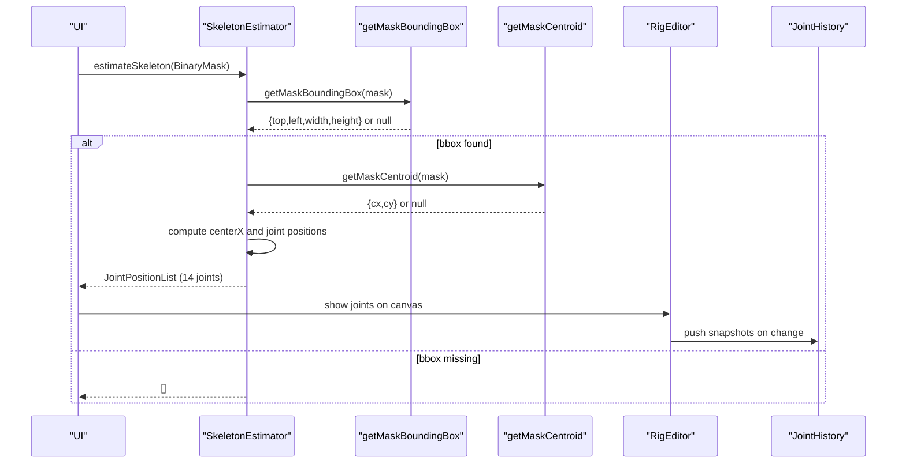
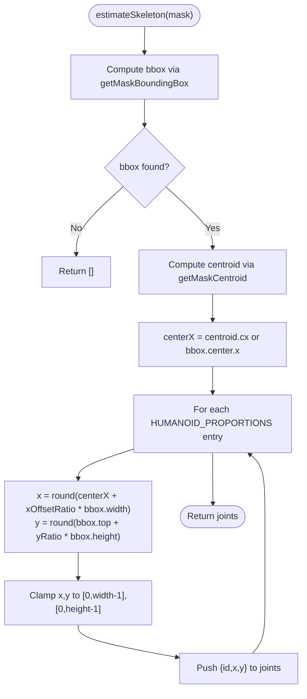
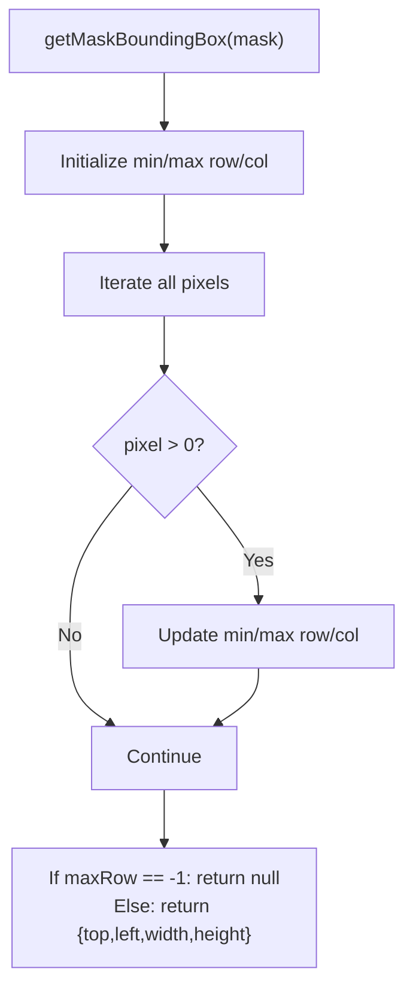
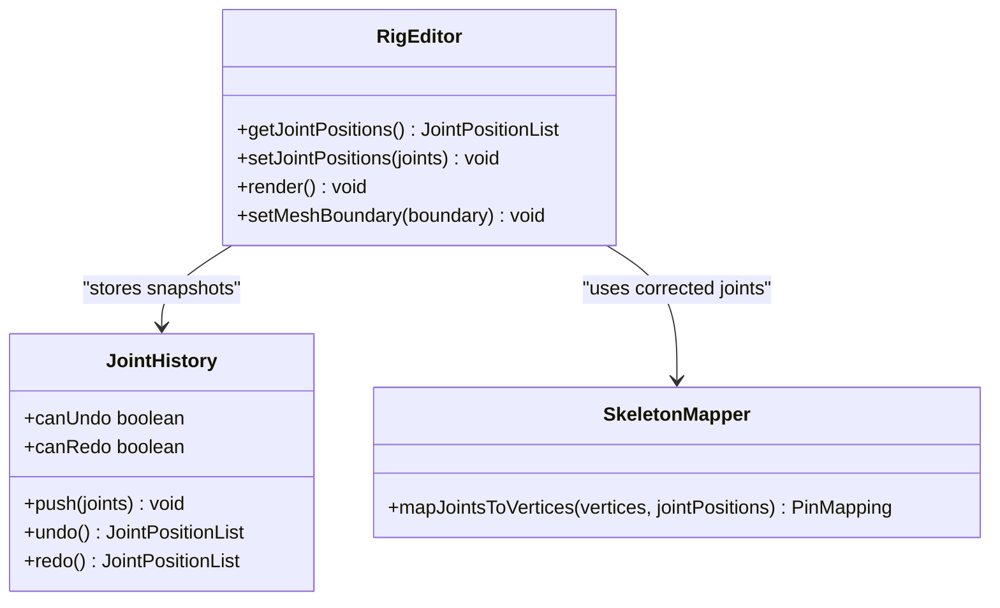
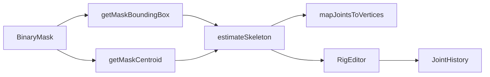

# Skeleton Estimation

<cite>
**Referenced Files in This Document**
- [SkeletonEstimator.js](file://src/skeleton/SkeletonEstimator.js)
- [bbox.js](file://src/utils/bbox.js)
- [SkeletonMapper.js](file://src/skeleton/SkeletonMapper.js)
- [JointHistory.js](file://src/skeleton/JointHistory.js)
- [RigEditor.js](file://src/skeleton/RigEditor.js)
- [characterData.js](file://src/types/characterData.js)
- [module_design.md](file://architecture/module_design.md)
- [SkeletonEstimator.test.js](file://src/skeleton/SkeletonEstimator.test.js)
- [bbox.test.js](file://src/utils/bbox.test.js)
</cite>

## Table of Contents
1. [Introduction](#introduction)
2. [Project Structure](#project-structure)
3. [Core Components](#core-components)
4. [Architecture Overview](#architecture-overview)
5. [Detailed Component Analysis](#detailed-component-analysis)
6. [Dependency Analysis](#dependency-analysis)
7. [Performance Considerations](#performance-considerations)
8. [Troubleshooting Guide](#troubleshooting-guide)
9. [Conclusion](#conclusion)
10. [Appendices](#appendices)

## Introduction
This document explains the Skeleton Estimation component that powers PaperAlive’s automatic humanoid skeleton detection. It focuses on the heuristic approach using bounding box proportions and centroid analysis to estimate 14 joint positions. It documents the getMaskBoundingBox and getMaskCentroid utilities, the HUMANOID_PROPORTIONS ratios, the mathematical calculation for joint placement, and the image boundary clamping mechanism. Practical examples illustrate how the estimator behaves across different character silhouettes and body proportions. Limitations and scenarios where manual correction is recommended are covered, along with the relationship between mask quality and skeleton accuracy.

## Project Structure
The Skeleton Estimation pipeline integrates tightly with the broader preprocessing and rigging workflow:
- Image input is converted to a BinaryMask.
- SkeletonEstimator computes a bounding box and centroid, then places 14 joints using predefined proportions.
- RigEditor allows interactive manual correction of joint positions.
- JointHistory stores undo/redo snapshots of joint placements.
- SkeletonMapper maps joints to mesh vertices with uniqueness enforcement.

**Diagram sources**
- [module_design.md](file://architecture/module_design.md)
- [SkeletonEstimator.js](file://src/skeleton/SkeletonEstimator.js)
- [bbox.js](file://src/utils/bbox.js)
- [RigEditor.js](file://src/skeleton/RigEditor.js)
- [JointHistory.js](file://src/skeleton/JointHistory.js)
- [SkeletonMapper.js](file://src/skeleton/SkeletonMapper.js)

**Section sources**
- [module_design.md](file://architecture/module_design.md)
- [SkeletonEstimator.js](file://src/skeleton/SkeletonEstimator.js)

## Core Components
- SkeletonEstimator: Computes bounding box and centroid, applies HUMANOID_PROPORTIONS to place 14 joints, and clamps positions to image bounds.
- bbox utilities: getMaskBoundingBox and getMaskCentroid provide robust geometric analysis of BinaryMask.
- RigEditor: Interactive UI for manual correction and validation of skeleton placement.
- JointHistory: Undo/redo support for joint placement snapshots.
- SkeletonMapper: Maps joints to mesh vertices with uniqueness enforcement.

**Section sources**
- [SkeletonEstimator.js](file://src/skeleton/SkeletonEstimator.js)
- [bbox.js](file://src/utils/bbox.js)
- [RigEditor.js](file://src/skeleton/RigEditor.js)
- [JointHistory.js](file://src/skeleton/JointHistory.js)
- [SkeletonMapper.js](file://src/skeleton/SkeletonMapper.js)

## Architecture Overview
The Skeleton Estimation component is designed to be worker-safe and deterministic. It relies on:
- BinaryMask input with row-major storage semantics.
- Bounding box and centroid computations for robust localization.
- Proportional placement aligned with standard human body proportions.
- Image boundary clamping to ensure valid pixel coordinates.

**Diagram sources**
- [SkeletonEstimator.js](file://src/skeleton/SkeletonEstimator.js)
- [bbox.js](file://src/utils/bbox.js)
- [RigEditor.js](file://src/skeleton/RigEditor.js)
- [JointHistory.js](file://src/skeleton/JointHistory.js)

## Detailed Component Analysis

### SkeletonEstimator: Humanoid Heuristic and Joint Placement
- Purpose: Estimate 14 humanoid joints from a BinaryMask using bounding box proportions and centroid analysis.
- Inputs: BinaryMask (Uint8Array with width and height).
- Outputs: JointPositionList (14 joints with id, x, y).
- Key functions:
  - getMaskBoundingBox(mask): Axis-aligned bounding box of foreground pixels.
  - getMaskCentroid(mask): Center of mass of foreground pixels.
  - estimateSkeleton(mask): Computes joint positions using HUMANOID_PROPORTIONS and clamps to image bounds.

**Diagram sources**
- [SkeletonEstimator.js](file://src/skeleton/SkeletonEstimator.js)

**Section sources**
- [SkeletonEstimator.js](file://src/skeleton/SkeletonEstimator.js)
- [characterData.js](file://src/types/characterData.js)

### Utility Functions: getMaskBoundingBox and getMaskCentroid
- getMaskBoundingBox(mask):
  - Iterates over all pixels to find min/max row/column indices.
  - Returns null if no foreground pixels are found.
  - Otherwise returns {top, left, width, height}.
- getMaskCentroid(mask):
  - Sums x and y coordinates weighted by foreground pixels.
  - Returns null if no foreground pixels are found.
  - Otherwise returns {cx, cy}.

**Diagram sources**
- [bbox.js](file://src/utils/bbox.js)

**Section sources**
- [bbox.js](file://src/utils/bbox.js)
- [bbox.test.js](file://src/utils/bbox.test.js)

### HUMANOID_PROPORTIONS: Anatomically Reasonable Ratios
- Each entry defines [id, yRatio, xOffsetRatio] where:
  - yRatio: vertical position as a fraction of bbox height (0=top, 1=bottom).
  - xOffsetRatio: horizontal offset from bbox center as a fraction of bbox width (negative=left, positive=right, 0=center).
- Typical placements:
  - Head near top of bbox.
  - Neck slightly below head.
  - Shoulders ~20% down, offset by ±15% of width.
  - Elbows ~40% down, offset by ±22% of width.
  - Wrists ~55% down, offset by ±18% of width.
  - Hips ~58% down, offset by ±10% of width.
  - Knees ~78% down, offset by ±8% of width.
  - Ankles ~95% down, offset by ±8% of width.

These ratios reflect standard human body proportions and produce anatomically reasonable joint placements for typical humanoid silhouettes.

**Section sources**
- [SkeletonEstimator.js](file://src/skeleton/SkeletonEstimator.js)

### Mathematical Calculation and Boundary Clamping
- Horizontal center reference:
  - Prefer centroid.cx for asymmetric silhouettes.
  - Fall back to bbox.center.x if centroid is null.
- Joint x/y computation:
  - x = round(centerX + xOffsetRatio × bbox.width)
  - y = round(bbox.top + yRatio × bbox.height)
- Boundary clamping ensures valid pixel coordinates:
  - x ∈ [0, width−1]
  - y ∈ [0, height−1]

This guarantees that all estimated joints lie within the image bounds.

**Section sources**
- [SkeletonEstimator.js](file://src/skeleton/SkeletonEstimator.js)

### Practical Examples of Skeleton Estimation
- Example 1: Symmetric vertical oval (typical humanoid silhouette)
  - Bounding box captures the full body.
  - Centroid aligns with the body’s center.
  - Joints placed according to HUMANOID_PROPORTIONS yield a realistic pose.
- Example 2: Asymmetric or off-center silhouette
  - Centroid provides a more accurate horizontal center than bbox center.
  - Joints remain proportionally spaced and anatomically plausible.
- Example 3: Small or fragmented masks
  - If no foreground pixels are found, bbox returns null and estimateSkeleton returns [].
  - Tests confirm this behavior and verify joint ordering and bounds.

Validation tests demonstrate:
- Correct bbox and centroid computation for rectangles and ovals.
- All 14 joint IDs present for humanoid masks.
- Joint positions constrained within image bounds.
- Vertical ordering and lateral offsets consistent with proportions.

**Section sources**
- [SkeletonEstimator.test.js](file://src/skeleton/SkeletonEstimator.test.js)
- [bbox.test.js](file://src/utils/bbox.test.js)

### Manual Correction and Undo/Redo
- RigEditor renders joint handles and skeleton bones, enabling drag-and-drop adjustments.
- JointHistory stores deep-cloned snapshots of JointPositionList for undo/redo.
- Combined with SkeletonMapper, corrected joints can be remapped to mesh vertices with uniqueness enforcement.

**Diagram sources**
- [RigEditor.js](file://src/skeleton/RigEditor.js)
- [JointHistory.js](file://src/skeleton/JointHistory.js)
- [SkeletonMapper.js](file://src/skeleton/SkeletonMapper.js)

**Section sources**
- [RigEditor.js](file://src/skeleton/RigEditor.js)
- [JointHistory.js](file://src/skeleton/JointHistory.js)
- [SkeletonMapper.js](file://src/skeleton/SkeletonMapper.js)

## Dependency Analysis
- SkeletonEstimator depends on bbox utilities for geometric analysis.
- SkeletonMapper consumes JointPositionList and requires uniqueness enforcement.
- RigEditor and JointHistory integrate at the UI level to enable iterative refinement.
- All modules are worker-safe except UI components (RigEditor).

**Diagram sources**
- [SkeletonEstimator.js](file://src/skeleton/SkeletonEstimator.js)
- [bbox.js](file://src/utils/bbox.js)
- [SkeletonMapper.js](file://src/skeleton/SkeletonMapper.js)
- [RigEditor.js](file://src/skeleton/RigEditor.js)
- [JointHistory.js](file://src/skeleton/JointHistory.js)

**Section sources**
- [module_design.md](file://architecture/module_design.md)
- [SkeletonEstimator.js](file://src/skeleton/SkeletonEstimator.js)
- [bbox.js](file://src/utils/bbox.js)
- [SkeletonMapper.js](file://src/skeleton/SkeletonMapper.js)
- [RigEditor.js](file://src/skeleton/RigEditor.js)
- [JointHistory.js](file://src/skeleton/JointHistory.js)

## Performance Considerations
- Bounding box and centroid computations iterate over all pixels; for large images, consider preprocessing masks to reduce resolution or noise.
- The estimator is O(F) where F is the number of foreground pixels, which is typically much smaller than W×H.
- Image boundary clamping is constant-time per joint.
- Worker-safe design avoids DOM access, enabling off-main-thread execution in the preprocessing pipeline.

[No sources needed since this section provides general guidance]

## Troubleshooting Guide
Common issues and remedies:
- No joints returned:
  - Cause: mask contains no foreground pixels.
  - Action: Recreate mask with higher threshold or fix input image.
- Joints outside image bounds:
  - Cause: extreme skew or very small masks.
  - Action: Verify mask quality and ensure sufficient foreground coverage.
- Asymmetry artifacts:
  - Cause: bbox center vs centroid differences.
  - Action: Rely on automatic centroid-based centering; adjust mask if silhouette is highly skewed.
- Incorrect joint ordering:
  - Cause: Unexpected proportions due to unusual body shapes.
  - Action: Manually adjust joints via RigEditor; use JointHistory to undo changes.
- Too-far warnings:
  - Cause: Joints mapped >20px from mesh boundary.
  - Action: Move joints closer to the mesh or refine mask.

**Section sources**
- [SkeletonEstimator.js](file://src/skeleton/SkeletonEstimator.js)
- [RigEditor.js](file://src/skeleton/RigEditor.js)
- [JointHistory.js](file://src/skeleton/JointHistory.js)

## Conclusion
PaperAlive’s Skeleton Estimation component provides a fast, robust, and anatomically grounded approach to automatic humanoid skeleton detection. By combining bounding box and centroid analysis with standardized proportions, it reliably estimates 14 joint positions suitable for mesh mapping and ARAP deformation. While the heuristic works well for typical humanoid silhouettes, manual correction via RigEditor and JointHistory remains essential for fine-tuning and handling edge cases. The quality of the input mask is the primary determinant of skeleton accuracy—ensure good contrast, minimal noise, and adequate foreground coverage for optimal results.

[No sources needed since this section summarizes without analyzing specific files]

## Appendices

### API Summary
- estimateSkeleton(mask): Returns JointPositionList (14 joints).
- getMaskBoundingBox(mask): Returns {top, left, width, height} or null.
- getMaskCentroid(mask): Returns {cx, cy} or null.

**Section sources**
- [SkeletonEstimator.js](file://src/skeleton/SkeletonEstimator.js)
- [bbox.js](file://src/utils/bbox.js)
- [characterData.js](file://src/types/characterData.js)