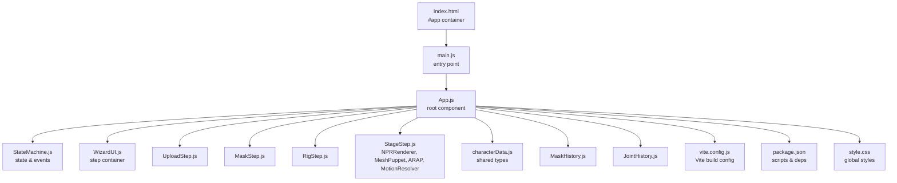
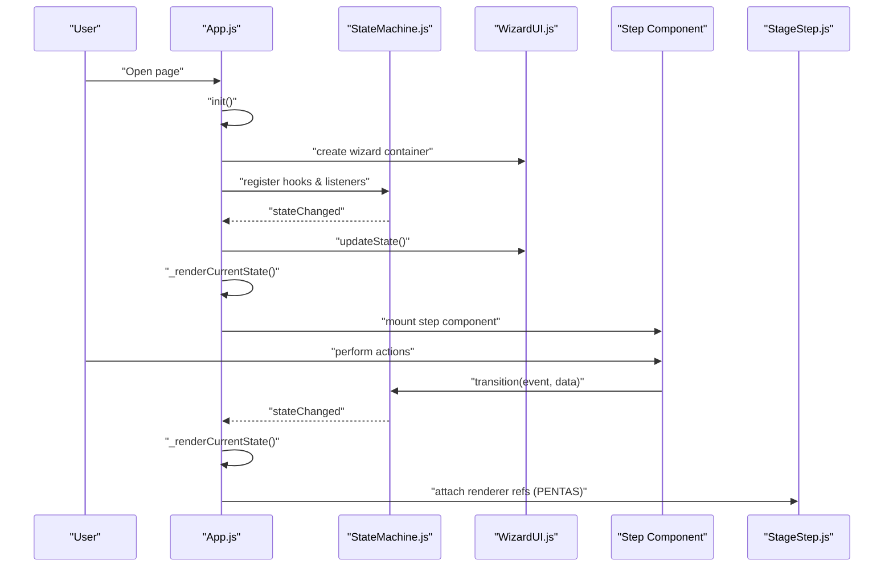
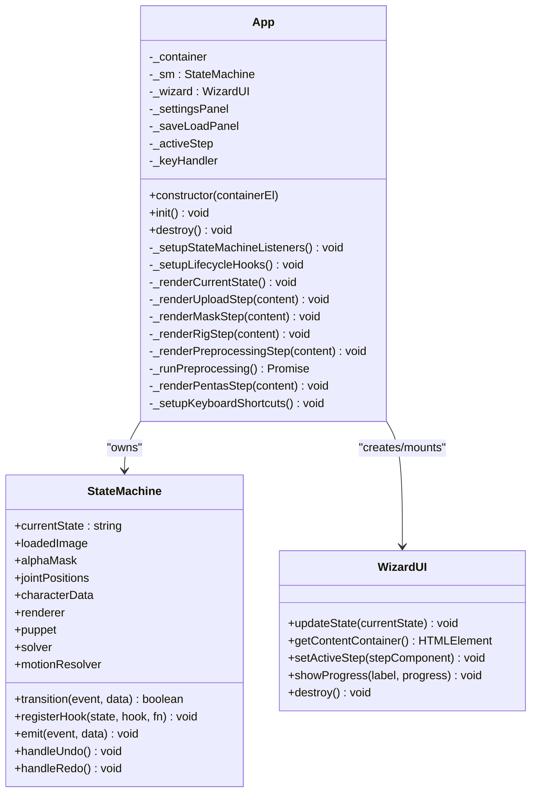
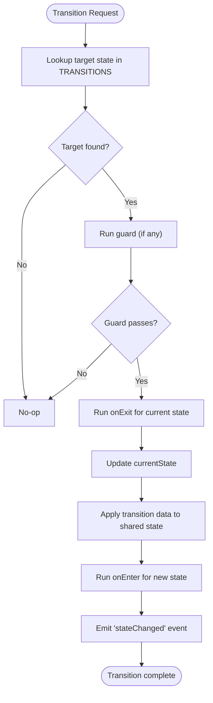
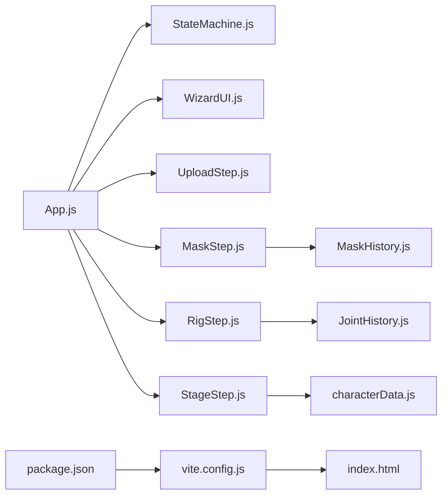

# App Root Component

<cite>
**Referenced Files in This Document**
- [App.js](file://src/App.js)
- [main.js](file://src/main.js)
- [index.html](file://index.html)
- [vite.config.js](file://vite.config.js)
- [package.json](file://package.json)
- [StateMachine.js](file://src/state/StateMachine.js)
- [WizardUI.js](file://src/ui/WizardUI.js)
- [UploadStep.js](file://src/ui/UploadStep.js)
- [MaskStep.js](file://src/ui/MaskStep.js)
- [RigStep.js](file://src/ui/RigStep.js)
- [StageStep.js](file://src/ui/StageStep.js)
- [characterData.js](file://src/types/characterData.js)
- [MaskHistory.js](file://src/history/MaskHistory.js)
- [JointHistory.js](file://src/skeleton/JointHistory.js)
- [style.css](file://src/style.css)
</cite>

## Table of Contents
1. [Introduction](#introduction)
2. [Project Structure](#project-structure)
3. [Core Components](#core-components)
4. [Architecture Overview](#architecture-overview)
5. [Detailed Component Analysis](#detailed-component-analysis)
6. [Dependency Analysis](#dependency-analysis)
7. [Performance Considerations](#performance-considerations)
8. [Troubleshooting Guide](#troubleshooting-guide)
9. [Conclusion](#conclusion)

## Introduction
This document explains the App Root Component as the central coordinator for PaperAlive’s browser-native character animation workflow. It covers how App.js orchestrates state management, UI steps, worker-based preprocessing, and runtime rendering. It also documents the Vite build integration, HTML template structure, lifecycle management, event propagation, inter-component communication, and cleanup strategies.

## Project Structure
PaperAlive is organized around a modular architecture:
- Entry point: main.js mounts App.js into the DOM container.
- App.js coordinates the wizard flow and wiring of subsystems.
- StateMachine manages application states and transitions.
- UI steps encapsulate each phase of the workflow.
- Rendering and motion systems operate under StageStep.
- Vite builds the application with a static HTML entry.

**Diagram sources**
- [index.html:10-12](file://index.html#L10-L12)
- [main.js:9-16](file://src/main.js#L9-L16)
- [App.js:35-62](file://src/App.js#L35-L62)
- [StateMachine.js:137-206](file://src/state/StateMachine.js#L137-L206)
- [WizardUI.js:21-42](file://src/ui/WizardUI.js#L21-L42)
- [UploadStep.js:20-39](file://src/ui/UploadStep.js#L20-L39)
- [MaskStep.js:15-63](file://src/ui/MaskStep.js#L15-L63)
- [RigStep.js:15-61](file://src/ui/RigStep.js#L15-L61)
- [StageStep.js:31-83](file://src/ui/StageStep.js#L31-L83)
- [characterData.js:139-188](file://src/types/characterData.js#L139-L188)
- [MaskHistory.js:25-42](file://src/history/MaskHistory.js#L25-L42)
- [JointHistory.js:14-27](file://src/skeleton/JointHistory.js#L14-L27)
- [vite.config.js:1-29](file://vite.config.js#L1-L29)
- [package.json:7-14](file://package.json#L7-L14)
- [style.css:1-60](file://src/style.css#L1-L60)

**Section sources**
- [index.html:10-12](file://index.html#L10-L12)
- [main.js:9-16](file://src/main.js#L9-L16)
- [vite.config.js:1-29](file://vite.config.js#L1-L29)
- [package.json:7-14](file://package.json#L7-L14)

## Core Components
- App.js: Root component that owns the StateMachine, creates the WizardUI, wires UI steps to state transitions, sets up keyboard shortcuts, and manages global panels (settings, save/load).
- StateMachine.js: Centralized state machine with explicit states, transitions, guards, lifecycle hooks, and UNDO/REDO routing.
- WizardUI.js: Container that renders the current step and updates the step indicator.
- UploadStep.js: Handles image upload, drag-and-drop, clipboard paste, and loading saved characters.
- MaskStep.js: Threshold editing, brush tools, undo/redo, and mask preview.
- RigStep.js: Character type selection, joint placement, skeleton estimation, and undo/redo.
- StageStep.js: WebGL rendering, motion playback, IK dragging, export panel, and animation loop.
- History modules: MaskHistory.js and JointHistory.js provide circular-buffer undo/redo.
- Types: characterData.js defines the canonical runtime data structure passed across subsystems.

**Section sources**
- [App.js:35-62](file://src/App.js#L35-L62)
- [StateMachine.js:137-206](file://src/state/StateMachine.js#L137-L206)
- [WizardUI.js:21-42](file://src/ui/WizardUI.js#L21-L42)
- [UploadStep.js:20-39](file://src/ui/UploadStep.js#L20-L39)
- [MaskStep.js:15-63](file://src/ui/MaskStep.js#L15-L63)
- [RigStep.js:15-61](file://src/ui/RigStep.js#L15-L61)
- [StageStep.js:31-83](file://src/ui/StageStep.js#L31-L83)
- [characterData.js:139-188](file://src/types/characterData.js#L139-L188)
- [MaskHistory.js:25-42](file://src/history/MaskHistory.js#L25-L42)
- [JointHistory.js:14-27](file://src/skeleton/JointHistory.js#L14-L27)

## Architecture Overview
The App component acts as a façade that:
- Initializes the DOM root and wizard container.
- Listens to StateMachine events to keep the UI synchronized.
- Registers lifecycle hooks to reset shared state and orchestrate step transitions.
- Renders the appropriate step component based on the current state.
- Integrates worker-based preprocessing and runtime rendering.

**Diagram sources**
- [App.js:67-90](file://src/App.js#L67-L90)
- [App.js:95-109](file://src/App.js#L95-L109)
- [App.js:114-160](file://src/App.js#L114-L160)
- [App.js:165-205](file://src/App.js#L165-L205)
- [WizardUI.js:94-97](file://src/ui/WizardUI.js#L94-L97)
- [StateMachine.js:289-355](file://src/state/StateMachine.js#L289-L355)
- [StageStep.js:154-207](file://src/ui/StageStep.js#L154-L207)

## Detailed Component Analysis

### App.js: Root Coordinator
Responsibilities:
- Creates the root container and header.
- Instantiates WizardUI and binds keyboard shortcuts.
- Renders the current state’s step component.
- Orchestrates lifecycle hooks for each state.
- Coordinates preprocessing pipeline and attaches runtime references.

Key behaviors:
- Initialization: Creates .paperalive-root, header, and mounts WizardUI.
- State synchronization: Subscribes to stateChanged and maskChanged/jointsChanged events.
- Lifecycle hooks: Resets shared state on ENTER, runs preprocessing on ENTER, stores renderer references on PENTAS ENTER.
- Rendering: Switches step components based on AppState and cleans up settings/save panels outside PENTAS.
- Keyboard shortcuts: Global undo/redo, play/pause, clip selection, record toggle, escape to cancel.

Cleanup:
- Removes keydown listener and destroys WizardUI, SettingsPanel, SaveLoadPanel.

**Diagram sources**
- [App.js:35-62](file://src/App.js#L35-L62)
- [App.js:95-160](file://src/App.js#L95-L160)
- [StateMachine.js:137-206](file://src/state/StateMachine.js#L137-L206)
- [WizardUI.js:21-42](file://src/ui/WizardUI.js#L21-L42)

**Section sources**
- [App.js:35-62](file://src/App.js#L35-L62)
- [App.js:95-160](file://src/App.js#L95-L160)
- [App.js:165-205](file://src/App.js#L165-L205)
- [App.js:308-328](file://src/App.js#L308-L328)
- [App.js:334-410](file://src/App.js#L334-L410)
- [App.js:415-478](file://src/App.js#L415-L478)
- [App.js:483-503](file://src/App.js#L483-L503)

### StateMachine.js: Central State Engine
Responsibilities:
- Defines AppState and AppEvent constants.
- Maintains transition table and guard functions.
- Provides event emitter interface (on/off/emit).
- Manages lifecycle hooks per state.
- Routes UNDO/REDO to active step histories.

Highlights:
- Transition logic validates guards and executes onExit/onEnter hooks.
- Applies transition data to shared state (loadedImage, alphaMask, jointPositions, characterData).
- Emits stateChanged with metadata for observers.

**Diagram sources**
- [StateMachine.js:289-355](file://src/state/StateMachine.js#L289-L355)

**Section sources**
- [StateMachine.js:137-206](file://src/state/StateMachine.js#L137-L206)
- [StateMachine.js:289-355](file://src/state/StateMachine.js#L289-L355)
- [StateMachine.js:389-445](file://src/state/StateMachine.js#L389-L445)

### WizardUI.js: Step Container
Responsibilities:
- Renders step indicator dots with active/completed states.
- Provides content container for mounting step components.
- Updates active step and shows progress during preprocessing.

Behavior:
- Mounts the wizard container and step indicator.
- Updates indicator based on current state.
- Shows progress bar with step label and percentage.

**Section sources**
- [WizardUI.js:21-42](file://src/ui/WizardUI.js#L21-L42)
- [WizardUI.js:94-121](file://src/ui/WizardUI.js#L94-L121)
- [WizardUI.js:148-169](file://src/ui/WizardUI.js#L148-L169)
- [WizardUI.js:174-184](file://src/ui/WizardUI.js#L174-L184)

### UploadStep.js: Image Input
Responsibilities:
- Drag-and-drop zone with file picker.
- Clipboard paste support.
- Load from storage button when available.
- Validates file size/type and loads images.

Cleanup:
- Removes paste listener and detaches DOM nodes.

**Section sources**
- [UploadStep.js:20-39](file://src/ui/UploadStep.js#L20-L39)
- [UploadStep.js:133-155](file://src/ui/UploadStep.js#L133-L155)
- [UploadStep.js:160-170](file://src/ui/UploadStep.js#L160-L170)

### MaskStep.js: Mask Editing
Responsibilities:
- Threshold slider to generate initial mask.
- Brush tools (add/erase) with adjustable radius.
- Undo/redo via MaskHistory.
- Real-time preview overlay on the image.

Cleanup:
- Detaches pointer and keyboard listeners, destroys brush.

**Section sources**
- [MaskStep.js:15-63](file://src/ui/MaskStep.js#L15-L63)
- [MaskStep.js:298-333](file://src/ui/MaskStep.js#L298-L333)
- [MaskStep.js:338-361](file://src/ui/MaskStep.js#L338-L361)
- [MaskStep.js:392-407](file://src/ui/MaskStep.js#L392-L407)

### RigStep.js: Joint Placement
Responsibilities:
- Character type selector (humanoid/freeform).
- Automatic joint estimation for each type.
- Interactive joint placement with RigEditor.
- Undo/redo via JointHistory.

Cleanup:
- Destroys RigEditor and removes listeners.

**Section sources**
- [RigStep.js:15-61](file://src/ui/RigStep.js#L15-L61)
- [RigStep.js:221-242](file://src/ui/RigStep.js#L221-L242)
- [RigStep.js:284-307](file://src/ui/RigStep.js#L284-L307)
- [RigStep.js:346-357](file://src/ui/RigStep.js#L346-L357)

### StageStep.js: Runtime Animation
Responsibilities:
- WebGL initialization and rendering loop.
- Attaching NPRRenderer, MeshPuppet, ARAP solver, and MotionResolver.
- Motion playback and IK dragging.
- Export panel for recording and downloading videos.

Cleanup:
- Cancels animation frame, removes event listeners, disposes renderer, destroys child components.

**Section sources**
- [StageStep.js:31-83](file://src/ui/StageStep.js#L31-L83)
- [StageStep.js:154-207](file://src/ui/StageStep.js#L154-L207)
- [StageStep.js:212-234](file://src/ui/StageStep.js#L212-L234)
- [StageStep.js:290-333](file://src/ui/StageStep.js#L290-L333)
- [StageStep.js:338-368](file://src/ui/StageStep.js#L338-L368)
- [StageStep.js:394-426](file://src/ui/StageStep.js#L394-L426)

### Build System and HTML Template
- HTML template provides #app container and loads main.js as a module.
- Vite configuration sets base path and build input to index.html.
- Scripts in package.json enable dev/build/preview/test workflows.

**Section sources**
- [index.html:10-12](file://index.html#L10-L12)
- [vite.config.js:3-10](file://vite.config.js#L3-L10)
- [package.json:7-14](file://package.json#L7-L14)

## Dependency Analysis
High-level dependencies:
- App.js depends on StateMachine, WizardUI, and step components.
- Steps depend on shared types and history modules.
- StageStep depends on rendering and motion systems.
- Build system integrates Vite and package scripts.

**Diagram sources**
- [App.js:11-22](file://src/App.js#L11-L22)
- [UploadStep.js:8-10](file://src/ui/UploadStep.js#L8-L10)
- [MaskStep.js:8-10](file://src/ui/MaskStep.js#L8-L10)
- [RigStep.js:8-10](file://src/ui/RigStep.js#L8-L10)
- [StageStep.js:8-16](file://src/ui/StageStep.js#L8-L16)
- [characterData.js:139-188](file://src/types/characterData.js#L139-L188)
- [MaskHistory.js:25-42](file://src/history/MaskHistory.js#L25-L42)
- [JointHistory.js:14-27](file://src/skeleton/JointHistory.js#L14-L27)
- [vite.config.js:1-29](file://vite.config.js#L1-L29)
- [index.html:10-12](file://index.html#L10-L12)
- [package.json:7-14](file://package.json#L7-L14)

**Section sources**
- [App.js:11-22](file://src/App.js#L11-L22)
- [UploadStep.js:8-10](file://src/ui/UploadStep.js#L8-L10)
- [MaskStep.js:8-10](file://src/ui/MaskStep.js#L8-L10)
- [RigStep.js:8-10](file://src/ui/RigStep.js#L8-L10)
- [StageStep.js:8-16](file://src/ui/StageStep.js#L8-L16)
- [characterData.js:139-188](file://src/types/characterData.js#L139-L188)
- [MaskHistory.js:25-42](file://src/history/MaskHistory.js#L25-L42)
- [JointHistory.js:14-27](file://src/skeleton/JointHistory.js#L14-L27)
- [vite.config.js:1-29](file://vite.config.js#L1-L29)
- [index.html:10-12](file://index.html#L10-L12)
- [package.json:7-14](file://package.json#L7-L14)

## Performance Considerations
- Rendering loop: StageStep uses requestAnimationFrame and accumulates delta time for smooth motion resolution and ARAP stepping.
- Memory management: App.destroy and step.destroy remove event listeners and dispose resources to prevent leaks.
- Worker-based preprocessing: Preprocessing is delegated to buildCharacterData, which likely uses web workers to avoid blocking the UI thread.
- Canvas operations: MaskStep and RigStep draw previews efficiently using ImageData and minimal redraw regions.
- History buffers: MaskHistory and JointHistory cap snapshots to limit memory usage.

[No sources needed since this section provides general guidance]

## Troubleshooting Guide
Common issues and remedies:
- State transitions not occurring: Verify guards and transition table; ensure callbacks trigger transitions with valid payloads.
- Undo/Redo not working: Confirm lifecycle hooks initialize history instances and that handleUndo/handleRedo are invoked in PENTAS.
- Rendering errors: Check WebGL initialization and texture upload; review error messages emitted to the toast system.
- Keyboard shortcuts ignored: Ensure focus is not on input elements and that keydown handlers are attached to the document.
- Memory leaks: Call destroy() on App and step components to detach listeners and dispose resources.

**Section sources**
- [StateMachine.js:389-445](file://src/state/StateMachine.js#L389-L445)
- [App.js:483-503](file://src/App.js#L483-L503)
- [StageStep.js:394-426](file://src/ui/StageStep.js#L394-L426)
- [App.js:415-478](file://src/App.js#L415-L478)

## Conclusion
App.js serves as the central coordinator that orchestrates PaperAlive’s end-to-end workflow: from uploading an image to rendering animated characters in real time. Through StateMachine-driven transitions, WizardUI step management, and lifecycle hooks, it ensures predictable state progression and robust inter-component communication. Combined with Vite’s build configuration and careful resource cleanup, the root component provides a maintainable foundation for the application’s UI and runtime systems.