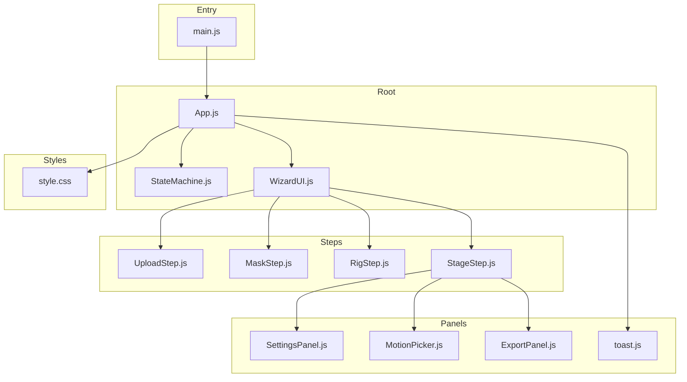
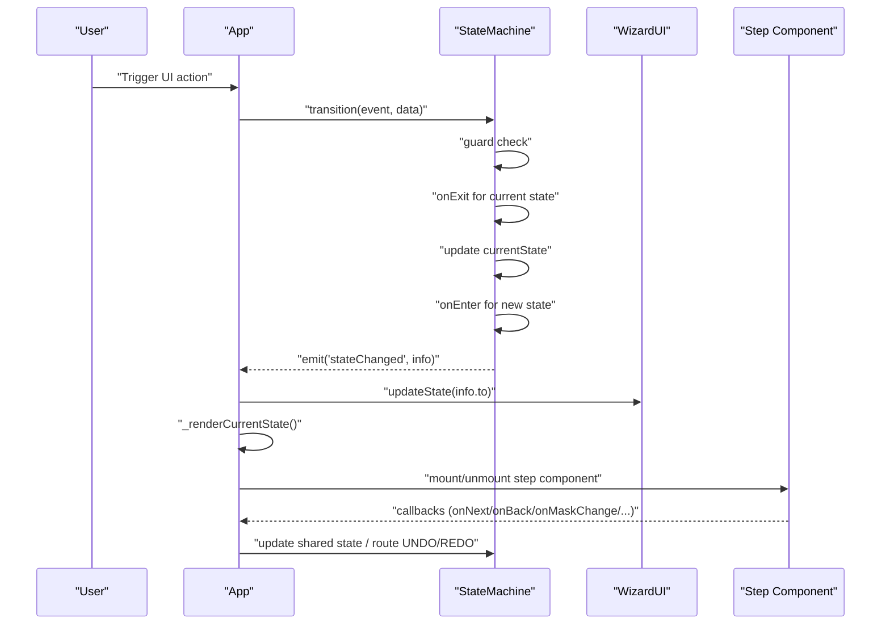
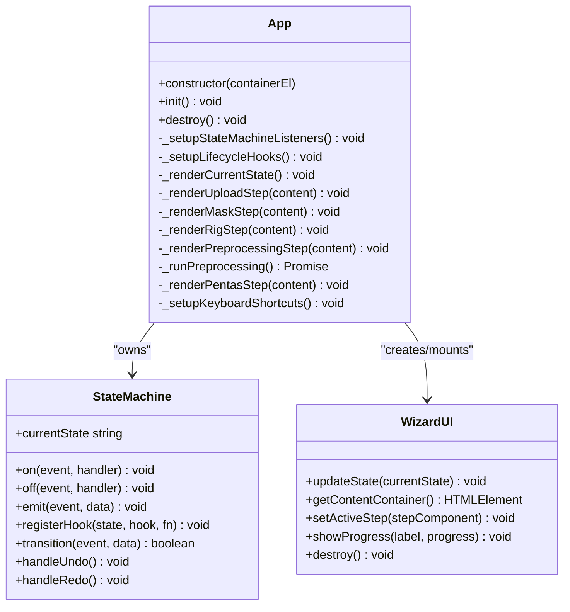
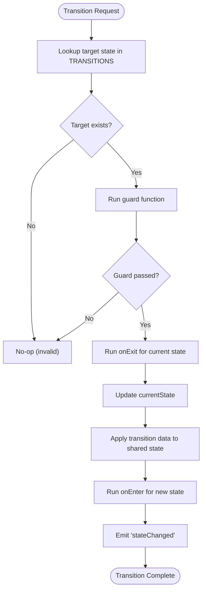
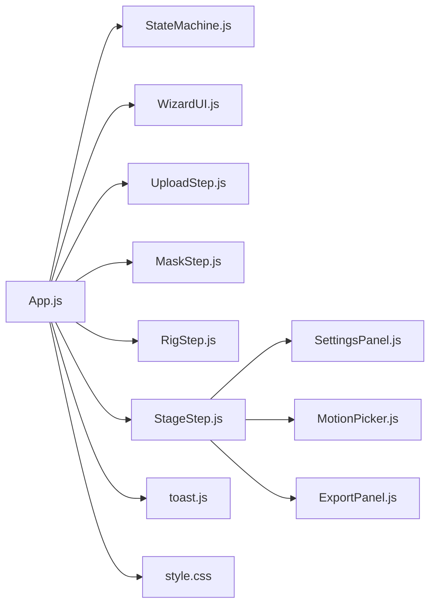

# Component Architecture

<cite>
**Referenced Files in This Document**
- [App.js](file://src/App.js)
- [main.js](file://src/main.js)
- [StateMachine.js](file://src/state/StateMachine.js)
- [WizardUI.js](file://src/ui/WizardUI.js)
- [UploadStep.js](file://src/ui/UploadStep.js)
- [MaskStep.js](file://src/ui/MaskStep.js)
- [RigStep.js](file://src/ui/RigStep.js)
- [StageStep.js](file://src/ui/StageStep.js)
- [SettingsPanel.js](file://src/ui/SettingsPanel.js)
- [MotionPicker.js](file://src/ui/MotionPicker.js)
- [ExportPanel.js](file://src/ui/ExportPanel.js)
- [toast.js](file://src/ui/toast.js)
- [style.css](file://src/style.css)
- [module_design.md](file://architecture/module_design.md)
- [dataflow.md](file://architecture/dataflow.md)
- [statemachine.md](file://architecture/statemachine.md)
- [characterData.js](file://src/types/characterData.js)
</cite>

## Table of Contents
1. [Introduction](#introduction)
2. [Project Structure](#project-structure)
3. [Core Components](#core-components)
4. [Architecture Overview](#architecture-overview)
5. [Detailed Component Analysis](#detailed-component-analysis)
6. [Dependency Analysis](#dependency-analysis)
7. [Performance Considerations](#performance-considerations)
8. [Troubleshooting Guide](#troubleshooting-guide)
9. [Conclusion](#conclusion)
10. [Appendices](#appendices)

## Introduction
This document explains PaperAlive’s component architecture with a focus on how the App, StateMachine, and UI components collaborate. It covers the event-driven design, observer-style event emitters, data flow across states, lifecycle management, styling and responsiveness, separation of concerns, extensibility, performance strategies, and testing approaches. The goal is to help developers understand the component hierarchy, parent-child relationships, and communication patterns so they can extend or debug the system effectively.

## Project Structure
PaperAlive organizes code by domain and responsibility:
- Entry point mounts the App into the DOM
- App owns the StateMachine and orchestrates UI steps
- WizardUI manages the step container and indicator
- Step components encapsulate UI logic and user interactions
- Rendering and simulation subsystems are integrated in the Stage step
- Styles are centralized in a single stylesheet with responsive breakpoints

**Diagram sources**
- [main.js:12-16](file://src/main.js#L12-L16)
- [App.js:35-90](file://src/App.js#L35-L90)
- [WizardUI.js:21-42](file://src/ui/WizardUI.js#L21-L42)
- [UploadStep.js:20-39](file://src/ui/UploadStep.js#L20-L39)
- [MaskStep.js:15-63](file://src/ui/MaskStep.js#L15-L63)
- [RigStep.js:15-61](file://src/ui/RigStep.js#L15-L61)
- [StageStep.js:31-83](file://src/ui/StageStep.js#L31-L83)
- [SettingsPanel.js:13-26](file://src/ui/SettingsPanel.js#L13-L26)
- [MotionPicker.js:20-38](file://src/ui/MotionPicker.js#L20-L38)
- [ExportPanel.js:13-41](file://src/ui/ExportPanel.js#L13-L41)
- [toast.js:39-47](file://src/ui/toast.js#L39-L47)
- [style.css:1-682](file://src/style.css#L1-L682)

**Section sources**
- [main.js:12-16](file://src/main.js#L12-L16)
- [App.js:35-90](file://src/App.js#L35-L90)
- [WizardUI.js:21-42](file://src/ui/WizardUI.js#L21-L42)
- [style.css:1-682](file://src/style.css#L1-L682)

## Core Components
- App: Root component and StateMachine owner. Initializes DOM, wires UI, listens to state changes, and coordinates lifecycle hooks and cleanup.
- StateMachine: Centralized state manager with transitions, guards, event emitter, and undo/redo routing.
- WizardUI: Container that renders the current step and updates the step indicator.
- Step components: Encapsulate UI and interactions for Upload, Mask, Rig, and Stage.
- Panels: SettingsPanel, MotionPicker, ExportPanel, and toast notifications.

Communication patterns:
- App listens to StateMachine events and updates WizardUI and step rendering.
- Steps communicate upward via callbacks to App, which triggers StateMachine transitions.
- SettingsPanel and ExportPanel are mounted conditionally in Stage and destroyed on state exits.

**Section sources**
- [App.js:35-505](file://src/App.js#L35-L505)
- [StateMachine.js:137-477](file://src/state/StateMachine.js#L137-L477)
- [WizardUI.js:21-185](file://src/ui/WizardUI.js#L21-L185)
- [SettingsPanel.js:13-215](file://src/ui/SettingsPanel.js#L13-L215)
- [ExportPanel.js:13-163](file://src/ui/ExportPanel.js#L13-L163)
- [MotionPicker.js:20-107](file://src/ui/MotionPicker.js#L20-L107)

## Architecture Overview
PaperAlive follows a wizard-driven, event-driven architecture:
- App initializes the root container and creates WizardUI.
- StateMachine defines states and transitions; App subscribes to stateChanged events.
- WizardUI mounts the appropriate step component based on current state.
- Steps expose callbacks for navigation and data changes; App updates StateMachine accordingly.
- StageStep integrates rendering and motion systems; SettingsPanel and ExportPanel are attached conditionally.

**Diagram sources**
- [App.js:95-205](file://src/App.js#L95-L205)
- [StateMachine.js:289-355](file://src/state/StateMachine.js#L289-L355)
- [WizardUI.js:94-141](file://src/ui/WizardUI.js#L94-L141)

**Section sources**
- [App.js:95-205](file://src/App.js#L95-L205)
- [StateMachine.js:289-355](file://src/state/StateMachine.js#L289-L355)
- [WizardUI.js:94-141](file://src/ui/WizardUI.js#L94-L141)

## Detailed Component Analysis

### App Component
Responsibilities:
- Owns StateMachine and orchestrates UI wiring
- Listens to stateChanged and routes UNDO/REDO to active step histories
- Manages lifecycle hooks per state (onEnter/onExit)
- Renders current step and mounts optional panels (Settings, Save/Load)
- Sets up global keyboard shortcuts and cleanup

Key behaviors:
- Event listeners: stateChanged, maskChanged, jointsChanged
- Lifecycle hooks: UPLOAD.onEnter resets shared state; MASK/RIG onExit cleanup; PREPROCESSING onEnter runs preprocessing; PENTAS onEnter stores renderer references
- Rendering: switches step components based on AppState; clears Settings/Save panels outside PENTAS
- Keyboard shortcuts: Ctrl+Z/Ctrl+Shift+Z/Ctrl+Y, Space, 1–6 keys, R, Escape

**Diagram sources**
- [App.js:35-505](file://src/App.js#L35-L505)
- [StateMachine.js:137-477](file://src/state/StateMachine.js#L137-L477)
- [WizardUI.js:21-185](file://src/ui/WizardUI.js#L21-L185)

**Section sources**
- [App.js:35-505](file://src/App.js#L35-L505)
- [StateMachine.js:137-477](file://src/state/StateMachine.js#L137-L477)
- [WizardUI.js:21-185](file://src/ui/WizardUI.js#L21-L185)

### StateMachine Component
Responsibilities:
- Defines AppState and AppEvent constants
- Maintains transition table and guard functions
- Emits events and routes UNDO/REDO to active step histories
- Stores shared state across steps and exposes lifecycle hooks

Highlights:
- Transition logic: lookup target state, run guard, run onExit/onEnter, emit stateChanged
- Undo/Redo: routes to MaskHistory or JointHistory depending on current state
- Shared state: loadedImage, alphaMask, jointPositions, characterData, renderer references, activeClip

**Diagram sources**
- [StateMachine.js:289-355](file://src/state/StateMachine.js#L289-L355)
- [statemachine.md:277-329](file://architecture/statemachine.md#L277-L329)

**Section sources**
- [StateMachine.js:289-355](file://src/state/StateMachine.js#L289-L355)
- [statemachine.md:277-329](file://architecture/statemachine.md#L277-L329)

### WizardUI Component
Responsibilities:
- Renders the step indicator and content area
- Updates active step and mounts/unmounts step components
- Displays progress during preprocessing

Behavior:
- Step indicator reflects current state and highlights completed/completed steps
- getContentContainer returns the content area for step mounting
- setActiveStep destroys previous step and sets the new one
- showProgress updates a progress bar during preprocessing

**Section sources**
- [WizardUI.js:21-185](file://src/ui/WizardUI.js#L21-L185)

### UploadStep Component
Responsibilities:
- Handles drag-and-drop, file selection, clipboard paste
- Validates file size/type and loads images
- Provides “Load from Storage” button when a saved character exists

Callbacks:
- onImageLoaded: passes loaded image to App to trigger state transition
- onLoadCharacter: loads saved character and transitions to PENTAS

Cleanup:
- Removes paste event listener and DOM nodes on destroy

**Section sources**
- [UploadStep.js:20-171](file://src/ui/UploadStep.js#L20-L171)

### MaskStep Component
Responsibilities:
- Threshold adjustment, brush editing, undo/redo
- Mask preview overlay with brush cursor
- Navigation to next step

Key interactions:
- Threshold slider updates BinaryMask and reinitializes MaskBrush
- Pointer events draw strokes; on pointerup, snapshot pushed to MaskHistory
- Undo/Redo buttons update mask and brush; keyboard shortcuts supported
- Callbacks: onMaskChange, onHistoryInit, onBack, onNext

**Section sources**
- [MaskStep.js:15-409](file://src/ui/MaskStep.js#L15-L409)

### RigStep Component
Responsibilities:
- Character type selector (humanoid/freeform)
- Joint estimation and drag editing
- Undo/redo for joint placement
- Navigation to bring-to-life

Key interactions:
- Character type switch re-estimates joints and resets history
- RigEditor renders skeleton and handles joint drags
- Undo/Redo updates joint positions and enables/disables “Bring to Life!” button
- Callbacks: onJointsChange, onHistoryInit, onBack, onBringToLife

**Section sources**
- [RigStep.js:15-358](file://src/ui/RigStep.js#L15-L358)

### StageStep Component
Responsibilities:
- WebGL rendering with NPRRenderer and MeshPuppet
- Motion playback via MotionResolver and ARAPSolver
- IK drag interaction
- Export panel integration

Runtime loop:
- requestAnimationFrame drives updateFrame, which resolves motion, steps ARAP solver, and draws frames
- ExportPanel captures frames via gl.readPixels when recording
- MotionPicker selects clips and toggles play/stop

**Section sources**
- [StageStep.js:31-428](file://src/ui/StageStep.js#L31-L428)

### SettingsPanel Component
Responsibilities:
- Overlay panel with sliders and color pickers for NPR rendering parameters
- Reset to defaults and live updates to renderer settings

**Section sources**
- [SettingsPanel.js:13-215](file://src/ui/SettingsPanel.js#L13-L215)

### MotionPicker and ExportPanel Components
- MotionPicker: dropdown + play/stop buttons for motion clips
- ExportPanel: record/stop buttons, recording overlay with timer, codec detection

**Section sources**
- [MotionPicker.js:20-107](file://src/ui/MotionPicker.js#L20-L107)
- [ExportPanel.js:13-163](file://src/ui/ExportPanel.js#L13-L163)

### toast Notification System
- Global toast container at bottom-right
- Supports multiple types with auto-dismiss and LIFO eviction
- Accessibility attributes for screen readers

**Section sources**
- [toast.js:39-98](file://src/ui/toast.js#L39-L98)

## Dependency Analysis
Component relationships and data flow:
- App depends on StateMachine, WizardUI, and step components
- Steps depend on shared state and emit callbacks to App
- StageStep depends on rendering and motion systems; integrates SettingsPanel and ExportPanel
- Style.css provides global styles and responsive media queries

**Diagram sources**
- [App.js:11-22](file://src/App.js#L11-L22)
- [StageStep.js:8-16](file://src/ui/StageStep.js#L8-L16)
- [style.css:1-682](file://src/style.css#L1-L682)

**Section sources**
- [App.js:11-22](file://src/App.js#L11-L22)
- [StageStep.js:8-16](file://src/ui/StageStep.js#L8-L16)
- [style.css:1-682](file://src/style.css#L1-L682)

## Performance Considerations
- Zero-allocation render loop: avoid allocations in requestAnimationFrame and related functions (constraint documented in module design)
- Worker-safe preprocessing: preprocessing runs in a Web Worker; data transferred efficiently (transferable TypedArrays)
- Efficient image handling: ImageLoader resizes and decodes via createImageBitmap and OffscreenCanvas
- Progressive UI: Wizard shows progress during preprocessing; avoids blocking interactions
- Memory-conscious histories: MaskHistory and JointHistory maintain bounded snapshots

[No sources needed since this section provides general guidance]

## Troubleshooting Guide
Common issues and remedies:
- Undo/Redo not working: ensure current state supports undo/redo and that history instances are initialized in onEnter hooks
- Mask or joints not updating: verify callbacks fire and StateMachine.shared state is updated
- WebGL init failures: check renderer initialization and toast messages; ensure context restoration handlers
- Export errors: confirm codec detection and browser support; use ExportPanel error messaging

**Section sources**
- [StateMachine.js:389-445](file://src/state/StateMachine.js#L389-L445)
- [StageStep.js:154-207](file://src/ui/StageStep.js#L154-L207)
- [ExportPanel.js:140-142](file://src/ui/ExportPanel.js#L140-L142)

## Conclusion
PaperAlive’s component architecture centers on a clear separation of concerns: App orchestrates, StateMachine governs state transitions and shared data, and modular UI components encapsulate step-specific logic. The event-driven design, observer-style event emitters, and lifecycle hooks enable robust data flow and lifecycle management. The styling system and responsive design ensure consistent UX across devices. Performance constraints and worker-based preprocessing keep the UI smooth and the runtime efficient.

[No sources needed since this section summarizes without analyzing specific files]

## Appendices

### Component Lifecycle and Initialization Sequences
- App.init: creates root container, header, WizardUI, keyboard shortcuts, and renders initial state
- StateMachine.onEnter hooks: reset shared state in UPLOAD; initialize histories in MASK/RIG; run preprocessing in PREPROCESSING; initialize renderer and systems in PENTAS
- Step mounting: WizardUI mounts the active step; Settings/Save panels mounted in PENTAS; destroyed on exit

**Section sources**
- [App.js:67-90](file://src/App.js#L67-L90)
- [App.js:114-160](file://src/App.js#L114-L160)
- [WizardUI.js:135-141](file://src/ui/WizardUI.js#L135-L141)

### Data Flow Across States
- Upload: image loaded → state transition to MASK
- Mask: proceed to Rig → state transition to RIG
- Rig: bring to life → state transition to PREPROCESSING
- Preprocessing: worker completes → state transition to PENTAS
- Pentas: edit back → state transition to MASK; export video → state transition to EXPORTING

**Section sources**
- [statemachine.md:14-59](file://architecture/statemachine.md#L14-L59)
- [dataflow.md:19-112](file://architecture/dataflow.md#L19-L112)

### Styling Architecture and Responsive Design
- CSS-in-JS: Not used; styles are centralized in a single stylesheet
- Responsive breakpoints: mobile, tablet, desktop with tailored layouts
- Accessibility: ARIA roles and labels on interactive elements

**Section sources**
- [style.css:1-682](file://src/style.css#L1-L682)

### Extensibility Patterns
- New steps: extend WizardUI content area and add state transitions/guards
- New events: add AppEvent constants and update transition table and guards
- Rendering parameters: add new settings in SettingsPanel and propagate to renderer
- Undo/redo: add history instances in onEnter hooks and route UNDO/REDO in StateMachine

**Section sources**
- [statemachine.md:240-370](file://architecture/statemachine.md#L240-L370)
- [SettingsPanel.js:59-126](file://src/ui/SettingsPanel.js#L59-L126)

### Testing Approaches
- Unit tests: component constructors and methods tested independently
- Integration tests: simulate user interactions and verify state transitions and UI updates
- Worker tests: isolate preprocessing pipeline in worker context
- Accessibility tests: verify ARIA attributes and keyboard navigation

**Section sources**
- [module_design.md:154-181](file://architecture/module_design.md#L154-L181)