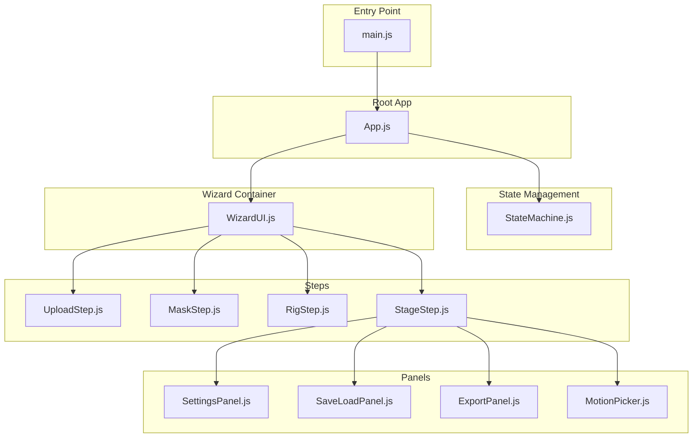
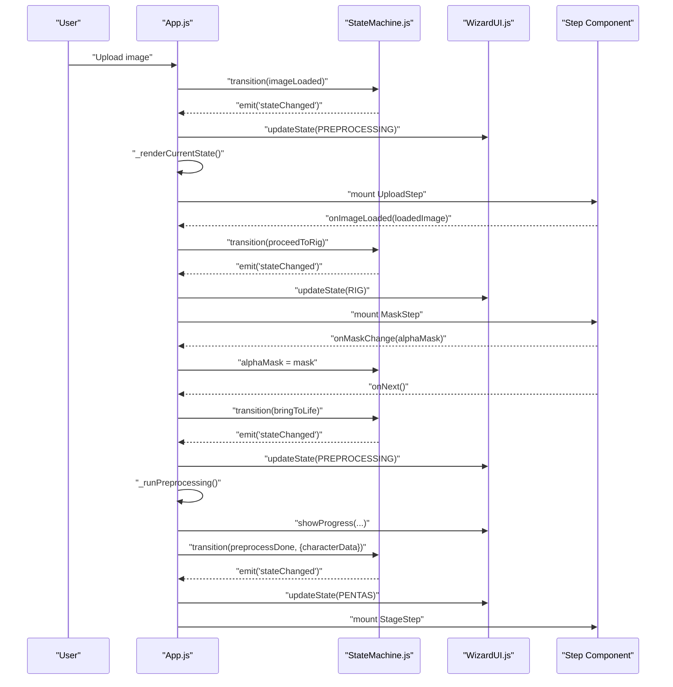
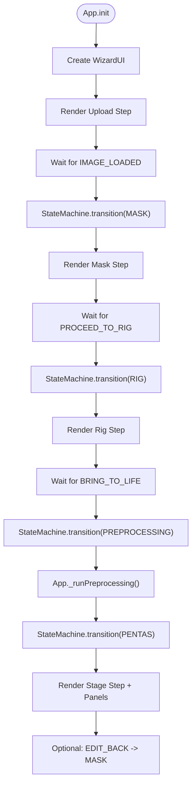

# Core Application Components

<cite>
**Referenced Files in This Document**
- [App.js](file://src/App.js)
- [main.js](file://src/main.js)
- [StateMachine.js](file://src/state/StateMachine.js)
- [WizardUI.js](file://src/ui/WizardUI.js)
- [UploadStep.js](file://src/ui/UploadStep.js)
- [MaskStep.js](file://src/ui/MaskStep.js)
- [RigStep.js](file://src/ui/RigStep.js)
- [StageStep.js](file://src/ui/StageStep.js)
- [SettingsPanel.js](file://src/ui/SettingsPanel.js)
- [SaveLoadPanel.js](file://src/ui/SaveLoadPanel.js)
- [ExportPanel.js](file://src/ui/ExportPanel.js)
- [MotionPicker.js](file://src/ui/MotionPicker.js)
- [style.css](file://src/style.css)
- [module_design.md](file://architecture/module_design.md)
- [statemachine.md](file://architecture/statemachine.md)
</cite>

## Table of Contents
1. [Introduction](#introduction)
2. [Project Structure](#project-structure)
3. [Core Components](#core-components)
4. [Architecture Overview](#architecture-overview)
5. [Detailed Component Analysis](#detailed-component-analysis)
6. [Dependency Analysis](#dependency-analysis)
7. [Performance Considerations](#performance-considerations)
8. [Troubleshooting Guide](#troubleshooting-guide)
9. [Conclusion](#conclusion)
10. [Appendices](#appendices)

## Introduction
This document focuses on the Core Application Components of PaperAlive, centered around the root application module, the state machine orchestrating the wizard workflow, and the WizardUI system that renders step-by-step user interfaces. It explains component lifecycle management, event-driven communication, shared state management, keyboard shortcuts, accessibility features, responsive design, and integration patterns across UI layers.

## Project Structure
PaperAlive’s front-end is organized around a small set of cohesive modules:
- Entry point mounts the root application component.
- App.js coordinates the state machine, wizard UI, and step components.
- StateMachine.js defines the application workflow, guards, and shared state.
- WizardUI.js manages the 4-step wizard container and step indicators.
- Individual step components encapsulate UI logic and integrate with shared state.
- Panels (Settings, Save/Load, Export) are mounted conditionally during the stage step.

**Diagram sources**
- [main.js:12-16](file://src/main.js#L12-L16)
- [App.js:35-62](file://src/App.js#L35-L62)
- [StateMachine.js:137-206](file://src/state/StateMachine.js#L137-L206)
- [WizardUI.js:21-42](file://src/ui/WizardUI.js#L21-L42)
- [UploadStep.js:20-39](file://src/ui/UploadStep.js#L20-L39)
- [MaskStep.js:15-63](file://src/ui/MaskStep.js#L15-L63)
- [RigStep.js:15-61](file://src/ui/RigStep.js#L15-L61)
- [StageStep.js:31-83](file://src/ui/StageStep.js#L31-L83)
- [SettingsPanel.js:13-26](file://src/ui/SettingsPanel.js#L13-L26)
- [SaveLoadPanel.js:14-28](file://src/ui/SaveLoadPanel.js#L14-L28)
- [ExportPanel.js:13-41](file://src/ui/ExportPanel.js#L13-L41)
- [MotionPicker.js:20-38](file://src/ui/MotionPicker.js#L20-L38)

**Section sources**
- [main.js:12-16](file://src/main.js#L12-L16)
- [App.js:35-62](file://src/App.js#L35-L62)
- [module_design.md:158-220](file://architecture/module_design.md#L158-L220)

## Core Components
- App.js: Root component and StateMachine owner. Initializes the wizard, wires UI steps, sets up lifecycle hooks, and manages keyboard shortcuts and global events.
- StateMachine.js: Defines states, transitions, guards, event emitters, lifecycle hooks, and undo/redo routing. Provides shared state for images, masks, skeletons, and runtime references.
- WizardUI.js: Wizard container that mounts/unmounts step components, updates step indicators, and displays progress during preprocessing.

Key responsibilities:
- App.js initializes the DOM, creates WizardUI, registers state machine listeners, and renders the current step component.
- StateMachine.js centralizes workflow orchestration and shared state, emitting events on state changes and routing undo/redo actions.
- WizardUI.js coordinates step rendering and progress UI, ensuring only one step is active at a time.

**Section sources**
- [App.js:35-62](file://src/App.js#L35-L62)
- [StateMachine.js:137-206](file://src/state/StateMachine.js#L137-L206)
- [WizardUI.js:21-42](file://src/ui/WizardUI.js#L21-L42)

## Architecture Overview
The application follows an event-driven architecture:
- App.js listens to state machine events and updates the wizard and step components accordingly.
- Each step component receives callbacks to trigger state transitions and to update shared state.
- During preprocessing, App.js runs a background pipeline and updates the wizard progress UI.
- On Pentas, App.js stores renderer and solver references and mounts Settings and Save/Load panels.

**Diagram sources**
- [App.js:95-109](file://src/App.js#L95-L109)
- [App.js:165-205](file://src/App.js#L165-L205)
- [App.js:308-328](file://src/App.js#L308-L328)
- [StateMachine.js:289-355](file://src/state/StateMachine.js#L289-L355)
- [WizardUI.js:94-121](file://src/ui/WizardUI.js#L94-L121)

## Detailed Component Analysis

### App.js — Root Component and Coordinator
Responsibilities:
- Creates and owns the StateMachine and WizardUI.
- Registers state machine listeners and lifecycle hooks.
- Renders the current step based on the active state.
- Runs the preprocessing pipeline and updates progress.
- Mounts Settings and Save/Load panels during Pentas.
- Sets up global keyboard shortcuts and cleans up on destroy.

Key patterns:
- Event-driven coordination: Listens to stateChanged and updates the wizard and step rendering.
- Lifecycle hooks: Uses registerHook to initialize and tear down step-specific resources.
- Callback wiring: Passes callbacks to step components to trigger transitions and update shared state.
- Undo/redo: Routes UNDO/REDO to the active step’s history when applicable.

Accessibility and keyboard shortcuts:
- Skips input-focused elements to avoid interfering with form inputs.
- Supports Ctrl+Z (undo), Ctrl+Shift+Z / Ctrl+Y (redo).
- Pentas-only shortcuts: Space toggles play/pause, 1–6 selects motion clips, R toggles recording, Escape cancels drag/export.

Responsive design and styles:
- Uses CSS variables and flexbox for layout.
- Buttons, sliders, and overlays adapt to viewport.

**Section sources**
- [App.js:35-62](file://src/App.js#L35-L62)
- [App.js:95-109](file://src/App.js#L95-L109)
- [App.js:114-160](file://src/App.js#L114-L160)
- [App.js:165-205](file://src/App.js#L165-L205)
- [App.js:308-328](file://src/App.js#L308-L328)
- [App.js:415-478](file://src/App.js#L415-L478)
- [style.css:40-120](file://src/style.css#L40-L120)

### StateMachine.js — Workflow Orchestration and Shared State
Responsibilities:
- Defines AppState and AppEvent constants.
- Maintains a transition table and guard functions.
- Emits events on state changes and applies transition data to shared state.
- Routes UNDO/REDO to active step histories and exposes canUndo/canRedo.
- Stores shared state: loadedImage, alphaMask, jointPositions, characterData, renderer/solver references, and activeClip.

Processing logic:
- transition(event, data): Validates event against transition table, runs guard, executes onExit/onEnter hooks, updates shared state, and emits stateChanged.
- handleUndo/handleRedo: Dispatches undo/redo to appropriate histories and emits maskChanged/jointsChanged.

Guard functions:
- IMAGE_LOADED: Requires a valid loaded image.
- PROCEED_TO_RIG: Requires a non-empty alpha mask.
- BRING_TO_LIFE: Requires sufficient joints and all joints within mask bounding box.
- PREPROCESS_DONE: Requires characterData.

**Section sources**
- [StateMachine.js:137-206](file://src/state/StateMachine.js#L137-L206)
- [StateMachine.js:289-355](file://src/state/StateMachine.js#L289-L355)
- [StateMachine.js:389-445](file://src/state/StateMachine.js#L389-L445)
- [statemachine.md:240-329](file://architecture/statemachine.md#L240-L329)

### WizardUI.js — Step Container and Indicator
Responsibilities:
- Mounts the wizard container with a step indicator and content area.
- Updates the active step indicator based on current state.
- Mounts/unmounts step components and shows progress during preprocessing.
- Provides getContentContainer for step mounting.

Rendering flow:
- updateState(currentState): Recalculates active/completed steps.
- setActiveStep(stepComponent): Destroys previous step and mounts the new one.
- showProgress(label, progress): Updates a progress bar during preprocessing.

**Section sources**
- [WizardUI.js:21-42](file://src/ui/WizardUI.js#L21-L42)
- [WizardUI.js:94-121](file://src/ui/WizardUI.js#L94-L121)
- [WizardUI.js:135-141](file://src/ui/WizardUI.js#L135-L141)
- [WizardUI.js:148-169](file://src/ui/WizardUI.js#L148-L169)

### Step Components — Lifecycle, Events, and Data Flow

#### UploadStep.js
- Renders a drag-drop zone, file picker, and clipboard paste support.
- Validates file size/type and loads image via ImageLoader.
- Triggers IMAGE_LOADED transition with loaded image data.

Accessibility:
- Drop zone is focusable and supports Enter/Space activation.
- Proper aria-labels for screen readers.

**Section sources**
- [UploadStep.js:20-39](file://src/ui/UploadStep.js#L20-L39)
- [UploadStep.js:133-155](file://src/ui/UploadStep.js#L133-L155)

#### MaskStep.js
- Initializes mask from thresholding and pushes snapshot to MaskHistory.
- Provides brush tools (add/erase), threshold slider, and undo/redo.
- Emits mask changes and triggers PROCEED_TO_RIG when ready.

Keyboard shortcuts:
- Ctrl+Z (undo), Ctrl+Shift+Z / Ctrl+Y (redo) while editing mask.

**Section sources**
- [MaskStep.js:15-63](file://src/ui/MaskStep.js#L15-L63)
- [MaskStep.js:68-78](file://src/ui/MaskStep.js#L68-L78)
- [MaskStep.js:114-125](file://src/ui/MaskStep.js#L114-L125)
- [MaskStep.js:338-361](file://src/ui/MaskStep.js#L338-L361)
- [MaskStep.js:374-387](file://src/ui/MaskStep.js#L374-L387)

#### RigStep.js
- Estimates joints based on character type (humanoid vs freeform).
- Initializes RigEditor and JointHistory.
- Allows switching character type and re-estimating joints.
- Emits joint changes and triggers BRING_TO_LIFE when ready.

Keyboard shortcuts:
- Ctrl+Z (undo), Ctrl+Shift+Z / Ctrl+Y (redo) while editing joints.

**Section sources**
- [RigStep.js:15-61](file://src/ui/RigStep.js#L15-L61)
- [RigStep.js:67-84](file://src/ui/RigStep.js#L67-L84)
- [RigStep.js:248-260](file://src/ui/RigStep.js#L248-L260)
- [RigStep.js:284-307](file://src/ui/RigStep.js#L284-L307)
- [RigStep.js:329-341](file://src/ui/RigStep.js#L329-L341)

#### StageStep.js — Pentas (Stage)
- Initializes NPRRenderer, MeshPuppet, ARAPSolver, and MotionResolver.
- Handles pointer-based IK dragging and motion playback.
- Integrates MotionPicker and ExportPanel.
- Exposes togglePlay and cancelDrag for keyboard shortcuts.

Panels:
- SettingsPanel: Adjusts rendering parameters and resets to defaults.
- SaveLoadPanel: Saves/loading character data with name metadata.

**Section sources**
- [StageStep.js:31-83](file://src/ui/StageStep.js#L31-L83)
- [StageStep.js:154-207](file://src/ui/StageStep.js#L154-L207)
- [StageStep.js:290-333](file://src/ui/StageStep.js#L290-L333)
- [StageStep.js:372-389](file://src/ui/StageStep.js#L372-L389)
- [SettingsPanel.js:13-26](file://src/ui/SettingsPanel.js#L13-L26)
- [SaveLoadPanel.js:14-28](file://src/ui/SaveLoadPanel.js#L14-L28)

### Panels — Composition and Integration
- SettingsPanel: Overlay dialog with sliders and color pickers; emits onSettingChange and supports reset to defaults.
- SaveLoadPanel: Save/load UI with character name input; integrates with CharacterStorage.
- ExportPanel: Records WebGL frames to video with codec detection and timer overlay.
- MotionPicker: Dropdown + play/stop controls for motion clips.

Integration with App.js:
- App.js mounts Settings and SaveLoad panels during Pentas and wires renderer updates and reset logic.

**Section sources**
- [SettingsPanel.js:59-126](file://src/ui/SettingsPanel.js#L59-L126)
- [SaveLoadPanel.js:33-108](file://src/ui/SaveLoadPanel.js#L33-L108)
- [ExportPanel.js:46-106](file://src/ui/ExportPanel.js#L46-L106)
- [MotionPicker.js:43-83](file://src/ui/MotionPicker.js#L43-L83)
- [App.js:360-400](file://src/App.js#L360-L400)

## Dependency Analysis
Component coupling and cohesion:
- App.js depends on StateMachine and WizardUI, and composes step components.
- StateMachine owns shared state and emits events consumed by App.js.
- Step components depend on shared state and emit callbacks to App.js.
- Panels depend on renderer references and shared state during Pentas.

External dependencies and integration points:
- Web Worker for preprocessing (invoked by App.js).
- WebGL renderer and motion resolver for Pentas.
- IndexedDB-backed image storage for textures.

```mermaid
graph LR
APP["App.js"] --> SM["StateMachine.js"]
APP --> WUI["WizardUI.js"]
APP --> U["UploadStep.js"]
APP --> M["MaskStep.js"]
APP --> R["RigStep.js"]
APP --> S["StageStep.js"]
S --> SET["SettingsPanel.js"]
S --> SL["SaveLoadPanel.js"]
S --> EXP["ExportPanel.js"]
S --> MP["MotionPicker.js"]
SM --> |"emits"| APP
U --> |"calls"| APP
M --> |"calls"| APP
R --> |"calls"| APP
S --> |"calls"| APP
```

**Diagram sources**
- [App.js:114-160](file://src/App.js#L114-L160)
- [StateMachine.js:249-255](file://src/state/StateMachine.js#L249-L255)

**Section sources**
- [App.js:114-160](file://src/App.js#L114-L160)
- [StateMachine.js:249-255](file://src/state/StateMachine.js#L249-L255)

## Performance Considerations
- Zero-allocation render loop constraints apply to worker-safe modules; ensure no allocations occur inside requestAnimationFrame callbacks.
- Preprocessing runs in a Web Worker to keep the UI responsive; progress events are forwarded to the main thread.
- Efficient image handling via createImageBitmap and canvas resizing to limit memory footprint.
- WebGL context loss handling and auto-save intervals are managed during Pentas.

[No sources needed since this section provides general guidance]

## Troubleshooting Guide
Common issues and resolutions:
- WebGL initialization failure: App.js catches errors and displays a toast; verify browser support for WebGL 2.0.
- Undo/redo not working: Ensure the active state supports undo/redo (MASK and RIG). Verify history references are initialized.
- Export recording fails: Check codec support via getSupportedMimeType; unsupported browsers will show a toast with guidance.
- Keyboard shortcuts interfere with inputs: App.js checks active element tags and ignores shortcuts when focused on inputs.

**Section sources**
- [App.js:160-164](file://src/App.js#L160-L164)
- [App.js:415-478](file://src/App.js#L415-L478)
- [StageStep.js:340-349](file://src/ui/StageStep.js#L340-L349)
- [ExportPanel.js:140-142](file://src/ui/ExportPanel.js#L140-L142)

## Conclusion
PaperAlive’s core architecture centers on a clear separation of concerns: App.js coordinates the wizard and step components, StateMachine enforces workflow correctness and shared state, and WizardUI manages step rendering and progress. Event-driven communication, lifecycle hooks, and undo/redo routing ensure robust, maintainable UI interactions. Accessibility and responsive design are integrated through semantic markup and CSS, while keyboard shortcuts and panels enhance usability across all stages.

[No sources needed since this section summarizes without analyzing specific files]

## Appendices

### Component Lifecycle Flow

**Diagram sources**
- [App.js:67-90](file://src/App.js#L67-L90)
- [App.js:185-205](file://src/App.js#L185-L205)
- [App.js:308-328](file://src/App.js#L308-L328)
- [StateMachine.js:289-355](file://src/state/StateMachine.js#L289-L355)