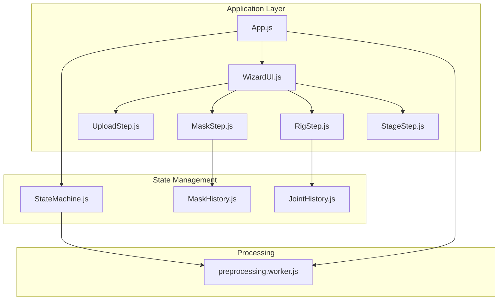
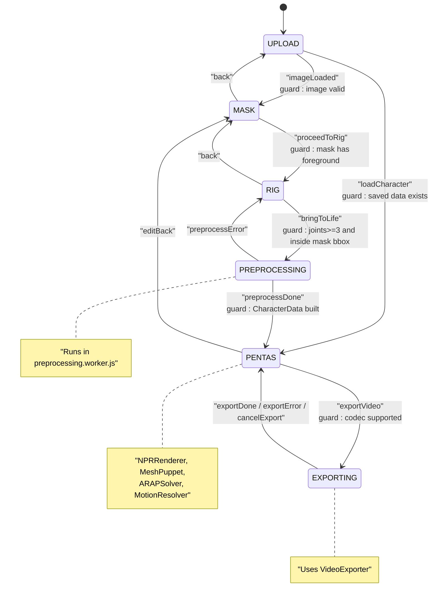
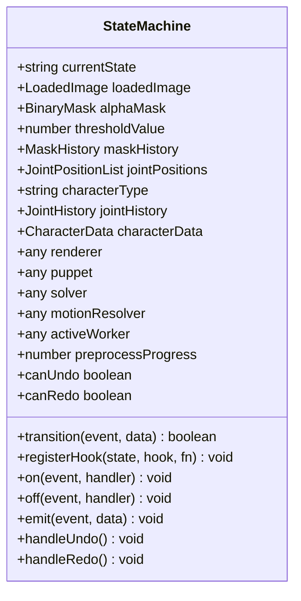
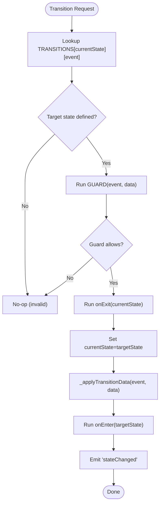
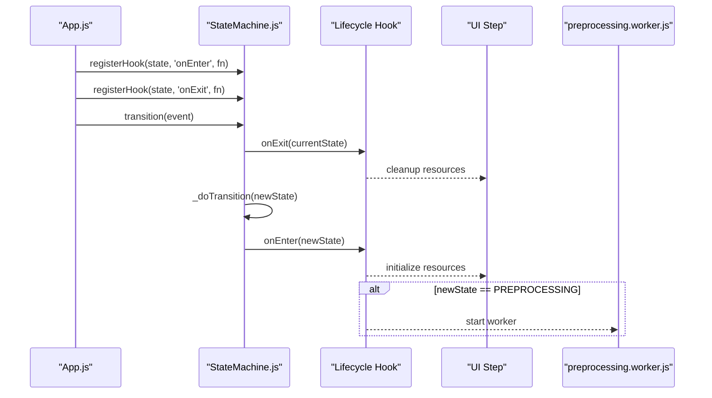
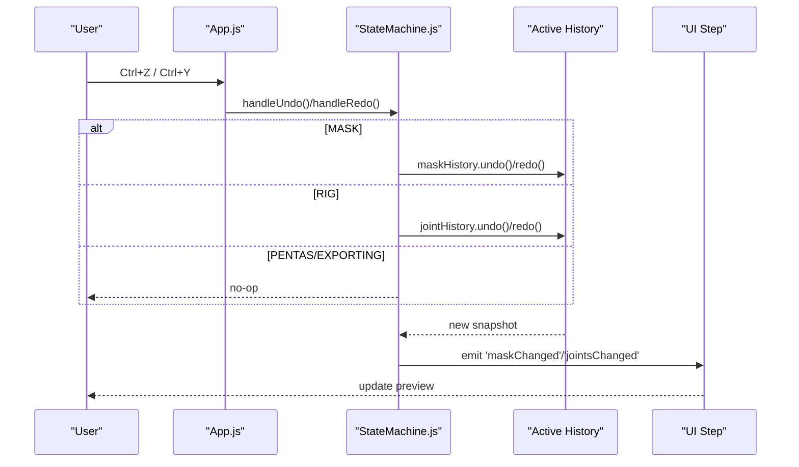
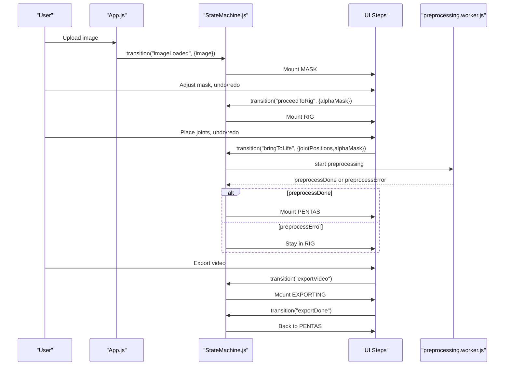
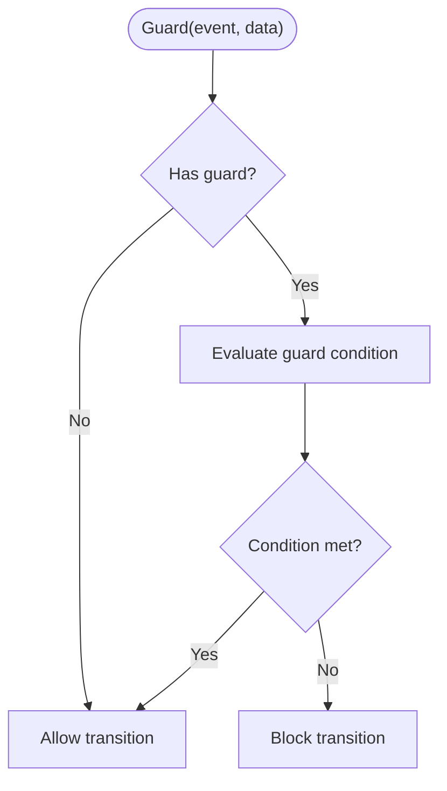
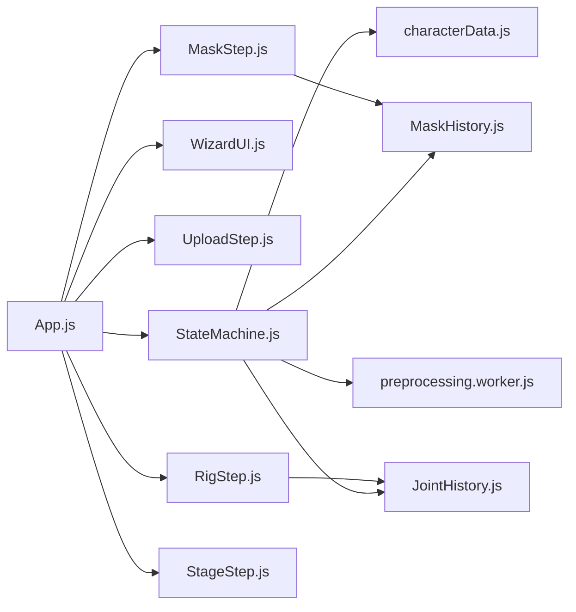

# State Management System

<cite>
**Referenced Files in This Document**
- [StateMachine.js](file://src/state/StateMachine.js)
- [StateMachine.test.js](file://src/state/StateMachine.test.js)
- [statemachine.md](file://architecture/statemachine.md)
- [EPIC-10-state-machine.md](file://implementation/epics/EPIC-10-state-machine.md)
- [TASK-116-126-epic10-state-machine.md](file://implementation/tasks/TASK-116-126-epic10-state-machine.md)
- [App.js](file://src/App.js)
- [WizardUI.js](file://src/ui/WizardUI.js)
- [UploadStep.js](file://src/ui/UploadStep.js)
- [MaskStep.js](file://src/ui/MaskStep.js)
- [RigStep.js](file://src/ui/RigStep.js)
- [StageStep.js](file://src/ui/StageStep.js)
- [preprocessing.worker.js](file://src/character/workers/preprocessing.worker.js)
- [MaskHistory.js](file://src/history/MaskHistory.js)
- [JointHistory.js](file://src/skeleton/JointHistory.js)
- [characterData.js](file://src/types/characterData.js)
</cite>

## Table of Contents
1. [Introduction](#introduction)
2. [Project Structure](#project-structure)
3. [Core Components](#core-components)
4. [Architecture Overview](#architecture-overview)
5. [Detailed Component Analysis](#detailed-component-analysis)
6. [Dependency Analysis](#dependency-analysis)
7. [Performance Considerations](#performance-considerations)
8. [Troubleshooting Guide](#troubleshooting-guide)
9. [Conclusion](#conclusion)
10. [Appendices](#appendices)

## Introduction
This document explains the State Management System centered on PaperAlive’s StateMachine.js implementation. It covers state definitions, transitions, guards, actions, lifecycle hooks, event handling, shared state management, undo/redo routing, and integration with UI components and worker processes. It also documents the four-phase character creation workflow, error handling, validation, recovery, and debugging strategies.

## Project Structure
The state machine is the central orchestrator for the wizard-driven character creation pipeline:
- App.js owns the StateMachine, renders the wizard, and wires UI steps to state transitions.
- WizardUI manages the step navigation and content area.
- UploadStep, MaskStep, RigStep, and StageStep are UI components bound to states.
- MaskHistory and JointHistory provide undo/redo capabilities for editable steps.
- preprocessing.worker.js runs the heavy preprocessing work asynchronously.

**Diagram sources**
- [App.js:35-505](file://src/App.js#L35-L505)
- [WizardUI.js:21-185](file://src/ui/WizardUI.js#L21-L185)
- [UploadStep.js:20-171](file://src/ui/UploadStep.js#L20-L171)
- [MaskStep.js:15-409](file://src/ui/MaskStep.js#L15-L409)
- [RigStep.js:15-358](file://src/ui/RigStep.js#L15-L358)
- [StageStep.js:31-428](file://src/ui/StageStep.js#L31-L428)
- [StateMachine.js:137-477](file://src/state/StateMachine.js#L137-L477)
- [MaskHistory.js:25-121](file://src/history/MaskHistory.js#L25-L121)
- [JointHistory.js:14-110](file://src/skeleton/JointHistory.js#L14-L110)
- [preprocessing.worker.js:34-374](file://src/character/workers/preprocessing.worker.js#L34-L374)

**Section sources**
- [App.js:35-205](file://src/App.js#L35-L205)
- [WizardUI.js:21-185](file://src/ui/WizardUI.js#L21-L185)
- [StateMachine.js:137-206](file://src/state/StateMachine.js#L137-L206)

## Core Components
- StateMachine: Central finite state machine with states UPLOAD, MASK, RIG, PREPROCESSING, PENTAS, EXPORTING; transition table, guard functions, lifecycle hooks, event emitter, and undo/redo routing.
- AppState and AppEvent: Frozen constants defining states and events.
- Shared state fields: loadedImage, alphaMask, thresholdValue, maskHistory, jointPositions, characterType, jointHistory, characterData, renderer, puppet, solver, motionResolver, activeWorker, preprocessProgress.
- Lifecycle hooks: onEnter/onExit per state for initialization and cleanup.
- Event emitter: on/off/emit for decoupled communication.
- Undo/Redo routing: handleUndo/handleRedo delegate to active step histories.

**Section sources**
- [StateMachine.js:20-48](file://src/state/StateMachine.js#L20-L48)
- [StateMachine.js:56-82](file://src/state/StateMachine.js#L56-L82)
- [StateMachine.js:108-127](file://src/state/StateMachine.js#L108-L127)
- [StateMachine.js:137-206](file://src/state/StateMachine.js#L137-L206)
- [StateMachine.js:216-255](file://src/state/StateMachine.js#L216-L255)
- [StateMachine.js:289-355](file://src/state/StateMachine.js#L289-L355)
- [StateMachine.js:384-477](file://src/state/StateMachine.js#L384-L477)

## Architecture Overview
The state machine enforces a strict four-phase character creation workflow:
- UPLOAD → MASK → RIG → PREPROCESSING → PENTAS → EXPORTING
- Guards validate prerequisites before transitions.
- Lifecycle hooks initialize and tear down subsystems per state.
- Undo/redo are routed to active step histories (MASK and RIG).
- Worker-based preprocessing runs in the background.

**Diagram sources**
- [statemachine.md:14-59](file://architecture/statemachine.md#L14-L59)
- [StateMachine.js:56-82](file://src/state/StateMachine.js#L56-L82)
- [StateMachine.js:108-127](file://src/state/StateMachine.js#L108-L127)
- [StateMachine.js:141-149](file://src/state/StateMachine.js#L141-L149)
- [preprocessing.worker.js:34-374](file://src/character/workers/preprocessing.worker.js#L34-L374)

## Detailed Component Analysis

### StateMachine Class
The StateMachine encapsulates:
- State constants and event constants
- Transition table mapping current state + event → target state
- Guard functions validating transition prerequisites
- Lifecycle hooks for state entry/exit
- Event emitter for observers
- Shared state fields for cross-step persistence
- Undo/redo routing to active step histories

**Diagram sources**
- [StateMachine.js:137-477](file://src/state/StateMachine.js#L137-L477)

**Section sources**
- [StateMachine.js:137-477](file://src/state/StateMachine.js#L137-L477)

### Transition Table and Guards
- TRANSITIONS defines valid transitions per state and event.
- GUARDS enforce prerequisites:
  - IMAGE_LOADED requires a valid image.
  - PROCEED_TO_RIG requires a mask with at least one foreground pixel.
  - BRING_TO_LIFE requires at least three joints and all joints within the mask bounding box.
  - PREPROCESS_DONE requires a non-null CharacterData.

**Diagram sources**
- [StateMachine.js:289-355](file://src/state/StateMachine.js#L289-L355)
- [StateMachine.js:363-382](file://src/state/StateMachine.js#L363-L382)

**Section sources**
- [StateMachine.js:56-82](file://src/state/StateMachine.js#L56-L82)
- [StateMachine.js:108-127](file://src/state/StateMachine.js#L108-L127)
- [StateMachine.js:289-355](file://src/state/StateMachine.js#L289-L355)

### Lifecycle Hooks
Lifecycle hooks are registered per state to coordinate initialization and cleanup:
- UPLOAD.onEnter: reset shared state.
- MASK.onEnter: initialize maskHistory (managed by MaskStep).
- MASK.onExit: cleanup handled by MaskStep.destroy().
- RIG.onEnter: initialize jointHistory (managed by RigStep).
- PREPROCESSING.onEnter: start preprocessing worker.
- PREPROCESSING.onExit: terminate worker.
- PENTAS.onEnter: initialize renderer, puppet, solver, motion resolver, start rAF and auto-save.
- PENTAS.onExit: stop rAF, clear auto-save, dispose renderer.
- EXPORTING.onEnter: start VideoExporter.
- EXPORTING.onExit: stop VideoExporter.

**Diagram sources**
- [StateMachine.js:198-205](file://src/state/StateMachine.js#L198-L205)
- [App.js:114-160](file://src/App.js#L114-L160)
- [preprocessing.worker.js:34-71](file://src/character/workers/preprocessing.worker.js#L34-L71)

**Section sources**
- [StateMachine.js:198-205](file://src/state/StateMachine.js#L198-L205)
- [App.js:114-160](file://src/App.js#L114-L160)

### Undo/Redo Routing
Undo/redo are routed to active step histories:
- handleUndo: in MASK, call maskHistory.undo(); in RIG, call jointHistory.undo(); otherwise no-op.
- handleRedo: mirror undo for respective histories.
- canUndo/canRedo expose history availability.
- Events maskChanged/jointsChanged propagate UI updates.

**Diagram sources**
- [StateMachine.js:389-445](file://src/state/StateMachine.js#L389-L445)
- [App.js:421-433](file://src/App.js#L421-L433)
- [MaskHistory.js:80-95](file://src/history/MaskHistory.js#L80-L95)
- [JointHistory.js:60-75](file://src/skeleton/JointHistory.js#L60-L75)

**Section sources**
- [StateMachine.js:389-445](file://src/state/StateMachine.js#L389-L445)
- [App.js:421-433](file://src/App.js#L421-L433)

### Four-Phase Character Creation Workflow
- UPLOAD: Accepts images or loads saved characters; transitions to MASK or PENTAS.
- MASK: Thresholding, brush editing, undo/redo; transitions to RIG.
- RIG: Joint estimation/placement, character type selection, undo/redo; transitions to PREPROCESSING.
- PREPROCESSING: Runs preprocessing pipeline in a worker; transitions to PENTAS on success or back to RIG on error.
- PENTAS: Interactive animation, motion playback, export; transitions to MASK or EXPORTING.
- EXPORTING: Records video; transitions back to PENTAS.

**Diagram sources**
- [StateMachine.js:56-82](file://src/state/StateMachine.js#L56-L82)
- [App.js:211-328](file://src/App.js#L211-L328)
- [preprocessing.worker.js:34-374](file://src/character/workers/preprocessing.worker.js#L34-L374)

**Section sources**
- [statemachine.md:63-237](file://architecture/statemachine.md#L63-L237)
- [StateMachine.js:56-82](file://src/state/StateMachine.js#L56-L82)
- [App.js:211-328](file://src/App.js#L211-L328)

### Guard Function Implementation and Conditional Transitions
- IMAGE_LOADED: Validates presence of image data.
- PROCEED_TO_RIG: Requires at least one foreground pixel in alphaMask.
- BRING_TO_LIFE: Requires at least three joints and all joints within the mask bounding box.
- PREPROCESS_DONE: Requires non-null characterData.

**Diagram sources**
- [StateMachine.js:309-317](file://src/state/StateMachine.js#L309-L317)
- [StateMachine.js:108-127](file://src/state/StateMachine.js#L108-L127)

**Section sources**
- [StateMachine.js:108-127](file://src/state/StateMachine.js#L108-L127)
- [StateMachine.test.js:77-167](file://src/state/StateMachine.test.js#L77-L167)

### Shared State Management and Persistence
Shared state fields persist across transitions:
- UPLOAD: null-initialized fields.
- MASK: loadedImage, alphaMask, thresholdValue, maskHistory.
- RIG: loadedImage, alphaMask, jointPositions, characterType, jointHistory.
- PREPROCESSING: all RIG fields plus preprocessProgress and activeWorker.
- PENTAS: characterData, activeClip, renderer, puppet, solver, motionResolver.
- EXPORTING: PENTAS fields plus recorder and recording duration.

Persistence is achieved by storing transition payloads into shared state via _applyTransitionData.

**Section sources**
- [StateMachine.js:147-191](file://src/state/StateMachine.js#L147-L191)
- [StateMachine.js:363-382](file://src/state/StateMachine.js#L363-L382)
- [statemachine.md:387-417](file://architecture/statemachine.md#L387-L417)

### Event Emission and Observability
- on(event, handler): Subscribe to events.
- off(event, handler): Unsubscribe.
- emit(event, data): Dispatch to all handlers.
- stateChanged: emitted after successful transitions with from/to/event/data.
- maskChanged/jointsChanged: emitted during undo/redo to refresh UI previews.

**Section sources**
- [StateMachine.js:223-255](file://src/state/StateMachine.js#L223-L255)
- [StateMachine.js:351-352](file://src/state/StateMachine.js#L351-L352)
- [App.js:95-109](file://src/App.js#L95-L109)

### Integration with UI Components and Worker Processes
- App.js mounts the appropriate step component per state and wires user actions to state transitions.
- WizardUI updates the step indicator and content area.
- MaskStep and RigStep manage brush and joint editing, history initialization, and UI controls.
- StageStep initializes rendering and motion systems in PENTAS.
- preprocessing.worker.js executes the preprocessing pipeline and posts progress/results.

**Section sources**
- [App.js:165-410](file://src/App.js#L165-L410)
- [WizardUI.js:94-185](file://src/ui/WizardUI.js#L94-L185)
- [MaskStep.js:28-409](file://src/ui/MaskStep.js#L28-L409)
- [RigStep.js:30-358](file://src/ui/RigStep.js#L30-L358)
- [StageStep.js:88-207](file://src/ui/StageStep.js#L88-L207)
- [preprocessing.worker.js:86-192](file://src/character/workers/preprocessing.worker.js#L86-L192)

## Dependency Analysis
The StateMachine depends on:
- UI components for mounting and user interaction.
- History modules for undo/redo.
- Worker for preprocessing.
- Type definitions for data contracts.

**Diagram sources**
- [StateMachine.js:13-13](file://src/state/StateMachine.js#L13-L13)
- [characterData.js:11-254](file://src/types/characterData.js#L11-L254)
- [MaskHistory.js:25-121](file://src/history/MaskHistory.js#L25-L121)
- [JointHistory.js:14-110](file://src/skeleton/JointHistory.js#L14-L110)
- [preprocessing.worker.js:18-26](file://src/character/workers/preprocessing.worker.js#L18-L26)
- [App.js:11-22](file://src/App.js#L11-L22)

**Section sources**
- [StateMachine.js:13-13](file://src/state/StateMachine.js#L13-L13)
- [characterData.js:11-254](file://src/types/characterData.js#L11-L254)

## Performance Considerations
- Worker-based preprocessing prevents UI blocking; progress updates keep users informed.
- Circular buffers for undo/redo limit memory usage.
- Minimal state copying: only necessary fields are persisted across states.
- Event emitter avoids tight coupling, reducing unnecessary re-renders.

[No sources needed since this section provides general guidance]

## Troubleshooting Guide
Common issues and strategies:
- Invalid transitions: Guards and missing transitions are no-ops; verify event and data payloads.
- Fatal errors: Any state can trigger a transition to UPLOAD via fatalError.
- Guard failures: Ensure prerequisite data is present (e.g., valid image, non-empty mask, sufficient joints).
- Undo/redo not working: Confirm active step has a history instance and canUndo/canRedo is true.
- Preprocessing stuck: Check worker messages and error codes; transition to RIG on preprocessError.
- Export failing: Verify codec support and handle exportError gracefully.

**Section sources**
- [StateMachine.js:290-293](file://src/state/StateMachine.js#L290-L293)
- [StateMachine.js:309-317](file://src/state/StateMachine.js#L309-L317)
- [StateMachine.js:325-330](file://src/state/StateMachine.js#L325-L330)
- [StateMachine.js:389-445](file://src/state/StateMachine.js#L389-L445)
- [preprocessing.worker.js:55-71](file://src/character/workers/preprocessing.worker.js#L55-L71)

## Conclusion
PaperAlive’s StateMachine.js provides a robust, test-backed state orchestration for the character creation pipeline. Its guard-based transitions, lifecycle hooks, and shared state model enable clear separation of concerns, while undo/redo and worker integration deliver a responsive user experience. The architecture supports extension and maintenance through modular components and well-defined contracts.

[No sources needed since this section summarizes without analyzing specific files]

## Appendices

### Appendix A: Task and Epic References
- Epic 10 — State Machine scope and acceptance criteria.
- TASK-116–126 — Implementation tasks covering constants, transitions, guards, lifecycle hooks, event emitter, shared state, and undo/redo routing.

**Section sources**
- [EPIC-10-state-machine.md:1-40](file://implementation/epics/EPIC-10-state-machine.md#L1-L40)
- [TASK-116-126-epic10-state-machine.md:5-239](file://implementation/tasks/TASK-116-126-epic10-state-machine.md#L5-L239)