# User Interface System

<cite>
**Referenced Files in This Document**
- [WizardUI.js](file://src/ui/WizardUI.js)
- [UploadStep.js](file://src/ui/UploadStep.js)
- [MaskStep.js](file://src/ui/MaskStep.js)
- [RigStep.js](file://src/ui/RigStep.js)
- [StageStep.js](file://src/ui/StageStep.js)
- [ExportPanel.js](file://src/ui/ExportPanel.js)
- [SaveLoadPanel.js](file://src/ui/SaveLoadPanel.js)
- [SettingsPanel.js](file://src/ui/SettingsPanel.js)
- [StateMachine.js](file://src/state/StateMachine.js)
- [App.js](file://src/App.js)
- [main.js](file://src/main.js)
- [style.css](file://src/style.css)
- [index.html](file://index.html)
- [toast.js](file://src/ui/toast.js)
- [characterData.js](file://src/types/characterData.js)
</cite>

## Table of Contents
1. [Introduction](#introduction)
2. [Project Structure](#project-structure)
3. [Core Components](#core-components)
4. [Architecture Overview](#architecture-overview)
5. [Detailed Component Analysis](#detailed-component-analysis)
6. [Dependency Analysis](#dependency-analysis)
7. [Performance Considerations](#performance-considerations)
8. [Troubleshooting Guide](#troubleshooting-guide)
9. [Conclusion](#conclusion)
10. [Appendices](#appendices)

## Introduction
This document describes the User Interface System for PaperAlive, focusing on the wizard-based workflow and component architecture. It explains the WizardUI foundation, the four-step wizard (Upload, Mask, Rig, Stage), and supporting panels (Export, Save/Load, Settings). It documents component lifecycle management, state synchronization with the StateMachine, data binding patterns, event handling, form validation, keyboard shortcuts, accessibility, responsive design, and integration with the state management system. Practical examples illustrate UI composition, validation, and export/save/load functionality.

## Project Structure
PaperAlive’s UI is organized around a root application component that owns the state machine and orchestrates step components. Styles are centralized in a single stylesheet with responsive breakpoints. The wizard container renders step indicators and hosts step components dynamically.

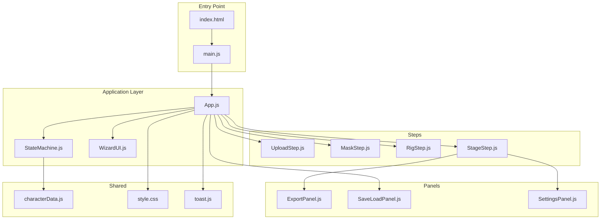

**Diagram sources**
- [index.html](file://index.html)
- [main.js](file://src/main.js)
- [App.js](file://src/App.js)
- [StateMachine.js](file://src/state/StateMachine.js)
- [WizardUI.js](file://src/ui/WizardUI.js)
- [UploadStep.js](file://src/ui/UploadStep.js)
- [MaskStep.js](file://src/ui/MaskStep.js)
- [RigStep.js](file://src/ui/RigStep.js)
- [StageStep.js](file://src/ui/StageStep.js)
- [ExportPanel.js](file://src/ui/ExportPanel.js)
- [SaveLoadPanel.js](file://src/ui/SaveLoadPanel.js)
- [SettingsPanel.js](file://src/ui/SettingsPanel.js)
- [characterData.js](file://src/types/characterData.js)
- [style.css](file://src/style.css)
- [toast.js](file://src/ui/toast.js)

**Section sources**
- [index.html](file://index.html)
- [main.js](file://src/main.js)
- [App.js](file://src/App.js)
- [style.css](file://src/style.css)

## Core Components
- WizardUI: Container for the 4-step wizard with step indicator and dynamic content area. Manages step activation, progress display, and lifecycle.
- UploadStep: Drag-and-drop, file picker, clipboard paste, and “Load from Storage” UI for image input.
- MaskStep: Threshold slider, brush tools, undo/redo, and mask preview with keyboard shortcuts.
- RigStep: Character type selector, joint estimation, joint editing with undo/redo, and “Bring to Life” action.
- StageStep: WebGL rendering, motion playback, IK dragging, export panel, and keyboard shortcuts.
- ExportPanel: Recording controls with timer overlay and codec detection.
- SaveLoadPanel: Character name input, save to browser storage, and load from storage.
- SettingsPanel: NPR rendering parameter controls with reset to defaults.
- StateMachine: Centralized state machine governing transitions, guards, shared state, and undo/redo routing.
- App: Root component wiring steps, panels, keyboard shortcuts, and lifecycle hooks.

**Section sources**
- [WizardUI.js](file://src/ui/WizardUI.js)
- [UploadStep.js](file://src/ui/UploadStep.js)
- [MaskStep.js](file://src/ui/MaskStep.js)
- [RigStep.js](file://src/ui/RigStep.js)
- [StageStep.js](file://src/ui/StageStep.js)
- [ExportPanel.js](file://src/ui/ExportPanel.js)
- [SaveLoadPanel.js](file://src/ui/SaveLoadPanel.js)
- [SettingsPanel.js](file://src/ui/SettingsPanel.js)
- [StateMachine.js](file://src/state/StateMachine.js)
- [App.js](file://src/App.js)

## Architecture Overview
The wizard-based UI follows a state-driven architecture:
- App initializes WizardUI and registers state machine listeners.
- WizardUI updates step indicators and hosts the active step component.
- Steps communicate via callbacks to update shared state in StateMachine.
- Guards validate transitions; lifecycle hooks manage initialization and cleanup.
- StageStep integrates rendering, motion, and export panels.

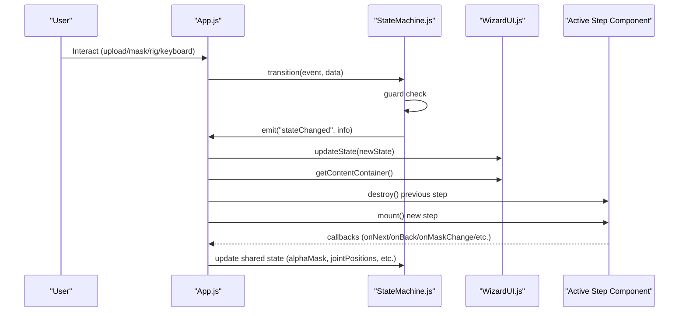

**Diagram sources**
- [App.js](file://src/App.js)
- [StateMachine.js](file://src/state/StateMachine.js)
- [WizardUI.js](file://src/ui/WizardUI.js)

## Detailed Component Analysis

### WizardUI Foundation
WizardUI creates a step indicator and a content area. It manages:
- Step indicator highlighting (active/completed).
- Content container for mounting step components.
- Progress display for preprocessing state.
- Active step lifecycle (destroy previous step before mounting new).

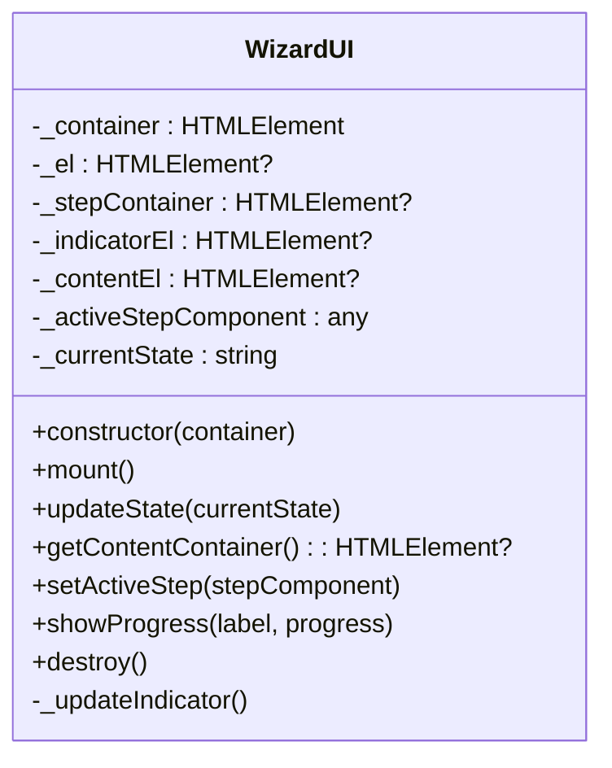

**Diagram sources**
- [WizardUI.js](file://src/ui/WizardUI.js)

**Section sources**
- [WizardUI.js](file://src/ui/WizardUI.js)

### UploadStep: Image Input and Validation
UploadStep provides:
- Drag-and-drop zone with hover feedback.
- File picker and paste-from-clipboard handling.
- Validation for file size and type.
- Optional “Load from Storage” button when saved character exists.
- Callbacks for successful image load and storage load.

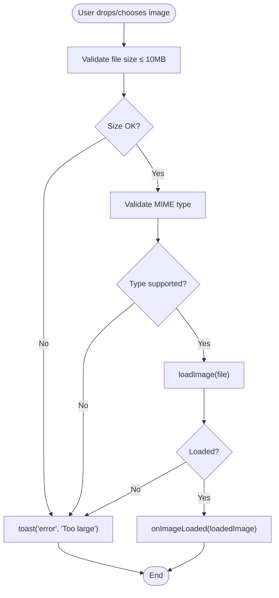

**Diagram sources**
- [UploadStep.js](file://src/ui/UploadStep.js)
- [toast.js](file://src/ui/toast.js)

**Section sources**
- [UploadStep.js](file://src/ui/UploadStep.js)
- [toast.js](file://src/ui/toast.js)

### MaskStep: Threshold, Brush, Undo/Redo, Preview
MaskStep manages:
- Threshold slider to generate initial mask.
- Brush tools (add/erase modes) with configurable radius.
- Canvas overlay blending for mask visualization.
- History-based undo/redo with keyboard shortcuts (Ctrl+Z/Ctrl+Shift+Z/Ctrl+Y).
- Navigation to next step with guard validation.

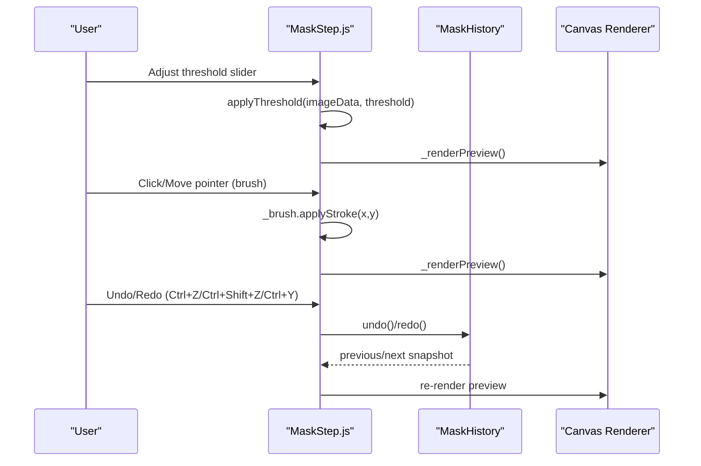

**Diagram sources**
- [MaskStep.js](file://src/ui/MaskStep.js)

**Section sources**
- [MaskStep.js](file://src/ui/MaskStep.js)

### RigStep: Character Type, Joint Editing, Undo/Redo
RigStep supports:
- Humanoid vs freeform skeleton estimation.
- Joint drag-and-drop editing with RigEditor.
- Undo/redo with keyboard shortcuts.
- “Bring to Life” enabled when minimum joints reached and all joints inside mask bounding box.

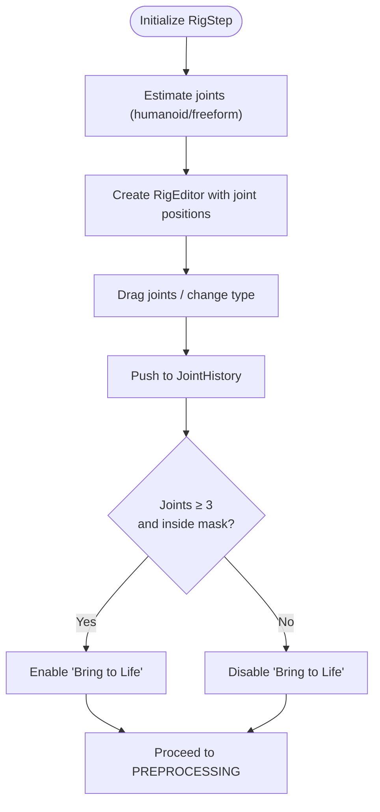

**Diagram sources**
- [RigStep.js](file://src/ui/RigStep.js)
- [StateMachine.js](file://src/state/StateMachine.js)

**Section sources**
- [RigStep.js](file://src/ui/RigStep.js)
- [StateMachine.js](file://src/state/StateMachine.js)

### StageStep: Rendering, Motion, IK Drag, Export
StageStep integrates:
- WebGL rendering via NPRRenderer and MeshPuppet.
- Motion playback with MotionResolver and predefined clips.
- IK dragging for interactive pose adjustments.
- Export panel for screen recording with codec detection.
- Keyboard shortcuts for play/pause, clip selection, record toggle, and escape.

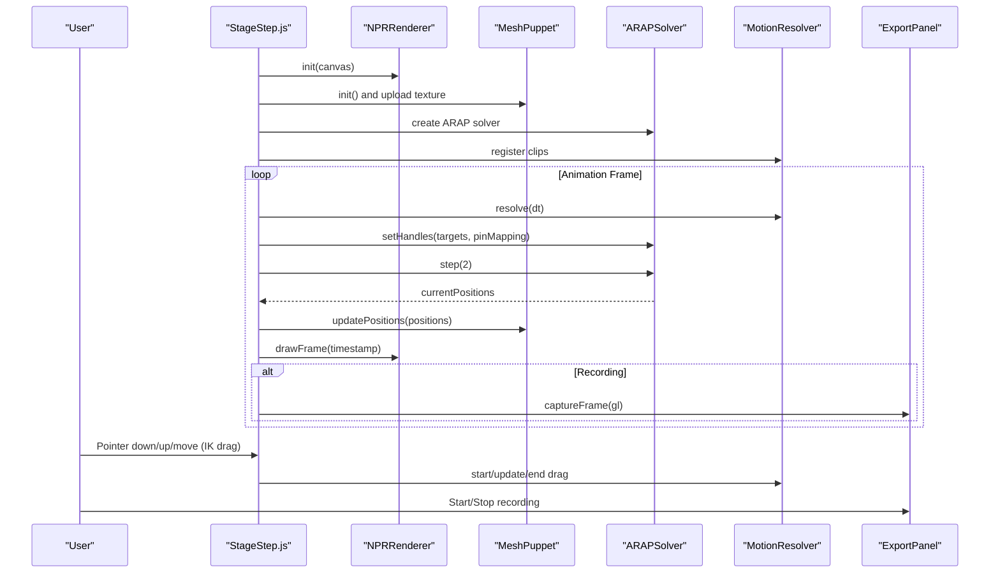

**Diagram sources**
- [StageStep.js](file://src/ui/StageStep.js)

**Section sources**
- [StageStep.js](file://src/ui/StageStep.js)

### ExportPanel: Recording Controls and Timer
ExportPanel provides:
- Start/stop recording with overlay timer.
- Codec detection and error messaging.
- Visibility toggling for UI elements.

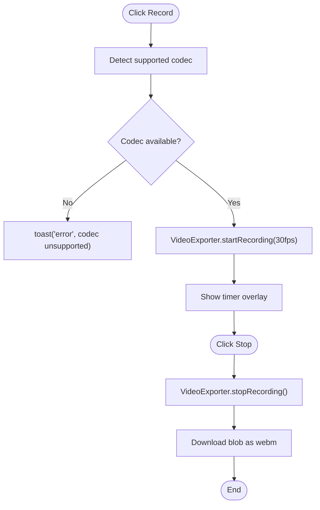

**Diagram sources**
- [ExportPanel.js](file://src/ui/ExportPanel.js)

**Section sources**
- [ExportPanel.js](file://src/ui/ExportPanel.js)

### SaveLoadPanel: Name Input, Save/Load
SaveLoadPanel offers:
- Character name input and save to browser storage.
- Load from storage with callback to App.
- Error handling for quota exceeded and failures.

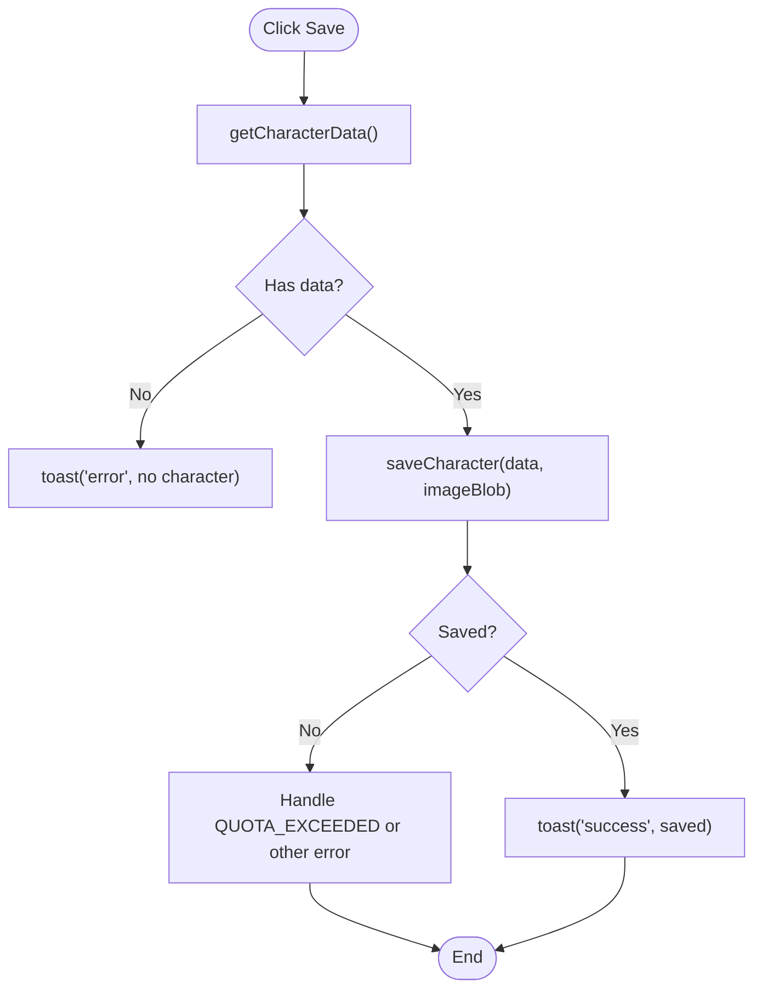

**Diagram sources**
- [SaveLoadPanel.js](file://src/ui/SaveLoadPanel.js)

**Section sources**
- [SaveLoadPanel.js](file://src/ui/SaveLoadPanel.js)

### SettingsPanel: NPR Rendering Parameters
SettingsPanel exposes:
- Sliders and color pickers for rendering parameters.
- Reset to defaults with remount.
- Real-time updates to renderer properties.

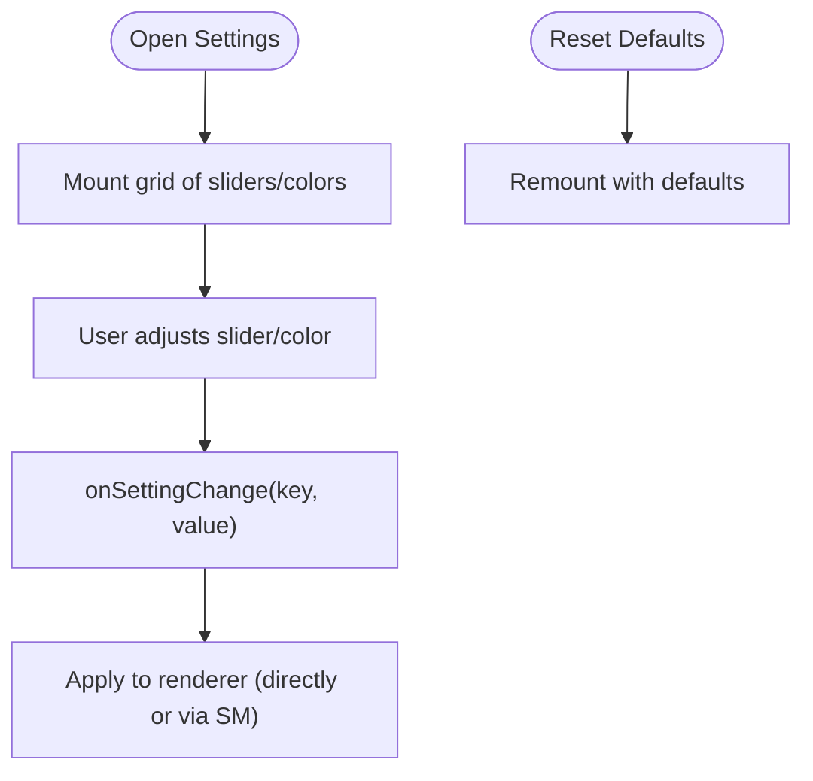

**Diagram sources**
- [SettingsPanel.js](file://src/ui/SettingsPanel.js)

**Section sources**
- [SettingsPanel.js](file://src/ui/SettingsPanel.js)

## Dependency Analysis
WizardUI depends on StateMachine for state updates and uses a step indicator mapping. Steps depend on shared state and callbacks to StateMachine. App coordinates all components and wires keyboard shortcuts and lifecycle hooks.

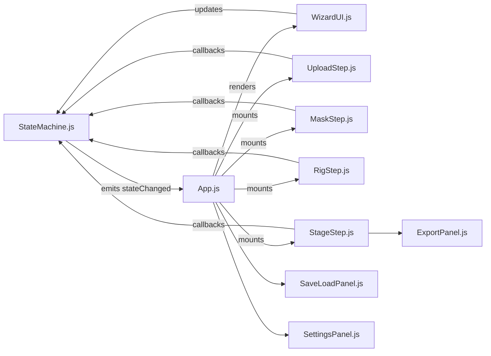

**Diagram sources**
- [StateMachine.js](file://src/state/StateMachine.js)
- [App.js](file://src/App.js)
- [WizardUI.js](file://src/ui/WizardUI.js)
- [UploadStep.js](file://src/ui/UploadStep.js)
- [MaskStep.js](file://src/ui/MaskStep.js)
- [RigStep.js](file://src/ui/RigStep.js)
- [StageStep.js](file://src/ui/StageStep.js)
- [ExportPanel.js](file://src/ui/ExportPanel.js)
- [SaveLoadPanel.js](file://src/ui/SaveLoadPanel.js)
- [SettingsPanel.js](file://src/ui/SettingsPanel.js)

**Section sources**
- [StateMachine.js](file://src/state/StateMachine.js)
- [App.js](file://src/App.js)

## Performance Considerations
- Canvas rendering: MaskStep and RigStep use 2D canvas overlays; ensure efficient redraws by minimizing pixel writes and leveraging overlay blending.
- WebGL pipeline: StageStep runs a continuous animation loop; throttle unnecessary updates and avoid redundant texture uploads.
- Preprocessing: WizardUI shows progress during preprocessing; keep UI responsive by yielding to the event loop and updating labels incrementally.
- Memory: ExportPanel and VideoExporter should release resources promptly after stop recording.
- Accessibility: Ensure keyboard focus order and ARIA attributes remain valid during dynamic DOM swaps.

[No sources needed since this section provides general guidance]

## Troubleshooting Guide
- Drag-and-drop not working:
  - Verify paste handler registration and drag events on the drop zone.
  - Confirm file type validation and size checks.
- Undo/Redo not triggering:
  - Ensure keyboard shortcuts are not intercepted by inputs and that history instances exist in the active state.
- Export fails:
  - Check codec availability and show appropriate error via toast.
  - Ensure exporter is properly started/stopped and frames captured.
- Save/Load errors:
  - Handle quota exceeded and general failures with user-friendly messages.
- Rendering issues:
  - Validate WebGL initialization and texture upload paths; fall back gracefully with toasts.

**Section sources**
- [UploadStep.js](file://src/ui/UploadStep.js)
- [MaskStep.js](file://src/ui/MaskStep.js)
- [RigStep.js](file://src/ui/RigStep.js)
- [StageStep.js](file://src/ui/StageStep.js)
- [ExportPanel.js](file://src/ui/ExportPanel.js)
- [SaveLoadPanel.js](file://src/ui/SaveLoadPanel.js)
- [toast.js](file://src/ui/toast.js)

## Conclusion
PaperAlive’s UI system is a modular, state-driven wizard that cleanly separates concerns across steps and panels. StateMachine ensures predictable transitions and shared state synchronization. The architecture supports robust interactions, accessibility, and responsive design, enabling users to transform raster images into animated, interactive characters with intuitive tools and immediate feedback.

[No sources needed since this section summarizes without analyzing specific files]

## Appendices

### Keyboard Shortcuts and Accessibility
- Global shortcuts:
  - Ctrl+Z: Undo (global routing via StateMachine).
  - Ctrl+Shift+Z or Ctrl+Y: Redo.
- Stage-only shortcuts:
  - Space: Play/Pause.
  - Keys 1–6: Select motion clip.
  - R: Toggle recording.
  - Escape: Cancel drag/export.
- Accessibility:
  - ARIA roles and labels on interactive elements.
  - Focus management and keyboard navigation.
  - Toast notifications with alert semantics.

**Section sources**
- [App.js](file://src/App.js)
- [UploadStep.js](file://src/ui/UploadStep.js)
- [MaskStep.js](file://src/ui/MaskStep.js)
- [RigStep.js](file://src/ui/RigStep.js)
- [StageStep.js](file://src/ui/StageStep.js)
- [toast.js](file://src/ui/toast.js)

### Responsive Design Considerations
- Breakpoints:
  - Mobile (< 600px): Simplified step indicators, stacked controls, and compact panels.
  - Tablet (600–1024px): Adjusted canvas heights and settings panel width.
  - Desktop (> 1024px): Expanded controls and improved layout spacing.
- Canvas sizing:
  - StageStep adapts canvas max-height based on viewport and optional image dimensions.

**Section sources**
- [style.css](file://src/style.css)
- [StageStep.js](file://src/ui/StageStep.js)

### Data Binding and State Synchronization
- Shared state:
  - StateMachine holds loaded image, alpha mask, thresholds, histories, joint positions, character type, and renderer references.
- Step-to-State bindings:
  - Steps update shared state via callbacks; StateMachine emits events for UI updates.
- Type safety:
  - characterData.js defines core types used across the system.

**Section sources**
- [StateMachine.js](file://src/state/StateMachine.js)
- [characterData.js](file://src/types/characterData.js)