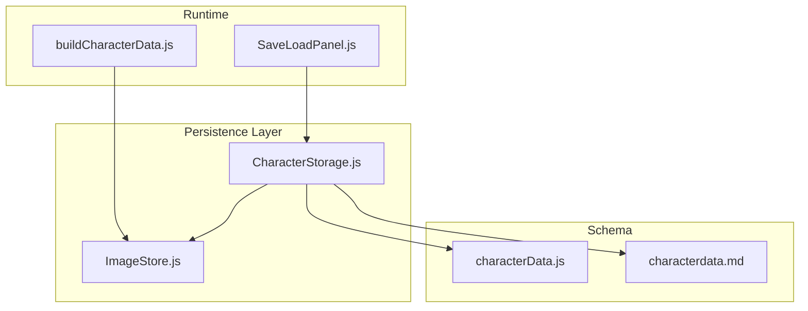
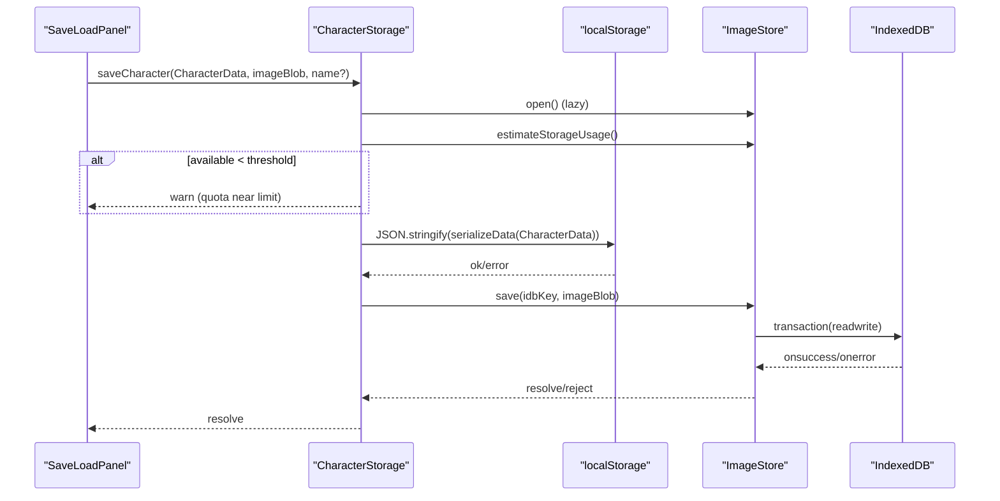
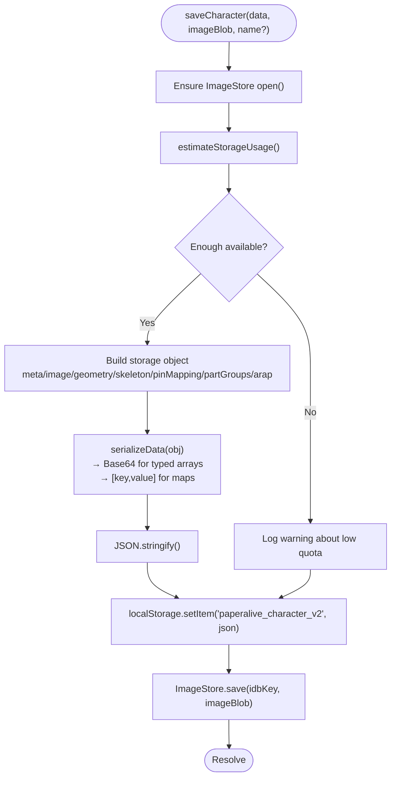
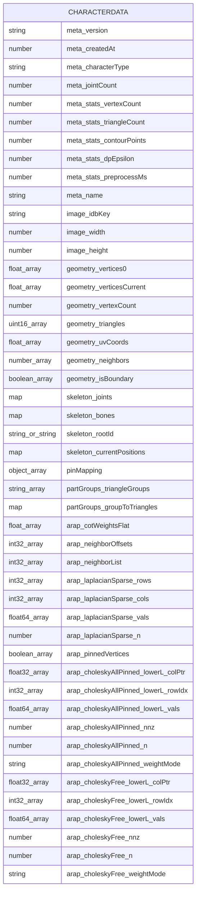
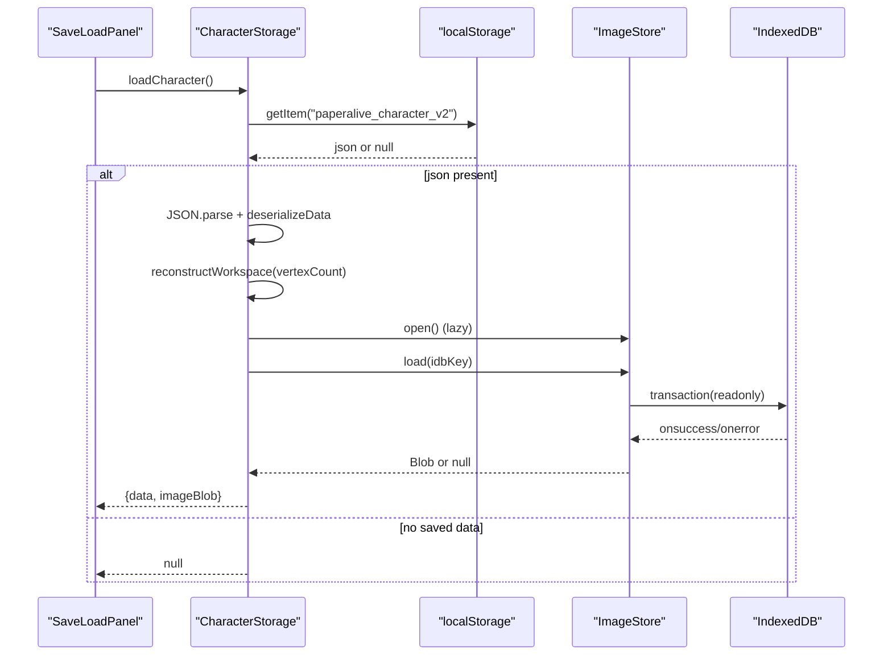
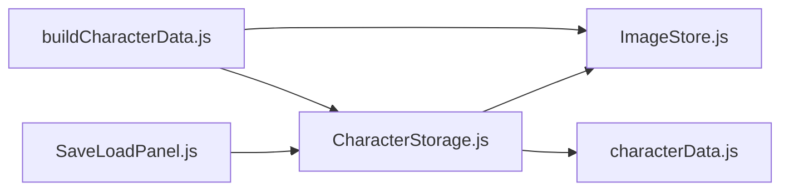

# Character Data Persistence

<cite>
**Referenced Files in This Document**
- [CharacterStorage.js](file://src/io/CharacterStorage.js)
- [ImageStore.js](file://src/io/ImageStore.js)
- [characterData.js](file://src/types/characterData.js)
- [characterdata.md](file://architecture/characterdata.md)
- [dataflow.md](file://architecture/dataflow.md)
- [SaveLoadPanel.js](file://src/ui/SaveLoadPanel.js)
- [buildCharacterData.js](file://src/character/buildCharacterData.js)
- [CharacterStorage.test.js](file://src/io/CharacterStorage.test.js)
- [ImageStore.test.js](file://src/io/ImageStore.test.js)
</cite>

## Table of Contents
1. [Introduction](#introduction)
2. [Project Structure](#project-structure)
3. [Core Components](#core-components)
4. [Architecture Overview](#architecture-overview)
5. [Detailed Component Analysis](#detailed-component-analysis)
6. [Dependency Analysis](#dependency-analysis)
7. [Performance Considerations](#performance-considerations)
8. [Troubleshooting Guide](#troubleshooting-guide)
9. [Conclusion](#conclusion)
10. [Appendices](#appendices)

## Introduction
This document describes the Character Data Persistence system in PaperAlive, focusing on how complete character configurations are saved and loaded using a dual-storage strategy. Geometry and skeleton data are serialized to localStorage as JSON, while images are stored as Blobs in IndexedDB via an ImageStore abstraction. It explains the character data model, serialization/deserialization mechanics, IndexedDB transaction handling, error recovery, and practical workflows for saving/loading and migration considerations.

## Project Structure
The persistence layer centers around:
- CharacterStorage orchestrates dual storage and handles serialization of typed arrays and maps.
- ImageStore encapsulates IndexedDB operations for image Blobs.
- characterData type definitions define the canonical schema for CharacterData.
- UI integration provides user actions to trigger save/load.
- buildCharacterData coordinates preprocessing and image storage prior to persistence.



**Diagram sources**
- [CharacterStorage.js:179-228](file://src/io/CharacterStorage.js#L179-L228)
- [ImageStore.js:27-195](file://src/io/ImageStore.js#L27-L195)
- [characterData.js:139-188](file://src/types/characterData.js#L139-L188)
- [characterdata.md:29-444](file://architecture/characterdata.md#L29-L444)
- [SaveLoadPanel.js:67-91](file://src/ui/SaveLoadPanel.js#L67-L91)
- [buildCharacterData.js:71-153](file://src/character/buildCharacterData.js#L71-L153)

**Section sources**
- [CharacterStorage.js:179-228](file://src/io/CharacterStorage.js#L179-L228)
- [ImageStore.js:27-195](file://src/io/ImageStore.js#L27-L195)
- [characterData.js:139-188](file://src/types/characterData.js#L139-L188)
- [characterdata.md:29-444](file://architecture/characterdata.md#L29-L444)
- [SaveLoadPanel.js:67-91](file://src/ui/SaveLoadPanel.js#L67-L91)
- [buildCharacterData.js:71-153](file://src/character/buildCharacterData.js#L71-L153)

## Core Components
- CharacterStorage: Dual-storage orchestrator for geometry JSON and image Blob.
- ImageStore: IndexedDB wrapper for image Blobs with transactions and quota estimation.
- CharacterData types: Canonical schema for geometry, skeleton, ARAP parameters, and animation-related fields.
- UI SaveLoadPanel: User-triggered save/load actions integrated with CharacterStorage.

Key responsibilities:
- Serialization of typed arrays and maps to JSON-compatible structures.
- Reconstruction of workspace arrays from geometry metadata on load.
- IndexedDB transaction safety and robust error handling.
- Quota awareness and warnings before saving.

**Section sources**
- [CharacterStorage.js:179-266](file://src/io/CharacterStorage.js#L179-L266)
- [ImageStore.js:27-195](file://src/io/ImageStore.js#L27-L195)
- [characterData.js:139-188](file://src/types/characterData.js#L139-L188)
- [SaveLoadPanel.js:67-108](file://src/ui/SaveLoadPanel.js#L67-L108)

## Architecture Overview
The persistence architecture uses a dual strategy:
- localStorage stores geometry and metadata as JSON.
- IndexedDB stores the image Blob via ImageStore.



**Diagram sources**
- [SaveLoadPanel.js:67-91](file://src/ui/SaveLoadPanel.js#L67-L91)
- [CharacterStorage.js:179-228](file://src/io/CharacterStorage.js#L179-L228)
- [ImageStore.js:47-96](file://src/io/ImageStore.js#L47-L96)

**Section sources**
- [dataflow.md:522-549](file://architecture/dataflow.md#L522-L549)
- [characterdata.md:352-397](file://architecture/characterdata.md#L352-L397)

## Detailed Component Analysis

### CharacterStorage: Serialization and Dual Storage
Responsibilities:
- Encodes typed arrays and Maps to JSON-safe structures.
- Saves geometry JSON to localStorage and image Blob to IndexedDB.
- Loads and reconstructs CharacterData, including workspace arrays.
- Handles quota warnings and quota-exceeded errors.

Serialization strategy:
- TypedArrays are encoded to Base64 strings with a discriminator token.
- Maps are converted to arrays of [key, value] pairs.
- Workspace arrays are excluded from storage and reconstructed from geometry.vertexCount.

IndexedDB integration:
- Uses ImageStore to save/load/delete image Blobs.
- Estimates storage usage via navigator.storage.estimate().

Error handling:
- Catches QuotaExceededError from localStorage.setItem and rethrows a standardized error.
- Gracefully handles parse failures on load by returning null.



**Diagram sources**
- [CharacterStorage.js:179-228](file://src/io/CharacterStorage.js#L179-L228)
- [CharacterStorage.js:85-144](file://src/io/CharacterStorage.js#L85-L144)

**Section sources**
- [CharacterStorage.js:179-228](file://src/io/CharacterStorage.js#L179-L228)
- [CharacterStorage.js:85-144](file://src/io/CharacterStorage.js#L85-L144)
- [CharacterStorage.js:155-163](file://src/io/CharacterStorage.js#L155-L163)
- [CharacterStorage.js:215-222](file://src/io/CharacterStorage.js#L215-L222)

### ImageStore: IndexedDB Transactions and Quota
Responsibilities:
- Opens IndexedDB database and creates object store on first run.
- Provides save, load, delete operations with readwrite/readonly transactions.
- Estimates storage usage via navigator.storage.estimate().

Transactions:
- All operations use explicit transactions with onsuccess/onerror/onabort handlers.
- Ensures safe access only when database is open.

Quota estimation:
- Returns { used, available } with availability derived from navigator.storage.estimate().
- Falls back gracefully when API is unavailable.

```mermaid
classDiagram
class ImageStore {
-db : IDBDatabase
-dbName : string
+open() Promise~void~
+save(key, blob) Promise~void~
+load(key) Promise~Blob|null~
+delete(key) Promise~void~
+estimateStorageUsage() Promise~{used, available}~
+close() void
-ensureOpen() void
}
```

**Diagram sources**
- [ImageStore.js:27-195](file://src/io/ImageStore.js#L27-L195)

**Section sources**
- [ImageStore.js:47-96](file://src/io/ImageStore.js#L47-L96)
- [ImageStore.js:104-124](file://src/io/ImageStore.js#L104-L124)
- [ImageStore.js:133-146](file://src/io/ImageStore.js#L133-L146)
- [ImageStore.js:156-173](file://src/io/ImageStore.js#L156-L173)
- [ImageStore.js:190-194](file://src/io/ImageStore.js#L190-L194)

### Character Data Schema and Reconstruction
CharacterData fields:
- meta: version, timestamps, characterType, jointCount, stats, name.
- image: idbKey, width, height.
- geometry: vertices0, verticesCurrent, vertexCount, triangles, uvCoords, neighbors, isBoundary.
- skeleton: joints (Map), bones (Map), rootId, currentPositions (Map).
- pinMapping: array of joint-to-vertex mappings.
- partGroups: triangle groups and reverse mapping.
- arap: cotWeightsFlat, neighborOffsets, neighborList, laplacianSparse, pinnedVertices, choleskyAllPinned, choleskyFree, workspace.

Workspace reconstruction:
- Workspace arrays (rotations, rhs_x, rhs_y, outlineNormals, interleavedBuffer) are pre-allocated based on geometry.vertexCount and not persisted.



**Diagram sources**
- [characterData.js:139-188](file://src/types/characterData.js#L139-L188)
- [characterData.js:115-130](file://src/types/characterData.js#L115-L130)

**Section sources**
- [characterData.js:139-188](file://src/types/characterData.js#L139-L188)
- [characterData.js:115-130](file://src/types/characterData.js#L115-L130)
- [characterdata.md:29-444](file://architecture/characterdata.md#L29-L444)

### Loading Workflow and Workspace Reconstruction
Loading sequence:
- Read JSON from localStorage.
- Parse and deserialize typed arrays and maps.
- Reconstruct workspace arrays from geometry.vertexCount.
- Load image Blob from IndexedDB via ImageStore.
- Return CharacterData and imageBlob.



**Diagram sources**
- [CharacterStorage.js:240-266](file://src/io/CharacterStorage.js#L240-L266)
- [ImageStore.js:104-124](file://src/io/ImageStore.js#L104-L124)

**Section sources**
- [CharacterStorage.js:240-266](file://src/io/CharacterStorage.js#L240-L266)
- [characterdata.md:352-397](file://architecture/characterdata.md#L352-L397)

### Practical Workflows and Examples
Saving:
- UI collects a name, updates CharacterData.meta, and calls saveCharacter with imageBlob.
- CharacterStorage serializes data, checks quota, writes JSON to localStorage, and saves image Blob to IndexedDB.

Loading:
- UI calls loadCharacter; if present, deserializes and reconstructs workspace, then loads image Blob.

Deletion:
- deleteCharacter removes both localStorage entry and IndexedDB record.

**Section sources**
- [SaveLoadPanel.js:67-108](file://src/ui/SaveLoadPanel.js#L67-L108)
- [CharacterStorage.js:279-297](file://src/io/CharacterStorage.js#L279-L297)

### Data Migration Scenarios
- Versioning: meta.version indicates format version; future migrations can branch on version.
- Field additions: New fields can be added to CharacterData; loaders should safely ignore unknown keys.
- Storage strategy changes: If switching from single localStorage to dual storage, migration scripts can:
  - Read legacy JSON from localStorage.
  - Extract image data and write to IndexedDB via ImageStore.
  - Write the new JSON structure to localStorage.

[No sources needed since this section provides general guidance]

## Dependency Analysis
- CharacterStorage depends on ImageStore for image Blob persistence and on characterData types for schema validation.
- ImageStore depends on IndexedDB APIs and navigator.storage estimate.
- UI SaveLoadPanel integrates with CharacterStorage to expose save/load actions.
- buildCharacterData coordinates image Blob creation and storage prior to persistence.



**Diagram sources**
- [SaveLoadPanel.js:8-27](file://src/ui/SaveLoadPanel.js#L8-L27)
- [CharacterStorage.js:15-33](file://src/io/CharacterStorage.js#L15-L33)
- [ImageStore.js:13-16](file://src/io/ImageStore.js#L13-L16)
- [buildCharacterData.js:18-20](file://src/character/buildCharacterData.js#L18-L20)

**Section sources**
- [SaveLoadPanel.js:8-27](file://src/ui/SaveLoadPanel.js#L8-L27)
- [CharacterStorage.js:15-33](file://src/io/CharacterStorage.js#L15-L33)
- [ImageStore.js:13-16](file://src/io/ImageStore.js#L13-L16)
- [buildCharacterData.js:18-20](file://src/character/buildCharacterData.js#L18-L20)

## Performance Considerations
- TypedArray serialization overhead: Base64 encoding increases payload size; keep geometry JSON small.
- Workspace arrays pre-allocation: Prevents per-frame allocations; ensure vertexCount remains consistent across versions.
- IndexedDB batching: Group save/load operations to minimize transaction overhead.
- Quota monitoring: Warn users before exceeding available quota to avoid partial writes.
- Memory management: Avoid retaining large Blobs unnecessarily; release references after successful save.

[No sources needed since this section provides general guidance]

## Troubleshooting Guide
Common issues and resolutions:
- QuotaExceededError: CharacterStorage converts native quota errors to a standardized error message; UI displays a warning and prevents save.
- Corrupted JSON: On load, if JSON.parse fails, CharacterStorage returns null; UI informs the user.
- Missing image Blob: If image.idbKey is present but Blob is missing, load returns null for imageBlob; UI can prompt to recreate character.
- IndexedDB transaction errors: ImageStore propagates tx.onerror/tx.onabort; callers should retry or notify users.

**Section sources**
- [CharacterStorage.js:215-222](file://src/io/CharacterStorage.js#L215-L222)
- [CharacterStorage.js:244-249](file://src/io/CharacterStorage.js#L244-L249)
- [ImageStore.js:92-95](file://src/io/ImageStore.js#L92-L95)
- [ImageStore.js:142-145](file://src/io/ImageStore.js#L142-L145)

## Conclusion
PaperAlive’s Character Data Persistence employs a robust dual-storage strategy: geometry and metadata in localStorage, images in IndexedDB. CharacterStorage ensures integrity by serializing typed arrays and maps, reconstructing workspace arrays, and handling quota and transaction errors gracefully. The schema and workflows described here enable reliable cross-session persistence for large character datasets while maintaining performance and usability.

[No sources needed since this section summarizes without analyzing specific files]

## Appendices

### Appendix A: Serialization Details
- TypedArrays: Encoded to Base64 with discriminator tokens for safe decoding.
- Maps: Converted to arrays of [key, value] pairs and restored as Map instances.
- Workspace arrays: Not serialized; reconstructed from geometry.vertexCount.

**Section sources**
- [CharacterStorage.js:85-144](file://src/io/CharacterStorage.js#L85-L144)
- [characterdata.md:352-397](file://architecture/characterdata.md#L352-L397)

### Appendix B: IndexedDB Transaction Handling
- All operations use explicit transactions with proper error propagation.
- Read-only vs readwrite modes are used appropriately for load/save/delete.

**Section sources**
- [ImageStore.js:87-95](file://src/io/ImageStore.js#L87-L95)
- [ImageStore.js:108-123](file://src/io/ImageStore.js#L108-L123)
- [ImageStore.js:137-145](file://src/io/ImageStore.js#L137-L145)

### Appendix C: Tests Coverage
- CharacterStorage: Round-trip serialization/deserialization, quota handling, workspace reconstruction.
- ImageStore: Open/create, save/load/delete, quota estimation.

**Section sources**
- [CharacterStorage.test.js:96-244](file://src/io/CharacterStorage.test.js#L96-L244)
- [ImageStore.test.js:31-182](file://src/io/ImageStore.test.js#L31-L182)