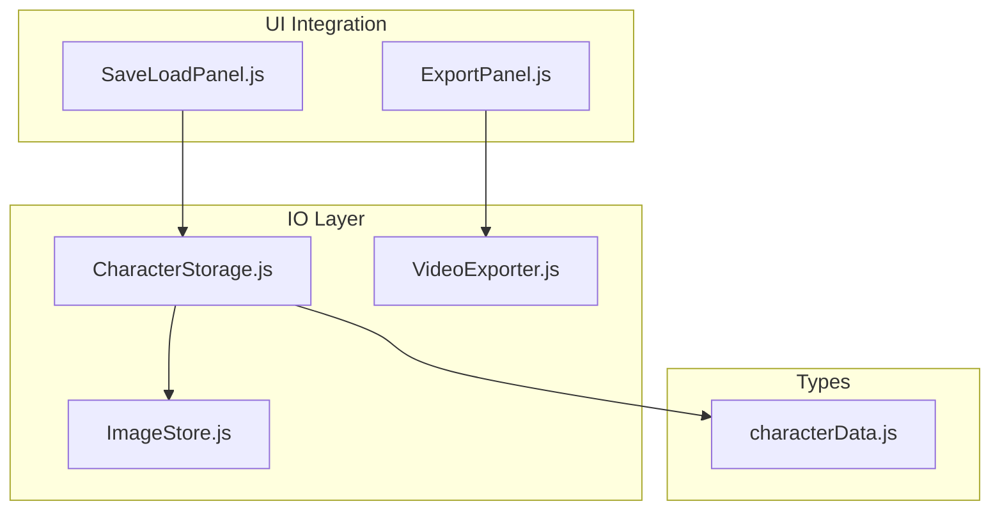
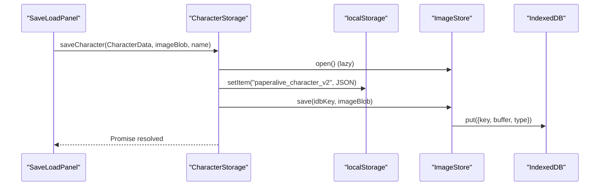
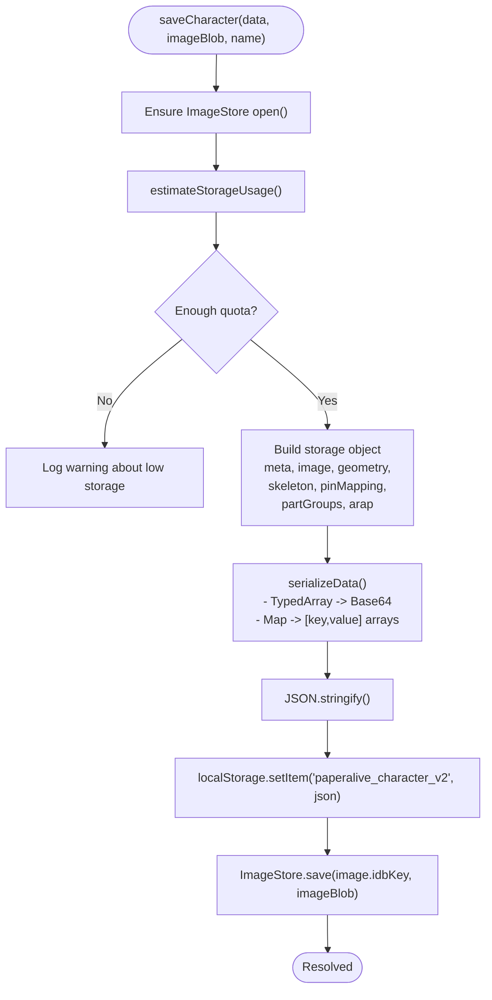
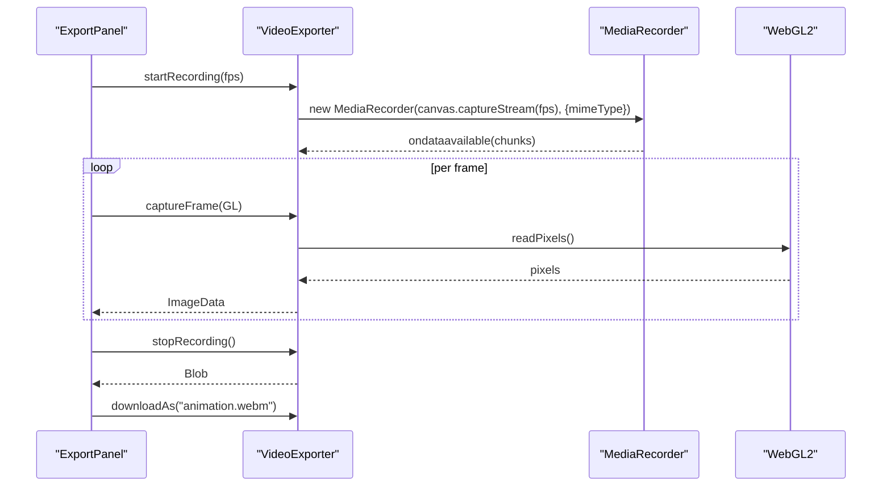
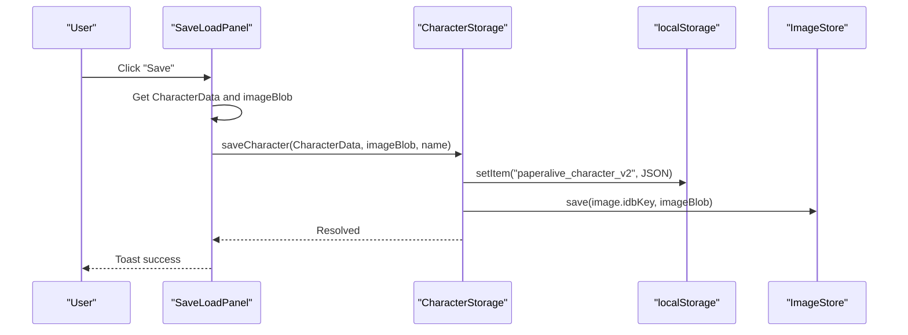
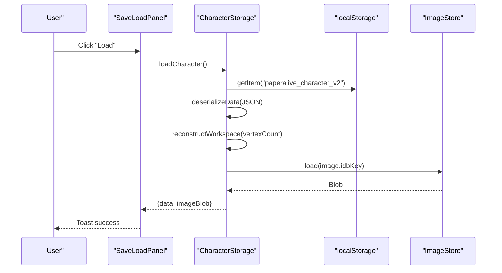
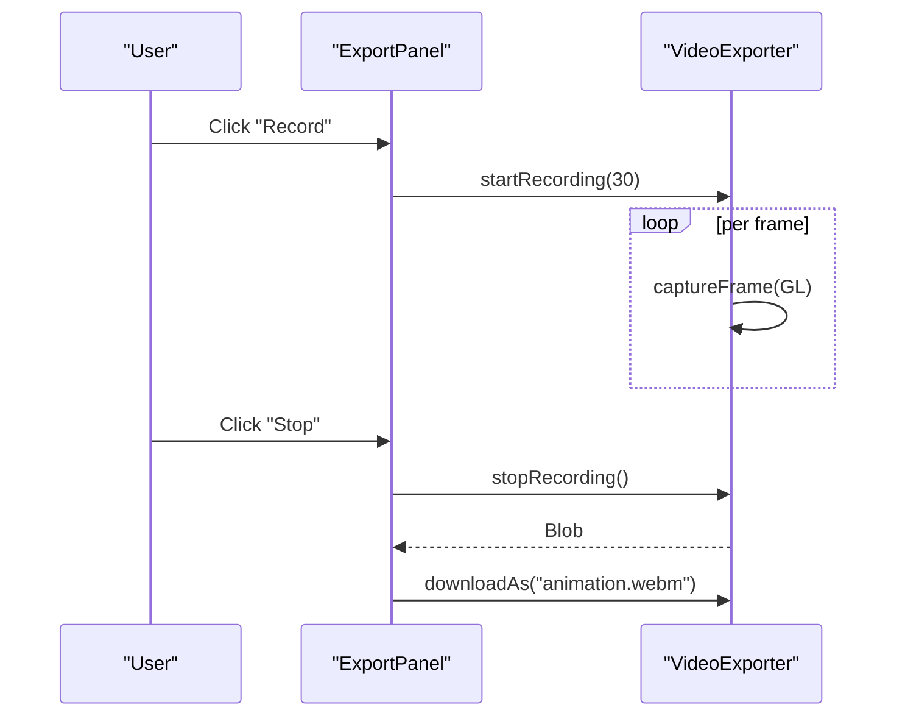
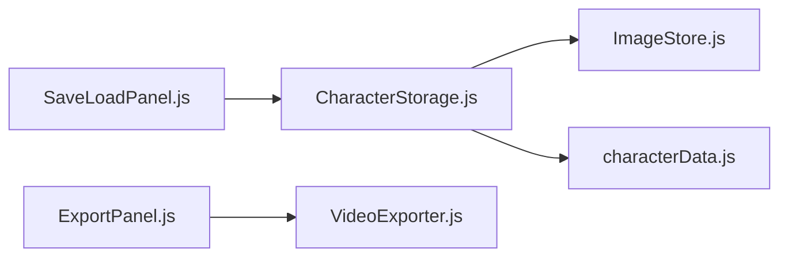

# Data Storage and Export

<cite>
**Referenced Files in This Document**
- [CharacterStorage.js](file://src/io/CharacterStorage.js)
- [ImageStore.js](file://src/io/ImageStore.js)
- [VideoExporter.js](file://src/io/VideoExporter.js)
- [characterData.js](file://src/types/characterData.js)
- [characterdata.md](file://architecture/characterdata.md)
- [module_design.md](file://architecture/module_design.md)
- [SaveLoadPanel.js](file://src/ui/SaveLoadPanel.js)
- [ExportPanel.js](file://src/ui/ExportPanel.js)
- [CharacterStorage.test.js](file://src/io/CharacterStorage.test.js)
- [ImageStore.test.js](file://src/io/ImageStore.test.js)
- [VideoExporter.test.js](file://src/io/VideoExporter.test.js)
</cite>

## Table of Contents
1. [Introduction](#introduction)
2. [Project Structure](#project-structure)
3. [Core Components](#core-components)
4. [Architecture Overview](#architecture-overview)
5. [Detailed Component Analysis](#detailed-component-analysis)
6. [Dependency Analysis](#dependency-analysis)
7. [Performance Considerations](#performance-considerations)
8. [Troubleshooting Guide](#troubleshooting-guide)
9. [Conclusion](#conclusion)

## Introduction
This document focuses on PaperAlive’s data storage and export capabilities. It explains how character data is persisted using a dual-storage strategy (geometry JSON in localStorage and images in IndexedDB), how media resources are managed, and how animated sequences are captured and exported. It also covers serialization formats, the character data structure, practical workflows, browser compatibility, and storage quota handling.

## Project Structure
The storage and export subsystems are implemented as small, focused modules:
- CharacterStorage orchestrates dual storage and serialization.
- ImageStore wraps IndexedDB for image Blob management.
- VideoExporter captures WebGL frames and exports videos using MediaRecorder.
- UI panels integrate these capabilities into the user workflow.



**Diagram sources**
- [CharacterStorage.js:1-298](file://src/io/CharacterStorage.js#L1-L298)
- [ImageStore.js:1-196](file://src/io/ImageStore.js#L1-L196)
- [VideoExporter.js:1-182](file://src/io/VideoExporter.js#L1-L182)
- [characterData.js:1-254](file://src/types/characterData.js#L1-L254)
- [SaveLoadPanel.js:1-120](file://src/ui/SaveLoadPanel.js#L1-L120)
- [ExportPanel.js:1-163](file://src/ui/ExportPanel.js#L1-L163)

**Section sources**
- [module_design.md:725-786](file://architecture/module_design.md#L725-L786)

## Core Components
- CharacterStorage: Dual-storage orchestrator that serializes geometry/skeleton/parts/arap data to JSON in localStorage and stores images in IndexedDB via ImageStore. It encodes TypedArrays as Base64 and converts Maps to arrays of [key, value] pairs for safe JSON serialization. Workspace arrays are reconstructed on load from geometry metadata.
- ImageStore: IndexedDB wrapper that saves, loads, and deletes image Blobs under unique keys. It estimates storage usage via navigator.storage.estimate() and ensures the database is open before operations.
- VideoExporter: Records WebGL canvas frames by manually reading pixel data via gl.readPixels(), detecting supported codecs, and exporting as WebM or MP4 using MediaRecorder.

**Section sources**
- [CharacterStorage.js:179-266](file://src/io/CharacterStorage.js#L179-L266)
- [ImageStore.js:27-195](file://src/io/ImageStore.js#L27-L195)
- [VideoExporter.js:55-181](file://src/io/VideoExporter.js#L55-L181)

## Architecture Overview
PaperAlive adopts a dual-storage strategy:
- Geometry, skeleton, pin mapping, part groups, and ARAP precompute data are serialized to JSON and stored in localStorage.
- Images are stored as Blobs in IndexedDB via ImageStore, referenced by a key in the character data.



**Diagram sources**
- [SaveLoadPanel.js:67-91](file://src/ui/SaveLoadPanel.js#L67-L91)
- [CharacterStorage.js:179-228](file://src/io/CharacterStorage.js#L179-L228)
- [ImageStore.js:79-96](file://src/io/ImageStore.js#L79-L96)

## Detailed Component Analysis

### CharacterStorage: Dual-Storage Orchestrator
- Serialization strategy:
  - TypedArrays are encoded to Base64 strings with a wrapper token indicating type.
  - Maps are converted to arrays of [key, value] pairs.
  - Arrays and objects are recursively processed.
- Workspace reconstruction:
  - Workspace arrays (rotations, rhs_x, rhs_y, outlineNormals, interleavedBuffer) are not serialized; they are reconstructed from geometry.vertexCount on load.
- Quota awareness:
  - Estimates available storage and warns when below a threshold before saving.
  - Converts QuotaExceededError from localStorage.setItem into a standardized error message for callers.



**Diagram sources**
- [CharacterStorage.js:179-228](file://src/io/CharacterStorage.js#L179-L228)
- [CharacterStorage.js:85-144](file://src/io/CharacterStorage.js#L85-L144)

**Section sources**
- [CharacterStorage.js:179-266](file://src/io/CharacterStorage.js#L179-L266)
- [characterdata.md:352-396](file://architecture/characterdata.md#L352-L396)

### ImageStore: IndexedDB Wrapper for Image Blobs
- Database and schema:
  - Database name defaults to a constant; object store name is “images” with keyPath “key”.
  - Creates the store on first run via onupgradeneeded.
- Operations:
  - save(key, blob): converts Blob to ArrayBuffer for structured cloning, stores {key, buffer, type}.
  - load(key): retrieves buffer and type, returns Blob or null.
  - delete(key): removes the record.
- Storage estimation:
  - Uses navigator.storage.estimate() to compute used and available bytes; returns Infinity when unavailable.
- Lifecycle:
  - Ensures open before operations; throws if not open.

```mermaid
classDiagram
class ImageStore {
-IDBDatabase db
-string dbName
+open() Promise~void~
+save(key, blob) Promise~void~
+load(key) Promise~Blob|null~
+delete(key) Promise~void~
+estimateStorageUsage() Promise~{used, available}~
+close() void
-ensureOpen() void
}
```

**Diagram sources**
- [ImageStore.js:27-195](file://src/io/ImageStore.js#L27-L195)

**Section sources**
- [ImageStore.js:47-195](file://src/io/ImageStore.js#L47-L195)
- [ImageStore.test.js:31-71](file://src/io/ImageStore.test.js#L31-L71)
- [ImageStore.test.js:75-128](file://src/io/ImageStore.test.js#L75-L128)
- [ImageStore.test.js:132-181](file://src/io/ImageStore.test.js#L132-L181)

### VideoExporter: Animated Sequence Capture and Export
- Codec detection:
  - Checks support in order: vp9 WebM, vp8 WebM, WebM, MP4.
- Recording:
  - Starts MediaRecorder on canvas.captureStream(fps).
  - Collects data chunks internally.
- Frame capture:
  - Reads RGBA pixels via gl.readPixels(), flips vertically to match canvas origin, returns ImageData.
- Stopping and download:
  - stopRecording() returns a Blob with the detected mime type.
  - downloadAs(filename) creates a temporary URL and triggers a download.



**Diagram sources**
- [ExportPanel.js:89-124](file://src/ui/ExportPanel.js#L89-L124)
- [VideoExporter.js:89-158](file://src/io/VideoExporter.js#L89-L158)
- [VideoExporter.js:121-137](file://src/io/VideoExporter.js#L121-L137)

**Section sources**
- [VideoExporter.js:28-40](file://src/io/VideoExporter.js#L28-L40)
- [VideoExporter.js:89-158](file://src/io/VideoExporter.js#L89-L158)
- [VideoExporter.js:121-137](file://src/io/VideoExporter.js#L121-L137)
- [VideoExporter.test.js:89-118](file://src/io/VideoExporter.test.js#L89-L118)
- [VideoExporter.test.js:148-178](file://src/io/VideoExporter.test.js#L148-L178)
- [VideoExporter.test.js:182-216](file://src/io/VideoExporter.test.js#L182-L216)

### Practical Workflows

#### Saving a Character
- UI collects a name and invokes SaveLoadPanel._save().
- SaveLoadPanel enriches CharacterData with meta.name and savedAt, then calls CharacterStorage.saveCharacter().
- CharacterStorage serializes geometry/skeleton/parts/arap to JSON and stores it in localStorage.
- CharacterStorage saves the image Blob to IndexedDB via ImageStore and logs warnings if storage is nearly full.



**Diagram sources**
- [SaveLoadPanel.js:67-91](file://src/ui/SaveLoadPanel.js#L67-L91)
- [CharacterStorage.js:179-228](file://src/io/CharacterStorage.js#L179-L228)

**Section sources**
- [SaveLoadPanel.js:67-91](file://src/ui/SaveLoadPanel.js#L67-L91)
- [CharacterStorage.test.js:96-148](file://src/io/CharacterStorage.test.js#L96-L148)

#### Loading a Character
- SaveLoadPanel.load() calls CharacterStorage.loadCharacter().
- CharacterStorage reads JSON from localStorage, deserializes Base64 to TypedArrays and restores Maps.
- It reconstructs workspace arrays from geometry.vertexCount and loads the image Blob from IndexedDB via ImageStore.



**Diagram sources**
- [SaveLoadPanel.js:96-108](file://src/ui/SaveLoadPanel.js#L96-L108)
- [CharacterStorage.js:240-266](file://src/io/CharacterStorage.js#L240-L266)

**Section sources**
- [CharacterStorage.js:240-266](file://src/io/CharacterStorage.js#L240-L266)
- [CharacterStorage.test.js:152-244](file://src/io/CharacterStorage.test.js#L152-L244)

#### Exporting Animation
- ExportPanel starts/stops recording and displays a timer overlay.
- VideoExporter.startRecording detects the best supported codec and begins recording the canvas stream.
- After each rendered frame, the app calls VideoExporter.captureFrame(GL) to capture the frame.
- On completion, VideoExporter.stopRecording() returns a Blob, and ExportPanel triggers download.



**Diagram sources**
- [ExportPanel.js:89-124](file://src/ui/ExportPanel.js#L89-L124)
- [VideoExporter.js:89-158](file://src/io/VideoExporter.js#L89-L158)

**Section sources**
- [ExportPanel.js:89-124](file://src/ui/ExportPanel.js#L89-L124)
- [VideoExporter.js:89-158](file://src/io/VideoExporter.js#L89-L158)
- [VideoExporter.test.js:148-178](file://src/io/VideoExporter.test.js#L148-L178)

## Dependency Analysis
- CharacterStorage depends on ImageStore for image Blob persistence and uses localStorage for geometry/skeleton metadata.
- ImageStore encapsulates IndexedDB operations and exposes a simple API for save/load/delete.
- VideoExporter depends on MediaRecorder and WebGL2 for frame capture and export.
- UI panels coordinate these modules to provide a cohesive user experience.



**Diagram sources**
- [SaveLoadPanel.js:8-28](file://src/ui/SaveLoadPanel.js#L8-L28)
- [CharacterStorage.js:15-33](file://src/io/CharacterStorage.js#L15-L33)
- [ExportPanel.js:13-41](file://src/ui/ExportPanel.js#L13-L41)
- [VideoExporter.js:55-81](file://src/io/VideoExporter.js#L55-L81)

**Section sources**
- [module_design.md:725-786](file://architecture/module_design.md#L725-L786)

## Performance Considerations
- Serialization overhead:
  - Base64 encoding increases size by approximately 33% compared to raw binary. This is acceptable because geometry data is relatively small (tens to hundreds of kilobytes).
- Memory management:
  - Workspace arrays are pre-allocated and reused every frame; they are not serialized to reduce payload size and avoid repeated allocations.
- Storage quotas:
  - CharacterStorage checks available storage before saving and warns when below a threshold. Tests demonstrate handling of QuotaExceededError from localStorage.setItem.
- Export performance:
  - Manual gl.readPixels() per frame is CPU-bound; keep frame rates reasonable (e.g., 30 fps) to balance quality and performance.
  - Choose codecs wisely: vp9 WebM offers good compression; fallback to vp8 or MP4 if needed.

[No sources needed since this section provides general guidance]

## Troubleshooting Guide
- Storage quota exceeded:
  - Symptom: saveCharacter throws a standardized error message.
  - Action: Clear browser cache/storage or reduce image sizes; consider deleting old characters.
  - Evidence: Tests simulate QuotaExceededError and assert the error is converted to a specific message.
- IndexedDB not open:
  - Symptom: ImageStore.save/load/delete throws an error instructing to open the database first.
  - Action: Ensure ImageStore.open() is called before operations.
- No saved character:
  - Symptom: loadCharacter returns null.
  - Action: Confirm localStorage key exists or that saveCharacter was invoked.
- Codec unsupported:
  - Symptom: startRecording logs an error and does not begin recording.
  - Action: Use a supported browser (Chrome/Firefox) or adjust codec preferences.

**Section sources**
- [CharacterStorage.test.js:248-294](file://src/io/CharacterStorage.test.js#L248-L294)
- [ImageStore.js:190-195](file://src/io/ImageStore.js#L190-L195)
- [ImageStore.test.js:132-181](file://src/io/ImageStore.test.js#L132-L181)
- [VideoExporter.js:92-95](file://src/io/VideoExporter.js#L92-L95)

## Conclusion
PaperAlive’s storage and export system balances reliability and performance:
- Dual storage keeps geometry lightweight in localStorage while preserving images efficiently in IndexedDB.
- Robust serialization and deserialization preserve TypedArrays and Maps, with workspace arrays reconstructed on load.
- The export pipeline provides flexible codec detection and straightforward capture/export workflows.
- Practical UI integration and error handling improve usability and resilience across browsers and storage conditions.