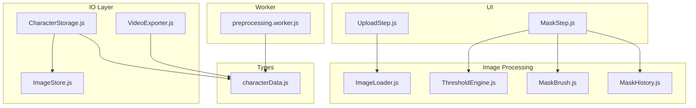
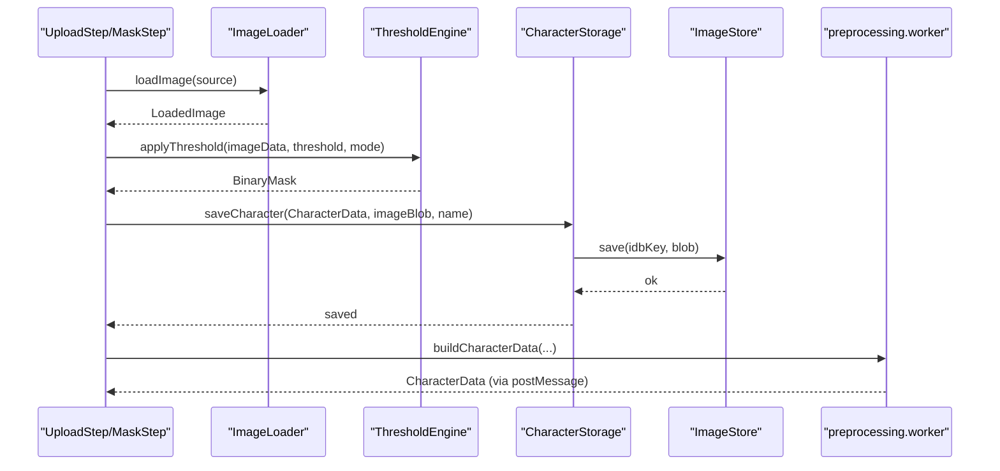
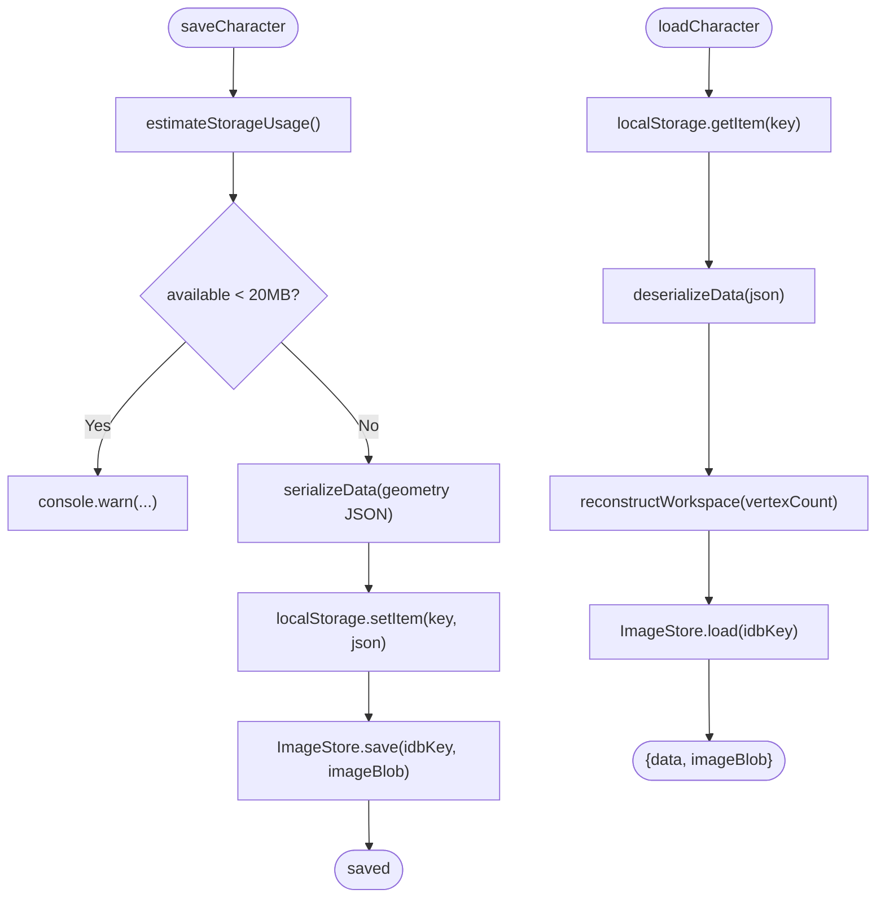
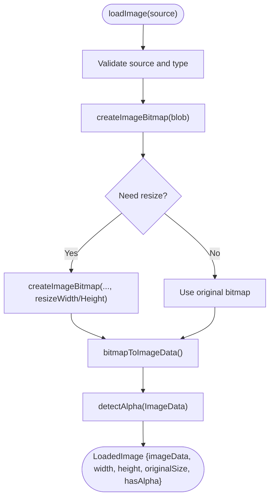
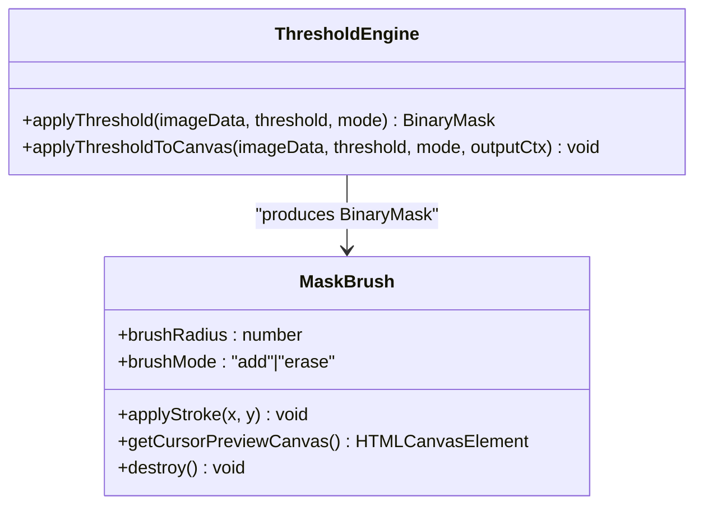
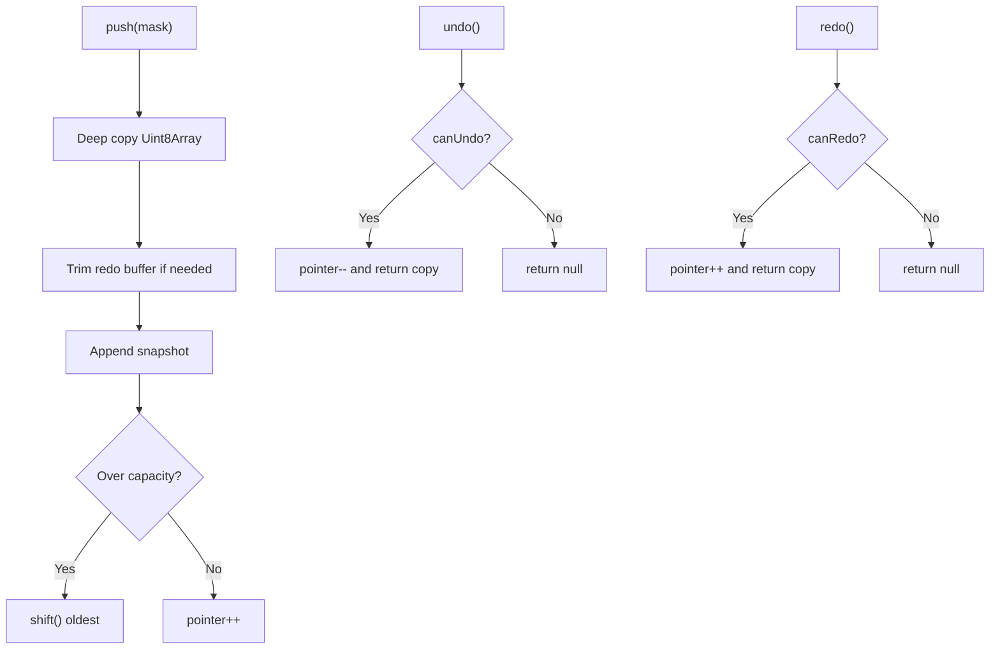
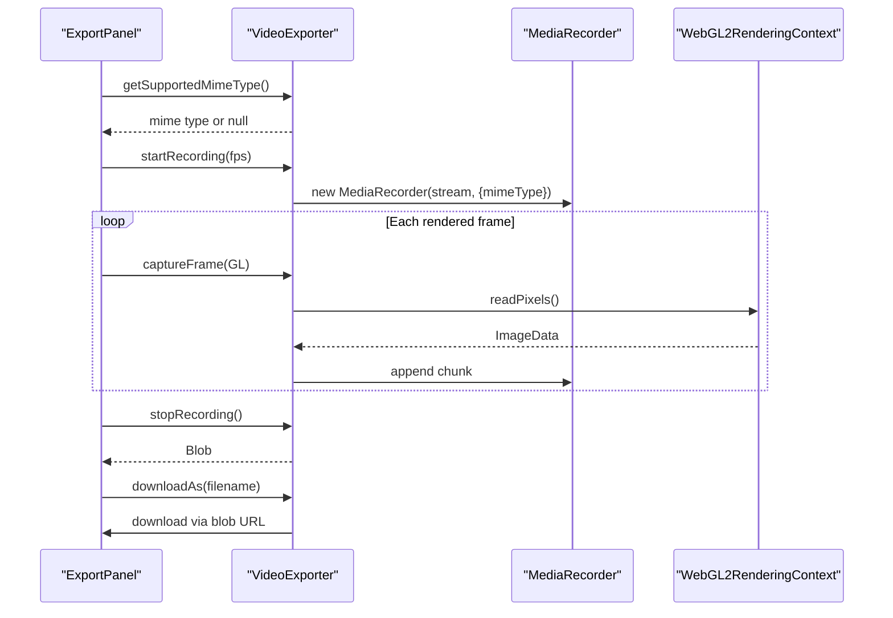
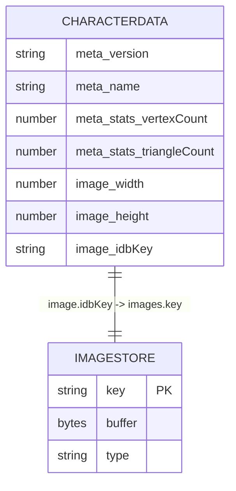
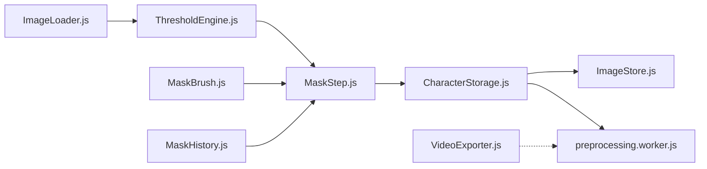

# Image and Media Storage

<cite>
**Referenced Files in This Document**
- [ImageStore.js](file://src/io/ImageStore.js)
- [CharacterStorage.js](file://src/io/CharacterStorage.js)
- [ImageLoader.js](file://src/image/ImageLoader.js)
- [ThresholdEngine.js](file://src/image/ThresholdEngine.js)
- [MaskBrush.js](file://src/image/MaskBrush.js)
- [MaskHistory.js](file://src/history/MaskHistory.js)
- [VideoExporter.js](file://src/io/VideoExporter.js)
- [preprocessing.worker.js](file://src/character/workers/preprocessing.worker.js)
- [characterData.js](file://src/types/characterData.js)
- [module_design.md](file://architecture/module_design.md)
- [characterdata.md](file://architecture/characterdata.md)
- [UploadStep.js](file://src/ui/UploadStep.js)
- [MaskStep.js](file://src/ui/MaskStep.js)
- [ImageStore.test.js](file://src/io/ImageStore.test.js)
- [CharacterStorage.test.js](file://src/io/CharacterStorage.test.js)
</cite>

## Table of Contents
1. [Introduction](#introduction)
2. [Project Structure](#project-structure)
3. [Core Components](#core-components)
4. [Architecture Overview](#architecture-overview)
5. [Detailed Component Analysis](#detailed-component-analysis)
6. [Dependency Analysis](#dependency-analysis)
7. [Performance Considerations](#performance-considerations)
8. [Troubleshooting Guide](#troubleshooting-guide)
9. [Conclusion](#conclusion)
10. [Appendices](#appendices)

## Introduction
This document explains the Image and Media Storage system in PaperAlive, focusing on how images and processed media are captured, transformed, stored, retrieved, and cleaned up during the character creation workflow. It covers:
- The ImageStore implementation for IndexedDB-backed image Blob storage
- The dual-storage strategy for geometry JSON and image Blobs
- Media resource lifecycle from upload through preprocessing and export
- Practical guidance for quotas, large files, browser compatibility, and concurrency
- API methods, error handling, and data integrity checks

## Project Structure
The media storage system spans several modules:
- IO layer: ImageStore (IndexedDB), CharacterStorage (dual storage orchestrator), VideoExporter (export)
- Image processing: ImageLoader (decode/resizing), ThresholdEngine (thresholding), MaskBrush (interactive editing)
- UI: UploadStep and MaskStep (user-driven workflows)
- Worker: preprocessing.worker (media-independent heavy computation)
- Types: characterData (shared data model)



**Diagram sources**
- [ImageStore.js:27-195](file://src/io/ImageStore.js#L27-L195)
- [CharacterStorage.js:15-297](file://src/io/CharacterStorage.js#L15-L297)
- [ImageLoader.js:72-144](file://src/image/ImageLoader.js#L72-L144)
- [ThresholdEngine.js:23-95](file://src/image/ThresholdEngine.js#L23-L95)
- [MaskBrush.js:20-95](file://src/image/MaskBrush.js#L20-L95)
- [MaskHistory.js:25-120](file://src/history/MaskHistory.js#L25-L120)
- [VideoExporter.js:55-181](file://src/io/VideoExporter.js#L55-L181)
- [preprocessing.worker.js:34-373](file://src/character/workers/preprocessing.worker.js#L34-L373)
- [characterData.js:139-188](file://src/types/characterData.js#L139-L188)
- [UploadStep.js:20-170](file://src/ui/UploadStep.js#L20-L170)
- [MaskStep.js:15-408](file://src/ui/MaskStep.js#L15-L408)

**Section sources**
- [module_design.md:88-92](file://architecture/module_design.md#L88-L92)
- [characterdata.md:352-396](file://architecture/characterdata.md#L352-L396)

## Core Components
- ImageStore: IndexedDB wrapper for image Blobs with open, save, load, delete, and quota estimation
- CharacterStorage: Orchestrates dual storage (localStorage for geometry JSON, IndexedDB for image Blobs)
- ImageLoader: Validates, decodes, resizes, and detects alpha presence in images
- ThresholdEngine: Converts ImageData to BinaryMask via alpha or luminance thresholding
- MaskBrush: Interactive brush tool for BinaryMask editing
- MaskHistory: Circular buffer for undo/redo of mask edits
- VideoExporter: Records WebGL frames to video via MediaRecorder and manual readPixels
- preprocessing.worker: Media-independent heavy computation executed in a Web Worker
- characterData: Shared data model defining how images and media are represented

**Section sources**
- [ImageStore.js:27-195](file://src/io/ImageStore.js#L27-L195)
- [CharacterStorage.js:15-297](file://src/io/CharacterStorage.js#L15-L297)
- [ImageLoader.js:72-144](file://src/image/ImageLoader.js#L72-L144)
- [ThresholdEngine.js:23-95](file://src/image/ThresholdEngine.js#L23-L95)
- [MaskBrush.js:20-95](file://src/image/MaskBrush.js#L20-L95)
- [MaskHistory.js:25-120](file://src/history/MaskHistory.js#L25-L120)
- [VideoExporter.js:55-181](file://src/io/VideoExporter.js#L55-L181)
- [preprocessing.worker.js:34-373](file://src/character/workers/preprocessing.worker.js#L34-L373)
- [characterData.js:139-188](file://src/types/characterData.js#L139-L188)

## Architecture Overview
The media storage architecture separates concerns:
- UI captures images and lets users refine masks
- ImageLoader normalizes images; ThresholdEngine produces masks
- CharacterStorage serializes geometry to localStorage and stores images in IndexedDB via ImageStore
- preprocessing.worker performs heavy computations without touching media
- VideoExporter records animations using WebGL frames



**Diagram sources**
- [UploadStep.js:133-155](file://src/ui/UploadStep.js#L133-L155)
- [ImageLoader.js:72-144](file://src/image/ImageLoader.js#L72-L144)
- [ThresholdEngine.js:23-36](file://src/image/ThresholdEngine.js#L23-L36)
- [CharacterStorage.js:179-228](file://src/io/CharacterStorage.js#L179-L228)
- [ImageStore.js:79-96](file://src/io/ImageStore.js#L79-L96)
- [preprocessing.worker.js:34-71](file://src/character/workers/preprocessing.worker.js#L34-L71)

## Detailed Component Analysis

### ImageStore: IndexedDB-backed Image Blob Management
ImageStore encapsulates IndexedDB operations for image Blobs:
- Database and store: "paperalive_images", object store "images" keyed by "key"
- Methods:
  - open(): initializes DB and object store if missing
  - save(key, blob): converts Blob to ArrayBuffer for structured cloning, stores {key, buffer, type}
  - load(key): retrieves Blob by key; returns null if not found
  - delete(key): removes entry by key
  - estimateStorageUsage(): uses navigator.storage.estimate() if available
  - close(): closes DB connection
- Safety: throws if operations are attempted before opening; ensures single open via internal guard

```mermaid
classDiagram
class ImageStore {
-db : IDBDatabase | null
-dbName : string
+constructor(dbName?)
+open() Promise~void~
+save(key, blob) Promise~void~
+load(key) Promise~Blob|null~
+delete(key) Promise~void~
+estimateStorageUsage() Promise~{used, available}~
+close() void
-#ensureOpen() void
}
```

**Diagram sources**
- [ImageStore.js:27-195](file://src/io/ImageStore.js#L27-L195)

**Section sources**
- [ImageStore.js:27-195](file://src/io/ImageStore.js#L27-L195)
- [ImageStore.test.js:18-182](file://src/io/ImageStore.test.js#L18-L182)

### CharacterStorage: Dual Storage Orchestration
CharacterStorage coordinates dual storage:
- localStorage: stores geometry JSON (with TypedArrays encoded as Base64)
- IndexedDB: stores image Blob via ImageStore
- Key responsibilities:
  - saveCharacter(data, imageBlob, name?): checks storage quota, serializes geometry, writes to localStorage, saves image Blob
  - loadCharacter(): reads localStorage, deserializes, reconstructs workspace arrays, loads image Blob
  - hasCharacter(): synchronous check for saved character
  - deleteCharacter(): deletes both localStorage entry and IndexedDB image



**Diagram sources**
- [CharacterStorage.js:179-266](file://src/io/CharacterStorage.js#L179-L266)
- [ImageStore.js:156-173](file://src/io/ImageStore.js#L156-L173)

**Section sources**
- [CharacterStorage.js:15-297](file://src/io/CharacterStorage.js#L15-L297)
- [CharacterStorage.test.js:85-294](file://src/io/CharacterStorage.test.js#L85-L294)

### ImageLoader: Image Decode, Resize, and Alpha Detection
ImageLoader accepts File, Blob, or URL, validates MIME types, decodes via createImageBitmap, resizes to max 1024px longest side, and returns LoadedImage with metadata and alpha detection.



**Diagram sources**
- [ImageLoader.js:72-144](file://src/image/ImageLoader.js#L72-L144)

**Section sources**
- [ImageLoader.js:72-144](file://src/image/ImageLoader.js#L72-L144)
- [UploadStep.js:133-155](file://src/ui/UploadStep.js#L133-L155)

### ThresholdEngine and MaskBrush: Mask Creation and Editing
ThresholdEngine converts ImageData to BinaryMask using alpha or luminance thresholding and can render a preview overlay. MaskBrush applies circular strokes to modify masks in-place, with boundary safety and configurable radius/mode.



**Diagram sources**
- [ThresholdEngine.js:23-95](file://src/image/ThresholdEngine.js#L23-L95)
- [MaskBrush.js:20-95](file://src/image/MaskBrush.js#L20-L95)

**Section sources**
- [ThresholdEngine.js:23-95](file://src/image/ThresholdEngine.js#L23-L95)
- [MaskBrush.js:20-95](file://src/image/MaskBrush.js#L20-L95)
- [MaskStep.js:68-78](file://src/ui/MaskStep.js#L68-L78)

### MaskHistory: Undo/Redo for Mask Edits
MaskHistory maintains a circular buffer of BinaryMask snapshots, enabling undo/redo after brush gestures. It deep-copies mask data and evicts oldest snapshots when capacity is exceeded.



**Diagram sources**
- [MaskHistory.js:55-111](file://src/history/MaskHistory.js#L55-L111)

**Section sources**
- [MaskHistory.js:25-120](file://src/history/MaskHistory.js#L25-L120)
- [MaskStep.js:338-361](file://src/ui/MaskStep.js#L338-L361)

### VideoExporter: WebGL Frame Recording and Export
VideoExporter detects supported codecs, starts MediaRecorder from canvas.captureStream, captures frames via manual gl.readPixels, and provides download via blob URL.



**Diagram sources**
- [VideoExporter.js:55-181](file://src/io/VideoExporter.js#L55-L181)

**Section sources**
- [VideoExporter.js:55-181](file://src/io/VideoExporter.js#L55-L181)

### Data Model: Image References in CharacterData
CharacterData.image holds only a reference to the stored image (idbKey, dimensions). The actual Blob is stored separately in IndexedDB via ImageStore.



**Diagram sources**
- [characterData.js:156-160](file://src/types/characterData.js#L156-L160)
- [ImageStore.js:79-124](file://src/io/ImageStore.js#L79-L124)

**Section sources**
- [characterData.js:139-188](file://src/types/characterData.js#L139-L188)
- [characterdata.md:60-81](file://architecture/characterdata.md#L60-L81)

## Dependency Analysis
- ImageStore depends on IndexedDB APIs and is used by CharacterStorage
- CharacterStorage depends on ImageStore and localStorage
- ImageLoader feeds ImageData to ThresholdEngine and MaskBrush
- MaskStep composes ThresholdEngine, MaskBrush, and MaskHistory
- preprocessing.worker is media-independent and does not depend on IO modules
- VideoExporter depends on MediaRecorder and WebGL



**Diagram sources**
- [ImageLoader.js:72-144](file://src/image/ImageLoader.js#L72-L144)
- [ThresholdEngine.js:23-95](file://src/image/ThresholdEngine.js#L23-L95)
- [MaskBrush.js:20-95](file://src/image/MaskBrush.js#L20-L95)
- [MaskHistory.js:25-120](file://src/history/MaskHistory.js#L25-L120)
- [MaskStep.js:15-408](file://src/ui/MaskStep.js#L15-L408)
- [CharacterStorage.js:15-33](file://src/io/CharacterStorage.js#L15-L33)
- [ImageStore.js:27-195](file://src/io/ImageStore.js#L27-L195)
- [preprocessing.worker.js:34-71](file://src/character/workers/preprocessing.worker.js#L34-L71)
- [VideoExporter.js:55-181](file://src/io/VideoExporter.js#L55-L181)

**Section sources**
- [module_design.md:88-92](file://architecture/module_design.md#L88-L92)

## Performance Considerations
- Memory optimization
  - ImageLoader resizes to max 1024px longest side to reduce memory footprint
  - ThresholdEngine and MaskBrush operate on flat Uint8Array masks
  - Workspace arrays in CharacterData are pre-allocated and not serialized
- Concurrency
  - ImageStore operations are transactional and safe to call concurrently; ensure a single open session per store instance
  - VideoExporter appends chunks asynchronously; avoid overlapping recordings
- Large media files
  - CharacterStorage warns when available storage is below 20 MB
  - Prefer compressed image formats and appropriate thresholds to keep IndexedDB sizes reasonable
- Browser compatibility
  - ImageLoader uses createImageBitmap and OffscreenCanvas for decoding and resizing
  - VideoExporter detects codecs before instantiation; falls back gracefully if unsupported
  - ImageStore relies on IndexedDB; ensure environment supports it

[No sources needed since this section provides general guidance]

## Troubleshooting Guide
- IndexedDB not open
  - Symptom: save/load/delete throws “database not open”
  - Fix: call open() before any operation
- Quota exceeded during save
  - Symptom: localStorage.setItem throws QuotaExceededError
  - Behavior: saveCharacter rethrows a structured QUOTA_EXCEEDED error
  - Fix: free up space or reduce image size/thresholds
- Loading corrupted or missing data
  - Symptom: loadCharacter returns null or partial data
  - Cause: invalid JSON or parse error
  - Fix: deleteCharacter to clear stale entries, then re-save
- Video export fails silently
  - Symptom: no recording started or empty blob
  - Fix: check getSupportedMimeType() and browser support; ensure canvas is rendered before captureFrame

**Section sources**
- [ImageStore.js:190-194](file://src/io/ImageStore.js#L190-L194)
- [CharacterStorage.js:215-222](file://src/io/CharacterStorage.js#L215-L222)
- [CharacterStorage.test.js:248-293](file://src/io/CharacterStorage.test.js#L248-L293)
- [VideoExporter.js:89-95](file://src/io/VideoExporter.js#L89-L95)

## Conclusion
PaperAlive’s Image and Media Storage system cleanly separates image Blobs from geometry data, leveraging IndexedDB for scalable media storage and localStorage for compact geometry. The UI integrates image loading, thresholding, and interactive editing, while the dual-storage strategy ensures robust persistence. The worker-based preprocessing keeps media processing off the main thread, and the export pipeline enables high-quality video capture. Together, these components deliver a maintainable, performant, and user-friendly media workflow.

[No sources needed since this section summarizes without analyzing specific files]

## Appendices

### Practical Examples

- Storing and retrieving images
  - Save: call saveCharacter with CharacterData containing image.idbKey and the image Blob; ImageStore.save persists the Blob
  - Load: call loadCharacter; ImageStore.load returns the Blob by key
  - Delete: call deleteCharacter to remove both localStorage and IndexedDB entries

- Managing storage quotas
  - Before saving, call estimateStorageUsage and warn if available < 20 MB
  - Reduce image size or threshold sensitivity to fit within limits

- Handling large media files
  - Use ImageLoader to decode and resize images to ≤ 1024px longest side
  - Prefer efficient formats (PNG/WebP) and avoid unnecessary alpha channels when not needed

- Browser compatibility
  - ImageLoader requires createImageBitmap and OffscreenCanvas
  - VideoExporter requires MediaRecorder and canvas.captureStream
  - ImageStore requires IndexedDB

- Memory optimization
  - Use ThresholdEngine with luminance mode for non-alpha images
  - Keep mask edits bounded with MaskHistory to limit memory growth

- Concurrent operations
  - Open ImageStore once per session; reuse the instance
  - Avoid overlapping MediaRecorder sessions; stop before starting a new one

**Section sources**
- [ImageStore.js:156-173](file://src/io/ImageStore.js#L156-L173)
- [CharacterStorage.js:179-228](file://src/io/CharacterStorage.js#L179-L228)
- [ImageLoader.js:72-144](file://src/image/ImageLoader.js#L72-L144)
- [ThresholdEngine.js:23-95](file://src/image/ThresholdEngine.js#L23-L95)
- [MaskHistory.js:25-120](file://src/history/MaskHistory.js#L25-L120)
- [VideoExporter.js:55-181](file://src/io/VideoExporter.js#L55-L181)