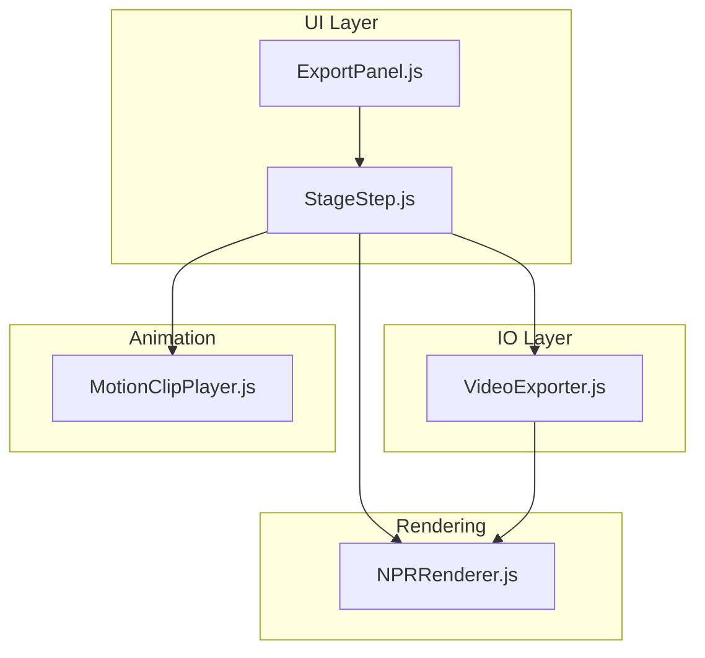
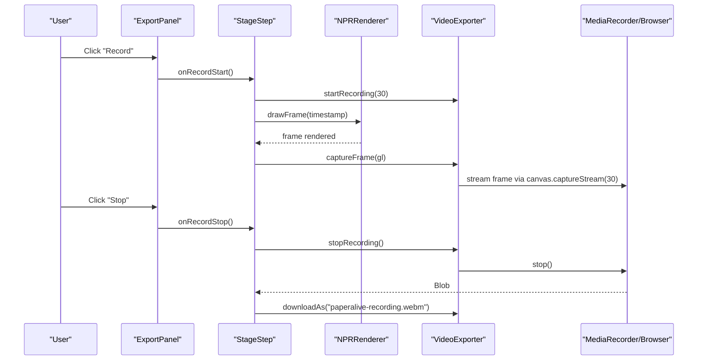
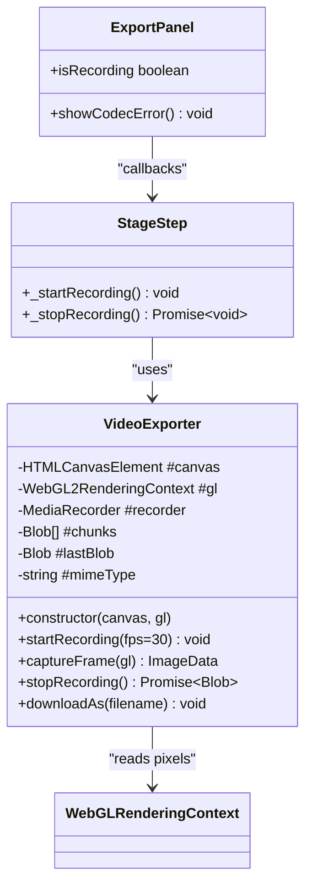
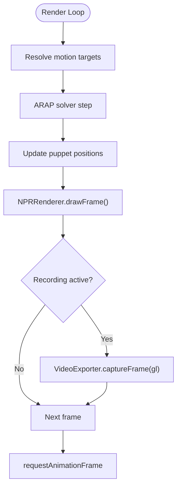
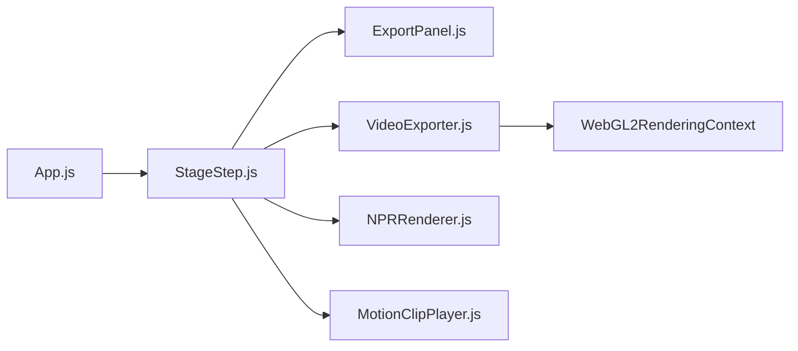

# Video Export System

<cite>
**Referenced Files in This Document**
- [VideoExporter.js](file://src/io/VideoExporter.js)
- [VideoExporter.test.js](file://src/io/VideoExporter.test.js)
- [ExportPanel.js](file://src/ui/ExportPanel.js)
- [StageStep.js](file://src/ui/StageStep.js)
- [App.js](file://src/App.js)
- [rendering_pipeline.md](file://architecture/rendering_pipeline.md)
- [NPRRenderer.js](file://src/rendering/NPRRenderer.js)
- [MotionClipPlayer.js](file://src/motion/MotionClipPlayer.js)
- [package.json](file://package.json)
</cite>

## Table of Contents
1. [Introduction](#introduction)
2. [Project Structure](#project-structure)
3. [Core Components](#core-components)
4. [Architecture Overview](#architecture-overview)
5. [Detailed Component Analysis](#detailed-component-analysis)
6. [Dependency Analysis](#dependency-analysis)
7. [Performance Considerations](#performance-considerations)
8. [Troubleshooting Guide](#troubleshooting-guide)
9. [Conclusion](#conclusion)

## Introduction
This document describes the Video Export System in PaperAlive, focusing on the VideoExporter implementation for capturing animated character sequences and exporting them as video files. It explains the frame capture mechanism, canvas rendering pipeline, and video encoding processes. It documents supported video formats, quality settings, and export parameters, and covers the integration with the rendering system for real-time frame capture during animation playback. Practical examples of export workflows, format conversion, and quality optimization are included, along with performance considerations for high-resolution exports, memory management during long recordings, and browser compatibility for video codecs. The export API, error handling for encoding failures, and progress tracking mechanisms are explained, including the relationship between animation playback and export timing synchronization.

## Project Structure
The Video Export System spans several modules:
- IO Layer: VideoExporter encapsulates MediaRecorder-based recording and manual frame capture via WebGL readPixels
- UI Layer: ExportPanel provides the user interface for starting/stopping recording and displaying a timer
- Application Integration: StageStep coordinates the rendering loop and triggers frame capture during recording
- Rendering Pipeline: NPRRenderer manages WebGL rendering passes and timing
- Animation Playback: MotionClipPlayer drives motion clips and timing for synchronized export

**Diagram sources**
- [ExportPanel.js:13-162](file://src/ui/ExportPanel.js#L13-L162)
- [StageStep.js:31-427](file://src/ui/StageStep.js#L31-L427)
- [VideoExporter.js:55-181](file://src/io/VideoExporter.js#L55-L181)
- [NPRRenderer.js:112-879](file://src/rendering/NPRRenderer.js#L112-L879)
- [MotionClipPlayer.js:28-167](file://src/motion/MotionClipPlayer.js#L28-L167)

**Section sources**
- [ExportPanel.js:13-162](file://src/ui/ExportPanel.js#L13-L162)
- [StageStep.js:31-427](file://src/ui/StageStep.js#L31-L427)
- [VideoExporter.js:55-181](file://src/io/VideoExporter.js#L55-L181)
- [NPRRenderer.js:112-879](file://src/rendering/NPRRenderer.js#L112-L879)
- [MotionClipPlayer.js:28-167](file://src/motion/MotionClipPlayer.js#L28-L167)

## Core Components
- VideoExporter: Provides codec detection, MediaRecorder-based recording, manual frame capture via WebGL readPixels, and download functionality
- ExportPanel: UI controls for recording, timer display, and codec error notifications
- StageStep: Integrates recording with the rendering loop, invoking VideoExporter during drawFrame
- NPRRenderer: Manages WebGL rendering passes and maintains the rendering context
- MotionClipPlayer: Drives motion clips and timing for synchronized export

Key capabilities:
- Automatic codec detection prioritizing VP9/WebM, VP8/WebM, WebM, and MP4
- Manual frame capture using WebGL readPixels with Y-axis flipping to match canvas coordinate system
- MediaRecorder-based streaming to Blob chunks for efficient memory usage
- Download support with automatic file extension selection based on detected codec

**Section sources**
- [VideoExporter.js:15-40](file://src/io/VideoExporter.js#L15-L40)
- [VideoExporter.js:55-181](file://src/io/VideoExporter.js#L55-L181)
- [ExportPanel.js:13-162](file://src/ui/ExportPanel.js#L13-L162)
- [StageStep.js:338-368](file://src/ui/StageStep.js#L338-L368)
- [NPRRenderer.js:112-185](file://src/rendering/NPRRenderer.js#L112-L185)
- [MotionClipPlayer.js:28-167](file://src/motion/MotionClipPlayer.js#L28-L167)

## Architecture Overview
The export system operates alongside the rendering pipeline. During animation playback, the rendering loop draws frames and, when recording is active, captures frames via VideoExporter. The captured frames are encoded by the browser’s MediaRecorder according to the detected codec and streamed into Blob chunks. Upon stopping, the final Blob is downloaded with an appropriate filename.

**Diagram sources**
- [ExportPanel.js:89-124](file://src/ui/ExportPanel.js#L89-L124)
- [StageStep.js:338-368](file://src/ui/StageStep.js#L338-L368)
- [VideoExporter.js:89-112](file://src/io/VideoExporter.js#L89-L112)
- [VideoExporter.js:144-158](file://src/io/VideoExporter.js#L144-L158)
- [VideoExporter.js:166-180](file://src/io/VideoExporter.js#L166-L180)
- [NPRRenderer.js:212-234](file://src/rendering/NPRRenderer.js#L212-L234)

**Section sources**
- [StageStep.js:212-234](file://src/ui/StageStep.js#L212-L234)
- [StageStep.js:338-368](file://src/ui/StageStep.js#L338-L368)
- [VideoExporter.js:89-112](file://src/io/VideoExporter.js#L89-L112)
- [VideoExporter.js:144-158](file://src/io/VideoExporter.js#L144-L158)
- [VideoExporter.js:166-180](file://src/io/VideoExporter.js#L166-L180)

## Detailed Component Analysis

### VideoExporter Implementation
VideoExporter encapsulates the recording workflow:
- Codec Detection: Iterates through supported MIME types to find the first supported type
- Recording: Starts MediaRecorder on canvas.captureStream at the specified FPS
- Frame Capture: Reads RGBA pixels via WebGL readPixels and flips the Y-axis to align with canvas coordinates
- Stopping: Waits for MediaRecorder stop, aggregates Blob chunks, and exposes the final Blob
- Download: Creates a temporary URL and triggers a download with the appropriate extension

**Diagram sources**
- [VideoExporter.js:55-181](file://src/io/VideoExporter.js#L55-L181)
- [ExportPanel.js:13-162](file://src/ui/ExportPanel.js#L13-L162)
- [StageStep.js:338-368](file://src/ui/StageStep.js#L338-L368)

**Section sources**
- [VideoExporter.js:15-40](file://src/io/VideoExporter.js#L15-L40)
- [VideoExporter.js:55-181](file://src/io/VideoExporter.js#L55-L181)
- [VideoExporter.test.js:18-54](file://src/io/VideoExporter.test.js#L18-L54)
- [VideoExporter.test.js:122-144](file://src/io/VideoExporter.test.js#L122-L144)
- [VideoExporter.test.js:148-178](file://src/io/VideoExporter.test.js#L148-L178)
- [VideoExporter.test.js:182-216](file://src/io/VideoExporter.test.js#L182-L216)
- [VideoExporter.test.js:220-230](file://src/io/VideoExporter.test.js#L220-L230)

### Export Panel UI
The ExportPanel provides:
- Record and Stop buttons with visibility toggling during recording
- A recording overlay with a live timer
- Codec error notification via toast messages
- Recording state tracking

Integration points:
- Callbacks invoked by StageStep on record start/stop
- Timer updates every second while recording

**Section sources**
- [ExportPanel.js:13-162](file://src/ui/ExportPanel.js#L13-L162)

### StageStep Integration
StageStep coordinates:
- Renderer initialization and WebGL context setup
- Animation loop using requestAnimationFrame
- Motion resolution and ARAP solver updates
- Conditional frame capture during recording
- Export lifecycle: startRecording, stopRecording, and download

Timing synchronization:
- drawFrame executes before captureFrame when recording is active
- Recording runs at 30 FPS while the live renderer runs at 60 FPS

**Section sources**
- [StageStep.js:137-207](file://src/ui/StageStep.js#L137-L207)
- [StageStep.js:212-234](file://src/ui/StageStep.js#L212-L234)
- [StageStep.js:338-368](file://src/ui/StageStep.js#L338-L368)

### Rendering Pipeline Integration
The rendering pipeline defines:
- WebGL context setup with preserveDrawingBuffer: false and stencil enabled
- Five-pass rendering: paper background, shadow, character with stencil-based outline, and post-process wiggle
- Recording strategy using manual readPixels instead of captureStream to avoid preserveDrawingBuffer overhead
- Frame budget and performance considerations

**Diagram sources**
- [rendering_pipeline.md:17-55](file://architecture/rendering_pipeline.md#L17-L55)
- [StageStep.js:212-234](file://src/ui/StageStep.js#L212-L234)
- [StageStep.js:225-228](file://src/ui/StageStep.js#L225-L228)

**Section sources**
- [rendering_pipeline.md:17-55](file://architecture/rendering_pipeline.md#L17-L55)
- [rendering_pipeline.md:416-460](file://architecture/rendering_pipeline.md#L416-L460)
- [NPRRenderer.js:112-185](file://src/rendering/NPRRenderer.js#L112-L185)

### Animation Playback and Timing
MotionClipPlayer:
- Loads motion clips with fps and loop settings
- Advances playback based on delta time
- Interpolates joint positions for smooth animation
- Supports static clips (fps <= 0)

Integration with export:
- Export starts while animation continues playing
- Export frame capture occurs after drawFrame, ensuring correct timing alignment

**Section sources**
- [MotionClipPlayer.js:28-167](file://src/motion/MotionClipPlayer.js#L28-L167)
- [StageStep.js:240-258](file://src/ui/StageStep.js#L240-L258)

## Dependency Analysis
The export system exhibits low coupling and clear separation of concerns:
- VideoExporter depends on HTMLCanvasElement and WebGL2RenderingContext
- StageStep orchestrates UI, rendering, and export without tight coupling to export internals
- ExportPanel is decoupled from export logic via callbacks
- Rendering pipeline remains independent of export mechanics

**Diagram sources**
- [App.js:454-473](file://src/App.js#L454-L473)
- [StageStep.js:31-83](file://src/ui/StageStep.js#L31-L83)
- [ExportPanel.js:13-41](file://src/ui/ExportPanel.js#L13-L41)
- [VideoExporter.js:55-81](file://src/io/VideoExporter.js#L55-L81)
- [NPRRenderer.js:112-124](file://src/rendering/NPRRenderer.js#L112-L124)
- [MotionClipPlayer.js:28-35](file://src/motion/MotionClipPlayer.js#L28-L35)

**Section sources**
- [App.js:454-473](file://src/App.js#L454-L473)
- [StageStep.js:31-83](file://src/ui/StageStep.js#L31-L83)
- [VideoExporter.js:55-81](file://src/io/VideoExporter.js#L55-L81)

## Performance Considerations
- Frame Rate Separation: Export runs at 30 FPS while live rendering runs at 60 FPS to balance quality and performance
- Memory Management: MediaRecorder streams frames into Blob chunks, minimizing peak memory usage
- WebGL Overhead: Manual readPixels introduces CPU/GPU transfer costs; ensure export durations are reasonable
- High Resolution: Larger canvases increase pixel count and transfer bandwidth; consider reducing resolution for long exports
- Browser Compatibility: VP9/WebM offers best compression; fallback to VP8/WebM or MP4 ensures broader compatibility

Practical tips:
- Use smaller canvas sizes for long recordings
- Limit export duration to reduce memory pressure
- Prefer VP9/WebM when supported for optimal quality/size ratio
- Monitor browser console for codec detection warnings

**Section sources**
- [rendering_pipeline.md:327-344](file://architecture/rendering_pipeline.md#L327-L344)
- [rendering_pipeline.md:416-460](file://architecture/rendering_pipeline.md#L416-L460)
- [VideoExporter.js:15-20](file://src/io/VideoExporter.js#L15-L20)
- [VideoExporter.js:89-112](file://src/io/VideoExporter.js#L89-L112)

## Troubleshooting Guide
Common issues and resolutions:
- Browser Codec Not Supported: VideoExporter logs an error and does not start recording; ExportPanel displays a codec error toast
- No Video to Download: Calling downloadAs without prior stopRecording results in an error log; ensure stopRecording resolves before downloading
- Recording Never Started: stopRecording returns an empty Blob when no recording was initiated
- Export Panel Controls: Keyboard shortcuts toggle recording; ensure ExportPanel is visible and functional

Error handling mechanisms:
- Codec detection failure: ExportPanel.showCodecError displays a user-friendly message
- Recording start failure: Console logs errors for debugging
- Download failure: Console logs indicate missing recorded video

**Section sources**
- [VideoExporter.js:92-95](file://src/io/VideoExporter.js#L92-L95)
- [VideoExporter.js:167-170](file://src/io/VideoExporter.js#L167-L170)
- [VideoExporter.js:145-147](file://src/io/VideoExporter.js#L145-L147)
- [ExportPanel.js:140-142](file://src/ui/ExportPanel.js#L140-L142)
- [StageStep.js:357-365](file://src/ui/StageStep.js#L357-L365)

## Conclusion
The Video Export System in PaperAlive provides a robust, browser-native solution for capturing animated character sequences. By integrating VideoExporter with the rendering pipeline and animation system, it achieves synchronized export timing while maintaining high-quality live playback. The system’s design emphasizes compatibility, performance, and user experience, with clear error handling and straightforward workflows for codec detection, frame capture, encoding, and download.