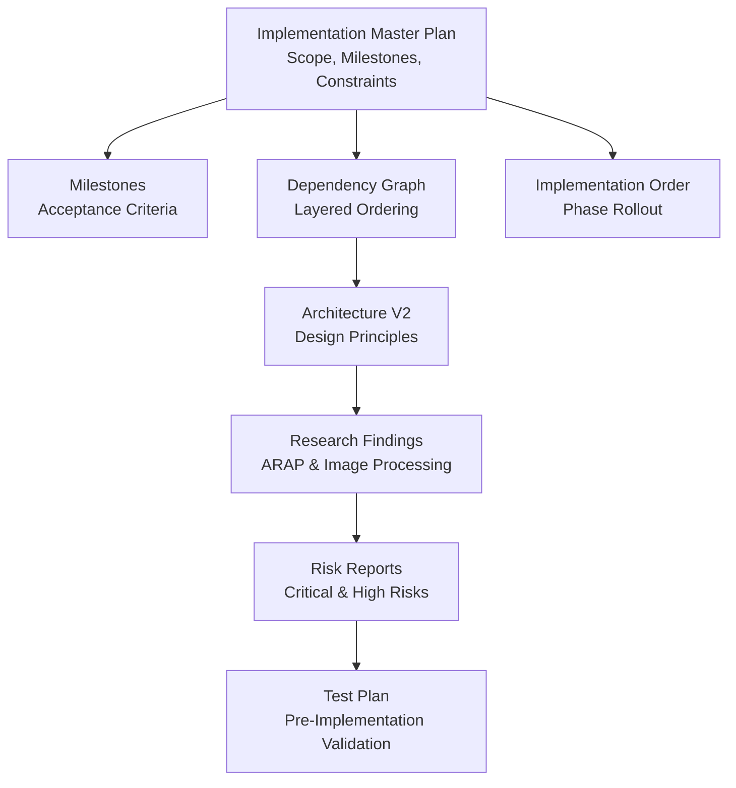
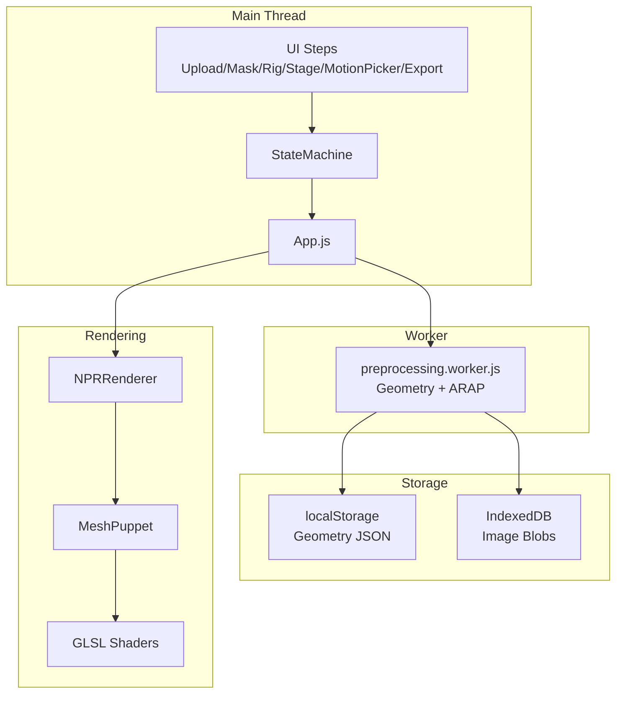
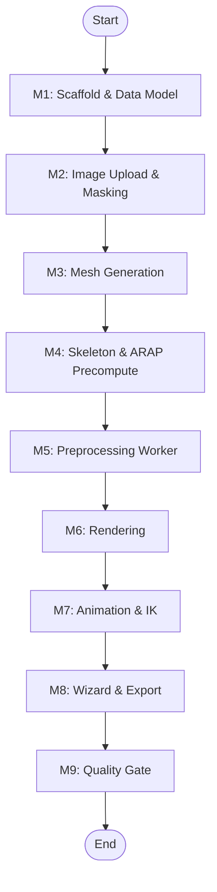
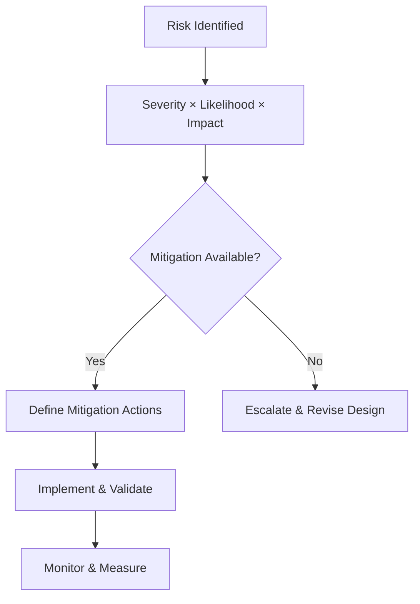
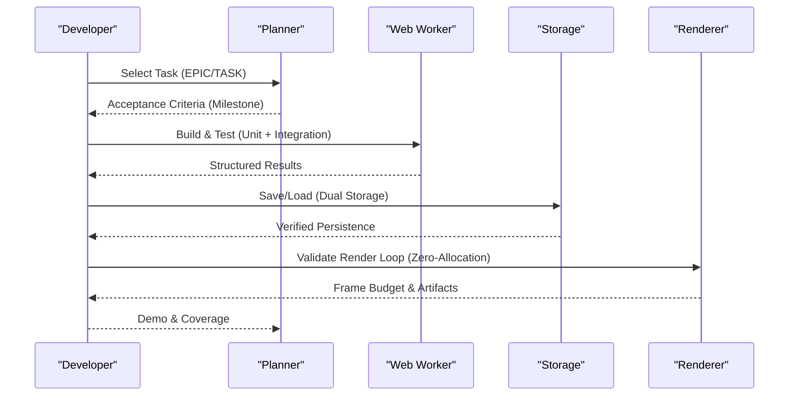
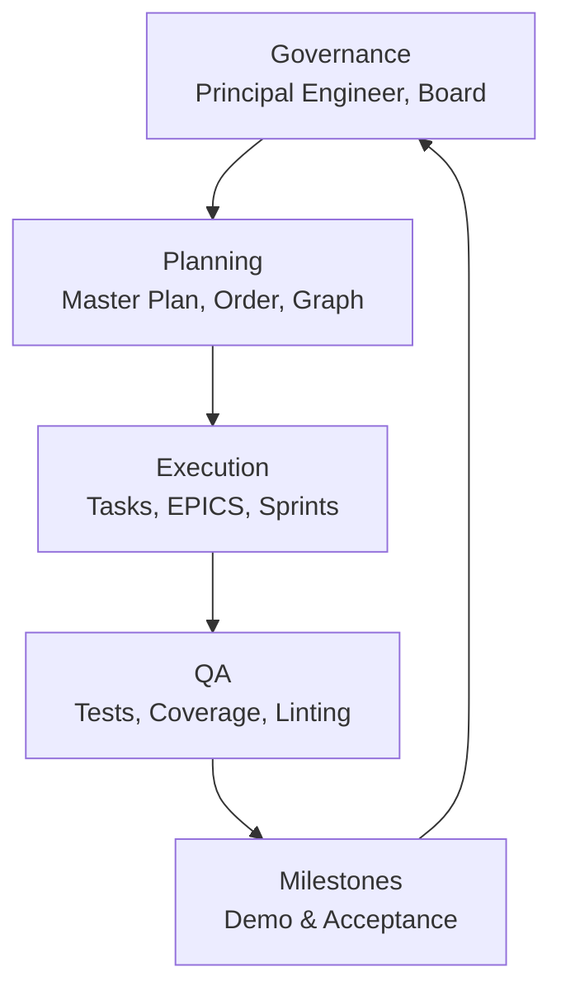
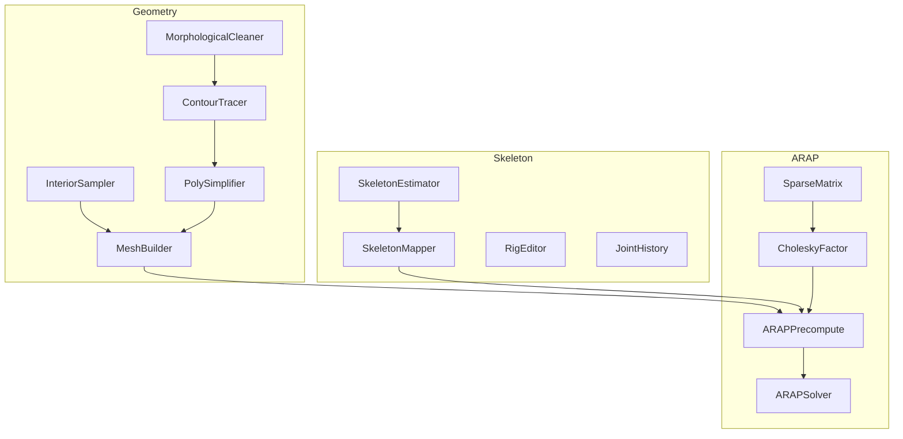

# Development and Implementation

<cite>
**Referenced Files in This Document**
- [implementation_master_plan.md](file://implementation/implementation_master_plan.md)
- [milestones.md](file://implementation/milestones.md)
- [dependency_graph.md](file://implementation/dependency_graph.md)
- [implementation_order.md](file://implementation/implementation_order.md)
- [architecture/README.md](file://architecture/README.md)
- [research/research_master.md](file://research/research_master.md)
- [risks/architecture_risk_report.md](file://risks/architecture_risk_report.md)
- [risks/architecture_critical_risks.md](file://risks/architecture_critical_risks.md)
- [risks/architecture_assumption_log.md](file://risks/architecture_assumption_log.md)
- [risks/architecture_test_plan.md](file://risks/architecture_test_plan.md)
- [EPIC-01-foundation.md](file://implementation/epics/EPIC-01-foundation.md)
- [EPIC-02-storage.md](file://implementation/epics/EPIC-02-storage.md)
- [package.json](file://package.json)
- [vite.config.js](file://vite.config.js)
- [.eslintrc.cjs](file://.eslintrc.cjs)
</cite>

## Table of Contents
1. [Introduction](#introduction)
2. [Project Structure](#project-structure)
3. [Core Components](#core-components)
4. [Architecture Overview](#architecture-overview)
5. [Detailed Component Analysis](#detailed-component-analysis)
6. [Dependency Analysis](#dependency-analysis)
7. [Performance Considerations](#performance-considerations)
8. [Troubleshooting Guide](#troubleshooting-guide)
9. [Conclusion](#conclusion)
10. [Appendices](#appendices)

## Introduction
This document presents the Development and Implementation plan for PaperAlive, focusing on the implementation master plan, development milestones, component dependency relationships, research-driven algorithm improvements, risk assessment and mitigation strategies, practical development workflow, task breakdown, technical debt management, integration of research into production, and project governance with milestone tracking and quality assurance.

## Project Structure
PaperAlive is organized around a layered implementation plan that aligns with a strict dependency graph and milestone-driven delivery. The repository separates architecture documentation, research, risk assessments, and implementation artifacts to ensure traceability and controlled progression.

- Implementation master plan defines scope, milestones, team assignments, and V2 architecture constraints.
- Milestones define demonstrable acceptance criteria for each phase.
- Dependency graph enforces bottom-up, worker-first, and data-before-render sequencing.
- Implementation order prescribes phase-based rollout and parallelization opportunities.
- Architecture documentation provides V2 design rationale and constraints.
- Research documents extract algorithmic foundations for ARAP and image processing.
- Risk reports enumerate, categorize, and mitigate critical and high-risk assumptions.

**Diagram sources**
- [implementation_master_plan.md:1-235](file://implementation/implementation_master_plan.md#L1-L235)
- [milestones.md:1-184](file://implementation/milestones.md#L1-L184)
- [dependency_graph.md:1-298](file://implementation/dependency_graph.md#L1-L298)
- [implementation_order.md:1-216](file://implementation/implementation_order.md#L1-L216)
- [architecture/README.md:1-104](file://architecture/README.md#L1-L104)
- [research/research_master.md:1-536](file://research/research_master.md#L1-L536)
- [risks/architecture_risk_report.md:1-800](file://risks/architecture_risk_report.md#L1-L800)
- [risks/architecture_test_plan.md:1-771](file://risks/architecture_test_plan.md#L1-L771)

**Section sources**
- [implementation_master_plan.md:1-235](file://implementation/implementation_master_plan.md#L1-L235)
- [milestones.md:1-184](file://implementation/milestones.md#L1-L184)
- [dependency_graph.md:1-298](file://implementation/dependency_graph.md#L1-L298)
- [implementation_order.md:1-216](file://implementation/implementation_order.md#L1-L216)
- [architecture/README.md:1-104](file://architecture/README.md#L1-L104)
- [research/research_master.md:1-536](file://research/research_master.md#L1-L536)
- [risks/architecture_risk_report.md:1-800](file://risks/architecture_risk_report.md#L1-L800)
- [risks/architecture_test_plan.md:1-771](file://risks/architecture_test_plan.md#L1-L771)

## Core Components
This section outlines the core components and their roles in the implementation plan, aligned with milestones and constraints.

- Foundation and Scaffold (M1): math utilities, bbox helpers, timer, and CharacterData type definitions.
- Storage Layer (M1): ImageStore (IndexedDB), CharacterStorage (dual storage), VideoExporter (codec detection).
- Image Input Pipeline (M2): ImageLoader, ThresholdEngine, MaskBrush, MaskHistory.
- Geometry Pipeline (M3): MorphologicalCleaner, ContourTracer, PolySimplifier, InteriorSampler, MeshBuilder.
- Skeleton System (M4): SkeletonEstimator, SkeletonMapper, RigEditor, JointHistory.
- ARAP Solver (M4–M7): SparseMatrix, CholeskyFactor, ARAPPrecompute, ARAPSolver.
- Worker Orchestration (M5): preprocessing.worker bundling geometry and ARAP modules.
- Rendering (M6): MeshPuppet, NPRRenderer, shaders.
- Motion System (M7): MotionClipPlayer, IKDragHandler, MotionResolver.
- State Machine (M8): Wizard vs Stage mode transitions, undo routing.
- UI Integration (M8): Upload, Mask, Rig, Stage, MotionPicker, Export panels.
- Testing & Quality (M9): Unit and integration tests, coverage targets.

**Section sources**
- [implementation_master_plan.md:53-235](file://implementation/implementation_master_plan.md#L53-L235)
- [milestones.md:9-184](file://implementation/milestones.md#L9-L184)
- [EPIC-01-foundation.md:1-39](file://implementation/epics/EPIC-01-foundation.md#L1-L39)
- [EPIC-02-storage.md:1-35](file://implementation/epics/EPIC-02-storage.md#L1-L35)

## Architecture Overview
PaperAlive’s V2 architecture emphasizes browser-native, zero-install, zero-ML operation with a strong separation between main-thread UI and worker-based heavy computation. The system enforces zero-allocation render loops, worker-safe modules, structured error returns, and dual storage for geometry and images.

**Diagram sources**
- [architecture/README.md:34-80](file://architecture/README.md#L34-L80)
- [implementation_master_plan.md:121-192](file://implementation/implementation_master_plan.md#L121-L192)
- [dependency_graph.md:129-250](file://implementation/dependency_graph.md#L129-L250)

**Section sources**
- [architecture/README.md:1-104](file://architecture/README.md#L1-L104)
- [implementation_master_plan.md:121-192](file://implementation/implementation_master_plan.md#L121-L192)
- [dependency_graph.md:129-250](file://implementation/dependency_graph.md#L129-L250)

## Detailed Component Analysis

### Implementation Master Plan and Milestones
- The master plan defines scope, module counts, critical path, V2 constraints, and recommended team assignments.
- Milestones specify acceptance criteria for each deliverable, ensuring demonstrable progress.

**Diagram sources**
- [implementation_master_plan.md:195-208](file://implementation/implementation_master_plan.md#L195-L208)
- [milestones.md:9-184](file://implementation/milestones.md#L9-L184)

**Section sources**
- [implementation_master_plan.md:195-235](file://implementation/implementation_master_plan.md#L195-L235)
- [milestones.md:9-184](file://implementation/milestones.md#L9-L184)

### Dependency Graph and Critical Path
- The dependency graph enforces bottom-up construction, worker-first preprocessing, and data-before-render sequencing.
- The critical path identifies sequential dependencies and parallel opportunities.

```mermaid
graph LR
L0["Foundation<br/>math2d, bbox, timer"] --> L1["Types"]
L1 --> L2["Storage Primitives<br/>ImageStore, CharacterStorage, VideoExporter"]
L2 --> L3["Image Processing<br/>ImageLoader, ThresholdEngine, MaskBrush, MaskHistory"]
L3 --> L4["Geometry Pipeline<br/>MorphologicalCleaner → ContourTracer → PolySimplifier → InteriorSampler → MeshBuilder"]
L4 --> L5["Skeleton System<br/>SkeletonEstimator → SkeletonMapper + RigEditor + JointHistory"]
L5 --> L6["ARAP Solver<br/>SparseMatrix → CholeskyFactor → ARAPPrecompute → ARAPSolver"]
L6 --> L7["Worker Orchestration<br/>preprocessing.worker → buildCharacterData"]
L7 --> L8["Shaders"]
L8 --> L9["Rendering<br/>MeshPuppet → NPRRenderer"]
L9 --> L10["Motion<br/>MotionClipPlayer → IKDragHandler → MotionResolver"]
L10 --> L11["State Machine"]
L11 --> L12["UI Steps"]
L12 --> L13["Application Root<br/>App.js → main.js"]
```

**Diagram sources**
- [dependency_graph.md:9-250](file://implementation/dependency_graph.md#L9-L250)

**Section sources**
- [dependency_graph.md:9-298](file://implementation/dependency_graph.md#L9-L298)
- [implementation_order.md:9-216](file://implementation/implementation_order.md#L9-L216)

### Research and Innovation Activities
- ARAP fundamentals: local rigidity cell principle, weighted shape matching, cotangent weights, alternating minimization, factorized Laplace-Beltrami system.
- Image processing pipeline inspired by classical techniques: adaptive thresholding, morphological closing, dilation, flood fill, largest polygon retention.
- Retargeting and motion synthesis: PCA projection plane selection, per-limb independent assignment, 2D ARAP shape manipulation, proportional root motion scaling.

These findings inform algorithmic choices, robustness strategies, and fallback mechanisms in the implementation.

**Section sources**
- [research/research_master.md:6-536](file://research/research_master.md#L6-L536)

### Risk Assessment and Mitigation Strategies
- Critical risks include: localStorage overflow, contour pipeline fragility, main-thread blocking, Cholesky instability, degenerate triangles, outline self-intersection, IK drag constraint mismatch, paper shader cost, preserveDrawingBuffer overhead, and lack of undo/redo.
- Mitigations include: IndexedDB for images, morphological cleanup, Web Worker offloading, cotangent clamping, degenerate triangle filtering, stencil-based outline, dual Cholesky factors, pre-baked paper textures, lazy preserve flag, undo buffers, codec detection, uniqueness enforcement, and pre-allocated workspaces.

**Diagram sources**
- [risks/architecture_risk_report.md:1-800](file://risks/architecture_risk_report.md#L1-L800)
- [risks/architecture_critical_risks.md:1-370](file://risks/architecture_critical_risks.md#L1-L370)

**Section sources**
- [risks/architecture_risk_report.md:1-800](file://risks/architecture_risk_report.md#L1-L800)
- [risks/architecture_critical_risks.md:1-370](file://risks/architecture_critical_risks.md#L1-L370)
- [risks/architecture_assumption_log.md:1-511](file://risks/architecture_assumption_log.md#L1-L511)

### Practical Development Workflow and Task Breakdown
- Phases: Foundation, Storage, Image Input, Geometry, Skeleton, ARAP, Worker Orchestration, Shaders, Rendering, Motion, State Machine, UI Steps, Application Integration.
- Parallelization opportunities: Geometry vs Image Input; ARAP vs Skeleton; Shaders vs ARAP; Rendering vs Motion; UI Steps can be split among team members.
- Team assignments: balanced ownership across EPICS with integration lead responsibilities.

**Diagram sources**
- [implementation_order.md:9-216](file://implementation/implementation_order.md#L9-L216)
- [milestones.md:9-184](file://implementation/milestones.md#L9-L184)
- [implementation_master_plan.md:211-235](file://implementation/implementation_master_plan.md#L211-L235)

**Section sources**
- [implementation_order.md:9-216](file://implementation/implementation_order.md#L9-L216)
- [EPIC-01-foundation.md:1-39](file://implementation/epics/EPIC-01-foundation.md#L1-L39)
- [EPIC-02-storage.md:1-35](file://implementation/epics/EPIC-02-storage.md#L1-L35)

### Technical Debt Management
- Zero-allocation constraint enforced in render loop and solver.
- Worker-safe modules prevent DOM access in preprocessing.
- Structured error returns replace unhandled throws.
- Pre-baked paper textures reduce per-frame cost.
- Pre-allocated workspaces avoid GC pressure.
- Typed arrays replace Map<string,number> lookups in hot paths.

**Section sources**
- [implementation_master_plan.md:121-192](file://implementation/implementation_master_plan.md#L121-L192)
- [risks/architecture_critical_risks.md:307-323](file://risks/architecture_critical_risks.md#L307-L323)

### Integration of Research into Production
- ARAP: cotangent clamping, dual Cholesky, factorized Laplace-Beltrami, alternating minimization.
- Image processing: morphological cleanup, adaptive thresholding, flood fill, largest polygon retention.
- Rendering: stencil-based outline, pre-baked paper textures, painter’s algorithm ordering.

**Section sources**
- [research/research_master.md:6-536](file://research/research_master.md#L6-L536)
- [risks/architecture_risk_report.md:105-113](file://risks/architecture_risk_report.md#L105-L113)

### Project Governance, Milestone Tracking, and QA
- Governance: Principal Engineer role, Architecture Revision Board, explicit constraints, and team assignments.
- Milestone tracking: acceptance criteria validated by tests and demos.
- QA: Vitest with jsdom environment, coverage reporting, ESLint rules, and pre-implementation validation tests.

**Diagram sources**
- [implementation_master_plan.md:3-7](file://implementation/implementation_master_plan.md#L3-L7)
- [implementation_master_plan.md:211-235](file://implementation/implementation_master_plan.md#L211-L235)
- [vite.config.js:12-28](file://vite.config.js#L12-L28)
- [.eslintrc.cjs:1-47](file://.eslintrc.cjs#L1-L47)

**Section sources**
- [implementation_master_plan.md:3-7](file://implementation/implementation_master_plan.md#L3-L7)
- [vite.config.js:12-28](file://vite.config.js#L12-L28)
- [.eslintrc.cjs:1-47](file://.eslintrc.cjs#L1-L47)
- [package.json:1-29](file://package.json#L1-L29)

## Dependency Analysis
The dependency graph reveals tight couplings and decoupling strategies. Geometry and ARAP modules must be worker-safe and validated as pure functions before orchestration. Rendering depends on CharacterData and shaders, while motion depends on pin mapping. UI steps integrate sub-systems and rely on StateMachine transitions.

**Diagram sources**
- [dependency_graph.md:66-126](file://implementation/dependency_graph.md#L66-L126)

**Section sources**
- [dependency_graph.md:66-126](file://implementation/dependency_graph.md#L66-L126)

## Performance Considerations
- Zero-allocation render loop: eliminate new Array/Float32Array/Object in rAF callbacks.
- Frame budget: target < 14ms for idle, up to 16.67ms for 60fps; accounting for recording overhead.
- Paper texture baking: pre-bake to achieve near-zero per-frame cost.
- Workspace reuse: pre-allocate boundary normals and cotangent weights in flat arrays.
- Context configuration: preserveDrawingBuffer false by default, enable only during recording.

**Section sources**
- [implementation_master_plan.md:121-192](file://implementation/implementation_master_plan.md#L121-L192)
- [risks/architecture_test_plan.md:292-340](file://risks/architecture_test_plan.md#L292-L340)
- [risks/architecture_critical_risks.md:174-189](file://risks/architecture_critical_risks.md#L174-L189)

## Troubleshooting Guide
Common issues and remedies:
- Browser freeze during preprocessing: move to Web Worker with Transferable objects and progress events.
- Cholesky failures: clamp cotangent weights and fallback to uniform weights; validate SPD pre-factorization.
- Degenerate triangles: filter triangles with minimum area thresholds and clamp cotangent weights.
- Outline artifacts: switch to stencil-based outline; avoid depth test + alpha discard conflicts.
- localStorage overflow: store images in IndexedDB; serialize only geometry to localStorage.
- Undo/redo missing: implement circular buffers for mask and joint histories.
- WebGL context loss: register context loss/restoration handlers and auto-save CharacterData.

**Section sources**
- [risks/architecture_risk_report.md:354-390](file://risks/architecture_risk_report.md#L354-L390)
- [risks/architecture_risk_report.md:74-94](file://risks/architecture_risk_report.md#L74-L94)
- [risks/architecture_risk_report.md:300-344](file://risks/architecture_risk_report.md#L300-L344)
- [risks/architecture_risk_report.md:416-427](file://risks/architecture_risk_report.md#L416-L427)
- [risks/architecture_risk_report.md:120-141](file://risks/architecture_risk_report.md#L120-L141)
- [risks/architecture_risk_report.md:644-660](file://risks/architecture_risk_report.md#L644-L660)
- [risks/architecture_risk_report.md:565-598](file://risks/architecture_risk_report.md#L565-L598)

## Conclusion
PaperAlive’s implementation plan balances rigorous engineering practices with research-backed algorithms. By enforcing a strict dependency graph, worker-first preprocessing, and zero-allocation render loops, the project mitigates critical risks and ensures robustness. Milestone-driven delivery, comprehensive testing, and governance structures provide clear pathways to a production-ready, browser-native animation system.

## Appendices

### Appendix A: Implementation Rules for Coding Agent
- Read V2 architecture before implementing any module.
- Follow the dependency graph; do not skip layers.
- Write unit tests alongside implementation.
- Use JSDoc for public APIs.
- Avoid console.log in production; use timer.js for debugging.
- Verify worker-safe modules after geometry/ARAP completion.
- No silent failures; report via structured errors or events.
- Do not proceed to the next Epic until the milestone is met.

**Section sources**
- [implementation_master_plan.md:225-235](file://implementation/implementation_master_plan.md#L225-L235)