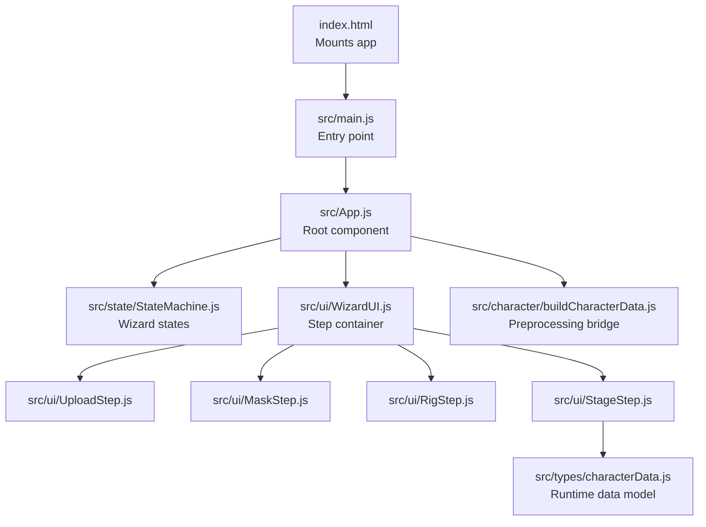
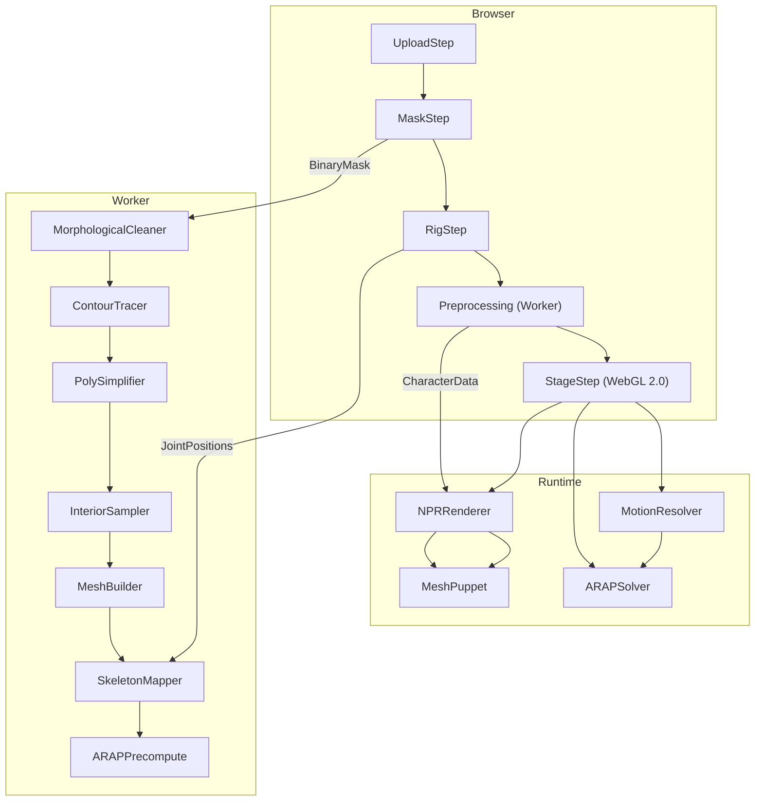
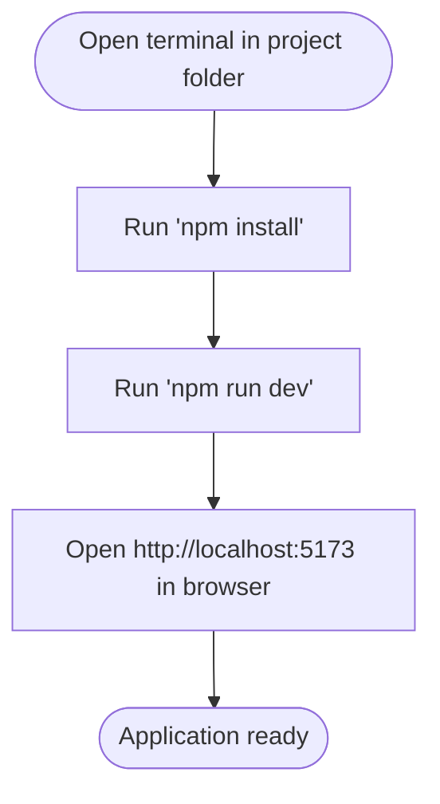
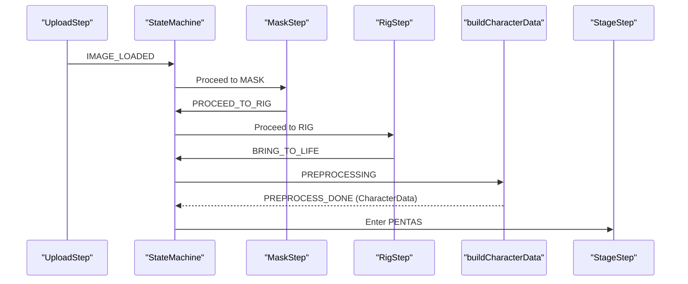
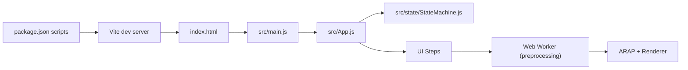

# Getting Started

<cite>
**Referenced Files in This Document**
- [README.md](file://README.md)
- [package.json](file://package.json)
- [index.html](file://index.html)
- [vite.config.js](file://vite.config.js)
- [src/main.js](file://src/main.js)
- [src/App.js](file://src/App.js)
- [src/state/StateMachine.js](file://src/state/StateMachine.js)
- [src/ui/WizardUI.js](file://src/ui/WizardUI.js)
- [src/ui/UploadStep.js](file://src/ui/UploadStep.js)
- [src/ui/MaskStep.js](file://src/ui/MaskStep.js)
- [src/ui/RigStep.js](file://src/ui/RigStep.js)
- [src/ui/StageStep.js](file://src/ui/StageStep.js)
- [src/character/buildCharacterData.js](file://src/character/buildCharacterData.js)
- [src/types/characterData.js](file://src/types/characterData.js)
- [architecture/README.md](file://architecture/README.md)
- [architecture/dataflow.md](file://architecture/dataflow.md)
</cite>

## Table of Contents
1. [Introduction](#introduction)
2. [Project Structure](#project-structure)
3. [Core Components](#core-components)
4. [Architecture Overview](#architecture-overview)
5. [Detailed Component Analysis](#detailed-component-analysis)
6. [Dependency Analysis](#dependency-analysis)
7. [Performance Considerations](#performance-considerations)
8. [Troubleshooting Guide](#troubleshooting-guide)
9. [Conclusion](#conclusion)

## Introduction
PaperAlive is a browser-native 2D character animation tool that brings still images to life using As-Rigid-As-Possible (ARAP) deformation technology. It guides you through a four-phase workflow: image upload, masking (background removal), rigging (skeleton setup), and live animation with optional video export. The application runs entirely in the browser with no server or installation required.

Prerequisites:
- Node.js (recommended version 16 or newer)
- A modern browser supporting WebGL 2.0 (Chrome, Firefox, Edge, or latest Safari)

## Project Structure
At a high level, PaperAlive consists of:
- An HTML entry point that mounts the application into a DOM container
- A root application component that orchestrates state and UI steps
- A state machine that defines the four-phase workflow
- UI step components for each phase
- Rendering and animation systems powered by WebGL 2.0
- A preprocessing pipeline executed in a Web Worker for ARAP computation

**Diagram sources**
- [index.html:1-15](file://index.html#L1-L15)
- [src/main.js:1-17](file://src/main.js#L1-L17)
- [src/App.js:1-505](file://src/App.js#L1-L505)
- [src/state/StateMachine.js:1-477](file://src/state/StateMachine.js#L1-L477)
- [src/ui/WizardUI.js:1-185](file://src/ui/WizardUI.js#L1-L185)
- [src/ui/UploadStep.js:1-171](file://src/ui/UploadStep.js#L1-L171)
- [src/ui/MaskStep.js:1-409](file://src/ui/MaskStep.js#L1-L409)
- [src/ui/RigStep.js:1-358](file://src/ui/RigStep.js#L1-L358)
- [src/ui/StageStep.js:1-428](file://src/ui/StageStep.js#L1-L428)
- [src/character/buildCharacterData.js:1-175](file://src/character/buildCharacterData.js#L1-L175)
- [src/types/characterData.js:1-254](file://src/types/characterData.js#L1-L254)

**Section sources**
- [README.md:1-57](file://README.md#L1-L57)
- [index.html:1-15](file://index.html#L1-L15)
- [src/main.js:1-17](file://src/main.js#L1-L17)
- [src/App.js:1-505](file://src/App.js#L1-L505)
- [src/state/StateMachine.js:1-477](file://src/state/StateMachine.js#L1-L477)
- [src/ui/WizardUI.js:1-185](file://src/ui/WizardUI.js#L1-L185)

## Core Components
- Entry point and bootstrap: The HTML page creates a root container and loads the module entry script, which instantiates the root application component and initializes it.
- Root application: Orchestrates state transitions, renders the current step, and wires UI components to the state machine.
- State machine: Defines the four-phase wizard workflow and enforces guard conditions for transitions.
- UI steps: Four distinct step components for upload, masking, rigging, and stage (animation).
- Preprocessing bridge: Manages the Web Worker lifecycle and reconstructs runtime data structures.
- Runtime data model: Central CharacterData structure used across rendering, motion, and solver systems.

**Section sources**
- [src/main.js:1-17](file://src/main.js#L1-L17)
- [src/App.js:1-505](file://src/App.js#L1-L505)
- [src/state/StateMachine.js:1-477](file://src/state/StateMachine.js#L1-L477)
- [src/ui/WizardUI.js:1-185](file://src/ui/WizardUI.js#L1-L185)
- [src/character/buildCharacterData.js:1-175](file://src/character/buildCharacterData.js#L1-L175)
- [src/types/characterData.js:1-254](file://src/types/characterData.js#L1-L254)

## Architecture Overview
PaperAlive’s architecture is centered around a wizard-driven workflow and a real-time rendering pipeline:
- The wizard UI sequences users through Upload → Mask → Rig → Preprocessing → Stage.
- Preprocessing runs in a Web Worker to compute ARAP data structures without blocking the main thread.
- The Stage step initializes a WebGL 2.0 renderer, attaches a mesh puppet, resolves motion, solves ARAP, and draws frames.

**Diagram sources**
- [src/ui/UploadStep.js:1-171](file://src/ui/UploadStep.js#L1-L171)
- [src/ui/MaskStep.js:1-409](file://src/ui/MaskStep.js#L1-L409)
- [src/ui/RigStep.js:1-358](file://src/ui/RigStep.js#L1-L358)
- [src/character/buildCharacterData.js:1-175](file://src/character/buildCharacterData.js#L1-L175)
- [src/ui/StageStep.js:1-428](file://src/ui/StageStep.js#L1-L428)
- [architecture/README.md:34-67](file://architecture/README.md#L34-L67)
- [architecture/dataflow.md:17-112](file://architecture/dataflow.md#L17-L112)

## Detailed Component Analysis

### Installation and Setup
- Install dependencies using npm.
- Start the Vite development server.
- Open the provided local URL in a WebGL 2.0-capable browser.

**Diagram sources**
- [README.md:10-28](file://README.md#L10-L28)
- [package.json:7-14](file://package.json#L7-L14)
- [vite.config.js:1-29](file://vite.config.js#L1-L29)

**Section sources**
- [README.md:10-28](file://README.md#L10-L28)
- [package.json:1-29](file://package.json#L1-L29)
- [vite.config.js:1-29](file://vite.config.js#L1-L29)

### Running the Application
- The development server is configured via Vite and launched with the dev script.
- The HTML entry point mounts the application into the DOM and loads the module entry script.

**Section sources**
- [README.md:19-28](file://README.md#L19-L28)
- [index.html:1-15](file://index.html#L1-L15)
- [src/main.js:1-17](file://src/main.js#L1-L17)

### Four-Phase Workflow
- Phase 1: Upload
  - Users select or paste an image. Supported formats include PNG, JPEG, WebP, and GIF, with a maximum file size of 10 MB.
  - On successful load, the state machine proceeds to the Mask step.
- Phase 2: Mask
  - A threshold slider removes backgrounds automatically.
  - Manual touch-up is supported via a brush with “Add” and “Erase” modes.
  - Undo/redo history is available for mask edits.
- Phase 3: Rig
  - Choose a character type: Humanoid or Freeform.
  - Adjust joint placements; undo/redo is available for joint edits.
  - Click “Bring to Life!” to start preprocessing.
- Phase 4: Stage (Animation)
  - Drag joints manually or play motion clips (Idle, Walk, Run, Jump, Wave, Dance).
  - Record animations to video and download the result.

**Diagram sources**
- [src/ui/UploadStep.js:1-171](file://src/ui/UploadStep.js#L1-L171)
- [src/ui/MaskStep.js:1-409](file://src/ui/MaskStep.js#L1-L409)
- [src/ui/RigStep.js:1-358](file://src/ui/RigStep.js#L1-L358)
- [src/character/buildCharacterData.js:1-175](file://src/character/buildCharacterData.js#L1-L175)
- [src/ui/StageStep.js:1-428](file://src/ui/StageStep.js#L1-L428)
- [src/state/StateMachine.js:56-82](file://src/state/StateMachine.js#L56-L82)

**Section sources**
- [README.md:30-54](file://README.md#L30-L54)
- [src/ui/UploadStep.js:1-171](file://src/ui/UploadStep.js#L1-L171)
- [src/ui/MaskStep.js:1-409](file://src/ui/MaskStep.js#L1-L409)
- [src/ui/RigStep.js:1-358](file://src/ui/RigStep.js#L1-L358)
- [src/ui/StageStep.js:1-428](file://src/ui/StageStep.js#L1-L428)
- [src/state/StateMachine.js:1-477](file://src/state/StateMachine.js#L1-L477)

### Practical Example: From Photo to Animated Character
- Prepare a photo on a white or transparent background with minimal shadows.
- Upload the image; adjust the threshold until the background is removed.
- Use the brush to refine edges if needed; confirm with “Proceed to Rig.”
- Select Humanoid for human-like characters or Freeform for abstract shapes; place joints by dragging.
- Click “Bring to Life!” and wait for preprocessing to finish.
- In the Stage step, choose a motion clip or drag joints manually; press Play to animate.
- Optionally record and download a video of the animation.

**Section sources**
- [README.md:30-54](file://README.md#L30-L54)
- [src/ui/UploadStep.js:1-171](file://src/ui/UploadStep.js#L1-L171)
- [src/ui/MaskStep.js:1-409](file://src/ui/MaskStep.js#L1-L409)
- [src/ui/RigStep.js:1-358](file://src/ui/RigStep.js#L1-L358)
- [src/ui/StageStep.js:1-428](file://src/ui/StageStep.js#L1-L428)

## Dependency Analysis
- The application uses Vite for development and build, with tests configured via Vitest under the same configuration.
- The runtime depends on WebGL 2.0 capabilities and IndexedDB for storing image blobs.
- The preprocessing pipeline is isolated in a Web Worker to keep the main thread responsive.

**Diagram sources**
- [package.json:1-29](file://package.json#L1-L29)
- [vite.config.js:1-29](file://vite.config.js#L1-L29)
- [index.html:1-15](file://index.html#L1-L15)
- [src/main.js:1-17](file://src/main.js#L1-L17)
- [src/App.js:1-505](file://src/App.js#L1-L505)
- [src/state/StateMachine.js:1-477](file://src/state/StateMachine.js#L1-L477)

**Section sources**
- [package.json:1-29](file://package.json#L1-L29)
- [vite.config.js:1-29](file://vite.config.js#L1-L29)
- [index.html:1-15](file://index.html#L1-L15)
- [src/main.js:1-17](file://src/main.js#L1-L17)
- [src/App.js:1-505](file://src/App.js#L1-L505)
- [src/state/StateMachine.js:1-477](file://src/state/StateMachine.js#L1-L477)

## Performance Considerations
- Preprocessing runs in a Web Worker to avoid blocking the UI.
- The rendering pipeline targets 60 FPS with zero-allocation constraints in the render loop.
- Vertex budget constraints and dual Cholesky factorization help maintain performance across devices.

[No sources needed since this section provides general guidance]

## Troubleshooting Guide
- WebGL initialization fails: Ensure your browser supports WebGL 2.0 and that the context is created with stencil enabled.
- Worker crashes or preprocessing errors: The system reports structured error codes; review the error message and affected step.
- Undo/redo not working: Verify you are in the Mask or Rig step where undo/redo is supported.

**Section sources**
- [src/ui/StageStep.js:154-207](file://src/ui/StageStep.js#L154-L207)
- [src/character/buildCharacterData.js:111-136](file://src/character/buildCharacterData.js#L111-L136)
- [src/state/StateMachine.js:389-445](file://src/state/StateMachine.js#L389-L445)

## Conclusion
PaperAlive enables quick character animation in the browser using ARAP deformation. By following the four-phase workflow—upload, mask, rig, and stage—you can transform photos into animated characters and export videos. The architecture separates heavy computations into a Web Worker and uses WebGL 2.0 for smooth real-time rendering, ensuring a responsive and efficient experience.