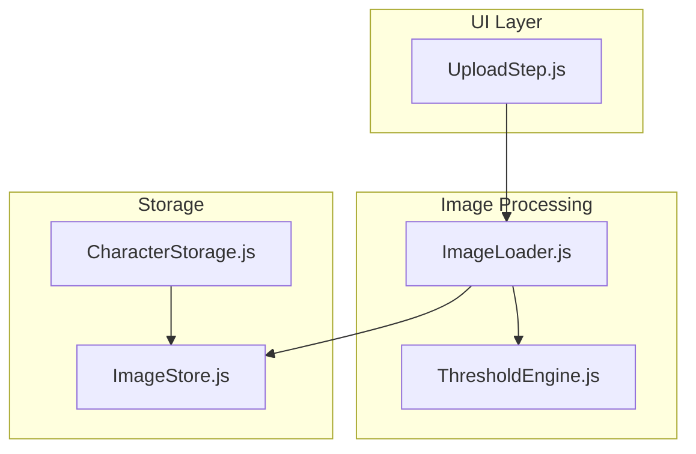
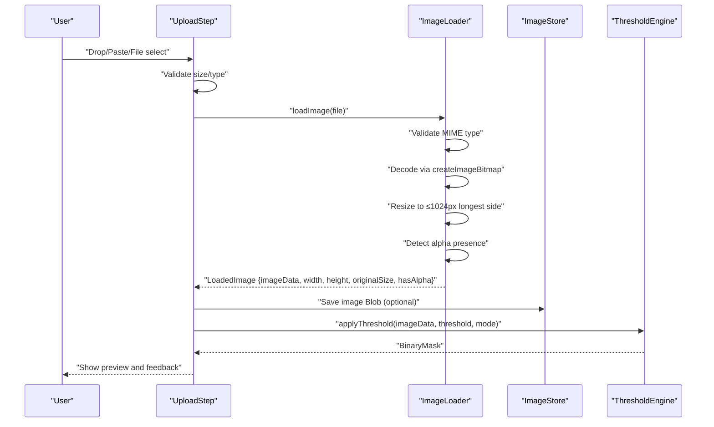
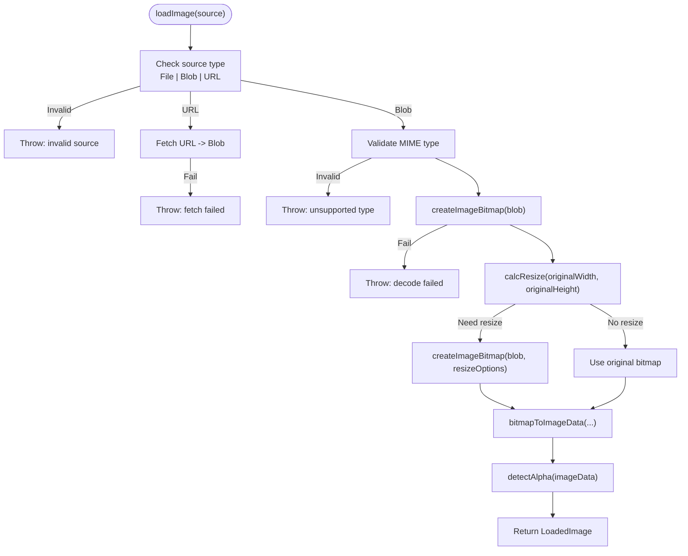
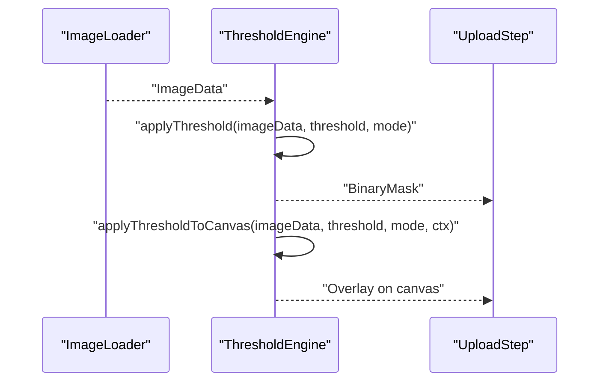
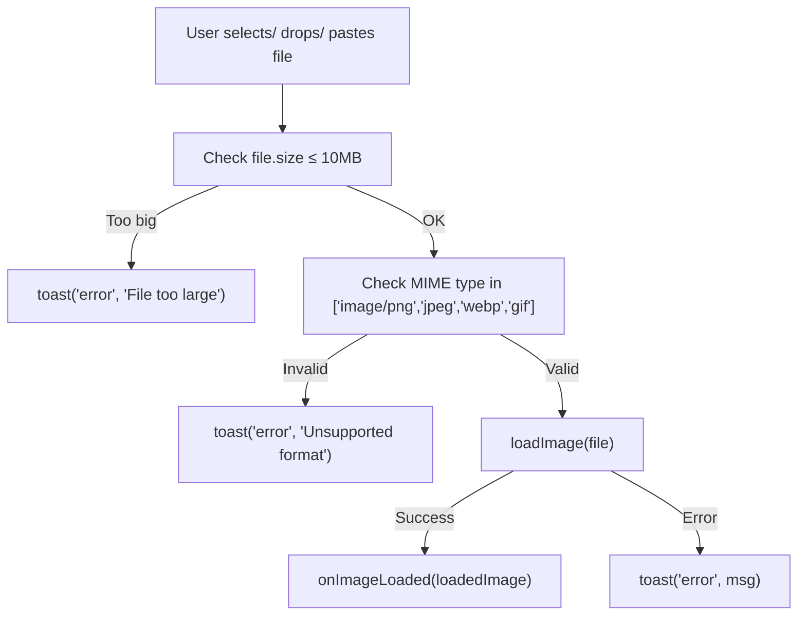
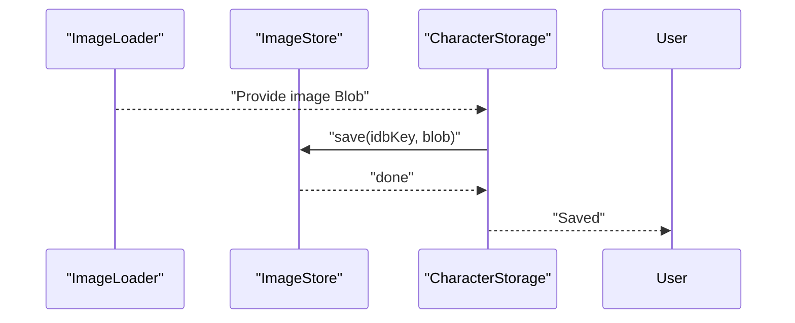
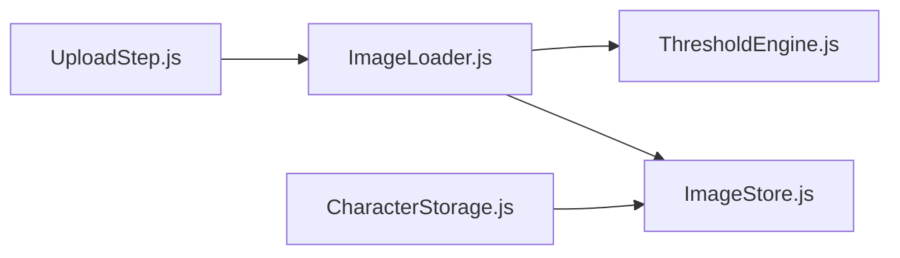

# Image Loading and Validation

<cite>
**Referenced Files in This Document**
- [ImageLoader.js](file://src/image/ImageLoader.js)
- [ThresholdEngine.js](file://src/image/ThresholdEngine.js)
- [UploadStep.js](file://src/ui/UploadStep.js)
- [ImageStore.js](file://src/io/ImageStore.js)
- [CharacterStorage.js](file://src/io/CharacterStorage.js)
- [ImageLoader.test.js](file://src/image/ImageLoader.test.js)
- [characterData.js](file://src/types/characterData.js)
- [dataflow.md](file://architecture/dataflow.md)
- [module_design.md](file://architecture/module_design.md)
- [toast.js](file://src/ui/toast.js)
</cite>

## Table of Contents
1. [Introduction](#introduction)
2. [Project Structure](#project-structure)
3. [Core Components](#core-components)
4. [Architecture Overview](#architecture-overview)
5. [Detailed Component Analysis](#detailed-component-analysis)
6. [Dependency Analysis](#dependency-analysis)
7. [Performance Considerations](#performance-considerations)
8. [Troubleshooting Guide](#troubleshooting-guide)
9. [Conclusion](#conclusion)

## Introduction
This document explains the Image Loading and Validation system that powers the PaperAlive application. It focuses on how images are accepted from user uploads, validated for format and size, decoded and resized efficiently, and prepared for downstream processing. It also details the integration with the Threshold Engine for converting images into masks, and how validation feedback is surfaced to users. Practical examples illustrate supported formats, resolution limits, and error recovery strategies. Finally, it addresses performance considerations for large images and provides troubleshooting guidance for common loading issues.

## Project Structure
The image loading and validation pipeline spans several modules:
- UI layer: UploadStep handles user interactions and initial validation (size/type).
- Image loader: Decodes, validates, resizes, and prepares ImageData.
- Threshold engine: Converts ImageData into BinaryMask using alpha or luminance thresholds.
- Storage: Saves images to IndexedDB and coordinates with dual-storage for Characters.

**Diagram sources**
- [UploadStep.js:1-171](file://src/ui/UploadStep.js#L1-L171)
- [ImageLoader.js:1-160](file://src/image/ImageLoader.js#L1-L160)
- [ThresholdEngine.js:1-96](file://src/image/ThresholdEngine.js#L1-L96)
- [ImageStore.js:1-196](file://src/io/ImageStore.js#L1-L196)
- [CharacterStorage.js:1-298](file://src/io/CharacterStorage.js#L1-L298)

**Section sources**
- [module_design.md:224-243](file://architecture/module_design.md#L224-L243)
- [dataflow.md:19-112](file://architecture/dataflow.md#L19-L112)

## Core Components
- ImageLoader: Validates source type, decodes images, resizes to a maximum dimension, detects alpha presence, and returns a standardized LoadedImage object.
- ThresholdEngine: Applies alpha or luminance thresholding to produce a BinaryMask for segmentation.
- UploadStep: Provides UI for drag-drop, file picker, clipboard paste, and enforces client-side size/type constraints before delegating to ImageLoader.
- ImageStore and CharacterStorage: Persist images and integrate with dual-storage strategy.

Key capabilities:
- Supported formats: PNG, JPEG, WebP, GIF (first frame only).
- Resolution limit: Longest side ≤ 1024px, preserving aspect ratio.
- Quality: High-quality resize via createImageBitmap with resize options.
- Alpha detection: Determines whether the source image has transparency.
- Feedback: User notifications via toast messages for errors and warnings.

**Section sources**
- [ImageLoader.js:5-25](file://src/image/ImageLoader.js#L5-L25)
- [ImageLoader.js:13,35-45](file://src/image/ImageLoader.js#L13,L35-L45)
- [ImageLoader.js:103-130](file://src/image/ImageLoader.js#L103-L130)
- [UploadStep.js:12,141-145](file://src/ui/UploadStep.js#L12,L141-L145)
- [ThresholdEngine.js:23-36](file://src/image/ThresholdEngine.js#L23-L36)

## Architecture Overview
The image loading workflow integrates UI, decoding, validation, and storage:

**Diagram sources**
- [UploadStep.js:133-155](file://src/ui/UploadStep.js#L133-L155)
- [ImageLoader.js:72-144](file://src/image/ImageLoader.js#L72-L144)
- [ImageStore.js:79-96](file://src/io/ImageStore.js#L79-L96)
- [ThresholdEngine.js:23-36](file://src/image/ThresholdEngine.js#L23-L36)

## Detailed Component Analysis

### ImageLoader Implementation
Responsibilities:
- Accept File, Blob, or URL string.
- Validate MIME type against allowed set.
- Decode using createImageBitmap.
- Resize to preserve aspect ratio with longest side ≤ 1024px.
- Convert to ImageData via OffscreenCanvas.
- Detect alpha channel presence.
- Return LoadedImage with metadata.

Validation and constraints:
- Allowed types: PNG, JPEG, WebP, GIF.
- Maximum dimension: 1024px longest side.
- Alpha detection: Iterates over ImageData alpha channel.

Error handling:
- Throws descriptive errors for unsupported sources, invalid types, fetch failures, and decode errors.

Integration points:
- Used by UploadStep to prepare images for thresholding.
- Produces LoadedImage compatible with downstream modules.

**Diagram sources**
- [ImageLoader.js:72-144](file://src/image/ImageLoader.js#L72-L144)
- [ImageLoader.js:29-45](file://src/image/ImageLoader.js#L29-L45)
- [ImageLoader.js:154-159](file://src/image/ImageLoader.js#L154-L159)

**Section sources**
- [ImageLoader.js:5-25](file://src/image/ImageLoader.js#L5-L25)
- [ImageLoader.js:72-144](file://src/image/ImageLoader.js#L72-L144)
- [ImageLoader.test.js:64-116](file://src/image/ImageLoader.test.js#L64-L116)
- [ImageLoader.test.js:120-202](file://src/image/ImageLoader.test.js#L120-L202)
- [ImageLoader.test.js:206-223](file://src/image/ImageLoader.test.js#L206-L223)
- [ImageLoader.test.js:227-247](file://src/image/ImageLoader.test.js#L227-L247)

### ThresholdEngine Integration
Responsibilities:
- Convert ImageData to BinaryMask using either alpha-based or luminance-based thresholding.
- Provide a preview overlay on a 2D canvas for visual feedback.

Workflow:
- Receives ImageData, threshold value (0–255), and mode ("alpha" or "luminance").
- Produces BinaryMask and optional canvas overlay.

Integration with ImageLoader:
- ImageLoader produces ImageData after decoding and resizing.
- ThresholdEngine consumes ImageData to generate masks for segmentation.

**Diagram sources**
- [ImageLoader.js:116-130](file://src/image/ImageLoader.js#L116-L130)
- [ThresholdEngine.js:23-36](file://src/image/ThresholdEngine.js#L23-L36)
- [ThresholdEngine.js:75-95](file://src/image/ThresholdEngine.js#L75-L95)

**Section sources**
- [ThresholdEngine.js:23-36](file://src/image/ThresholdEngine.js#L23-L36)
- [ThresholdEngine.js:75-95](file://src/image/ThresholdEngine.js#L75-L95)

### UploadStep: User Interaction and Validation
Responsibilities:
- Provides drag-drop, file picker, and clipboard paste UX.
- Enforces client-side constraints: max file size (10 MB) and allowed MIME types.
- Delegates to ImageLoader for decoding and validation.
- Displays user feedback via toast notifications.

Error handling:
- Rejects oversized files and unsupported types early.
- Catches and surfaces ImageLoader errors to the user.

**Diagram sources**
- [UploadStep.js:133-155](file://src/ui/UploadStep.js#L133-L155)
- [toast.js:57-85](file://src/ui/toast.js#L57-L85)

**Section sources**
- [UploadStep.js:12,141-145](file://src/ui/UploadStep.js#L12,L141-L145)
- [UploadStep.js:133-155](file://src/ui/UploadStep.js#L133-L155)
- [toast.js:57-85](file://src/ui/toast.js#L57-L85)

### Storage Integration
- ImageStore persists image Blobs in IndexedDB under a stable key derived from the character data.
- CharacterStorage coordinates saving/loading of geometry JSON to localStorage and image Blobs to IndexedDB.
- Estimates storage usage and warns when available quota is low.

**Diagram sources**
- [ImageStore.js:79-96](file://src/io/ImageStore.js#L79-L96)
- [CharacterStorage.js:179-228](file://src/io/CharacterStorage.js#L179-L228)

**Section sources**
- [ImageStore.js:79-96](file://src/io/ImageStore.js#L79-L96)
- [CharacterStorage.js:179-228](file://src/io/CharacterStorage.js#L179-L228)

## Dependency Analysis
- UploadStep depends on ImageLoader for decoding and validation.
- ImageLoader depends on browser APIs (createImageBitmap, OffscreenCanvas) and returns LoadedImage.
- ThresholdEngine consumes ImageData from ImageLoader to produce BinaryMask.
- ImageStore and CharacterStorage depend on ImageLoader’s output for persistence.

**Diagram sources**
- [UploadStep.js:8](file://src/ui/UploadStep.js#L8)
- [ImageLoader.js:103-130](file://src/image/ImageLoader.js#L103-L130)
- [ThresholdEngine.js:23-36](file://src/image/ThresholdEngine.js#L23-L36)
- [ImageStore.js:15](file://src/io/ImageStore.js#L15)
- [CharacterStorage.js:15](file://src/io/CharacterStorage.js#L15)

**Section sources**
- [module_design.md:224-243](file://architecture/module_design.md#L224-L243)
- [dataflow.md:118-141](file://architecture/dataflow.md#L118-L141)

## Performance Considerations
- Decoding and resizing: createImageBitmap with resize options performs efficient GPU-accelerated decoding and scaling, minimizing CPU overhead.
- Memory footprint: Images are resized to a maximum of 1024×1024 pixels, limiting memory usage for ImageData and subsequent processing.
- Alpha detection: Single pass over ImageData alpha channel is O(W×H).
- Canvas conversion: OffscreenCanvas draw and getImageData are efficient for pixel access.
- Large files: Client-side size limit (10 MB) prevents excessive memory pressure; server-side limits may also apply depending on deployment.

Practical tips:
- Prefer modern formats (PNG/WebP) for transparency and compression.
- Avoid extremely large source images to reduce decode time and memory.
- Use high-quality resize to minimize aliasing artifacts in downstream segmentation.

[No sources needed since this section provides general guidance]

## Troubleshooting Guide
Common issues and resolutions:
- Unsupported file type:
  - Symptom: Error indicating unsupported MIME type.
  - Cause: File type not in allowed set.
  - Resolution: Use PNG, JPEG, WebP, or GIF.
- Null or undefined source:
  - Symptom: Error stating no valid image source.
  - Cause: Clipboard paste with no file or invalid input.
  - Resolution: Ensure a valid File object is passed; handle null/undefined gracefully.
- URL fetch failure:
  - Symptom: Error fetching image from URL.
  - Cause: Network issues or invalid URL.
  - Resolution: Verify URL and network connectivity.
- Decode failure:
  - Symptom: Error during image decode.
  - Cause: Corrupted or unsupported image data.
  - Resolution: Validate image integrity; re-export from trusted source.
- Oversized file:
  - Symptom: Toast indicates file too large.
  - Cause: File exceeds 10 MB limit.
  - Resolution: Compress or resize image before upload.
- GIF animation:
  - Symptom: Animation not preserved.
  - Cause: Only first frame is decoded.
  - Resolution: Use static frames or convert to video if animation is required.

User feedback:
- UploadStep displays toast notifications for errors and warnings.
- ThresholdEngine preview overlay helps validate threshold settings visually.

**Section sources**
- [ImageLoader.js:74-108](file://src/image/ImageLoader.js#L74-L108)
- [UploadStep.js:135-154](file://src/ui/UploadStep.js#L135-L154)
- [toast.js:57-85](file://src/ui/toast.js#L57-L85)

## Conclusion
The Image Loading and Validation system provides a robust, user-friendly pathway from user upload to ready-to-process image data. It enforces strict format and size constraints, performs efficient decoding and resizing, and integrates seamlessly with the Threshold Engine for mask creation. The UI layer ensures immediate feedback, while storage modules enable persistent character assets. Together, these components deliver a scalable and accessible pipeline for image-based character creation.