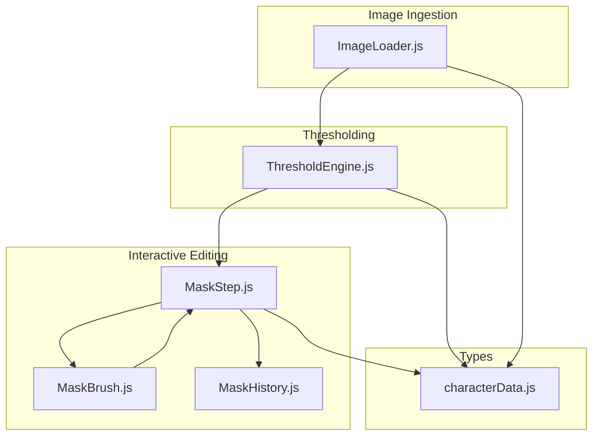
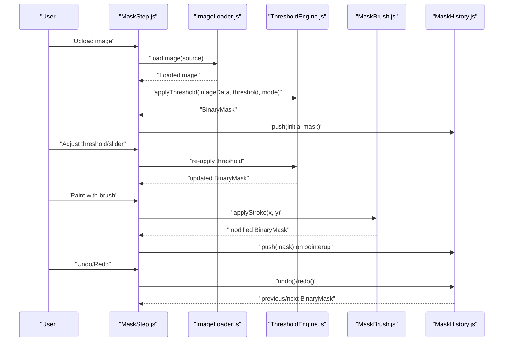
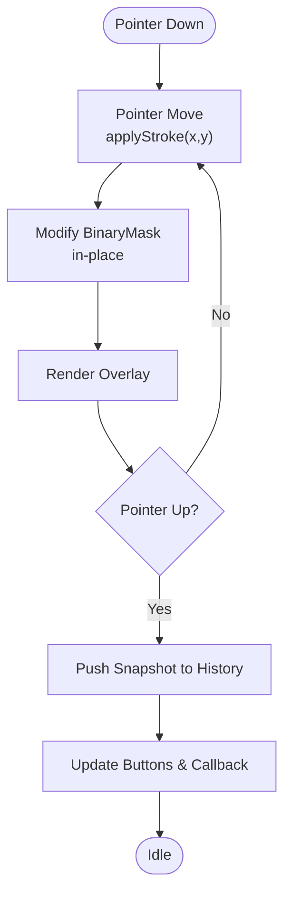
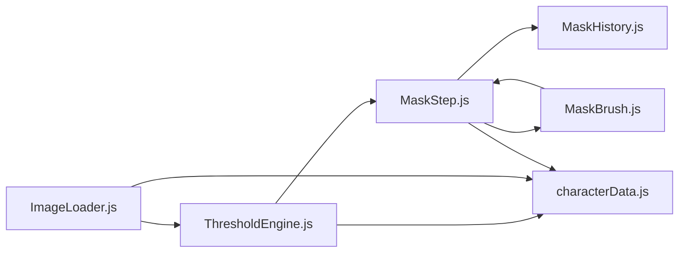

# Image Processing Pipeline

<cite>
**Referenced Files in This Document**
- [ImageLoader.js](file://src/image/ImageLoader.js)
- [ThresholdEngine.js](file://src/image/ThresholdEngine.js)
- [MaskBrush.js](file://src/image/MaskBrush.js)
- [MaskHistory.js](file://src/history/MaskHistory.js)
- [MaskStep.js](file://src/ui/MaskStep.js)
- [characterData.js](file://src/types/characterData.js)
- [module_design.md](file://architecture/module_design.md)
- [dataflow.md](file://architecture/dataflow.md)
- [ImageLoader.test.js](file://src/image/ImageLoader.test.js)
- [ThresholdEngine.test.js](file://src/image/ThresholdEngine.test.js)
- [MaskBrush.test.js](file://src/image/MaskBrush.test.js)
- [MaskHistory.test.js](file://src/history/MaskHistory.test.js)
</cite>

## Table of Contents
1. [Introduction](#introduction)
2. [Project Structure](#project-structure)
3. [Core Components](#core-components)
4. [Architecture Overview](#architecture-overview)
5. [Detailed Component Analysis](#detailed-component-analysis)
6. [Dependency Analysis](#dependency-analysis)
7. [Performance Considerations](#performance-considerations)
8. [Troubleshooting Guide](#troubleshooting-guide)
9. [Conclusion](#conclusion)

## Introduction
This document explains the Image Processing Pipeline for PaperAlive, focusing on image loading, threshold-based mask generation, interactive brush editing, and undo/redo history. It covers:
- ImageLoader: validation, decoding, resizing, and alpha detection
- ThresholdEngine: automatic background removal and alpha mask creation
- Interactive mask editing: brush tools, painting operations, and history tracking
- MaskHistory: circular buffer for undo/redo
- Practical examples and performance/memory guidance

## Project Structure
The image processing pipeline spans several modules:
- Image ingestion and preparation: ImageLoader
- Threshold-based mask creation: ThresholdEngine
- Interactive editing: MaskBrush and MaskStep UI
- History management: MaskHistory
- Shared data types: characterData.js
- Architecture docs: module_design.md and dataflow.md

**Diagram sources**
- [ImageLoader.js:1-160](file://src/image/ImageLoader.js#L1-L160)
- [ThresholdEngine.js:1-96](file://src/image/ThresholdEngine.js#L1-L96)
- [MaskStep.js:1-409](file://src/ui/MaskStep.js#L1-L409)
- [MaskBrush.js:1-96](file://src/image/MaskBrush.js#L1-L96)
- [MaskHistory.js:1-121](file://src/history/MaskHistory.js#L1-L121)
- [characterData.js:1-254](file://src/types/characterData.js#L1-L254)

**Section sources**
- [module_design.md:224-266](file://architecture/module_design.md#L224-L266)
- [dataflow.md:17-112](file://architecture/dataflow.md#L17-L112)

## Core Components
- ImageLoader: Validates input sources, decodes images, resizes to a maximum dimension preserving aspect ratio, detects alpha presence, and returns a typed LoadedImage object.
- ThresholdEngine: Converts ImageData to a BinaryMask using either alpha-channel thresholding or luminance thresholding, and supports a preview overlay.
- MaskBrush: Performs in-place painting strokes on a BinaryMask with configurable radius and mode ("add" or "erase").
- MaskHistory: Circular buffer storing deep-copied snapshots of BinaryMask for undo/redo with configurable capacity.
- MaskStep UI: Orchestrates thresholding, brush editing, undo/redo, and preview rendering.

**Section sources**
- [ImageLoader.js:62-144](file://src/image/ImageLoader.js#L62-L144)
- [ThresholdEngine.js:15-95](file://src/image/ThresholdEngine.js#L15-L95)
- [MaskBrush.js:11-95](file://src/image/MaskBrush.js#L11-L95)
- [MaskHistory.js:14-120](file://src/history/MaskHistory.js#L14-L120)
- [MaskStep.js:15-78](file://src/ui/MaskStep.js#L15-L78)

## Architecture Overview
The pipeline transforms raw image input into a refined BinaryMask used downstream for mesh building and skeleton estimation.

**Diagram sources**
- [MaskStep.js:68-78](file://src/ui/MaskStep.js#L68-L78)
- [MaskStep.js:114-125](file://src/ui/MaskStep.js#L114-L125)
- [MaskStep.js:298-333](file://src/ui/MaskStep.js#L298-L333)
- [MaskStep.js:338-361](file://src/ui/MaskStep.js#L338-L361)
- [ImageLoader.js:72-144](file://src/image/ImageLoader.js#L72-L144)
- [ThresholdEngine.js:23-36](file://src/image/ThresholdEngine.js#L23-L36)
- [MaskBrush.js:53-74](file://src/image/MaskBrush.js#L53-L74)
- [MaskHistory.js:55-95](file://src/history/MaskHistory.js#L55-L95)

## Detailed Component Analysis

### ImageLoader Implementation
Responsibilities:
- Accepts File, Blob, or URL string
- Validates MIME type against allowed types
- Decodes via createImageBitmap
- Resizes to a maximum dimension (longest side ≤ 1024) preserving aspect ratio
- Converts to ImageData using OffscreenCanvas
- Detects alpha presence
- Returns a typed LoadedImage with original and resized dimensions

Key behaviors:
- Resize calculation ensures largest dimension equals 1024 when exceeding limit
- Alpha detection scans ImageData alpha channel
- Error handling for unsupported sources and invalid types

Practical usage:
- Pass a File from clipboard or a Blob from drag-and-drop
- Provide a URL string for remote images
- On success, use LoadedImage.imageData for thresholding and preview

**Section sources**
- [ImageLoader.js:16-25](file://src/image/ImageLoader.js#L16-L25)
- [ImageLoader.js:35-45](file://src/image/ImageLoader.js#L35-L45)
- [ImageLoader.js:53-59](file://src/image/ImageLoader.js#L53-L59)
- [ImageLoader.js:72-144](file://src/image/ImageLoader.js#L72-L144)
- [ImageLoader.js:154-159](file://src/image/ImageLoader.js#L154-L159)
- [ImageLoader.test.js:64-116](file://src/image/ImageLoader.test.js#L64-L116)
- [ImageLoader.test.js:120-202](file://src/image/ImageLoader.test.js#L120-L202)
- [ImageLoader.test.js:206-223](file://src/image/ImageLoader.test.js#L206-L223)
- [ImageLoader.test.js:227-247](file://src/image/ImageLoader.test.js#L227-L247)

### ThresholdEngine Algorithm
Responsibilities:
- Convert ImageData to BinaryMask using two modes:
  - Alpha mode: foreground if alpha >= threshold
  - Luminance mode: foreground if computed luminance < threshold
- Preview overlay rendering for visual feedback

Processing logic:
- Allocate a new Uint8Array sized width×height
- Iterate ImageData in stride of 4 (RGBA)
- Compute luminance as a weighted sum of RGB channels
- Set mask[i] = 1 for foreground, 0 for background
- Provide a preview overlay with semi-transparent green

Practical examples:
- Start with alpha mode when the image has transparency
- Switch to luminance mode for solid-colored cutouts
- Adjust threshold slider to refine mask boundaries

**Section sources**
- [ThresholdEngine.js:15-36](file://src/image/ThresholdEngine.js#L15-L36)
- [ThresholdEngine.js:45-49](file://src/image/ThresholdEngine.js#L45-L49)
- [ThresholdEngine.js:58-63](file://src/image/ThresholdEngine.js#L58-L63)
- [ThresholdEngine.js:75-95](file://src/image/ThresholdEngine.js#L75-L95)
- [ThresholdEngine.test.js:28-84](file://src/image/ThresholdEngine.test.js#L28-L84)
- [ThresholdEngine.test.js:88-138](file://src/image/ThresholdEngine.test.js#L88-L138)

### Interactive Mask Editing System
Components:
- MaskBrush: in-place mask modification with circular brush strokes
- MaskStep UI: threshold slider, brush mode toggle (+/-), brush size slider, undo/redo, and preview rendering
- MaskHistory: circular buffer for undo/redo snapshots

Brush mechanics:
- Circular region around (x, y) within radius squared
- Mode "add" sets pixels to foreground (1); "erase" to background (0)
- Boundary-safe clamping prevents out-of-bounds writes

Preview and interaction:
- Pointer events: pointerdown/pointermove/pointerup to paint
- Real-time overlay blending of mask on top of image
- Undo/Redo buttons and keyboard shortcuts (Ctrl+Z, Ctrl+Shift+Z/Ctrl+Y)

Practical examples:
- Increase brush radius for broad corrections
- Toggle to erase mode to remove unwanted foreground areas
- Use undo/redo to iterate quickly on fine details

**Diagram sources**
- [MaskStep.js:298-333](file://src/ui/MaskStep.js#L298-L333)
- [MaskBrush.js:53-74](file://src/image/MaskBrush.js#L53-L74)
- [MaskStep.js:267-293](file://src/ui/MaskStep.js#L267-L293)
- [MaskStep.js:338-361](file://src/ui/MaskStep.js#L338-L361)

**Section sources**
- [MaskBrush.js:11-95](file://src/image/MaskBrush.js#L11-L95)
- [MaskStep.js:15-78](file://src/ui/MaskStep.js#L15-L78)
- [MaskStep.js:114-171](file://src/ui/MaskStep.js#L114-L171)
- [MaskStep.js:267-293](file://src/ui/MaskStep.js#L267-L293)
- [MaskStep.js:298-333](file://src/ui/MaskStep.js#L298-L333)
- [MaskStep.js:338-361](file://src/ui/MaskStep.js#L338-L361)
- [MaskBrush.test.js:28-130](file://src/image/MaskBrush.test.js#L28-L130)

### MaskHistory System
Responsibilities:
- Maintain a circular buffer of BinaryMask snapshots
- Push snapshots after brush gestures complete (pointerup/touchend)
- Clear redo stack upon new push after undo
- Provide undo/redo navigation with deep-copied buffers
- Configurable capacity (default 20)

Behavior:
- Deep copy via slice of underlying buffer
- Evict oldest snapshot when capacity exceeded
- canUndo/canRedo getters reflect current pointer position

Practical examples:
- Use undo/redo to revert or recover from mistakes
- Configure capacity for larger images to balance memory vs. history depth

**Section sources**
- [MaskHistory.js:14-120](file://src/history/MaskHistory.js#L14-L120)
- [MaskHistory.test.js:27-152](file://src/history/MaskHistory.test.js#L27-L152)

### Data Types and Contracts
Shared types define the contract between modules:
- LoadedImage: decoded ImageData, resized dimensions, original dimensions, alpha flag
- BinaryMask: flat Uint8Array with width/height, 1=foreground, 0=background

These types are used across ImageLoader, ThresholdEngine, MaskBrush, and MaskStep.

**Section sources**
- [characterData.js:13-33](file://src/types/characterData.js#L13-L33)

## Dependency Analysis
Module-level dependencies and interactions:

**Diagram sources**
- [ImageLoader.js:1-160](file://src/image/ImageLoader.js#L1-L160)
- [ThresholdEngine.js:1-96](file://src/image/ThresholdEngine.js#L1-L96)
- [MaskStep.js:1-409](file://src/ui/MaskStep.js#L1-L409)
- [MaskBrush.js:1-96](file://src/image/MaskBrush.js#L1-L96)
- [MaskHistory.js:1-121](file://src/history/MaskHistory.js#L1-L121)
- [characterData.js:13-33](file://src/types/characterData.js#L13-L33)

**Section sources**
- [module_design.md:224-266](file://architecture/module_design.md#L224-L266)
- [dataflow.md:17-112](file://architecture/dataflow.md#L17-L112)

## Performance Considerations
- ImageLoader
  - Uses createImageBitmap with resize options to avoid extra decode passes
  - OffscreenCanvas conversion minimizes CPU overhead
  - Resize capped at 1024px longest side to keep memory usage reasonable
- ThresholdEngine
  - Single-pass linear iteration over ImageData
  - Minimal allocations: reuse output buffer and avoid object churn
- MaskBrush
  - Bounding-box pruning reduces unnecessary pixel checks
  - In-place modification avoids copying the entire mask
- MaskHistory
  - Snapshots are deep-copied slices of the underlying buffer
  - Circular buffer eviction keeps memory bounded
- Memory optimization strategies
  - Prefer smaller working sizes; ImageLoader already caps to 1024px
  - Close bitmaps after use to release GPU resources
  - Limit history capacity for large images to reduce peak memory
  - Avoid frequent re-thresholding; batch adjustments when possible

[No sources needed since this section provides general guidance]

## Troubleshooting Guide
Common issues and resolutions:
- Unsupported file type
  - Symptom: Error indicating unsupported MIME type
  - Resolution: Ensure PNG/JPEG/WebP/GIF (frame 0) uploads
  - References: [ImageLoader.js:94-99](file://src/image/ImageLoader.js#L94-L99), [ImageLoader.test.js:99-103](file://src/image/ImageLoader.test.js#L99-L103)
- Null or undefined source
  - Symptom: Error stating no valid image source
  - Resolution: Verify File/Blob/URL is provided; clipboard may yield null
  - References: [ImageLoader.js:74-76](file://src/image/ImageLoader.js#L74-L76), [ImageLoader.test.js:105-111](file://src/image/ImageLoader.test.js#L105-L111)
- Large image performance
  - Symptom: Slow thresholding or UI lag
  - Resolution: Reduce brush radius, minimize real-time re-thresholding, adjust history capacity
  - References: [ImageLoader.js:118-130](file://src/image/ImageLoader.js#L118-L130), [MaskHistory.js:14](file://src/history/MaskHistory.js#L14)
- Incorrect thresholding mode
  - Symptom: Unexpected mask shape
  - Resolution: Switch between alpha and luminance modes depending on image characteristics
  - References: [ThresholdEngine.js:27-33](file://src/image/ThresholdEngine.js#L27-L33), [ThresholdEngine.test.js:28-84](file://src/image/ThresholdEngine.test.js#L28-L84)
- Brush not applying
  - Symptom: No visible change on canvas
  - Resolution: Ensure pointer events are captured and brush coordinates are within bounds
  - References: [MaskStep.js:298-333](file://src/ui/MaskStep.js#L298-L333), [MaskBrush.js:53-74](file://src/image/MaskBrush.js#L53-L74)
- Undo/redo not working
  - Symptom: Buttons disabled or no state change
  - Resolution: Confirm snapshots were pushed after pointerup; verify history capacity and pointer position
  - References: [MaskStep.js:338-361](file://src/ui/MaskStep.js#L338-L361), [MaskHistory.js:55-95](file://src/history/MaskHistory.js#L55-L95)

**Section sources**
- [ImageLoader.js:72-108](file://src/image/ImageLoader.js#L72-L108)
- [ImageLoader.test.js:99-111](file://src/image/ImageLoader.test.js#L99-L111)
- [ThresholdEngine.js:27-33](file://src/image/ThresholdEngine.js#L27-L33)
- [MaskStep.js:298-333](file://src/ui/MaskStep.js#L298-L333)
- [MaskBrush.js:53-74](file://src/image/MaskBrush.js#L53-L74)
- [MaskHistory.js:55-95](file://src/history/MaskHistory.js#L55-L95)

## Conclusion
The Image Processing Pipeline integrates robust image ingestion, efficient thresholding, and interactive editing with reliable history tracking. By leveraging ImageLoader’s validated decoding, ThresholdEngine’s flexible modes, MaskBrush’s precise strokes, and MaskHistory’s circular buffer, PaperAlive enables accurate and iterative mask refinement. Following the performance and troubleshooting guidance helps maintain responsiveness and reliability, especially with larger images.