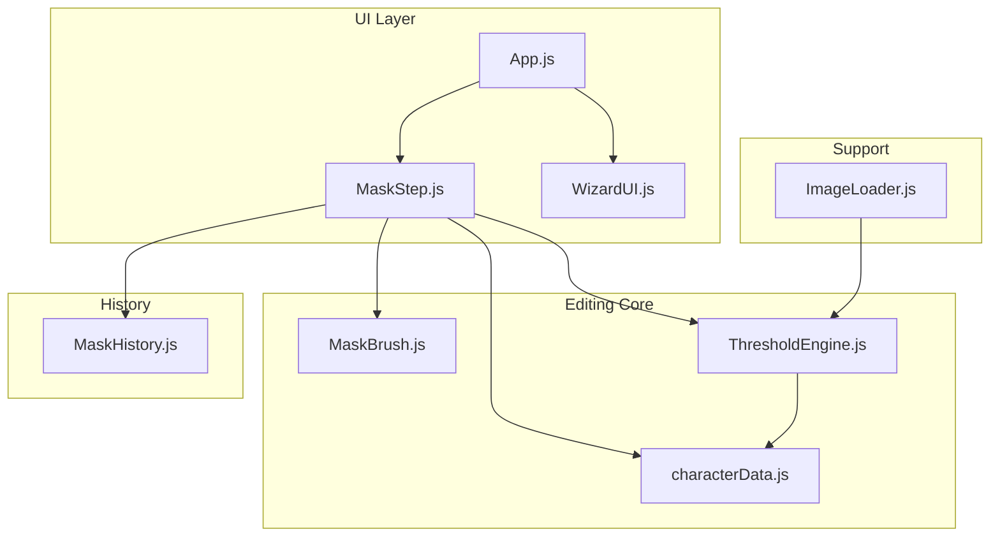
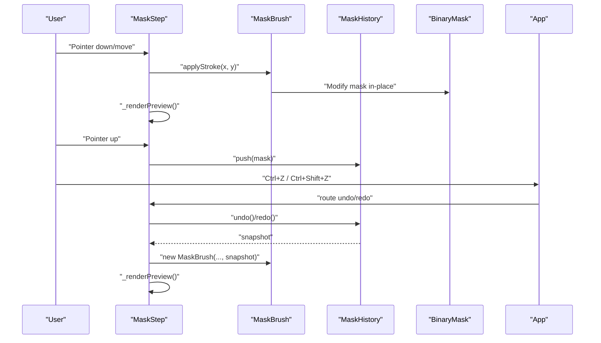
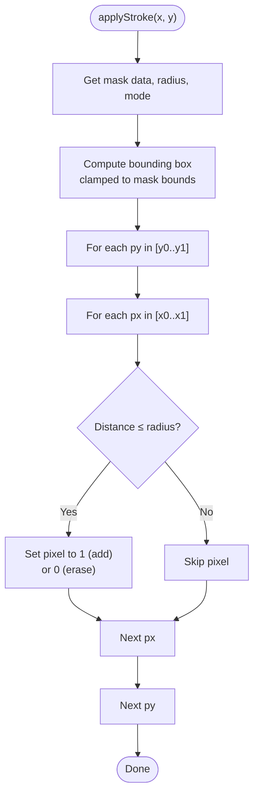
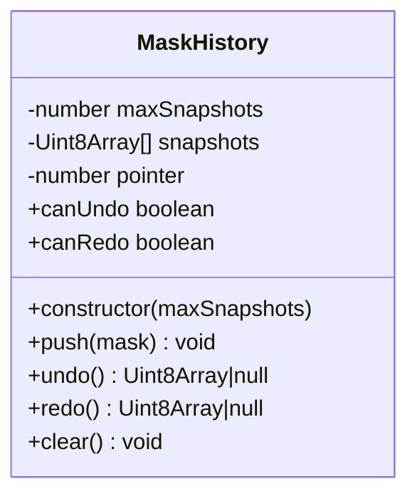
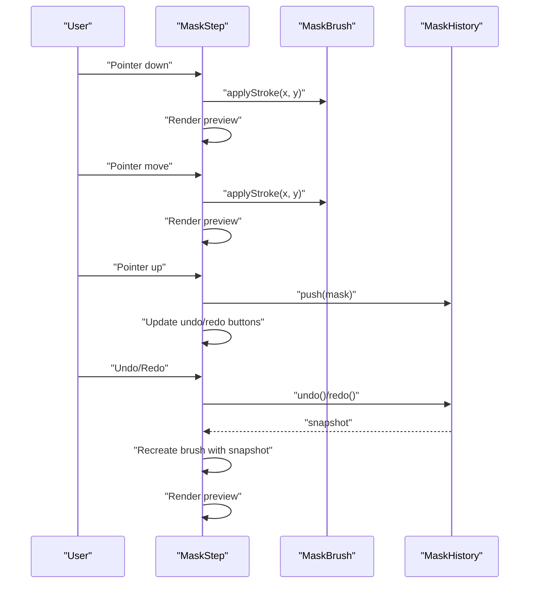
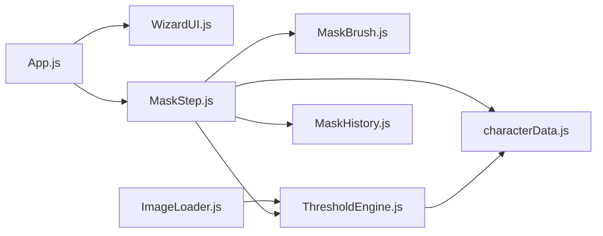

# Interactive Mask Editing and Brush Tools

<cite>
**Referenced Files in This Document**
- [MaskBrush.js](file://src/image/MaskBrush.js)
- [MaskHistory.js](file://src/history/MaskHistory.js)
- [ThresholdEngine.js](file://src/image/ThresholdEngine.js)
- [MaskStep.js](file://src/ui/MaskStep.js)
- [characterData.js](file://src/types/characterData.js)
- [module_design.md](file://architecture/module_design.md)
- [App.js](file://src/App.js)
- [WizardUI.js](file://src/ui/WizardUI.js)
- [ImageLoader.js](file://src/image/ImageLoader.js)
- [MaskBrush.test.js](file://src/image/MaskBrush.test.js)
- [MaskHistory.test.js](file://src/history/MaskHistory.test.js)
</cite>

## Table of Contents
1. [Introduction](#introduction)
2. [Project Structure](#project-structure)
3. [Core Components](#core-components)
4. [Architecture Overview](#architecture-overview)
5. [Detailed Component Analysis](#detailed-component-analysis)
6. [Dependency Analysis](#dependency-analysis)
7. [Performance Considerations](#performance-considerations)
8. [Troubleshooting Guide](#troubleshooting-guide)
9. [Conclusion](#conclusion)
10. [Appendices](#appendices)

## Introduction
This document explains the Interactive Mask Editing system, focusing on brush tools, painting operations, and history management. It documents the MaskBrush implementation, the interactive editing workflow from brush selection through mask modification to final refinement, and the undo/redo functionality via the MaskHistory system. It also covers integration with threshold results and manual correction workflows, along with performance considerations, memory optimization, and troubleshooting guidance.

## Project Structure
The Interactive Mask Editing system spans several modules:
- UI step for mask editing (MaskStep)
- Brush tool (MaskBrush)
- History management (MaskHistory)
- Threshold engine for converting images to masks (ThresholdEngine)
- Shared types for BinaryMask and LoadedImage
- Application orchestration and keyboard shortcuts (App, WizardUI)
- Image loading utilities (ImageLoader)

**Diagram sources**
- [MaskStep.js:15-63](file://src/ui/MaskStep.js#L15-L63)
- [MaskBrush.js:20-40](file://src/image/MaskBrush.js#L20-L40)
- [ThresholdEngine.js:23-36](file://src/image/ThresholdEngine.js#L23-L36)
- [MaskHistory.js:25-42](file://src/history/MaskHistory.js#L25-L42)
- [characterData.js:18-22](file://src/types/characterData.js#L18-L22)
- [ImageLoader.js:72-144](file://src/image/ImageLoader.js#L72-L144)
- [App.js:114-160](file://src/App.js#L114-L160)
- [WizardUI.js:21-42](file://src/ui/WizardUI.js#L21-L42)

**Section sources**
- [module_design.md:298-319](file://architecture/module_design.md#L298-L319)
- [module_design.md:667-693](file://architecture/module_design.md#L667-L693)

## Core Components
- MaskBrush: In-place binary mask editor with circular strokes, add/erase modes, and cursor preview.
- MaskHistory: Circular buffer storing deep-copied snapshots of BinaryMask for undo/redo.
- ThresholdEngine: Converts ImageData to BinaryMask using alpha or luminance thresholding.
- MaskStep: UI step orchestrating thresholding, brush controls, painting, and history.
- Shared types: BinaryMask and LoadedImage define the core data structures.

**Section sources**
- [MaskBrush.js:20-96](file://src/image/MaskBrush.js#L20-L96)
- [MaskHistory.js:25-121](file://src/history/MaskHistory.js#L25-L121)
- [ThresholdEngine.js:23-96](file://src/image/ThresholdEngine.js#L23-L96)
- [MaskStep.js:15-409](file://src/ui/MaskStep.js#L15-L409)
- [characterData.js:18-33](file://src/types/characterData.js#L18-L33)

## Architecture Overview
The system integrates UI, brush editing, and history management around a shared BinaryMask. The workflow begins with thresholding an image to a mask, then interactive painting with brush strokes, and finally undo/redo navigation through MaskHistory. The application routes global keyboard shortcuts to the active step.

**Diagram sources**
- [MaskStep.js:298-333](file://src/ui/MaskStep.js#L298-L333)
- [MaskStep.js:338-361](file://src/ui/MaskStep.js#L338-L361)
- [MaskBrush.js:53-74](file://src/image/MaskBrush.js#L53-L74)
- [MaskHistory.js:55-95](file://src/history/MaskHistory.js#L55-L95)
- [App.js:415-478](file://src/App.js#L415-L478)

## Detailed Component Analysis

### MaskBrush: Brush Tool Implementation
MaskBrush performs in-place modifications of a BinaryMask within a circular region centered at the stroke coordinates. It supports:
- Brush radius (pixels)
- Brush mode: add (foreground) or erase (background)
- Cursor preview canvas generation
- Resource cleanup

Key behaviors:
- Bounding-box pruning to mask dimensions
- Circle distance check for pixel inclusion
- Boundary-safe application (skips pixels outside mask)

**Diagram sources**
- [MaskBrush.js:53-74](file://src/image/MaskBrush.js#L53-L74)

Practical usage patterns:
- Select brush mode and radius via UI sliders
- Stroke continuously while pointer is pressed
- Use cursor preview to visualize brush size

Brush techniques:
- Small-radius add strokes for fine detail
- Medium-radius strokes for quick coverage
- Erase mode to remove unwanted areas
- Combine with threshold adjustments for precision

**Section sources**
- [MaskBrush.js:20-96](file://src/image/MaskBrush.js#L20-L96)
- [MaskBrush.test.js:28-129](file://src/image/MaskBrush.test.js#L28-L129)

### MaskHistory: Undo/Redo Management
MaskHistory maintains a circular buffer of BinaryMask snapshots:
- Push after each brush gesture completion (pointerup/touchend)
- Undo moves backward; Redo moves forward
- Capacity defaults to 20 snapshots; older snapshots evicted
- Push after undo clears redo buffer
- Returned snapshots are deep copies

**Diagram sources**
- [MaskHistory.js:25-121](file://src/history/MaskHistory.js#L25-L121)

Operational notes:
- Memory footprint scales linearly with snapshot count and mask size
- Circular eviction ensures bounded memory growth
- Deep copying prevents accidental mutation of historical states

**Section sources**
- [MaskHistory.js:25-121](file://src/history/MaskHistory.js#L25-L121)
- [MaskHistory.test.js:27-152](file://src/history/MaskHistory.test.js#L27-L152)

### ThresholdEngine: Image to Mask Conversion
ThresholdEngine converts ImageData to a BinaryMask using either alpha-based or luminance-based thresholding:
- Alpha mode: foreground if alpha >= threshold
- Luminance mode: foreground if luminance < threshold (using standard luminance formula)
- Provides a preview overlay rendering for visual feedback

Integration:
- MaskStep initializes the mask from ImageData using ThresholdEngine
- Threshold slider triggers re-computation and updates the brush mask

**Section sources**
- [ThresholdEngine.js:23-96](file://src/image/ThresholdEngine.js#L23-L96)
- [MaskStep.js:68-78](file://src/ui/MaskStep.js#L68-L78)
- [MaskStep.js:115-125](file://src/ui/MaskStep.js#L115-L125)

### MaskStep: Interactive Editing Workflow
MaskStep orchestrates the mask editing UI and workflow:
- Initializes mask from ImageData or existing alpha mask
- Creates MaskBrush and binds pointer events for painting
- Provides threshold slider, brush mode toggle, and brush size slider
- Manages undo/redo buttons and keyboard shortcuts
- Renders a green overlay blend of the image and mask
- Pushes snapshots on pointerup and updates UI state

**Diagram sources**
- [MaskStep.js:298-333](file://src/ui/MaskStep.js#L298-L333)
- [MaskStep.js:338-361](file://src/ui/MaskStep.js#L338-L361)
- [MaskStep.js:267-293](file://src/ui/MaskStep.js#L267-L293)

Manual correction and refinement:
- Adjust threshold until the mask aligns with the silhouette
- Use add/erase modes to refine edges
- Use smaller brushes for precision and larger brushes for coverage
- Undo/redo to experiment freely

Batch editing operations:
- Paint multiple strokes in one session
- Use undo to revert to earlier states
- Use redo to restore undone changes

**Section sources**
- [MaskStep.js:15-409](file://src/ui/MaskStep.js#L15-L409)

### Integration with Application and Keyboard Shortcuts
Global keyboard shortcuts route to the active step:
- Ctrl+Z: Undo
- Ctrl+Shift+Z or Ctrl+Y: Redo

These shortcuts are handled in App and forwarded to the active step component.

**Section sources**
- [App.js:415-478](file://src/App.js#L415-L478)
- [WizardUI.js:21-42](file://src/ui/WizardUI.js#L21-L42)

## Dependency Analysis
The following diagram shows key dependencies among components involved in mask editing:

**Diagram sources**
- [App.js:11-22](file://src/App.js#L11-L22)
- [WizardUI.js:9-16](file://src/ui/WizardUI.js#L9-L16)
- [MaskStep.js:8-10](file://src/ui/MaskStep.js#L8-L10)
- [MaskBrush.js:24-34](file://src/image/MaskBrush.js#L24-L34)
- [ThresholdEngine.js:23-36](file://src/image/ThresholdEngine.js#L23-L36)
- [MaskHistory.js:55-73](file://src/history/MaskHistory.js#L55-L73)
- [characterData.js:18-22](file://src/types/characterData.js#L18-L22)
- [ImageLoader.js:72-144](file://src/image/ImageLoader.js#L72-L144)

**Section sources**
- [module_design.md:298-319](file://architecture/module_design.md#L298-L319)
- [module_design.md:667-693](file://architecture/module_design.md#L667-L693)

## Performance Considerations
- Brush stroke complexity: O(r^2) per stroke, where r is the brush radius. For large masks, prefer fewer, larger strokes and adjust radius judiciously.
- Rendering cost: Preview blending iterates over all pixels; keep mask sizes reasonable or reduce refresh frequency if needed.
- History memory: Each snapshot is a deep copy of the mask data. Defaults to 20 snapshots; adjust capacity based on memory budget.
- Threshold computation: Recomputing the mask on threshold change reconstructs the entire BinaryMask; cache where appropriate and avoid unnecessary recomputation.

[No sources needed since this section provides general guidance]

## Troubleshooting Guide
Common issues and resolutions:
- Painting artifacts or unexpected regions:
  - Verify brush mode and radius settings.
  - Confirm threshold alignment; misaligned threshold can cause incorrect mask initialization.
- Precision issues:
  - Use smaller brush radius for fine detail.
  - Refine edges incrementally with multiple small strokes.
- Undo/redo not working:
  - Ensure pointerup occurs to push a snapshot.
  - Confirm that the history buffer is not empty and that undo/redo availability flags are updated.
- Memory pressure with large masks:
  - Reduce history capacity or limit brush sessions.
  - Consider resizing the image before editing to reduce mask size.
- Threshold preview mismatch:
  - Check that the selected mode matches the image’s alpha presence.

Validation references:
- Brush behavior validated in unit tests for add/erase modes, boundary checks, and destruction.
- History behavior validated for circular buffer eviction, redo clearing, and deep copy semantics.

**Section sources**
- [MaskBrush.test.js:28-129](file://src/image/MaskBrush.test.js#L28-L129)
- [MaskHistory.test.js:27-152](file://src/history/MaskHistory.test.js#L27-L152)

## Conclusion
The Interactive Mask Editing system provides a robust, in-place brush tool integrated with threshold-based initialization and a circular-buffer history for undo/redo. The MaskStep UI streamlines the workflow from threshold adjustment to precise brush strokes, with keyboard shortcuts for efficient navigation. Proper configuration of brush parameters, threshold mode, and history capacity enables reliable mask refinement for downstream character processing.

[No sources needed since this section summarizes without analyzing specific files]

## Appendices

### Practical Examples and Strategies
- Brush techniques:
  - Add mode: Use medium radius for quick coverage, small radius for edges.
  - Erase mode: Remove stray pixels and refine boundaries.
- Mask refinement:
  - Iteratively adjust threshold and paint small corrections.
  - Use undo to step back and refine progressively.
- Batch operations:
  - Paint a series of strokes, then review and refine with targeted undo/redo.

[No sources needed since this section provides general guidance]