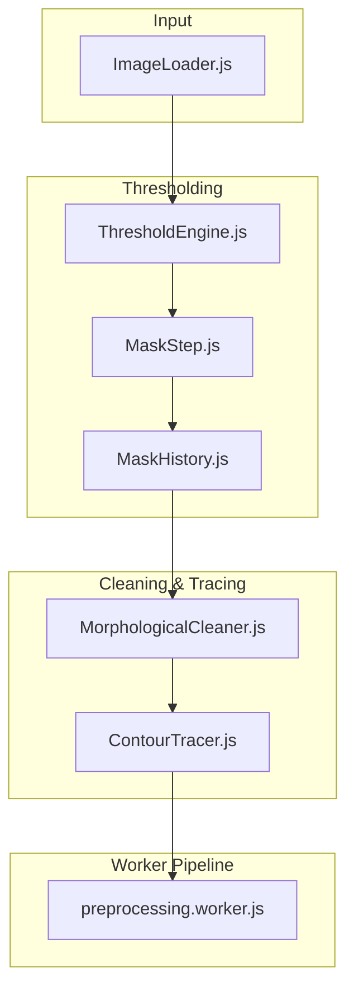
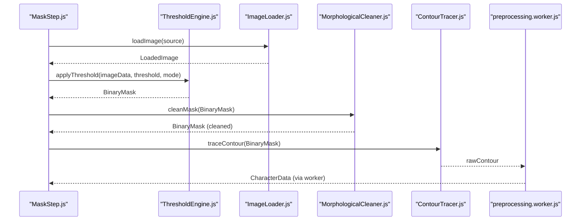
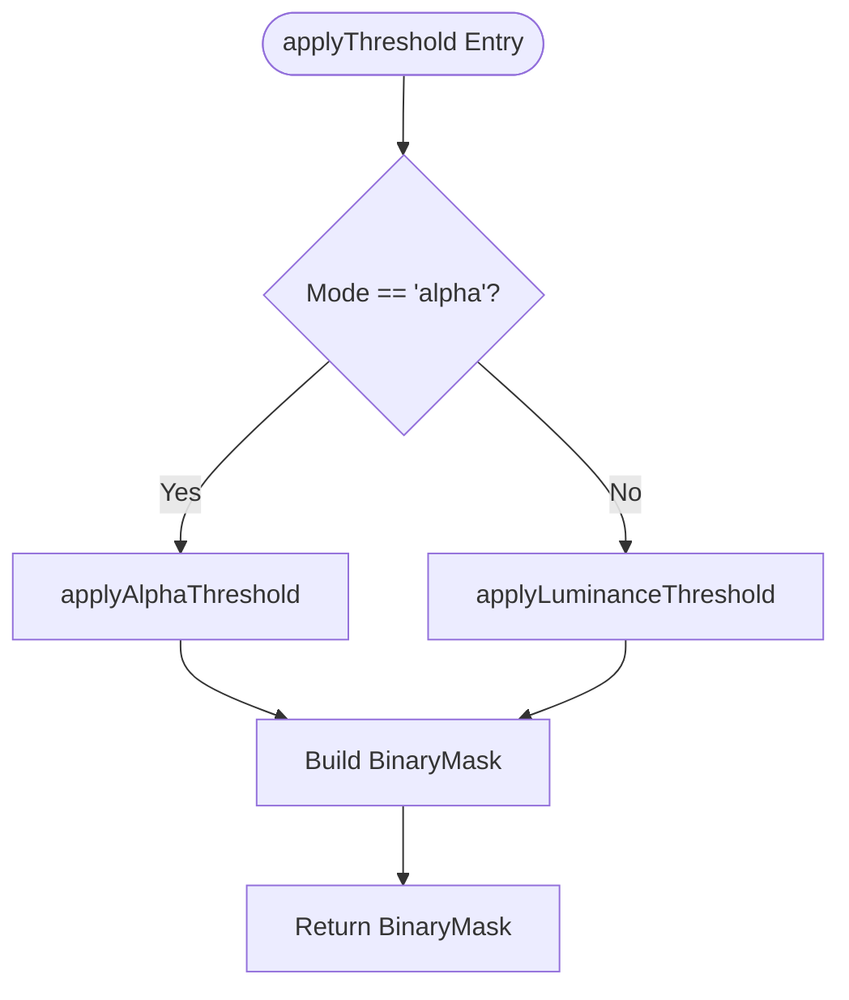
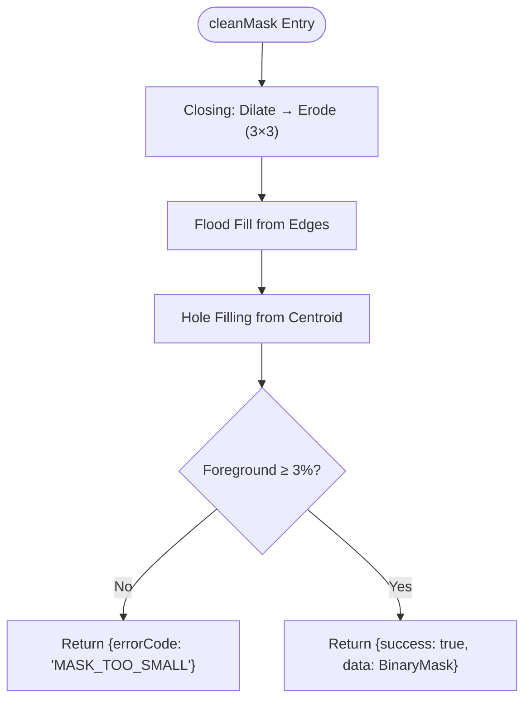
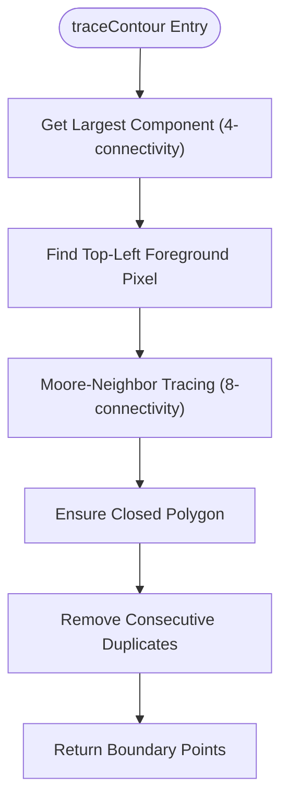
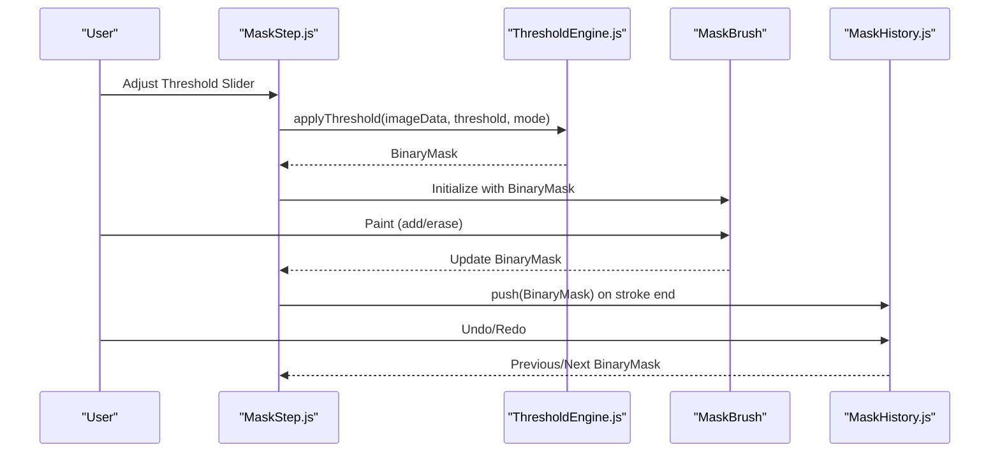

# Threshold Engine and Background Removal

<cite>
**Referenced Files in This Document**
- [ThresholdEngine.js](file://src/image/ThresholdEngine.js)
- [MorphologicalCleaner.js](file://src/geometry/MorphologicalCleaner.js)
- [ContourTracer.js](file://src/geometry/ContourTracer.js)
- [ImageLoader.js](file://src/image/ImageLoader.js)
- [MaskStep.js](file://src/ui/MaskStep.js)
- [MaskHistory.js](file://src/history/MaskHistory.js)
- [characterData.js](file://src/types/characterData.js)
- [preprocessing.worker.js](file://src/character/workers/preprocessing.worker.js)
- [pipeline.md](file://architecture/pipeline.md)
- [module_design.md](file://architecture/module_design.md)
- [architecture_revision_plan.md](file://architecture/revisions/architecture_revision_plan.md)
</cite>

## Table of Contents
1. [Introduction](#introduction)
2. [Project Structure](#project-structure)
3. [Core Components](#core-components)
4. [Architecture Overview](#architecture-overview)
5. [Detailed Component Analysis](#detailed-component-analysis)
6. [Dependency Analysis](#dependency-analysis)
7. [Performance Considerations](#performance-considerations)
8. [Troubleshooting Guide](#troubleshooting-guide)
9. [Conclusion](#conclusion)

## Introduction
This document explains the Threshold Engine system responsible for automatic background removal and alpha mask creation. It covers the threshold algorithm implementation, parameter tuning, sensitivity controls, and quality adjustments. It also documents the integration with morphological cleaning and contour tracing pipelines, along with practical guidance for handling different image types, lighting conditions, and subject complexities.

## Project Structure
The Threshold Engine sits at the center of the preprocessing pipeline, bridging image input and geometry extraction. It integrates with UI controls for manual refinement and is followed by morphological cleaning and contour tracing for robust shape reconstruction.

**Diagram sources**
- [ImageLoader.js:1-160](file://src/image/ImageLoader.js#L1-L160)
- [ThresholdEngine.js:1-96](file://src/image/ThresholdEngine.js#L1-L96)
- [MaskStep.js:1-409](file://src/ui/MaskStep.js#L1-L409)
- [MaskHistory.js:1-121](file://src/history/MaskHistory.js#L1-L121)
- [MorphologicalCleaner.js:1-212](file://src/geometry/MorphologicalCleaner.js#L1-L212)
- [ContourTracer.js:1-212](file://src/geometry/ContourTracer.js#L1-L212)
- [preprocessing.worker.js:1-200](file://src/character/workers/preprocessing.worker.js#L1-L200)

**Section sources**
- [pipeline.md:1-542](file://architecture/pipeline.md#L1-L542)
- [module_design.md:1-976](file://architecture/module_design.md#L1-L976)

## Core Components
- ThresholdEngine: Applies alpha or luminance threshold to convert ImageData into a BinaryMask.
- MorphologicalCleaner: Cleans the binary mask using morphological operations and flood-fill heuristics.
- ContourTracer: Extracts the outer boundary of the largest connected component.
- MaskStep and MaskHistory: Provide interactive thresholding and manual editing with undo/redo.
- ImageLoader: Supplies preprocessed ImageData and detects alpha presence.

Key data structures:
- BinaryMask: Flat Uint8Array representing foreground/background.
- LoadedImage: Decoded image with metadata and alpha detection.

**Section sources**
- [ThresholdEngine.js:1-96](file://src/image/ThresholdEngine.js#L1-L96)
- [MorphologicalCleaner.js:1-212](file://src/geometry/MorphologicalCleaner.js#L1-L212)
- [ContourTracer.js:1-212](file://src/geometry/ContourTracer.js#L1-L212)
- [MaskStep.js:1-409](file://src/ui/MaskStep.js#L1-L409)
- [MaskHistory.js:1-121](file://src/history/MaskHistory.js#L1-L121)
- [ImageLoader.js:1-160](file://src/image/ImageLoader.js#L1-L160)
- [characterData.js:1-254](file://src/types/characterData.js#L1-L254)

## Architecture Overview
The Threshold Engine participates in a staged pipeline:
1. Image decoding and resizing.
2. Thresholding to produce an initial BinaryMask.
3. Morphological cleaning to remove noise and refine the mask.
4. Contour tracing to extract the boundary.
5. Mesh generation and downstream processing in the Web Worker.

**Diagram sources**
- [MaskStep.js:68-125](file://src/ui/MaskStep.js#L68-L125)
- [ThresholdEngine.js:23-36](file://src/image/ThresholdEngine.js#L23-L36)
- [ImageLoader.js:72-144](file://src/image/ImageLoader.js#L72-L144)
- [MorphologicalCleaner.js:26-55](file://src/geometry/MorphologicalCleaner.js#L26-L55)
- [ContourTracer.js:31-54](file://src/geometry/ContourTracer.js#L31-L54)
- [preprocessing.worker.js:86-192](file://src/character/workers/preprocessing.worker.js#L86-L192)

**Section sources**
- [pipeline.md:250-271](file://architecture/pipeline.md#L250-L271)
- [module_design.md:246-267](file://architecture/module_design.md#L246-L267)

## Detailed Component Analysis

### ThresholdEngine: Alpha and Luminance Thresholding
The ThresholdEngine converts ImageData into a BinaryMask using either:
- Alpha mode: foreground if alpha >= threshold.
- Luminance mode: foreground if computed luminance < threshold.

It supports a real-time preview overlay on a canvas and validates mode inputs.

**Diagram sources**
- [ThresholdEngine.js:23-36](file://src/image/ThresholdEngine.js#L23-L36)
- [ThresholdEngine.js:45-63](file://src/image/ThresholdEngine.js#L45-L63)

Practical notes:
- Alpha mode is ideal for PNGs with transparency.
- Luminance mode is suitable for JPEGs without alpha; it treats darker regions as foreground.
- Threshold range is 0–255; values near extremes yield coarse segmentation.

**Section sources**
- [ThresholdEngine.js:1-96](file://src/image/ThresholdEngine.js#L1-L96)
- [ImageLoader.js:48-59](file://src/image/ImageLoader.js#L48-L59)

### MorphologicalCleaner: Noise Reduction and Hole Filling
Morphological cleaning prepares the mask for contour tracing by:
1. Morphological closing (dilate then erode) to fill small gaps.
2. Flood fill from edges to remove foreground touching borders.
3. Hole filling from the foreground centroid to fill internal holes.
4. A guard check ensuring foreground coverage exceeds a minimum ratio.

**Diagram sources**
- [MorphologicalCleaner.js:26-55](file://src/geometry/MorphologicalCleaner.js#L26-L55)
- [MorphologicalCleaner.js:59-104](file://src/geometry/MorphologicalCleaner.js#L59-L104)
- [MorphologicalCleaner.js:106-212](file://src/geometry/MorphologicalCleaner.js#L106-L212)

**Section sources**
- [MorphologicalCleaner.js:1-212](file://src/geometry/MorphologicalCleaner.js#L1-L212)
- [architecture_revision_plan.md:114-131](file://architecture/revisions/architecture_revision_plan.md#L114-L131)

### ContourTracer: Outer Boundary Extraction
ContourTracer identifies the largest connected component and traces its outer boundary using Moore-neighbor traversal. It guarantees a closed polygon and removes duplicates.

**Diagram sources**
- [ContourTracer.js:31-54](file://src/geometry/ContourTracer.js#L31-L54)
- [ContourTracer.js:67-137](file://src/geometry/ContourTracer.js#L67-L137)
- [ContourTracer.js:151-211](file://src/geometry/ContourTracer.js#L151-L211)

**Section sources**
- [ContourTracer.js:1-212](file://src/geometry/ContourTracer.js#L1-L212)
- [module_design.md:323-343](file://architecture/module_design.md#L323-L343)

### UI Integration: Interactive Thresholding and Manual Editing
The MaskStep component initializes the mask from ImageData, exposes a threshold slider, and allows manual painting with undo/redo support. It blends a green overlay on the canvas to visualize the mask.

**Diagram sources**
- [MaskStep.js:68-125](file://src/ui/MaskStep.js#L68-L125)
- [MaskStep.js:267-293](file://src/ui/MaskStep.js#L267-L293)
- [MaskHistory.js:55-95](file://src/history/MaskHistory.js#L55-L95)

**Section sources**
- [MaskStep.js:1-409](file://src/ui/MaskStep.js#L1-L409)
- [MaskHistory.js:1-121](file://src/history/MaskHistory.js#L1-L121)

### Automatic Threshold Calculation and Manual Override
Automatic threshold calculation:
- If the image has alpha, the system defaults to alpha-based thresholding.
- If the image lacks alpha, luminance-based thresholding is used.

Manual override:
- Users adjust the threshold slider to fine-tune foreground/background separation.
- The UI recomputes the BinaryMask and updates previews immediately.

Parameter tuning guidelines:
- Low threshold values favor more foreground (oversegmentation risk).
- High threshold values favor less foreground (undersegmentation risk).
- For complex subjects, combine thresholding with manual brush corrections.

**Section sources**
- [MaskStep.js:68-125](file://src/ui/MaskStep.js#L68-L125)
- [ImageLoader.js:48-59](file://src/image/ImageLoader.js#L48-L59)

## Dependency Analysis
ThresholdEngine depends on ImageData and produces BinaryMask. MaskStep consumes ThresholdEngine outputs and feeds them into MorphologicalCleaner and ContourTracer. The worker pipeline orchestrates the full preprocessing chain.

**Diagram sources**
- [ImageLoader.js:72-144](file://src/image/ImageLoader.js#L72-L144)
- [ThresholdEngine.js:23-36](file://src/image/ThresholdEngine.js#L23-L36)
- [MaskStep.js:68-125](file://src/ui/MaskStep.js#L68-L125)
- [MaskHistory.js:55-95](file://src/history/MaskHistory.js#L55-L95)
- [MorphologicalCleaner.js:26-55](file://src/geometry/MorphologicalCleaner.js#L26-L55)
- [ContourTracer.js:31-54](file://src/geometry/ContourTracer.js#L31-L54)
- [preprocessing.worker.js:86-192](file://src/character/workers/preprocessing.worker.js#L86-L192)

**Section sources**
- [module_design.md:246-267](file://architecture/module_design.md#L246-L267)
- [module_design.md:270-295](file://architecture/module_design.md#L270-L295)
- [module_design.md:323-343](file://architecture/module_design.md#L323-L343)

## Performance Considerations
- ThresholdEngine performs a single pass over pixel data; complexity is O(W×H).
- Morphological operations use 3×3 kernels and BFS traversals; complexity scales with pixel count.
- Contour tracing uses BFS to find the largest component and Moore-neighbor traversal for the boundary.
- The worker pipeline ensures UI responsiveness by moving heavy computation off the main thread.

Optimization tips:
- Prefer alpha-based thresholding for PNGs to avoid luminance computations.
- Use conservative threshold values and refine with brush strokes to minimize cleanup work.
- Keep images under 1024px longest side to reduce memory footprint.

[No sources needed since this section provides general guidance]

## Troubleshooting Guide
Common issues and resolutions:
- Over-segmentation (too much foreground):
  - Cause: low threshold or noisy alpha channel.
  - Fix: increase threshold; inspect alpha channel; apply morphological cleaning.
- Under-segmentation (missing foreground):
  - Cause: high threshold or low-contrast subject.
  - Fix: decrease threshold; enhance contrast; use manual brush to add missing areas.
- Noisy mask edges:
  - Cause: insufficient morphological cleaning.
  - Fix: rely on MorphologicalCleaner; verify flood-fill and hole-filling steps.
- Very small foreground coverage:
  - Cause: threshold too high or incorrect mode.
  - Fix: switch mode; lower threshold; confirm alpha presence detection.

Validation and guards:
- MorphologicalCleaner enforces a minimum foreground ratio and returns an error if violated.
- ContourTracer requires at least three points; otherwise, downstream meshing fails.

**Section sources**
- [MorphologicalCleaner.js:40-55](file://src/geometry/MorphologicalCleaner.js#L40-L55)
- [ContourTracer.js:108-111](file://src/geometry/ContourTracer.js#L108-L111)
- [preprocessing.worker.js:108-117](file://src/character/workers/preprocessing.worker.js#L108-L117)

## Conclusion
The Threshold Engine provides a robust foundation for automatic background removal and alpha mask creation. By combining thresholding with morphological cleaning and contour tracing, it enables reliable geometry extraction. The UI offers interactive controls and manual overrides for challenging scenarios, while the worker pipeline maintains responsiveness and scalability.