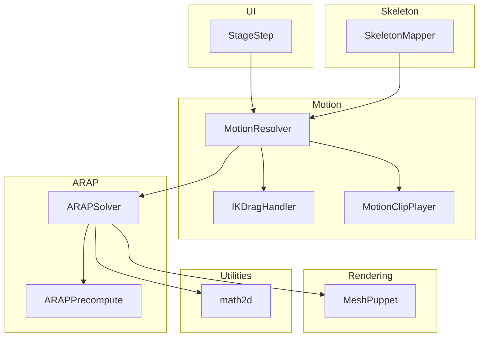
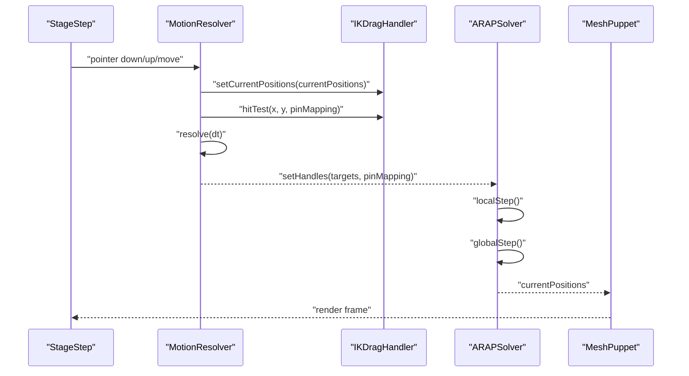
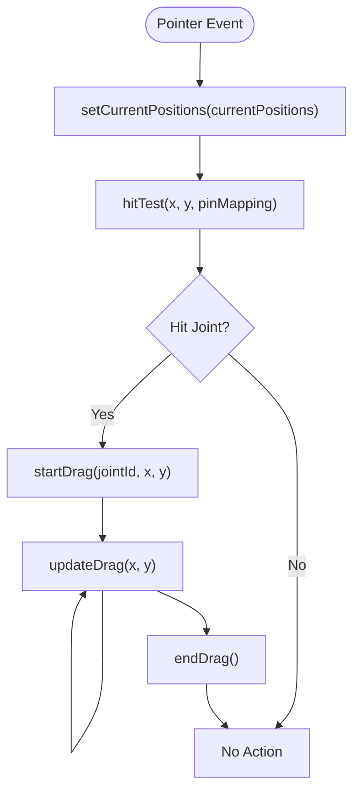
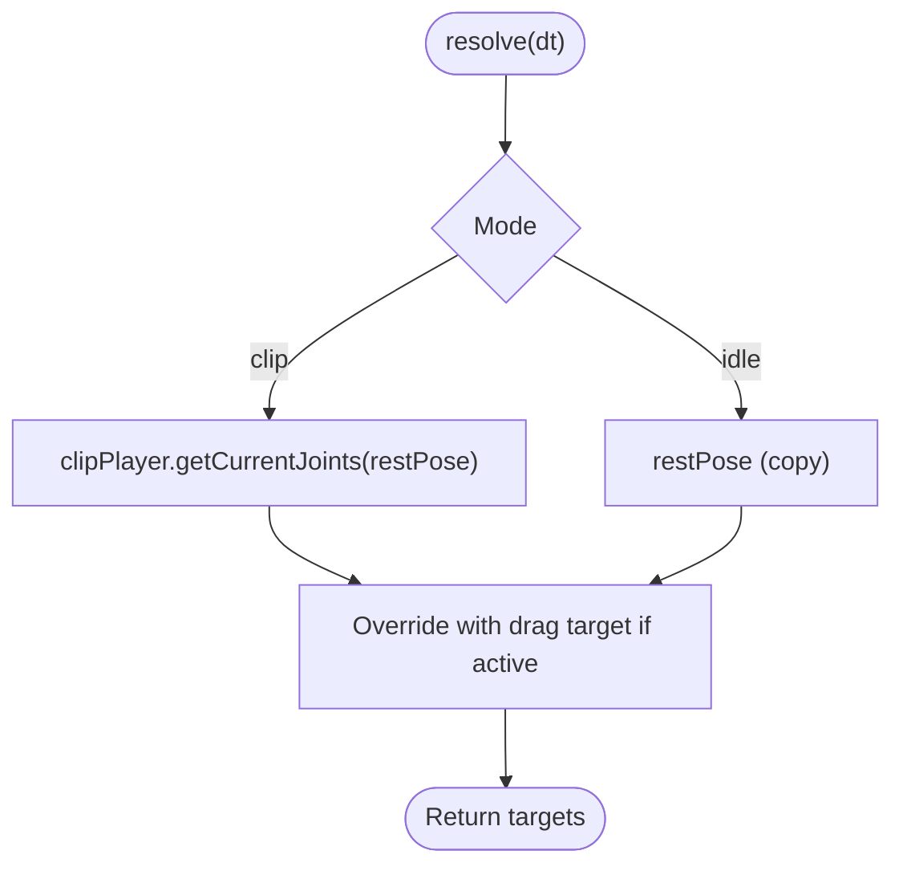
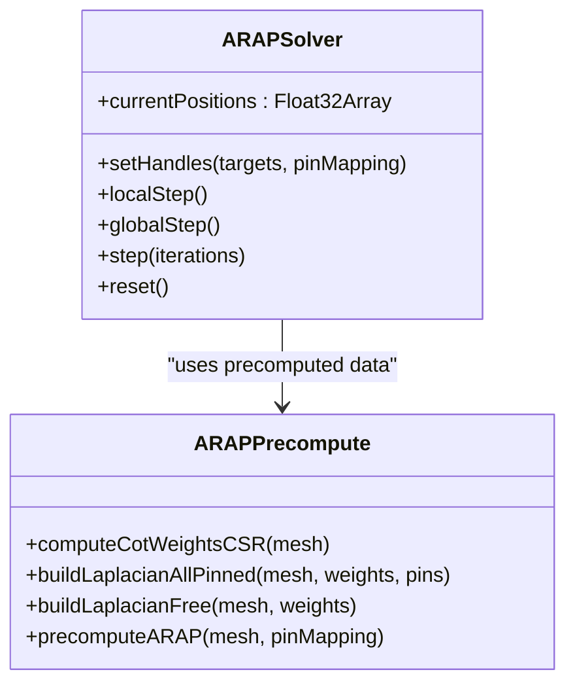
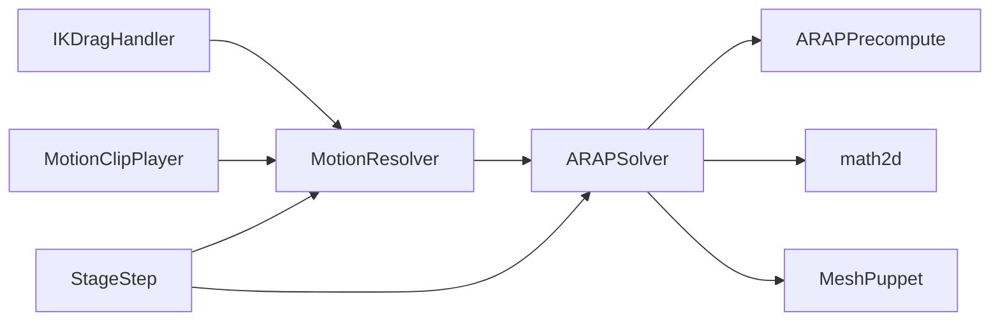

# Inverse Kinematics System

<cite>
**Referenced Files in This Document**
- [IKDragHandler.js](file://src/motion/IKDragHandler.js)
- [IKDragHandler.test.js](file://src/motion/IKDragHandler.test.js)
- [MotionResolver.js](file://src/motion/MotionResolver.js)
- [MotionClipPlayer.js](file://src/motion/MotionClipPlayer.js)
- [SkeletonMapper.js](file://src/skeleton/SkeletonMapper.js)
- [ARAPSolver.js](file://src/arap/ARAPSolver.js)
- [ARAPPrecompute.js](file://src/arap/ARAPPrecompute.js)
- [characterData.js](file://src/types/characterData.js)
- [StageStep.js](file://src/ui/StageStep.js)
- [MeshPuppet.js](file://src/rendering/MeshPuppet.js)
- [math2d.js](file://src/utils/math2d.js)
</cite>

## Table of Contents
1. [Introduction](#introduction)
2. [Project Structure](#project-structure)
3. [Core Components](#core-components)
4. [Architecture Overview](#architecture-overview)
5. [Detailed Component Analysis](#detailed-component-analysis)
6. [Dependency Analysis](#dependency-analysis)
7. [Performance Considerations](#performance-considerations)
8. [Troubleshooting Guide](#troubleshooting-guide)
9. [Conclusion](#conclusion)

## Introduction
This document explains the Inverse Kinematics (IK) system for interactive character manipulation and pose control. It focuses on the IKDragHandler implementation for real-time joint targeting and drag-based character posing, the drag interaction workflow from startDrag() through updateDrag() to endDrag(), and how drag positions translate to joint rotations via the ARAP deformation system. It also documents the priority system where drag mode overrides clip and idle modes, practical examples of interactive pose editing, joint constraint handling, smooth drag transitions, and the integration with ARAP for maintaining mesh integrity during pose changes.

## Project Structure
The IK system spans several modules:
- Motion: MotionResolver orchestrates modes and resolves joint targets; IKDragHandler performs hit-testing and drag tracking; MotionClipPlayer drives motion clips.
- Skeleton: SkeletonMapper maps joints to mesh vertices for ARAP pinning.
- ARAP: ARAPSolver solves for deformed positions using SVD-local and Cholesky-global steps; ARAPPrecompute builds weights and factors.
- Rendering: MeshPuppet renders the deformed mesh using pre-allocated buffers.
- UI: StageStep integrates pointer events with the motion resolver and solver.
- Utilities: math2d provides SVD and 2D math primitives used by ARAP.

**Diagram sources**
- [MotionResolver.js:21-46](file://src/motion/MotionResolver.js#L21-L46)
- [IKDragHandler.js:19-33](file://src/motion/IKDragHandler.js#L19-L33)
- [MotionClipPlayer.js:28-36](file://src/motion/MotionClipPlayer.js#L28-L36)
- [SkeletonMapper.js:27-83](file://src/skeleton/SkeletonMapper.js#L27-L83)
- [ARAPSolver.js:22-59](file://src/arap/ARAPSolver.js#L22-L59)
- [ARAPPrecompute.js:206-296](file://src/arap/ARAPPrecompute.js#L206-L296)
- [MeshPuppet.js:25-54](file://src/rendering/MeshPuppet.js#L25-L54)
- [StageStep.js:287-333](file://src/ui/StageStep.js#L287-L333)
- [math2d.js:264-419](file://src/utils/math2d.js#L264-L419)

**Section sources**
- [MotionResolver.js:1-232](file://src/motion/MotionResolver.js#L1-L232)
- [IKDragHandler.js:1-113](file://src/motion/IKDragHandler.js#L1-L113)
- [MotionClipPlayer.js:1-168](file://src/motion/MotionClipPlayer.js#L1-L168)
- [SkeletonMapper.js:1-211](file://src/skeleton/SkeletonMapper.js#L1-L211)
- [ARAPSolver.js:1-337](file://src/arap/ARAPSolver.js#L1-L337)
- [ARAPPrecompute.js:1-388](file://src/arap/ARAPPrecompute.js#L1-L388)
- [MeshPuppet.js:1-206](file://src/rendering/MeshPuppet.js#L1-L206)
- [StageStep.js:280-333](file://src/ui/StageStep.js#L280-L333)
- [math2d.js:1-459](file://src/utils/math2d.js#L1-L459)

## Core Components
- IKDragHandler: Performs pointer hit-testing against joint positions and tracks the active drag target for the resolver.
- MotionResolver: Combines clip, drag, and idle modes into unified joint targets with priority drag > clip > idle.
- MotionClipPlayer: Interpolates motion clip frames and advances time.
- SkeletonMapper: Maps joints to mesh vertices with uniqueness enforcement for ARAP pinning.
- ARAPSolver: Solves per-frame deformations using SVD per-vertex and Cholesky back-substitution; selects strategy based on number of pinned joints.
- MeshPuppet: Renders the deformed mesh using pre-allocated buffers.
- StageStep: Bridges UI pointer events to the motion resolver and solver.

**Section sources**
- [IKDragHandler.js:19-113](file://src/motion/IKDragHandler.js#L19-L113)
- [MotionResolver.js:21-232](file://src/motion/MotionResolver.js#L21-L232)
- [MotionClipPlayer.js:28-168](file://src/motion/MotionClipPlayer.js#L28-L168)
- [SkeletonMapper.js:27-83](file://src/skeleton/SkeletonMapper.js#L27-L83)
- [ARAPSolver.js:22-337](file://src/arap/ARAPSolver.js#L22-L337)
- [MeshPuppet.js:25-206](file://src/rendering/MeshPuppet.js#L25-L206)
- [StageStep.js:287-333](file://src/ui/StageStep.js#L287-L333)

## Architecture Overview
The IK system operates in a frame loop:
1. UI captures pointer events and delegates to MotionResolver via StageStep.
2. MotionResolver resolves joint targets prioritizing drag, then clip, then idle.
3. ARAPSolver consumes joint targets and computes deformed positions using ARAP.
4. MeshPuppet renders the deformed mesh.

**Diagram sources**
- [StageStep.js:287-333](file://src/ui/StageStep.js#L287-L333)
- [MotionResolver.js:205-230](file://src/motion/MotionResolver.js#L205-L230)
- [IKDragHandler.js:51-111](file://src/motion/IKDragHandler.js#L51-L111)
- [ARAPSolver.js:136-325](file://src/arap/ARAPSolver.js#L136-L325)
- [MeshPuppet.js:149-162](file://src/rendering/MeshPuppet.js#L149-L162)

## Detailed Component Analysis

### IKDragHandler: Hit-Testing and Drag Tracking
IKDragHandler provides:
- Hit-testing against joint positions within a fixed radius to select a draggable joint.
- Drag lifecycle: startDrag(), updateDrag(), endDrag().
- Active target storage and retrieval for the resolver.

Drag interaction workflow:
- startDrag(): Sets the active target with jointId and initial pointer coordinates.
- updateDrag(): Updates the target’s x/y coordinates as the pointer moves.
- endDrag(): Clears the active target.
- hitTest(): Iterates pinMapping and compares squared distances to a threshold to find the closest joint.

**Diagram sources**
- [IKDragHandler.js:51-111](file://src/motion/IKDragHandler.js#L51-L111)
- [StageStep.js:287-333](file://src/ui/StageStep.js#L287-L333)

**Section sources**
- [IKDragHandler.js:19-113](file://src/motion/IKDragHandler.js#L19-L113)
- [IKDragHandler.test.js:39-181](file://src/motion/IKDragHandler.test.js#L39-L181)

### MotionResolver: Mode Priority and Target Resolution
MotionResolver composes:
- Rest pose derived from CharacterData.pinMapping and geometry.vertices0.
- Clip mode via MotionClipPlayer with time advancement and interpolation.
- Drag mode via IKDragHandler with highest priority.

Priority order: drag > clip > idle. The resolver merges targets accordingly and returns a Map of jointId to [x, y].

**Diagram sources**
- [MotionResolver.js:205-230](file://src/motion/MotionResolver.js#L205-L230)

**Section sources**
- [MotionResolver.js:21-232](file://src/motion/MotionResolver.js#L21-L232)
- [MotionClipPlayer.js:28-168](file://src/motion/MotionClipPlayer.js#L28-L168)

### ARAP Deformation System: Mathematical Approach and Integration
ARAPSolver implements:
- Local step: For each vertex, compute a covariance matrix from rest and current edges, perform SVD, and extract rotation matrices.
- Global step: Build RHS from rotations, inject constraints (either pinned vertices or penalty for IK), then solve via Cholesky back-substitution.
- Strategy selection: If all joints are pinned, use allPinned; otherwise, use free mode with penalty constraints.

**Diagram sources**
- [ARAPSolver.js:22-337](file://src/arap/ARAPSolver.js#L22-L337)
- [ARAPPrecompute.js:206-296](file://src/arap/ARAPPrecompute.js#L206-L296)

**Section sources**
- [ARAPSolver.js:22-337](file://src/arap/ARAPSolver.js#L22-L337)
- [ARAPPrecompute.js:206-296](file://src/arap/ARAPPrecompute.js#L206-L296)
- [math2d.js:264-419](file://src/utils/math2d.js#L264-L419)

### SkeletonMapper: Joint-to-Vertex Mapping for ARAP
SkeletonMapper maps skeleton joints to mesh vertices with:
- Nearest-neighbor assignment per joint.
- Uniqueness enforcement via BFS from the nearest vertex to find the first unused vertex.
- Distance threshold to mark joints “too far” from their mapped vertex.

This mapping is essential for ARAP pinning and IK drag targets.

**Section sources**
- [SkeletonMapper.js:27-83](file://src/skeleton/SkeletonMapper.js#L27-L83)

### Rendering Integration: MeshPuppet and Real-Time Updates
MeshPuppet:
- Initializes VBO/EBO/VAO with interleaved [x, y, u, v] layout.
- Updates positions using a pre-allocated workspace buffer to avoid allocations.
- Draws triangles with the current deformed positions.

This enables smooth real-time rendering of ARAP-deformed meshes.

**Section sources**
- [MeshPuppet.js:25-206](file://src/rendering/MeshPuppet.js#L25-L206)

### UI Integration: StageStep and Pointer Events
StageStep:
- Converts pointer coordinates to canvas space.
- Sets current solver positions into the drag handler for hit-testing.
- Starts drag on hit, updates drag on move, ends drag on release.
- Supports cancel via Escape key.

**Section sources**
- [StageStep.js:287-333](file://src/ui/StageStep.js#L287-L333)

## Dependency Analysis
- IKDragHandler depends on CharacterData.pinMapping and ARAP solver positions for hit-testing.
- MotionResolver depends on IKDragHandler, MotionClipPlayer, and CharacterData.restPose.
- ARAPSolver depends on ARAPPrecompute data and math2d utilities.
- MeshPuppet depends on ARAP workspace buffers for efficient updates.
- StageStep depends on MotionResolver and ARAPSolver for drag interactions.

**Diagram sources**
- [MotionResolver.js:25-46](file://src/motion/MotionResolver.js#L25-L46)
- [IKDragHandler.js:20-41](file://src/motion/IKDragHandler.js#L20-L41)
- [ARAPSolver.js:26-59](file://src/arap/ARAPSolver.js#L26-L59)
- [ARAPPrecompute.js:206-296](file://src/arap/ARAPPrecompute.js#L206-L296)
- [MeshPuppet.js:68-108](file://src/rendering/MeshPuppet.js#L68-L108)
- [StageStep.js:287-333](file://src/ui/StageStep.js#L287-L333)
- [math2d.js:264-419](file://src/utils/math2d.js#L264-L419)

**Section sources**
- [MotionResolver.js:21-232](file://src/motion/MotionResolver.js#L21-L232)
- [IKDragHandler.js:19-113](file://src/motion/IKDragHandler.js#L19-L113)
- [ARAPSolver.js:22-337](file://src/arap/ARAPSolver.js#L22-L337)
- [ARAPPrecompute.js:206-296](file://src/arap/ARAPPrecompute.js#L206-L296)
- [MeshPuppet.js:25-206](file://src/rendering/MeshPuppet.js#L25-L206)
- [StageStep.js:287-333](file://src/ui/StageStep.js#L287-L333)
- [math2d.js:264-419](file://src/utils/math2d.js#L264-L419)

## Performance Considerations
- Zero-allocation ARAP: ARAPSolver pre-allocates workspace buffers and avoids new arrays in localStep(), globalStep(), and step() after construction.
- Precomputed ARAP: ARAPPrecompute builds cotangent weights, Laplacians, and Cholesky factors once; fallback to uniform weights ensures robustness.
- Efficient hit-testing: IKDragHandler uses squared distances and a constant radius to minimize expensive square roots.
- Minimal UI overhead: StageStep converts pointer coordinates once per event and delegates to MotionResolver.
- Rendering efficiency: MeshPuppet uses bufferSubData for partial updates and DYNAMIC_DRAW for VBOs.

[No sources needed since this section provides general guidance]

## Troubleshooting Guide
Common issues and remedies:
- Drag target not updating: Ensure setCurrentPositions is called with solver.currentPositions before hitTest.
- Drag does not start: Verify hitTest returns a jointId and startDrag is invoked.
- NaN positions after solving: Check ARAPPrecompute fallback and NaN checks; ensure pinMapping is valid.
- Mesh jitter or collapse: Confirm ARAP iterations and strategy selection; verify pinMapping uniqueness.

**Section sources**
- [IKDragHandler.js:39-41](file://src/motion/IKDragHandler.js#L39-L41)
- [ARAPPrecompute.js:206-296](file://src/arap/ARAPPrecompute.js#L206-L296)
- [ARAPSolver.js:319-337](file://src/arap/ARAPSolver.js#L319-L337)

## Conclusion
The IK system integrates UI-driven drag interactions with ARAP-based pose control. IKDragHandler provides precise hit-testing and drag tracking, MotionResolver applies priority-based mode resolution, and ARAPSolver computes physically plausible deformations. The system emphasizes performance through precomputation, zero-allocation updates, and efficient rendering, enabling smooth interactive pose editing while maintaining mesh integrity.