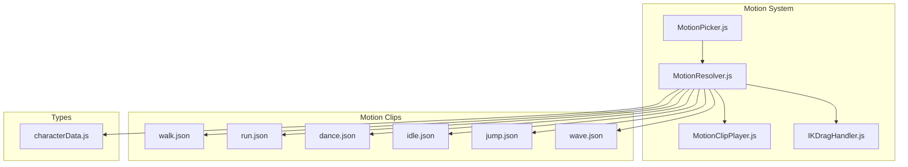
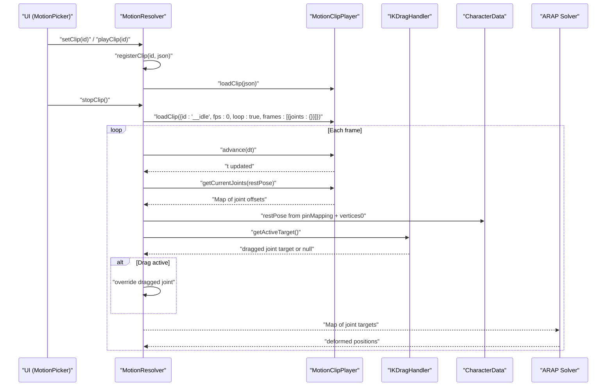
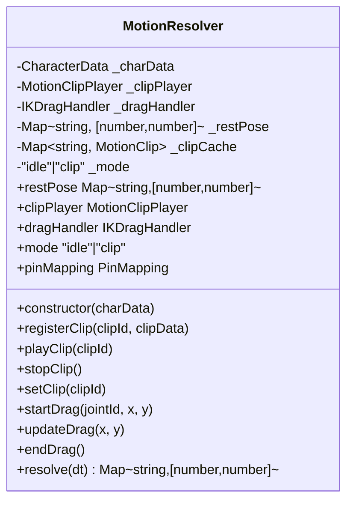
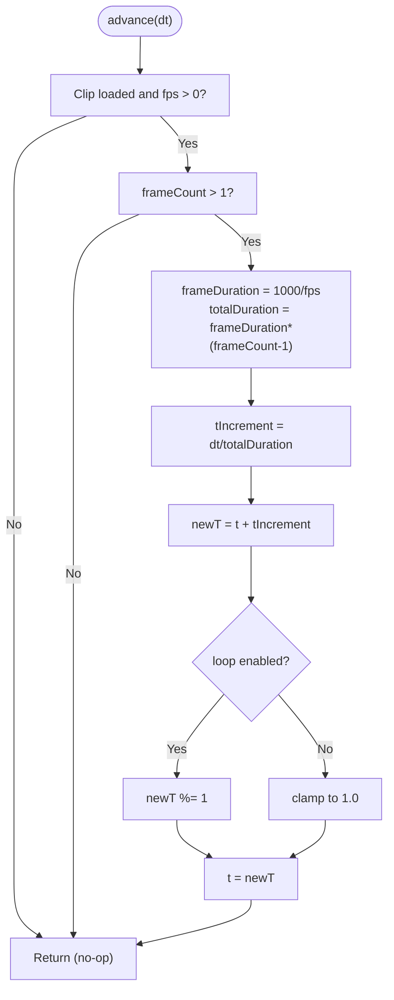
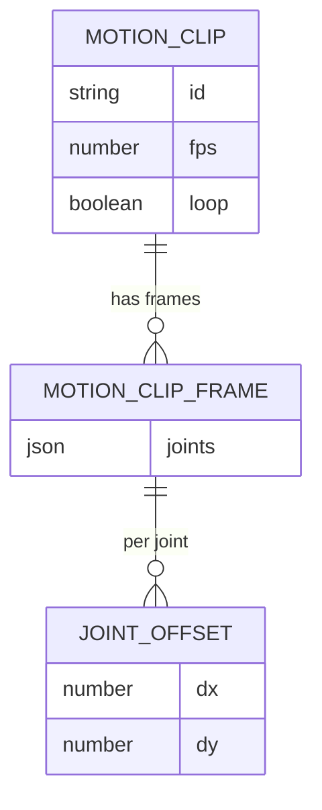
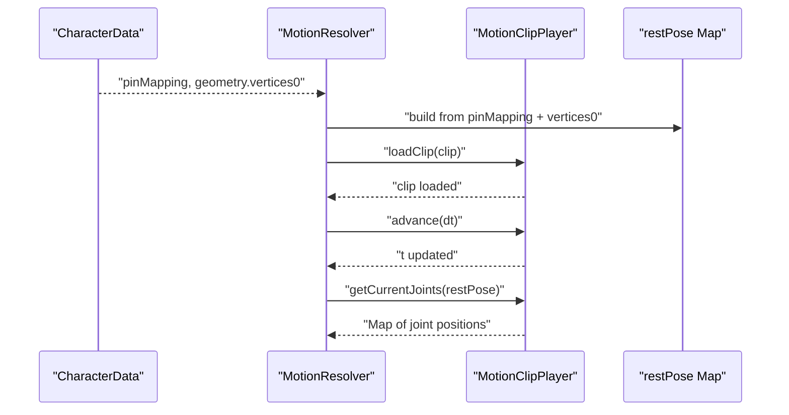
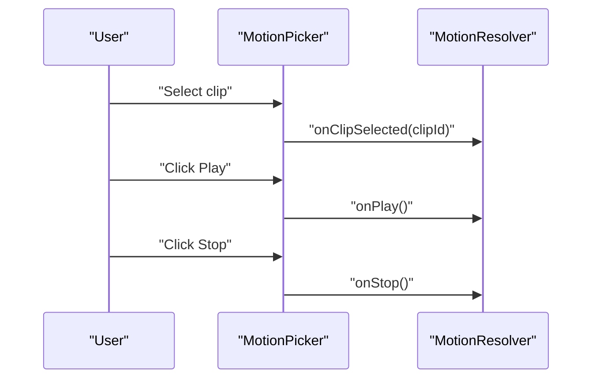
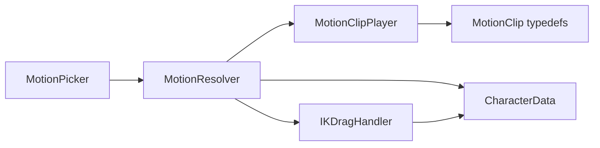

# Motion Clip Management

<cite>
**Referenced Files in This Document**
- [MotionResolver.js](file://src/motion/MotionResolver.js)
- [MotionClipPlayer.js](file://src/motion/MotionClipPlayer.js)
- [IKDragHandler.js](file://src/motion/IKDragHandler.js)
- [characterData.js](file://src/types/characterData.js)
- [walk.json](file://src/motion/clips/walk.json)
- [run.json](file://src/motion/clips/run.json)
- [dance.json](file://src/motion/clips/dance.json)
- [idle.json](file://src/motion/clips/idle.json)
- [jump.json](file://src/motion/clips/jump.json)
- [wave.json](file://src/motion/clips/wave.json)
- [MotionPicker.js](file://src/ui/MotionPicker.js)
- [MotionResolver.integration.test.js](file://src/motion/MotionResolver.integration.test.js)
</cite>

## Table of Contents
1. [Introduction](#introduction)
2. [Project Structure](#project-structure)
3. [Core Components](#core-components)
4. [Architecture Overview](#architecture-overview)
5. [Detailed Component Analysis](#detailed-component-analysis)
6. [Dependency Analysis](#dependency-analysis)
7. [Performance Considerations](#performance-considerations)
8. [Troubleshooting Guide](#troubleshooting-guide)
9. [Conclusion](#conclusion)
10. [Appendices](#appendices)

## Introduction
This document explains the Motion Clip Management system responsible for loading, caching, and playing animation clips on a character skeleton. It focuses on the central MotionResolver interface, the MotionClipPlayer implementation for smooth interpolation and timing, the motion clip JSON format, the clip cache mechanism, and integration with character data and UI controls. Practical examples demonstrate loading different motion types (walk, run, dance, idle), controlling playback speed, and implementing loop behavior. Performance considerations and memory optimization strategies are included to ensure smooth animation playback.

## Project Structure
The motion subsystem is organized under src/motion with dedicated modules for the resolver, player, drag handling, and sample clips. Supporting types define the character data contract, while UI components integrate clip selection and playback controls.



**Diagram sources**
- [MotionResolver.js:1-232](file://src/motion/MotionResolver.js#L1-L232)
- [MotionClipPlayer.js:1-168](file://src/motion/MotionClipPlayer.js#L1-L168)
- [IKDragHandler.js:1-113](file://src/motion/IKDragHandler.js#L1-L113)
- [characterData.js:132-188](file://src/types/characterData.js#L132-L188)
- [MotionPicker.js:1-107](file://src/ui/MotionPicker.js#L1-L107)
- [walk.json:1-32](file://src/motion/clips/walk.json#L1-L32)
- [run.json:1-32](file://src/motion/clips/run.json#L1-L32)
- [dance.json:1-32](file://src/motion/clips/dance.json#L1-L32)
- [idle.json:1-9](file://src/motion/clips/idle.json#L1-L9)
- [jump.json:1-20](file://src/motion/clips/jump.json#L1-L20)
- [wave.json:1-32](file://src/motion/clips/wave.json#L1-L32)

**Section sources**
- [MotionResolver.js:1-232](file://src/motion/MotionResolver.js#L1-L232)
- [MotionClipPlayer.js:1-168](file://src/motion/MotionClipPlayer.js#L1-L168)
- [IKDragHandler.js:1-113](file://src/motion/IKDragHandler.js#L1-L113)
- [characterData.js:132-188](file://src/types/characterData.js#L132-L188)
- [MotionPicker.js:1-107](file://src/ui/MotionPicker.js#L1-L107)

## Core Components
- MotionResolver: Central orchestrator combining clip playback, drag-based IK, and idle rest pose into per-frame joint targets. It exposes registerClip(), playClip(), stopClip(), and drag APIs.
- MotionClipPlayer: Handles frame interpolation, time advancement, and loop behavior based on fps and delta time. It computes current joint positions by blending offsets from adjacent frames.
- IKDragHandler: Manages pointer hit-testing and drag tracking for interactive joint manipulation.
- CharacterData: Defines the runtime data structure linking geometry, skeleton, and pin mapping used by the resolver.
- Motion clips: JSON files defining joint offsets per frame, fps, loop flag, and clip id.

Key responsibilities:
- MotionResolver builds a rest pose from character geometry and pin mapping, caches clips, selects modes (idle/clip), and resolves joint targets each frame.
- MotionClipPlayer loads clip JSON, advances time, interpolates between frames, and returns joint positions relative to rest.
- IKDragHandler enables interactive manipulation by overriding resolved targets for the dragged joint.
- UI MotionPicker integrates clip selection and play/stop actions with the resolver.

**Section sources**
- [MotionResolver.js:21-232](file://src/motion/MotionResolver.js#L21-L232)
- [MotionClipPlayer.js:28-168](file://src/motion/MotionClipPlayer.js#L28-L168)
- [IKDragHandler.js:19-113](file://src/motion/IKDragHandler.js#L19-L113)
- [characterData.js:132-188](file://src/types/characterData.js#L132-L188)

## Architecture Overview
The MotionResolver composes three subsystems: clip playback, drag-based IK, and idle rest pose. It resolves joint targets each frame with priority: drag > clip > idle. The resolver maintains a clip cache and a rest pose derived from CharacterData. The MotionClipPlayer advances time and interpolates offsets, while the IKDragHandler provides interactive joint targeting.



**Diagram sources**
- [MotionResolver.js:105-133](file://src/motion/MotionResolver.js#L105-L133)
- [MotionResolver.js:205-230](file://src/motion/MotionResolver.js#L205-L230)
- [MotionClipPlayer.js:78-104](file://src/motion/MotionClipPlayer.js#L78-L104)
- [MotionClipPlayer.js:112-166](file://src/motion/MotionClipPlayer.js#L112-L166)
- [IKDragHandler.js:109-111](file://src/motion/IKDragHandler.js#L109-L111)
- [characterData.js:132-188](file://src/types/characterData.js#L132-L188)

## Detailed Component Analysis

### MotionResolver
Responsibilities:
- Build rest pose from CharacterData pin mapping and geometry vertices0.
- Manage clip cache (Map of clipId to JSON).
- Mode control: idle vs clip.
- Resolve joint targets prioritizing drag > clip > idle.
- Expose APIs: registerClip(), playClip(), stopClip(), setClip(), startDrag(), updateDrag(), endDrag(), resolve(dt).

Key behaviors:
- registerClip(): Stores clip JSON in an internal Map.
- playClip(): Loads clip into MotionClipPlayer and switches to clip mode.
- stopClip(): Loads a special idle clip into the player and sets mode to idle.
- resolve(dt): Advances clip time, computes base targets from clip or rest pose, and applies drag overrides.



**Diagram sources**
- [MotionResolver.js:21-232](file://src/motion/MotionResolver.js#L21-L232)

**Section sources**
- [MotionResolver.js:25-61](file://src/motion/MotionResolver.js#L25-L61)
- [MotionResolver.js:105-133](file://src/motion/MotionResolver.js#L105-L133)
- [MotionResolver.js:205-230](file://src/motion/MotionResolver.js#L205-L230)

### MotionClipPlayer
Responsibilities:
- Load MotionClip JSON with id, fps, loop, and frames.
- Advance normalized time t by dt, handling fps and loop behavior.
- Interpolate joint offsets between frames and combine with rest pose to produce current joint positions.

Core logic:
- loadClip(): Validates frames array and resets temporal position.
- advance(dt): Computes frame duration and increments t; wraps or clamps depending on loop flag.
- getCurrentJoints(restPose): Computes fractional frame indices, interpolates dx/dy per joint, and adds offsets to rest positions.



**Diagram sources**
- [MotionClipPlayer.js:78-104](file://src/motion/MotionClipPlayer.js#L78-L104)

**Section sources**
- [MotionClipPlayer.js:41-47](file://src/motion/MotionClipPlayer.js#L41-L47)
- [MotionClipPlayer.js:78-104](file://src/motion/MotionClipPlayer.js#L78-L104)
- [MotionClipPlayer.js:112-166](file://src/motion/MotionClipPlayer.js#L112-L166)

### IKDragHandler
Responsibilities:
- Track current joint positions from ARAP solver.
- Hit-test pointer against joint positions within a radius to select a draggable joint.
- Maintain active drag target and expose getters/setters for drag lifecycle.

Key methods:
- setCurrentPositions(): Receives interleaved [x0,y0,x1,y1,...] buffer.
- hitTest(): Finds closest joint within radius using squared distance comparison.
- startDrag()/updateDrag()/endDrag(): Manage active target.
- getActiveTarget(): Returns current drag target or null.

```mermaid
classDiagram
class IKDragHandler {
-Float32Array _currentPositions
-{jointId,x,y}|null _activeTarget
+setCurrentPositions(positions)
+hitTest(pointerX, pointerY, pinMapping) string|null
+startDrag(jointId, x, y)
+updateDrag(x, y)
+endDrag()
+getActiveTarget() {jointId,x,y}|null
}
```

**Diagram sources**
- [IKDragHandler.js:19-113](file://src/motion/IKDragHandler.js#L19-L113)

**Section sources**
- [IKDragHandler.js:39-41](file://src/motion/IKDragHandler.js#L39-L41)
- [IKDragHandler.js:51-74](file://src/motion/IKDragHandler.js#L51-L74)
- [IKDragHandler.js:82-103](file://src/motion/IKDragHandler.js#L82-L103)
- [IKDragHandler.js:109-111](file://src/motion/IKDragHandler.js#L109-L111)

### Motion Clip JSON Format
Each clip JSON defines:
- id: String identifier.
- fps: Number frames per second (0 indicates static/single-frame).
- loop: Boolean indicating whether to wrap or clamp at end.
- frames: Array of MotionClipFrame objects containing joint offsets.

MotionClipFrame structure:
- joints: Object keyed by jointId with dx/dy offsets relative to rest pose.

Example clips:
- walk.json: Humanoid walking cycle with alternating limb motion.
- run.json: Faster bipedal gait with larger offsets.
- dance.json: Full-body choreographed poses with dynamic joint offsets.
- idle.json: Static rest pose with fps=0 and minimal frames.
- jump.json: Non-looping jump sequence with acceleration/deceleration.
- wave.json: Arm-only waving motion.



**Diagram sources**
- [MotionClipPlayer.js:13-23](file://src/motion/MotionClipPlayer.js#L13-L23)
- [walk.json:1-32](file://src/motion/clips/walk.json#L1-L32)
- [run.json:1-32](file://src/motion/clips/run.json#L1-L32)
- [dance.json:1-32](file://src/motion/clips/dance.json#L1-L32)
- [idle.json:1-9](file://src/motion/clips/idle.json#L1-L9)
- [jump.json:1-20](file://src/motion/clips/jump.json#L1-L20)
- [wave.json:1-32](file://src/motion/clips/wave.json#L1-L32)

**Section sources**
- [MotionClipPlayer.js:13-23](file://src/motion/MotionClipPlayer.js#L13-L23)
- [walk.json:1-32](file://src/motion/clips/walk.json#L1-L32)
- [run.json:1-32](file://src/motion/clips/run.json#L1-L32)
- [dance.json:1-32](file://src/motion/clips/dance.json#L1-L32)
- [idle.json:1-9](file://src/motion/clips/idle.json#L1-L9)
- [jump.json:1-20](file://src/motion/clips/jump.json#L1-L20)
- [wave.json:1-32](file://src/motion/clips/wave.json#L1-L32)

### Clip Cache Mechanism
- MotionResolver maintains a Map<String, MotionClip> cache to store previously registered clips.
- registerClip(clipId, clipData) stores the clip JSON under clipId.
- playClip(clipId) retrieves the clip from cache and loads it into MotionClipPlayer.
- stopClip() loads a special idle clip into the player and sets mode to idle.

Benefits:
- Efficient reuse of clip data without reloading.
- Minimal memory overhead for repeated playback.
- Clear separation between registration and playback.

**Section sources**
- [MotionResolver.js:38-46](file://src/motion/MotionResolver.js#L38-L46)
- [MotionResolver.js:110-112](file://src/motion/MotionResolver.js#L110-L112)
- [MotionResolver.js:118-125](file://src/motion/MotionResolver.js#L118-L125)
- [MotionResolver.js:130-133](file://src/motion/MotionResolver.js#L130-L133)

### Integration with Character Data and Skeleton Joints
- MotionResolver constructs restPose from CharacterData.pinMapping and geometry.vertices0.
- Joint IDs are validated against humanoid joint identifiers.
- MotionClipPlayer’s getCurrentJoints() blends offsets per joint and adds to rest positions.
- IKDragHandler uses pinMapping to map pointer coordinates to joint targets.



**Diagram sources**
- [MotionResolver.js:52-61](file://src/motion/MotionResolver.js#L52-L61)
- [MotionResolver.js:214-221](file://src/motion/MotionResolver.js#L214-L221)
- [MotionClipPlayer.js:112-166](file://src/motion/MotionClipPlayer.js#L112-L166)
- [characterData.js:132-188](file://src/types/characterData.js#L132-L188)

**Section sources**
- [characterData.js:35-39](file://src/types/characterData.js#L35-L39)
- [characterData.js:132-188](file://src/types/characterData.js#L132-L188)
- [MotionResolver.js:52-61](file://src/motion/MotionResolver.js#L52-L61)
- [MotionResolver.js:214-221](file://src/motion/MotionResolver.js#L214-L221)

### Practical Examples

#### Loading Different Motion Types
- Walk: Use walk.json with fps=24 and loop=true for continuous bipedal movement.
- Run: Use run.json with higher offsets and fps=24 for fast locomotion.
- Dance: Use dance.json with full-body choreography and fps=24.
- Idle: Use idle.json with fps=0 for a static rest pose.
- Jump: Use jump.json with fps=24 and loop=false for a one-shot action.
- Wave: Use wave.json with localized arm motion and fps=24.

Implementation steps:
- Register the clip via MotionResolver.registerClip().
- Play the clip via MotionResolver.playClip().
- Stop the clip via MotionResolver.stopClip() or setClip(null).

Playback control:
- Speed: Adjust fps in the clip JSON to change playback speed.
- Loop: Set loop=true for continuous playback; false for one-shot sequences.

Loop behavior:
- Looping clips wrap normalized time t to [0,1).
- Non-looping clips clamp t at 1.0.

**Section sources**
- [walk.json:1-32](file://src/motion/clips/walk.json#L1-L32)
- [run.json:1-32](file://src/motion/clips/run.json#L1-L32)
- [dance.json:1-32](file://src/motion/clips/dance.json#L1-L32)
- [idle.json:1-9](file://src/motion/clips/idle.json#L1-L9)
- [jump.json:1-20](file://src/motion/clips/jump.json#L1-L20)
- [wave.json:1-32](file://src/motion/clips/wave.json#L1-L32)
- [MotionResolver.js:110-112](file://src/motion/MotionResolver.js#L110-L112)
- [MotionResolver.js:118-125](file://src/motion/MotionResolver.js#L118-L125)
- [MotionResolver.js:130-133](file://src/motion/MotionResolver.js#L130-L133)
- [MotionClipPlayer.js:91-101](file://src/motion/MotionClipPlayer.js#L91-L101)

### UI Integration
The MotionPicker component provides a dropdown menu of predefined clips and play/stop controls. It triggers resolver actions through callback handlers.



**Diagram sources**
- [MotionPicker.js:59-61](file://src/ui/MotionPicker.js#L59-L61)
- [MotionPicker.js:70](file://src/ui/MotionPicker.js#L70)
- [MotionPicker.js:78](file://src/ui/MotionPicker.js#L78)

**Section sources**
- [MotionPicker.js:28-38](file://src/ui/MotionPicker.js#L28-L38)
- [MotionPicker.js:59-61](file://src/ui/MotionPicker.js#L59-L61)
- [MotionPicker.js:70](file://src/ui/MotionPicker.js#L70)
- [MotionPicker.js:78](file://src/ui/MotionPicker.js#L78)

## Dependency Analysis
- MotionResolver depends on MotionClipPlayer and IKDragHandler, and consumes CharacterData for rest pose and pin mapping.
- MotionClipPlayer depends on MotionClip typedefs and operates independently of external systems.
- IKDragHandler depends on CharacterData pin mapping and receives current joint positions from the solver.
- UI components depend on MotionResolver callbacks to orchestrate playback.



**Diagram sources**
- [MotionResolver.js:15-16](file://src/motion/MotionResolver.js#L15-L16)
- [MotionClipPlayer.js:13-23](file://src/motion/MotionClipPlayer.js#L13-L23)
- [IKDragHandler.js:48-50](file://src/motion/IKDragHandler.js#L48-L50)
- [characterData.js:132-188](file://src/types/characterData.js#L132-L188)
- [MotionPicker.js:1-107](file://src/ui/MotionPicker.js#L1-L107)

**Section sources**
- [MotionResolver.js:15-16](file://src/motion/MotionResolver.js#L15-L16)
- [MotionClipPlayer.js:13-23](file://src/motion/MotionClipPlayer.js#L13-L23)
- [IKDragHandler.js:48-50](file://src/motion/IKDragHandler.js#L48-L50)
- [characterData.js:132-188](file://src/types/characterData.js#L132-L188)

## Performance Considerations
- Time advancement: MotionClipPlayer computes frameDuration and totalDuration once per advance, minimizing redundant calculations.
- Interpolation: getCurrentJoints() iterates over restPose keys and performs linear interpolation per joint; keep joint counts reasonable for real-time performance.
- Loop handling: Looping wraps t using modulo arithmetic; non-looping clamps to 1.0 to prevent overflow.
- Memory: Clip cache avoids repeated parsing of JSON; consider limiting cache size if many clips are registered.
- Drag mode: When dragging a subset of joints, the resolver still returns a full joint map; ensure solver strategies match resolved joint coverage.
- NaN prevention: Integration tests verify solver positions remain finite under various clips and modes.

[No sources needed since this section provides general guidance]

## Troubleshooting Guide
Common issues and resolutions:
- Clip not registered: Calling playClip() with an unregistered clipId throws an error. Ensure registerClip() is called before playClip().
- Invalid clip JSON: loadClip() requires a frames array; missing or empty frames cause an error. Verify fps, loop, and frames structure.
- Drag target not applied: Ensure setCurrentPositions() is called with the latest ARAP solver positions and that hit-test succeeds within the configured radius.
- Unexpected NaN in solver positions: Validate clip offsets and ensure restPose contains all required jointIds. Integration tests confirm robustness under various clips.

**Section sources**
- [MotionResolver.js:120-122](file://src/motion/MotionResolver.js#L120-L122)
- [MotionClipPlayer.js:42-44](file://src/motion/MotionClipPlayer.js#L42-L44)
- [IKDragHandler.js:51-74](file://src/motion/IKDragHandler.js#L51-L74)
- [MotionResolver.integration.test.js:122-146](file://src/motion/MotionResolver.integration.test.js#L122-L146)

## Conclusion
The Motion Clip Management system provides a cohesive framework for loading, caching, and playing animation clips while supporting interactive manipulation and idle rest poses. MotionResolver orchestrates the pipeline, MotionClipPlayer ensures smooth interpolation and timing, and IKDragHandler enables precise joint targeting. The clip JSON format is compact and flexible, enabling diverse motion types. With careful attention to fps, loop behavior, and cache management, the system delivers responsive and visually appealing character animation.

[No sources needed since this section summarizes without analyzing specific files]

## Appendices

### API Summary
- MotionResolver
  - registerClip(clipId, clipData)
  - playClip(clipId)
  - stopClip()
  - setClip(clipId)
  - startDrag(jointId, x, y)
  - updateDrag(x, y)
  - endDrag()
  - resolve(dt)
- MotionClipPlayer
  - loadClip(clipJson)
  - advance(dt)
  - getCurrentJoints(restPose)
- IKDragHandler
  - setCurrentPositions(positions)
  - hitTest(pointerX, pointerY, pinMapping)
  - startDrag(jointId, x, y)
  - updateDrag(x, y)
  - endDrag()
  - getActiveTarget()

**Section sources**
- [MotionResolver.js:105-190](file://src/motion/MotionResolver.js#L105-L190)
- [MotionClipPlayer.js:41-166](file://src/motion/MotionClipPlayer.js#L41-L166)
- [IKDragHandler.js:39-111](file://src/motion/IKDragHandler.js#L39-L111)