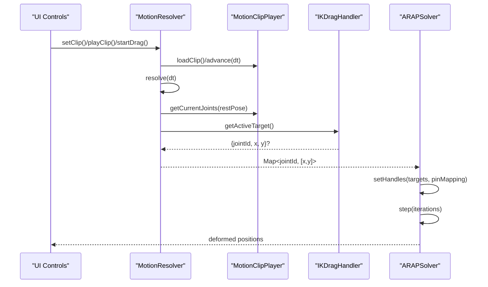
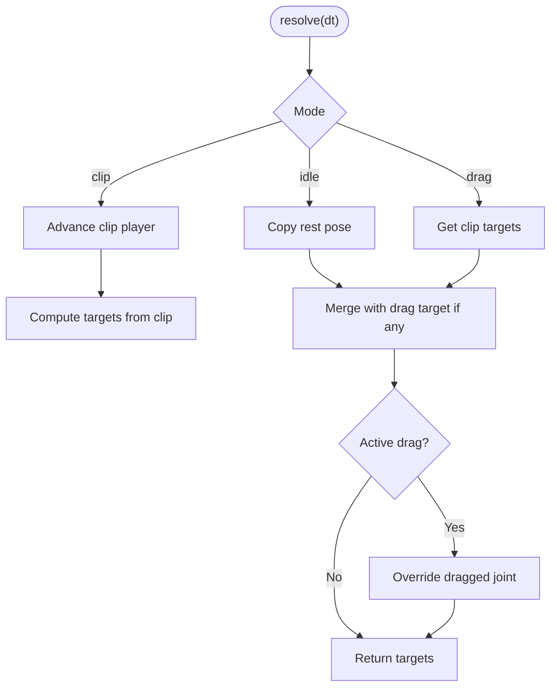
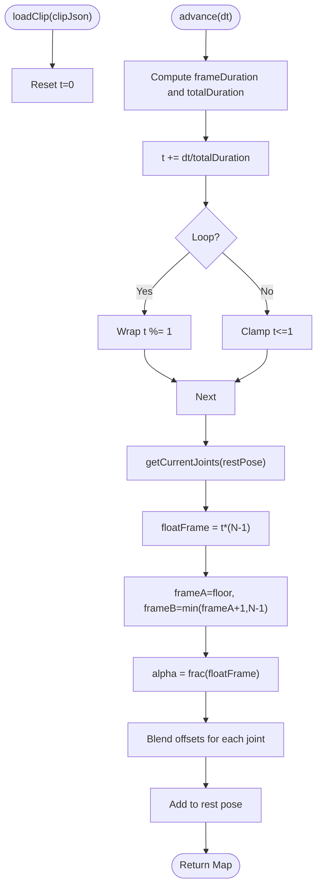
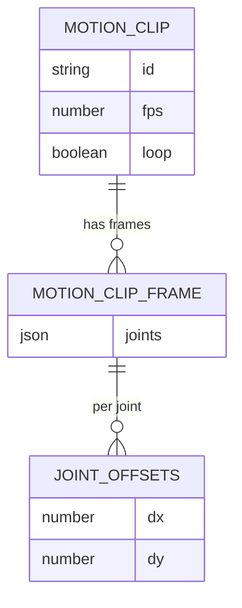
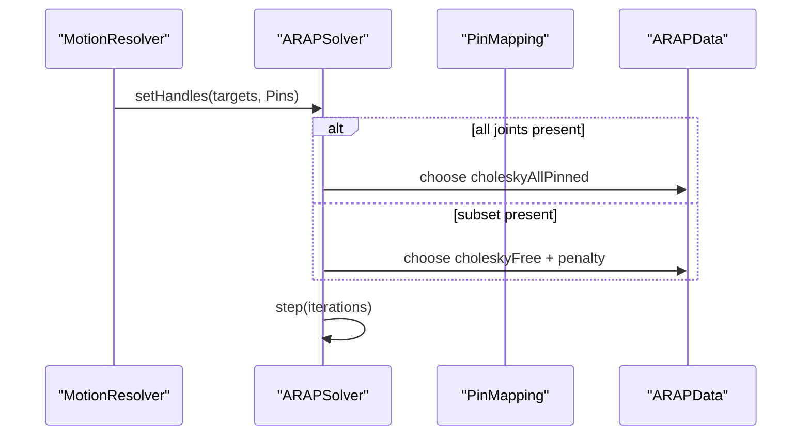
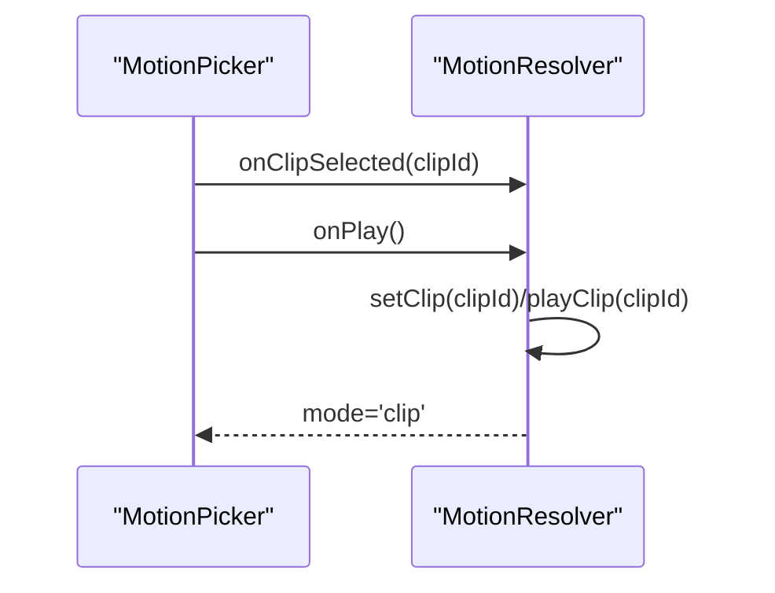
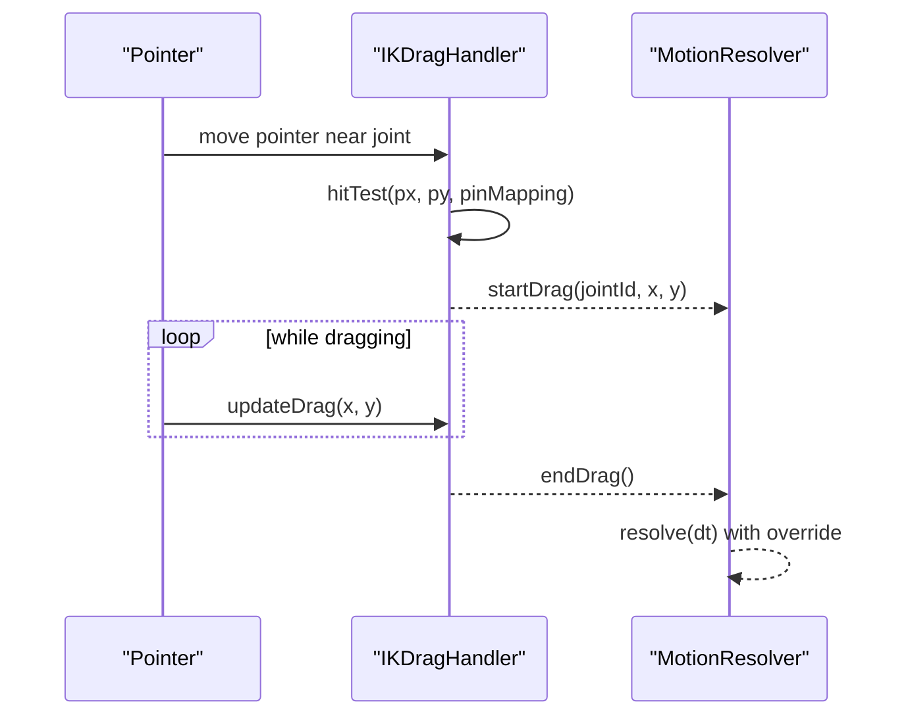
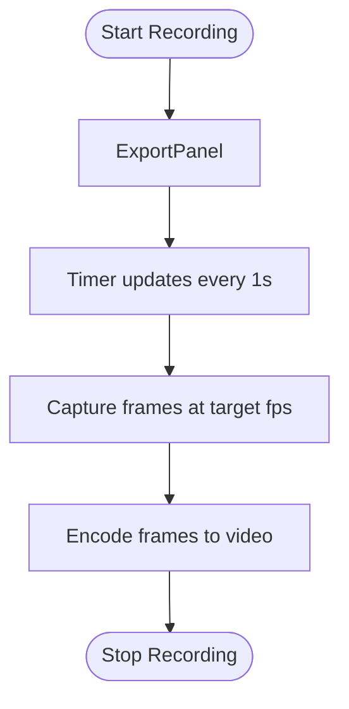
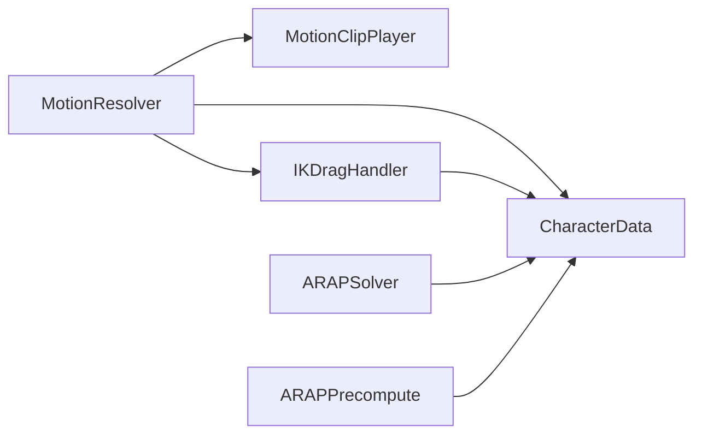

# Motion and Animation System

<cite>
**Referenced Files in This Document**
- [MotionResolver.js](file://src/motion/MotionResolver.js)
- [MotionClipPlayer.js](file://src/motion/MotionClipPlayer.js)
- [IKDragHandler.js](file://src/motion/IKDragHandler.js)
- [characterData.js](file://src/types/characterData.js)
- [ARAPSolver.js](file://src/arap/ARAPSolver.js)
- [ARAPPrecompute.js](file://src/arap/ARAPPrecompute.js)
- [MotionResolver.integration.test.js](file://src/motion/MotionResolver.integration.test.js)
- [MotionPicker.js](file://src/ui/MotionPicker.js)
- [ExportPanel.js](file://src/ui/ExportPanel.js)
- [idle.json](file://src/motion/clips/idle.json)
- [walk.json](file://src/motion/clips/walk.json)
- [run.json](file://src/motion/clips/run.json)
- [jump.json](file://src/motion/clips/jump.json)
- [dance.json](file://src/motion/clips/dance.json)
</cite>

## Table of Contents
1. [Introduction](#introduction)
2. [Project Structure](#project-structure)
3. [Core Components](#core-components)
4. [Architecture Overview](#architecture-overview)
5. [Detailed Component Analysis](#detailed-component-analysis)
6. [Dependency Analysis](#dependency-analysis)
7. [Performance Considerations](#performance-considerations)
8. [Troubleshooting Guide](#troubleshooting-guide)
9. [Conclusion](#conclusion)
10. [Appendices](#appendices)

## Introduction
This document explains PaperAlive’s motion and animation system with emphasis on animation playback, inverse kinematics, and ARAP deformation integration. It covers:
- How motion clips are loaded and managed
- How interactive pose editing works via inverse kinematics
- The motion clip format and animation data structures
- Smooth playback and timing control
- Practical examples for motion selection, interactive pose editing, and animation recording
- Performance optimization and smooth interpolation techniques

## Project Structure
The motion system lives under src/motion and integrates with ARAP deformation under src/arap. UI components under src/ui expose controls for motion selection and recording. Type definitions under src/types define the core data structures used across modules.

```mermaid
graph TB
subgraph "Motion"
MR["MotionResolver<br/>resolve()"]
MCP["MotionClipPlayer<br/>loadClip()/advance()/getCurrentJoints()"]
IKH["IKDragHandler<br/>hitTest()/startDrag()/updateDrag()"]
end
subgraph "ARAP"
ARAP["ARAPSolver<br/>setHandles()/step()"]
APC["ARAPPrecompute<br/>computeCotWeightsCSR()/buildLaplacian*()/precomputeARAP()"]
end
subgraph "Types"
CD["CharacterData<br/>PinMapping, ARAPData"]
end
subgraph "UI"
MP["MotionPicker"]
EP["ExportPanel"]
end
MR --> MCP
MR --> IKH
MR --> CD
IKH --> CD
ARAP --> CD
APC --> CD
MP --> MR
EP --> ARAP
```

**Diagram sources**
- [MotionResolver.js:21-232](file://src/motion/MotionResolver.js#L21-L232)
- [MotionClipPlayer.js:28-168](file://src/motion/MotionClipPlayer.js#L28-L168)
- [IKDragHandler.js:19-113](file://src/motion/IKDragHandler.js#L19-L113)
- [ARAPSolver.js:22-337](file://src/arap/ARAPSolver.js#L22-L337)
- [ARAPPrecompute.js:1-200](file://src/arap/ARAPPrecompute.js#L1-L200)
- [characterData.js:139-188](file://src/types/characterData.js#L139-L188)
- [MotionPicker.js:20-107](file://src/ui/MotionPicker.js#L20-L107)
- [ExportPanel.js:13-163](file://src/ui/ExportPanel.js#L13-L163)

**Section sources**
- [MotionResolver.js:1-232](file://src/motion/MotionResolver.js#L1-L232)
- [MotionClipPlayer.js:1-168](file://src/motion/MotionClipPlayer.js#L1-L168)
- [IKDragHandler.js:1-113](file://src/motion/IKDragHandler.js#L1-L113)
- [ARAPSolver.js:1-337](file://src/arap/ARAPSolver.js#L1-L337)
- [ARAPPrecompute.js:1-200](file://src/arap/ARAPPrecompute.js#L1-L200)
- [characterData.js:1-254](file://src/types/characterData.js#L1-L254)
- [MotionPicker.js:1-107](file://src/ui/MotionPicker.js#L1-L107)
- [ExportPanel.js:1-163](file://src/ui/ExportPanel.js#L1-L163)

## Core Components
- MotionResolver: Central orchestrator combining clip playback, drag IK, and idle rest pose into per-frame joint targets.
- MotionClipPlayer: Loads motion clips, advances time, interpolates frames, and computes joint positions from rest plus offsets.
- IKDragHandler: Performs pointer hit-testing against joint positions and tracks active drag targets for IK-style pose editing.
- ARAPSolver: Deforms the mesh using ARAP with strategy selection between pinned-all (motion clip) and free (IK drag).
- CharacterData: Defines the core runtime data structures, including pin mapping and ARAP precomputed data.

**Section sources**
- [MotionResolver.js:21-232](file://src/motion/MotionResolver.js#L21-L232)
- [MotionClipPlayer.js:28-168](file://src/motion/MotionClipPlayer.js#L28-L168)
- [IKDragHandler.js:19-113](file://src/motion/IKDragHandler.js#L19-L113)
- [ARAPSolver.js:22-337](file://src/arap/ARAPSolver.js#L22-L337)
- [characterData.js:139-188](file://src/types/characterData.js#L139-L188)

## Architecture Overview
MotionResolver resolves joint targets per frame by:
- Advancing the clip player when in clip mode
- Computing base targets from either clip interpolation or idle rest pose
- Overriding the dragged joint target if active

These targets are passed to ARAPSolver, which selects an appropriate strategy:
- allPinned: when all joints are resolved (motion clip)
- free: when only a subset is resolved (IK drag), augmented with penalty constraints



**Diagram sources**
- [MotionResolver.js:205-230](file://src/motion/MotionResolver.js#L205-L230)
- [MotionClipPlayer.js:78-166](file://src/motion/MotionClipPlayer.js#L78-L166)
- [IKDragHandler.js:109-111](file://src/motion/IKDragHandler.js#L109-L111)
- [ARAPSolver.js:82-325](file://src/arap/ARAPSolver.js#L82-L325)

## Detailed Component Analysis

### MotionResolver
Responsibilities:
- Build and maintain rest pose from CharacterData
- Manage clip cache and playback lifecycle
- Coordinate clip playback, drag IK, and idle mode
- Produce a Map of joint targets per frame

Key behaviors:
- Mode priority: drag > clip > idle
- On clip mode, advance playback by delta time
- On idle mode, return rest pose copies
- On drag mode, override the dragged joint target



**Diagram sources**
- [MotionResolver.js:205-230](file://src/motion/MotionResolver.js#L205-L230)

**Section sources**
- [MotionResolver.js:21-232](file://src/motion/MotionResolver.js#L21-L232)

### MotionClipPlayer
Responsibilities:
- Load motion clip JSON
- Track normalized temporal position [0,1]
- Advance playback by dt with fps and loop semantics
- Interpolate joint offsets between frames and combine with rest pose

Interpolation:
- Fractional frame index computed from normalized time
- Linear interpolation of dx/dy offsets per joint
- Offsets applied to rest pose to yield world-space joint positions



**Diagram sources**
- [MotionClipPlayer.js:78-166](file://src/motion/MotionClipPlayer.js#L78-L166)

**Section sources**
- [MotionClipPlayer.js:28-168](file://src/motion/MotionClipPlayer.js#L28-L168)

### IKDragHandler
Responsibilities:
- Maintain current joint positions from ARAP solver
- Hit-test pointer against joint positions within a radius
- Track active drag target and update its position

Usage:
- Called by MotionResolver to override a single joint target during drag mode
- Uses CharacterData pin mapping to correlate joint IDs to vertex indices

```mermaid
classDiagram
class IKDragHandler {
-Float32Array _currentPositions
-{jointId,x,y}|null _activeTarget
+setCurrentPositions(positions)
+hitTest(px, py, pinMapping) string|null
+startDrag(jointId, x, y)
+updateDrag(x, y)
+endDrag()
+getActiveTarget() Target|null
}
```

**Diagram sources**
- [IKDragHandler.js:19-113](file://src/motion/IKDragHandler.js#L19-L113)

**Section sources**
- [IKDragHandler.js:19-113](file://src/motion/IKDragHandler.js#L19-L113)

### Motion Clip Format and Data Structures
Motion clips are JSON documents with the following structure:
- id: string identifier
- fps: number frames per second (0 indicates static/single-frame)
- loop: boolean indicating whether to loop
- frames: array of MotionClipFrame objects
  - joints: object keyed by jointId with dx/dy offsets from rest pose

Representative examples:
- idle.json: static rest pose
- walk.json, run.json: periodic locomotion
- jump.json: non-looping action
- dance.json: choreographed motion



**Diagram sources**
- [MotionClipPlayer.js:13-23](file://src/motion/MotionClipPlayer.js#L13-L23)
- [idle.json:1-9](file://src/motion/clips/idle.json#L1-L9)
- [walk.json:1-32](file://src/motion/clips/walk.json#L1-L32)
- [run.json:1-32](file://src/motion/clips/run.json#L1-L32)
- [jump.json:1-20](file://src/motion/clips/jump.json#L1-L20)
- [dance.json:1-32](file://src/motion/clips/dance.json#L1-L32)

**Section sources**
- [MotionClipPlayer.js:13-23](file://src/motion/MotionClipPlayer.js#L13-L23)
- [idle.json:1-9](file://src/motion/clips/idle.json#L1-L9)
- [walk.json:1-32](file://src/motion/clips/walk.json#L1-L32)
- [run.json:1-32](file://src/motion/clips/run.json#L1-L32)
- [jump.json:1-20](file://src/motion/clips/jump.json#L1-L20)
- [dance.json:1-32](file://src/motion/clips/dance.json#L1-L32)

### MotionResolver Integration with ARAP
MotionResolver outputs joint targets that feed ARAPSolver. Strategy selection:
- allPinned: when targets include all joints (clip mode), solver pins all corresponding vertices
- free: when targets include only a subset (drag mode), solver applies penalty constraints



**Diagram sources**
- [MotionResolver.js:205-230](file://src/motion/MotionResolver.js#L205-L230)
- [ARAPSolver.js:82-122](file://src/arap/ARAPSolver.js#L82-L122)

**Section sources**
- [MotionResolver.integration.test.js:42-256](file://src/motion/MotionResolver.integration.test.js#L42-L256)
- [ARAPSolver.js:82-122](file://src/arap/ARAPSolver.js#L82-L122)

### Practical Examples

#### Motion Selection
- Use MotionPicker to select a clip (idle, walk, run, jump, wave, dance)
- Call MotionResolver.setClip(clipId) to switch modes
- For idle, pass null to return to rest pose



**Diagram sources**
- [MotionPicker.js:28-95](file://src/ui/MotionPicker.js#L28-L95)
- [MotionResolver.js:118-164](file://src/motion/MotionResolver.js#L118-L164)

**Section sources**
- [MotionPicker.js:20-107](file://src/ui/MotionPicker.js#L20-L107)
- [MotionResolver.js:118-164](file://src/motion/MotionResolver.js#L118-L164)

#### Interactive Pose Editing
- Hit-test pointer against joint positions using IKDragHandler.hitTest
- Start dragging a joint with startDrag and updateDrag continuously
- MotionResolver.resolve will override the dragged joint target
- End drag to return to pure clip or idle



**Diagram sources**
- [IKDragHandler.js:51-111](file://src/motion/IKDragHandler.js#L51-L111)
- [MotionResolver.js:224-227](file://src/motion/MotionResolver.js#L224-L227)

**Section sources**
- [IKDragHandler.js:51-111](file://src/motion/IKDragHandler.js#L51-L111)
- [MotionResolver.js:224-227](file://src/motion/MotionResolver.js#L224-L227)

#### Animation Recording
- Use ExportPanel to start/stop recording
- While recording, capture frames at a lower rate (e.g., 30 fps) while the live preview runs at higher FPS
- Combine recorded frames into a video using VideoExporter



**Diagram sources**
- [ExportPanel.js:89-135](file://src/ui/ExportPanel.js#L89-L135)

**Section sources**
- [ExportPanel.js:13-163](file://src/ui/ExportPanel.js#L13-L163)

## Dependency Analysis
- MotionResolver depends on MotionClipPlayer and IKDragHandler and consumes CharacterData (rest pose, pin mapping)
- ARAPSolver consumes CharacterData (geometry, ARAP precomputed data) and receives joint targets from MotionResolver
- ARAPPrecompute builds the ARAPData used by ARAPSolver



**Diagram sources**
- [MotionResolver.js:15-46](file://src/motion/MotionResolver.js#L15-L46)
- [ARAPSolver.js:26-59](file://src/arap/ARAPSolver.js#L26-L59)
- [ARAPPrecompute.js:16-22](file://src/arap/ARAPPrecompute.js#L16-L22)
- [characterData.js:139-188](file://src/types/characterData.js#L139-L188)

**Section sources**
- [MotionResolver.js:15-46](file://src/motion/MotionResolver.js#L15-L46)
- [ARAPSolver.js:26-59](file://src/arap/ARAPSolver.js#L26-L59)
- [ARAPPrecompute.js:16-22](file://src/arap/ARAPPrecompute.js#L16-L22)
- [characterData.js:139-188](file://src/types/characterData.js#L139-L188)

## Performance Considerations
- Zero-allocation constraints: ARAPSolver avoids heap allocations inside hot paths by reusing pre-allocated buffers for SVD workspace and solve vectors.
- Precomputation: ARAPPrecompute computes cotangent weights, Laplacians, and Cholesky factors once during preprocessing to accelerate runtime.
- Time advancement: MotionClipPlayer advances normalized time using dt and fps, with optional wrapping for looping.
- Strategy selection: Using allPinned when all joints are resolved reduces computational overhead compared to penalty-based free mode.

[No sources needed since this section provides general guidance]

## Troubleshooting Guide
Common issues and checks:
- NaN propagation: Integration tests verify that solver positions remain finite under various clips and drag scenarios.
- Mode transitions: Ensure setClip(null) returns to idle and endDrag() clears active targets.
- Rest pose correctness: Verify restPose is built from CharacterData pin mapping and geometry vertices0.

**Section sources**
- [MotionResolver.integration.test.js:122-146](file://src/motion/MotionResolver.integration.test.js#L122-L146)
- [MotionResolver.js:130-133](file://src/motion/MotionResolver.js#L130-L133)
- [MotionResolver.js:224-227](file://src/motion/MotionResolver.js#L224-L227)

## Conclusion
PaperAlive’s motion and animation system cleanly separates concerns:
- MotionResolver orchestrates playback, drag IK, and idle rest pose
- MotionClipPlayer provides robust frame interpolation and timing control
- IKDragHandler enables intuitive interactive pose editing
- ARAPSolver delivers physically plausible deformation with efficient strategy selection
- The motion clip format is compact and expressive, enabling diverse animations

Together, these components support smooth, responsive character animation suitable for real-time interactive experiences.

[No sources needed since this section summarizes without analyzing specific files]

## Appendices

### Data Model Summary
- CharacterData: central runtime data including geometry, skeleton, pin mapping, and ARAP precomputed data
- PinMapping: maps joint IDs to nearest mesh vertex indices
- ARAPData: includes Cholesky factors and workspace buffers

**Section sources**
- [characterData.js:139-188](file://src/types/characterData.js#L139-L188)