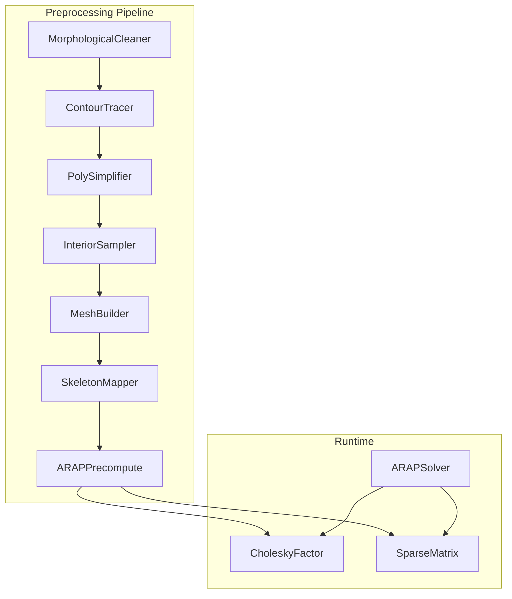
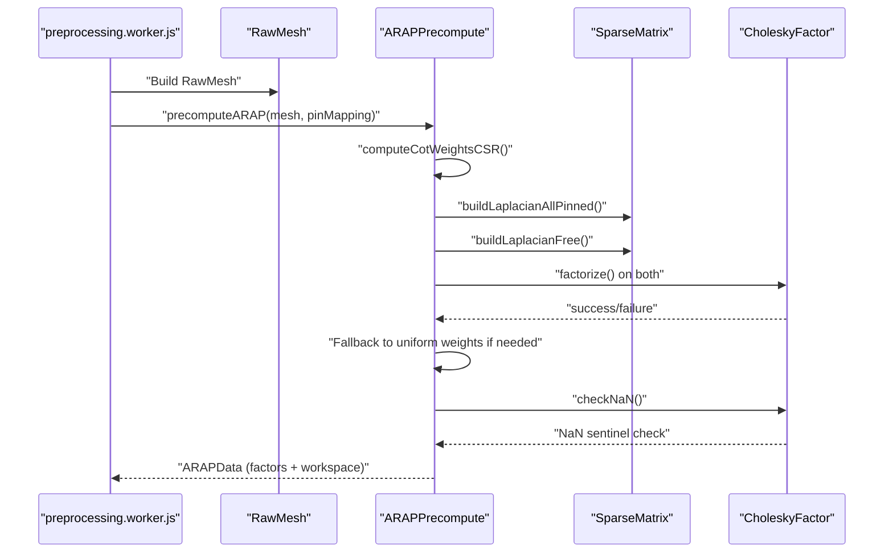
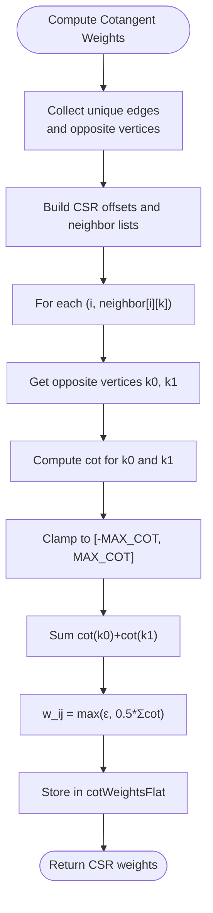
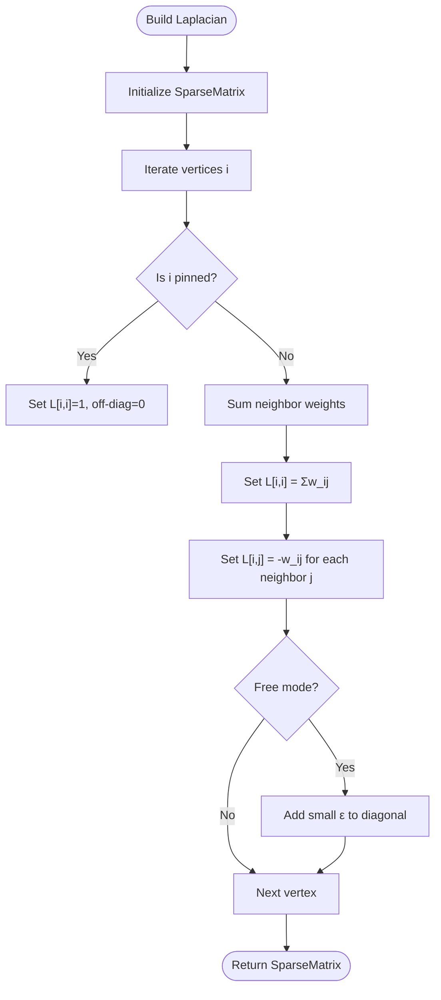
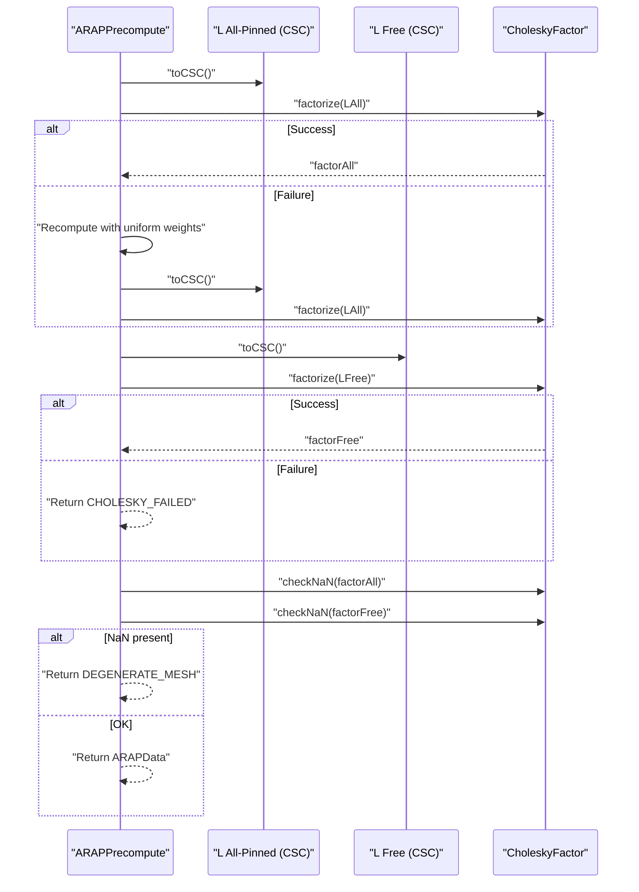
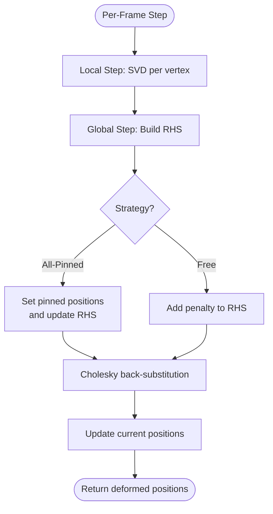
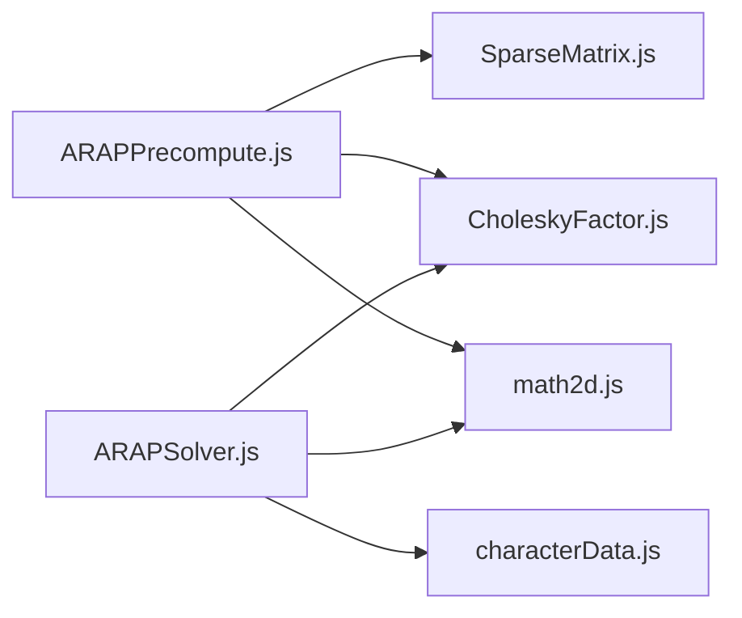

# ARAP Precomputation

<cite>
**Referenced Files in This Document**
- [ARAPPrecompute.js](file://src/arap/ARAPPrecompute.js)
- [ARAPSolver.js](file://src/arap/ARAPSolver.js)
- [SparseMatrix.js](file://src/arap/sparse/SparseMatrix.js)
- [CholeskyFactor.js](file://src/arap/sparse/CholeskyFactor.js)
- [math2d.js](file://src/utils/math2d.js)
- [preprocessing.worker.js](file://src/character/workers/preprocessing.worker.js)
- [characterData.js](file://src/types/characterData.js)
- [arapTestFixture.js](file://src/arap/arapTestFixture.js)
- [module_design.md](file://architecture/module_design.md)
</cite>

## Table of Contents
1. [Introduction](#introduction)
2. [Project Structure](#project-structure)
3. [Core Components](#core-components)
4. [Architecture Overview](#architecture-overview)
5. [Detailed Component Analysis](#detailed-component-analysis)
6. [Dependency Analysis](#dependency-analysis)
7. [Performance Considerations](#performance-considerations)
8. [Troubleshooting Guide](#troubleshooting-guide)
9. [Conclusion](#conclusion)
10. [Appendices](#appendices)

## Introduction
This document explains the ARAP Precomputation module that powers PaperAlive’s deformation algorithms. It focuses on:
- Mathematical foundation: cotangent weight computation for triangle meshes, including geometric derivation and numerical stability.
- Laplacian matrix construction from vertex positions and connectivity, and its translation into sparse matrix representations.
- The precomputation phase that prepares dual Cholesky factors and workspace buffers for real-time simulation.
- Practical guidance for parameter tuning across mesh complexities, performance optimization for large datasets, and fallback strategies for degenerate triangles.
- The mathematical basis of ARAP energy minimization and computational requirements for batch processing.

## Project Structure
The ARAP module is composed of:
- Precomputation: cotangent weights, Laplacian construction, dual Cholesky factorization, and workspace assembly.
- Solver: per-frame ARAP deformation using local SVD and global back-substitution.
- Sparse infrastructure: coordinate and compressed sparse column (CSC) representations, and Cholesky decomposition.
- Worker pipeline: preprocessing pipeline that runs off the main thread and returns a fully assembled CharacterData object.

**Diagram sources**
- [preprocessing.worker.js:625-629](file://src/character/workers/preprocessing.worker.js#L625-L629)
- [ARAPPrecompute.js:1-388](file://src/arap/ARAPPrecompute.js#L1-L388)
- [ARAPSolver.js:1-337](file://src/arap/ARAPSolver.js#L1-L337)
- [SparseMatrix.js:1-195](file://src/arap/sparse/SparseMatrix.js#L1-L195)
- [CholeskyFactor.js:1-247](file://src/arap/sparse/CholeskyFactor.js#L1-L247)

**Section sources**
- [module_design.md:586-631](file://architecture/module_design.md#L586-L631)
- [preprocessing.worker.js:86-192](file://src/character/workers/preprocessing.worker.js#L86-L192)

## Core Components
- Cotangent weight computation with mandatory clamping and robust handling of degenerate triangles.
- Laplacian construction in CSR format with support for pinned and free modes.
- Dual Cholesky factorization with fallback to uniform weights and NaN sentinel checks.
- Runtime solver using local SVD per vertex and global back-substitution with strategy selection.

**Section sources**
- [ARAPPrecompute.js:25-107](file://src/arap/ARAPPrecompute.js#L25-L107)
- [ARAPPrecompute.js:121-188](file://src/arap/ARAPPrecompute.js#L121-L188)
- [ARAPPrecompute.js:206-296](file://src/arap/ARAPPrecompute.js#L206-L296)
- [ARAPSolver.js:136-200](file://src/arap/ARAPSolver.js#L136-L200)
- [ARAPSolver.js:212-309](file://src/arap/ARAPSolver.js#L212-L309)

## Architecture Overview
The ARAP pipeline transforms a raw mesh into a runtime-ready representation:
- Cotangent weights are computed per edge and stored in CSR format.
- Two Laplacians are constructed: one with pinned rows and one free with regularization.
- Dual Cholesky factorization yields two factors for strategy selection.
- Workspace buffers are pre-allocated for zero-allocation per-frame deformation.

**Diagram sources**
- [preprocessing.worker.js:159-173](file://src/character/workers/preprocessing.worker.js#L159-L173)
- [ARAPPrecompute.js:206-296](file://src/arap/ARAPPrecompute.js#L206-L296)
- [CholeskyFactor.js:57-145](file://src/arap/sparse/CholeskyFactor.js#L57-L145)

## Detailed Component Analysis

### Cotangent Weight Computation (CSR)
- Purpose: Assign a scalar weight to each edge representing geometric affinity between adjacent triangles.
- Geometric derivation: For each edge shared by two triangles, compute the cotangent of the two opposite angles and average them, clamped to a finite range and scaled by 0.5.
- Numerical stability:
  - Cotangent is computed as the dot product divided by the cross product magnitude; near-degenerate triangles are clamped to large but finite values.
  - A strict lower bound ensures weights remain positive and avoids ill-conditioning.
  - Edge keys are canonicalized to ensure consistent pairing across triangles.

**Diagram sources**
- [ARAPPrecompute.js:34-107](file://src/arap/ARAPPrecompute.js#L34-L107)
- [ARAPPrecompute.js:364-373](file://src/arap/ARAPPrecompute.js#L364-L373)

**Section sources**
- [ARAPPrecompute.js:25-107](file://src/arap/ARAPPrecompute.js#L25-L107)
- [ARAPPrecompute.js:364-373](file://src/arap/ARAPPrecompute.js#L364-L373)
- [math2d.js:421-459](file://src/utils/math2d.js#L421-L459)

### Laplacian Matrix Construction (CSR)
- Purpose: Encode smoothness constraints among neighboring vertices.
- Construction:
  - Diagonal entries equal the sum of incident weights.
  - Off-diagonal entries equal minus the shared weight between neighbors.
  - Pinned vertices set identity rows; free mode adds small diagonal regularization to ensure positive definiteness.
- Sparse representation:
  - CSR arrays: neighborOffsets, neighborList, cotWeightsFlat.
  - Symmetric structure preserved; CSR enables efficient neighbor traversal.

**Diagram sources**
- [ARAPPrecompute.js:121-151](file://src/arap/ARAPPrecompute.js#L121-L151)
- [ARAPPrecompute.js:161-188](file://src/arap/ARAPPrecompute.js#L161-L188)

**Section sources**
- [ARAPPrecompute.js:121-188](file://src/arap/ARAPPrecompute.js#L121-L188)

### Dual Cholesky Factorization and Fallback Strategy
- Purpose: Precompute two Cholesky factors for strategy selection at runtime.
- Process:
  - Convert Laplacians to CSC format.
  - Factorize A = L·L^T; if factorization fails, fall back to uniform weights and retry.
  - Perform NaN sentinel check on both factors.
- Runtime selection:
  - All joints pinned → use allPinned factor.
  - Subset dragged (IK) → use free factor with penalty constraints.

**Diagram sources**
- [ARAPPrecompute.js:206-296](file://src/arap/ARAPPrecompute.js#L206-L296)
- [CholeskyFactor.js:57-145](file://src/arap/sparse/CholeskyFactor.js#L57-L145)

**Section sources**
- [ARAPPrecompute.js:206-296](file://src/arap/ARAPPrecompute.js#L206-L296)
- [CholeskyFactor.js:57-145](file://src/arap/sparse/CholeskyFactor.js#L57-L145)

### Runtime Solver: Local Step (SVD) and Global Step (Back-Substitution)
- Local step:
  - For each vertex, accumulate a covariance matrix from weighted edge differences between rest and current positions.
  - Compute 2×2 SVD to extract optimal rotation ensuring determinant +1.
- Global step:
  - Build right-hand side from rotated neighbors and rest edges.
  - Inject constraints (pinned rows or penalty terms).
  - Solve L·L^T·x = b via forward/backward substitution using the selected Cholesky factor.

**Diagram sources**
- [ARAPSolver.js:136-200](file://src/arap/ARAPSolver.js#L136-L200)
- [ARAPSolver.js:212-309](file://src/arap/ARAPSolver.js#L212-L309)

**Section sources**
- [ARAPSolver.js:136-200](file://src/arap/ARAPSolver.js#L136-L200)
- [ARAPSolver.js:212-309](file://src/arap/ARAPSolver.js#L212-L309)
- [math2d.js:264-420](file://src/utils/math2d.js#L264-L420)

### Mathematical Foundation: ARAP Energy Minimization
- Objective: Minimize a sum of squared Frobenius norms of local displacement differences, weighted by cotangent weights.
- Energy formulation:
  - For each edge (i, j), the local mismatch is measured by ||R_i (p_i^0 - p_j^0) - (p_i - p_j)||^2, where R_i is the optimal rotation around vertex i.
  - The global system ∇_p E = 0 yields a sparse linear system with a Laplacian-like structure.
- Discretization:
  - Cotangent weights approximate inverse edge lengths and angle distributions, stabilizing the system against degenerate triangles.
  - The dual formulation (using cotangent weights) improves conditioning compared to uniform weights.

[No sources needed since this section provides general mathematical context]

## Dependency Analysis
- ARAPPrecompute depends on:
  - SparseMatrix for COO/CSC conversions and symmetry checks.
  - CholeskyFactor for LL^T decomposition and back-substitution.
  - math2d utilities for SVD and cotangent computations.
- ARAPSolver depends on:
  - Precomputed ARAPData (weights, Laplacian CSR, Cholesky factors, workspace).
  - math2d for 2×2 SVD in the local step.

**Diagram sources**
- [ARAPPrecompute.js:16-17](file://src/arap/ARAPPrecompute.js#L16-L17)
- [ARAPSolver.js:14-15](file://src/arap/ARAPSolver.js#L14-L15)
- [characterData.js:115-130](file://src/types/characterData.js#L115-L130)

**Section sources**
- [ARAPPrecompute.js:16-17](file://src/arap/ARAPPrecompute.js#L16-L17)
- [ARAPSolver.js:14-15](file://src/arap/ARAPSolver.js#L14-L15)
- [characterData.js:115-130](file://src/types/characterData.js#L115-L130)

## Performance Considerations
- Mesh complexity:
  - Typical vertex counts up to 400; matrices fit comfortably in dense column-major storage for factorization.
  - For larger meshes, consider:
    - Increasing vertex budgets adaptively with PolySimplifier.
    - Using uniform weights fallback to preserve numerical stability.
- Memory:
  - Pre-allocate workspace buffers to avoid allocations in the render loop.
  - Use Transferable TypedArrays in the worker to minimize copies.
- Numerical stability:
  - Cotangent clamping prevents extreme weights.
  - Small diagonal regularization in free mode ensures positive definiteness.
- Batch processing:
  - Precompute once per character; reuse ARAPData across frames.
  - Use dual Cholesky to switch strategies without recomputation.

[No sources needed since this section provides general guidance]

## Troubleshooting Guide
Common issues and resolutions:
- Cholesky factorization failures:
  - Trigger uniform weights fallback; if still failing, inspect mesh quality and reduce complexity.
- Degenerate meshes:
  - Expect fallback to uniform weights; verify NaN sentinel detection.
- Poor deformation quality:
  - Increase iterations in ARAPSolver.step().
  - Adjust pin mapping to ensure meaningful constraints.

**Section sources**
- [ARAPPrecompute.js:229-251](file://src/arap/ARAPPrecompute.js#L229-L251)
- [ARAPPrecompute.js:259-267](file://src/arap/ARAPPrecompute.js#L259-L267)
- [ARAPPrecompute.test.js:234-265](file://src/arap/ARAPPrecompute.test.js#L234-L265)
- [ARAPPrecompute.test.js:317-343](file://src/arap/ARAPPrecompute.test.js#L317-L343)

## Conclusion
The ARAP Precomputation module establishes a numerically robust, worker-safe pipeline that converts triangle meshes into runtime-ready deformation data. By combining cotangent-weighted Laplacians, dual Cholesky factorization, and zero-allocation solvers, PaperAlive achieves interactive, high-quality deformations across diverse mesh complexities.

[No sources needed since this section summarizes without analyzing specific files]

## Appendices

### Practical Parameter Tuning
- Cotangent clamping:
  - Lower bound ε controls minimal edge influence; keep ≥ 1e-6.
  - Upper/lower bounds for cotangent clamp stabilize extreme angles.
- Regularization:
  - Free mode receives small diagonal perturbation to avoid singular null space.
- Iterations:
  - Two iterations in ARAPSolver.step() balance speed and convergence.

**Section sources**
- [ARAPPrecompute.js:19-21](file://src/arap/ARAPPrecompute.js#L19-L21)
- [ARAPPrecompute.js:181-185](file://src/arap/ARAPPrecompute.js#L181-L185)
- [ARAPSolver.js:318-325](file://src/arap/ARAPSolver.js#L318-L325)

### Data Model: ARAPData
- Cotangent weights and CSR structure for neighbor traversal.
- Laplacian in sparse CSR form.
- Dual Cholesky factors and pre-allocated workspace buffers.

**Section sources**
- [characterData.js:115-130](file://src/types/characterData.js#L115-L130)