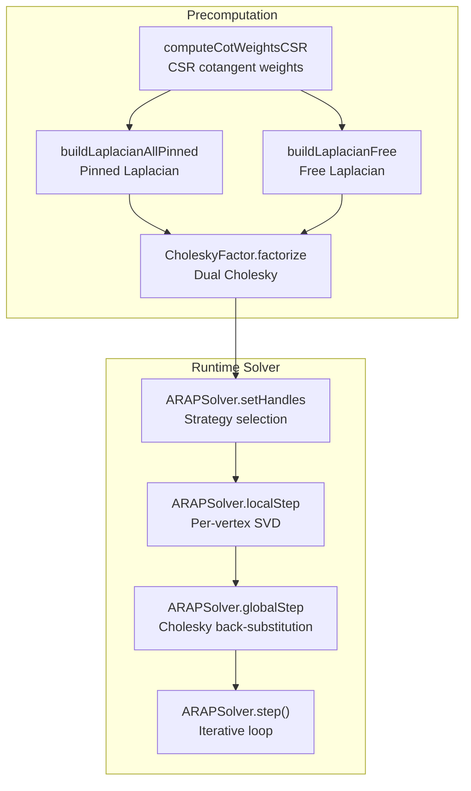
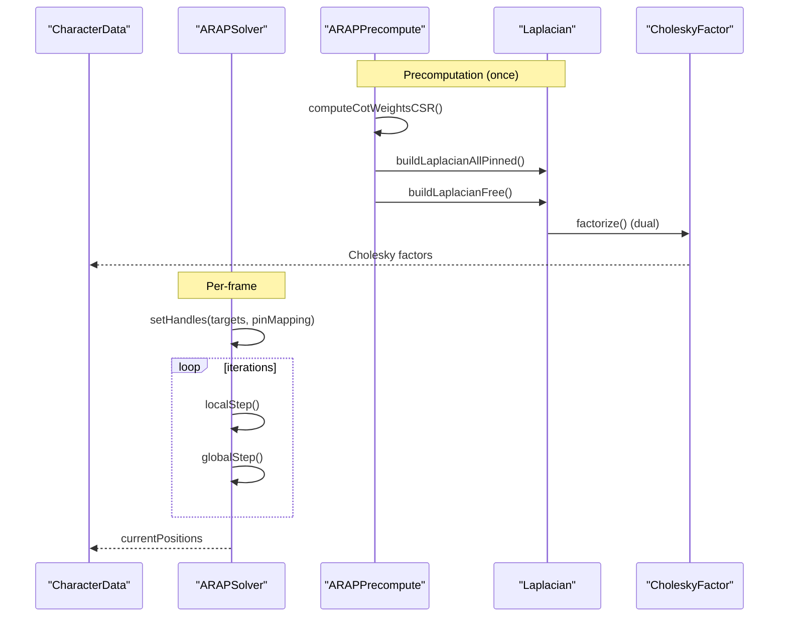
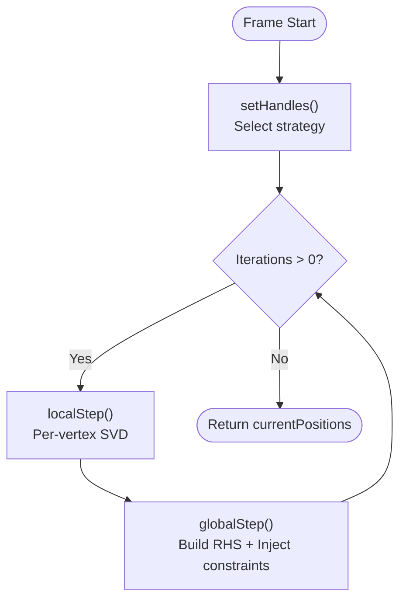
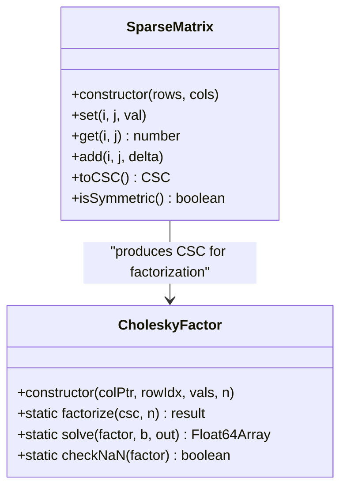
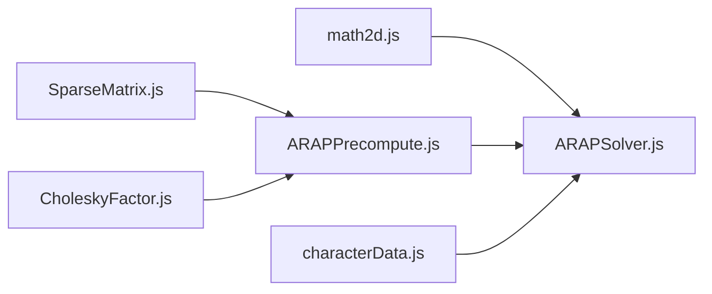

# ARAP Solver

<cite>
**Referenced Files in This Document**
- [ARAPSolver.js](file://src/arap/ARAPSolver.js)
- [ARAPPrecompute.js](file://src/arap/ARAPPrecompute.js)
- [SparseMatrix.js](file://src/arap/sparse/SparseMatrix.js)
- [CholeskyFactor.js](file://src/arap/sparse/CholeskyFactor.js)
- [math2d.js](file://src/utils/math2d.js)
- [characterData.js](file://src/types/characterData.js)
- [arapTestFixture.js](file://src/arap/arapTestFixture.js)
- [ARAPSolver.test.js](file://src/arap/ARAPSolver.test.js)
- [ARAPPrecompute.test.js](file://src/arap/ARAPPrecompute.test.js)
- [TASK-054-073-epic6-arap.md](file://implementation/tasks/TASK-054-073-epic6-arap.md)
</cite>

## Table of Contents
1. [Introduction](#introduction)
2. [Project Structure](#project-structure)
3. [Core Components](#core-components)
4. [Architecture Overview](#architecture-overview)
5. [Detailed Component Analysis](#detailed-component-analysis)
6. [Dependency Analysis](#dependency-analysis)
7. [Performance Considerations](#performance-considerations)
8. [Troubleshooting Guide](#troubleshooting-guide)
9. [Conclusion](#conclusion)
10. [Appendices](#appendices)

## Introduction
This document explains the ARAP (As-Rigid-As-Possible) Solver component responsible for real-time physics simulation and iterative deformation of a 2D mesh. It covers the solver’s iterative approach, convergence characteristics, boundary condition handling, joint constraints, and integration with precomputed matrices. It also documents configuration, performance tuning, stability optimization, and error handling for numerical instabilities.

## Project Structure
The ARAP system is organized around a precomputation phase and a per-frame solver:
- Precomputation computes cotangent weights, builds Laplacian matrices, and performs dual Cholesky factorizations.
- Runtime solver executes local and global steps each frame, driven by joint targets and constraints.

**Diagram sources**
- [ARAPPrecompute.js:16](file://src/arap/ARAPPrecompute.js#L16)
- [CholeskyFactor.js:18](file://src/arap/sparse/CholeskyFactor.js#L18)
- [ARAPSolver.js:22](file://src/arap/ARAPSolver.js#L22)

**Section sources**
- [ARAPPrecompute.js:16](file://src/arap/ARAPPrecompute.js#L16)
- [ARAPSolver.js:22](file://src/arap/ARAPSolver.js#L22)

## Core Components
- ARAPPrecompute: Computes weights, constructs Laplacians, and precomputes dual Cholesky factors with fallback and NaN checks.
- ARAPSolver: Performs iterative ARAP deformation each frame using local SVD and global back-substitution.
- SparseMatrix and CholeskyFactor: Low-level sparse linear algebra primitives.
- math2d: 2D math utilities including SVD and cotangent computations.
- Types: Strongly typed runtime data structures for CharacterData and ARAPData.

**Section sources**
- [ARAPPrecompute.js:16](file://src/arap/ARAPPrecompute.js#L16)
- [ARAPSolver.js:22](file://src/arap/ARAPSolver.js#L22)
- [SparseMatrix.js:16](file://src/arap/sparse/SparseMatrix.js#L16)
- [CholeskyFactor.js:18](file://src/arap/sparse/CholeskyFactor.js#L18)
- [math2d.js:12](file://src/utils/math2d.js#L12)
- [characterData.js:134](file://src/types/characterData.js#L134)

## Architecture Overview
The solver follows a classic two-stage ARAP pipeline:
- Local step: For each vertex, compute a covariance matrix from neighboring edges and decompose it via SVD to obtain a rotation matrix.
- Global step: Assemble right-hand sides from rotations, inject boundary or penalty constraints, and solve a sparse linear system using Cholesky decomposition.

**Diagram sources**
- [ARAPPrecompute.js:206](file://src/arap/ARAPPrecompute.js#L206)
- [ARAPSolver.js:82](file://src/arap/ARAPSolver.js#L82)
- [ARAPSolver.js:319](file://src/arap/ARAPSolver.js#L319)

## Detailed Component Analysis

### ARAPPrecompute
Responsibilities:
- Cotangent weights in CSR format with mandatory clamping to avoid degeneracies.
- Laplacian construction for both pinned and free modes.
- Dual Cholesky factorization with fallback to uniform weights and NaN sentinel checks.
- Workspace allocation for solver buffers.

Key behaviors:
- Cotangent weights are clamped to a small positive constant and symmetrically stored in CSR.
- Pinned Laplacian sets diagonal rows to identity for pinned vertices; free Laplacian adds small regularization to ensure positive definiteness.
- Fallback strategy: if Cholesky fails with cotangent weights, rebuild with uniform weights; if both fail, return a structured error.
- Workspace arrays are pre-allocated to support zero-allocation solver loops.

Practical implications:
- Degenerate meshes trigger uniform weight fallback; extremely poor meshes may still fail.
- Workspace arrays enable efficient solver execution without per-frame allocations.

**Section sources**
- [ARAPPrecompute.js:34](file://src/arap/ARAPPrecompute.js#L34)
- [ARAPPrecompute.js:121](file://src/arap/ARAPPrecompute.js#L121)
- [ARAPPrecompute.js:161](file://src/arap/ARAPPrecompute.js#L161)
- [ARAPPrecompute.js:206](file://src/arap/ARAPPrecompute.js#L206)
- [ARAPPrecompute.js:269](file://src/arap/ARAPPrecompute.js#L269)

### ARAPSolver
Responsibilities:
- Iterative ARAP solver with configurable iteration count.
- Strategy selection between all-pinned (motion clip) and free (IK drag) modes.
- Zero-allocation design: pre-allocates buffers and avoids new allocations inside localStep/globalStep.

Local step (per-vertex SVD):
- Builds a 2×2 covariance matrix per vertex from cotangent-weighted edges.
- Applies SVD to extract a proper rotation matrix for each vertex.
- Stores rotations in a pre-allocated workspace.

Global step (back-substitution):
- Constructs RHS from rotations and neighbor interactions.
- Injects constraints:
  - All-pinned: pins selected vertices to targets and updates RHS accordingly.
  - Free: applies penalty constraints scaled by a large weight.
- Solves the sparse linear system using Cholesky back-substitution and updates current positions.

Iteration control:
- step(iterations) repeats localStep + globalStep the specified number of times.

Reset:
- Resets current positions to rest pose.

**Diagram sources**
- [ARAPSolver.js:82](file://src/arap/ARAPSolver.js#L82)
- [ARAPSolver.js:136](file://src/arap/ARAPSolver.js#L136)
- [ARAPSolver.js:212](file://src/arap/ARAPSolver.js#L212)
- [ARAPSolver.js:319](file://src/arap/ARAPSolver.js#L319)

**Section sources**
- [ARAPSolver.js:22](file://src/arap/ARAPSolver.js#L22)
- [ARAPSolver.js:136](file://src/arap/ARAPSolver.js#L136)
- [ARAPSolver.js:212](file://src/arap/ARAPSolver.js#L212)
- [ARAPSolver.js:319](file://src/arap/ARAPSolver.js#L319)

### SparseMatrix and CholeskyFactor
SparseMatrix:
- COO triplet storage with duplicate accumulation on CSC conversion.
- Provides toCSC() for conversion to CSC format and isSymmetric() checks.

CholeskyFactor:
- Computes LL^T factorization for sparse SPD matrices.
- Provides solve() via forward/backward substitution.
- Includes NaN sentinel check to detect invalid factors.

**Diagram sources**
- [SparseMatrix.js:16](file://src/arap/sparse/SparseMatrix.js#L16)
- [CholeskyFactor.js:18](file://src/arap/sparse/CholeskyFactor.js#L18)

**Section sources**
- [SparseMatrix.js:16](file://src/arap/sparse/SparseMatrix.js#L16)
- [CholeskyFactor.js:18](file://src/arap/sparse/CholeskyFactor.js#L18)

### math2d Utilities
- SVD 2×2 with analytic Jacobi method and in-place variants to avoid allocations.
- Cotangent computation with robust clamping for degenerate triangles.

**Section sources**
- [math2d.js:264](file://src/utils/math2d.js#L264)
- [math2d.js:354](file://src/utils/math2d.js#L354)
- [math2d.js:436](file://src/utils/math2d.js#L436)

### Types and Data Contracts
- CharacterData: Central runtime structure containing geometry, skeleton, pin mapping, and ARAP precomputed data.
- ARAPData: Cotangent weights, neighbor CSR, pinned vertex flags, Cholesky factors, and solver workspace.

**Section sources**
- [characterData.js:134](file://src/types/characterData.js#L134)
- [characterData.js:115](file://src/types/characterData.js#L115)

## Dependency Analysis
- ARAPPrecompute depends on SparseMatrix and CholeskyFactor to construct and factorize Laplacians.
- ARAPSolver depends on CharacterData (including ARAPData) and math2d utilities.
- math2d is a utility library used by ARAPSolver’s local step.

**Diagram sources**
- [ARAPSolver.js:14](file://src/arap/ARAPSolver.js#L14)
- [ARAPPrecompute.js:16](file://src/arap/ARAPPrecompute.js#L16)
- [characterData.js:134](file://src/types/characterData.js#L134)

**Section sources**
- [ARAPSolver.js:14](file://src/arap/ARAPSolver.js#L14)
- [ARAPPrecompute.js:16](file://src/arap/ARAPPrecompute.js#L16)
- [characterData.js:134](file://src/types/characterData.js#L134)

## Performance Considerations
- Zero-allocation design: All solver buffers are pre-allocated in constructors and reused per frame.
- Local step uses in-place SVD to avoid allocations.
- Global step writes RHS into pre-allocated workspace and solves in place.
- Precomputation uses CSR for efficient neighbor traversal and avoids repeated recomputation.
- Fallback to uniform weights reduces risk of numerical failure on degenerate meshes.

Practical tuning tips:
- Adjust iteration count in step() to balance quality vs. speed.
- Prefer cotangent weights for better conditioning; uniform weights are a safe fallback.
- Monitor solver workspace sizes; they scale with vertex count.

[No sources needed since this section provides general guidance]

## Troubleshooting Guide
Common issues and resolutions:
- Cholesky factorization failure:
  - Cause: Poor mesh quality or ill-conditioned weights.
  - Resolution: Uniform weight fallback is attempted automatically; if still failing, inspect mesh quality or reduce vertex count.
- Degenerate mesh detected:
  - Cause: NaN values in Cholesky factors after successful factorization.
  - Resolution: Re-run preprocessing with stricter mesh cleaning or switch to uniform weights.
- Stuck or jittery deformation:
  - Cause: Too few iterations or aggressive penalty weights.
  - Resolution: Increase iterations; tune penalty weight; ensure joint targets are reasonable.
- Memory growth during long sessions:
  - Cause: Unexpected allocations in solver loops.
  - Resolution: Verify zero-allocation behavior; ensure no new arrays are created in localStep/globalStep.

**Section sources**
- [ARAPPrecompute.js:243](file://src/arap/ARAPPrecompute.js#L243)
- [ARAPPrecompute.js:260](file://src/arap/ARAPPrecompute.js#L260)
- [ARAPSolver.test.js:188](file://src/arap/ARAPSolver.test.js#L188)
- [ARAPPrecompute.test.js:317](file://src/arap/ARAPPrecompute.test.js#L317)

## Conclusion
The ARAP Solver integrates tightly with precomputed matrices to deliver real-time, iterative deformation. Its zero-allocation design and dual Cholesky factorization enable stable, high-quality results across a variety of meshes and configurations. Proper tuning of iterations, weights, and constraints yields excellent visual fidelity while maintaining performance.

[No sources needed since this section summarizes without analyzing specific files]

## Appendices

### Practical Solver Configuration Examples
- Strategy selection:
  - All joints pinned: motion clip mode; solver selects the all-pinned Cholesky factor and pins vertices to targets.
  - Subset of joints: IK drag mode; solver selects the free Cholesky factor and applies penalty constraints.
- Iteration count:
  - Typical values: 2–4; higher values improve smoothness but cost more CPU.
- Penalty weight:
  - Large fixed weight is used for IK targets; adjust if you observe overshoot or instability.
- Workspace and buffers:
  - Pre-allocated; no action needed unless changing mesh resolution.

**Section sources**
- [ARAPSolver.js:82](file://src/arap/ARAPSolver.js#L82)
- [ARAPSolver.js:319](file://src/arap/ARAPSolver.js#L319)
- [ARAPPrecompute.js:269](file://src/arap/ARAPPrecompute.js#L269)

### Relationship Between Parameters and Simulation Quality
- Cotangent weights: Better conditioning improves convergence and stability.
- Uniform weights fallback: Ensures solvability on degenerate meshes at the cost of reduced fidelity.
- Iterations: More iterations generally yield smoother, more accurate deformation.
- Penalty weight: Controls how strongly IK targets pull the mesh; too high may cause oscillation.

**Section sources**
- [ARAPPrecompute.js:206](file://src/arap/ARAPPrecompute.js#L206)
- [ARAPPrecompute.js:230](file://src/arap/ARAPPrecompute.js#L230)
- [ARAPSolver.js:17](file://src/arap/ARAPSolver.js#L17)

### Convergence Criteria and Stopping Conditions
- Iterative stopping:
  - The solver runs a fixed number of iterations per frame. There is no adaptive residual-based stopping in the current implementation.
- Practical stopping:
  - Stop when deformation changes fall below a small threshold (not implemented); alternatively, cap iterations to limit CPU time.
- Stability safeguards:
  - Cotangent clamping and regularization prevent extreme stiffness or softness.
  - NaN sentinel detection prevents unstable solutions from propagating.

**Section sources**
- [ARAPSolver.js:319](file://src/arap/ARAPSolver.js#L319)
- [ARAPPrecompute.js:19](file://src/arap/ARAPPrecompute.js#L19)
- [ARAPPrecompute.js:181](file://src/arap/ARAPPrecompute.js#L181)

### Boundary Conditions, Joint Constraints, and External Forces
- Boundary conditions:
  - All-pinned mode pins selected vertices to targets; RHS is updated to enforce pinning.
- Joint constraints:
  - Free mode applies penalty constraints proportional to the distance from targets.
- External forces:
  - Not explicitly modeled; IK drag acts as a positional constraint force.

**Section sources**
- [ARAPSolver.js:263](file://src/arap/ARAPSolver.js#L263)
- [ARAPSolver.js:289](file://src/arap/ARAPSolver.js#L289)

### Dynamic Update During Animation
- Per-frame updates:
  - setHandles() selects strategy and updates targets; step() executes iterations.
- Continuous motion:
  - For motion clips, keep all joint targets set; for IK dragging, update targets dynamically.

**Section sources**
- [ARAPSolver.js:82](file://src/arap/ARAPSolver.js#L82)
- [ARAPSolver.js:319](file://src/arap/ARAPSolver.js#L319)

### Memory Management During Long-Running Simulations
- Pre-allocated buffers:
  - Solver workspace and Cholesky factors are reused across frames.
- Avoiding leaks:
  - Ensure no new arrays are allocated inside localStep/globalStep; tests verify zero-allocation behavior.

**Section sources**
- [ARAPSolver.js:50](file://src/arap/ARAPSolver.js#L50)
- [ARAPPrecompute.js:269](file://src/arap/ARAPPrecompute.js#L269)
- [ARAPSolver.test.js:28](file://src/arap/ARAPSolver.test.js#L28)

### Error Handling for Numerical Instabilities
- Structured errors:
  - CHOLESKY_FAILED: Factorization could not be performed even with uniform weights.
  - DEGENERATE_MESH: NaN detected in Cholesky factors after successful factorization.
- Sentinel checks:
  - CholeskyFactor.checkNaN() detects invalid factors early.
- Recovery:
  - Uniform weight fallback attempts to stabilize; otherwise, surface the error to the caller.

**Section sources**
- [ARAPPrecompute.js:243](file://src/arap/ARAPPrecompute.js#L243)
- [ARAPPrecompute.js:260](file://src/arap/ARAPPrecompute.js#L260)
- [CholeskyFactor.js:237](file://src/arap/sparse/CholeskyFactor.js#L237)