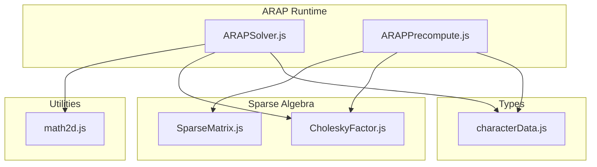
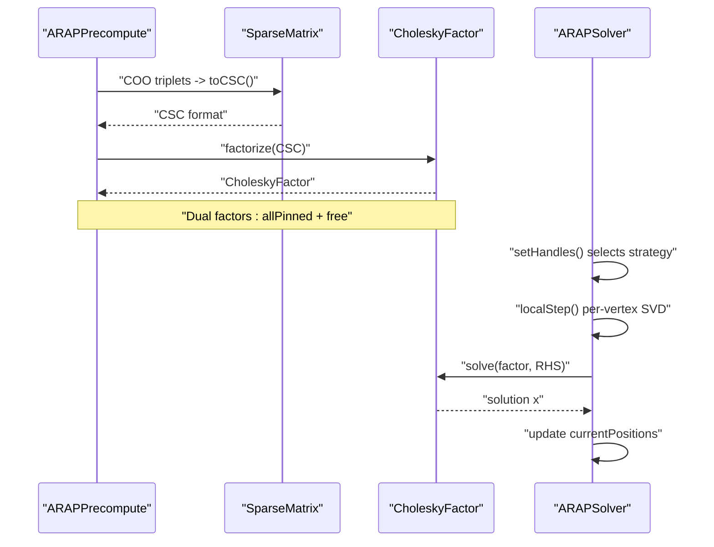
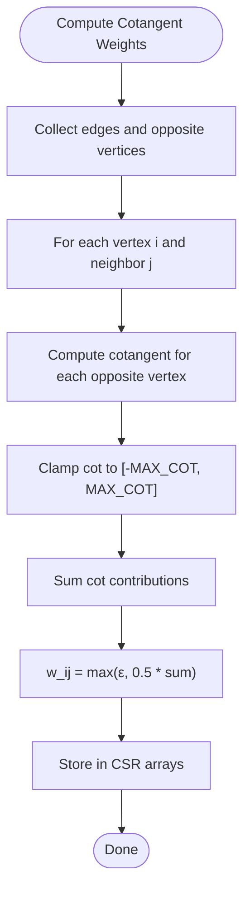
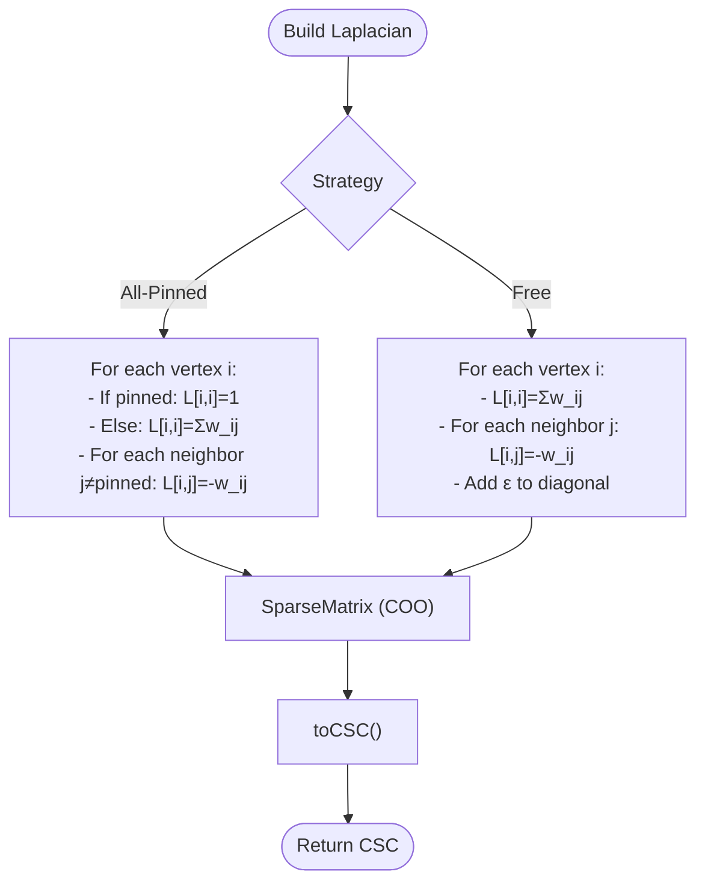
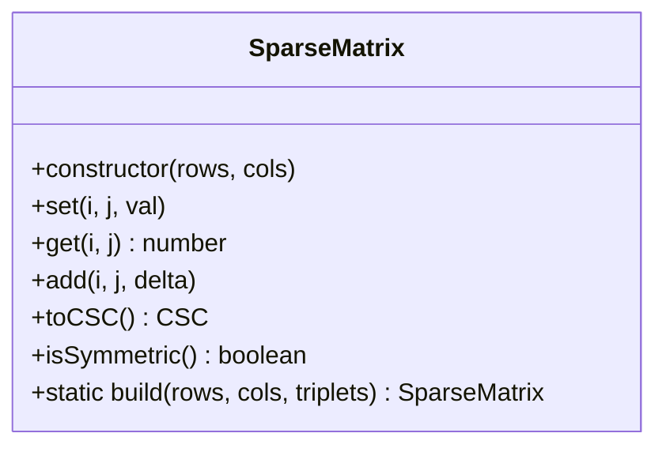
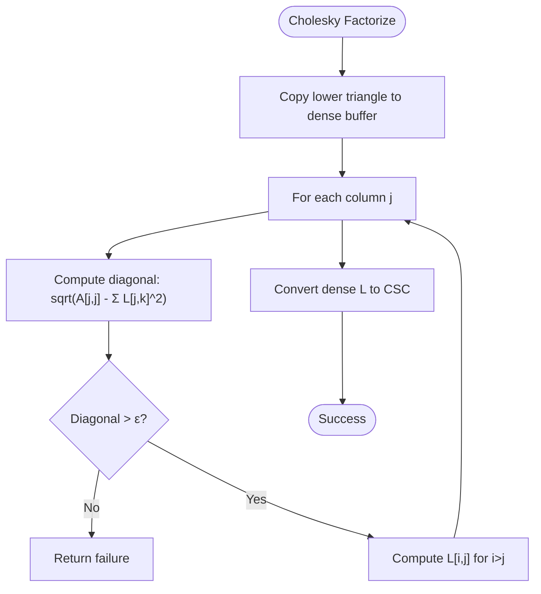
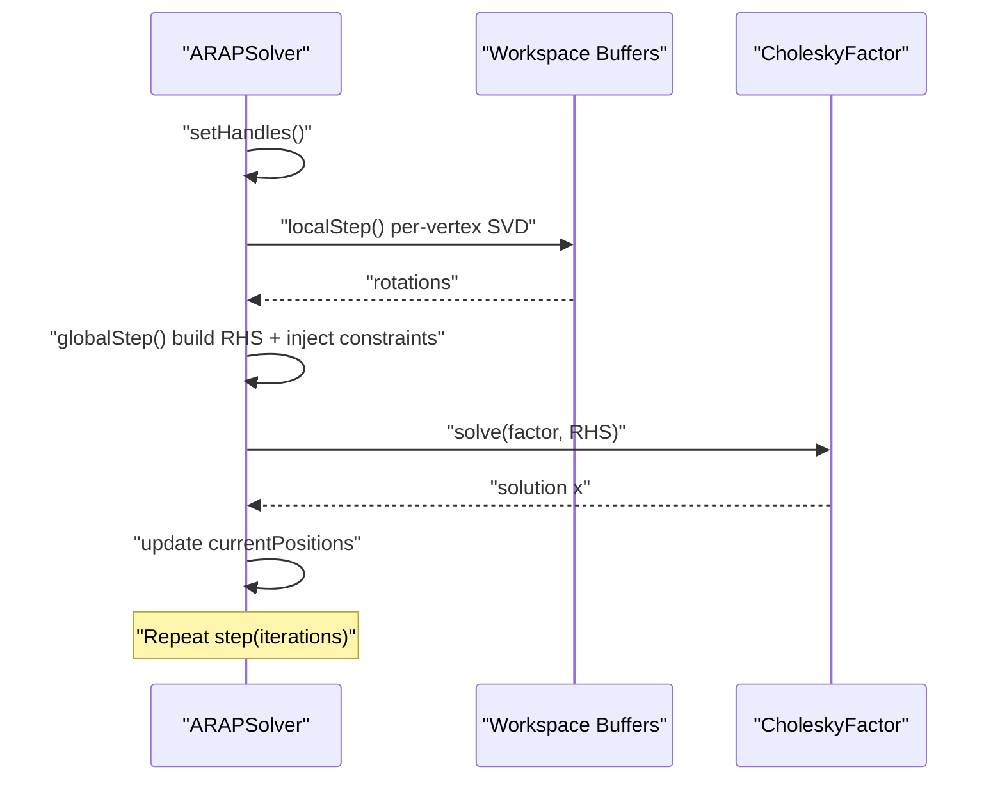
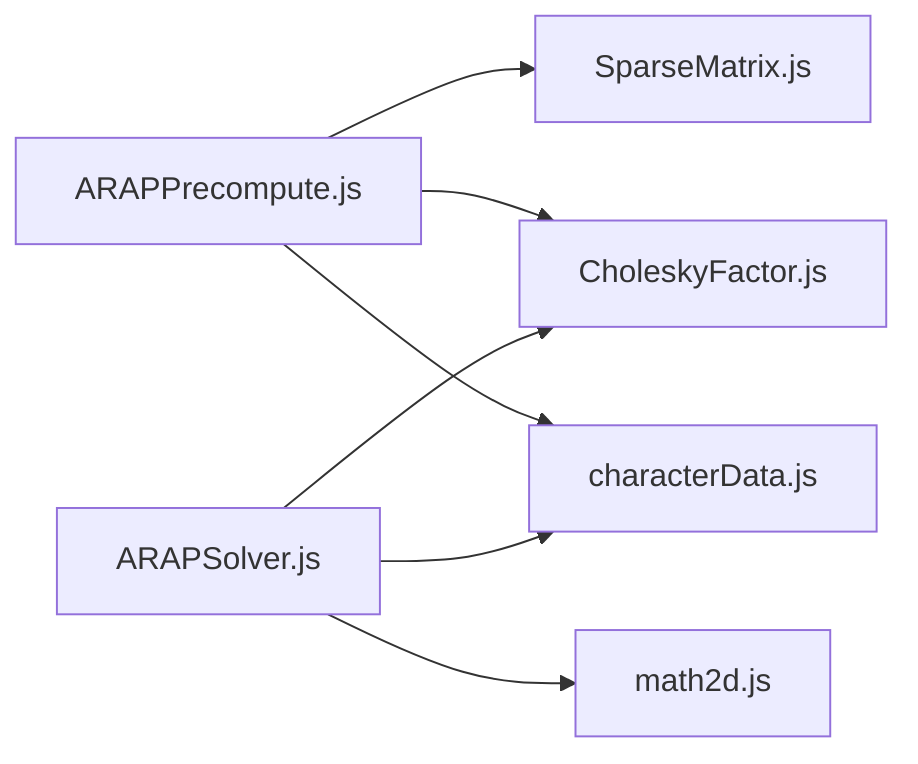

# Physics Simulation System

<cite>
**Referenced Files in This Document**
- [ARAPSolver.js](file://src/arap/ARAPSolver.js)
- [ARAPPrecompute.js](file://src/arap/ARAPPrecompute.js)
- [SparseMatrix.js](file://src/arap/sparse/SparseMatrix.js)
- [CholeskyFactor.js](file://src/arap/sparse/CholeskyFactor.js)
- [math2d.js](file://src/utils/math2d.js)
- [characterData.js](file://src/types/characterData.js)
- [module_design.md](file://architecture/module_design.md)
- [arapTestFixture.js](file://src/arap/arapTestFixture.js)
- [ARAPSolver.test.js](file://src/arap/ARAPSolver.test.js)
- [ARAPPrecompute.test.js](file://src/arap/ARAPPrecompute.test.js)
</cite>

## Table of Contents
1. [Introduction](#introduction)
2. [Project Structure](#project-structure)
3. [Core Components](#core-components)
4. [Architecture Overview](#architecture-overview)
5. [Detailed Component Analysis](#detailed-component-analysis)
6. [Dependency Analysis](#dependency-analysis)
7. [Performance Considerations](#performance-considerations)
8. [Troubleshooting Guide](#troubleshooting-guide)
9. [Conclusion](#conclusion)
10. [Appendices](#appendices)

## Introduction
This document explains PaperAlive’s Physics Simulation System with a focus on As-Rigid-As-Possible (ARAP) deformation algorithms for 2D meshes. It covers:
- Cotangent weight computation and CSR storage
- Laplacian matrix construction for both pinned and free modes
- Sparse Cholesky factorization and back-substitution
- Sparse matrix representation and memory optimization
- Iterative ARAP solver workflow and convergence behavior
- Practical tuning, stability, and performance guidance
- Fallback strategies for numerical instability and edge cases

The system is designed for real-time performance with zero-allocation constraints in the render loop and worker-safe preprocessing.

## Project Structure
The ARAP subsystem resides under src/arap and src/arap/sparse, with supporting utilities in src/utils and type definitions in src/types. The solver consumes precomputed data produced by ARAPPrecompute and uses a lightweight sparse linear algebra stack.

**Diagram sources**
- [ARAPSolver.js:1-337](file://src/arap/ARAPSolver.js#L1-L337)
- [ARAPPrecompute.js:1-388](file://src/arap/ARAPPrecompute.js#L1-L388)
- [SparseMatrix.js:1-195](file://src/arap/sparse/SparseMatrix.js#L1-L195)
- [CholeskyFactor.js:1-247](file://src/arap/sparse/CholeskyFactor.js#L1-L247)
- [math2d.js:1-459](file://src/utils/math2d.js#L1-L459)
- [characterData.js:1-254](file://src/types/characterData.js#L1-L254)

**Section sources**
- [module_design.md:499-575](file://architecture/module_design.md#L499-L575)

## Core Components
- ARAPPrecompute: Computes cotangent weights, builds Laplacian matrices, performs dual Cholesky factorization, and provides fallback strategies.
- ARAPSolver: Performs per-frame ARAP steps—local SVD per vertex, global back-substitution—and selects between pinned and free strategies.
- SparseMatrix: COO-to-CSC converter with duplicate accumulation and symmetry checks.
- CholeskyFactor: Dense-like column-wise factorization and forward/backward solves in CSC.
- math2d: SVD utilities for 2×2 matrices and cotangent computation.

**Section sources**
- [ARAPPrecompute.js:1-388](file://src/arap/ARAPPrecompute.js#L1-L388)
- [ARAPSolver.js:1-337](file://src/arap/ARAPSolver.js#L1-L337)
- [SparseMatrix.js:1-195](file://src/arap/sparse/SparseMatrix.js#L1-L195)
- [CholeskyFactor.js:1-247](file://src/arap/sparse/CholeskyFactor.js#L1-L247)
- [math2d.js:244-459](file://src/utils/math2d.js#L244-L459)

## Architecture Overview
The ARAP pipeline separates precomputation and runtime:
- Precomputation computes weights, constructs Laplacians, and factors Cholesky once.
- Runtime executes alternating local/global steps each frame with minimal allocations.

**Diagram sources**
- [ARAPPrecompute.js:206-296](file://src/arap/ARAPPrecompute.js#L206-L296)
- [ARAPSolver.js:82-325](file://src/arap/ARAPSolver.js#L82-L325)
- [SparseMatrix.js:103-159](file://src/arap/sparse/SparseMatrix.js#L103-L159)
- [CholeskyFactor.js:57-145](file://src/arap/sparse/CholeskyFactor.js#L57-L145)

## Detailed Component Analysis

### Cotangent Weights and CSR Storage
- Edge weights are computed from triangle angles using cotangent with mandatory clamping to prevent infinities and ensure numerical stability.
- Weights are stored in CSR (flat array + offsets + neighbor list) for cache-friendly neighbor traversal.
- Edge keys are canonicalized to support shared edges between triangles.

**Diagram sources**
- [ARAPPrecompute.js:34-107](file://src/arap/ARAPPrecompute.js#L34-L107)

**Section sources**
- [ARAPPrecompute.js:19-22](file://src/arap/ARAPPrecompute.js#L19-L22)
- [ARAPPrecompute.js:34-107](file://src/arap/ARAPPrecompute.js#L34-L107)
- [math2d.js:421-459](file://src/utils/math2d.js#L421-L459)

### Laplacian Matrix Construction
- All-pinned Laplacian: diagonal sums neighbors’ weights; pinned rows become identity; off-diagonal entries preserved only if both endpoints are non-pinned.
- Free Laplacian: full symmetric Laplacian; adds small ε to diagonal to remove null space and ensure positive definiteness.
- Both constructions are performed in COO and converted to CSC for efficient factorization.

**Diagram sources**
- [ARAPPrecompute.js:121-188](file://src/arap/ARAPPrecompute.js#L121-L188)
- [SparseMatrix.js:103-159](file://src/arap/sparse/SparseMatrix.js#L103-L159)

**Section sources**
- [ARAPPrecompute.js:121-188](file://src/arap/ARAPPrecompute.js#L121-L188)

### Sparse Matrix Implementation and Memory Optimization
- SparseMatrix stores triplets in a nested Map for O(1) set/get/add with automatic duplicate accumulation during CSC conversion.
- toCSC sorts each column by row index and uses contiguous arrays for row indices and values.
- Symmetry checks help validate matrix correctness.

**Diagram sources**
- [SparseMatrix.js:16-194](file://src/arap/sparse/SparseMatrix.js#L16-L194)

**Section sources**
- [SparseMatrix.js:16-195](file://src/arap/sparse/SparseMatrix.js#L16-L195)

### Cholesky Factorization and Back-Substitution
- Factorization uses a dense-like column-wise pass on a copied lower triangle, checking positive definiteness at each diagonal.
- The resulting lower triangular factor is re-packed into CSC for efficient solves.
- Back-substitution proceeds in two passes: forward solve with L, then backward solve with L^T.

**Diagram sources**
- [CholeskyFactor.js:57-145](file://src/arap/sparse/CholeskyFactor.js#L57-L145)

**Section sources**
- [CholeskyFactor.js:18-247](file://src/arap/sparse/CholeskyFactor.js#L18-L247)

### ARAP Solver: Iterative Deformation and Convergence
- Strategy selection:
  - All joints pinned: use allPinned factor and pin rows in RHS.
  - Subset dragged (IK): use free factor and inject penalty via a large weight constant.
- Local step: per-vertex covariance matrix assembly and SVD to compute optimal rotations.
- Global step: assemble right-hand sides from rotations, inject constraints, solve L L^T x = b, and update positions.
- Iteration count defaults to a small number to balance stability and performance.

**Diagram sources**
- [ARAPSolver.js:82-325](file://src/arap/ARAPSolver.js#L82-L325)

**Section sources**
- [ARAPSolver.js:22-59](file://src/arap/ARAPSolver.js#L22-L59)
- [ARAPSolver.js:82-122](file://src/arap/ARAPSolver.js#L82-L122)
- [ARAPSolver.js:136-200](file://src/arap/ARAPSolver.js#L136-L200)
- [ARAPSolver.js:212-309](file://src/arap/ARAPSolver.js#L212-L309)
- [ARAPSolver.js:319-325](file://src/arap/ARAPSolver.js#L319-L325)

### Mathematical Foundations and Computational Requirements
- Local step: compute a covariance matrix per vertex from neighboring edges and decompose to obtain a rotation matrix that preserves orientation.
- Global step: solve a sparse linear system derived from the ARAP energy functional, with weights from cotangents and constraints from pinned or penalty terms.
- Complexity:
  - Local step: O(N × k) where k is average degree.
  - Global step: O(N + nnz(L)) per solve; factorization cost dominates for preconditioning-free solves.
- Real-time constraints:
  - Precompute once, reuse factors each frame.
  - Zero-allocation in the render loop by reusing buffers.
  - Matrix sizes are bounded (≤ 400 vertices), enabling dense-like passes with acceptable cost.

**Section sources**
- [ARAPPrecompute.js:190-296](file://src/arap/ARAPPrecompute.js#L190-L296)
- [ARAPSolver.js:136-309](file://src/arap/ARAPSolver.js#L136-L309)
- [module_design.md:105-151](file://architecture/module_design.md#L105-L151)

## Dependency Analysis
- ARAPSolver depends on:
  - math2d for 2×2 SVD and cotangent utilities
  - CholeskyFactor for back-substitution
  - ARAPData from CharacterData for weights, neighbor lists, and factors
- ARAPPrecompute depends on:
  - SparseMatrix for constructing Laplacians
  - CholeskyFactor for factorization
  - math2d for cotangent computation

**Diagram sources**
- [ARAPPrecompute.js:16-17](file://src/arap/ARAPPrecompute.js#L16-L17)
- [ARAPSolver.js:14-15](file://src/arap/ARAPSolver.js#L14-L15)
- [characterData.js:100-130](file://src/types/characterData.js#L100-L130)

**Section sources**
- [ARAPPrecompute.js:16-17](file://src/arap/ARAPPrecompute.js#L16-L17)
- [ARAPSolver.js:14-15](file://src/arap/ARAPSolver.js#L14-L15)
- [characterData.js:100-130](file://src/types/characterData.js#L100-L130)

## Performance Considerations
- Precomputation cost amortized:
  - Cotangent weights, Laplacians, and dual Cholesky are computed once and reused.
- Frame-time costs:
  - Local step: per-vertex SVD and neighbor loops.
  - Global step: RHS assembly, constraint injection, and two sparse solves.
- Memory:
  - CSR arrays and workspace buffers are pre-allocated to avoid GC pressure.
- Tuning levers:
  - Iteration count in step() trades speed vs. smoothness.
  - Penalty weight for IK mode controls constraint strength.
  - Cotangent clamping bounds stabilize weights; uniform fallback improves robustness on degenerate meshes.

[No sources needed since this section provides general guidance]

## Troubleshooting Guide
Common issues and remedies:
- Cholesky failure:
  - Trigger uniform weight fallback; if still failing, surface CHOLESKY_FAILED.
- Degenerate mesh:
  - Detect NaN in factor values; return DEGENERATE_MESH.
- Numerical instability:
  - Cotangent clamping prevents extreme weights.
  - Free Laplacian regularization ensures positive definiteness.
- Strategy mismatch:
  - All-pinned vs. free selection depends on number of active joint targets.

**Section sources**
- [ARAPPrecompute.js:206-296](file://src/arap/ARAPPrecompute.js#L206-L296)
- [ARAPPrecompute.js:298-388](file://src/arap/ARAPPrecompute.js#L298-L388)
- [ARAPSolver.js:82-122](file://src/arap/ARAPSolver.js#L82-L122)

## Conclusion
PaperAlive’s ARAP system combines robust geometric weighting, careful numerical safeguards, and efficient sparse linear algebra to deliver real-time, stable deformations. Precomputation and dual Cholesky enable low-latency frame updates, while strict allocation policies and fallback strategies ensure reliability across diverse inputs.

[No sources needed since this section summarizes without analyzing specific files]

## Appendices

### Practical Parameter Tuning
- Iteration count: Start with 2–3 per frame; increase for smoother but slower response.
- Penalty weight for IK: 1000 balances responsiveness and stability; reduce for softer constraints.
- Cotangent clamping: ε = 1e-6, MAX_COT = 100; adjust only if encountering pathological meshes.
- Workspace buffers: Ensure rotations, RHS, and normals are pre-allocated and sized to vertexCount.

**Section sources**
- [ARAPSolver.js:17](file://src/arap/ARAPSolver.js#L17)
- [ARAPSolver.js:319-325](file://src/arap/ARAPSolver.js#L319-L325)
- [ARAPPrecompute.js:19-22](file://src/arap/ARAPPrecompute.js#L19-L22)
- [ARAPPrecompute.js:269-296](file://src/arap/ARAPPrecompute.js#L269-L296)

### Example Workflows and Tests
- Grid mesh and degenerate mesh fixtures are used to validate weight computation, Laplacian symmetry, and fallback behavior.
- Unit tests confirm:
  - Cotangent weights are positive and symmetric.
  - Laplacian rows behave as expected for pinned and free modes.
  - Cholesky factors are produced and checked for NaN.
  - Solver local/global steps produce non-trivial deformations.

**Section sources**
- [arapTestFixture.js:15-88](file://src/arap/arapTestFixture.js#L15-L88)
- [arapTestFixture.js:96-166](file://src/arap/arapTestFixture.js#L96-L166)
- [ARAPPrecompute.test.js:16-87](file://src/arap/ARAPPrecompute.test.js#L16-L87)
- [ARAPPrecompute.test.js:89-166](file://src/arap/ARAPPrecompute.test.js#L89-L166)
- [ARAPPrecompute.test.js:168-265](file://src/arap/ARAPPrecompute.test.js#L168-L265)
- [ARAPSolver.test.js:33-100](file://src/arap/ARAPSolver.test.js#L33-L100)
- [ARAPSolver.test.js:102-156](file://src/arap/ARAPSolver.test.js#L102-L156)
- [ARAPSolver.test.js:158-185](file://src/arap/ARAPSolver.test.js#L158-L185)
- [ARAPSolver.test.js:187-260](file://src/arap/ARAPSolver.test.js#L187-L260)