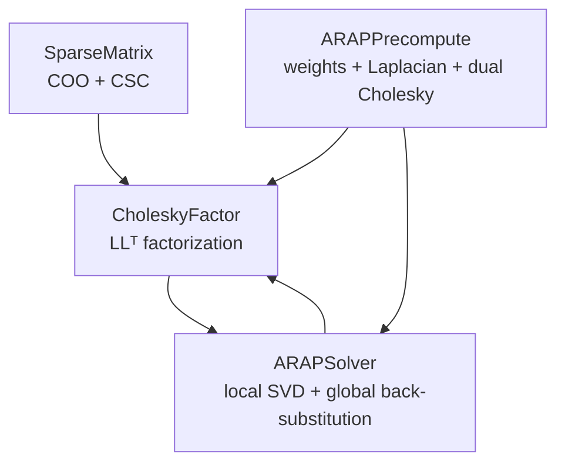
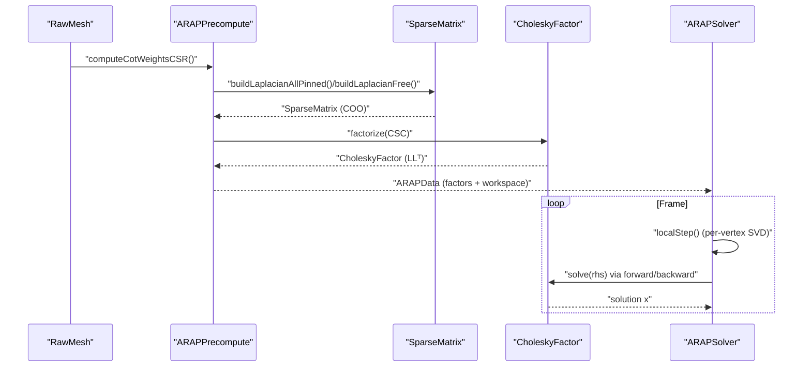
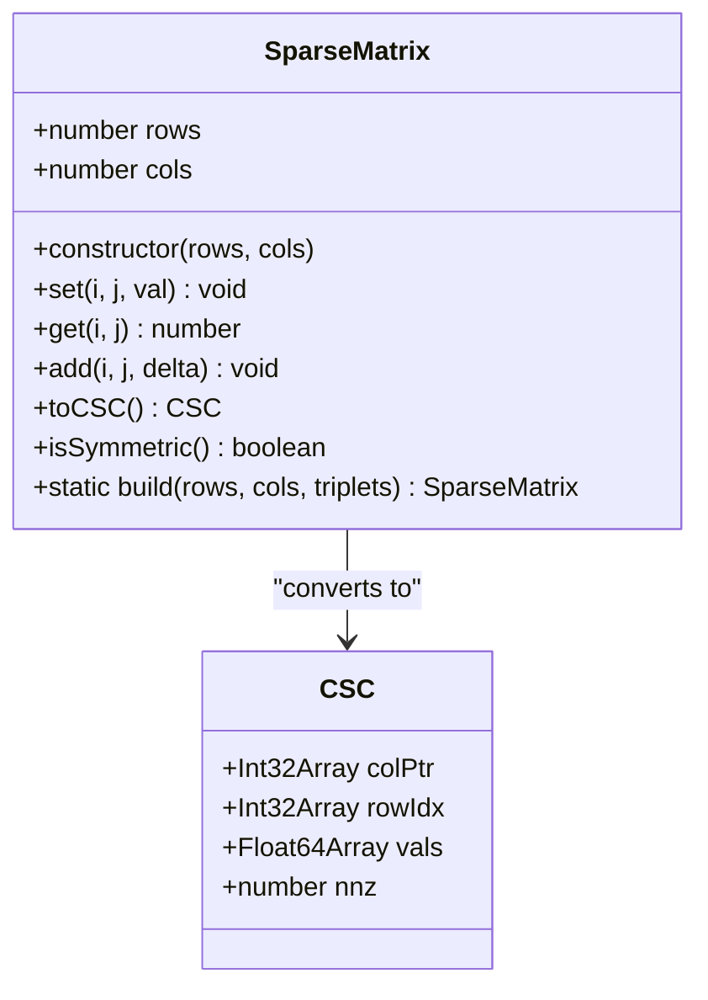
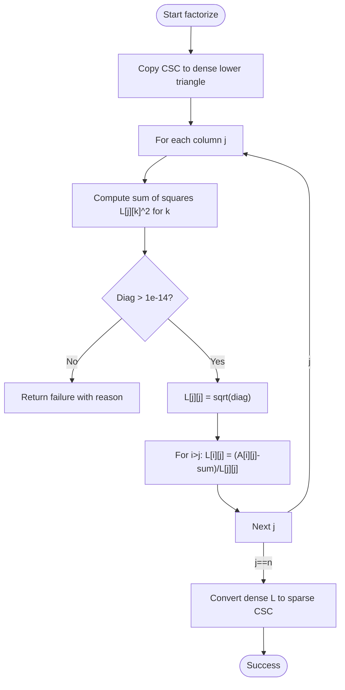
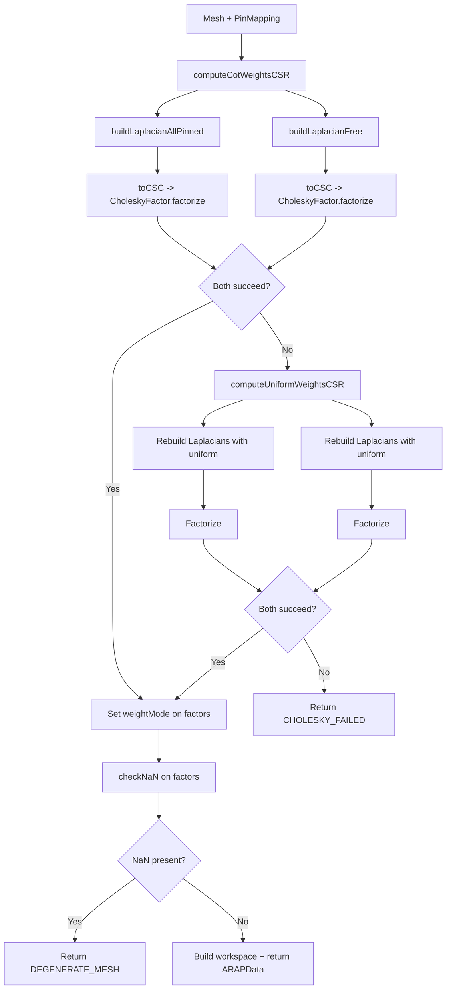
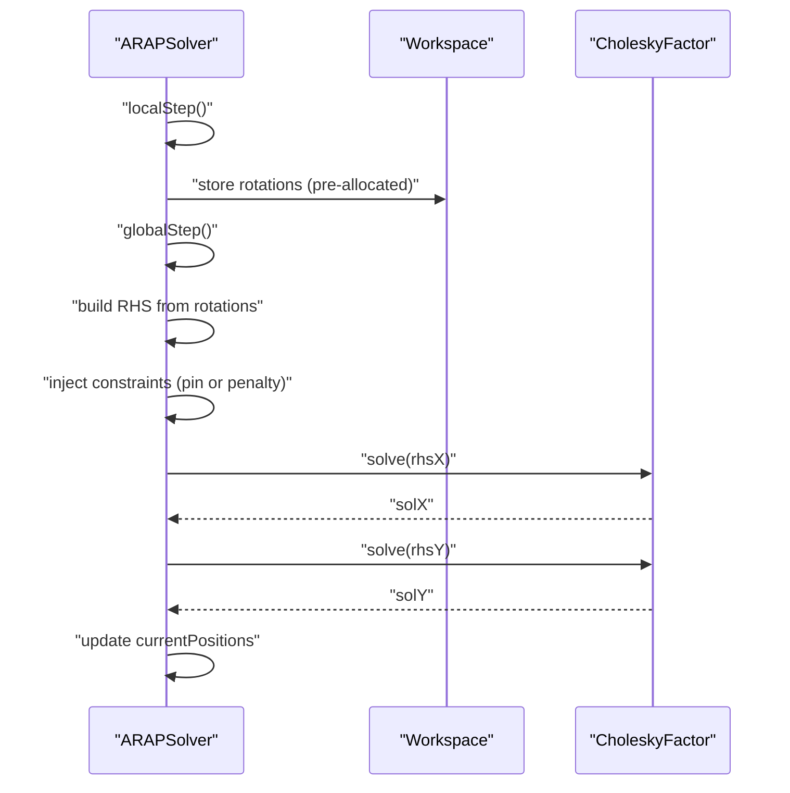
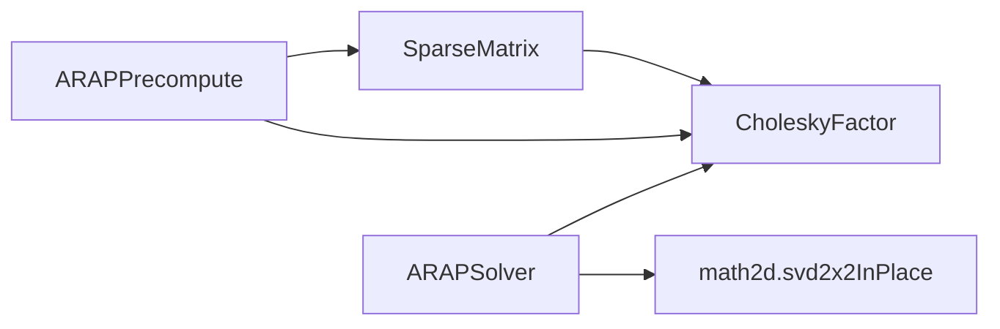

# Sparse Matrix Mathematics

<cite>
**Referenced Files in This Document**
- [SparseMatrix.js](file://src/arap/sparse/SparseMatrix.js)
- [CholeskyFactor.js](file://src/arap/sparse/CholeskyFactor.js)
- [ARAPPrecompute.js](file://src/arap/ARAPPrecompute.js)
- [ARAPSolver.js](file://src/arap/ARAPSolver.js)
- [SparseMatrix.test.js](file://src/arap/sparse/SparseMatrix.test.js)
- [CholeskyFactor.test.js](file://src/arap/sparse/CholeskyFactor.test.js)
- [ARAPPrecompute.test.js](file://src/arap/ARAPPrecompute.test.js)
- [ARAPSolver.test.js](file://src/arap/ARAPSolver.test.js)
- [arapTestFixture.js](file://src/arap/arapTestFixture.js)
- [characterData.js](file://src/types/characterData.js)
- [math2d.js](file://src/utils/math2d.js)
</cite>

## Table of Contents
1. [Introduction](#introduction)
2. [Project Structure](#project-structure)
3. [Core Components](#core-components)
4. [Architecture Overview](#architecture-overview)
5. [Detailed Component Analysis](#detailed-component-analysis)
6. [Dependency Analysis](#dependency-analysis)
7. [Performance Considerations](#performance-considerations)
8. [Troubleshooting Guide](#troubleshooting-guide)
9. [Conclusion](#conclusion)
10. [Appendices](#appendices)

## Introduction
This document explains the Sparse Matrix Mathematics subsystem that underpins PaperAlive’s ARAP (As-Rigid-As-Possible) deformation pipeline. It focuses on:
- Sparse matrix data structures and storage optimizations for triangular meshes
- Cholesky factorization for symmetric positive definite (SPD) matrices
- Numerical stability, pivoting strategies, and fallback algorithms
- Mathematical properties of ARAP matrices (positive definiteness, conditioning)
- Practical matrix operations, memory allocation strategies, and GPU acceleration considerations
- Error propagation in factorization and detection of degenerate meshes

## Project Structure
The sparse mathematics stack is organized around three primary modules:
- SparseMatrix: COO-to-CSC conversion, symmetry checks, and triplets accumulation
- CholeskyFactor: LL^T factorization and back-substitution for sparse SPD matrices
- ARAPPrecompute: Cotangent weights, Laplacian construction, dual Cholesky with fallback
- ARAPSolver: Local SVD per-vertex and global back-substitution

**Diagram sources**
- [SparseMatrix.js:16-195](file://src/arap/sparse/SparseMatrix.js#L16-L195)
- [CholeskyFactor.js:18-247](file://src/arap/sparse/CholeskyFactor.js#L18-L247)
- [ARAPPrecompute.js:16-388](file://src/arap/ARAPPrecompute.js#L16-L388)
- [ARAPSolver.js:22-337](file://src/arap/ARAPSolver.js#L22-L337)

**Section sources**
- [SparseMatrix.js:16-195](file://src/arap/sparse/SparseMatrix.js#L16-L195)
- [CholeskyFactor.js:18-247](file://src/arap/sparse/CholeskyFactor.js#L18-L247)
- [ARAPPrecompute.js:16-388](file://src/arap/ARAPPrecompute.js#L16-L388)
- [ARAPSolver.js:22-337](file://src/arap/ARAPSolver.js#L22-L337)

## Core Components
- SparseMatrix: Stores triplets (row, col, value) in COO format with duplicate accumulation during CSC conversion. Provides symmetry checks and CSR-like neighborhood accessors for cotangent weights.
- CholeskyFactor: Computes LL^T factorization for sparse SPD matrices given in CSC format, and solves linear systems via forward/backward substitution. Includes NaN/Infinity sentinel checks.
- ARAPPrecompute: Builds cotangent weights in CSR, constructs Laplacian matrices (all-pinned and free), and performs dual Cholesky factorization with fallback to uniform weights when cotangent weights fail.
- ARAPSolver: Performs iterative ARAP steps: local SVD per vertex to compute optimal rotations, then global back-substitution using the selected Cholesky factor.

**Section sources**
- [SparseMatrix.js:16-195](file://src/arap/sparse/SparseMatrix.js#L16-L195)
- [CholeskyFactor.js:18-247](file://src/arap/sparse/CholeskyFactor.js#L18-L247)
- [ARAPPrecompute.js:16-388](file://src/arap/ARAPPrecompute.js#L16-L388)
- [ARAPSolver.js:22-337](file://src/arap/ARAPSolver.js#L22-L337)

## Architecture Overview
The ARAP pipeline integrates sparse mathematics as follows:
- Preprocessing computes cotangent weights and builds Laplacian matrices
- Dual Cholesky factorization yields two factors: one for motion-clip mode (all joints pinned) and one for IK drag mode (free with penalty)
- Runtime solver alternates local SVD and global back-substitution until convergence

**Diagram sources**
- [ARAPPrecompute.js:34-296](file://src/arap/ARAPPrecompute.js#L34-L296)
- [SparseMatrix.js:103-159](file://src/arap/sparse/SparseMatrix.js#L103-L159)
- [CholeskyFactor.js:57-145](file://src/arap/sparse/CholeskyFactor.js#L57-L145)
- [ARAPSolver.js:136-309](file://src/arap/ARAPSolver.js#L136-L309)

## Detailed Component Analysis

### SparseMatrix: COO and CSC Storage
- Data model: internal Map<rowKey, Map<colKey, value>> enables O(1) get/set/add with automatic duplicate accumulation.
- Conversion: toCSC() counts per-column entries, builds column pointers, fills row indices and values, and sorts each column by row index for canonical CSC.
- Symmetry: isSymmetric() verifies A[i][j] == A[j][i] for all i, j when square.
- Construction: build() accepts triplets and accumulates duplicates.

**Diagram sources**
- [SparseMatrix.js:16-195](file://src/arap/sparse/SparseMatrix.js#L16-L195)

**Section sources**
- [SparseMatrix.js:16-195](file://src/arap/sparse/SparseMatrix.js#L16-L195)
- [SparseMatrix.test.js:9-146](file://src/arap/sparse/SparseMatrix.test.js#L9-L146)

### CholeskyFactor: LLᵀ Factorization and Back Substitution
- Factorization: Converts input CSC to dense lower triangle, applies standard Cholesky recursion, and converts the dense L back to sparse CSC. Returns structured result with success/failure and reason.
- Stability: Diagonal check ensures positive definiteness; returns failure with reason if diagonal becomes non-positive.
- Solve: Forward substitution column-by-column using CSC structure, then backward substitution, with in-place output support.
- Sentinel: checkNaN detects NaN or Infinity in factor values.

**Diagram sources**
- [CholeskyFactor.js:57-145](file://src/arap/sparse/CholeskyFactor.js#L57-L145)

**Section sources**
- [CholeskyFactor.js:18-247](file://src/arap/sparse/CholeskyFactor.js#L18-L247)
- [CholeskyFactor.test.js:10-231](file://src/arap/sparse/CholeskyFactor.test.js#L10-L231)

### ARAPPrecompute: Cotangent Weights, Laplacian, Dual Cholesky
- Cotangent weights: computeCotWeightsCSR builds CSR arrays (flat weights, offsets, neighbor list) with mandatory clamping and edge-opposite handling.
- Laplacian: buildLaplacianAllPinned constrains pinned rows to identity; buildLaplacianFree adds small regularization to ensure positive definiteness for free mode.
- Dual Cholesky: precomputeARAP tries cotangent weights, then falls back to uniform weights if either factorization fails, and finally checks for NaN in factors.

**Diagram sources**
- [ARAPPrecompute.js:34-296](file://src/arap/ARAPPrecompute.js#L34-L296)

**Section sources**
- [ARAPPrecompute.js:16-388](file://src/arap/ARAPPrecompute.js#L16-L388)
- [ARAPPrecompute.test.js:16-345](file://src/arap/ARAPPrecompute.test.js#L16-L345)

### ARAPSolver: Local SVD + Global Back Substitution
- Strategy selection: setHandles chooses allPinned vs free modes based on number of handles.
- Local step: localStep computes per-vertex optimal rotations via weighted SVD on covariance matrices, storing 2×2 rotation matrices in a pre-allocated workspace.
- Global step: globalStep builds right-hand sides from rotations, injects constraints (pinned targets or penalty), then solves via Cholesky back-substitution, updating current positions in place.

**Diagram sources**
- [ARAPSolver.js:136-309](file://src/arap/ARAPSolver.js#L136-L309)
- [math2d.js:354-419](file://src/utils/math2d.js#L354-L419)

**Section sources**
- [ARAPSolver.js:22-337](file://src/arap/ARAPSolver.js#L22-L337)
- [ARAPSolver.test.js:14-261](file://src/arap/ARAPSolver.test.js#L14-L261)
- [math2d.js:354-419](file://src/utils/math2d.js#L354-L419)

## Dependency Analysis
- SparseMatrix depends on typed arrays for CSC representation and provides conversion to/from COO.
- CholeskyFactor consumes CSC arrays and returns a factor object with column pointers, row indices, and values.
- ARAPPrecompute composes SparseMatrix and CholeskyFactor to produce ARAPData.
- ARAPSolver composes CholeskyFactor and math utilities for SVD and back-substitution.

**Diagram sources**
- [SparseMatrix.js:16-195](file://src/arap/sparse/SparseMatrix.js#L16-L195)
- [CholeskyFactor.js:18-247](file://src/arap/sparse/CholeskyFactor.js#L18-L247)
- [ARAPPrecompute.js:16-388](file://src/arap/ARAPPrecompute.js#L16-L388)
- [ARAPSolver.js:14-59](file://src/arap/ARAPSolver.js#L14-L59)
- [math2d.js:354-419](file://src/utils/math2d.js#L354-L419)

**Section sources**
- [characterData.js:100-130](file://src/types/characterData.js#L100-L130)

## Performance Considerations
- Matrix sizes: Meshes are bounded (≤ 400 vertices), enabling dense column-major storage for factorization without excessive memory overhead.
- Memory allocation: Zero-allocation policy in ARAPSolver’s localStep/globalStep avoids per-frame allocations by reusing pre-allocated buffers.
- Data layouts:
  - CSR for cotangent weights: neighborOffsets + neighborList + cotWeightsFlat
  - CSC for Cholesky factors: colPtr + rowIdx + vals
- GPU acceleration: While the current implementation uses CPU Float32/Float64 arrays, GPU kernels can be designed to:
  - Perform SVD per-vertex in parallel
  - Execute forward/backward substitution column-wise on GPU
  - Use tiled or blocked algorithms for better cache locality
- Sparsity patterns: Triangular meshes yield sparse Laplacians with low bandwidth; maintaining sparsity in CSC reduces solve cost.

[No sources needed since this section provides general guidance]

## Troubleshooting Guide
Common issues and diagnostics:
- Positive definiteness failures:
  - Cause: Near-degenerate meshes or improper regularization
  - Detection: CholeskyFactor.factorize returns failure with reason
  - Mitigation: Enable uniform weight fallback; verify mesh quality
- NaN/Infinity in factors:
  - Cause: Degenerate triangles or invalid cotangent values
  - Detection: CholeskyFactor.checkNaN returns true
  - Mitigation: Use uniform weights fallback; inspect mesh geometry
- Ill-conditioned matrices:
  - Cause: Poorly shaped triangles or extreme aspect ratios
  - Mitigation: Regularization in free mode; improve mesh quality

**Section sources**
- [CholeskyFactor.js:93-98](file://src/arap/sparse/CholeskyFactor.js#L93-L98)
- [ARAPPrecompute.js:230-251](file://src/arap/ARAPPrecompute.js#L230-L251)
- [ARAPPrecompute.test.js:234-265](file://src/arap/ARAPPrecompute.test.js#L234-L265)

## Conclusion
PaperAlive’s sparse mathematics subsystem combines efficient sparse storage (COO/CSC), robust Cholesky factorization, and careful fallback strategies to deliver reliable ARAP deformation. The design emphasizes numerical stability, memory efficiency, and runtime performance, with clear diagnostics for failure modes.

[No sources needed since this section summarizes without analyzing specific files]

## Appendices

### Mathematical Properties of ARAP Matrices
- Laplacian construction:
  - All-pinned: diagonal entries equal neighbor sums; off-diagonal entries −w_ij; pinned rows set to identity
  - Free: diagonal entries Σw_ij; off-diagonal −w_ij; small ε regularization added to diagonal to ensure positive definiteness
- Positive definiteness:
  - Cotangent weights typically yield SPD matrices; uniform weights serve as a robust fallback
  - Free mode regularization guarantees positive definiteness for stable solves
- Conditioning:
  - Cotangent weights often yield better-conditioned matrices than uniform weights
  - Degenerate meshes can degrade conditioning; fallback to uniform weights improves reliability

**Section sources**
- [ARAPPrecompute.js:121-188](file://src/arap/ARAPPrecompute.js#L121-L188)
- [ARAPPrecompute.test.js:168-232](file://src/arap/ARAPPrecompute.test.js#L168-L232)

### Practical Examples and Workflows
- Cotangent weights CSR:
  - Build edge-to-opposite-vertex map from triangles
  - Compute weights per edge with clamping and mandatory ε
  - Store in neighborOffsets + neighborList + cotWeightsFlat
- Laplacian assembly:
  - For each vertex, sum neighbor weights for diagonal
  - Set off-diagonal entries −w_ij for non-pinned neighbors
  - Apply pin constraints for all-pinned mode
- Dual Cholesky:
  - Factorize both all-pinned and free matrices
  - Validate factors for NaN; if present, fall back to uniform weights
- Solver iteration:
  - Local step: compute per-vertex rotations via SVD
  - Global step: build RHS, inject constraints, solve via Cholesky

**Section sources**
- [ARAPPrecompute.js:34-296](file://src/arap/ARAPPrecompute.js#L34-L296)
- [ARAPSolver.js:136-309](file://src/arap/ARAPSolver.js#L136-L309)
- [arapTestFixture.js:15-166](file://src/arap/arapTestFixture.js#L15-L166)