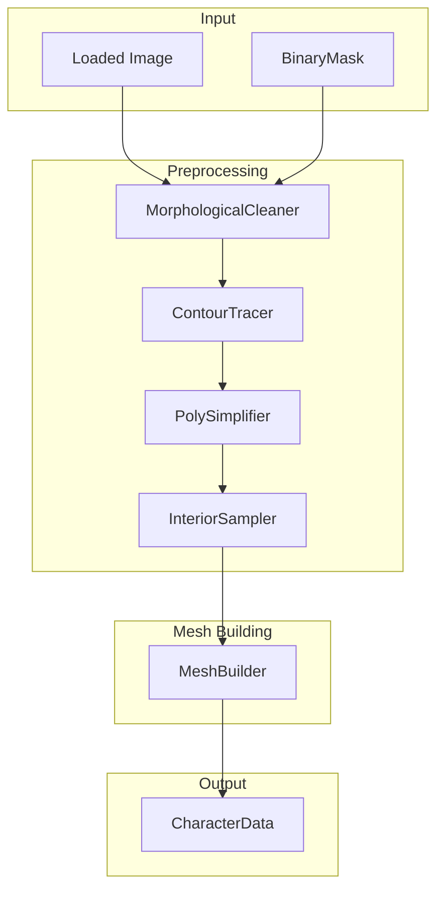
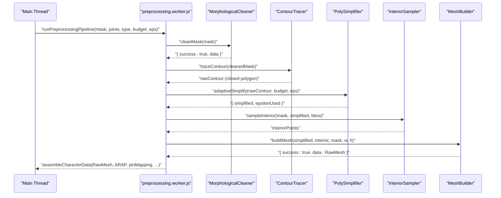
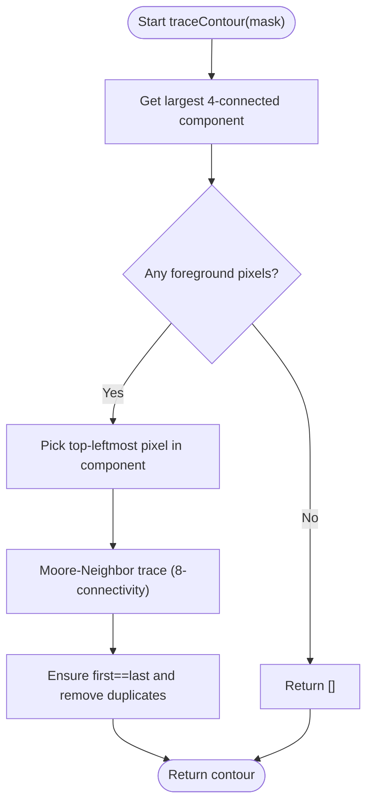
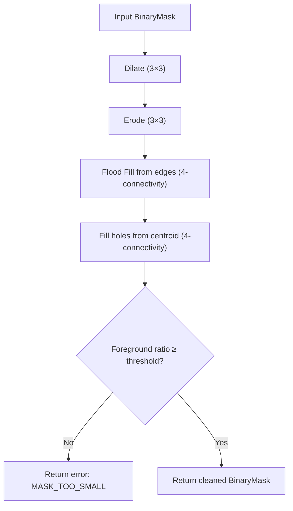
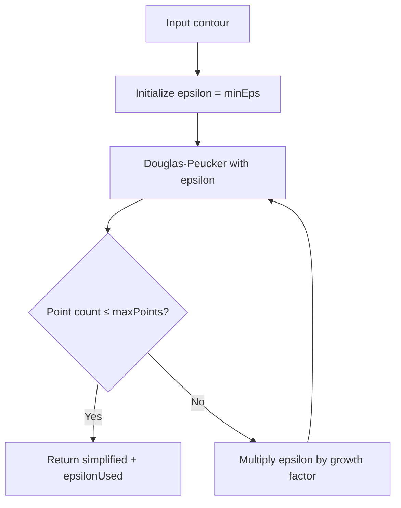
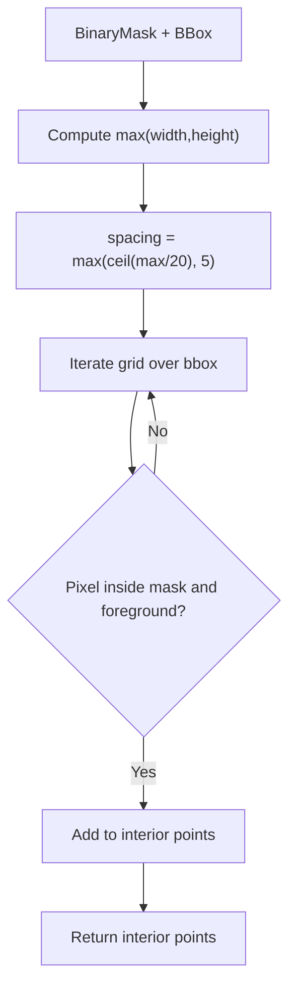
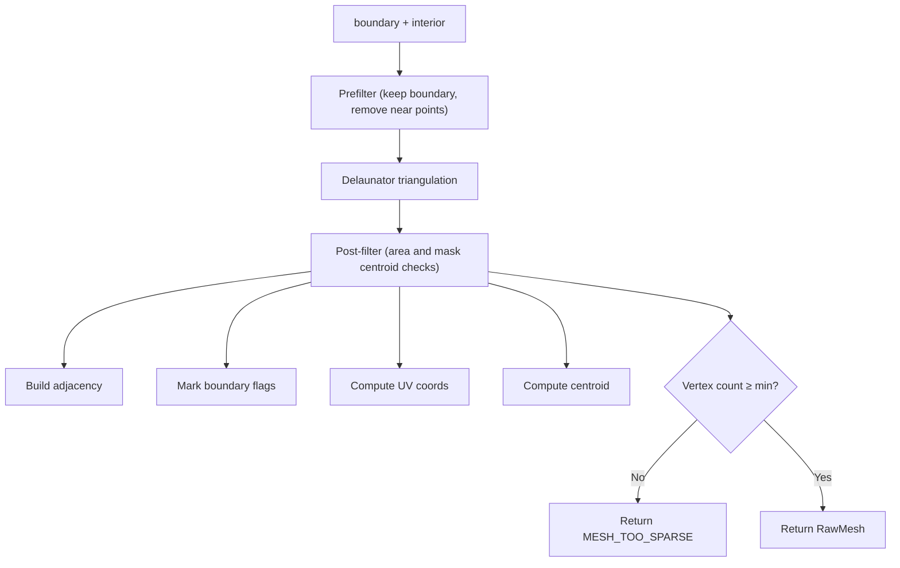
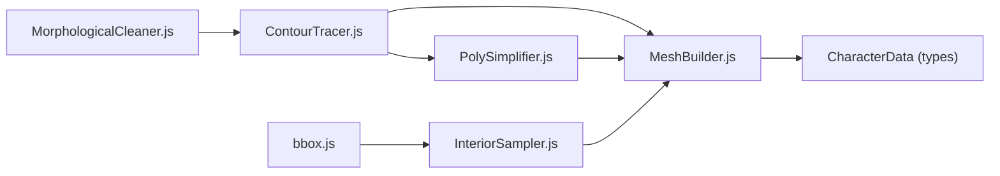

# Contour Tracing

<cite>
**Referenced Files in This Document**
- [ContourTracer.js](file://src/geometry/ContourTracer.js)
- [ContourTracer.test.js](file://src/geometry/ContourTracer.test.js)
- [MorphologicalCleaner.js](file://src/geometry/MorphologicalCleaner.js)
- [MorphologicalCleaner.test.js](file://src/geometry/MorphologicalCleaner.test.js)
- [InteriorSampler.js](file://src/geometry/InteriorSampler.js)
- [InteriorSampler.test.js](file://src/geometry/InteriorSampler.test.js)
- [PolySimplifier.js](file://src/geometry/PolySimplifier.js)
- [PolySimplifier.test.js](file://src/geometry/PolySimplifier.test.js)
- [MeshBuilder.js](file://src/geometry/MeshBuilder.js)
- [MeshBuilder.test.js](file://src/geometry/MeshBuilder.test.js)
- [characterData.js](file://src/types/characterData.js)
- [preprocessing.worker.js](file://src/character/workers/preprocessing.worker.js)
- [buildCharacterData.js](file://src/character/buildCharacterData.js)
- [bbox.js](file://src/utils/bbox.js)
</cite>

## Table of Contents
1. [Introduction](#introduction)
2. [Project Structure](#project-structure)
3. [Core Components](#core-components)
4. [Architecture Overview](#architecture-overview)
5. [Detailed Component Analysis](#detailed-component-analysis)
6. [Dependency Analysis](#dependency-analysis)
7. [Performance Considerations](#performance-considerations)
8. [Troubleshooting Guide](#troubleshooting-guide)
9. [Conclusion](#conclusion)

## Introduction
This document explains the Contour Tracing component used by PaperAlive to extract character boundaries from cleaned binary masks. It details the contour detection methodology, the Moore-Neighbor tracing algorithm, handling of complex shapes and holes, and integration with downstream mesh building. Practical examples and optimization techniques for smooth curves are included, along with performance considerations for complex contours.

## Project Structure
The contour tracing pipeline is part of a broader preprocessing workflow that cleans noisy masks, extracts contours, simplifies them, samples interior points, builds a mesh, and prepares the final character data structure.

**Diagram sources**
- [preprocessing.worker.js:86-192](file://src/character/workers/preprocessing.worker.js#L86-L192)
- [MorphologicalCleaner.js:26-55](file://src/geometry/MorphologicalCleaner.js#L26-L55)
- [ContourTracer.js:31-54](file://src/geometry/ContourTracer.js#L31-L54)
- [PolySimplifier.js:21-49](file://src/geometry/PolySimplifier.js#L21-L49)
- [InteriorSampler.js:25-50](file://src/geometry/InteriorSampler.js#L25-L50)
- [MeshBuilder.js:35-137](file://src/geometry/MeshBuilder.js#L35-L137)
- [characterData.js:139-188](file://src/types/characterData.js#L139-L188)

**Section sources**
- [preprocessing.worker.js:86-192](file://src/character/workers/preprocessing.worker.js#L86-L192)
- [characterData.js:139-188](file://src/types/characterData.js#L139-L188)

## Core Components
- MorphologicalCleaner: Cleans the binary mask to remove noise, fills gaps, removes border-connected foreground, and fills holes. Includes a guard to detect overly small foreground areas.
- ContourTracer: Identifies the largest connected component (4-connectivity) and traces its outer boundary using Moore-Neighbor (8-connectivity) scanning to produce a closed polygon.
- PolySimplifier: Applies Douglas-Peucker simplification with adaptive epsilon to reduce vertex count while preserving shape fidelity.
- InteriorSampler: Generates interior sample points using a normalized grid within the bounding box of the foreground.
- MeshBuilder: Builds a triangulated mesh from boundary and interior points, filters invalid triangles, computes UV coordinates, adjacency, and boundary flags, and enforces vertex budgets.

**Section sources**
- [MorphologicalCleaner.js:26-55](file://src/geometry/MorphologicalCleaner.js#L26-L55)
- [ContourTracer.js:31-54](file://src/geometry/ContourTracer.js#L31-L54)
- [PolySimplifier.js:21-49](file://src/geometry/PolySimplifier.js#L21-L49)
- [InteriorSampler.js:25-50](file://src/geometry/InteriorSampler.js#L25-L50)
- [MeshBuilder.js:35-137](file://src/geometry/MeshBuilder.js#L35-L137)

## Architecture Overview
The pipeline stages are orchestrated in a worker to keep the main thread responsive. The worker performs mask cleaning, contour tracing, simplification, interior sampling, mesh building, and skeleton mapping, then assembles CharacterData for downstream systems.

**Diagram sources**
- [preprocessing.worker.js:86-192](file://src/character/workers/preprocessing.worker.js#L86-L192)
- [MorphologicalCleaner.js:26-55](file://src/geometry/MorphologicalCleaner.js#L26-L55)
- [ContourTracer.js:31-54](file://src/geometry/ContourTracer.js#L31-L54)
- [PolySimplifier.js:37-49](file://src/geometry/PolySimplifier.js#L37-L49)
- [InteriorSampler.js:25-50](file://src/geometry/InteriorSampler.js#L25-L50)
- [MeshBuilder.js:35-137](file://src/geometry/MeshBuilder.js#L35-L137)

## Detailed Component Analysis

### ContourTracer: Moore-Neighbor Boundary Extraction
- Purpose: Extract the outer boundary of the largest connected foreground component in a binary mask.
- Methodology:
  - Largest component selection: Uses 4-connectivity BFS to compute component sizes by pixel count and selects the largest.
  - Start pixel selection: Finds the top-leftmost foreground pixel within the selected component.
  - Tracing: Uses Moore-Neighbor scanning (8-connectivity) to traverse the boundary, turning only when a foreground pixel is encountered, ensuring a closed polygon.
  - Output: A closed polygon of ordered {x, y} points with duplicates removed and the first point repeated at the end if needed.

**Diagram sources**
- [ContourTracer.js:31-54](file://src/geometry/ContourTracer.js#L31-L54)
- [ContourTracer.js:151-211](file://src/geometry/ContourTracer.js#L151-L211)

Key implementation notes:
- Direction offsets define 8-neighbor moves in clockwise order.
- The tracer starts by entering from below (direction 5) and begins scanning from the east neighbor (index 0) to ensure consistent orientation.
- A safety step limit prevents runaway loops on degenerate inputs.
- Duplicate adjacent points are removed to avoid unnecessary vertices.

Practical examples validated by tests:
- Square mask produces a closed contour whose points lie within the square bounds.
- First and last points match to form a closed polygon.
- Consecutive duplicates are eliminated.
- Empty masks return an empty contour.

Complex shapes, holes, and disconnected components:
- The largest component selection ensures only the dominant shape is traced, ignoring smaller disconnected regions.
- Holes inside the largest component are naturally handled by the outer boundary traversal; interior holes are addressed upstream by the cleaner and downstream by mesh post-filters.

Optimization for smooth curves:
- Apply PolySimplifier after tracing to reduce vertex count while preserving shape.
- Use adaptive simplification to meet vertex budgets dynamically.

Integration with downstream mesh building:
- The resulting contour is passed to InteriorSampler to generate interior points.
- MeshBuilder consumes boundary and interior points to construct a triangulated mesh.

**Section sources**
- [ContourTracer.js:15-23](file://src/geometry/ContourTracer.js#L15-L23)
- [ContourTracer.js:31-54](file://src/geometry/ContourTracer.js#L31-L54)
- [ContourTracer.js:67-137](file://src/geometry/ContourTracer.js#L67-L137)
- [ContourTracer.js:151-211](file://src/geometry/ContourTracer.js#L151-L211)
- [ContourTracer.test.js:23-81](file://src/geometry/ContourTracer.test.js#L23-L81)
- [ContourTracer.test.js:85-131](file://src/geometry/ContourTracer.test.js#L85-L131)

### MorphologicalCleaner: Noise Reduction and Hole Filling
- Purpose: Prepare a clean binary mask for robust contour tracing.
- Operations:
  - Morphological closing (dilation followed by erosion) to fill small gaps.
  - Edge flood-fill (4-connectivity) to remove foreground touching image borders.
  - Hole filling from the centroid (4-connectivity) to fill interior holes.
  - Guard check: rejects masks where foreground is less than a minimum ratio.

**Diagram sources**
- [MorphologicalCleaner.js:26-55](file://src/geometry/MorphologicalCleaner.js#L26-L55)
- [MorphologicalCleaner.js:62-104](file://src/geometry/MorphologicalCleaner.js#L62-L104)
- [MorphologicalCleaner.js:116-160](file://src/geometry/MorphologicalCleaner.js#L116-L160)
- [MorphologicalCleaner.js:166-211](file://src/geometry/MorphologicalCleaner.js#L166-L211)

Validation highlights:
- Closing fills small gaps between blocks.
- Border-connected foreground is removed via 4-connectivity flood fill.
- Interior holes are filled, restoring solid shapes.
- Guards reject masks with insufficient foreground coverage.

**Section sources**
- [MorphologicalCleaner.js:26-55](file://src/geometry/MorphologicalCleaner.js#L26-L55)
- [MorphologicalCleaner.test.js:33-74](file://src/geometry/MorphologicalCleaner.test.js#L33-L74)
- [MorphologicalCleaner.test.js:78-115](file://src/geometry/MorphologicalCleaner.test.js#L78-L115)
- [MorphologicalCleaner.test.js:119-167](file://src/geometry/MorphologicalCleaner.test.js#L119-L167)

### PolySimplifier: Douglas-Peucker with Adaptive Epsilon
- Purpose: Reduce vertex count for smoother, more efficient meshes while maintaining fidelity.
- Features:
  - Standard Douglas-Peucker simplification with configurable epsilon.
  - Adaptive mode increases epsilon until the number of points is within a target budget.

**Diagram sources**
- [PolySimplifier.js:21-49](file://src/geometry/PolySimplifier.js#L21-L49)
- [PolySimplifier.js:62-92](file://src/geometry/PolySimplifier.js#L62-L92)

Validation highlights:
- Large contours (e.g., circles with thousands of points) are reduced substantially.
- Epsilon is never decreased below the minimum.
- Iteration limits prevent infinite loops.

**Section sources**
- [PolySimplifier.js:21-49](file://src/geometry/PolySimplifier.js#L21-L49)
- [PolySimplifier.test.js:27-74](file://src/geometry/PolySimplifier.test.js#L27-L74)
- [PolySimplifier.test.js:78-111](file://src/geometry/PolySimplifier.test.js#L78-L111)

### InteriorSampler: Normalized Grid Sampling
- Purpose: Generate interior points within the mask’s bounding box using a normalized grid spacing.
- Strategy:
  - Grid spacing derived from the bounding box dimensions with a minimum floor.
  - Samples only foreground pixels inside the mask.

**Diagram sources**
- [InteriorSampler.js:25-50](file://src/geometry/InteriorSampler.js#L25-L50)

Validation highlights:
- Grid spacing respects a target density while enforcing a minimum.
- All sampled points are inside the mask and foreground.
- Degenerate cases (empty bbox or no foreground) return empty arrays.

**Section sources**
- [InteriorSampler.js:25-50](file://src/geometry/InteriorSampler.js#L25-L50)
- [InteriorSampler.test.js:23-119](file://src/geometry/InteriorSampler.test.js#L23-L119)

### MeshBuilder: Triangulation and Filtering
- Purpose: Construct a triangulated mesh from boundary and interior points, filter invalid triangles, and compute auxiliary data.
- Pipeline:
  - Pre-filter: remove points closer than a minimum distance; preserve all boundary points.
  - Delaunay triangulation via Delaunator.
  - Post-filter: remove triangles with small area or centroids outside the mask.
  - Build adjacency lists, boundary flags, UV coordinates, centroid, and enforce vertex budget.

**Diagram sources**
- [MeshBuilder.js:35-137](file://src/geometry/MeshBuilder.js#L35-L137)
- [MeshBuilder.js:149-173](file://src/geometry/MeshBuilder.js#L149-L173)
- [MeshBuilder.js:187-213](file://src/geometry/MeshBuilder.js#L187-L213)
- [MeshBuilder.js:225-246](file://src/geometry/MeshBuilder.js#L225-L246)
- [MeshBuilder.js:259-273](file://src/geometry/MeshBuilder.js#L259-L273)

Validation highlights:
- Prefilter preserves boundary integrity and reduces redundancy.
- Post-filter ensures valid triangles and mask containment.
- Guards prevent degenerate meshes and enforce vertex budgets.

**Section sources**
- [MeshBuilder.js:35-137](file://src/geometry/MeshBuilder.js#L35-L137)
- [MeshBuilder.test.js:52-94](file://src/geometry/MeshBuilder.test.js#L52-L94)
- [MeshBuilder.test.js:98-142](file://src/geometry/MeshBuilder.test.js#L98-L142)
- [MeshBuilder.test.js:146-192](file://src/geometry/MeshBuilder.test.js#L146-L192)
- [MeshBuilder.test.js:196-285](file://src/geometry/MeshBuilder.test.js#L196-L285)
- [MeshBuilder.test.js:289-333](file://src/geometry/MeshBuilder.test.js#L289-L333)
- [MeshBuilder.test.js:337-386](file://src/geometry/MeshBuilder.test.js#L337-L386)

## Dependency Analysis
- ContourTracer depends on:
  - BinaryMask data layout and 8-/4-connectivity offsets.
  - Worker-safe constraints (no DOM access).
- PolySimplifier depends on:
  - Contour points and epsilon thresholds.
- InteriorSampler depends on:
  - Bounding box computed from mask foreground.
- MeshBuilder depends on:
  - Simplified boundary, interior points, mask data, and dimensions.
- The worker orchestrates the pipeline and passes results to the main thread for CharacterData assembly.

**Diagram sources**
- [ContourTracer.js:31-54](file://src/geometry/ContourTracer.js#L31-L54)
- [PolySimplifier.js:21-49](file://src/geometry/PolySimplifier.js#L21-L49)
- [InteriorSampler.js:25-50](file://src/geometry/InteriorSampler.js#L25-L50)
- [MeshBuilder.js:35-137](file://src/geometry/MeshBuilder.js#L35-L137)
- [characterData.js:86-96](file://src/types/characterData.js#L86-L96)
- [bbox.js:17-47](file://src/utils/bbox.js#L17-L47)

**Section sources**
- [preprocessing.worker.js:86-192](file://src/character/workers/preprocessing.worker.js#L86-L192)
- [buildCharacterData.js:71-153](file://src/character/buildCharacterData.js#L71-L153)

## Performance Considerations
- Contour tracing:
  - Time complexity proportional to the number of foreground pixels and contour length; bounded by a safety step limit.
  - Prefer cleaning masks beforehand to reduce noise and improve tracing speed.
- Simplification:
  - Use adaptive epsilon to balance fidelity and vertex count; cap iterations to avoid long runs.
- Interior sampling:
  - Grid spacing scales with bounding box size; choose appropriate minimum spacing to avoid excessive sampling.
- Mesh building:
  - Delaunay triangulation cost grows with the number of points; pre-filtering reduces redundant points.
  - Post-filtering discards invalid triangles early to save memory and computation.
- Vertex budget enforcement:
  - Iteratively increase epsilon until total points (boundary + interior) fit within the budget; monitor iteration limits.

[No sources needed since this section provides general guidance]

## Troubleshooting Guide
Common issues and resolutions:
- Empty contour:
  - Cause: All-background mask or no foreground after cleaning.
  - Resolution: Verify mask cleaning and foreground presence; ensure guard thresholds are met.
- Isolated pixels or short segments:
  - Cause: Degenerate shapes or noise.
  - Resolution: Increase cleaning strength or adjust epsilon for simplification.
- Too few vertices after filtering:
  - Cause: Aggressive pre/post-filters or small masks.
  - Resolution: Relax thresholds or increase interior sampling density.
- Excessive vertices:
  - Cause: Dense contours or insufficient simplification.
  - Resolution: Increase epsilon or apply adaptive simplification with higher budget.

**Section sources**
- [ContourTracer.test.js:76-81](file://src/geometry/ContourTracer.test.js#L76-L81)
- [MorphologicalCleaner.test.js:137-167](file://src/geometry/MorphologicalCleaner.test.js#L137-L167)
- [MeshBuilder.test.js:289-333](file://src/geometry/MeshBuilder.test.js#L289-L333)

## Conclusion
PaperAlive’s contour tracing pipeline combines robust mask cleaning, reliable boundary extraction via Moore-Neighbor tracing, adaptive simplification, and interior sampling to feed a stable mesh builder. The approach handles complex shapes, holes, and disconnected components effectively, while offering practical controls for performance and fidelity. Integration with downstream mesh building and CharacterData assembly completes the preprocessing workflow for runtime-ready character assets.