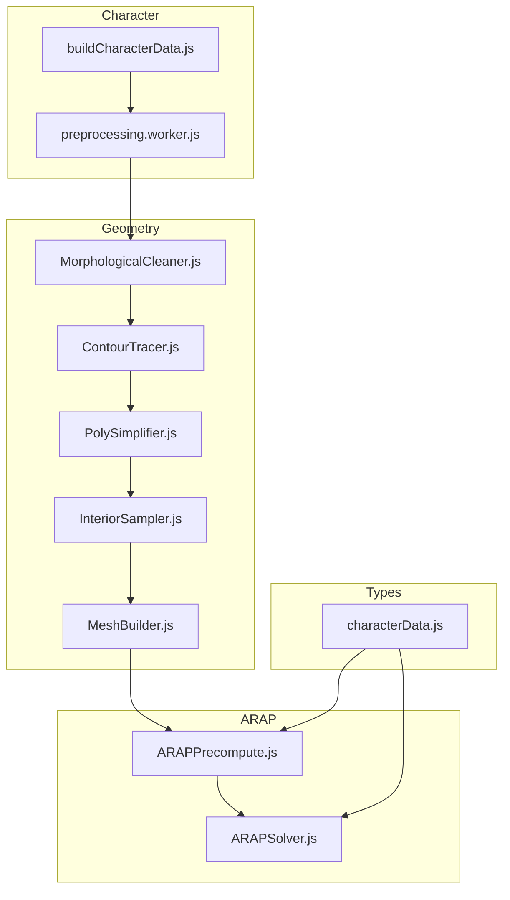
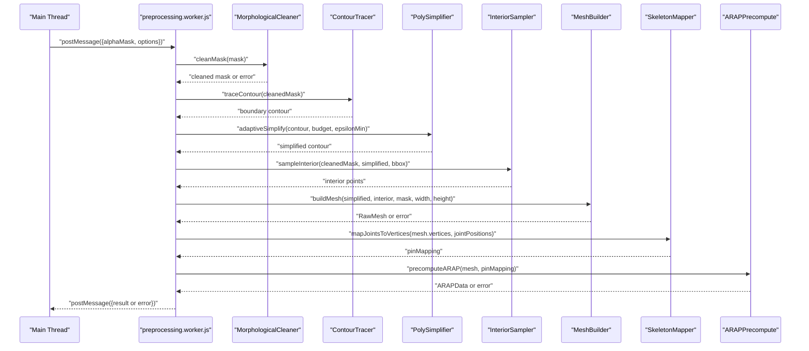
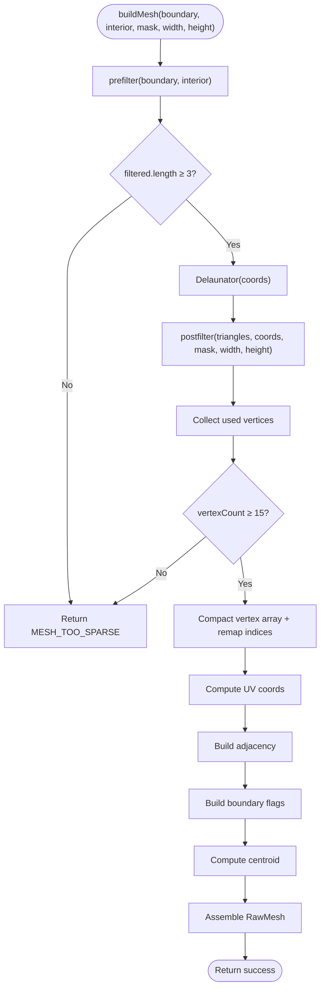
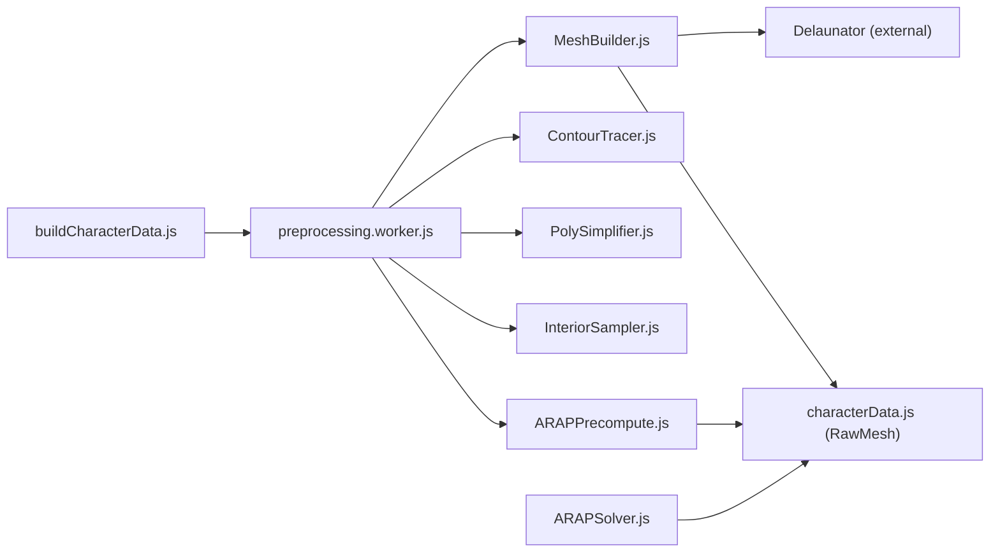

# Mesh Building

<cite>
**Referenced Files in This Document**
- [MeshBuilder.js](file://src/geometry/MeshBuilder.js)
- [MeshBuilder.test.js](file://src/geometry/MeshBuilder.test.js)
- [ContourTracer.js](file://src/geometry/ContourTracer.js)
- [PolySimplifier.js](file://src/geometry/PolySimplifier.js)
- [InteriorSampler.js](file://src/geometry/InteriorSampler.js)
- [MorphologicalCleaner.js](file://src/geometry/MorphologicalCleaner.js)
- [preprocessing.worker.js](file://src/character/workers/preprocessing.worker.js)
- [buildCharacterData.js](file://src/character/buildCharacterData.js)
- [characterData.js](file://src/types/characterData.js)
- [ARAPPrecompute.js](file://src/arap/ARAPPrecompute.js)
- [ARAPSolver.js](file://src/arap/ARAPSolver.js)
</cite>

## Table of Contents
1. [Introduction](#introduction)
2. [Project Structure](#project-structure)
3. [Core Components](#core-components)
4. [Architecture Overview](#architecture-overview)
5. [Detailed Component Analysis](#detailed-component-analysis)
6. [Dependency Analysis](#dependency-analysis)
7. [Performance Considerations](#performance-considerations)
8. [Troubleshooting Guide](#troubleshooting-guide)
9. [Conclusion](#conclusion)
10. [Appendices](#appendices)

## Introduction
This document explains the Mesh Building component responsible for generating robust triangle meshes from traced contours in PaperAlive. It focuses on the Delaunay triangulation algorithm implementation, vertex insertion strategy, triangle quality optimization, mesh connectivity maintenance, UV mapping, and handling of mesh degeneracies. It also covers integration with ARAP deformation algorithms and practical examples of mesh generation from various contour shapes.

## Project Structure
The mesh building pipeline is part of a larger preprocessing workflow executed in a Web Worker. The relevant modules are organized under geometry, skeleton, arap, and character packages.

**Diagram sources**
- [preprocessing.worker.js:86-192](file://src/character/workers/preprocessing.worker.js#L86-L192)
- [MeshBuilder.js:35-137](file://src/geometry/MeshBuilder.js#L35-L137)
- [ARAPPrecompute.js:206-296](file://src/arap/ARAPPrecompute.js#L206-L296)

**Section sources**
- [preprocessing.worker.js:86-192](file://src/character/workers/preprocessing.worker.js#L86-L192)
- [characterData.js:84-188](file://src/types/characterData.js#L84-L188)

## Core Components
- MeshBuilder: Implements the core mesh generation pipeline including pre/post-filtering, Delaunay triangulation, UV computation, adjacency, boundary flags, and centroid calculation.
- ContourTracer: Extracts the largest connected component and traces its outer boundary using Moore-Neighbor tracing.
- PolySimplifier: Applies adaptive Douglas-Peucker simplification to reduce contour complexity while respecting a vertex budget.
- InteriorSampler: Generates interior sample points using a normalized grid within the mask’s bounding box.
- MorphologicalCleaner: Cleans the binary mask using morphological operations and flood-fill to remove noise and holes.
- ARAPPrecompute: Computes cotangent weights, builds sparse Laplacian matrices, and performs Cholesky factorization for ARAP deformation.
- ARAPSolver: Performs per-frame ARAP deformation using local SVD and global back-substitution.

**Section sources**
- [MeshBuilder.js:24-137](file://src/geometry/MeshBuilder.js#L24-L137)
- [ContourTracer.js:25-54](file://src/geometry/ContourTracer.js#L25-L54)
- [PolySimplifier.js:14-49](file://src/geometry/PolySimplifier.js#L14-L49)
- [InteriorSampler.js:17-50](file://src/geometry/InteriorSampler.js#L17-L50)
- [MorphologicalCleaner.js:19-55](file://src/geometry/MorphologicalCleaner.js#L19-L55)
- [ARAPPrecompute.js:34-296](file://src/arap/ARAPPrecompute.js#L34-L296)
- [ARAPSolver.js:22-337](file://src/arap/ARAPSolver.js#L22-L337)

## Architecture Overview
The mesh building pipeline runs in a Web Worker to keep the main thread responsive. It orchestrates mask cleaning, contour extraction, simplification, interior sampling, mesh generation, skeleton mapping, and ARAP precomputation.

**Diagram sources**
- [preprocessing.worker.js:34-71](file://src/character/workers/preprocessing.worker.js#L34-L71)
- [preprocessing.worker.js:86-192](file://src/character/workers/preprocessing.worker.js#L86-L192)
- [buildCharacterData.js:71-152](file://src/character/buildCharacterData.js#L71-L152)

## Detailed Component Analysis

### MeshBuilder: Delaunay Triangulation and Mesh Generation
MeshBuilder constructs a triangle mesh from a simplified boundary contour and interior sample points. It applies pre/post-filters, computes UV coordinates, adjacency lists, boundary flags, and centroid.

Key stages:
- Pre-filter: Removes interior points closer than a minimum distance to any existing point, prioritizing boundary preservation.
- Delaunay triangulation: Uses Delaunator to triangulate the combined point set.
- Post-filter: Removes triangles with area below a minimum threshold or centroids outside the mask.
- Compact vertex remapping: Builds a compact vertex array and remaps triangle indices.
- UV mapping: Normalizes vertex coordinates to [0,1] using image width/height.
- Adjacency: Builds neighbor lists for each vertex.
- Boundary flags: Marks vertices present in the simplified contour.
- Centroid: Computes the average of vertex positions.
- Guards: Ensures minimum vertex count and reports structured errors.

**Diagram sources**
- [MeshBuilder.js:35-137](file://src/geometry/MeshBuilder.js#L35-L137)
- [MeshBuilder.js:149-173](file://src/geometry/MeshBuilder.js#L149-L173)
- [MeshBuilder.js:187-213](file://src/geometry/MeshBuilder.js#L187-L213)
- [MeshBuilder.js:225-246](file://src/geometry/MeshBuilder.js#L225-L246)
- [MeshBuilder.js:259-273](file://src/geometry/MeshBuilder.js#L259-L273)

Implementation highlights:
- Vertex insertion strategy: Preserves all boundary points and inserts interior points only if they exceed the minimum separation threshold.
- Triangle quality optimization: Filters triangles by area and centroid mask membership.
- Connectivity maintenance: Builds adjacency lists and ensures triangle indices reference compact vertex indices.
- UV mapping: Uses normalized coordinates derived from image dimensions.
- Degeneracy handling: Guards against too few points and enforces minimum vertex count.

Practical examples:
- Rectangular regions: The tests demonstrate successful triangulation with grid-sampled interiors and rectangular boundaries.
- Adaptive simplification impact: The worker pipeline adapts epsilon to meet vertex budgets, influencing mesh density.

Integration with ARAP:
- MeshBuilder produces a RawMesh compatible with ARAPPrecompute, which expects adjacency, weights, and indices.

**Section sources**
- [MeshBuilder.js:24-137](file://src/geometry/MeshBuilder.js#L24-L137)
- [MeshBuilder.test.js:52-94](file://src/geometry/MeshBuilder.test.js#L52-L94)
- [MeshBuilder.test.js:98-142](file://src/geometry/MeshBuilder.test.js#L98-L142)
- [MeshBuilder.test.js:146-192](file://src/geometry/MeshBuilder.test.js#L146-L192)
- [MeshBuilder.test.js:196-285](file://src/geometry/MeshBuilder.test.js#L196-L285)
- [MeshBuilder.test.js:289-333](file://src/geometry/MeshBuilder.test.js#L289-L333)
- [MeshBuilder.test.js:337-386](file://src/geometry/MeshBuilder.test.js#L337-L386)

### ContourTracer: Boundary Extraction
ContourTracer identifies the largest connected component using 4-connectivity and traces its outer boundary using Moore-Neighbor tracing with 8-connectivity. It ensures a closed polygon and removes duplicates.

Key behaviors:
- Largest component detection via BFS.
- Moore-Neighbor tracing with direction-aware neighbor scanning.
- Deduplication of consecutive identical points.

**Section sources**
- [ContourTracer.js:31-54](file://src/geometry/ContourTracer.js#L31-L54)
- [ContourTracer.js:67-137](file://src/geometry/ContourTracer.js#L67-L137)
- [ContourTracer.js:151-211](file://src/geometry/ContourTracer.js#L151-L211)

### PolySimplifier: Contour Simplification with Vertex Budget
PolySimplifier applies adaptive Douglas-Peucker simplification to reduce contour complexity. It increases epsilon until the total number of points (boundary + interior) meets the vertex budget.

Key behaviors:
- Standard Douglas-Peucker recursion with perpendicular distance threshold.
- Adaptive loop that increases epsilon until budget is satisfied.
- Iteration cap to prevent infinite loops.

**Section sources**
- [PolySimplifier.js:21-49](file://src/geometry/PolySimplifier.js#L21-L49)
- [PolySimplifier.js:62-117](file://src/geometry/PolySimplifier.js#L62-L117)
- [preprocessing.worker.js:207-224](file://src/character/workers/preprocessing.worker.js#L207-L224)

### InteriorSampler: Interior Point Sampling
InteriorSampler generates a normalized grid of interior points within the mask’s bounding box. Grid spacing is computed from the bounding box dimensions and a target grid count, with a minimum spacing enforced.

Key behaviors:
- Spacing = max(ceil(max(width,height)/20), 5).
- Samples only foreground pixels inside the mask.
- Grid origin aligned to the bounding box top-left.

**Section sources**
- [InteriorSampler.js:25-50](file://src/geometry/InteriorSampler.js#L25-L50)

### MorphologicalCleaner: Mask Cleaning
MorphologicalCleaner prepares the binary mask by:
- Morphological closing (dilate → erode) to fill small gaps.
- Flood fill from edges to remove foreground connected to borders.
- Hole filling from the centroid to fill interior holes.
- Foreground ratio guard to ensure sufficient foreground pixels.

**Section sources**
- [MorphologicalCleaner.js:26-55](file://src/geometry/MorphologicalCleaner.js#L26-L55)
- [MorphologicalCleaner.js:62-104](file://src/geometry/MorphologicalCleaner.js#L62-L104)
- [MorphologicalCleaner.js:116-160](file://src/geometry/MorphologicalCleaner.js#L116-L160)
- [MorphologicalCleaner.js:166-211](file://src/geometry/MorphologicalCleaner.js#L166-L211)

### ARAP Integration: Precomputation and Solver
ARAPPrecompute computes cotangent weights, constructs sparse Laplacian matrices (both pinned and free modes), and performs Cholesky factorization with fallback to uniform weights. ARAPSolver performs local SVD per vertex and global back-substitution to deform the mesh according to joint handles.

Key behaviors:
- Cotangent weight computation with clamping and fallback to uniform weights.
- Sparse matrix representation and dual Cholesky factorization.
- Local SVD and global step with pin constraints or penalty constraints.

**Section sources**
- [ARAPPrecompute.js:34-107](file://src/arap/ARAPPrecompute.js#L34-L107)
- [ARAPPrecompute.js:121-188](file://src/arap/ARAPPrecompute.js#L121-L188)
- [ARAPPrecompute.js:206-296](file://src/arap/ARAPPrecompute.js#L206-L296)
- [ARAPSolver.js:136-200](file://src/arap/ARAPSolver.js#L136-L200)
- [ARAPSolver.js:212-309](file://src/arap/ARAPSolver.js#L212-L309)

## Dependency Analysis
The mesh building component depends on geometry utilities and contributes to ARAP deformation. The worker orchestrates the pipeline and serializes results for transfer.

**Diagram sources**
- [MeshBuilder.js:18](file://src/geometry/MeshBuilder.js#L18)
- [characterData.js:84-96](file://src/types/characterData.js#L84-L96)
- [preprocessing.worker.js:18-26](file://src/character/workers/preprocessing.worker.js#L18-L26)
- [buildCharacterData.js:18-20](file://src/character/buildCharacterData.js#L18-L20)
- [ARAPPrecompute.js:16-17](file://src/arap/ARAPPrecompute.js#L16-L17)
- [ARAPSolver.js:14-15](file://src/arap/ARAPSolver.js#L14-L15)

**Section sources**
- [MeshBuilder.js:18](file://src/geometry/MeshBuilder.js#L18)
- [characterData.js:84-96](file://src/types/characterData.js#L84-L96)
- [preprocessing.worker.js:18-26](file://src/character/workers/preprocessing.worker.js#L18-L26)
- [buildCharacterData.js:18-20](file://src/character/buildCharacterData.js#L18-L20)
- [ARAPPrecompute.js:16-17](file://src/arap/ARAPPrecompute.js#L16-L17)
- [ARAPSolver.js:14-15](file://src/arap/ARAPSolver.js#L14-L15)

## Performance Considerations
- Delaunay triangulation cost: O(n log n) typical for 2D Delaunator; complexity depends on point distribution.
- Pre/post-filters: Linear in number of triangles and points; minimal overhead.
- Adjacency construction: O(t) where t is triangle count; acceptable for moderate meshes.
- ARAP precomputation: Sparse matrix assembly and Cholesky factorization dominate; scaling with vertex count and edge count.
- Memory transfers: Worker serialization uses Transferable TypedArrays to minimize copies.
- Vertex budget enforcement: Adaptive simplification reduces vertex count early, lowering downstream costs.

Optimization techniques:
- Reduce vertex count via adaptive simplification before meshing.
- Use compact vertex arrays and remapped indices to minimize memory footprint.
- Prefer coarser interior sampling grids for complex shapes to reduce triangle count.
- Monitor vertexBudgetExceeded flag to adjust budgets dynamically.

[No sources needed since this section provides general guidance]

## Troubleshooting Guide
Common issues and resolutions:
- MESH_TOO_SPARSE: Occurs when fewer than 3 points remain after pre-filtering or fewer than 15 vertices after filtering. Verify mask quality and contour extraction.
- MASK_TOO_SMALL: Morphological cleaning may remove too much foreground; adjust cleaning parameters or improve input mask.
- CHOLESKY_FAILED: ARAP factorization fails; fallback to uniform weights is attempted; check mesh degeneracies and connectivity.
- DEGENERATE_MESH: NaN detected in factor values; indicates invalid mesh topology or extreme geometry.

Diagnostic tips:
- Validate boundary and interior points visually and confirm pre/post-filter thresholds.
- Inspect adjacency and boundary flags to ensure connectivity.
- Review vertex count and triangle count statistics in CharacterData metadata.

**Section sources**
- [MeshBuilder.js:39-46](file://src/geometry/MeshBuilder.js#L39-L46)
- [MeshBuilder.js:70-77](file://src/geometry/MeshBuilder.js#L70-L77)
- [MorphologicalCleaner.js:46-52](file://src/geometry/MorphologicalCleaner.js#L46-L52)
- [ARAPPrecompute.js:243-251](file://src/arap/ARAPPrecompute.js#L243-L251)
- [ARAPPrecompute.js:260-267](file://src/arap/ARAPPrecompute.js#L260-L267)

## Conclusion
The Mesh Building component provides a robust pipeline for generating high-quality triangle meshes from contours. It combines careful vertex insertion, triangle quality checks, and connectivity maintenance with efficient UV mapping and integration-ready mesh outputs. Combined with ARAP precomputation and solver, it enables realistic deformations suitable for interactive applications.

[No sources needed since this section summarizes without analyzing specific files]

## Appendices

### Practical Examples and Optimization Techniques
- Rectangle region: Grid-sampled interior points with rectangular boundary produce dense but well-shaped meshes; use adaptive simplification to reduce vertex count.
- Circle-like contours: Higher curvature requires more points; apply aggressive simplification and coarser interior sampling to balance fidelity and performance.
- Complex outlines: Use morphological cleaning to remove noise and holes; ensure sufficient foreground coverage to avoid MASK_TOO_SMALL.

Optimization techniques:
- Adjust dpEpsilonMin and vertexBudget to balance detail and performance.
- Coarsen interior sampling grid spacing for large regions.
- Post-process meshes to remove degenerate triangles and enforce minimum angles.

[No sources needed since this section provides general guidance]