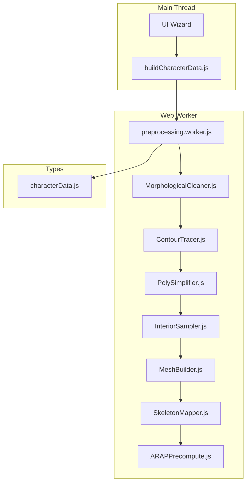
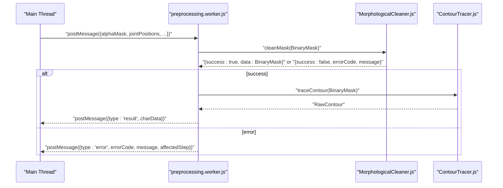
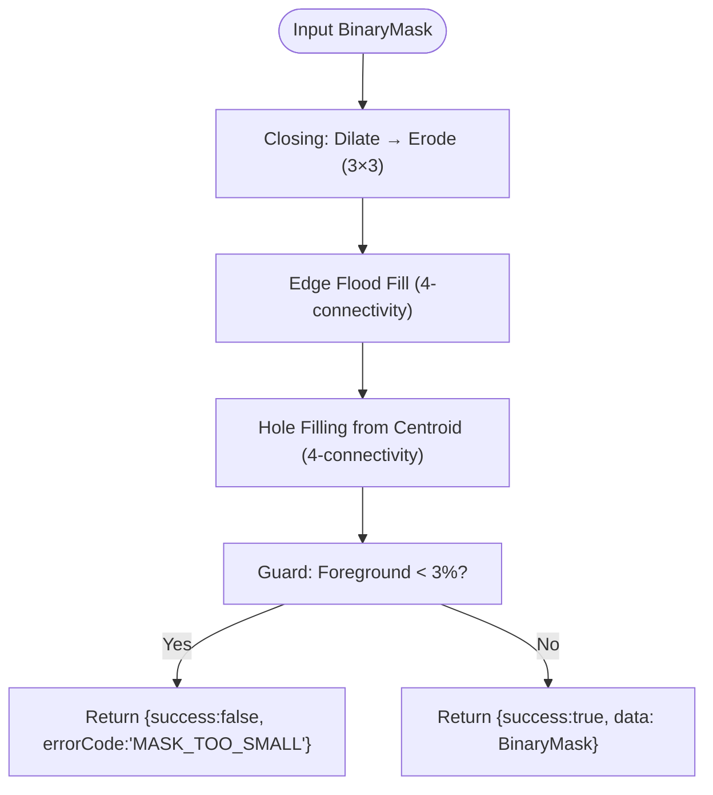
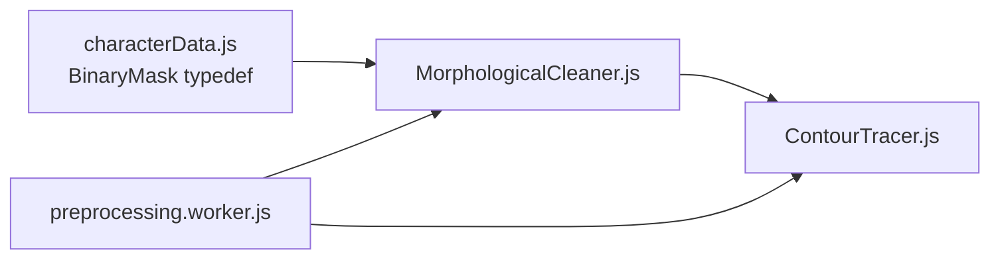

# Morphological Cleaning

<cite>
**Referenced Files in This Document**
- [MorphologicalCleaner.js](file://src/geometry/MorphologicalCleaner.js)
- [MorphologicalCleaner.test.js](file://src/geometry/MorphologicalCleaner.test.js)
- [characterData.js](file://src/types/characterData.js)
- [preprocessing.worker.js](file://src/character/workers/preprocessing.worker.js)
- [module_design.md](file://architecture/module_design.md)
- [dataflow.md](file://architecture/dataflow.md)
- [TASK-026-040-epic4-geometry.md](file://implementation/tasks/TASK-026-040-epic4-geometry.md)
</cite>

## Table of Contents
1. [Introduction](#introduction)
2. [Project Structure](#project-structure)
3. [Core Components](#core-components)
4. [Architecture Overview](#architecture-overview)
5. [Detailed Component Analysis](#detailed-component-analysis)
6. [Dependency Analysis](#dependency-analysis)
7. [Performance Considerations](#performance-considerations)
8. [Troubleshooting Guide](#troubleshooting-guide)
9. [Conclusion](#conclusion)

## Introduction
This document explains the Morphological Cleaning component used in PaperAlive’s preprocessing pipeline. It focuses on the four-stage morphological processing pipeline designed to refine binary masks prior to contour tracing:
- Morphological closing (dilation followed by erosion with a 3×3 kernel)
- Edge flood fill removal (4-connectivity)
- Hole filling from centroid (4-connectivity)
- Guard: minimum foreground ratio validation

It documents the worker-safe implementation approach, performance characteristics for large binary masks, and practical examples of noise removal, gap filling, and border artifact elimination. It also provides troubleshooting guidance for common mask quality issues.

## Project Structure
The Morphological Cleaner resides in the geometry module and integrates with the preprocessing pipeline executed inside a Web Worker. The module adheres to worker-safe constraints and returns structured results to support robust error handling.

**Diagram sources**
- [preprocessing.worker.js:86-192](file://src/character/workers/preprocessing.worker.js#L86-L192)
- [MorphologicalCleaner.js:26-55](file://src/geometry/MorphologicalCleaner.js#L26-L55)
- [characterData.js:134-188](file://src/types/characterData.js#L134-L188)

**Section sources**
- [module_design.md:270-296](file://architecture/module_design.md#L270-L296)
- [dataflow.md:17-112](file://architecture/dataflow.md#L17-L112)

## Core Components
- Morphological Cleaner: Implements the four-stage cleaning pipeline and validates mask quality via a guard threshold.
- Worker-safe constraints: Enforced across preprocessing modules to avoid DOM access.
- Structured error results: All preprocessing modules return either success data or a structured error with an error code and message.

Key responsibilities:
- Clean binary masks from noise before contour tracing.
- Preserve meaningful foreground while removing artifacts.
- Ensure minimal growth of shapes near borders.
- Validate that foreground coverage meets a minimum threshold.

**Section sources**
- [MorphologicalCleaner.js:1-55](file://src/geometry/MorphologicalCleaner.js#L1-L55)
- [module_design.md:117-142](file://architecture/module_design.md#L117-L142)

## Architecture Overview
The Morphological Cleaner sits between thresholding and contour tracing in the preprocessing pipeline. It receives a BinaryMask and returns a cleaned BinaryMask or a structured error if the mask fails quality validation.

**Diagram sources**
- [preprocessing.worker.js:86-101](file://src/character/workers/preprocessing.worker.js#L86-L101)
- [MorphologicalCleaner.js:26-55](file://src/geometry/MorphologicalCleaner.js#L26-L55)

**Section sources**
- [dataflow.md:67-99](file://architecture/dataflow.md#L67-L99)
- [module_design.md:579-631](file://architecture/module_design.md#L579-L631)

## Detailed Component Analysis

### Four-Stage Pipeline
The cleaning pipeline applies operations in sequence to refine the mask:

1. **Morphological Closing (3×3 kernel)**: Fills small gaps and slightly expands foreground to close minor holes.
2. **Edge Flood Fill Removal (4-connectivity)**: Removes foreground connected to image borders.
3. **Hole Filling from Centroid (4-connectivity)**: Fills interior holes by marking exterior background and flipping remaining background to foreground.
4. **Guard: Minimum Foreground Ratio**: Validates that foreground coverage is at least 3% of the image area.

**Diagram sources**
- [MorphologicalCleaner.js:26-55](file://src/geometry/MorphologicalCleaner.js#L26-L55)

**Section sources**
- [MorphologicalCleaner.js:26-55](file://src/geometry/MorphologicalCleaner.js#L26-L55)

### 3×3 Kernel Operations: Dilate and Erode
- Dilate: A pixel becomes foreground if any of its 8-neighbors (including itself) is foreground.
- Erode: A pixel becomes foreground only if all of its 8-neighbors (including itself) are foreground. Out-of-bounds pixels are treated as foreground to preserve edge pixels.

Complexity:
- Both operations iterate over each pixel once and inspect up to nine neighbors.
- Time complexity: O(W×H) per operation.
- Space complexity: O(W×H) for the destination array.

Practical impact:
- Closing helps connect nearby components and fill small gaps.
- Erosion prevents excessive growth near borders, preserving shape integrity.

**Section sources**
- [MorphologicalCleaner.js:62-104](file://src/geometry/MorphologicalCleaner.js#L62-L104)

### 4-Connectivity Flood Fill Algorithms
Two flood fill routines use 4-connectivity (up, down, left, right):

1. **Edge Flood Fill**:
   - Seeds are all foreground pixels located on the image edges.
   - Performs breadth-first traversal to mark connected foreground pixels as background.
   - Effectively removes border artifacts and noise attached to edges.

2. **Hole Filling from Centroid**:
   - Seeds are all background pixels located on the image edges.
   - Marks all background pixels reachable via 4-connectivity as “exterior.”
   - Flips remaining background pixels (interior holes) to foreground.

Complexity:
- Each BFS traverses at most W×H pixels.
- Time complexity: O(W×H).
- Space complexity: O(W×H) for visited/mark arrays and queue.

**Section sources**
- [MorphologicalCleaner.js:116-160](file://src/geometry/MorphologicalCleaner.js#L116-L160)
- [MorphologicalCleaner.js:166-211](file://src/geometry/MorphologicalCleaner.js#L166-L211)

### Guard Mechanism: Minimum Foreground Ratio Validation
After cleaning, the component counts foreground pixels and compares against a 3% threshold:
- If foreground fraction is below 3%, returns a structured error indicating the mask is too small.
- Otherwise, returns success with the cleaned mask.

This guard ensures downstream geometry processing has sufficient foreground to build contours and meshes.

**Section sources**
- [MorphologicalCleaner.js:17-55](file://src/geometry/MorphologicalCleaner.js#L17-L55)

### Worker-Safe Implementation Approach
- No DOM access: The module is annotated as worker-safe and does not rely on browser APIs.
- Pure functions: All operations are deterministic and operate on typed arrays.
- Structured results: Ensures robust error propagation without throwing exceptions.

Integration:
- Called from the Web Worker pipeline, which manages progress reporting and serialization of results.

**Section sources**
- [MorphologicalCleaner.js:1-15](file://src/geometry/MorphologicalCleaner.js#L1-L15)
- [preprocessing.worker.js:86-101](file://src/character/workers/preprocessing.worker.js#L86-L101)
- [module_design.md:117-131](file://architecture/module_design.md#L117-L131)

### Practical Examples
- Noise removal: Border-attached noise is eliminated by edge flood fill, leaving only the intended foreground.
- Gap filling: Small gaps between components are closed by morphological closing.
- Border artifact elimination: Foreground touching edges is removed to avoid spurious contours.

Validation examples:
- Tests demonstrate successful gap filling, controlled growth near edges, and correct removal of edge-connected foreground.
- Hole filling preserves outer shapes while filling interior holes.
- Guard correctly rejects masks with less than 3% foreground coverage.

**Section sources**
- [MorphologicalCleaner.test.js:33-74](file://src/geometry/MorphologicalCleaner.test.js#L33-L74)
- [MorphologicalCleaner.test.js:78-115](file://src/geometry/MorphologicalCleaner.test.js#L78-L115)
- [MorphologicalCleaner.test.js:119-167](file://src/geometry/MorphologicalCleaner.test.js#L119-L167)

## Dependency Analysis
The Morphological Cleaner depends on the BinaryMask type and is consumed by the ContourTracer. It is invoked within the Web Worker pipeline and returns structured results to the main thread.

**Diagram sources**
- [characterData.js:18-22](file://src/types/characterData.js#L18-L22)
- [MorphologicalCleaner.js:22-24](file://src/geometry/MorphologicalCleaner.js#L22-L24)
- [preprocessing.worker.js:86-101](file://src/character/workers/preprocessing.worker.js#L86-L101)

**Section sources**
- [dataflow.md:165-183](file://architecture/dataflow.md#L165-L183)
- [module_design.md:270-296](file://architecture/module_design.md#L270-L296)

## Performance Considerations
- Complexity: Each stage operates in O(W×H) time with a constant factor determined by neighbor checks and BFS traversal.
- Memory: Additional arrays are allocated per stage (destination mask, visited arrays, queues). For typical images up to 1024×1024, memory usage remains reasonable.
- Large masks: For very large images, consider:
  - Pre-resizing input images to reduce W×H.
  - Using the existing worker isolation to keep heavy computations off the main thread.
  - Monitoring progress events to provide feedback during long operations.
- Avoid allocations in tight loops: The implementation pre-allocates arrays and avoids repeated object creation.

[No sources needed since this section provides general guidance]

## Troubleshooting Guide
Common issues and resolutions:
- Mask too small (guard failure):
  - Cause: Foreground coverage below 3% after cleaning.
  - Resolution: Adjust thresholding parameters or manually edit the mask to increase foreground area.
  - Detection: The guard returns a structured error with an explanatory message.

- Edge artifacts persist:
  - Cause: Foreground connected to edges remains after cleaning.
  - Resolution: Verify that thresholding produces a clean initial mask; re-run cleaning to ensure edge flood fill is applied.

- Holes not filled:
  - Cause: Centroid-based hole filling relies on 4-connectivity; diagonal holes may not be recognized as interior.
  - Resolution: Increase mask thickness or adjust thresholding to ensure continuous foreground connectivity.

- Excessive growth near borders:
  - Cause: Closing operation may slightly expand shapes.
  - Resolution: Confirm that growth is within acceptable bounds; if needed, refine thresholding or mask editing.

- No DOM access errors:
  - Cause: Using DOM-dependent code in preprocessing modules.
  - Resolution: Ensure all preprocessing modules are worker-safe and do not access DOM.

**Section sources**
- [MorphologicalCleaner.js:46-52](file://src/geometry/MorphologicalCleaner.js#L46-L52)
- [MorphologicalCleaner.test.js:137-157](file://src/geometry/MorphologicalCleaner.test.js#L137-L157)
- [module_design.md:117-131](file://architecture/module_design.md#L117-L131)

## Conclusion
The Morphological Cleaning component provides a robust, worker-safe pipeline to prepare binary masks for downstream geometry processing. By combining morphological closing, edge flood fill removal, centroid-based hole filling, and a guard threshold, it reliably removes noise and artifacts while preserving meaningful foreground shapes. Its O(W×H) complexity and pure functional design make it suitable for large images when executed in a Web Worker, and its structured error handling enables graceful degradation and user feedback.