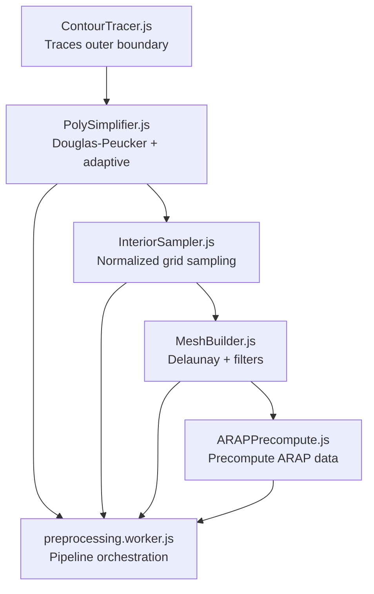
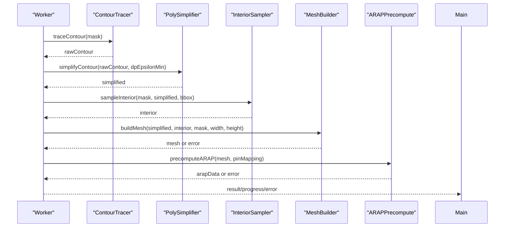
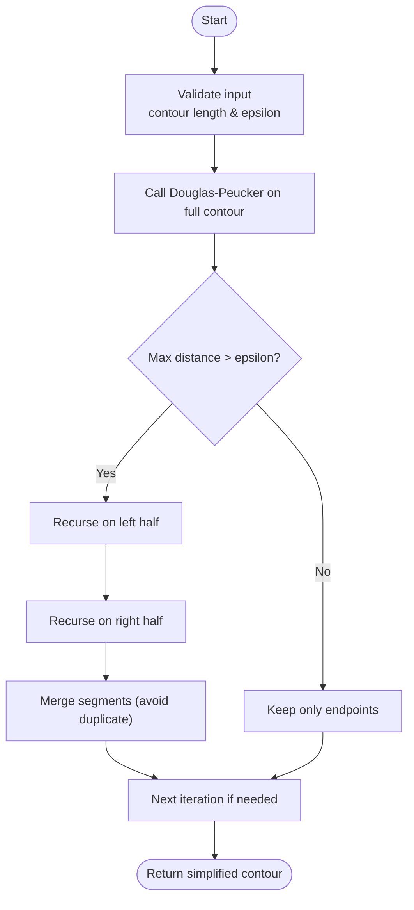
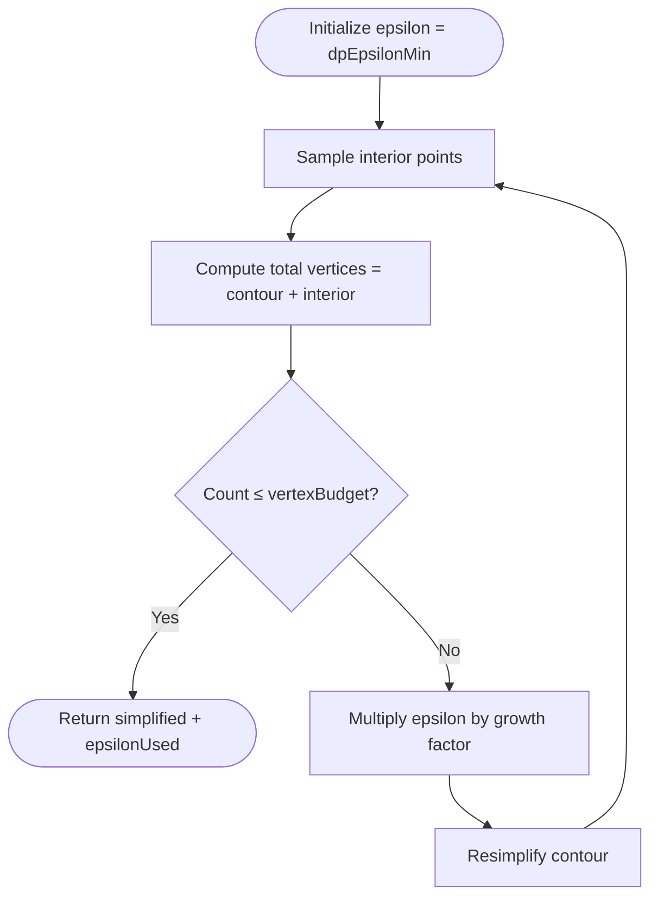
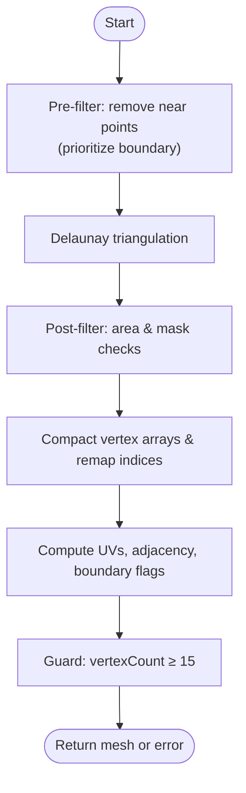
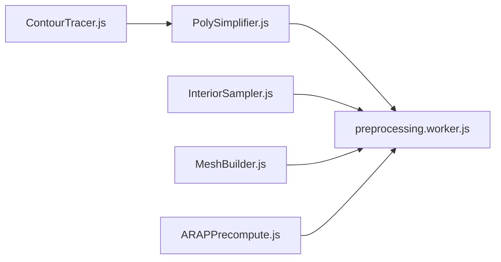

# Polygon Simplification

<cite>
**Referenced Files in This Document**
- [PolySimplifier.js](file://src/geometry/PolySimplifier.js)
- [PolySimplifier.test.js](file://src/geometry/PolySimplifier.test.js)
- [module_design.md](file://architecture/module_design.md)
- [preprocessing.worker.js](file://src/character/workers/preprocessing.worker.js)
- [MeshBuilder.js](file://src/geometry/MeshBuilder.js)
- [MeshBuilder.test.js](file://src/geometry/MeshBuilder.test.js)
- [ContourTracer.js](file://src/geometry/ContourTracer.js)
- [ContourTracer.test.js](file://src/geometry/ContourTracer.test.js)
- [InteriorSampler.js](file://src/geometry/InteriorSampler.js)
- [characterData.js](file://src/types/characterData.js)
- [rendering_pipeline.md](file://architecture/rendering_pipeline.md)
</cite>

## Table of Contents
1. [Introduction](#introduction)
2. [Project Structure](#project-structure)
3. [Core Components](#core-components)
4. [Architecture Overview](#architecture-overview)
5. [Detailed Component Analysis](#detailed-component-analysis)
6. [Dependency Analysis](#dependency-analysis)
7. [Performance Considerations](#performance-considerations)
8. [Troubleshooting Guide](#troubleshooting-guide)
9. [Conclusion](#conclusion)

## Introduction
This document explains the Polygon Simplification component used by PaperAlive’s mesh optimization pipeline. It focuses on the Douglas-Peucker contour simplification algorithm, adaptive epsilon tuning, and how these techniques reduce triangle counts while preserving shape fidelity. The document also details the iterative simplification process, stopping conditions, and practical guidelines for balancing mesh quality and computational efficiency.

## Project Structure
The polygon simplification capability is part of a larger preprocessing pipeline executed in a Web Worker. The relevant modules are:
- Contour tracing produces a raw boundary polygon
- Polygon simplification reduces the number of contour points
- Interior sampling generates additional points inside the shape
- Mesh building triangulates the combined points and validates the mesh
- The worker enforces a vertex budget and tracks performance metrics

**Diagram sources**
- [ContourTracer.js:31-54](file://src/geometry/ContourTracer.js#L31-L54)
- [PolySimplifier.js:21-49](file://src/geometry/PolySimplifier.js#L21-L49)
- [InteriorSampler.js:25-50](file://src/geometry/InteriorSampler.js#L25-L50)
- [MeshBuilder.js:35-137](file://src/geometry/MeshBuilder.js#L35-L137)
- [preprocessing.worker.js:86-192](file://src/character/workers/preprocessing.worker.js#L86-L192)

**Section sources**
- [module_design.md:346-366](file://architecture/module_design.md#L346-L366)
- [preprocessing.worker.js:6-8](file://src/character/workers/preprocessing.worker.js#L6-L8)

## Core Components
- Polygon Simplifier: Implements Douglas-Peucker simplification and adaptive epsilon tuning to meet a vertex budget.
- Mesh Builder: Builds a triangulated mesh from boundary and interior points, applies pre/post filters, and computes auxiliary data (UVs, adjacency, boundary flags).
- Worker Pipeline: Coordinates the full preprocessing pipeline, enforcing vertex budgets and reporting progress.

Key simplification APIs:
- `simplifyContour(contour, epsilon)` — standard Douglas-Peucker simplification
- `adaptiveSimplify(contour, maxPoints, minEps)` — increases epsilon until ≤ maxPoints

Validation and mesh construction:
- `buildMesh(boundary, interior, mask, width, height)` — triangulation, filtering, and mesh assembly

**Section sources**
- [PolySimplifier.js:21-49](file://src/geometry/PolySimplifier.js#L21-L49)
- [MeshBuilder.js:35-137](file://src/geometry/MeshBuilder.js#L35-L137)
- [preprocessing.worker.js:194-224](file://src/character/workers/preprocessing.worker.js#L194-L224)

## Architecture Overview
The simplification process is embedded in the preprocessing pipeline that builds a character mesh. The worker orchestrates:
1. Morphological cleaning
2. Contour tracing
3. Polygon simplification with adaptive epsilon
4. Interior sampling
5. Mesh building with validation
6. Skeleton mapping and ARAP precomputation

**Diagram sources**
- [preprocessing.worker.js:86-192](file://src/character/workers/preprocessing.worker.js#L86-L192)
- [ContourTracer.js:31-54](file://src/geometry/ContourTracer.js#L31-L54)
- [PolySimplifier.js:21-49](file://src/geometry/PolySimplifier.js#L21-L49)
- [InteriorSampler.js:25-50](file://src/geometry/InteriorSampler.js#L25-L50)
- [MeshBuilder.js:35-137](file://src/geometry/MeshBuilder.js#L35-L137)

## Detailed Component Analysis

### Polygon Simplification: Douglas-Peucker and Adaptive Epsilon
The simplifier reduces contour complexity by recursively removing points that lie within a perpendicular distance threshold (epsilon) from the line segment formed by the endpoints of a contour portion. When the maximum distance exceeds epsilon, the algorithm recurses on both sides of the farthest point; otherwise, intermediate points are discarded.

Adaptive simplification progressively increases epsilon until the number of contour points falls below a target threshold. The worker enforces a maximum iteration cap to prevent infinite loops.

**Diagram sources**
- [PolySimplifier.js:62-92](file://src/geometry/PolySimplifier.js#L62-L92)

Implementation highlights:
- Perpendicular distance calculation avoids division by zero for degenerate segments.
- The recursive routine ensures closed polygons by avoiding duplicated split points when merging.
- Adaptive loop uses a multiplicative growth factor and caps iterations.

Practical parameters:
- Epsilon controls the maximum deviation from the original curve.
- Minimum epsilon sets a baseline for adaptive simplification.
- Iteration limits protect against pathological inputs.

**Section sources**
- [PolySimplifier.js:102-117](file://src/geometry/PolySimplifier.js#L102-L117)
- [PolySimplifier.js:37-49](file://src/geometry/PolySimplifier.js#L37-L49)
- [PolySimplifier.test.js:27-74](file://src/geometry/PolySimplifier.test.js#L27-L74)
- [PolySimplifier.test.js:78-111](file://src/geometry/PolySimplifier.test.js#L78-L111)

### Iterative Simplification and Stopping Conditions
The worker pipeline performs iterative simplification to meet a vertex budget:
- Start with a minimum epsilon
- Simplify the raw contour
- Sample interior points and compute total vertex count
- If total exceeds the budget, multiply epsilon by a growth factor and repeat
- Cap iterations to prevent excessive runtime

**Diagram sources**
- [preprocessing.worker.js:207-224](file://src/character/workers/preprocessing.worker.js#L207-L224)

Stopping conditions:
- Budget satisfied
- Maximum iterations reached
- Degenerate contours (e.g., fewer than 3 points) cause early termination

**Section sources**
- [preprocessing.worker.js:207-224](file://src/character/workers/preprocessing.worker.js#L207-L224)
- [preprocessing.worker.js:108-117](file://src/character/workers/preprocessing.worker.js#L108-L117)

### Quality Preservation Mechanisms
Quality is preserved through:
- Output points are always members of the original contour (no interpolation artifacts).
- Closed polygon property maintained by ensuring first and last points match.
- Degenerate handling: returns minimal valid contours for near-degenerate inputs.
- Worker constraints: all geometry modules are worker-safe and avoid DOM access.

Validation tests confirm:
- Output points exist in the input contour
- Closed polygons with no duplicate consecutive points
- No DOM access in simplification routines

**Section sources**
- [PolySimplifier.js:21-26](file://src/geometry/PolySimplifier.js#L21-L26)
- [PolySimplifier.test.js:43-53](file://src/geometry/PolySimplifier.test.js#L43-L53)
- [PolySimplifier.test.js:42-74](file://src/geometry/PolySimplifier.test.js#L42-L74)

### Mesh Building and Triangle Reduction
After simplification, the pipeline constructs a triangulated mesh:
- Pre-filter removes points closer than a minimum distance, prioritizing boundary points
- Delaunay triangulation via Delaunator
- Post-filter removes triangles with small areas or centroids outside the mask
- Computes UV coordinates, adjacency lists, boundary flags, and centroid
- Enforces a minimum vertex count guard and a vertex budget flag

**Diagram sources**
- [MeshBuilder.js:35-137](file://src/geometry/MeshBuilder.js#L35-L137)

Mesh validation ensures:
- Minimum edge distance prevents degenerate triangles
- Area threshold eliminates tiny triangles
- Centroid mask check keeps triangles inside the silhouette
- Vertex budget enforcement prevents excessive triangles

**Section sources**
- [MeshBuilder.js:149-173](file://src/geometry/MeshBuilder.js#L149-L173)
- [MeshBuilder.js:187-213](file://src/geometry/MeshBuilder.js#L187-L213)
- [MeshBuilder.js:225-246](file://src/geometry/MeshBuilder.js#L225-L246)
- [MeshBuilder.js:259-273](file://src/geometry/MeshBuilder.js#L259-L273)
- [MeshBuilder.test.js:52-94](file://src/geometry/MeshBuilder.test.js#L52-L94)
- [MeshBuilder.test.js:146-192](file://src/geometry/MeshBuilder.test.js#L146-L192)
- [MeshBuilder.test.js:287-333](file://src/geometry/MeshBuilder.test.js#L287-L333)

### Practical Examples and Complexity Levels
- Low complexity: Circle with 1000 points and epsilon tuned to under 200 points
- Adaptive scenario: Very dense contours reduced to ≤ 400 points with controlled epsilon growth
- Degenerate cases: Straight lines simplified to endpoints; minimal contours handled gracefully

These examples demonstrate the algorithm’s ability to preserve shape fidelity while dramatically reducing point counts.

**Section sources**
- [PolySimplifier.test.js:28-34](file://src/geometry/PolySimplifier.test.js#L28-L34)
- [PolySimplifier.test.js:79-85](file://src/geometry/PolySimplifier.test.js#L79-L85)
- [PolySimplifier.test.js:66-73](file://src/geometry/PolySimplifier.test.js#L66-L73)

## Dependency Analysis
The simplification component integrates tightly with the preprocessing pipeline and depends on:
- ContourTracer for raw boundary extraction
- InteriorSampler for interior point generation
- MeshBuilder for triangulation and validation
- Worker orchestration for adaptive budget enforcement

**Diagram sources**
- [ContourTracer.js:31-54](file://src/geometry/ContourTracer.js#L31-L54)
- [PolySimplifier.js:21-49](file://src/geometry/PolySimplifier.js#L21-L49)
- [InteriorSampler.js:25-50](file://src/geometry/InteriorSampler.js#L25-L50)
- [MeshBuilder.js:35-137](file://src/geometry/MeshBuilder.js#L35-L137)
- [preprocessing.worker.js:86-192](file://src/character/workers/preprocessing.worker.js#L86-L192)

**Section sources**
- [module_design.md:346-366](file://architecture/module_design.md#L346-L366)
- [preprocessing.worker.js:6-8](file://src/character/workers/preprocessing.worker.js#L6-L8)

## Performance Considerations
- Douglas-Peucker recursion depth scales with contour complexity; adaptive epsilon reduces total point count and subsequent triangulation cost.
- MeshBuilder pre/post filters eliminate degenerate triangles and reduce triangle count, improving downstream ARAP performance.
- Vertex budget enforcement caps mesh size to keep ARAP computations within acceptable time budgets.
- Worker-safe design enables off-main-thread computation, preventing UI stalls.

Guidelines:
- Choose dpEpsilonMin based on image scale and desired smoothness; higher values reduce points faster but risk shape fidelity.
- Use the adaptive loop to converge quickly to the vertex budget; monitor epsilonUsed for diagnostics.
- For very large images, normalize interior sampling spacing to avoid excessive interior points that inflate the budget.

**Section sources**
- [rendering_pipeline.md:354-367](file://architecture/rendering_pipeline.md#L354-L367)
- [preprocessing.worker.js:28-30](file://src/character/workers/preprocessing.worker.js#L28-L30)
- [InteriorSampler.js:14-28](file://src/geometry/InteriorSampler.js#L14-L28)

## Troubleshooting Guide
Common issues and resolutions:
- Too few points after simplification: Increase dpEpsilonMin or reduce growth factor in the adaptive loop.
- Excessive runtime: Reduce vertex budget or adjust epsilon growth; ensure interior sampling spacing is reasonable.
- Mesh too sparse errors: Verify contour tracing succeeded and produced ≥ 3 points; check mask validity.
- Degenerate contours: Ensure the input mask is valid and the largest connected component is traced.

Diagnostic tips:
- Inspect epsilonUsed to confirm convergence behavior.
- Validate that output points exist in the original contour.
- Confirm closed polygon property and absence of duplicate consecutive points.

**Section sources**
- [preprocessing.worker.js:108-117](file://src/character/workers/preprocessing.worker.js#L108-L117)
- [MeshBuilder.js:39-46](file://src/geometry/MeshBuilder.js#L39-L46)
- [MeshBuilder.test.js:289-333](file://src/geometry/MeshBuilder.test.js#L289-L333)
- [PolySimplifier.test.js:43-53](file://src/geometry/PolySimplifier.test.js#L43-L53)

## Conclusion
PaperAlive’s polygon simplification leverages Douglas-Peucker with adaptive epsilon to reduce contour complexity while preserving shape fidelity. Combined with mesh validation and vertex budget enforcement, the pipeline achieves efficient mesh generation suitable for real-time ARAP deformation. By tuning dpEpsilonMin and monitoring epsilonUsed, users can balance quality and performance across varying input complexities.