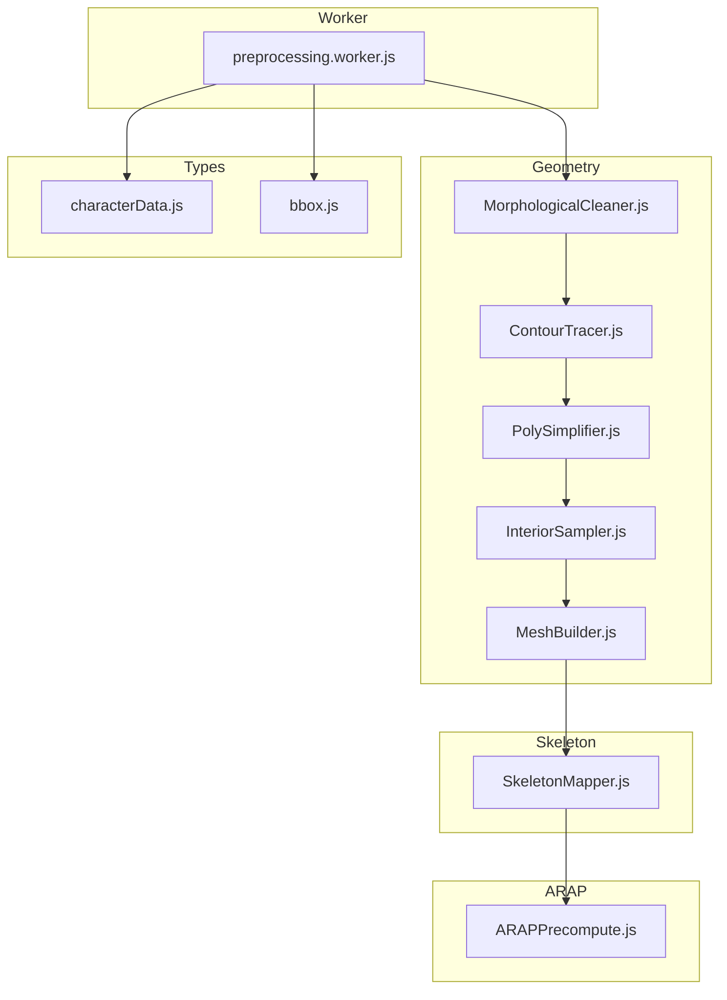
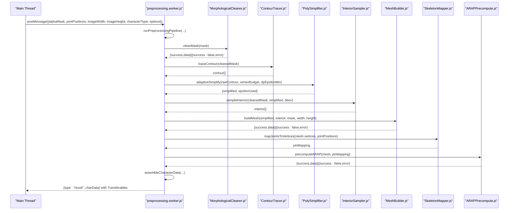
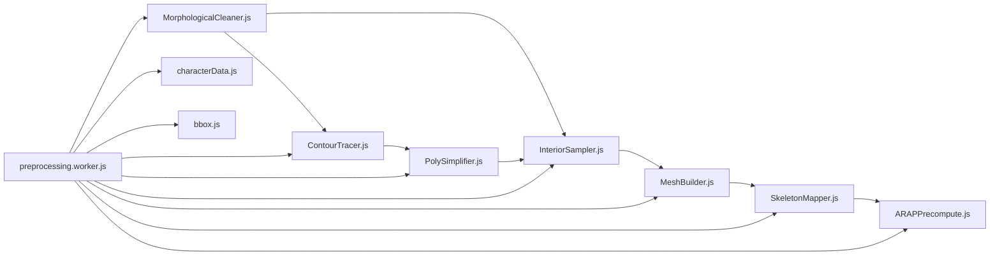

# Preprocessing Pipeline

<cite>
**Referenced Files in This Document**
- [MorphologicalCleaner.js](file://src/geometry/MorphologicalCleaner.js)
- [ContourTracer.js](file://src/geometry/ContourTracer.js)
- [PolySimplifier.js](file://src/geometry/PolySimplifier.js)
- [InteriorSampler.js](file://src/geometry/InteriorSampler.js)
- [MeshBuilder.js](file://src/geometry/MeshBuilder.js)
- [preprocessing.worker.js](file://src/character/workers/preprocessing.worker.js)
- [SkeletonMapper.js](file://src/skeleton/SkeletonMapper.js)
- [ARAPPrecompute.js](file://src/arap/ARAPPrecompute.js)
- [characterData.js](file://src/types/characterData.js)
- [bbox.js](file://src/utils/bbox.js)
- [MorphologicalCleaner.test.js](file://src/geometry/MorphologicalCleaner.test.js)
- [ContourTracer.test.js](file://src/geometry/ContourTracer.test.js)
- [MeshBuilder.test.js](file://src/geometry/MeshBuilder.test.js)
- [PolySimplifier.test.js](file://src/geometry/PolySimplifier.test.js)
</cite>

## Table of Contents
1. [Introduction](#introduction)
2. [Project Structure](#project-structure)
3. [Core Components](#core-components)
4. [Architecture Overview](#architecture-overview)
5. [Detailed Component Analysis](#detailed-component-analysis)
6. [Dependency Analysis](#dependency-analysis)
7. [Performance Considerations](#performance-considerations)
8. [Troubleshooting Guide](#troubleshooting-guide)
9. [Conclusion](#conclusion)
10. [Appendices](#appendices)

## Introduction
This document explains PaperAlive’s Preprocessing Pipeline for computational geometry processing. It covers morphological cleaning to refine mask edges and remove noise, contour tracing to extract character outlines, mesh building with Delaunay triangulation and triangle connectivity, polygon simplification for mesh complexity control, and the worker-based architecture that orchestrates the end-to-end data transformation. It also documents the integration with ARAP deformation, practical examples of geometry optimization and mesh refinement, and performance/memory considerations for complex geometries.

## Project Structure
The preprocessing pipeline is implemented as a series of worker-safe modules that operate on typed arrays and produce a unified CharacterData structure. The worker coordinates the flow, invoking geometry modules and integrating skeleton mapping and ARAP precomputation.

**Diagram sources**
- [preprocessing.worker.js:86-192](file://src/character/workers/preprocessing.worker.js#L86-L192)
- [MorphologicalCleaner.js:26-55](file://src/geometry/MorphologicalCleaner.js#L26-L55)
- [ContourTracer.js:31-54](file://src/geometry/ContourTracer.js#L31-L54)
- [PolySimplifier.js:21-49](file://src/geometry/PolySimplifier.js#L21-L49)
- [InteriorSampler.js:25-50](file://src/geometry/InteriorSampler.js#L25-L50)
- [MeshBuilder.js:35-137](file://src/geometry/MeshBuilder.js#L35-L137)
- [SkeletonMapper.js:27-83](file://src/skeleton/SkeletonMapper.js#L27-L83)
- [ARAPPrecompute.js:206-296](file://src/arap/ARAPPrecompute.js#L206-L296)
- [characterData.js:139-188](file://src/types/characterData.js#L139-L188)
- [bbox.js:17-47](file://src/utils/bbox.js#L17-L47)

**Section sources**
- [preprocessing.worker.js:86-192](file://src/character/workers/preprocessing.worker.js#L86-L192)

## Core Components
- Morphological Cleaning: Applies closing, edge flood-fill, hole filling, and a minimum foreground guard to produce a clean binary mask.
- Contour Tracing: Extracts the outer boundary of the largest connected component using Moore-neighbor tracing.
- Polygon Simplification: Reduces contour complexity using adaptive Douglas–Peucker with an iterative budget enforcement strategy.
- Interior Sampling: Generates a normalized grid of interior points within the mask bounding box.
- Mesh Building: Performs Delaunay triangulation, post-filtering, adjacency computation, boundary flags, and UV coordinate generation.
- Skeleton Mapping: Maps joint positions to mesh vertices with uniqueness enforcement and collision resolution.
- ARAP Precomputation: Computes cotangent weights, builds Laplacians, and performs dual Cholesky factorization with fallback strategies.

**Section sources**
- [MorphologicalCleaner.js:26-55](file://src/geometry/MorphologicalCleaner.js#L26-L55)
- [ContourTracer.js:31-54](file://src/geometry/ContourTracer.js#L31-L54)
- [PolySimplifier.js:21-49](file://src/geometry/PolySimplifier.js#L21-L49)
- [InteriorSampler.js:25-50](file://src/geometry/InteriorSampler.js#L25-L50)
- [MeshBuilder.js:35-137](file://src/geometry/MeshBuilder.js#L35-L137)
- [SkeletonMapper.js:27-83](file://src/skeleton/SkeletonMapper.js#L27-L83)
- [ARAPPrecompute.js:206-296](file://src/arap/ARAPPrecompute.js#L206-L296)

## Architecture Overview
The worker-based pipeline runs entirely in a web worker, avoiding DOM access and enabling efficient, off-main-thread processing. It serializes large typed arrays for zero-copy transfer and emits structured progress events.

**Diagram sources**
- [preprocessing.worker.js:34-71](file://src/character/workers/preprocessing.worker.js#L34-L71)
- [preprocessing.worker.js:86-192](file://src/character/workers/preprocessing.worker.js#L86-L192)
- [MorphologicalCleaner.js:26-55](file://src/geometry/MorphologicalCleaner.js#L26-L55)
- [ContourTracer.js:31-54](file://src/geometry/ContourTracer.js#L31-L54)
- [PolySimplifier.js:37-49](file://src/geometry/PolySimplifier.js#L37-L49)
- [InteriorSampler.js:25-50](file://src/geometry/InteriorSampler.js#L25-L50)
- [MeshBuilder.js:35-137](file://src/geometry/MeshBuilder.js#L35-L137)
- [SkeletonMapper.js:27-83](file://src/skeleton/SkeletonMapper.js#L27-L83)
- [ARAPPrecompute.js:206-296](file://src/arap/ARAPPrecompute.js#L206-L296)

## Detailed Component Analysis

### Morphological Cleaning
Purpose: Refine binary masks by removing noise and filling holes prior to contour extraction.

Processing stages:
- Morphological closing: dilate then erode with a 3×3 kernel to fill small gaps without significant growth.
- Edge flood-fill: remove foreground connected to image borders using 4-connectivity.
- Hole filling: fill interior holes by flood-fill from exterior background pixels.
- Guard: reject masks with less than a minimum foreground ratio.

Key behaviors:
- Operates on flat Uint8Array masks.
- Worker-safe with no DOM access.
- Returns structured error for too-small masks.

Practical example:
- A mask with a 2–3 pixel gap between two blocks is filled after closing.
- Foreground touching the left edge is removed by flood-fill.
- A donut-shaped ring has its center hole filled.
- Masks below the 3% threshold are rejected.

**Section sources**
- [MorphologicalCleaner.js:26-55](file://src/geometry/MorphologicalCleaner.js#L26-L55)
- [MorphologicalCleaner.js:62-104](file://src/geometry/MorphologicalCleaner.js#L62-L104)
- [MorphologicalCleaner.js:116-160](file://src/geometry/MorphologicalCleaner.js#L116-L160)
- [MorphologicalCleaner.js:166-211](file://src/geometry/MorphologicalCleaner.js#L166-L211)
- [MorphologicalCleaner.test.js:33-74](file://src/geometry/MorphologicalCleaner.test.js#L33-L74)
- [MorphologicalCleaner.test.js:78-115](file://src/geometry/MorphologicalCleaner.test.js#L78-L115)
- [MorphologicalCleaner.test.js:119-167](file://src/geometry/MorphologicalCleaner.test.js#L119-L167)

### Contour Tracing
Purpose: Extract the outer boundary of the largest connected component using Moore-neighbor tracing.

Processing stages:
- Identify the largest 4-connected component by pixel count.
- Select a top-left seed in the component.
- Perform Moore-neighbor traversal to collect a closed polygon.

Key behaviors:
- Ensures closed polygon by enforcing first==last.
- Removes consecutive duplicates.
- Returns empty array for all-background masks.

Practical example:
- A 20×20 square produces a closed 4-corner contour.
- Only the larger of two disjoint regions is traced.
- Duplicate consecutive points are removed.

**Section sources**
- [ContourTracer.js:31-54](file://src/geometry/ContourTracer.js#L31-L54)
- [ContourTracer.js:67-137](file://src/geometry/ContourTracer.js#L67-L137)
- [ContourTracer.js:151-211](file://src/geometry/ContourTracer.js#L151-L211)
- [ContourTracer.test.js:23-81](file://src/geometry/ContourTracer.test.js#L23-L81)
- [ContourTracer.test.js:85-132](file://src/geometry/ContourTracer.test.js#L85-L132)

### Polygon Simplification
Purpose: Reduce contour complexity using adaptive Douglas–Peucker to meet a vertex budget.

Processing stages:
- Standard Douglas–Peucker with epsilon threshold.
- Adaptive strategy: iteratively increase epsilon until the point count is within the target budget (bounded iterations).

Key behaviors:
- Preserves essential shape while reducing vertices.
- Epsilon is bounded by a minimum value and increases multiplicatively.
- Prevents infinite loops with iteration limits.

Practical example:
- A 1000-point circle with epsilon=2.5 reduces to under 200 points.
- Adaptive simplification keeps epsilon ≥ minEps and targets ≤ maxPoints.

**Section sources**
- [PolySimplifier.js:21-49](file://src/geometry/PolySimplifier.js#L21-L49)
- [PolySimplifier.js:62-92](file://src/geometry/PolySimplifier.js#L62-L92)
- [PolySimplifier.js:102-117](file://src/geometry/PolySimplifier.js#L102-L117)
- [PolySimplifier.test.js:27-74](file://src/geometry/PolySimplifier.test.js#L27-L74)
- [PolySimplifier.test.js:78-111](file://src/geometry/PolySimplifier.test.js#L78-L111)

### Interior Sampling
Purpose: Generate interior sample points within the mask using a normalized grid derived from the mask bounding box.

Processing stages:
- Compute mask bounding box.
- Determine grid spacing based on the larger dimension.
- Sample only foreground pixels within the grid.

Key behaviors:
- Grid spacing respects a minimum and target grid density.
- Samples only pixels inside the mask.

Practical example:
- A mask with a 20×20 region sampled at ~5–20px spacing yields interior points only where mask is foreground.

**Section sources**
- [InteriorSampler.js:25-50](file://src/geometry/InteriorSampler.js#L25-L50)
- [bbox.js:17-47](file://src/utils/bbox.js#L17-L47)

### Mesh Building
Purpose: Construct a triangulated mesh from simplified contour and interior points, with robust filtering and connectivity metadata.

Processing stages:
- Pre-filter: retain all boundary points; remove interior points closer than a minimum distance to existing points.
- Delaunay triangulation via a CSR coordinate array.
- Post-filter: remove triangles with area below a threshold or centroids outside the mask.
- Compact vertex remapping and adjacency list construction.
- UV coordinates, boundary flags, centroid computation, and guard checks.

Key behaviors:
- Guards against overly sparse meshes and reports affected step.
- Produces a compact mesh with remapped indices and typed arrays for GPU-friendly storage.
- Vertex budget exceeded flag indicates large meshes for downstream warnings.

Practical example:
- A rectangular boundary plus a grid interior produces valid triangles with area ≥ 0.5 px² and centroids inside the mask.
- Adjacency lists reflect shared edges; boundary flags mark contour vertices.

**Section sources**
- [MeshBuilder.js:35-137](file://src/geometry/MeshBuilder.js#L35-L137)
- [MeshBuilder.js:149-173](file://src/geometry/MeshBuilder.js#L149-L173)
- [MeshBuilder.js:187-213](file://src/geometry/MeshBuilder.js#L187-L213)
- [MeshBuilder.js:225-246](file://src/geometry/MeshBuilder.js#L225-L246)
- [MeshBuilder.js:259-273](file://src/geometry/MeshBuilder.js#L259-L273)
- [MeshBuilder.test.js:52-94](file://src/geometry/MeshBuilder.test.js#L52-L94)
- [MeshBuilder.test.js:96-142](file://src/geometry/MeshBuilder.test.js#L96-L142)
- [MeshBuilder.test.js:144-192](file://src/geometry/MeshBuilder.test.js#L144-L192)
- [MeshBuilder.test.js:194-285](file://src/geometry/MeshBuilder.test.js#L194-L285)
- [MeshBuilder.test.js:287-333](file://src/geometry/MeshBuilder.test.js#L287-L333)
- [MeshBuilder.test.js:335-386](file://src/geometry/MeshBuilder.test.js#L335-L386)

### Skeleton Mapping
Purpose: Map joint positions to mesh vertices with uniqueness enforcement and collision resolution.

Processing stages:
- Build adjacency via k-nearest neighbors to support BFS.
- Greedily assign nearest unused vertices to joints, resolving collisions via BFS.
- Flag joints whose nearest vertex is too far.

Key behaviors:
- Ensures one joint per vertex.
- Uses BFS to find nearest unused vertex when collisions occur.
- Adds a distance threshold to mark problematic assignments.

Practical example:
- Joints are assigned to nearby vertices; collisions are resolved by expanding to unused neighbors.

**Section sources**
- [SkeletonMapper.js:27-83](file://src/skeleton/SkeletonMapper.js#L27-L83)
- [SkeletonMapper.js:96-111](file://src/skeleton/SkeletonMapper.js#L96-L111)
- [SkeletonMapper.js:122-152](file://src/skeleton/SkeletonMapper.js#L122-L152)
- [SkeletonMapper.js:162-201](file://src/skeleton/SkeletonMapper.js#L162-L201)

### ARAP Precomputation
Purpose: Prepare data structures for ARAP deformation, including cotangent weights, Laplacians, and Cholesky factorizations.

Processing stages:
- Compute cotangent weights per edge with clamping and CSR storage.
- Build Laplacians with pinned and free modes.
- Attempt dual Cholesky factorization; fall back to uniform weights if necessary.
- Validate results for numerical stability and return workspace buffers.

Key behaviors:
- Fallback strategy prevents failures by switching to uniform weights.
- NaN sentinel check guards against degenerate meshes.
- Returns a compact representation of sparse matrices and factors.

Practical example:
- Cotangent weights are computed from triangle adjacency; Laplacians are constructed and factored; workspace buffers are prepared for runtime.

**Section sources**
- [ARAPPrecompute.js:34-107](file://src/arap/ARAPPrecompute.js#L34-L107)
- [ARAPPrecompute.js:121-188](file://src/arap/ARAPPrecompute.js#L121-L188)
- [ARAPPrecompute.js:206-296](file://src/arap/ARAPPrecompute.js#L206-L296)

### Worker-Based Preprocessing Architecture
Purpose: Orchestrate the pipeline in a web worker, handle progress reporting, and prepare data for transfer.

Key behaviors:
- Receives a binary mask and joint positions; constructs typed arrays for processing.
- Executes cleaning, tracing, simplification, sampling, mesh building, skeleton mapping, and ARAP precomputation.
- Emits progress events and serializes large buffers for zero-copy transfer.
- Assembles CharacterData with metadata, geometry, pin mapping, and ARAP data.

Practical example:
- The worker processes a mask and joint list, returning a fully assembled CharacterData object ready for rendering and animation.

**Section sources**
- [preprocessing.worker.js:34-71](file://src/character/workers/preprocessing.worker.js#L34-L71)
- [preprocessing.worker.js:86-192](file://src/character/workers/preprocessing.worker.js#L86-L192)
- [preprocessing.worker.js:207-224](file://src/character/workers/preprocessing.worker.js#L207-L224)
- [preprocessing.worker.js:243-290](file://src/character/workers/preprocessing.worker.js#L243-L290)
- [preprocessing.worker.js:318-357](file://src/character/workers/preprocessing.worker.js#L318-L357)

## Dependency Analysis
The pipeline exhibits tight coupling among geometry modules and loose coupling to skeleton and ARAP through the worker. Data flows from typed arrays to structured results and finally to a unified CharacterData object.

**Diagram sources**
- [preprocessing.worker.js:86-192](file://src/character/workers/preprocessing.worker.js#L86-L192)
- [MorphologicalCleaner.js:26-55](file://src/geometry/MorphologicalCleaner.js#L26-L55)
- [ContourTracer.js:31-54](file://src/geometry/ContourTracer.js#L31-L54)
- [PolySimplifier.js:21-49](file://src/geometry/PolySimplifier.js#L21-L49)
- [InteriorSampler.js:25-50](file://src/geometry/InteriorSampler.js#L25-L50)
- [MeshBuilder.js:35-137](file://src/geometry/MeshBuilder.js#L35-L137)
- [SkeletonMapper.js:27-83](file://src/skeleton/SkeletonMapper.js#L27-L83)
- [ARAPPrecompute.js:206-296](file://src/arap/ARAPPrecompute.js#L206-L296)
- [characterData.js:139-188](file://src/types/characterData.js#L139-L188)
- [bbox.js:17-47](file://src/utils/bbox.js#L17-L47)

**Section sources**
- [preprocessing.worker.js:86-192](file://src/character/workers/preprocessing.worker.js#L86-L192)

## Performance Considerations
- Memory optimization:
  - Use typed arrays (Uint8, Float32, Float64, Int32) to minimize GC pressure.
  - Zero-copy transfer of large buffers via Transferable objects to avoid serialization overhead.
  - Compact mesh indices and remapping reduce memory footprint.
- Complexity control:
  - Adaptive polygon simplification bounds vertex counts; tune dpEpsilonMin and vertexBudget for quality/performance trade-offs.
  - MeshBuilder pre/post filters prune unnecessary points/triangles early.
- Algorithmic efficiency:
  - Pre-filtering avoids redundant Delaunay work.
  - k-NN adjacency approximation balances accuracy and speed.
- Numerical stability:
  - ARAP fallback to uniform weights ensures factorization success; NaN checks prevent degenerate states.

[No sources needed since this section provides general guidance]

## Troubleshooting Guide
Common issues and resolutions:
- MASK_TOO_SMALL: Indicates foreground below the minimum ratio; improve input thresholding or mask generation.
- MESH_TOO_SPARSE: Mesh has too few vertices after filtering; increase vertex budget or relax post-filter thresholds.
- WORKER_CRASHED: Unexpected error in worker; inspect error messages and affected step.
- CHOLESKY_FAILED: ARAP factorization failed even with uniform weights; check mesh quality and adjacency.
- DEGENERATE_MESH: NaN detected in factor values; verify mesh validity and avoid near-degenerate shapes.

Validation references:
- Morphological cleaning error codes and guards.
- Contour tracing minimal point count and closed polygon enforcement.
- Mesh builder guard thresholds and error reporting.
- ARAP precomputation fallback and NaN checks.

**Section sources**
- [MorphologicalCleaner.js:46-52](file://src/geometry/MorphologicalCleaner.js#L46-L52)
- [ContourTracer.js:50](file://src/geometry/ContourTracer.js#L50)
- [MeshBuilder.js:69-77](file://src/geometry/MeshBuilder.js#L69-L77)
- [ARAPPrecompute.js:243-249](file://src/arap/ARAPPrecompute.js#L243-L249)
- [ARAPPrecompute.js:260-267](file://src/arap/ARAPPrecompute.js#L260-L267)

## Conclusion
PaperAlive’s preprocessing pipeline transforms raw binary masks into optimized, ARAP-ready meshes through robust morphological cleaning, precise contour tracing, adaptive simplification, and efficient mesh construction. The worker-based architecture ensures scalability and responsiveness, while strict error handling and numerical safeguards maintain reliability. Together, these components enable high-quality deformation and rendering for animated characters.

[No sources needed since this section summarizes without analyzing specific files]

## Appendices

### Practical Examples
- Geometry optimization:
  - Apply morphological closing to heal gaps, then remove edge-connected noise via flood-fill.
  - Simplify contours adaptively to meet a vertex budget while preserving shape.
- Mesh refinement:
  - Increase dpEpsilonMin to aggressively reduce vertices; adjust vertexBudget to balance fidelity and performance.
  - Post-filter triangles by area and centroid mask membership to eliminate invalid elements.
- Character data assembly:
  - Verify boundary flags align with contour points; confirm adjacency lists reflect shared edges.
  - Ensure ARAP precomputation succeeds and workspace buffers are included in transferables.

[No sources needed since this section provides general guidance]