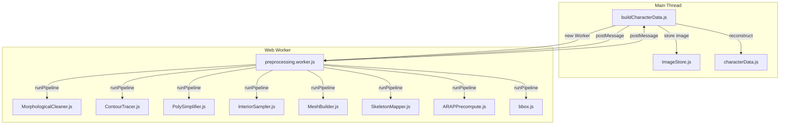
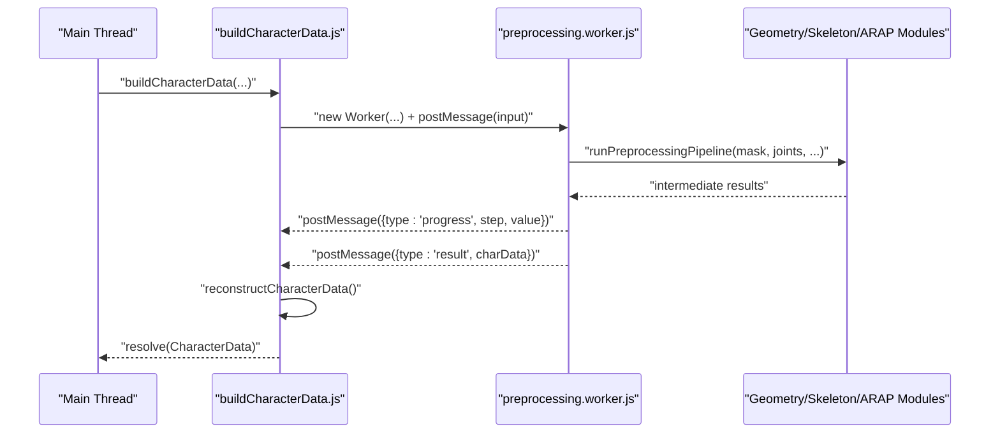
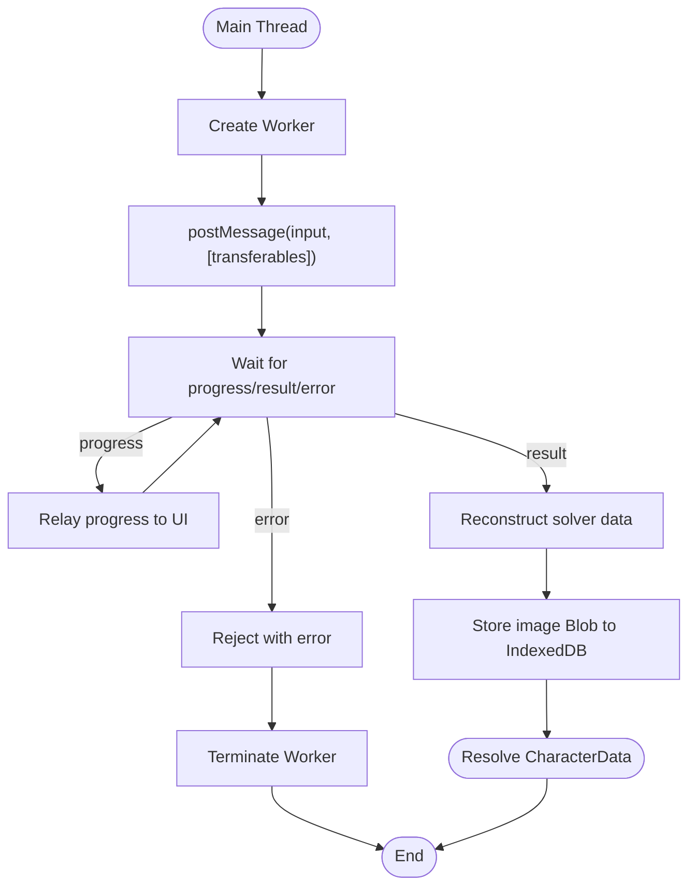
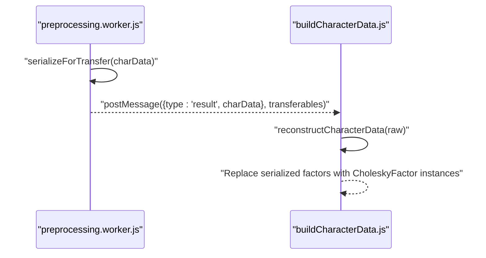
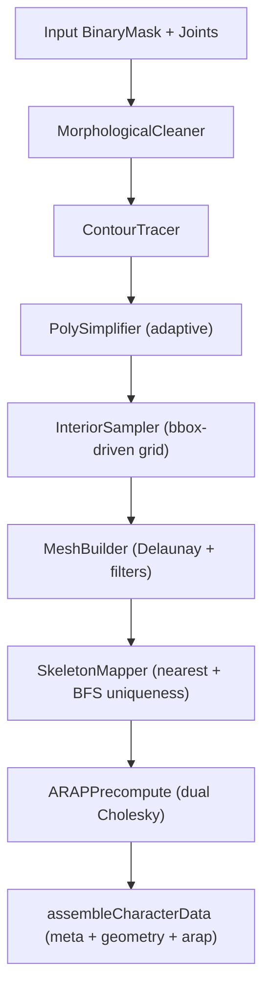
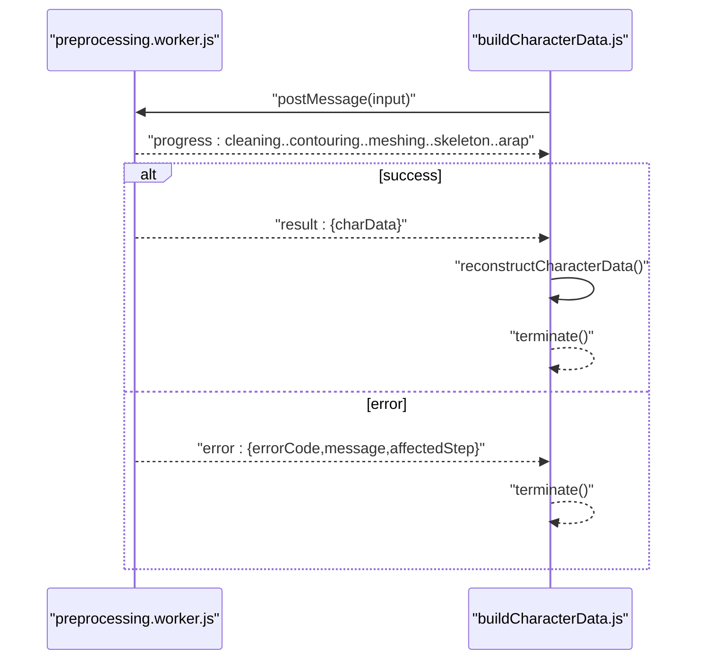
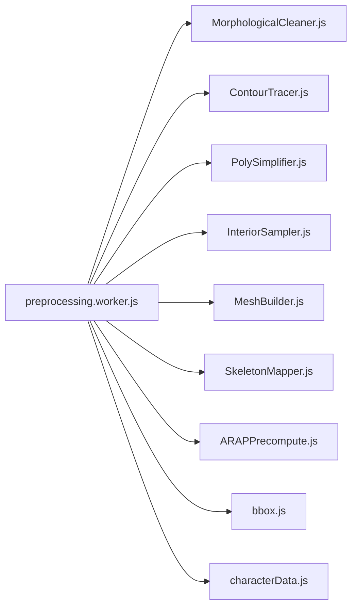

# Worker-Based Preprocessing

<cite>
**Referenced Files in This Document**
- [preprocessing.worker.js](file://src/character/workers/preprocessing.worker.js)
- [buildCharacterData.js](file://src/character/buildCharacterData.js)
- [buildCharacterData.test.js](file://src/character/buildCharacterData.test.js)
- [integration.test.js](file://src/character/integration.test.js)
- [characterData.js](file://src/types/characterData.js)
- [MorphologicalCleaner.js](file://src/geometry/MorphologicalCleaner.js)
- [ContourTracer.js](file://src/geometry/ContourTracer.js)
- [PolySimplifier.js](file://src/geometry/PolySimplifier.js)
- [InteriorSampler.js](file://src/geometry/InteriorSampler.js)
- [MeshBuilder.js](file://src/geometry/MeshBuilder.js)
- [SkeletonMapper.js](file://src/skeleton/SkeletonMapper.js)
- [ARAPPrecompute.js](file://src/arap/ARAPPrecompute.js)
- [bbox.js](file://src/utils/bbox.js)
- [pipeline.md](file://architecture/pipeline.md)
- [module_design.md](file://architecture/module_design.md)
</cite>

## Table of Contents
1. [Introduction](#introduction)
2. [Project Structure](#project-structure)
3. [Core Components](#core-components)
4. [Architecture Overview](#architecture-overview)
5. [Detailed Component Analysis](#detailed-component-analysis)
6. [Dependency Analysis](#dependency-analysis)
7. [Performance Considerations](#performance-considerations)
8. [Troubleshooting Guide](#troubleshooting-guide)
9. [Conclusion](#conclusion)
10. [Appendices](#appendices)

## Introduction
This document explains PaperAlive’s Worker-Based Preprocessing system, focusing on the off-main-thread geometry processing pipeline. It covers orchestration, data transfer mechanisms, worker lifecycle management, character data assembly, message passing protocols, error handling, and performance benefits. Practical examples and debugging techniques are included to help developers integrate and troubleshoot the preprocessing workflow.

## Project Structure
The preprocessing pipeline is executed entirely in a Web Worker to keep the main thread responsive. The main thread initializes the Worker, transfers the binary mask as a Transferable, relays progress updates, reconstructs the result, and stores assets.

**Diagram sources**
- [buildCharacterData.js:71-152](file://src/character/buildCharacterData.js#L71-L152)
- [preprocessing.worker.js:34-71](file://src/character/workers/preprocessing.worker.js#L34-L71)
- [MorphologicalCleaner.js:26-54](file://src/geometry/MorphologicalCleaner.js#L26-L54)
- [ContourTracer.js:31-54](file://src/geometry/ContourTracer.js#L31-L54)
- [PolySimplifier.js:21-48](file://src/geometry/PolySimplifier.js#L21-L48)
- [InteriorSampler.js:25-49](file://src/geometry/InteriorSampler.js#L25-L49)
- [MeshBuilder.js:35-136](file://src/geometry/MeshBuilder.js#L35-L136)
- [SkeletonMapper.js:27-82](file://src/skeleton/SkeletonMapper.js#L27-L82)
- [ARAPPrecompute.js:206-295](file://src/arap/ARAPPrecompute.js#L206-L295)
- [bbox.js:17-47](file://src/utils/bbox.js#L17-L47)

**Section sources**
- [module_design.md:579-631](file://architecture/module_design.md#L579-L631)
- [pipeline.md:322-396](file://architecture/pipeline.md#L322-L396)

## Core Components
- Worker entry point: orchestrates the full preprocessing pipeline and posts progress/results.
- Main thread wrapper: manages Worker lifecycle, transfers data, relays progress, reconstructs results, and stores images.
- Geometry processing modules: morphological cleaning, contour tracing, simplification, interior sampling, mesh building.
- Skeleton mapping and ARAP precomputation: map joints to vertices and compute solver data.
- Data types: define CharacterData and related structures.

**Section sources**
- [preprocessing.worker.js:86-191](file://src/character/workers/preprocessing.worker.js#L86-L191)
- [buildCharacterData.js:71-152](file://src/character/buildCharacterData.js#L71-L152)
- [characterData.js:134-188](file://src/types/characterData.js#L134-L188)

## Architecture Overview
The preprocessing pipeline runs in a Web Worker to avoid blocking the main thread. The main thread sends a Transferable binary mask and receives progress updates and a final result with Transferable TypedArrays. The Worker serializes solver data for efficient transfer.

**Diagram sources**
- [buildCharacterData.js:71-152](file://src/character/buildCharacterData.js#L71-L152)
- [preprocessing.worker.js:34-71](file://src/character/workers/preprocessing.worker.js#L34-L71)
- [preprocessing.worker.js:86-191](file://src/character/workers/preprocessing.worker.js#L86-L191)

**Section sources**
- [module_design.md:579-631](file://architecture/module_design.md#L579-L631)
- [pipeline.md:377-395](file://architecture/pipeline.md#L377-L395)

## Detailed Component Analysis

### Worker Lifecycle and Orchestration
- Initialization: the main thread creates a Worker pointing to the preprocessing script.
- Input transfer: the binary mask is sent as a Transferable ArrayBuffer to avoid copying.
- Progress reporting: the Worker posts periodic progress events with step names and normalized values.
- Result handling: the Worker serializes TypedArrays and sends them as Transferables; the main thread reconstructs solver-specific objects.
- Termination: the Worker is terminated after success or error.

**Diagram sources**
- [buildCharacterData.js:71-152](file://src/character/buildCharacterData.js#L71-L152)
- [preprocessing.worker.js:34-71](file://src/character/workers/preprocessing.worker.js#L34-L71)

**Section sources**
- [buildCharacterData.js:71-152](file://src/character/buildCharacterData.js#L71-L152)
- [buildCharacterData.test.js:149-324](file://src/character/buildCharacterData.test.js#L149-L324)

### Data Transfer Mechanisms and Serialization
- Transferable objects: the binary mask and all TypedArrays in CharacterData are transferred zero-copy.
- Serialization for solver data: CholeskyFactor instances are serialized to plain objects and reconstructed on the main thread.
- Transferable collection: the Worker enumerates all TypedArray buffers for postMessage.

**Diagram sources**
- [preprocessing.worker.js:318-356](file://src/character/workers/preprocessing.worker.js#L318-L356)
- [buildCharacterData.js:48-51](file://src/character/buildCharacterData.js#L48-L51)

**Section sources**
- [preprocessing.worker.js:292-356](file://src/character/workers/preprocessing.worker.js#L292-L356)
- [buildCharacterData.js:24-51](file://src/character/buildCharacterData.js#L24-L51)

### Geometry Processing Coordination and Result Aggregation
- Pipeline stages: cleaning → contouring → simplification → interior sampling → mesh building → skeleton mapping → ARAP precomputation.
- Vertex budget enforcement: iteratively increases Douglas–Peucker epsilon until total vertex count meets the budget.
- Bounding box usage: drives interior sampling density and mesh validation.

**Diagram sources**
- [preprocessing.worker.js:86-191](file://src/character/workers/preprocessing.worker.js#L86-L191)
- [MorphologicalCleaner.js:26-54](file://src/geometry/MorphologicalCleaner.js#L26-L54)
- [ContourTracer.js:31-54](file://src/geometry/ContourTracer.js#L31-L54)
- [PolySimplifier.js:37-48](file://src/geometry/PolySimplifier.js#L37-L48)
- [InteriorSampler.js:25-49](file://src/geometry/InteriorSampler.js#L25-L49)
- [MeshBuilder.js:35-136](file://src/geometry/MeshBuilder.js#L35-L136)
- [SkeletonMapper.js:27-82](file://src/skeleton/SkeletonMapper.js#L27-L82)
- [ARAPPrecompute.js:206-295](file://src/arap/ARAPPrecompute.js#L206-L295)
- [bbox.js:17-47](file://src/utils/bbox.js#L17-L47)

**Section sources**
- [preprocessing.worker.js:194-224](file://src/character/workers/preprocessing.worker.js#L194-L224)
- [bbox.js:17-47](file://src/utils/bbox.js#L17-L47)

### Message Passing Protocols and Error Handling
- Input: alphaMask (Transferable), jointPositions, image dimensions, character type, options.
- Progress: type “progress” with step and value.
- Result: type “result” with charData (Transferable TypedArrays).
- Error: type “error” with errorCode, message, affectedStep.
- Worker crashes: caught and reported with a generic error code.

**Diagram sources**
- [preprocessing.worker.js:34-71](file://src/character/workers/preprocessing.worker.js#L34-L71)
- [buildCharacterData.js:91-136](file://src/character/buildCharacterData.js#L91-L136)

**Section sources**
- [preprocessing.worker.js:10-13](file://src/character/workers/preprocessing.worker.js#L10-L13)
- [buildCharacterData.js:94-136](file://src/character/buildCharacterData.js#L94-L136)
- [characterData.js:190-219](file://src/types/characterData.js#L190-L219)

### Memory Management and Data Serialization
- Zero-copy transfer: binary mask and all geometry/solver TypedArrays are transferred via postMessage with transferable list.
- Solver reconstruction: CholeskyFactor instances are serialized to plain objects and rebuilt on the main thread.
- Workspace pre-allocation: solver workspaces are allocated during preprocessing to support zero-allocation runtime.

**Section sources**
- [preprocessing.worker.js:318-356](file://src/character/workers/preprocessing.worker.js#L318-L356)
- [buildCharacterData.js:24-51](file://src/character/buildCharacterData.js#L24-L51)
- [ARAPPrecompute.js:269-293](file://src/arap/ARAPPrecompute.js#L269-L293)

### Integration with the Main Application Thread
- The main thread stores the image Blob to IndexedDB and attaches the key to CharacterData.
- Progress callbacks update UI without blocking the event loop.
- The Worker is terminated after result or error to release resources.

**Section sources**
- [buildCharacterData.js:78-84](file://src/character/buildCharacterData.js#L78-L84)
- [buildCharacterData.js:102-118](file://src/character/buildCharacterData.js#L102-L118)
- [buildCharacterData.js:130-136](file://src/character/buildCharacterData.js#L130-L136)

## Dependency Analysis
The preprocessing pipeline composes several worker-safe modules. Dependencies are acyclic and designed for off-main-thread execution.

**Diagram sources**
- [preprocessing.worker.js:18-26](file://src/character/workers/preprocessing.worker.js#L18-L26)
- [characterData.js:1-254](file://src/types/characterData.js#L1-L254)

**Section sources**
- [preprocessing.worker.js:86-191](file://src/character/workers/preprocessing.worker.js#L86-L191)
- [characterData.js:134-188](file://src/types/characterData.js#L134-L188)

## Performance Considerations
- Off-main-thread execution: prevents UI stalls during heavy geometry processing.
- Vertex budget enforcement: iterative simplification ensures mesh size remains within limits.
- Normalized grid sampling: grid spacing scales with bounding box size for consistent density.
- Zero-allocation runtime: pre-allocated workspaces and Transferable data minimize GC pressure.
- Dual Cholesky: separate factorizations enable efficient mode switching without recomputation.

[No sources needed since this section provides general guidance]

## Troubleshooting Guide
Common issues and debugging techniques:
- Worker crashes: caught and reported with a generic error code; inspect affectedStep and logs.
- Mask quality: small foreground fractions cause early termination; improve thresholding or editing.
- Degenerate meshes: insufficient points or invalid triangles trigger guard checks; verify contour and sampling.
- Solver failures: Cholesky factorization fallbacks; NaN sentinel indicates numerical instability.
- Progress stalls: confirm progress events are being posted and relayed; check Worker initialization.

Practical tests demonstrate:
- Reconstruction correctness for solver data.
- Protocol compliance for progress and error handling.
- Responsiveness of the main thread during asynchronous processing.

**Section sources**
- [buildCharacterData.test.js:149-324](file://src/character/buildCharacterData.test.js#L149-L324)
- [buildCharacterData.test.js:363-413](file://src/character/buildCharacterData.test.js#L363-L413)
- [integration.test.js:182-192](file://src/character/integration.test.js#L182-L192)
- [integration.test.js:194-205](file://src/character/integration.test.js#L194-L205)

## Conclusion
PaperAlive’s Worker-Based Preprocessing system achieves responsive UI and robust geometry processing by delegating the entire pipeline to a Web Worker. Through Transferable data, structured progress/error messaging, and careful serialization/reconstruction, it delivers a scalable and maintainable architecture. The vertex budget enforcement, normalized sampling, and dual Cholesky precomputation ensure reliable runtime performance and predictable resource usage.

[No sources needed since this section summarizes without analyzing specific files]

## Appendices

### Practical Example: Running the Preprocessing Workflow
- Prepare image and binary mask, collect joint positions, choose character type, and optionally set vertex budget and epsilon.
- Call the main-thread builder; it spawns a Worker, transfers the mask, and waits for progress/results.
- On result, attach the image key and use the assembled CharacterData for rendering and motion.

**Section sources**
- [buildCharacterData.js:71-152](file://src/character/buildCharacterData.js#L71-L152)
- [integration.test.js:96-164](file://src/character/integration.test.js#L96-L164)

### Debugging Techniques
- Verify Worker initialization and message handling via unit tests.
- Monitor progress events to localize slow stages.
- Inspect error codes to identify failing modules.
- Validate mesh statistics and solver integrity in integration tests.

**Section sources**
- [buildCharacterData.test.js:149-324](file://src/character/buildCharacterData.test.js#L149-L324)
- [integration.test.js:96-164](file://src/character/integration.test.js#L96-L164)