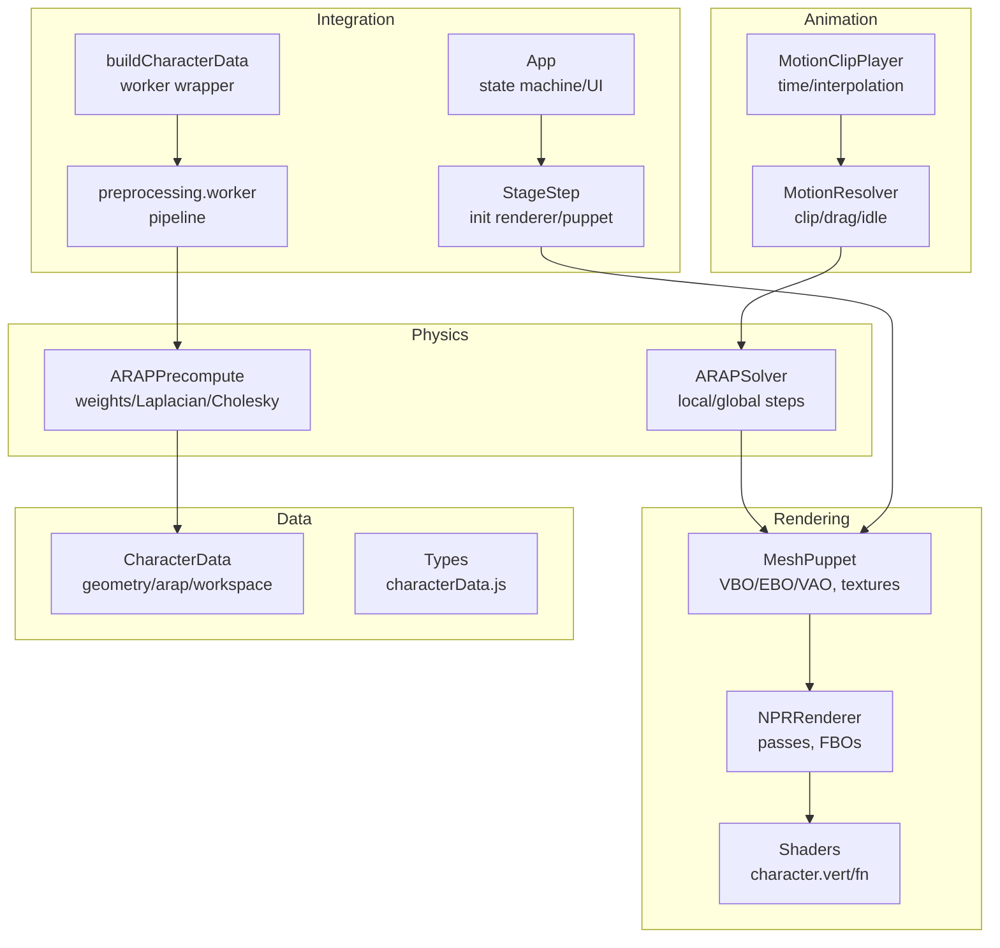
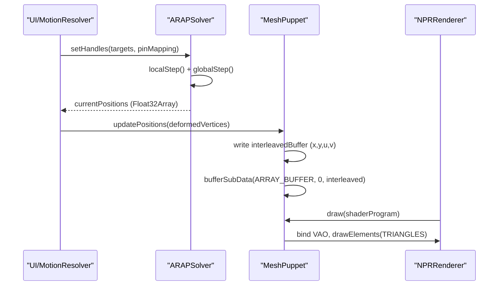
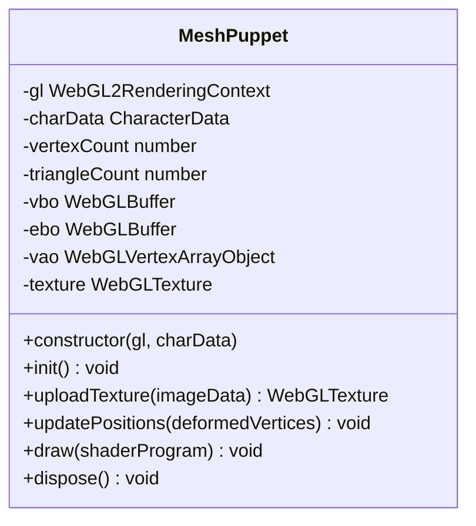
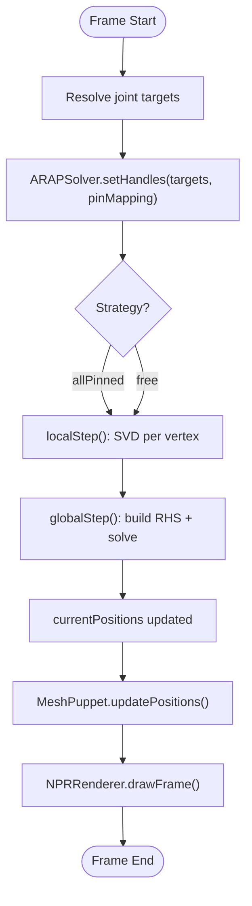
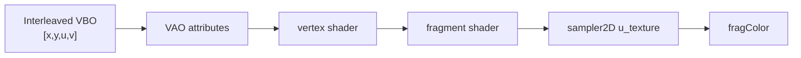
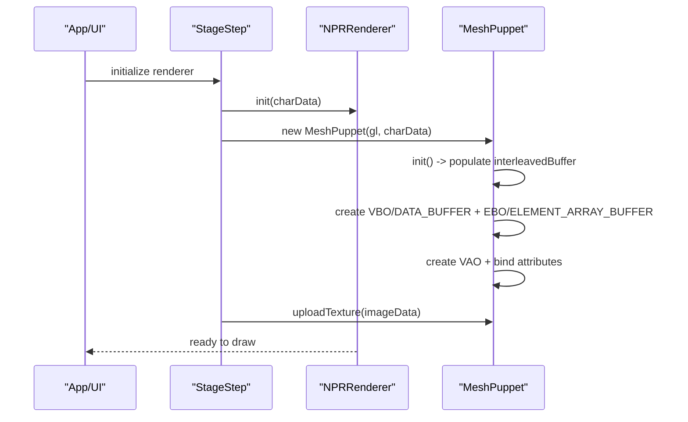
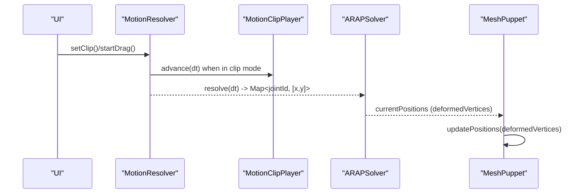
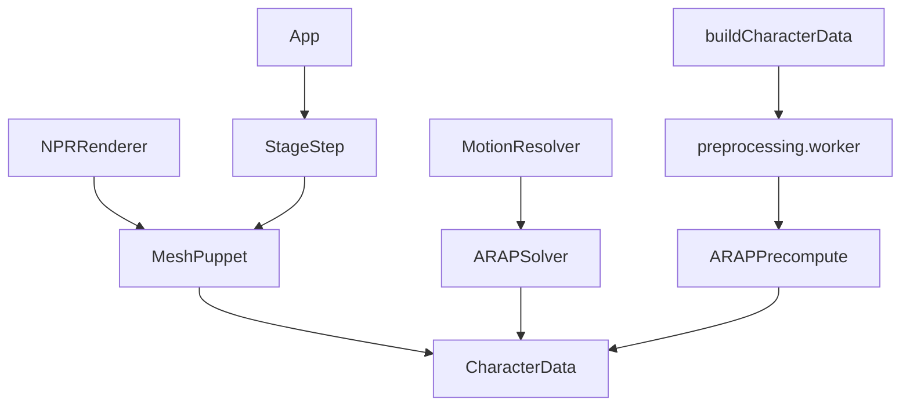

# Mesh Puppet System

<cite>
**Referenced Files in This Document**
- [MeshPuppet.js](file://src/rendering/MeshPuppet.js)
- [MeshPuppet.test.js](file://src/rendering/MeshPuppet.test.js)
- [ARAPSolver.js](file://src/arap/ARAPSolver.js)
- [ARAPPrecompute.js](file://src/arap/ARAPPrecompute.js)
- [character.vert.glsl](file://src/rendering/shaders/character.vert.glsl)
- [character.frag.glsl](file://src/rendering/shaders/character.frag.glsl)
- [characterData.js](file://src/types/characterData.js)
- [NPRRenderer.js](file://src/rendering/NPRRenderer.js)
- [MotionResolver.js](file://src/motion/MotionResolver.js)
- [MotionClipPlayer.js](file://src/motion/MotionClipPlayer.js)
- [preprocessing.worker.js](file://src/character/workers/preprocessing.worker.js)
- [buildCharacterData.js](file://src/character/buildCharacterData.js)
- [StageStep.js](file://src/ui/StageStep.js)
- [App.js](file://src/App.js)
- [rendering_pipeline.md](file://architecture/rendering_pipeline.md)
</cite>

## Table of Contents
1. [Introduction](#introduction)
2. [Project Structure](#project-structure)
3. [Core Components](#core-components)
4. [Architecture Overview](#architecture-overview)
5. [Detailed Component Analysis](#detailed-component-analysis)
6. [Dependency Analysis](#dependency-analysis)
7. [Performance Considerations](#performance-considerations)
8. [Troubleshooting Guide](#troubleshooting-guide)
9. [Conclusion](#conclusion)
10. [Appendices](#appendices)

## Introduction
This document explains the Mesh Puppet System responsible for vertex animation and deformation rendering in the PaperAlive application. It covers the MeshPuppet class architecture, VAO/VBO management, texture coordinate handling, integration with ARAP physics simulation data, real-time deformation updates, and the end-to-end rendering pipeline. Practical examples demonstrate puppet initialization, animation playback, and performance considerations for large meshes.

## Project Structure
The Mesh Puppet System spans several modules:
- Rendering: MeshPuppet (GPU buffers and drawing), NPRRenderer (full pass pipeline), shaders (character vertex/fragment).
- Physics: ARAPSolver (per-frame deformation), ARAPPrecompute (precomputation).
- Data: CharacterData types and runtime structures.
- UI/Integration: StageStep (initialization), App wiring, MotionResolver/MotionClipPlayer (animation orchestration), preprocessing worker (pipeline).

**Diagram sources**
- [MeshPuppet.js:25-203](file://src/rendering/MeshPuppet.js#L25-L203)
- [NPRRenderer.js:112-200](file://src/rendering/NPRRenderer.js#L112-L200)
- [character.vert.glsl:1-17](file://src/rendering/shaders/character.vert.glsl#L1-L17)
- [character.frag.glsl:1-29](file://src/rendering/shaders/character.frag.glsl#L1-L29)
- [ARAPSolver.js:22-337](file://src/arap/ARAPSolver.js#L22-L337)
- [ARAPPrecompute.js:16-388](file://src/arap/ARAPPrecompute.js#L16-L388)
- [characterData.js:134-188](file://src/types/characterData.js#L134-L188)
- [MotionResolver.js:21-232](file://src/motion/MotionResolver.js#L21-L232)
- [MotionClipPlayer.js:28-168](file://src/motion/MotionClipPlayer.js#L28-L168)
- [preprocessing.worker.js:34-192](file://src/character/workers/preprocessing.worker.js#L34-L192)
- [buildCharacterData.js:71-153](file://src/character/buildCharacterData.js#L71-L153)
- [StageStep.js:154-189](file://src/ui/StageStep.js#L154-L189)
- [App.js:35-505](file://src/App.js#L35-L505)

**Section sources**
- [MeshPuppet.js:1-206](file://src/rendering/MeshPuppet.js#L1-L206)
- [NPRRenderer.js:1-200](file://src/rendering/NPRRenderer.js#L1-L200)
- [character.vert.glsl:1-17](file://src/rendering/shaders/character.vert.glsl#L1-L17)
- [character.frag.glsl:1-29](file://src/rendering/shaders/character.frag.glsl#L1-L29)
- [ARAPSolver.js:1-337](file://src/arap/ARAPSolver.js#L1-L337)
- [ARAPPrecompute.js:1-388](file://src/arap/ARAPPrecompute.js#L1-L388)
- [characterData.js:1-254](file://src/types/characterData.js#L1-L254)
- [MotionResolver.js:1-232](file://src/motion/MotionResolver.js#L1-L232)
- [MotionClipPlayer.js:1-168](file://src/motion/MotionClipPlayer.js#L1-L168)
- [preprocessing.worker.js:1-200](file://src/character/workers/preprocessing.worker.js#L1-L200)
- [buildCharacterData.js:1-175](file://src/character/buildCharacterData.js#L1-L175)
- [StageStep.js:145-189](file://src/ui/StageStep.js#L145-L189)
- [App.js:1-505](file://src/App.js#L1-L505)

## Core Components
- MeshPuppet: Manages VBO (DYNAMIC_DRAW), EBO (STATIC_DRAW), VAO, and textures. Provides zero-allocation position updates by writing into a pre-allocated interleaved buffer and uploading via bufferSubData.
- ARAPSolver: Performs per-frame ARAP deformation using local SVD and global Cholesky back-substitution, selecting strategies based on motion clip or IK drag.
- ARAPPrecompute: Precomputes cotangent weights, builds Laplacians, and computes dual Cholesky factors with fallback strategies.
- NPRRenderer: Orchestrates five rendering passes (paper, shadow, character + outline, wiggle) using the puppet’s VAO and texture.
- MotionResolver/MotionClipPlayer: Produces per-frame joint targets from motion clips, drag interactions, or idle rest pose.
- CharacterData: Central runtime data structure containing geometry, skeleton, pin mapping, and ARAP workspace.

**Section sources**
- [MeshPuppet.js:25-203](file://src/rendering/MeshPuppet.js#L25-L203)
- [ARAPSolver.js:22-337](file://src/arap/ARAPSolver.js#L22-L337)
- [ARAPPrecompute.js:16-388](file://src/arap/ARAPPrecompute.js#L16-L388)
- [NPRRenderer.js:112-200](file://src/rendering/NPRRenderer.js#L112-L200)
- [MotionResolver.js:21-232](file://src/motion/MotionResolver.js#L21-L232)
- [MotionClipPlayer.js:28-168](file://src/motion/MotionClipPlayer.js#L28-L168)
- [characterData.js:134-188](file://src/types/characterData.js#L134-L188)

## Architecture Overview
The deformation-to-visual pipeline connects physics simulation to rendering:
- MotionResolver resolves joint targets each frame.
- ARAPSolver runs local/global steps to produce deformed vertex positions.
- MeshPuppet updates its interleaved VBO with zero-allocation bufferSubData.
- NPRRenderer draws the character using the puppet’s VAO and texture across multiple passes.

**Diagram sources**
- [rendering_pipeline.md:17-58](file://architecture/rendering_pipeline.md#L17-L58)
- [MotionResolver.js:194-230](file://src/motion/MotionResolver.js#L194-L230)
- [ARAPSolver.js:319-325](file://src/arap/ARAPSolver.js#L319-L325)
- [MeshPuppet.js:149-162](file://src/rendering/MeshPuppet.js#L149-L162)
- [NPRRenderer.js:550-616](file://src/rendering/NPRRenderer.js#L550-L616)

## Detailed Component Analysis

### MeshPuppet Class
Responsibilities:
- Create and manage VBO (DYNAMIC_DRAW), EBO (STATIC_DRAW), VAO.
- Upload character texture to GPU.
- Zero-allocation position updates via pre-allocated workspace.interleavedBuffer.
- Draw the mesh with any compatible shader program.

VBO layout (V2): [x, y, u, v] per vertex = 4 floats = 16 bytes/vertex.

Initialization flow:
- Populate interleavedBuffer with rest-pose positions and UV coordinates from CharacterData.
- Create and configure VBO with DYNAMIC_DRAW, EBO with STATIC_DRAW.
- Configure VAO with attribute bindings for a_position (vec2 at offset 0) and a_uv (vec2 at offset 8 bytes).

Texture upload:
- Create 2D texture, upload RGBA data, set linear filtering and clamp-to-edge wrapping.

Position updates:
- Write deformed positions into interleavedBuffer (UVs preserved).
- Upload partial buffer via bufferSubData without reallocating.

Draw and disposal:
- Bind VAO and drawElements with TRIANGLES and UNSIGNED_SHORT indices.
- Delete buffers, VAO, and texture on dispose.

**Diagram sources**
- [MeshPuppet.js:25-203](file://src/rendering/MeshPuppet.js#L25-L203)

**Section sources**
- [MeshPuppet.js:25-203](file://src/rendering/MeshPuppet.js#L25-L203)
- [MeshPuppet.test.js:118-204](file://src/rendering/MeshPuppet.test.js#L118-L204)
- [MeshPuppet.test.js:206-276](file://src/rendering/MeshPuppet.test.js#L206-L276)
- [MeshPuppet.test.js:278-313](file://src/rendering/MeshPuppet.test.js#L278-L313)

### ARAP Physics Simulation
Local step:
- Computes optimal rotation per vertex via weighted SVD on neighborhood edges.
- Stores rotations in pre-allocated workspace.rotations.

Global step:
- Builds right-hand side from rotations, injects pin constraints (allPinned) or penalty (free).
- Solves via Cholesky back-substitution and updates currentPositions.

Strategy selection:
- allPinned: use choleskyAllPinned with pinned vertices.
- free: use choleskyFree with penalty constraints.

**Diagram sources**
- [rendering_pipeline.md:17-58](file://architecture/rendering_pipeline.md#L17-L58)
- [ARAPSolver.js:82-122](file://src/arap/ARAPSolver.js#L82-L122)
- [ARAPSolver.js:136-200](file://src/arap/ARAPSolver.js#L136-L200)
- [ARAPSolver.js:212-309](file://src/arap/ARAPSolver.js#L212-L309)
- [MeshPuppet.js:149-162](file://src/rendering/MeshPuppet.js#L149-L162)
- [NPRRenderer.js:550-616](file://src/rendering/NPRRenderer.js#L550-L616)

**Section sources**
- [ARAPSolver.js:22-337](file://src/arap/ARAPSolver.js#L22-L337)
- [ARAPPrecompute.js:16-388](file://src/arap/ARAPPrecompute.js#L16-L388)

### Texture Coordinates and Shaders
- VBO stores interleaved [x, y, u, v]; a_position reads vec2 from offset 0; a_uv reads vec2 from offset 8 bytes.
- Shaders forward UVs to fragment stage; fragment shader samples texture and applies brightness/saturation adjustments.

**Diagram sources**
- [MeshPuppet.js:99-106](file://src/rendering/MeshPuppet.js#L99-L106)
- [character.vert.glsl:4-16](file://src/rendering/shaders/character.vert.glsl#L4-L16)
- [character.frag.glsl:4-28](file://src/rendering/shaders/character.frag.glsl#L4-L28)

**Section sources**
- [MeshPuppet.js:99-106](file://src/rendering/MeshPuppet.js#L99-L106)
- [character.vert.glsl:1-17](file://src/rendering/shaders/character.vert.glsl#L1-L17)
- [character.frag.glsl:1-29](file://src/rendering/shaders/character.frag.glsl#L1-L29)

### Puppet Initialization and Buffer Management
- Initialization populates the interleavedBuffer with geometry.vertices0 and geometry.uvCoords, then uploads to VBO (DYNAMIC_DRAW) and EBO (STATIC_DRAW).
- VAO is configured with vertex attribute pointers for positions and UVs.
- Texture upload uses RGBA data with linear filtering and clamp-to-edge wrapping.

**Diagram sources**
- [StageStep.js:154-189](file://src/ui/StageStep.js#L154-L189)
- [NPRRenderer.js:195-263](file://src/rendering/NPRRenderer.js#L195-L263)
- [MeshPuppet.js:68-108](file://src/rendering/MeshPuppet.js#L68-L108)
- [MeshPuppet.js:116-137](file://src/rendering/MeshPuppet.js#L116-L137)

**Section sources**
- [MeshPuppet.js:68-108](file://src/rendering/MeshPuppet.js#L68-L108)
- [MeshPuppet.js:116-137](file://src/rendering/MeshPuppet.js#L116-L137)
- [StageStep.js:154-189](file://src/ui/StageStep.js#L154-L189)

### Animation Playback and Integration
- MotionResolver selects mode (idle/clip) and produces joint targets each frame.
- MotionClipPlayer interpolates motion clip frames based on fps and dt.
- ARAPSolver consumes targets and computes deformed positions.
- MeshPuppet receives deformedVertices and updates VBO via bufferSubData.

**Diagram sources**
- [MotionResolver.js:194-230](file://src/motion/MotionResolver.js#L194-L230)
- [MotionClipPlayer.js:78-104](file://src/motion/MotionClipPlayer.js#L78-L104)
- [ARAPSolver.js:319-325](file://src/arap/ARAPSolver.js#L319-L325)
- [MeshPuppet.js:149-162](file://src/rendering/MeshPuppet.js#L149-L162)

**Section sources**
- [MotionResolver.js:21-232](file://src/motion/MotionResolver.js#L21-L232)
- [MotionClipPlayer.js:28-168](file://src/motion/MotionClipPlayer.js#L28-L168)
- [ARAPSolver.js:22-337](file://src/arap/ARAPSolver.js#L22-L337)
- [MeshPuppet.js:149-162](file://src/rendering/MeshPuppet.js#L149-L162)

## Dependency Analysis
- MeshPuppet depends on CharacterData for geometry and ARAP workspace.
- ARAPSolver depends on CharacterData.arap (weights, neighbor lists, workspace) and uses ARAPPrecompute outputs.
- NPRRenderer depends on MeshPuppet for VAO/texture and on CharacterData for mesh statistics.
- MotionResolver depends on MotionClipPlayer and IK drag handler to produce joint targets.
- buildCharacterData orchestrates preprocessing worker and reconstructs CholeskyFactor instances for runtime.

**Diagram sources**
- [MeshPuppet.js:30-54](file://src/rendering/MeshPuppet.js#L30-L54)
- [ARAPSolver.js:26-59](file://src/arap/ARAPSolver.js#L26-L59)
- [ARAPPrecompute.js:206-296](file://src/arap/ARAPPrecompute.js#L206-L296)
- [NPRRenderer.js:123-148](file://src/rendering/NPRRenderer.js#L123-L148)
- [MotionResolver.js:25-46](file://src/motion/MotionResolver.js#L25-L46)
- [buildCharacterData.js:71-153](file://src/character/buildCharacterData.js#L71-L153)
- [preprocessing.worker.js:34-192](file://src/character/workers/preprocessing.worker.js#L34-L192)
- [StageStep.js:154-189](file://src/ui/StageStep.js#L154-L189)
- [App.js:308-328](file://src/App.js#L308-L328)

**Section sources**
- [characterData.js:134-188](file://src/types/characterData.js#L134-L188)
- [buildCharacterData.js:48-52](file://src/character/buildCharacterData.js#L48-L52)
- [preprocessing.worker.js:86-192](file://src/character/workers/preprocessing.worker.js#L86-L192)

## Performance Considerations
- Zero-allocation updates: MeshPuppet.write deformed positions into pre-allocated interleavedBuffer and uses bufferSubData to avoid allocations during hot-path updates.
- Buffer sizing: VBO stride is 16 bytes per vertex; ensure vertexCount remains within expected bounds to keep memory footprint predictable.
- Strategy selection: ARAPSolver chooses allPinned vs free modes to balance stability and responsiveness; free mode adds penalty constraints to maintain stability.
- Precomputation: ARAPPrecompute computes cotangent weights and dual Cholesky once, with fallback to uniform weights if factorization fails.
- Rendering: NPRRenderer uses stencil-based outline and blending; minimize redundant state changes and leverage instancing-friendly patterns where possible.

[No sources needed since this section provides general guidance]

## Troubleshooting Guide
Common issues and checks:
- WebGL errors: MeshPuppet.init() tests assert no GL errors after initialization; verify similar assertions in your environment.
- Attribute bindings: Ensure a_position and a_uv offsets match VBO layout; mismatches cause garbled rendering.
- Texture upload: Confirm RGBA format and clamp-to-edge parameters; verify texture binding before drawing.
- Buffer updates: updatePositions must preserve UVs while updating positions; confirm interleavedBuffer writes and bufferSubData calls.
- Context loss: NPRRenderer handles WebGL context loss and restore; ensure proper re-initialization of programs, FBOs, and puppet resources.

**Section sources**
- [MeshPuppet.test.js:198-203](file://src/rendering/MeshPuppet.test.js#L198-L203)
- [MeshPuppet.js:99-106](file://src/rendering/MeshPuppet.js#L99-L106)
- [MeshPuppet.js:116-137](file://src/rendering/MeshPuppet.js#L116-L137)
- [MeshPuppet.js:149-162](file://src/rendering/MeshPuppet.js#L149-L162)
- [NPRRenderer.js:215-263](file://src/rendering/NPRRenderer.js#L215-L263)

## Conclusion
The Mesh Puppet System integrates tightly with ARAP physics and the NPR rendering pipeline. Its zero-allocation update model, efficient VBO/EBO/VAO management, and robust texture handling enable smooth real-time deformation rendering. Proper initialization, buffer management, and shader attribute bindings are essential for reliable operation. MotionResolver and MotionClipPlayer provide flexible animation orchestration, while preprocessing and worker-based pipeline ensure scalable character creation.

[No sources needed since this section summarizes without analyzing specific files]

## Appendices

### Practical Examples

- Puppet configuration and initialization:
  - Create MeshPuppet with WebGL2 context and CharacterData.
  - Call init() to allocate and populate VBO/EBO/VAO.
  - Upload texture using uploadTexture().
  - Attach puppet to NPRRenderer and call drawFrame() each frame.

- Animation playback:
  - Use MotionResolver to set active clip or drag targets.
  - In the game loop, call MotionResolver.resolve(dt) to obtain joint targets.
  - Pass targets to ARAPSolver.setHandles() and run step(iterations).
  - Update puppet with deformed positions and redraw.

- Large mesh considerations:
  - Monitor vertexCount and VBO size (16 bytes/vertex).
  - Prefer allPinned strategy for stability with large meshes.
  - Keep ARAP workspace arrays pre-allocated to avoid per-frame allocations.

**Section sources**
- [StageStep.js:154-189](file://src/ui/StageStep.js#L154-L189)
- [MotionResolver.js:194-230](file://src/motion/MotionResolver.js#L194-L230)
- [ARAPSolver.js:319-325](file://src/arap/ARAPSolver.js#L319-L325)
- [MeshPuppet.js:68-108](file://src/rendering/MeshPuppet.js#L68-L108)
- [MeshPuppet.js:116-137](file://src/rendering/MeshPuppet.js#L116-L137)
- [MeshPuppet.js:149-162](file://src/rendering/MeshPuppet.js#L149-L162)
- [NPRRenderer.js:550-616](file://src/rendering/NPRRenderer.js#L550-L616)