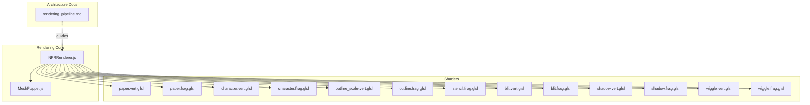
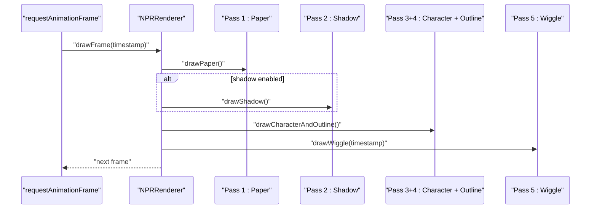
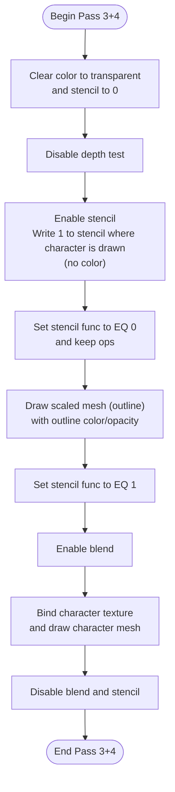
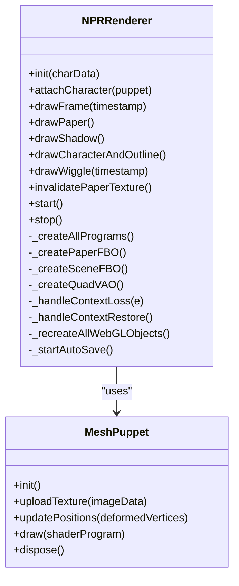

# Non-Photorealistic Rendering Pipeline

<cite>
**Referenced Files in This Document**
- [NPRRenderer.js](file://src/rendering/NPRRenderer.js)
- [MeshPuppet.js](file://src/rendering/MeshPuppet.js)
- [paper.vert.glsl](file://src/rendering/shaders/paper.vert.glsl)
- [paper.frag.glsl](file://src/rendering/shaders/paper.frag.glsl)
- [character.vert.glsl](file://src/rendering/shaders/character.vert.glsl)
- [character.frag.glsl](file://src/rendering/shaders/character.frag.glsl)
- [shadow.vert.glsl](file://src/rendering/shaders/shadow.vert.glsl)
- [shadow.frag.glsl](file://src/rendering/shaders/shadow.frag.glsl)
- [outline_scale.vert.glsl](file://src/rendering/shaders/outline_scale.vert.glsl)
- [outline.frag.glsl](file://src/rendering/shaders/outline.frag.glsl)
- [stencil.frag.glsl](file://src/rendering/shaders/stencil.frag.glsl)
- [blit.vert.glsl](file://src/rendering/shaders/blit.vert.glsl)
- [blit.frag.glsl](file://src/rendering/shaders/blit.frag.glsl)
- [wiggle.vert.glsl](file://src/rendering/shaders/wiggle.vert.glsl)
- [wiggle.frag.glsl](file://src/rendering/shaders/wiggle.frag.glsl)
- [rendering_pipeline.md](file://architecture/rendering_pipeline.md)
</cite>

## Table of Contents
1. [Introduction](#introduction)
2. [Project Structure](#project-structure)
3. [Core Components](#core-components)
4. [Architecture Overview](#architecture-overview)
5. [Detailed Component Analysis](#detailed-component-analysis)
6. [Dependency Analysis](#dependency-analysis)
7. [Performance Considerations](#performance-considerations)
8. [Troubleshooting Guide](#troubleshooting-guide)
9. [Conclusion](#conclusion)
10. [Appendices](#appendices)

## Introduction
This document explains PaperAlive’s five-pass non-photorealistic rendering pipeline. It covers the complete rendering sequence, WebGL context and framebuffer management, stencil-based outline technique, paper texture baking, drop shadow rendering, and the wiggle post-process. It also provides guidance on parameter tuning, performance optimization, and handling context loss and auto-save.

## Project Structure
The rendering system centers around a dedicated renderer orchestrating passes and a mesh puppet for dynamic geometry. Shaders are modularized per pass and integrated at runtime. The architecture document defines the V2 pipeline, buffer strategy, and performance targets.

**Diagram sources**
- [NPRRenderer.js:195-234](file://src/rendering/NPRRenderer.js#L195-L234)
- [MeshPuppet.js:68-108](file://src/rendering/MeshPuppet.js#L68-L108)
- [paper.vert.glsl:1-12](file://src/rendering/shaders/paper.vert.glsl#L1-L12)
- [paper.frag.glsl:1-55](file://src/rendering/shaders/paper.frag.glsl#L1-L55)
- [character.vert.glsl:1-17](file://src/rendering/shaders/character.vert.glsl#L1-L17)
- [character.frag.glsl:1-29](file://src/rendering/shaders/character.frag.glsl#L1-L29)
- [outline_scale.vert.glsl:1-20](file://src/rendering/shaders/outline_scale.vert.glsl#L1-L20)
- [outline.frag.glsl:1-12](file://src/rendering/shaders/outline.frag.glsl#L1-L12)
- [stencil.frag.glsl:1-11](file://src/rendering/shaders/stencil.frag.glsl#L1-L11)
- [blit.vert.glsl:1-11](file://src/rendering/shaders/blit.vert.glsl#L1-L11)
- [blit.frag.glsl:1-12](file://src/rendering/shaders/blit.frag.glsl#L1-L12)
- [shadow.vert.glsl:1-19](file://src/rendering/shaders/shadow.vert.glsl#L1-L19)
- [shadow.frag.glsl:1-10](file://src/rendering/shaders/shadow.frag.glsl#L1-L10)
- [wiggle.vert.glsl:1-11](file://src/rendering/shaders/wiggle.vert.glsl#L1-L11)
- [wiggle.frag.glsl:1-23](file://src/rendering/shaders/wiggle.frag.glsl#L1-L23)
- [rendering_pipeline.md:1-586](file://architecture/rendering_pipeline.md#L1-L586)

**Section sources**
- [rendering_pipeline.md:1-586](file://architecture/rendering_pipeline.md#L1-L586)

## Core Components
- NPRRenderer: Orchestrates passes, manages WebGL context, creates and recovers FBOs, compiles shaders, and drives the render loop. It supports toggles for features and handles context loss/restore and auto-save.
- MeshPuppet: Owns the character mesh VBO/EBO/VAO, uploads textures, and performs zero-allocation position updates for animated frames.

Key responsibilities:
- Pass orchestration: drawPaper, drawShadow, drawCharacterAndOutline, drawWiggle.
- FBO lifecycle: paperFBO and sceneFBO creation, resizing, and binding.
- Stencil-based outline: writes stencil for character interior, renders outline outside, then renders character texture inside stencil.
- Context loss: event listeners, resource recreation, overlay messaging.
- Auto-save: periodic serialization of geometry and metadata.

**Section sources**
- [NPRRenderer.js:112-185](file://src/rendering/NPRRenderer.js#L112-L185)
- [NPRRenderer.js:195-234](file://src/rendering/NPRRenderer.js#L195-L234)
- [NPRRenderer.js:297-349](file://src/rendering/NPRRenderer.js#L297-L349)
- [NPRRenderer.js:451-486](file://src/rendering/NPRRenderer.js#L451-L486)
- [NPRRenderer.js:550-616](file://src/rendering/NPRRenderer.js#L550-L616)
- [NPRRenderer.js:627-663](file://src/rendering/NPRRenderer.js#L627-L663)
- [NPRRenderer.js:672-729](file://src/rendering/NPRRenderer.js#L672-L729)
- [NPRRenderer.js:768-793](file://src/rendering/NPRRenderer.js#L768-L793)
- [MeshPuppet.js:25-54](file://src/rendering/MeshPuppet.js#L25-L54)
- [MeshPuppet.js:68-108](file://src/rendering/MeshPuppet.js#L68-L108)
- [MeshPuppet.js:116-137](file://src/rendering/MeshPuppet.js#L116-L137)
- [MeshPuppet.js:149-162](file://src/rendering/MeshPuppet.js#L149-L162)

## Architecture Overview
The pipeline runs each frame in five passes:
1) Paper Background: blit pre-baked paper texture.
2) Drop Shadow: flat, offset shadow mesh under the character.
3) Character + Outline (stencil): write stencil for character interior, render outline outside stencil, then render character texture inside stencil.
4) Wiggle: optional UV distortion applied to the scene FBO and blitted to the canvas.

**Diagram sources**
- [NPRRenderer.js:463-486](file://src/rendering/NPRRenderer.js#L463-L486)
- [NPRRenderer.js:496-508](file://src/rendering/NPRRenderer.js#L496-L508)
- [NPRRenderer.js:517-535](file://src/rendering/NPRRenderer.js#L517-L535)
- [NPRRenderer.js:550-616](file://src/rendering/NPRRenderer.js#L550-L616)
- [NPRRenderer.js:627-663](file://src/rendering/NPRRenderer.js#L627-L663)

## Detailed Component Analysis

### Pass 1: Paper Background
- Purpose: Blit the pre-baked paper texture to the canvas each frame.
- Technique: Uses a fullscreen quad and a simple blit shader to sample the paperFBO color texture.
- Performance: Minimal cost (< 1 ms) because procedural noise is baked once.

Implementation highlights:
- Creates and binds paperFBO and paperTexture during initialization.
- Bakes procedural paper once (noise, vignette, fiber) and reuses the texture.
- On resize or settings change, invalidates and rebakes the paper texture.

**Section sources**
- [NPRRenderer.js:297-317](file://src/rendering/NPRRenderer.js#L297-L317)
- [NPRRenderer.js:359-380](file://src/rendering/NPRRenderer.js#L359-L380)
- [NPRRenderer.js:388-391](file://src/rendering/NPRRenderer.js#L388-L391)
- [NPRRenderer.js:496-508](file://src/rendering/NPRRenderer.js#L496-L508)
- [paper.vert.glsl:1-12](file://src/rendering/shaders/paper.vert.glsl#L1-L12)
- [paper.frag.glsl:1-55](file://src/rendering/shaders/paper.frag.glsl#L1-L55)
- [blit.vert.glsl:1-11](file://src/rendering/shaders/blit.vert.glsl#L1-L11)
- [blit.frag.glsl:1-12](file://src/rendering/shaders/blit.frag.glsl#L1-L12)

### Pass 2: Drop Shadow
- Purpose: Render a flattened, offset copy of the character mesh as a shadow beneath the character.
- Technique: Vertex shader offsets positions by a fixed vector and scales Y to flatten; fragment shader writes a solid black with opacity.

Implementation highlights:
- Uses the puppet’s VAO and triangle count.
- Enables blending for alpha composition.
- Shadow parameters include offset X/Y, vertical scale, and opacity.

**Section sources**
- [NPRRenderer.js:517-535](file://src/rendering/NPRRenderer.js#L517-L535)
- [shadow.vert.glsl:1-19](file://src/rendering/shaders/shadow.vert.glsl#L1-L19)
- [shadow.frag.glsl:1-10](file://src/rendering/shaders/shadow.frag.glsl#L1-L10)

### Pass 3+4: Character + Outline via Stencil Buffer
- Purpose: Render the character texture with a crisp, geometric outline using the stencil buffer.
- Technique:
  - Step B: Render the character mesh with a no-op fragment shader to write stencil = 1 everywhere the character is drawn (no color output).
  - Step C: Render a uniformly scaled version of the mesh (outline) where stencil == 0, using outline color and opacity.
  - Step D: Render the character texture where stencil == 1, enabling blending for transparency.

Implementation highlights:
- Binds sceneFBO with a stencil renderbuffer.
- Disables depth testing; stencil controls ordering.
- Uses a fullscreen quad VAO for blitting; draws character triangles via the puppet’s VAO.
- Computes mesh centroid from rest pose for scaling.

**Diagram sources**
- [NPRRenderer.js:550-616](file://src/rendering/NPRRenderer.js#L550-L616)
- [outline_scale.vert.glsl:1-20](file://src/rendering/shaders/outline_scale.vert.glsl#L1-L20)
- [outline.frag.glsl:1-12](file://src/rendering/shaders/outline.frag.glsl#L1-L12)
- [stencil.frag.glsl:1-11](file://src/rendering/shaders/stencil.frag.glsl#L1-L11)
- [character.vert.glsl:1-17](file://src/rendering/shaders/character.vert.glsl#L1-L17)
- [character.frag.glsl:1-29](file://src/rendering/shaders/character.frag.glsl#L1-L29)

**Section sources**
- [NPRRenderer.js:550-616](file://src/rendering/NPRRenderer.js#L550-L616)
- [rendering_pipeline.md:216-293](file://architecture/rendering_pipeline.md#L216-L293)

### Pass 5: Wiggle Post-Process
- Purpose: Apply subtle UV distortion to simulate paper waviness and give a tactile feel.
- Technique: Sample the sceneFBO texture with dual sine offsets in UV space, optionally disabled for a direct blit.

Implementation highlights:
- Can be toggled off to avoid extra sampling.
- Uses time, amplitude, frequency, and spatial frequency uniforms.
- Enables blending for proper alpha handling.

**Section sources**
- [NPRRenderer.js:627-663](file://src/rendering/NPRRenderer.js#L627-L663)
- [wiggle.vert.glsl:1-11](file://src/rendering/shaders/wiggle.vert.glsl#L1-L11)
- [wiggle.frag.glsl:1-23](file://src/rendering/shaders/wiggle.frag.glsl#L1-L23)

### WebGL Context Management and FBO Operations
- Context creation: Requests WebGL2 with stencil enabled, disables preserveDrawingBuffer for speed, and sets alpha/antialiasing to optimize performance.
- Event handling: Listens to context lost/restored events; stops animation, recreates all WebGL objects, and restarts.
- FBOs:
  - paperFBO: off-screen color-only texture for the paper.
  - sceneFBO: off-screen color texture plus DEPTH24_STENCIL8 renderbuffer for stencil-based outline.
- Resizing: Updates viewport, resizes textures, and rebakes paper texture.

**Section sources**
- [NPRRenderer.js:200-217](file://src/rendering/NPRRenderer.js#L200-L217)
- [NPRRenderer.js:672-729](file://src/rendering/NPRRenderer.js#L672-L729)
- [NPRRenderer.js:297-349](file://src/rendering/NPRRenderer.js#L297-L349)
- [rendering_pipeline.md:527-553](file://architecture/rendering_pipeline.md#L527-L553)

### Auto-Save and Context Loss Handling
- Auto-save: Periodic serialization of geometry, skeleton, pin mapping, and metadata to localStorage every 60 seconds.
- Context loss: Prevents rendering, clears intervals, shows an overlay with a restore action, and upon restore, recreates all WebGL resources, reuploads textures, and restarts.

**Section sources**
- [NPRRenderer.js:768-793](file://src/rendering/NPRRenderer.js#L768-L793)
- [NPRRenderer.js:672-701](file://src/rendering/NPRRenderer.js#L672-L701)
- [rendering_pipeline.md:368-412](file://architecture/rendering_pipeline.md#L368-L412)

## Dependency Analysis
The renderer depends on the puppet for geometry and textures, and on shader programs compiled at runtime. The pipeline stages are decoupled except for shared VAOs and the sceneFBO.

**Diagram sources**
- [NPRRenderer.js:112-185](file://src/rendering/NPRRenderer.js#L112-L185)
- [NPRRenderer.js:195-234](file://src/rendering/NPRRenderer.js#L195-L234)
- [NPRRenderer.js:395-405](file://src/rendering/NPRRenderer.js#L395-L405)
- [MeshPuppet.js:25-54](file://src/rendering/MeshPuppet.js#L25-L54)
- [MeshPuppet.js:68-108](file://src/rendering/MeshPuppet.js#L68-L108)

**Section sources**
- [NPRRenderer.js:112-185](file://src/rendering/NPRRenderer.js#L112-L185)
- [MeshPuppet.js:25-54](file://src/rendering/MeshPuppet.js#L25-L54)

## Performance Considerations
- Budget and batching:
  - Pre-baked paper blit dramatically reduces per-frame cost.
  - Shared VAO and single EBO minimize bind changes.
  - Zero-allocation position updates via bufferSubData.
  - Conditional FBO: disabling wiggle avoids an extra off-screen render.
- Vertex budget enforcement: keeping vertex counts low ensures ARAP remains fast.
- Context setup: disabling preserveDrawingBuffer and enabling stencil improves throughput.
- Texture filtering: NEAREST for sceneFBO texture preserves pixel integrity for post-processing.

Practical tips:
- Keep vertex count ≤ 400 to stay within budget.
- Disable wiggle when recording to reduce bandwidth and CPU load.
- Tune outline scale slightly above 1.0 to avoid self-overlap on thin parts.
- Reduce noise strength or scale if paper appears too noisy.

**Section sources**
- [rendering_pipeline.md:327-366](file://architecture/rendering_pipeline.md#L327-L366)
- [rendering_pipeline.md:345-353](file://architecture/rendering_pipeline.md#L345-L353)
- [NPRRenderer.js:328-335](file://src/rendering/NPRRenderer.js#L328-L335)

## Troubleshooting Guide
Common issues and remedies:
- Stencil outline not appearing:
  - Ensure stencil is enabled and color writes are masked out during stencil pass.
  - Verify stencil function tests for EQ 0 and EQ 1.
- Outline looks clipped or missing:
  - Confirm the scaled outline mesh is drawn with the correct centroid and scale factor.
  - Check that culling is disabled or inverted culling is not needed.
- Shadow not visible:
  - Verify blending is enabled and shadow opacity is not near zero.
  - Ensure offset and scale parameters are reasonable for the canvas size.
- Wiggle artifacts:
  - Lower amplitude or spatial frequency; check time units and uniform updates.
- Context loss during recording:
  - Restore context; ensure auto-save is active to recover work.
  - Avoid relying on preserveDrawingBuffer for recording; use readPixels strategy.

**Section sources**
- [NPRRenderer.js:563-613](file://src/rendering/NPRRenderer.js#L563-L613)
- [NPRRenderer.js:672-701](file://src/rendering/NPRRenderer.js#L672-L701)
- [rendering_pipeline.md:416-460](file://architecture/rendering_pipeline.md#L416-L460)

## Conclusion
PaperAlive’s NPR pipeline leverages a pre-baked paper texture, stencil-based outlines, and a compact five-pass rendering strategy to achieve real-time, paper-like visuals. By combining efficient buffer management, selective off-screen rendering, and robust context handling, the system maintains responsive performance while delivering high-quality aesthetics.

## Appendices

### Parameter Tuning Guide
- Paper:
  - noiseScale: Controls noise granularity.
  - noiseStrength: Controls noise intensity.
  - paperColor: Base warm off-white tone.
- Outline:
  - outlineScale: Uniform expansion factor (start near 1.02).
  - outlineColor: Warm brown tone for contrast.
  - outlineOpacity: Blend strength.
- Shadow:
  - shadowOffsetX/Y: Horizontal and vertical offset.
  - shadowScaleY: Vertical flattening.
  - shadowOpacity: Darkness.
- Wiggle:
  - wiggleAmplitude: Distortion magnitude.
  - wiggleFrequency: Speed of oscillation.
  - wiggleSpatial: Spatial frequency of the pattern.

**Section sources**
- [NPRRenderer.js:36-52](file://src/rendering/NPRRenderer.js#L36-L52)
- [NPRRenderer.js:578-591](file://src/rendering/NPRRenderer.js#L578-L591)
- [NPRRenderer.js:526-530](file://src/rendering/NPRRenderer.js#L526-L530)
- [NPRRenderer.js:651-655](file://src/rendering/NPRRenderer.js#L651-L655)