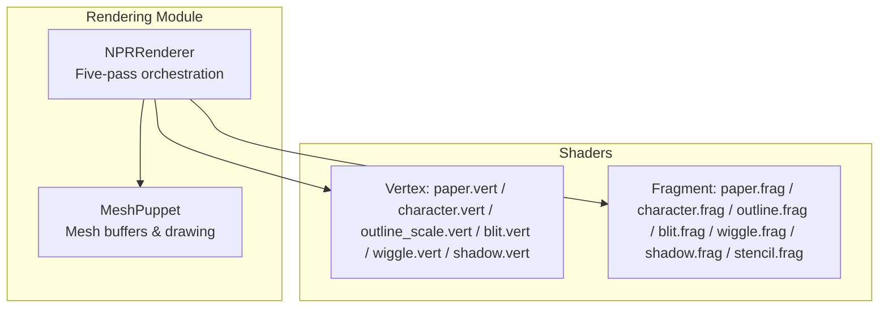
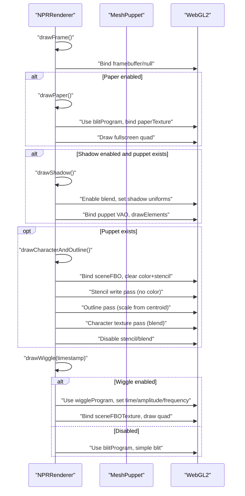
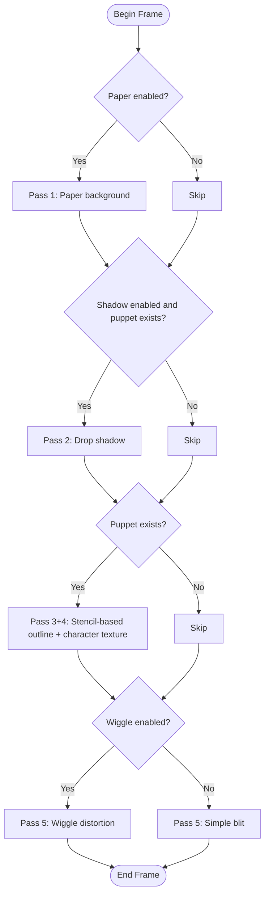
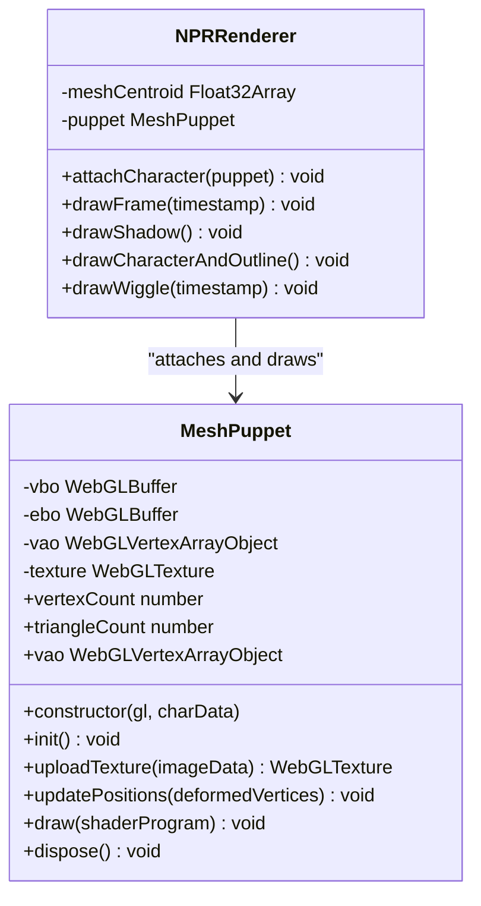
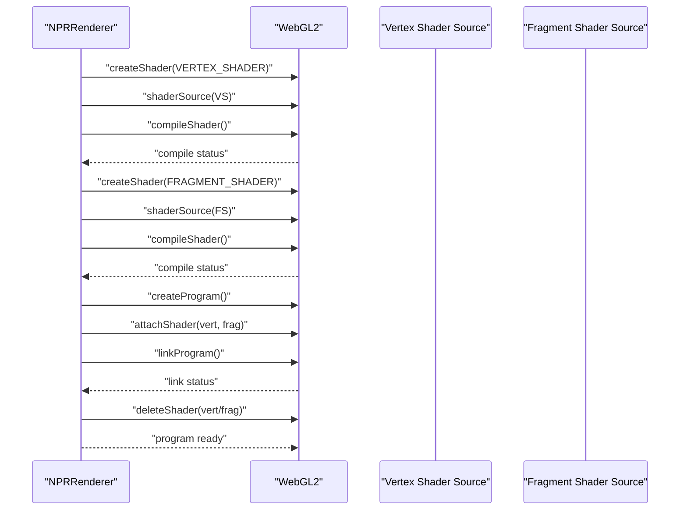
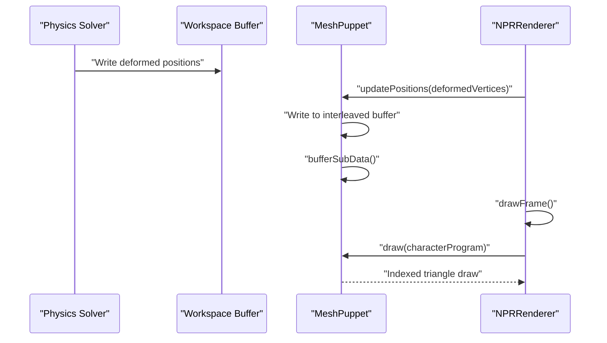
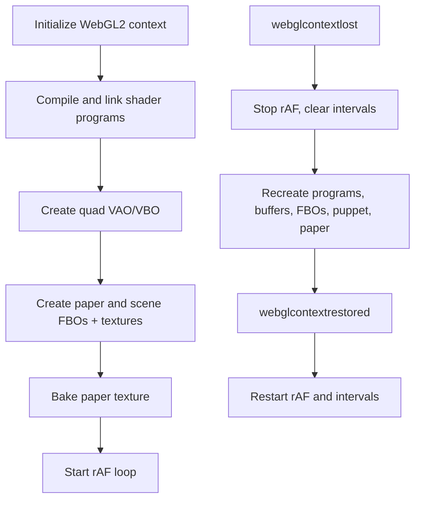
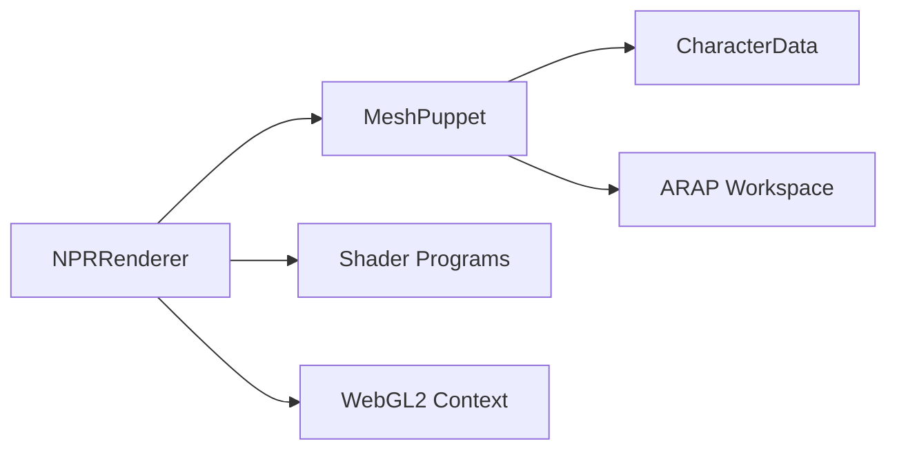

# Rendering System

<cite>
**Referenced Files in This Document**
- [NPRRenderer.js](file://src/rendering/NPRRenderer.js)
- [MeshPuppet.js](file://src/rendering/MeshPuppet.js)
- [paper.vert.glsl](file://src/rendering/shaders/paper.vert.glsl)
- [paper.frag.glsl](file://src/rendering/shaders/paper.frag.glsl)
- [character.vert.glsl](file://src/rendering/shaders/character.vert.glsl)
- [character.frag.glsl](file://src/rendering/shaders/character.frag.glsl)
- [outline_scale.vert.glsl](file://src/rendering/shaders/outline_scale.vert.glsl)
- [outline.frag.glsl](file://src/rendering/shaders/outline.frag.glsl)
- [shadow.vert.glsl](file://src/rendering/shaders/shadow.vert.glsl)
- [shadow.frag.glsl](file://src/rendering/shaders/shadow.frag.glsl)
- [blit.vert.glsl](file://src/rendering/shaders/blit.vert.glsl)
- [blit.frag.glsl](file://src/rendering/shaders/blit.frag.glsl)
- [wiggle.vert.glsl](file://src/rendering/shaders/wiggle.vert.glsl)
- [wiggle.frag.glsl](file://src/rendering/shaders/wiggle.frag.glsl)
- [stencil.frag.glsl](file://src/rendering/shaders/stencil.frag.glsl)
</cite>

## Table of Contents
1. [Introduction](#introduction)
2. [Project Structure](#project-structure)
3. [Core Components](#core-components)
4. [Architecture Overview](#architecture-overview)
5. [Detailed Component Analysis](#detailed-component-analysis)
6. [Dependency Analysis](#dependency-analysis)
7. [Performance Considerations](#performance-considerations)
8. [Troubleshooting Guide](#troubleshooting-guide)
9. [Conclusion](#conclusion)
10. [Appendices](#appendices)

## Introduction
This document describes PaperAlive’s WebGL-based non-photorealistic rendering (NPR) pipeline. The system renders a stylized, paper-textured character with drop shadows, crisp black outlines, and a subtle UV distortion post-process. It integrates tightly with the physics-driven vertex animation system (MeshPuppet) to deform and animate the mesh each frame. The rendering pipeline is organized into five passes: paper background, drop shadow, character with stencil-based outline, and a final wiggle post-process. The document explains the five-pass architecture, shader program management, WebGL context lifecycle, and practical guidance for customization and optimization.

## Project Structure
The rendering system is implemented under src/rendering with two primary modules:
- NPRRenderer: orchestrates the five-pass rendering pipeline, manages WebGL resources, and handles context loss/recovery.
- MeshPuppet: manages the character mesh buffers, uploads textures, and performs zero-allocation position updates for animated frames.

Shaders are stored alongside the renderer and grouped by pass purpose. The renderer compiles and links shader pairs at initialization, binds appropriate uniforms per pass, and executes draw calls against the MeshPuppet’s VAO.

**Diagram sources**
- [NPRRenderer.js:112-185](file://src/rendering/NPRRenderer.js#L112-L185)
- [MeshPuppet.js:25-54](file://src/rendering/MeshPuppet.js#L25-L54)
- [paper.vert.glsl:1-12](file://src/rendering/shaders/paper.vert.glsl#L1-L12)
- [paper.frag.glsl:1-55](file://src/rendering/shaders/paper.frag.glsl#L1-L55)
- [character.vert.glsl:1-17](file://src/rendering/shaders/character.vert.glsl#L1-L17)
- [character.frag.glsl:1-29](file://src/rendering/shaders/character.frag.glsl#L1-L29)
- [outline_scale.vert.glsl:1-20](file://src/rendering/shaders/outline_scale.vert.glsl#L1-L20)
- [outline.frag.glsl:1-12](file://src/rendering/shaders/outline.frag.glsl#L1-L12)
- [blit.vert.glsl:1-11](file://src/rendering/shaders/blit.vert.glsl#L1-L11)
- [blit.frag.glsl:1-12](file://src/rendering/shaders/blit.frag.glsl#L1-L12)
- [wiggle.vert.glsl:1-11](file://src/rendering/shaders/wiggle.vert.glsl#L1-L11)
- [wiggle.frag.glsl:1-23](file://src/rendering/shaders/wiggle.frag.glsl#L1-L23)
- [shadow.vert.glsl:1-19](file://src/rendering/shaders/shadow.vert.glsl#L1-L19)
- [shadow.frag.glsl:1-10](file://src/rendering/shaders/shadow.frag.glsl#L1-L10)
- [stencil.frag.glsl:1-11](file://src/rendering/shaders/stencil.frag.glsl#L1-L11)

**Section sources**
- [NPRRenderer.js:112-185](file://src/rendering/NPRRenderer.js#L112-L185)
- [MeshPuppet.js:25-54](file://src/rendering/MeshPuppet.js#L25-L54)

## Core Components
- NPRRenderer: Initializes WebGL2 context, compiles shader programs, creates and manages FBOs/textures/buffers, runs the five-pass render loop, and handles context loss/recovery. It also supports dynamic paper texture baking and auto-save persistence.
- MeshPuppet: Owns the character VBO/EBO/VAO, uploads the character texture, and performs zero-allocation position updates using a pre-allocated workspace buffer. It exposes a draw method compatible with any shader program.

Key responsibilities:
- Resource creation and lifecycle: VAO/VBO/EBO, textures, FBOs, renderbuffers.
- Pass orchestration: paper background, shadow, character+outline, wiggle.
- Uniform management and blending/stencil state per pass.
- Physics-to-render integration: receives deformed vertex positions from the ARAP workspace and uploads them efficiently.

**Section sources**
- [NPRRenderer.js:195-234](file://src/rendering/NPRRenderer.js#L195-L234)
- [NPRRenderer.js:240-263](file://src/rendering/NPRRenderer.js#L240-L263)
- [NPRRenderer.js:297-349](file://src/rendering/NPRRenderer.js#L297-L349)
- [NPRRenderer.js:359-391](file://src/rendering/NPRRenderer.js#L359-L391)
- [NPRRenderer.js:463-486](file://src/rendering/NPRRenderer.js#L463-L486)
- [NPRRenderer.js:496-508](file://src/rendering/NPRRenderer.js#L496-L508)
- [NPRRenderer.js:517-535](file://src/rendering/NPRRenderer.js#L517-L535)
- [NPRRenderer.js:550-616](file://src/rendering/NPRRenderer.js#L550-L616)
- [NPRRenderer.js:627-663](file://src/rendering/NPRRenderer.js#L627-L663)
- [MeshPuppet.js:68-108](file://src/rendering/MeshPuppet.js#L68-L108)
- [MeshPuppet.js:116-137](file://src/rendering/MeshPuppet.js#L116-L137)
- [MeshPuppet.js:149-162](file://src/rendering/MeshPuppet.js#L149-L162)
- [MeshPuppet.js:170-176](file://src/rendering/MeshPuppet.js#L170-L176)

## Architecture Overview
The five-pass rendering pipeline:
1. Paper background pass: blits a pre-baked procedural paper texture to the screen.
2. Drop shadow pass: draws a flattened, offset copy of the character mesh beneath the character.
3. Character + outline pass: uses stencil testing to render an outline around the character, then renders the character texture inside the silhouette.
4. Final wiggle pass: optionally applies UV distortion to the scene texture and blits to the screen.

**Diagram sources**
- [NPRRenderer.js:463-486](file://src/rendering/NPRRenderer.js#L463-L486)
- [NPRRenderer.js:496-508](file://src/rendering/NPRRenderer.js#L496-L508)
- [NPRRenderer.js:517-535](file://src/rendering/NPRRenderer.js#L517-L535)
- [NPRRenderer.js:550-616](file://src/rendering/NPRRenderer.js#L550-L616)
- [NPRRenderer.js:627-663](file://src/rendering/NPRRenderer.js#L627-L663)

## Detailed Component Analysis

### Five-Pass Rendering Architecture
- Pass 1: Paper background
  - Purpose: Provide a paper-textured base.
  - Implementation: Uses a fullscreen quad and a simple blit shader to copy the pre-baked paper texture.
  - Controls: Toggle via paperEnabled; paper texture is rebuilt when settings change or canvas resizes.
- Pass 2: Drop shadow
  - Purpose: Add a soft, flattened shadow beneath the character.
  - Implementation: Renders the character mesh with a vertical scale and offset, using a simple black color with opacity.
  - Controls: shadowEnabled, shadowOpacity, shadowOffsetX/Y, shadowScaleY.
- Pass 3+4: Character + outline (stencil-based)
  - Purpose: Render crisp black outlines around the character and the character texture inside.
  - Implementation:
    - Step B: Stencil write pass with a no-op fragment shader to mark interior pixels.
    - Step C: Outline pass that scales the mesh uniformly from the mesh centroid and renders a solid color where stencil equals 0.
    - Step D: Character texture pass with blending, sampling from the puppet’s texture.
  - Controls: outlineEnabled, outlineColor, outlineOpacity, outlineScale; brightness and saturation adjustments.
- Pass 5: Wiggle post-process
  - Purpose: Subtle UV distortion to simulate paper waviness.
  - Implementation: Dual sine wave distortion along X and Y axes, applied to the scene texture before final blit.
  - Controls: wiggleEnabled, amplitude, frequency, spatial frequency.

**Diagram sources**
- [NPRRenderer.js:463-486](file://src/rendering/NPRRenderer.js#L463-L486)
- [NPRRenderer.js:496-508](file://src/rendering/NPRRenderer.js#L496-L508)
- [NPRRenderer.js:517-535](file://src/rendering/NPRRenderer.js#L517-L535)
- [NPRRenderer.js:550-616](file://src/rendering/NPRRenderer.js#L550-L616)
- [NPRRenderer.js:627-663](file://src/rendering/NPRRenderer.js#L627-L663)

**Section sources**
- [NPRRenderer.js:463-486](file://src/rendering/NPRRenderer.js#L463-L486)
- [NPRRenderer.js:496-508](file://src/rendering/NPRRenderer.js#L496-L508)
- [NPRRenderer.js:517-535](file://src/rendering/NPRRenderer.js#L517-L535)
- [NPRRenderer.js:550-616](file://src/rendering/NPRRenderer.js#L550-L616)
- [NPRRenderer.js:627-663](file://src/rendering/NPRRenderer.js#L627-L663)

### MeshPuppet System for Vertex Animation and Deformation Rendering
MeshPuppet encapsulates the character mesh and provides efficient updates for animated frames:
- Buffer layout: interleaved [x, y, u, v] per vertex, stride-aligned for fast uploads.
- Initialization: builds VBO/EBO/VAO from rest-pose geometry and UV coordinates.
- Texture upload: creates and configures a 2D RGBA texture from image data.
- Position updates: writes deformed positions into a pre-allocated workspace buffer and uploads via bufferSubData for zero-allocation updates.
- Drawing: binds VAO and draws indexed triangles using the supplied shader program.

Integration with the rendering pipeline:
- NPRRenderer attaches a MeshPuppet and computes the mesh centroid for outline scaling.
- During Pass 3+4, the renderer binds the puppet’s VAO and draws the triangles with the character and outline programs.
- During Pass 2, the renderer draws the shadow using the puppet’s VAO and triangle indices.

**Diagram sources**
- [MeshPuppet.js:25-54](file://src/rendering/MeshPuppet.js#L25-L54)
- [MeshPuppet.js:68-108](file://src/rendering/MeshPuppet.js#L68-L108)
- [MeshPuppet.js:116-137](file://src/rendering/MeshPuppet.js#L116-L137)
- [MeshPuppet.js:149-162](file://src/rendering/MeshPuppet.js#L149-L162)
- [MeshPuppet.js:170-176](file://src/rendering/MeshPuppet.js#L170-L176)
- [NPRRenderer.js:395-405](file://src/rendering/NPRRenderer.js#L395-L405)
- [NPRRenderer.js:517-535](file://src/rendering/NPRRenderer.js#L517-L535)
- [NPRRenderer.js:550-616](file://src/rendering/NPRRenderer.js#L550-L616)
- [NPRRenderer.js:627-663](file://src/rendering/NPRRenderer.js#L627-L663)

**Section sources**
- [MeshPuppet.js:68-108](file://src/rendering/MeshPuppet.js#L68-L108)
- [MeshPuppet.js:116-137](file://src/rendering/MeshPuppet.js#L116-L137)
- [MeshPuppet.js:149-162](file://src/rendering/MeshPuppet.js#L149-L162)
- [MeshPuppet.js:170-176](file://src/rendering/MeshPuppet.js#L170-L176)
- [NPRRenderer.js:395-405](file://src/rendering/NPRRenderer.js#L395-L405)
- [NPRRenderer.js:517-535](file://src/rendering/NPRRenderer.js#L517-L535)
- [NPRRenderer.js:550-616](file://src/rendering/NPRRenderer.js#L550-L616)
- [NPRRenderer.js:627-663](file://src/rendering/NPRRenderer.js#L627-L663)

### Shader Program Management and GLSL Implementation
NPRRenderer compiles and links shader programs at initialization. Each pass uses a dedicated program pair:
- Paper baking: paper.vert + paper.frag
- Character pass: character.vert + character.frag
- Outline pass: outline_scale.vert + outline.frag
- Shadow pass: shadow.vert + shadow.frag
- Stencil pass: character.vert + stencil.frag
- Blit pass: blit.vert + blit.frag
- Wiggle pass: wiggle.vert + wiggle.frag

Uniforms per pass:
- Paper: noise scale/strength, paper color.
- Character: canvas size, brightness, saturation, texture sampler.
- Outline: canvas size, mesh center, outline scale, color, opacity.
- Shadow: canvas size, shadow offset, scale Y, opacity.
- Blit: source sampler.
- Wiggle: scene sampler, time, amplitude, frequency, spatial frequency.

Compilation helpers:
- compileShader: creates and compiles a shader, throws on failure.
- createProgram: compiles both shaders and links into a program, detaching and deleting intermediate shaders.

**Diagram sources**
- [NPRRenderer.js:58-108](file://src/rendering/NPRRenderer.js#L58-L108)
- [paper.vert.glsl:1-12](file://src/rendering/shaders/paper.vert.glsl#L1-L12)
- [paper.frag.glsl:1-55](file://src/rendering/shaders/paper.frag.glsl#L1-L55)
- [character.vert.glsl:1-17](file://src/rendering/shaders/character.vert.glsl#L1-L17)
- [character.frag.glsl:1-29](file://src/rendering/shaders/character.frag.glsl#L1-L29)
- [outline_scale.vert.glsl:1-20](file://src/rendering/shaders/outline_scale.vert.glsl#L1-L20)
- [outline.frag.glsl:1-12](file://src/rendering/shaders/outline.frag.glsl#L1-L12)
- [shadow.vert.glsl:1-19](file://src/rendering/shaders/shadow.vert.glsl#L1-L19)
- [shadow.frag.glsl:1-10](file://src/rendering/shaders/shadow.frag.glsl#L1-L10)
- [blit.vert.glsl:1-11](file://src/rendering/shaders/blit.vert.glsl#L1-L11)
- [blit.frag.glsl:1-12](file://src/rendering/shaders/blit.frag.glsl#L1-L12)
- [wiggle.vert.glsl:1-11](file://src/rendering/shaders/wiggle.vert.glsl#L1-L11)
- [wiggle.frag.glsl:1-23](file://src/rendering/shaders/wiggle.frag.glsl#L1-L23)
- [stencil.frag.glsl:1-11](file://src/rendering/shaders/stencil.frag.glsl#L1-L11)

**Section sources**
- [NPRRenderer.js:58-108](file://src/rendering/NPRRenderer.js#L58-L108)
- [NPRRenderer.js:240-263](file://src/rendering/NPRRenderer.js#L240-L263)
- [paper.vert.glsl:1-12](file://src/rendering/shaders/paper.vert.glsl#L1-L12)
- [paper.frag.glsl:1-55](file://src/rendering/shaders/paper.frag.glsl#L1-L55)
- [character.vert.glsl:1-17](file://src/rendering/shaders/character.vert.glsl#L1-L17)
- [character.frag.glsl:1-29](file://src/rendering/shaders/character.frag.glsl#L1-L29)
- [outline_scale.vert.glsl:1-20](file://src/rendering/shaders/outline_scale.vert.glsl#L1-L20)
- [outline.frag.glsl:1-12](file://src/rendering/shaders/outline.frag.glsl#L1-L12)
- [shadow.vert.glsl:1-19](file://src/rendering/shaders/shadow.vert.glsl#L1-L19)
- [shadow.frag.glsl:1-10](file://src/rendering/shaders/shadow.frag.glsl#L1-L10)
- [blit.vert.glsl:1-11](file://src/rendering/shaders/blit.vert.glsl#L1-L11)
- [blit.frag.glsl:1-12](file://src/rendering/shaders/blit.frag.glsl#L1-L12)
- [wiggle.vert.glsl:1-11](file://src/rendering/shaders/wiggle.vert.glsl#L1-L11)
- [wiggle.frag.glsl:1-23](file://src/rendering/shaders/wiggle.frag.glsl#L1-L23)
- [stencil.frag.glsl:1-11](file://src/rendering/shaders/stencil.frag.glsl#L1-L11)

### Integration Between Physics Simulation Data and Rendering Pipeline
Physics simulation data flows into the rendering pipeline via MeshPuppet:
- Preprocessing allocates a workspace buffer with an interleaved vertex array.
- Each simulation step updates deformed vertex positions in the workspace.
- MeshPuppet.updatePositions writes these positions into the pre-allocated buffer and uploads via bufferSubData.
- NPRRenderer draws the puppet with the current deformed mesh each frame.

**Diagram sources**
- [MeshPuppet.js:149-162](file://src/rendering/MeshPuppet.js#L149-L162)
- [NPRRenderer.js:597-610](file://src/rendering/NPRRenderer.js#L597-L610)

**Section sources**
- [MeshPuppet.js:149-162](file://src/rendering/MeshPuppet.js#L149-L162)
- [NPRRenderer.js:597-610](file://src/rendering/NPRRenderer.js#L597-L610)

### Practical Examples

- Customizing the paper texture:
  - Adjust paper color, noise scale/strength, and rebuild the paper texture.
  - Trigger invalidation and baking when parameters change or on resize.
  - Example paths: [NPRRenderer.js:359-391](file://src/rendering/NPRRenderer.js#L359-L391), [paper.frag.glsl:1-55](file://src/rendering/shaders/paper.frag.glsl#L1-L55).

- Modifying outline appearance:
  - Change outline color/opacity and scale factor.
  - Example paths: [NPRRenderer.js:582-591](file://src/rendering/NPRRenderer.js#L582-L591), [outline.frag.glsl:1-12](file://src/rendering/shaders/outline.frag.glsl#L1-L12).

- Adjusting shadow:
  - Modify offset, scale Y, and opacity.
  - Example paths: [NPRRenderer.js:526-534](file://src/rendering/NPRRenderer.js#L526-L534), [shadow.vert.glsl:1-19](file://src/rendering/shaders/shadow.vert.glsl#L1-L19), [shadow.frag.glsl:1-10](file://src/rendering/shaders/shadow.frag.glsl#L1-L10).

- Tweaking the wiggle effect:
  - Tune amplitude, frequency, and spatial frequency.
  - Example paths: [NPRRenderer.js:651-654](file://src/rendering/NPRRenderer.js#L651-L654), [wiggle.frag.glsl:1-23](file://src/rendering/shaders/wiggle.frag.glsl#L1-L23).

- Brightness and saturation:
  - Control global tone adjustments.
  - Example paths: [NPRRenderer.js:606-607](file://src/rendering/NPRRenderer.js#L606-L607), [character.frag.glsl:11-22](file://src/rendering/shaders/character.frag.glsl#L11-L22).

**Section sources**
- [NPRRenderer.js:359-391](file://src/rendering/NPRRenderer.js#L359-L391)
- [NPRRenderer.js:526-534](file://src/rendering/NPRRenderer.js#L526-L534)
- [NPRRenderer.js:582-591](file://src/rendering/NPRRenderer.js#L582-L591)
- [NPRRenderer.js:606-607](file://src/rendering/NPRRenderer.js#L606-L607)
- [NPRRenderer.js:651-654](file://src/rendering/NPRRenderer.js#L651-L654)
- [paper.frag.glsl:1-55](file://src/rendering/shaders/paper.frag.glsl#L1-L55)
- [outline.frag.glsl:1-12](file://src/rendering/shaders/outline.frag.glsl#L1-L12)
- [shadow.vert.glsl:1-19](file://src/rendering/shaders/shadow.vert.glsl#L1-L19)
- [shadow.frag.glsl:1-10](file://src/rendering/shaders/shadow.frag.glsl#L1-L10)
- [wiggle.frag.glsl:1-23](file://src/rendering/shaders/wiggle.frag.glsl#L1-L23)
- [character.frag.glsl:11-22](file://src/rendering/shaders/character.frag.glsl#L11-L22)

### WebGL Context Management and Resource Allocation Strategies
- Context creation: WebGL2 with alpha=false, antialias=false, stencil=true, premultipliedAlpha=false, preserveDrawingBuffer=false.
- Context loss handling: listens to webglcontextlost/restored events, stops rendering, recreates all WebGL objects, and restarts the loop.
- Resource lifecycle: all WebGL objects are deleted on dispose to prevent leaks.
- FBOs and textures: separate FBOs for paper baking and scene rendering; textures configured with linear filtering and clamp-to-edge wrapping.
- Quad VAO: reused for blitting and post-processing passes.

**Diagram sources**
- [NPRRenderer.js:195-234](file://src/rendering/NPRRenderer.js#L195-L234)
- [NPRRenderer.js:707-729](file://src/rendering/NPRRenderer.js#L707-L729)
- [NPRRenderer.js:834-876](file://src/rendering/NPRRenderer.js#L834-L876)

**Section sources**
- [NPRRenderer.js:195-234](file://src/rendering/NPRRenderer.js#L195-L234)
- [NPRRenderer.js:707-729](file://src/rendering/NPRRenderer.js#L707-L729)
- [NPRRenderer.js:834-876](file://src/rendering/NPRRenderer.js#L834-L876)

### Browser Compatibility and Fallback Approaches
- WebGL2 requirement: The renderer requires WebGL2 with explicit context creation and stencil support.
- Context loss handling: Implements robust recovery by recreating all WebGL resources upon restoration.
- Fallback strategy: If WebGL2 is unavailable, initialization throws an error. A fallback could involve:
  - Detecting WebGL1 and adapting shaders to ES 1.0 with appropriate extensions.
  - Simplifying the pipeline to two passes (background + character) and removing stencil/outline/wiggle.
  - Using a software fallback path that renders to a canvas via a 2D context for static images.

[No sources needed since this section provides general guidance]

## Dependency Analysis
The rendering system exhibits clear separation of concerns:
- NPRRenderer depends on MeshPuppet for geometry and textures, and on shader programs for rendering.
- MeshPuppet depends on CharacterData for geometry and ARAP workspace for deformed positions.
- Shaders are decoupled modules consumed by the renderer and puppet.

**Diagram sources**
- [NPRRenderer.js:112-185](file://src/rendering/NPRRenderer.js#L112-L185)
- [MeshPuppet.js:25-54](file://src/rendering/MeshPuppet.js#L25-L54)

**Section sources**
- [NPRRenderer.js:112-185](file://src/rendering/NPRRenderer.js#L112-L185)
- [MeshPuppet.js:25-54](file://src/rendering/MeshPuppet.js#L25-L54)

## Performance Considerations
- Minimize state changes: reuse programs and VAOs across passes; enable/disable blending/stencil only when necessary.
- Efficient uploads: MeshPuppet uses bufferSubData to avoid allocations and reduce GC pressure.
- Texture filtering: NEAREST filtering for scene texture to maintain crisp pixel art aesthetics.
- Paper baking: bake once per setting change or resize; avoid per-frame recomputation.
- Blend modes: enable blending only when needed (outline and character passes).
- Stencil usage: disable depth test for stencil-based outline to simplify ordering.

[No sources needed since this section provides general guidance]

## Troubleshooting Guide
Common issues and remedies:
- Shader compilation errors: check compile logs and ensure correct GLSL version pragmas and precision qualifiers.
- Program linking failures: verify attribute/uniform locations and that shaders are detached after linking.
- Context loss: ensure listeners are attached and resources are recreated on restored.
- Incorrect outline or shadow: verify stencil operations, canvas size uniforms, and mesh centroid for scaling.
- Performance drops: profile upload sizes, blending usage, and stencil operations; prefer bufferSubData and minimal state switches.

**Section sources**
- [NPRRenderer.js:58-108](file://src/rendering/NPRRenderer.js#L58-L108)
- [NPRRenderer.js:672-701](file://src/rendering/NPRRenderer.js#L672-L701)
- [NPRRenderer.js:564-591](file://src/rendering/NPRRenderer.js#L564-L591)

## Conclusion
PaperAlive’s rendering system combines a five-pass NPR pipeline with a tight integration between physics-driven deformation and efficient WebGL rendering. The MeshPuppet system enables zero-allocation position updates, while NPRRenderer orchestrates passes, manages resources, and recovers gracefully from context loss. The modular shader design allows straightforward customization of paper textures, outlines, shadows, and post-processing effects.

## Appendices

### Appendix A: Pass-by-Pass Uniform Reference
- Paper pass: u_noiseScale, u_noiseStrength, u_paperColor
- Character pass: u_canvasSize, u_brightness, u_saturation, u_texture
- Outline pass: u_canvasSize, u_meshCenter, u_outlineScale, u_outlineColor, u_outlineOpacity
- Shadow pass: u_canvasSize, u_shadowOffset, u_shadowScaleY, u_shadowOpacity
- Blit pass: u_source
- Wiggle pass: u_scene, u_time, u_amplitude, u_frequency, u_spatialFreq

**Section sources**
- [paper.frag.glsl:10-12](file://src/rendering/shaders/paper.frag.glsl#L10-L12)
- [character.frag.glsl:7-9](file://src/rendering/shaders/character.frag.glsl#L7-L9)
- [outline_scale.vert.glsl:6-8](file://src/rendering/shaders/outline_scale.vert.glsl#L6-L8)
- [outline.frag.glsl:6-7](file://src/rendering/shaders/outline.frag.glsl#L6-L7)
- [shadow.vert.glsl:6-8](file://src/rendering/shaders/shadow.vert.glsl#L6-L8)
- [shadow.frag.glsl:5](file://src/rendering/shaders/shadow.frag.glsl#L5)
- [blit.frag.glsl:7](file://src/rendering/shaders/blit.frag.glsl#L7)
- [wiggle.frag.glsl:7-11](file://src/rendering/shaders/wiggle.frag.glsl#L7-L11)