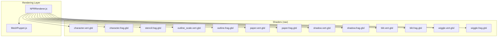
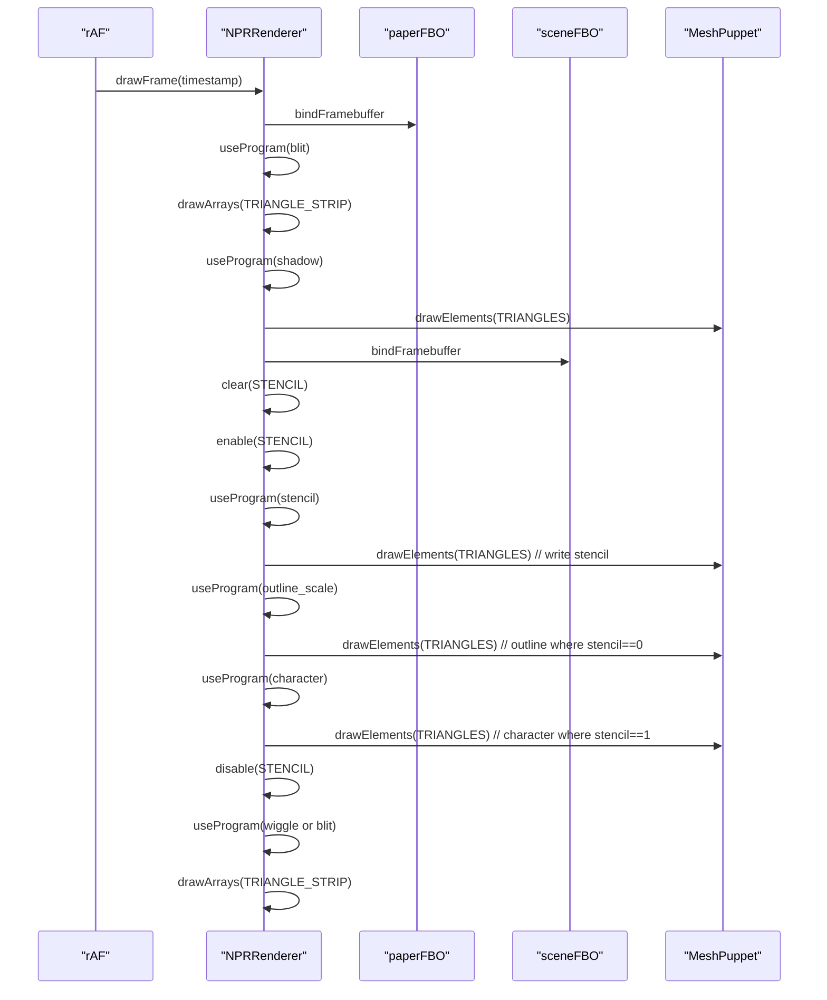
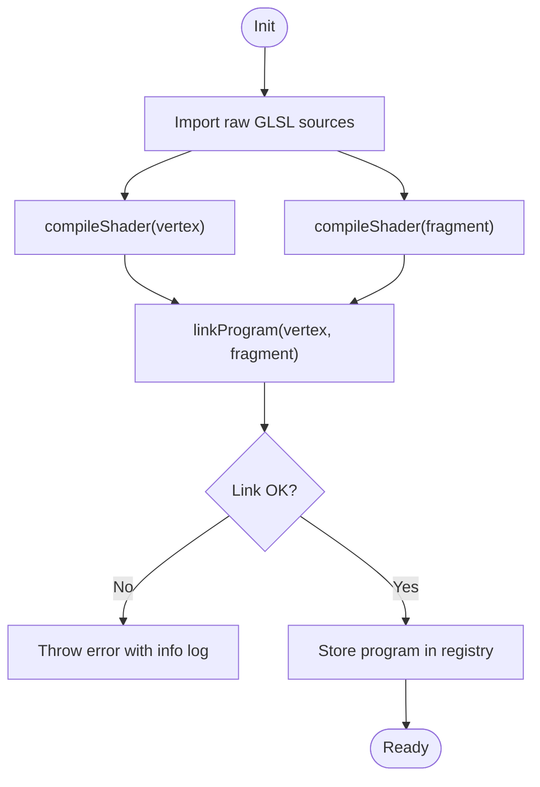
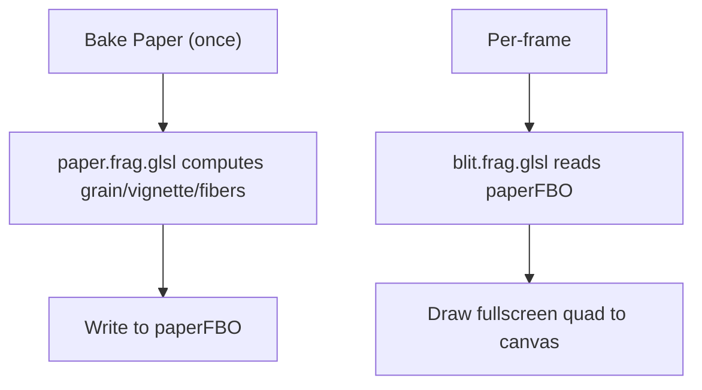
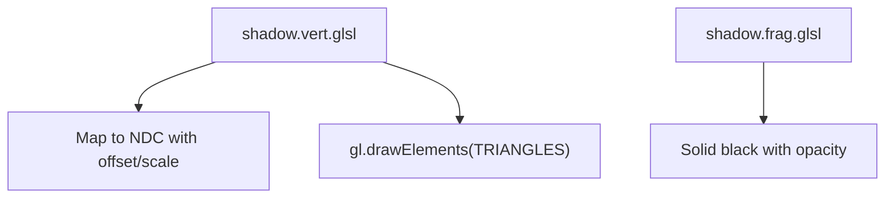
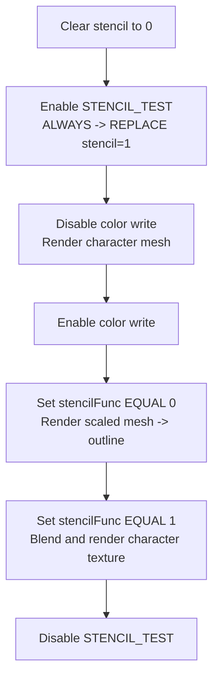
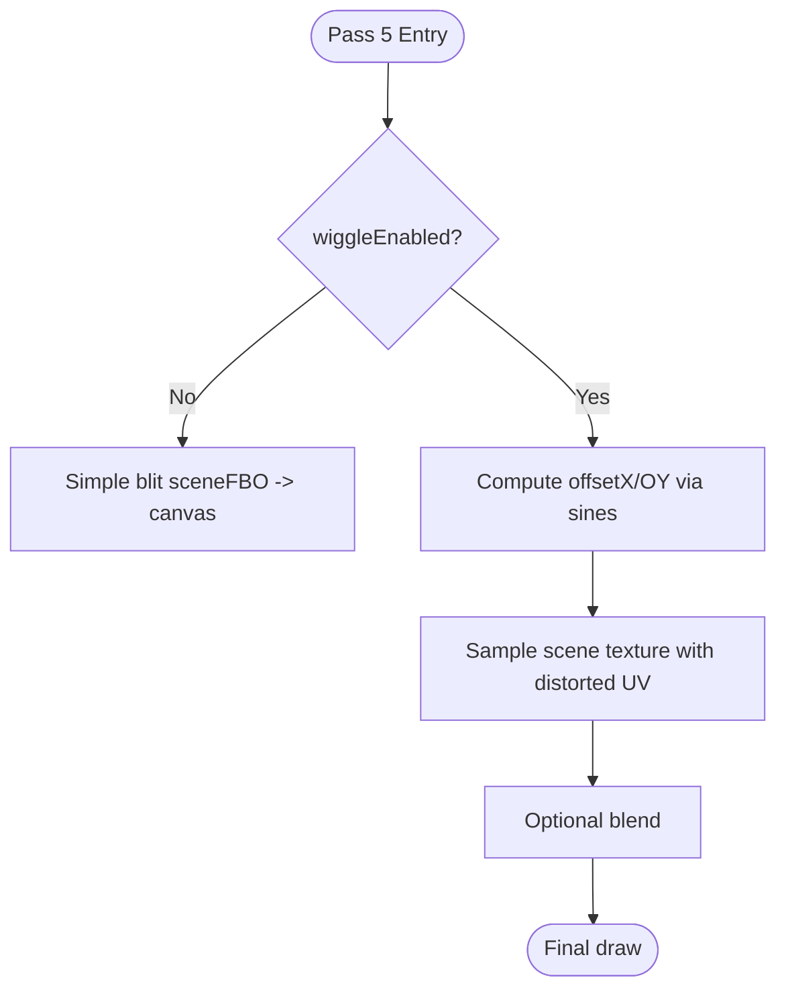
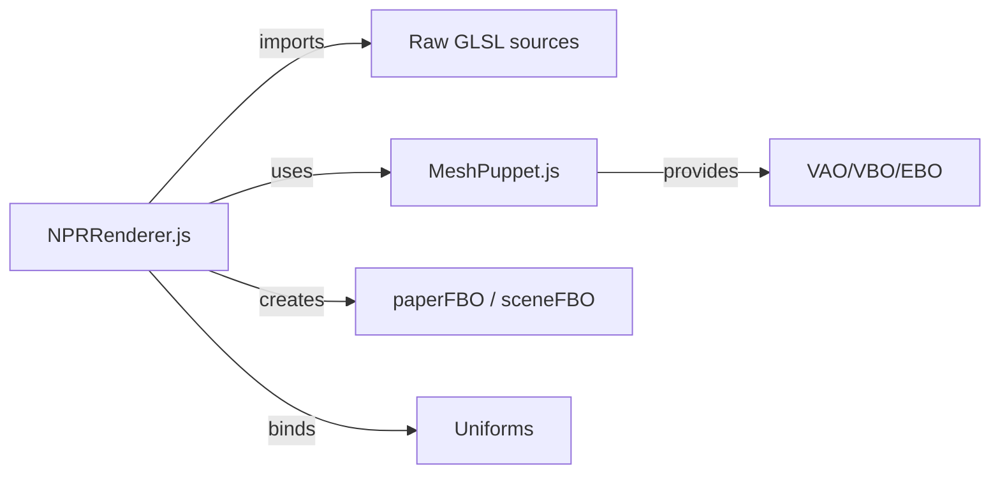

# Shader Management and GLSL Implementation

<cite>
**Referenced Files in This Document**
- [NPRRenderer.js](file://src/rendering/NPRRenderer.js)
- [MeshPuppet.js](file://src/rendering/MeshPuppet.js)
- [character.vert.glsl](file://src/rendering/shaders/character.vert.glsl)
- [character.frag.glsl](file://src/rendering/shaders/character.frag.glsl)
- [stencil.frag.glsl](file://src/rendering/shaders/stencil.frag.glsl)
- [outline.frag.glsl](file://src/rendering/shaders/outline.frag.glsl)
- [outline_scale.vert.glsl](file://src/rendering/shaders/outline_scale.vert.glsl)
- [paper.vert.glsl](file://src/rendering/shaders/paper.vert.glsl)
- [paper.frag.glsl](file://src/rendering/shaders/paper.frag.glsl)
- [shadow.vert.glsl](file://src/rendering/shaders/shadow.vert.glsl)
- [shadow.frag.glsl](file://src/rendering/shaders/shadow.frag.glsl)
- [blit.vert.glsl](file://src/rendering/shaders/blit.vert.glsl)
- [blit.frag.glsl](file://src/rendering/shaders/blit.frag.glsl)
- [wiggle.vert.glsl](file://src/rendering/shaders/wiggle.vert.glsl)
- [wiggle.frag.glsl](file://src/rendering/shaders/wiggle.frag.glsl)
- [shader_design.md](file://architecture/shader_design.md)
- [rendering_pipeline.md](file://architecture/rendering_pipeline.md)
</cite>

## Table of Contents
1. [Introduction](#introduction)
2. [Project Structure](#project-structure)
3. [Core Components](#core-components)
4. [Architecture Overview](#architecture-overview)
5. [Detailed Component Analysis](#detailed-component-analysis)
6. [Dependency Analysis](#dependency-analysis)
7. [Performance Considerations](#performance-considerations)
8. [Troubleshooting Guide](#troubleshooting-guide)
9. [Conclusion](#conclusion)
10. [Appendices](#appendices)

## Introduction
This document explains PaperAlive’s shader management and GLSL implementation for non-photorealistic rendering. It covers the seven shader programs, their roles in the five-pass rendering pipeline, compilation and uniform management, GLSL techniques, and performance/cross-browser considerations. Practical guidance is included for customization, tuning, and debugging.

## Project Structure
The rendering system is organized around a dedicated renderer and modular GLSL shader assets:
- Renderer orchestrates passes, compiles shaders, manages FBOs/textures/buffers, and drives the animation loop.
- MeshPuppet encapsulates the character mesh lifecycle (VBO/EBO/VAO, texture upload, dynamic position updates).
- Shader assets are raw GLSL files imported as strings and compiled into WebGL programs.

**Diagram sources**
- [NPRRenderer.js:20-32](file://src/rendering/NPRRenderer.js#L20-L32)
- [MeshPuppet.js:25-54](file://src/rendering/MeshPuppet.js#L25-L54)

**Section sources**
- [NPRRenderer.js:195-234](file://src/rendering/NPRRenderer.js#L195-L234)
- [MeshPuppet.js:68-108](file://src/rendering/MeshPuppet.js#L68-L108)

## Core Components
- Shader compilation helpers: compile individual shaders and link programs with robust error reporting.
- Program registry: seven programs managed by the renderer (character, stencil, outline scale, paper, blit, shadow, wiggle).
- FBO strategy: paperFBO (pre-baked paper), sceneFBO (character + outline), default framebuffer (final composition).
- Uniform management: per-pass uniforms bound before draw calls; defaults exposed for customization.
- Mesh lifecycle: MeshPuppet creates and updates the character mesh with zero-allocation updates.

**Section sources**
- [NPRRenderer.js:58-108](file://src/rendering/NPRRenderer.js#L58-L108)
- [NPRRenderer.js:126-133](file://src/rendering/NPRRenderer.js#L126-L133)
- [NPRRenderer.js:239-263](file://src/rendering/NPRRenderer.js#L239-L263)
- [NPRRenderer.js:297-349](file://src/rendering/NPRRenderer.js#L297-L349)
- [MeshPuppet.js:68-108](file://src/rendering/MeshPuppet.js#L68-L108)

## Architecture Overview
The rendering pipeline is a five-pass composition:
1. Paper background: blit pre-baked paperFBO texture.
2. Drop shadow: flat, scaled-down character projection.
3. Character + outline (stencil-based): write stencil, draw outline where stencil is clear, draw character where stencil is set.
4. Final composition: optional wiggle post-process with UV distortion.

**Diagram sources**
- [NPRRenderer.js:463-486](file://src/rendering/NPRRenderer.js#L463-L486)
- [NPRRenderer.js:517-535](file://src/rendering/NPRRenderer.js#L517-L535)
- [NPRRenderer.js:550-616](file://src/rendering/NPRRenderer.js#L550-L616)
- [NPRRenderer.js:627-663](file://src/rendering/NPRRenderer.js#L627-L663)

**Section sources**
- [rendering_pipeline.md:17-55](file://architecture/rendering_pipeline.md#L17-L55)
- [shader_design.md:17-49](file://architecture/shader_design.md#L17-L49)

## Detailed Component Analysis

### Shader Compilation and Program Registry
- Compilation: Each shader is compiled individually; on failure, the error log is captured and surfaced.
- Linking: Vertex and fragment shaders are linked into a program; on failure, logs are retrieved and cleanup occurs.
- Registry: Seven programs are created and cached by the renderer for reuse across frames.

**Diagram sources**
- [NPRRenderer.js:58-108](file://src/rendering/NPRRenderer.js#L58-L108)
- [NPRRenderer.js:240-263](file://src/rendering/NPRRenderer.js#L240-L263)

**Section sources**
- [NPRRenderer.js:58-108](file://src/rendering/NPRRenderer.js#L58-L108)
- [NPRRenderer.js:240-263](file://src/rendering/NPRRenderer.js#L240-L263)

### Paper Background (Baked + Blit)
- Purpose: Provide a static paper texture with procedural grain/vignette/fibers.
- Execution model:
  - Baking: One-time pass to paperFBO using the paper shader.
  - Per-frame: Blit the pre-baked paper texture to the canvas using a simple textured quad.
- Uniforms: noise scale/strength, base paper color.

**Diagram sources**
- [NPRRenderer.js:359-380](file://src/rendering/NPRRenderer.js#L359-L380)
- [NPRRenderer.js:496-508](file://src/rendering/NPRRenderer.js#L496-L508)
- [paper.frag.glsl:14-54](file://src/rendering/shaders/paper.frag.glsl#L14-L54)
- [blit.frag.glsl:7-11](file://src/rendering/shaders/blit.frag.glsl#L7-L11)

**Section sources**
- [shader_design.md:53-166](file://architecture/shader_design.md#L53-L166)
- [NPRRenderer.js:359-380](file://src/rendering/NPRRenderer.js#L359-L380)
- [NPRRenderer.js:496-508](file://src/rendering/NPRRenderer.js#L496-L508)

### Drop Shadow
- Purpose: Render a flattened, offset ellipse under the character to imply depth.
- Technique: Offset and vertically scale the character mesh in the vertex shader; solid black color in the fragment shader with configurable opacity.
- Uniforms: offset vector, vertical scale factor, canvas size.

**Diagram sources**
- [shadow.vert.glsl:10-18](file://src/rendering/shaders/shadow.vert.glsl#L10-L18)
- [shadow.frag.glsl:7-9](file://src/rendering/shaders/shadow.frag.glsl#L7-L9)
- [NPRRenderer.js:517-535](file://src/rendering/NPRRenderer.js#L517-L535)

**Section sources**
- [shader_design.md:169-207](file://architecture/shader_design.md#L169-L207)
- [NPRRenderer.js:517-535](file://src/rendering/NPRRenderer.js#L517-L535)

### Character + Outline (Stencil-Based)
- Purpose: Produce crisp, geometric outlines independent of mesh concavities.
- Technique:
  - Step B: Render character mesh to write stencil = 1 everywhere the character resides (no color).
  - Step C: Render a uniformly scaled mesh (from centroid) where stencil = 0 to paint the outline.
  - Step D: Render the character texture where stencil = 1.
- Vertex attributes: position and UV for character meshes; only position for the scaled outline pass.
- Uniforms: canvas size, mesh centroid, outline scale/color/opacity, character texture, brightness/saturation.

**Diagram sources**
- [NPRRenderer.js:550-616](file://src/rendering/NPRRenderer.js#L550-L616)
- [outline_scale.vert.glsl:10-18](file://src/rendering/shaders/outline_scale.vert.glsl#L10-L18)
- [outline.frag.glsl:9-11](file://src/rendering/shaders/outline.frag.glsl#L9-L11)
- [character.frag.glsl:16-28](file://src/rendering/shaders/character.frag.glsl#L16-L28)

**Section sources**
- [shader_design.md:210-318](file://architecture/shader_design.md#L210-L318)
- [NPRRenderer.js:550-616](file://src/rendering/NPRRenderer.js#L550-L616)

### Wiggle Post-Process
- Purpose: Add subtle organic movement via UV-space distortion.
- Technique: Dual sine waves with spatially and temporally modulated offsets; optionally disabled to skip FBO.
- Uniforms: scene texture (from sceneFBO), time, amplitude, frequency, spatial frequency.

**Diagram sources**
- [NPRRenderer.js:627-663](file://src/rendering/NPRRenderer.js#L627-L663)
- [wiggle.frag.glsl:13-22](file://src/rendering/shaders/wiggle.frag.glsl#L13-L22)

**Section sources**
- [shader_design.md:322-349](file://architecture/shader_design.md#L322-L349)
- [NPRRenderer.js:627-663](file://src/rendering/NPRRenderer.js#L627-L663)

### Vertex Attribute Handling and Coordinate Systems
- Character mesh VBO layout (interleaved): [x, y, u, v], stride optimized to avoid normals for stencil-based outline.
- Vertex attributes:
  - a_position (location 0): vec2 for deformed pixel-space positions.
  - a_uv (location 1): vec2 for UV coordinates.
- Coordinate conversions:
  - Pixel space (top-left origin) to NDC (center origin, Y up) in vertex shaders.
  - UV space aligned with image coordinates.

**Section sources**
- [shader_design.md:381-413](file://architecture/shader_design.md#L381-L413)
- [character.vert.glsl:4-16](file://src/rendering/shaders/character.vert.glsl#L4-L16)
- [outline_scale.vert.glsl:4-18](file://src/rendering/shaders/outline_scale.vert.glsl#L4-L18)
- [MeshPuppet.js:99-105](file://src/rendering/MeshPuppet.js#L99-L105)

### Fragment Shader Techniques for Non-Photorealism
- Saturation adjustment: luminance-preserving color modification.
- Alpha discard: remove low-opacity edges to prevent outline artifacts.
- Warm tint: slight color temperature bias to reinforce paper aesthetics.
- Procedural paper: value noise, vignette falloff, and subtle horizontal fibers baked into the paper texture.

**Section sources**
- [character.frag.glsl:11-28](file://src/rendering/shaders/character.frag.glsl#L11-L28)
- [paper.frag.glsl:14-54](file://src/rendering/shaders/paper.frag.glsl#L14-L54)

### Uniform Variable Management
- Centralized defaults and runtime settings are exposed for each effect.
- Per-pass binding: uniforms are set before draw calls using cached locations.

**Section sources**
- [NPRRenderer.js:36-52](file://src/rendering/NPRRenderer.js#L36-L52)
- [NPRRenderer.js:597-607](file://src/rendering/NPRRenderer.js#L597-L607)
- [NPRRenderer.js:644-654](file://src/rendering/NPRRenderer.js#L644-L654)

## Dependency Analysis
The renderer depends on:
- Shader sources imported as raw strings.
- MeshPuppet for geometry and texture.
- WebGL2 context with stencil enabled and specific context flags.

**Diagram sources**
- [NPRRenderer.js:20-32](file://src/rendering/NPRRenderer.js#L20-L32)
- [NPRRenderer.js:126-140](file://src/rendering/NPRRenderer.js#L126-L140)
- [MeshPuppet.js:25-54](file://src/rendering/MeshPuppet.js#L25-L54)

**Section sources**
- [NPRRenderer.js:195-234](file://src/rendering/NPRRenderer.js#L195-L234)
- [rendering_pipeline.md:59-88](file://architecture/rendering_pipeline.md#L59-L88)

## Performance Considerations
- Pre-baked paper: One-time procedural generation to paperFBO; per-frame blit is extremely fast.
- Conditional FBO: Skip wiggle pass when disabled to reduce bandwidth.
- Shared VAO and single EBO minimize state changes.
- Pre-allocated buffers and zero-allocation updates keep CPU work minimal.
- Depth testing removed for stencil-based outline to avoid artifacts and cost.
- Context flags tuned for speed (alpha=false, preserveDrawingBuffer=false, antialias=false).

**Section sources**
- [rendering_pipeline.md:327-366](file://architecture/rendering_pipeline.md#L327-L366)
- [rendering_pipeline.md:527-553](file://architecture/rendering_pipeline.md#L527-L553)
- [shader_design.md:415-436](file://architecture/shader_design.md#L415-L436)

## Troubleshooting Guide
- Shader compile/link errors:
  - Compilation failures throw with the GLSL compiler log; inspect the returned error string for precise line/column.
  - Link failures also surface detailed logs; ensure vertex/fragment shader pairs match attribute/uniform names.
- Context loss:
  - Renderer listens for context lost/restored events and recreates all WebGL objects upon restore.
  - Overlay prompts the user to trigger restore via the context loss extension.
- Unexpected outline or blending issues:
  - Verify stencil operations and color mask states in the outline pass.
  - Confirm canvas size and UV calculations are consistent across passes.
- Performance regressions:
  - Validate that paper is blitted from FBO and not recomputed each frame.
  - Ensure zero-allocation buffer updates and shared VAO usage.

**Section sources**
- [NPRRenderer.js:65-108](file://src/rendering/NPRRenderer.js#L65-L108)
- [NPRRenderer.js:665-729](file://src/rendering/NPRRenderer.js#L665-L729)
- [NPRRenderer.js:550-616](file://src/rendering/NPRRenderer.js#L550-L616)

## Conclusion
PaperAlive’s NPR rendering leverages a compact set of purpose-built shaders and a strict multi-pass pipeline. The renderer centralizes compilation, uniform management, and resource lifecycle while optimizing for speed and correctness. The stencil-based outline ensures robust geometry handling, and the pre-baked paper technique minimizes per-frame computation. These choices deliver a responsive, visually coherent non-photorealistic pipeline suitable for interactive animation and export.

## Appendices

### Practical Customization Examples
- Adjust paper grain: tune noise scale and strength; regenerate paper texture on change.
- Modify outline thickness: increase/decrease outline scale; observe effect on screen-space width.
- Change shadow appearance: adjust offset, vertical scale, and opacity.
- Fine-tune character tone: adjust brightness and saturation uniforms.
- Enable/disable effects: toggle wiggle and shadow flags to compare performance and style.

**Section sources**
- [NPRRenderer.js:36-52](file://src/rendering/NPRRenderer.js#L36-L52)
- [NPRRenderer.js:388-391](file://src/rendering/NPRRenderer.js#L388-L391)
- [NPRRenderer.js:578-591](file://src/rendering/NPRRenderer.js#L578-L591)
- [NPRRenderer.js:597-607](file://src/rendering/NPRRenderer.js#L597-L607)
- [NPRRenderer.js:630-642](file://src/rendering/NPRRenderer.js#L630-L642)

### Cross-Browser Compatibility Notes
- WebGL2 is required; context flags are configured to maximize performance.
- Stencil buffer is essential for the outline pass; confirm browser support.
- Avoid preserveDrawingBuffer=true for recording to prevent extra copy overhead.
- Prefer linear filtering for textures to reduce aliasing artifacts.

**Section sources**
- [rendering_pipeline.md:59-88](file://architecture/rendering_pipeline.md#L59-L88)
- [rendering_pipeline.md:416-460](file://architecture/rendering_pipeline.md#L416-L460)