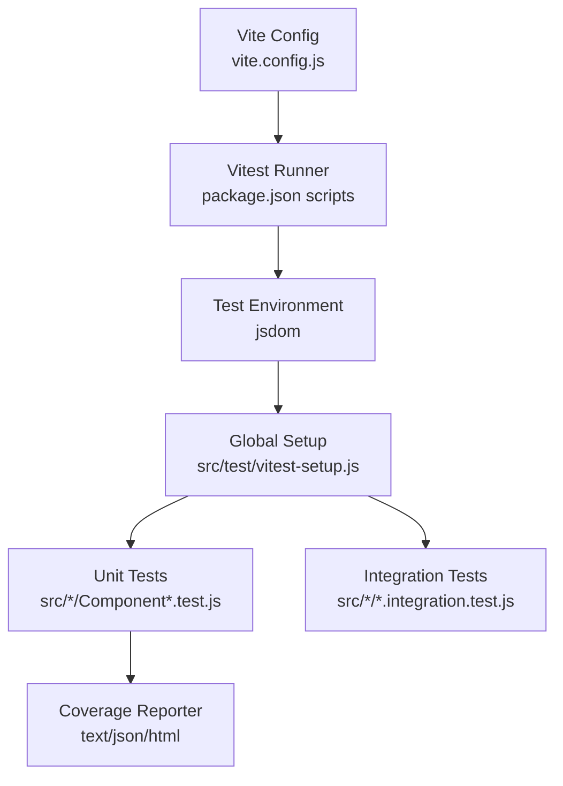
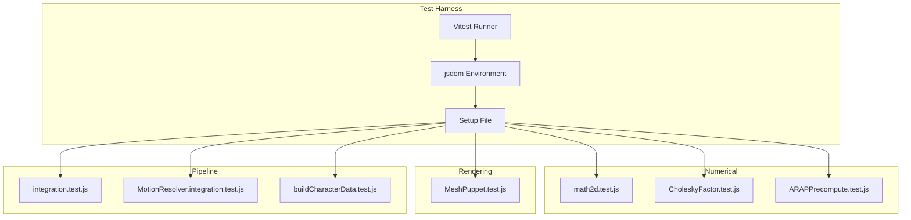
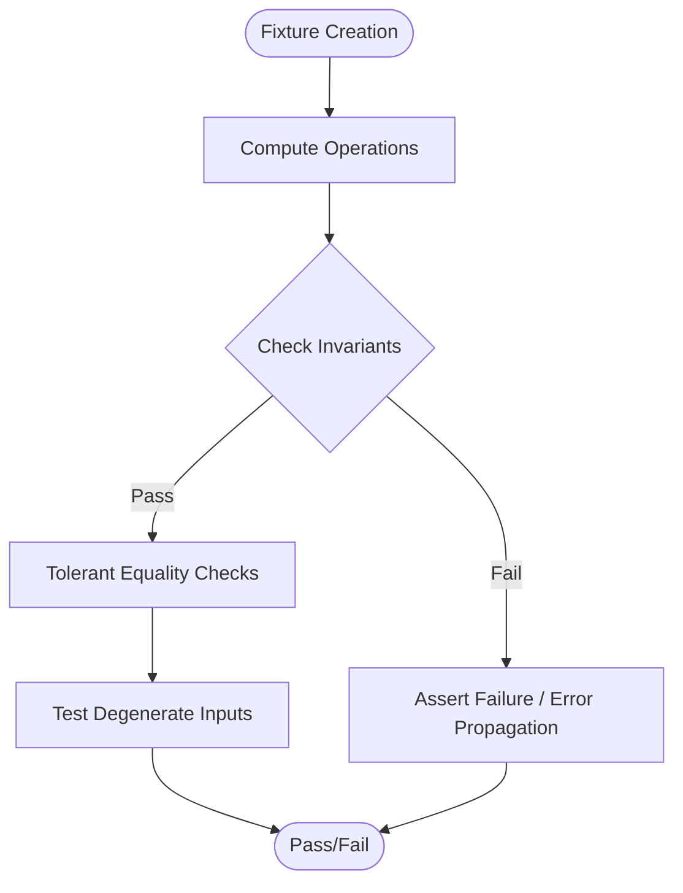
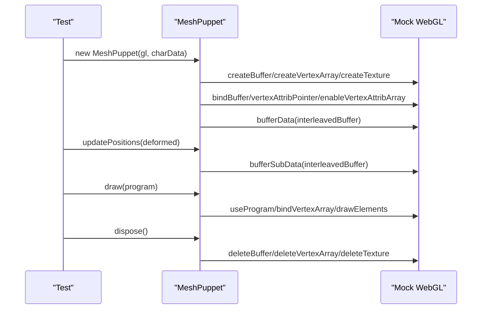
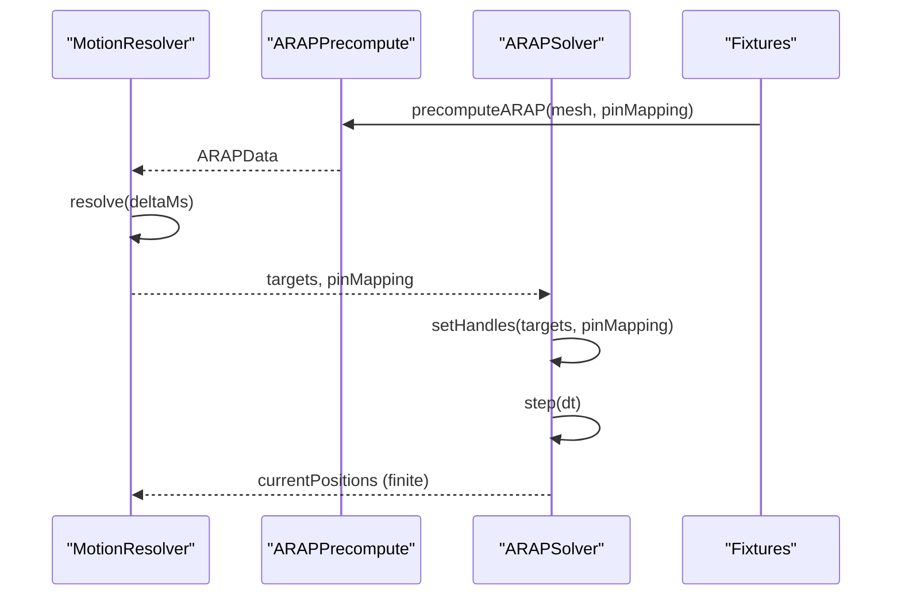
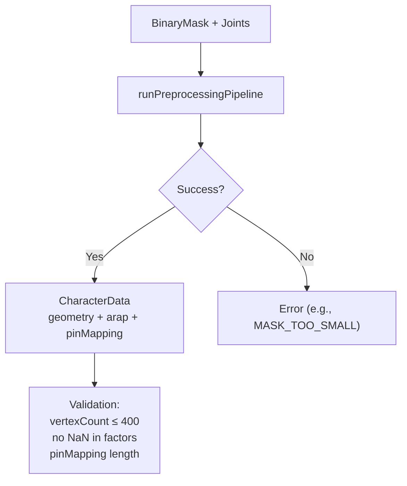
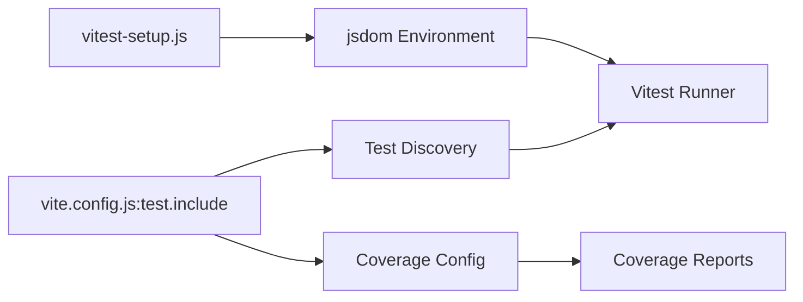

# Testing and Quality Assurance

<cite>
**Referenced Files in This Document**
- [vite.config.js](file://vite.config.js)
- [package.json](file://package.json)
- [vitest-setup.js](file://src/test/vitest-setup.js)
- [CholeskyFactor.test.js](file://src/arap/sparse/CholeskyFactor.test.js)
- [ARAPPrecompute.test.js](file://src/arap/ARAPPrecompute.test.js)
- [buildCharacterData.test.js](file://src/character/buildCharacterData.test.js)
- [math2d.test.js](file://src/utils/math2d.test.js)
- [MeshPuppet.test.js](file://src/rendering/MeshPuppet.test.js)
- [MotionResolver.integration.test.js](file://src/motion/MotionResolver.integration.test.js)
- [integration.test.js](file://src/character/integration.test.js)
- [arapTestFixture.js](file://src/arap/arapTestFixture.js)
- [bbox.test.js](file://src/utils/bbox.test.js)
- [timer.test.js](file://src/utils/timer.test.js)
- [ImageLoader.test.js](file://src/image/ImageLoader.test.js)
- [ContourTracer.test.js](file://src/geometry/ContourTracer.test.js)
</cite>

## Table of Contents
1. [Introduction](#introduction)
2. [Project Structure](#project-structure)
3. [Core Components](#core-components)
4. [Architecture Overview](#architecture-overview)
5. [Detailed Component Analysis](#detailed-component-analysis)
6. [Dependency Analysis](#dependency-analysis)
7. [Performance Considerations](#performance-considerations)
8. [Troubleshooting Guide](#troubleshooting-guide)
9. [Conclusion](#conclusion)

## Introduction
This document describes PaperAlive’s testing and quality assurance framework. It explains the Vitest configuration and jsdom-based testing environment, unit and integration testing strategies, testing patterns for numerical computations, rendering systems, and physics simulations, coverage reporting, quality metrics, and CI/automation considerations. Practical examples show how to write effective tests for core components and validate critical algorithms.

## Project Structure
PaperAlive organizes tests alongside implementation modules under src/<category>/<Module>.test.js. The test runner is Vitest configured inside Vite, using jsdom to emulate browser APIs required by the application (e.g., Canvas, IndexedDB, ImageData). A global setup file ensures compatibility by polyfilling missing APIs.

**Diagram sources**
- [vite.config.js:12-28](file://vite.config.js#L12-L28)
- [package.json:7-14](file://package.json#L7-L14)
- [vitest-setup.js:1-37](file://src/test/vitest-setup.js#L1-L37)

**Section sources**
- [vite.config.js:12-28](file://vite.config.js#L12-L28)
- [package.json:7-14](file://package.json#L7-L14)
- [vitest-setup.js:1-37](file://src/test/vitest-setup.js#L1-L37)

## Core Components
- Vitest and jsdom environment configured in Vite for browser API emulation.
- Global setup file polyfills IndexedDB, ImageData, and navigator.storage.estimate().
- Test coverage enabled via v8 provider with reporters: text, json, html.
- Scripts for running tests, watch mode, and coverage generation.

Key capabilities validated by tests:
- Numerical routines: linear algebra, SVD, trigonometric utilities.
- Rendering pipeline: WebGL initialization, buffers, textures, drawing, and disposal.
- Physics simulation: ARAP preprocessing, factorization, and solver integration.
- Preprocessing pipeline: mask processing, contour tracing, mesh building, skeleton estimation, and character data construction.
- Utilities: bounding boxes, timing, image loading.

**Section sources**
- [vite.config.js:12-28](file://vite.config.js#L12-L28)
- [package.json:7-14](file://package.json#L7-L14)
- [vitest-setup.js:9-36](file://src/test/vitest-setup.js#L9-L36)

## Architecture Overview
The testing architecture separates concerns into:
- Unit tests for isolated modules and numerical correctness.
- Integration tests for end-to-end workflows (e.g., preprocessing pipeline, motion → ARAP).
- Rendering tests with mocked WebGL contexts to validate buffer layouts and draw calls.
- Global setup ensuring consistent environment across tests.

**Diagram sources**
- [vite.config.js:12-28](file://vite.config.js#L12-L28)
- [vitest-setup.js:1-37](file://src/test/vitest-setup.js#L1-L37)
- [math2d.test.js:1-426](file://src/utils/math2d.test.js#L1-L426)
- [CholeskyFactor.test.js:1-231](file://src/arap/sparse/CholeskyFactor.test.js#L1-L231)
- [ARAPPrecompute.test.js:1-345](file://src/arap/ARAPPrecompute.test.js#L1-L345)
- [MeshPuppet.test.js:1-325](file://src/rendering/MeshPuppet.test.js#L1-L325)
- [integration.test.js:1-207](file://src/character/integration.test.js#L1-L207)
- [MotionResolver.integration.test.js:1-256](file://src/motion/MotionResolver.integration.test.js#L1-L256)
- [buildCharacterData.test.js:1-414](file://src/character/buildCharacterData.test.js#L1-L414)

## Detailed Component Analysis

### Vitest Configuration and Environment Setup
- Environment: jsdom to simulate browser APIs.
- Setup file:
  - IndexedDB polyfill via fake-indexeddb.
  - ImageData polyfill for environments where it is not globally available.
  - navigator.storage.estimate() stub for storage-related tests.
- Coverage:
  - Provider: v8.
  - Reporters: text, json, html.
  - Scope: include src/**/*.js, exclude src/**/*.test.js.
- Test discovery: include src/**/*.test.js.

Practical usage:
- Run tests: npm test or npm run test:watch.
- Generate coverage: npm run test:coverage.

**Section sources**
- [vite.config.js:12-28](file://vite.config.js#L12-L28)
- [package.json:7-14](file://package.json#L7-L14)
- [vitest-setup.js:9-36](file://src/test/vitest-setup.js#L9-L36)

### Unit Testing Strategies

#### Mathematical Functions (Linear Algebra, SVD, Trigonometry)
Patterns:
- Construct deterministic fixtures (e.g., known matrices, angles).
- Use tolerant comparisons for floating-point equality.
- Validate invariants (e.g., orthogonality, determinant properties).
- Ensure robustness against degenerate inputs (e.g., near-zero matrices, collinear triangles).

Examples:
- Vector and matrix operations: addition, scaling, normalization, dot product, interpolation.
- 2D SVD: reconstruction checks, proper orthogonal matrices, handling near-degenerate inputs.
- Cotangent computation: finite values for degenerate triangles, sign correctness for obtuse angles.

**Diagram sources**
- [math2d.test.js:36-426](file://src/utils/math2d.test.js#L36-L426)

**Section sources**
- [math2d.test.js:1-426](file://src/utils/math2d.test.js#L1-L426)

#### Rendering Systems (WebGL)
Patterns:
- Mock WebGL2 context with stubbed GL calls and an in-memory buffer store.
- Validate buffer creation, binding, attribute pointer setup, and draw calls.
- Ensure zero-allocation update loops reuse pre-allocated buffers.
- Verify resource cleanup (deleteBuffers, deleteVertexArrays, deleteTextures).

**Diagram sources**
- [MeshPuppet.test.js:14-61](file://src/rendering/MeshPuppet.test.js#L14-L61)
- [MeshPuppet.test.js:109-325](file://src/rendering/MeshPuppet.test.js#L109-L325)

**Section sources**
- [MeshPuppet.test.js:1-325](file://src/rendering/MeshPuppet.test.js#L1-L325)

#### Physics Simulations (ARAP Preprocessing and Solver)
Patterns:
- Use shared fixtures to construct meshes and pin mappings.
- Validate factorization success/failure conditions and sentinel detection.
- Ensure workspace arrays are pre-allocated and sized appropriately.
- Integration tests connect MotionResolver outputs to ARAPSolver and assert finite positions and deformation behavior.

**Diagram sources**
- [MotionResolver.integration.test.js:19-38](file://src/motion/MotionResolver.integration.test.js#L19-L38)
- [ARAPPrecompute.test.js:169-232](file://src/arap/ARAPPrecompute.test.js#L169-L232)
- [arapTestFixture.js:15-88](file://src/arap/arapTestFixture.js#L15-L88)

**Section sources**
- [ARAPPrecompute.test.js:1-345](file://src/arap/ARAPPrecompute.test.js#L1-L345)
- [CholeskyFactor.test.js:1-231](file://src/arap/sparse/CholeskyFactor.test.js#L1-L231)
- [MotionResolver.integration.test.js:1-256](file://src/motion/MotionResolver.integration.test.js#L1-L256)
- [arapTestFixture.js:1-221](file://src/arap/arapTestFixture.js#L1-L221)

### Integration Testing Approaches

#### Preprocessing Pipeline (BinaryMask → CharacterData)
- Validates end-to-end flow from a BinaryMask to a complete CharacterData object.
- Enforces acceptance criteria: vertex count bounds, absence of NaN in Cholesky factors, pin mapping counts, and runtime limits.
- Supports both manual and auto-estimated skeleton joints.

**Diagram sources**
- [integration.test.js:96-164](file://src/character/integration.test.js#L96-L164)

**Section sources**
- [integration.test.js:1-207](file://src/character/integration.test.js#L1-L207)

#### Worker Protocol and Main Thread Responsiveness
- Tests simulate Worker messages and progress events without spawning real Workers.
- Ensures termination on success/error and maintains responsiveness by yielding to the event loop.

**Section sources**
- [buildCharacterData.test.js:149-414](file://src/character/buildCharacterData.test.js#L149-L414)

### Testing Patterns Across Modules

#### Utilities
- Bounding box and centroid extraction: handle empty masks, single pixels, and full masks.
- Timing utilities: start/end timers, concurrent timers, logs, and last-entry retrieval.

**Section sources**
- [bbox.test.js:1-124](file://src/utils/bbox.test.js#L1-L124)
- [timer.test.js:1-147](file://src/utils/timer.test.js#L1-L147)

#### Image Loading
- File decoding: PNG/JPEG/GIF support, alpha detection, resize to max 1024px preserving original size metadata.
- Clipboard paste: treat File-like inputs as images.

**Section sources**
- [ImageLoader.test.js:1-248](file://src/image/ImageLoader.test.js#L1-L248)

#### Geometry
- Contour tracing: closed polygons, largest connected component by pixel count, no duplicates.

**Section sources**
- [ContourTracer.test.js:1-132](file://src/geometry/ContourTracer.test.js#L1-L132)

## Dependency Analysis
- Test discovery depends on Vite’s include pattern for src/**/*.test.js.
- Coverage excludes test files to measure production code coverage.
- Global setup influences all tests by providing browser API polyfills.

**Diagram sources**
- [vite.config.js:23-27](file://vite.config.js#L23-L27)
- [vite.config.js:16-22](file://vite.config.js#L16-L22)
- [vitest-setup.js:1-37](file://src/test/vitest-setup.js#L1-L37)

**Section sources**
- [vite.config.js:12-28](file://vite.config.js#L12-L28)
- [package.json:7-14](file://package.json#L7-L14)

## Performance Considerations
- Zero-allocation update loops in rendering tests validate efficient buffer updates using bufferSubData.
- Pre-allocated workspace arrays in ARAP preprocessing reduce GC pressure and improve throughput.
- Integration tests enforce runtime budgets to prevent regressions in preprocessing latency.

[No sources needed since this section provides general guidance]

## Troubleshooting Guide
Common issues and resolutions:
- Missing ImageData or IndexedDB in jsdom:
  - Ensure global setup is loaded; it polyfills ImageData and sets up IndexedDB.
- WebGL-related failures:
  - Use mock GL context and verify buffer creation, binding, and draw calls.
- Numerical instability:
  - Validate factorization success and NaN sentinel checks; prefer tolerant comparisons for floating-point assertions.
- Worker protocol errors:
  - Confirm error propagation and worker termination on both success and failure paths.

**Section sources**
- [vitest-setup.js:9-36](file://src/test/vitest-setup.js#L9-L36)
- [MeshPuppet.test.js:14-61](file://src/rendering/MeshPuppet.test.js#L14-L61)
- [CholeskyFactor.test.js:187-230](file://src/arap/sparse/CholeskyFactor.test.js#L187-L230)
- [buildCharacterData.test.js:242-358](file://src/character/buildCharacterData.test.js#L242-L358)

## Conclusion
PaperAlive’s testing framework leverages Vitest with jsdom to validate numerical correctness, rendering behavior, and end-to-end workflows. The suite emphasizes deterministic fixtures, tolerant comparisons, and robust error handling. Coverage is generated via v8 with multiple reporters, and integration tests ensure realistic behavior across the preprocessing and motion pipelines. The patterns documented here provide a blueprint for adding reliable tests across similar numerical and rendering domains.