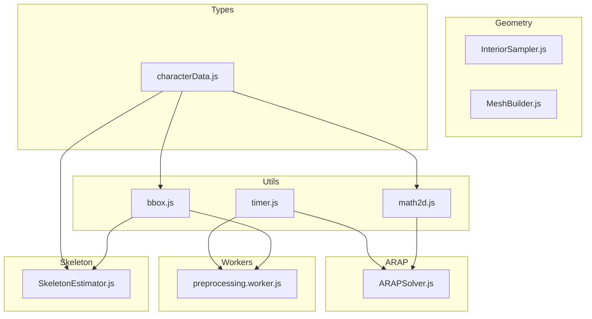
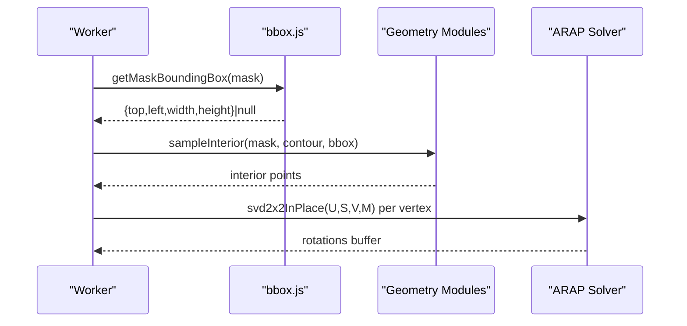
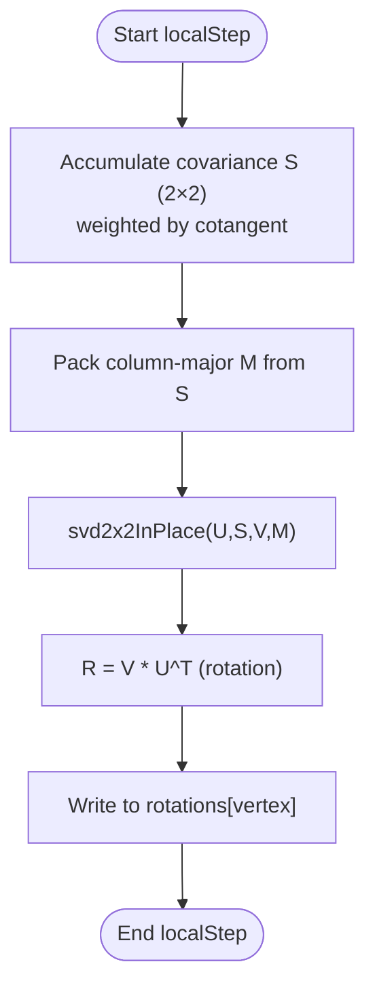
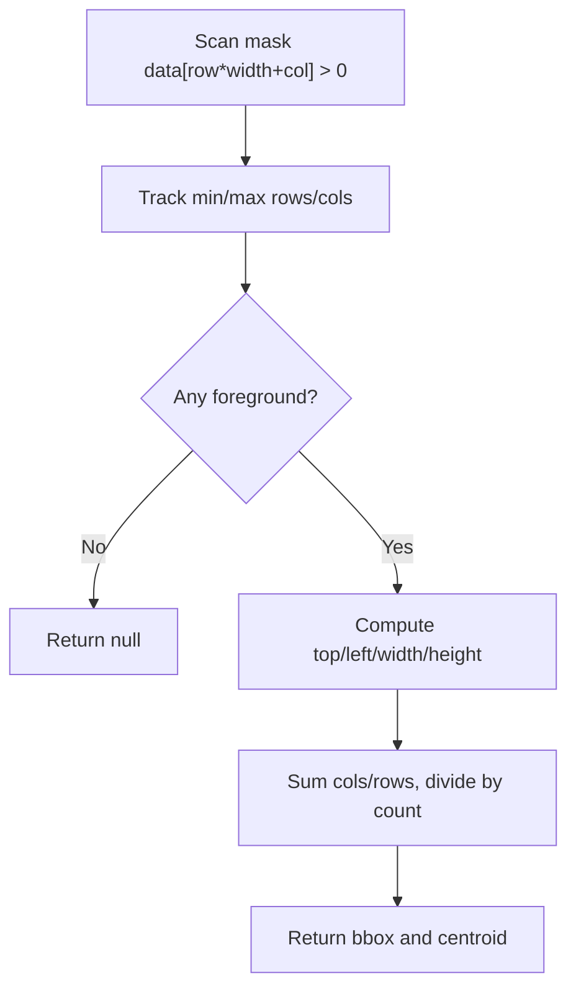
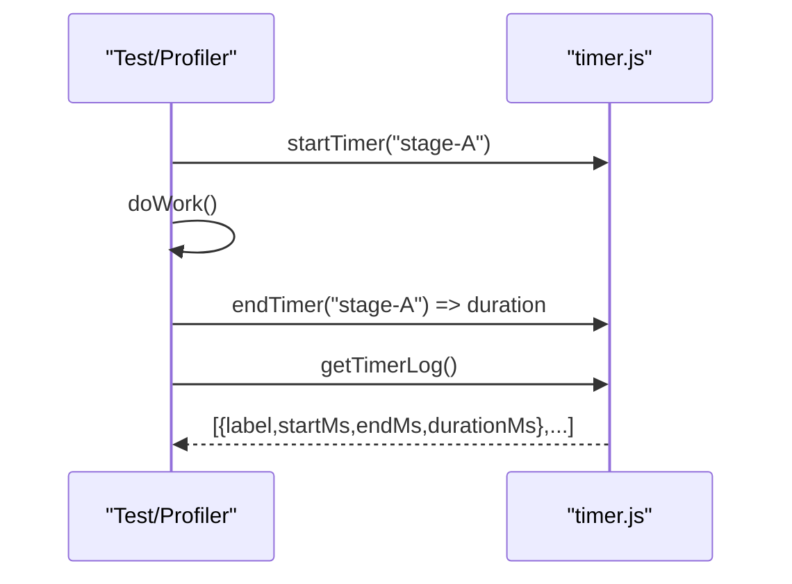
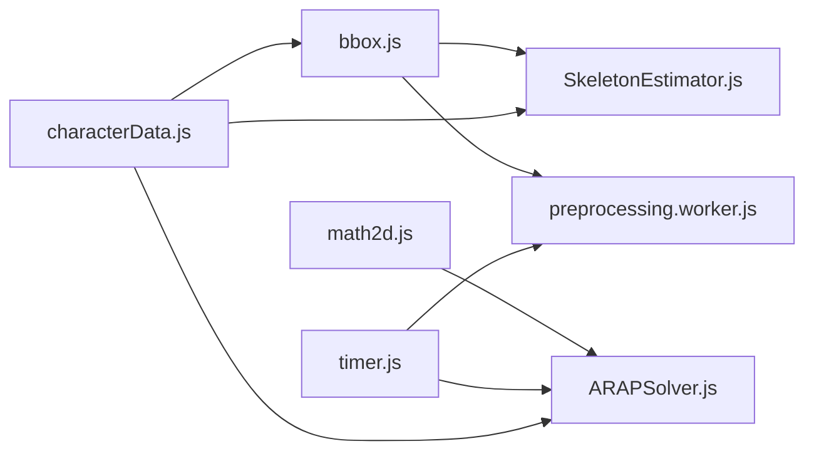

# Utility Systems

<cite>
**Referenced Files in This Document**
- [math2d.js](file://src/utils/math2d.js)
- [math2d.test.js](file://src/utils/math2d.test.js)
- [bbox.js](file://src/utils/bbox.js)
- [bbox.test.js](file://src/utils/bbox.test.js)
- [timer.js](file://src/utils/timer.js)
- [timer.test.js](file://src/utils/timer.test.js)
- [ARAPSolver.js](file://src/arap/ARAPSolver.js)
- [preprocessing.worker.js](file://src/character/workers/preprocessing.worker.js)
- [SkeletonEstimator.js](file://src/skeleton/SkeletonEstimator.js)
- [characterData.js](file://src/types/characterData.js)
</cite>

## Table of Contents
1. [Introduction](#introduction)
2. [Project Structure](#project-structure)
3. [Core Components](#core-components)
4. [Architecture Overview](#architecture-overview)
5. [Detailed Component Analysis](#detailed-component-analysis)
6. [Dependency Analysis](#dependency-analysis)
7. [Performance Considerations](#performance-considerations)
8. [Troubleshooting Guide](#troubleshooting-guide)
9. [Conclusion](#conclusion)

## Introduction
This document details PaperAlive’s Utility Systems with a focus on mathematical and helper functions. It explains:
- 2D vector operations and linear algebra primitives
- Geometric utilities for masks and spatial computations
- Performance timing utilities for profiling
- Mathematical foundations underpinning geometry processing and ARAP physics
- Practical usage patterns and integration points
- Testing approaches and numerical precision considerations
- Optimization techniques for geometric computations

## Project Structure
The utility subsystem resides under src/utils and is consumed by geometry, skeleton, ARAP, and worker modules. Type definitions for mask and geometry data are centralized under src/types.

**Diagram sources**
- [math2d.js:1-459](file://src/utils/math2d.js#L1-L459)
- [bbox.js:1-80](file://src/utils/bbox.js#L1-L80)
- [timer.js:1-93](file://src/utils/timer.js#L1-L93)
- [ARAPSolver.js:1-337](file://src/arap/ARAPSolver.js#L1-L337)
- [SkeletonEstimator.js:1-114](file://src/skeleton/SkeletonEstimator.js#L1-L114)
- [preprocessing.worker.js:1-374](file://src/character/workers/preprocessing.worker.js#L1-L374)
- [characterData.js:1-254](file://src/types/characterData.js#L1-L254)

**Section sources**
- [math2d.js:1-459](file://src/utils/math2d.js#L1-L459)
- [bbox.js:1-80](file://src/utils/bbox.js#L1-L80)
- [timer.js:1-93](file://src/utils/timer.js#L1-L93)
- [characterData.js:1-254](file://src/types/characterData.js#L1-L254)

## Core Components
- math2d.js: Pure 2D vector and 2×2 matrix utilities, analytic SVD for 2×2, and cotangent computation for discrete differential geometry.
- bbox.js: Axis-aligned bounding box and centroid computation for BinaryMask images.
- timer.js: Lightweight performance measurement using performance.now() with logs and retrieval helpers.

These modules are intentionally small, pure, and allocation-conscious to support high-frequency usage in geometry and physics pipelines.

**Section sources**
- [math2d.js:1-459](file://src/utils/math2d.js#L1-L459)
- [bbox.js:1-80](file://src/utils/bbox.js#L1-L80)
- [timer.js:1-93](file://src/utils/timer.js#L1-L93)

## Architecture Overview
The utilities are foundational building blocks:
- math2d.js powers ARAP local steps (per-vertex SVD) and general 2D transforms.
- bbox.js supports preprocessing stages that rely on mask geometry (contour tracing, interior sampling, mesh building).
- timer.js enables profiling of preprocessing and solver steps.

**Diagram sources**
- [preprocessing.worker.js:119-141](file://src/character/workers/preprocessing.worker.js#L119-L141)
- [bbox.js:17-47](file://src/utils/bbox.js#L17-L47)
- [ARAPSolver.js:136-200](file://src/arap/ARAPSolver.js#L136-L200)

## Detailed Component Analysis

### 2D Math Utilities (math2d.js)
- Vec2 operations: creation, addition/subtraction, scaling, dot product, linear interpolation, length, normalization.
- 2×2 matrix operations: identity, multiplication, determinant, supporting both column-major Float32Array and row-major arrays.
- SVD 2×2: Analytic Jacobi-based decomposition enforcing proper rotations, returning U, S, V with sorted singular values and sign-flip logic for determinants.
- Cotangent: Stable cotangent of an angle in a triangle with degeneracy handling to avoid Inf/NaN.

Integration pattern:
- ARAP solver uses svd2x2InPlace to compute per-vertex rotation tensors without allocations.

Practical usage examples:
- Vector arithmetic and normalization for displacement and direction.
- Matrix-vector products and covariance assembly for local ARAP updates.
- Cotangent weights for mesh Laplacian construction.

**Diagram sources**
- [ARAPSolver.js:136-200](file://src/arap/ARAPSolver.js#L136-L200)
- [math2d.js:264-419](file://src/utils/math2d.js#L264-L419)

**Section sources**
- [math2d.js:14-459](file://src/utils/math2d.js#L14-L459)
- [ARAPSolver.js:136-200](file://src/arap/ARAPSolver.js#L136-L200)

### Bounding Box and Centroid Utilities (bbox.js)
- getMaskBoundingBox: Scans foreground pixels to compute axis-aligned bounding box; returns null if none found.
- getMaskCentroid: Computes center of mass of foreground pixels; returns null if none found.

Integration patterns:
- SkeletonEstimator uses bbox and centroid heuristics to initialize joint positions.
- preprocessing.worker.js computes bbox to guide vertex budget enforcement and interior sampling.

**Diagram sources**
- [bbox.js:17-79](file://src/utils/bbox.js#L17-L79)

**Section sources**
- [bbox.js:1-80](file://src/utils/bbox.js#L1-L80)
- [SkeletonEstimator.js:89-113](file://src/skeleton/SkeletonEstimator.js#L89-L113)
- [preprocessing.worker.js:119-141](file://src/character/workers/preprocessing.worker.js#L119-L141)

### Performance Timing Utilities (timer.js)
- startTimer(label), endTimer(label): Record elapsed milliseconds using performance.now().
- getTimerLog(): Copy of completed measurements; getLastEntry(label): most recent entry.
- clearTimerLog(): Reset logs and active timers.

Usage patterns:
- Profile preprocessing pipeline stages and solver steps to detect regressions and hotspots.

**Diagram sources**
- [timer.js:34-92](file://src/utils/timer.js#L34-L92)

**Section sources**
- [timer.js:1-93](file://src/utils/timer.js#L1-L93)
- [timer.test.js:1-147](file://src/utils/timer.test.js#L1-L147)

## Dependency Analysis
- math2d.js is imported by ARAPSolver for zero-allocation SVD per vertex.
- bbox.js is imported by SkeletonEstimator and preprocessing.worker.js for geometry-aware heuristics and sampling.
- timer.js is used by ARAPSolver and preprocessing.worker.js for profiling.
- characterData.js defines BinaryMask and other types used by bbox.js and geometry modules.

**Diagram sources**
- [ARAPSolver.js:14-59](file://src/arap/ARAPSolver.js#L14-L59)
- [SkeletonEstimator.js:17-41](file://src/skeleton/SkeletonEstimator.js#L17-L41)
- [preprocessing.worker.js:24-26](file://src/character/workers/preprocessing.worker.js#L24-L26)
- [timer.js:22-27](file://src/utils/timer.js#L22-L27)
- [characterData.js:18-22](file://src/types/characterData.js#L18-L22)

**Section sources**
- [ARAPSolver.js:14-59](file://src/arap/ARAPSolver.js#L14-L59)
- [SkeletonEstimator.js:17-41](file://src/skeleton/SkeletonEstimator.js#L17-L41)
- [preprocessing.worker.js:24-26](file://src/character/workers/preprocessing.worker.js#L24-L26)
- [characterData.js:18-22](file://src/types/characterData.js#L18-L22)

## Performance Considerations
- Allocation-free design:
  - math2d.js provides in-place variants (e.g., svd2x2InPlace, addInPlace) to avoid GC pressure in tight loops.
  - ARAP solver pre-allocates buffers and reuses them across frames.
- Data layouts:
  - Vec2 returned as plain arrays for ergonomics; matrices use Float32Array in column-major order for GPU-friendly math.
- Numerical stability:
  - SVD includes degeneracy checks and sign-flip logic to maintain proper rotations.
  - Cotangent clamps near-degenerate triangles to finite values.
- Profiling:
  - Use timer.js to measure preprocessing and solver durations; track regressions across iterations.

[No sources needed since this section provides general guidance]

## Troubleshooting Guide
- SVD returns unexpected values:
  - Verify input matrices are well-conditioned; check determinant enforcement and singular value ordering.
  - Confirm column-major layout when passing matrices to svd2x2InPlace.
- Bounding box or centroid return null:
  - Ensure mask has foreground pixels; confirm BinaryMask shape and data indexing.
- Timer reports negative or zero durations:
  - Ensure matching startTimer/endTimer pairs; overlapping labels overwrite previous timers.
- Tests failing due to floating-point tolerance:
  - Use near/nearVec/nearMat helpers with appropriate tolerances in unit tests.

**Section sources**
- [math2d.test.js:17-32](file://src/utils/math2d.test.js#L17-L32)
- [bbox.test.js:56-82](file://src/utils/bbox.test.js#L56-L82)
- [timer.test.js:31-62](file://src/utils/timer.test.js#L31-L62)

## Conclusion
PaperAlive’s Utility Systems provide efficient, numerically robust primitives for geometry processing and physics simulation:
- math2d.js supplies fast 2D vector/matrix ops and stable SVD for ARAP.
- bbox.js enables geometry-aware heuristics and sampling.
- timer.js offers lightweight profiling for optimization.
Adopting in-place operations, careful numerical handling, and targeted profiling ensures smooth performance in interactive scenarios.